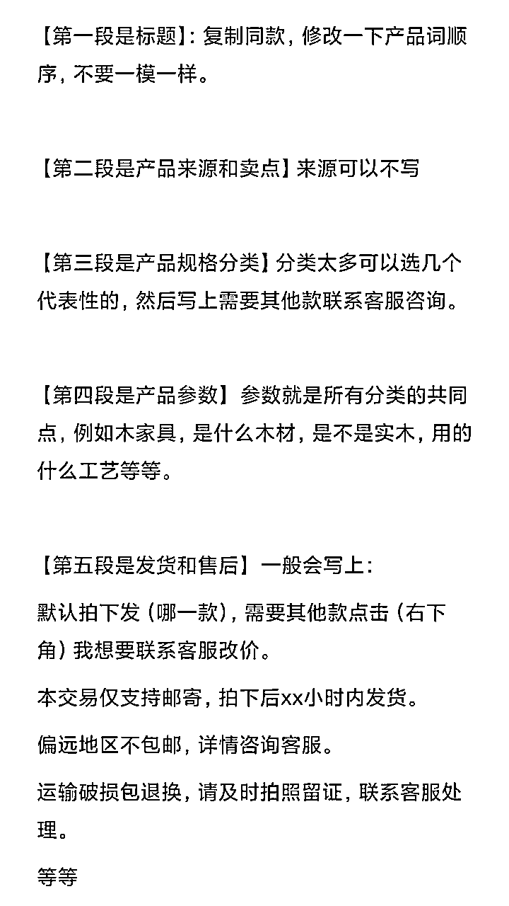
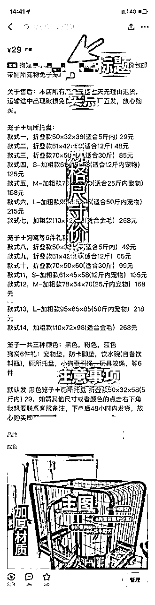

# 不会写闲鱼文案？别担心，万能模板来了！

> 来源：[https://wi0p58be3a2.feishu.cn/docx/A7midihgpo0C0FxNxJvcW6ywnmb](https://wi0p58be3a2.feishu.cn/docx/A7midihgpo0C0FxNxJvcW6ywnmb)

大家好，我是甜橙，95后职场副业斜杠青年，一个专注做副业搞钱的女生。希望能和大家交个朋友~

很多伙伴问甜橙：做闲鱼文案怎么写，转手理由怎么写的合情合理合法？

实际上，合法平台会帮你判断，合情合理是你需要做的，写好文案，会让客户对你的印象好不少

所以文案一定要好好写哦（编）

为什么？优秀的文案可以直接影响产品的高曝光率和销量。

于是今天甜橙来与大家分享关于如何写优秀的闲鱼电商文案的技巧和方法啦~

无论你是闲鱼电商的新手还是有一定经验的卖家，甜橙都希望能通过本文帮助你提升卖家产品的曝光量和销量~

目录：

一、为什么要重视闲鱼文案？

二、闲鱼文案要素组成有哪些？

三、闲鱼万能文案模板

# 一、为什么要重视闲鱼文案？

在开始今天的文章前，甜橙先问大家一个问题：我们作为专业的卖家为什么要在打造文案上面下功夫呢？

闲鱼这个平台是卖二手货的。那我们写文案，就要让顾客觉得咱的东西好，值得买才行。因为只有这样，她才会心里舒服地下单。

有了好的文案，能够打造出独特的卖点，表达的正是客户的需求点上，就能够稳稳的抓住用户心理、从而促成交易。而且，客户能感到我们很靠谱，信任度也会提高。所以，写得详细一点，就算遇到问题，我们收益也能比别的卖家高

尤其是在同款产品很多、价格相似等情况下，想让自己的宝贝脱颖而出

文案无形中成为了卖家不得不重视的细节

如果说标题是为了让更多的用户更好地找到我们的产品

那么文案则是吸引点击浏览产品的用户来咨询或者下单

文案的吸引力会直接影响浏览产品用户的咨询率

有吸引力的文案可以让卖家迅速获得订单

并且会让闲鱼平台认为这是一个优质的商品

从而获得优先展示权和排名。

# 二、闲鱼文案要素组成有哪些？

1.30字标题

2.转手原因

3.产品介绍

4.产品规格

5.发货时间

6.注意事项

7.售后流程

# 三、闲鱼万能文案模板

## (一）标题

对于自媒体人来说，标题的重要性是不言而喻的，同样对于做闲鱼电商的人来说，标题也是至关重要的。

作为文案的一部分，标题是影响嫌疑曝光最多的因素之一。

如果你正在寻找一个好的标题，我推荐你去拼夕夕寻找。你可以搜索相同商品，找到销量在500到5000之间的中间价格区间的商品。

标题通常在30个字符左右，当复制标题时，请确保没有遮盖关键词。

除了选取产品关键词，复制电商平台30个字符，开头也可以加上一些标语吸引买家注意。

如：门店撤店、门店转型、厂家清货、厂家直销、最后几个、特价处理、全新未拆封、全新包邮、亏本清仓、店铺关门、限时特价、仓库搬迁、特价捡漏、大量闲置、低价直出、全新处理、现货秒发

## （二）转手原因

1.因外包装破损、磨损或者污损，无法正常销售， 所以便宜出售。

2.工厂股东闹矛盾，经营不善，所有库存低价处理，一件也按批发价！

3.公司回款回不上来，急需给工人发工资，出厂价处理，同等品质，别家最少多200+

4.工人没有及时清点库存，发现囤多了，赔钱出一部分图上有对应的价格都是全新包邮的这个价格自己看着都心疼，快来捡漏！

5.仓库租期到了，清理库存，低价出售！

6.本人准备合伙经营东店，进了一些货，合伙人临时有事退出，无奈低价处理，产品都是全新的，质量肯定是没问题的，这个可以放心哈！

7.照顾孩子读书没时间管店子，门面不租了，迫不得已清库存，需要速速下手，数量有限！

8.常年在外打拼很想家，所以决定今年把工厂搬到老家，现低价处理库存

9.之前做电商囤的货，缺乏经验，导致连续亏损，现在还有一点货，全部亏本包邮处理，含泪甩！都是全新未拆的！

10.外贸公司毁约，几个柜的货不要了，库存在仓库，只能含泪甩，都是亏本价，老板们不要在砍价了！

## （三）产品介绍

产品介绍在商家宝贝官方介绍中找即可。如果你不想打字，可以使用图片提取文字功能的软件来提取信息。重点是要了解宝贝的材质、功能、性能、作用、尺寸等方面的信息，但不要过于冗长。

对于没有货源的情况下，我们最好强调商品的实际情况，以免与买家产生争议。

一般情况下，它的产品卖点都是在pcc的评论里面还有详情页里面我们可以适当的去提炼，产品的特点呢一般建议是到4到6条。

## （四）产品规格

在宝贝下拉菜单中可以获取该宝贝的具体型号和规格。现在智能手机已经普及了图片文字识别功能，可以直接截图并提取文字，省时省力。

对于新手玩家，建议将宝贝的利润设置在10%到20%之间。

对于规格较多的产品，可以选取前几个价格较低的规格，或者参考商家销售较好的规格。

## （五）发货与验收

1.适用于普通商品:

本交易仅支持邮寄，偏远地区不包邮。

我们的产品都是经过仔细检查后发货，收到包裹签收前请务必开箱验货，有问题拒收。若已签收，默认宝贝完好无损。

偏远地区不包邮，先拍先得!拍下后48小时内发货，非质量问题不退不换，感谢理解!

本次因为是清仓处理，全国除偏远地区外均包邮送货上门，机会难得!下单后请与客服确定收货地址48小时内急速发货。

2.适用于大件商品:

本次交易仅支持邮寄，打木架包装物流运输，偏远地区不包邮，拍下后72小时内发货。不接急单，介意者勿拍。

本产品为保证全新未拆封正品发货!高价值大件商品，快递运费昂贵，快递一定要确认无损后再签收。如非产品质量问题不支持退换货，请谨慎考虑后下单。如出现问题，运费自己承担。

运输途中难免会磕磕绊绊，如果万一有点小伤痕凹陷磕碰，基本上不影响使用，敬请谅解，介意的还请慎拍哈。

## （六）售后和注意事项

我们只追求品质，口碑永远第一，本人芝麻信用极好，所售商品保证品质！放心购买！

本小店长期与厂家合作出售各种物品，均以厂家价格低价出售，欢迎大额订单

声明：这本就是易损物品，而且都是未拆封的。如果不是损坏问题，就不再退换，望大家理解。

本人芝麻分800分，信用极好，卖的商品均有质量保证，有任何问题包退换。

默认拍下发XXX，需要其他款式请点击右下角-我想要-联系我。

需要其他型号的点击下方“我想要”咨询后下单改价!

(闲鱼卖货流程：闲鱼卖货全流程步骤，手把手教你卖货！）

详细文案模板参考一下图片

本文标签：闲鱼文案、闲鱼副业、闲鱼无货源、闲鱼卖货经验、上班族副业、宝妈副业、大学生副业

以上就是今天分享的内容啦，我们下次见~

往期文章：

1、《闲鱼卖货全流程步骤，手把手教你卖货！》

2、《闲鱼曝光底层逻辑及提升闲鱼曝光快速出单的两大诀窍！》