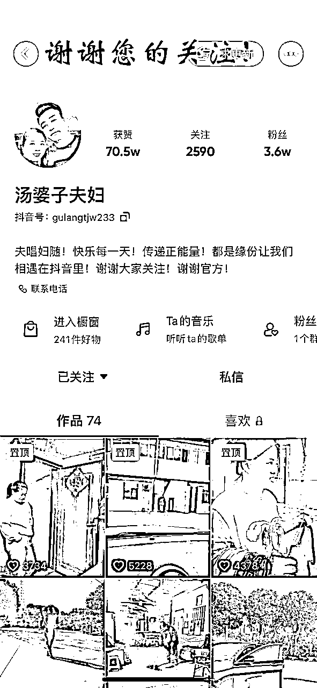
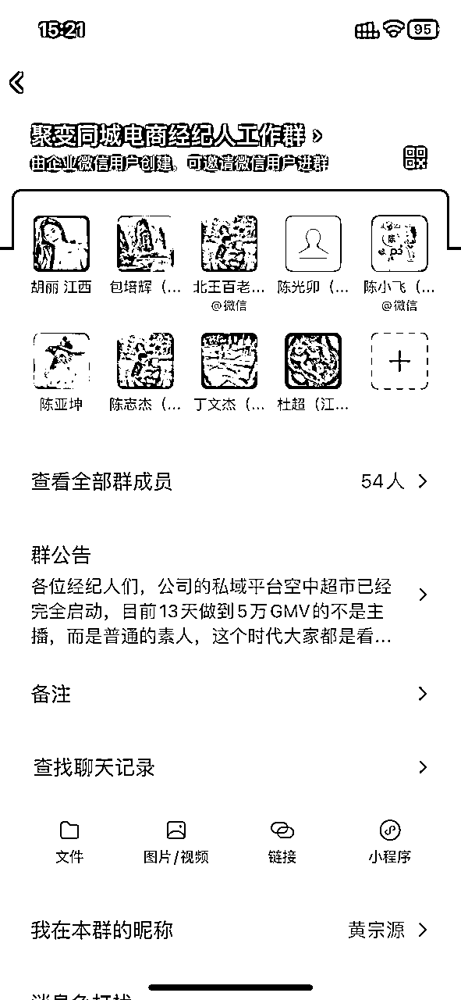

# 抖音的最后一片绿洲——打造稳定月入5万且可复制的同城电商IP

> 来源：[https://i0h0efctgt0.feishu.cn/docx/ADUrdLAlQoPBzWxvNilcQ2xxnjh](https://i0h0efctgt0.feishu.cn/docx/ADUrdLAlQoPBzWxvNilcQ2xxnjh)

# 引言

今天我给大家提到的“抖音同城电商IP”并非市面上大家老调重弹的“同城探店号”或者是“同城商家号”等等，花十分钟时间看完，给你分享我用三年时间走出来的一条通路！这是我认为当下抖音的最后一片绿洲！

大家好，我是宗源，聚变同城电商MCN的创始人，2024年是我创业的第九个年头！2015年大学实习的我开启创业之路，那时正值国内互联网浪潮的鼎盛时期，我的创业想法：不做创新，直接抄袭！所以将一线城市互联网020洗衣的项目模式搬到江苏常州这个三线城市再复制一遍，用两年的时间复制出10多家门店。2018年我跳出团队选择在新媒体行业继续创业，直至2021年都是以TP代运营业务来保持公司生存，虽然已经“猎杀”区域内多家头部企业客户，但是长期处于吃不好也死不了的发展状态，在新媒体行业创业的这前三年，我不停的在寻找“可复制化的垂直赛道”，因为我秉承的想法就是：小而美且可复制的生意才是好商业。而我找到这个“赛道”要从2021年的7月份开始说起，接下来话不多说直接切入正题：我是如何“淌出”这条少有人问津的蓝海赛道的——抖音同城电商IP！

# 缘起

2021年的7月份，公司合伙人介绍一位服装店的老板娘花姐来司合作，正值疫情期间实体门店举步维艰，花姐是本地人，有一个3万多粉丝的抖音号，账号的内容大多数都是一些自拍和在服装店内的一些段子，但是短视频的语言多为：常州方言，我们通过交流后：计划让花姐开始在抖音卖百货。开播的第二个月，花姐的抖音账号就快速实现了月佣金5万+，而我们没有投入任何的付费流量，截止至今橱窗销量已经达到35万+，两年多时间产生百万佣金！

随后我们在常州市场继续寻找到了同属性的主播：“汤婆子夫妇、七七、高小兔“，用同样的运营方式也快速的让她们拿到了结果：月收入均达到了5万+，橱窗销量突破10万+（截图为初期留存）

# 一个思考：她们成功的本质是什么？

1.符合平台逻辑：讲方言可以快速让抖音账号建立同城标签获得同城流量，吻合抖音的推流逻辑

2.解决消费信任：流量和销量之间永远要解决一个问题：信任！而方言主播所激发的”老乡情“天生自带信任感

3.相当细分的赛道：把抖音电商玩成同城化，私域化，在同城内卖货竞争小，出圈快

4.错位竞争：同城电商达人的竞争对手根本不是：大网红！而是：同城的大商超！价格优势碾压商超

5.人货场的完美搭配：看惯了节奏感超强，大场面的网红带货直播间，再来看看居家有烟火气的老乡直播间，亲切感和信任度油然而生，同城电商达人多为35岁+的女性，跟老乡粉丝之间的共情速度极快，而所售商品为百货，都是生活刚需品，人货场相当匹配。

# 第一个阶段成果：在抖音上开起了“同城百货超市”

在所有人提及抖音电商，90%的脑子里都在思考”如何把一个产品卖到全国去“或是”打造某一个领域的垂直头部网红“亦或是”通过抖音吸引同城流量给实体或者同城项目引流“的时候，我们相信自己打造不出“李佳琪or罗永浩”，但是我们可以打造属于每个城市卖货的小明星，我们集全国各地有优势的货源往同城市场来打，而这一想法得到了验证，它是可行的。也有大部分的朋友在听到抖音同城电商都会误认为：我是培养了一批同城探店类的达人或是卖团购劵等等，在我选择项目的时候，我永远要考虑底层逻辑，我觉得探店达人这个市场一直会存在，但是当一家公司组织来做的话肯定不会活的特别好，一方面是市场比较内卷，更多的是卖货讲究：人货场，而探店达人所推荐的团购券都是服务业的非标品，消费者去核销后体验度不一样，就很难为探店达人养成有信任度的人设，而事实证明，更多的探店达人已经不具备消费的引导力，因为他在消费者的心中已经形成“谁给钱就说谁好”的纯营销人设。我们所培养出的同城电商IP，可以说是通过抖音快速成长成为同城KOC（消费者领袖），我们作为运营公司，为她们提供运营和供应链，帮助其成功成为同城百货超市的老板娘。

# 能否复制到其他城市去？

2022年的上半年国内还处于疫情封禁期间，我联系了江苏苏州和泰州的好友，计划在这两个城市尝试项目的复制，在苏州市场我们物色到了：“堂一静”，在泰州市场物色到了：大聪明诺诺和小辣椒。先谈苏州市场，当时”堂一静“这个达人是当地村委会工作了11年的公职人员，我们是2022年8月11号首场开播，到9月份她就把村委会的工作辞职全职抖音带货，堂一静最初的账号的粉丝模型其实团队并不是很看好，因为男粉比例达到了80%，但是粉丝苏州占比超过70%，通过人货场的重新塑造，经过三个月的时间，堂一静从月销10万达到了月销30万+，目前已经稳定月收入5万+，同时账号的短视频和直播的粉丝模型已经洗成女粉占比80%以上，通过堂一静这个案例，我们在同城达人的培养目标中加入了：只要同城粉丝占比高，也可以通过后期人货场的调整来重塑账号的流量模型，但是需要一定的时间和达人的耐心。随后我们同期的大聪明诺诺和小辣椒也纷纷拿到了结果，都是在开播当月就实现了月入过万，目前也都达到了稳定的月入5万+。随着多个市场复制成功，我们确定了赛道的可复制性以及逐渐标准化运营模式+供应链，包括跟主播的合作模式。我们跟同城达人的合作模式是带货佣金的37开，公司拿3达人拿7，我们不在一个主播身上挣100万，而是在100个主播身上每人挣1万。

# 如何更快的复制？

截止2023年，我们已经完成了抖音同城短视频电商项目的0-1，在江苏省内常州、苏州、无锡、泰州、南通、扬州复制成功，在省外江西、天津、广州也均拿到结果，成就了几十位同城达人实现改命！接来下我们真正需要沉下心思考如何可以更快的复制市场，完成我们的1-10。

这个阶段我们要解决“项目稳定的流量入口”和“标准化的交付流程”。先谈这个阶段我们要的流量是“更多符合要求的主播”，如何触达她们？在这个问题上我们采用的是“网红经纪人的招商模式”，即我们先招募认可项目的网红经纪人（城市星探），给他们一套寻找同城达人的方式，然后达人跟公司签约，公司运营交付所产生的佣金跟网红经纪人分配，初定这个打法后我们通过抖音的招商博主进行拍摄项目短视频来招商，一个星期的时间我们招募了40人+的网红经纪人，在随后一个月中公司签约主播的数量也得到了倍增，但是始料未及的是：项目利润并没有可见性的增长。我放慢了脚步寻找当中的原因，总结有三点：1.网红经纪人感觉像“皮条客”，卖给公司后不在有任何交付坐等分钱，让新签达人没有安全感，而新达人在初期需要有坚定的心态才能坚持拿到结果。2.网红经纪人没有经过运营培训，缺少达人的运营经验，经纪人要有一定的眼光才能挖掘到好种子，所以网红经纪人签约达人的资质相对较差。3.达人签约完全0门槛，没有任何成本，达人的主观能动性相对减弱，导致交付的边际成本过高。创业就是如此，我们需要在恰当的时间，让自己慢下来复盘一下，短暂的得失并不重要。

2023年10月份，经过对项目的复盘，我开始决定开启“同城素人培训板块”，这个板块是我对项目增加可复制性的补充，也是对项目整个闭环链路的设计。我采用的方法是：让已经拿到结果的同城达人发短视频招募学员，她们已经是所在城市的自媒体，同时自己也是活案例，这个方法十分奏效，四天时间就聚集了60人+的线下课和大大小小的百人的线上学习群，目前我们培训孵化素人成为同城达人的成功率在70%，成功的标准是两个月内听说照做稳定月收入3000元+，培训板块的突破也是我们“以培代招”策略的成功，在项目的初始阶段，我们主要是赋能市场中已经有一定同城流量但是还未变现的0.5的达人实现电商化，但是每个城市0.5的存量市场是一定的，开发也需要有一定的周期，如果我们能够打通0-0.5阶段的同城素人培训，那么我们将打开更大的市场。

当打通了"0-0.5的同城培训板块“+”0.5-1的同城达人电商变现板块“后，我们依旧回到”如何更快的复制“这个问题上，我们在每个城市到底需要一个什么样的角色，才能更快的撬动市场，它要具备一定的”运营能力“+”媒介能力“，我称他为：同城电商IP操盘手！参照市场上做IP操盘手培训的海参哥，必定要通过线下的陪跑，然后匹配合适的资源，才能够助力IP操盘手起盘。当有了这个思维后，开始试点我们几个城市的合作商进行IP操盘手内训，目前天津市场的合作商已经达到稳定月收入5万+，其所在城市的同城达人”九九顺利“等已经月销100万+，非常有成效！

# 总结

经济下行已经是大家所接受的事实，在当下这个时代，我们选择项目会考虑“现金流，少投资，刚需品，可复制”的生意，在短视频时代，机会虽然很多，但是确实也要正视自己的能力，2021年我选择同城电商达人这个市场，也是避开头部MCN机构的市场战略，做他们”瞧不上“的生意，但是越是小众市场，才越有大机会。中国电商资源主要集中在杭州和广州，而对于三四五线城市电商资源十分匮乏，而这样的城市中依旧已经有很多有着不错流量的方言主播或者存量主播，我们的目标市场不在大城市，就是整合各个小城市的资源，通过整合，我们将以蚂蚁雄兵的电商模式完成我们多个城市的同城电商矩阵，在业务线以培训为流量入口，以电商为利润点，整合城市供应链，强化区域营销的核心竞争力，打造一个个小而美的区域电商市场。历经三年，项目不停的打磨与迭代，我相信人生没有弯路，每一步都很重要，欢迎有志之士来共创，市场很大，干就完了。