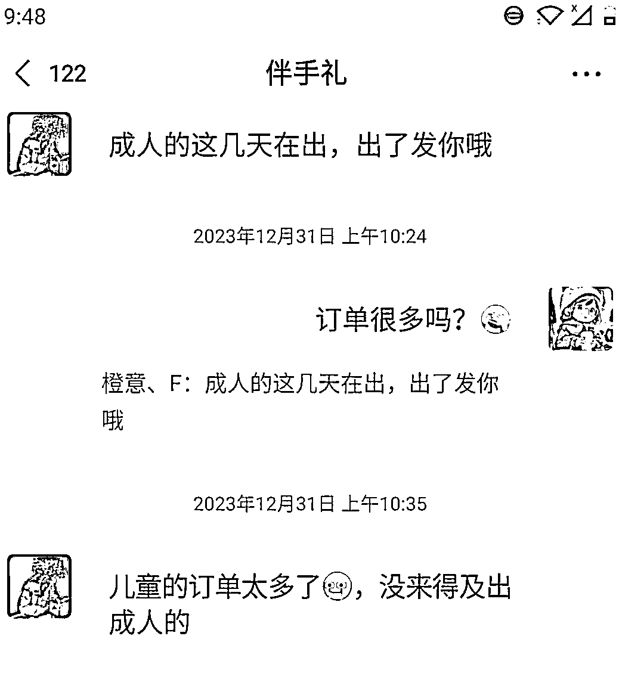

# 《小红书送礼账号真的赚钱吗》--罗破帽

> 来源：[https://rtsb53rqg1.feishu.cn/docx/GpUFdhNBloHZQzx1jUJcGJnCnxd](https://rtsb53rqg1.feishu.cn/docx/GpUFdhNBloHZQzx1jUJcGJnCnxd)

# 一、供需关系

## 1.需求端

### 市场前景

*   2018-2022年中国礼物经济产业市场规模从8000亿元增至12262亿元，呈逐年递增趋势;预计2024年中国礼物经济市场规模将达13777亿元，2027年达16197亿元。

*   礼物经济，是一个万亿级别的市场！

图片来源：艾媒数据中心

### 送礼场景

如图所示，送礼场景包括节日、商务、日常、婚礼等

### 送礼人群

### 需求分析

*   送孩子礼物，体现出爱的需要

*   送朋友礼物，是为了增进友谊的需要

*   送情侣礼物，体现出爱与归属感的需要

*   送客户礼物，让客户感受被重视的需要

*   送长辈礼物，体现出爱与归属感和尊重的需要

*   送老师礼物，体现出尊重与感激之情的需要

*   送老板礼物，表达尊重、支持从而提高自我实现的需要

## 2.供给端

### 行业流量大盘

*   由于送礼涉及面比较广，第三方数据平台没有伴手礼行业模块，所以下面所列举的只是”饰品的行业流量大盘“。采用同样的思路，找到其他行业的流量大盘也是一样的。

### 细分赛道

*   不同场景的伴手礼的市场空间如何呢？我们都知道，关键词搜索出的数据，背后代表的是一个群体的需求表现。通过关键词搜索就很容易发现不同群体的需求。通过搜索关键词“伴手礼、礼物、礼品、送礼”，将“总参与人数”下不同的场景进行大小排序，即可推导不同送礼场景的市场空间。

"总参与人数"下不同的场景进行大小排序：

*   礼物：141.7w>98.3w>94.8w 生日礼物>情侣礼物>闺蜜礼物

*   伴手礼：28.7w >24.2w 婚礼伴手礼>商务伴手礼

*   送礼：#七夕攻略·送礼攻略#、#中秋节送礼# #过年送礼#都属于节日送礼范围，不具有可比性。

*   礼品：除了#礼品#外，其他话题标签都是属于商务范畴，不具有可比性

*   综上排序，可以得到一个结论：生日礼物市场>节日礼物市场>婚礼礼物市场>商务礼物市场。

*   当然，这样分析细分赛道是不严谨的。在伴手礼行业，只做单一市场赛道，收入天花板低。 市面上伴手礼商家业务范围都会包含3-4个市场，目的是为了提高收入。

## 创作者数量及笔记数

### 创作者数量

*   如图所示，每个”话题名称“所展示的数据都是由三个模块组成，分别为浏览量、总参与人数、浏览量。其中， 总参与人数排在第一的是#生日礼物# ，总参与人数为141.7w，去掉用户、非行业创作者发布的笔记数，可以从“”总参与人数“”数据中大概估算出行业历史创作者总数量。

（PS：总参与人数=去重后发布带有话题笔记的历史总人数）

*   从消费频次角度分析，生日送礼场景消费频率最高，理由是过生日可以是老人、小孩、青年等人群，消费人群涉及面广。

*   从单次购买量角度分析，在旺季的时候，做团购要比单购好；在淡季的时候，还是得依靠购买频率来维持。

### 30天内创作笔记数

*   去掉用户、非行业创作者发布的笔记数，从“30天关联笔记数”中可以大概估算30天内更新笔记的创作者数量，也就是活跃创作者数。

*   分析30天内创作笔记数的意义在于知道这30天内要和多少篇笔记竞争。

# 二、产品

## 常见礼品种类

## 产品偏好

*   礼品分为定制和非定制。用户是偏好定制还是非定制的礼品呢？为了解开这个疑问，我从第三方数据平台-灰豚数据获取到3000位做伴手礼的博主，复制他们的账号简介内容，导入微词云，得出排在第一位的高频词是“定制”，从而可以判断出伴手礼行业主要是以定制产品为主。定制产品，客单价高、利润高

## 产品来源

#### 自建仓库、云仓合作

*   这种模式适合实力雄厚的企业，在本地、跨区域自建仓库、云仓结合

#### 代发货

##### a.后端由供应商承接

*   达人负责前端引流，当客户下单后，再把客户需求传达给供应商，由供应商负责设计、生产、发货、售后等环节，这个模式适合无货源达人、线上商家。

##### b.供应商负责生产、发货

*   商家收到客户的订单后，先把之前自己设计好的样品发给供应商，然后由供应商负责生产、发货。这个模式适合工作室、线上商家、实体店商家。

*   代理人负责前端引流，当客户下单后，先把客户需求传达给商家，然后商家传达到供应商，由供应商负责生产、发货环节，这个模式适合代理人

# 三、流量

## 获客方式

### 线上获客

*   线上开店

*   账号矩阵化

*   代理人裂变

*   多平台分发

### 线下获客

*   自然流量

*   异业合作

## 引流方式

*   昵称改为微信号

*   发布“Ta的瞬间”留微信

*   线下门店地址留“手机号”或“微信号”

*   简介@小号/主页留“小程序”或“微信号”

*   店铺咨询客服，客服发微信或引导用户发微信

*   引流笔记置顶或群聊“置顶微信”或群公告留微

# 四、营销

### 内容营销

*   内容形式：图片/视频

*   单次发文数量：1条or2条or3条

*   更新频率：定时更新/不定期更新

*   内容类型：收益图/产品推荐/日常打包/学员实操

### 投流

### 私域营销

*   头像：品牌名

*   昵称：品牌名

*   简介：业务范围

*   朋友圈封面：店铺正面图/业务范围

*   朋友圈内容形式：图文为主

*   朋友圈更新频率：4-6条/天

*   朋友圈内容类型：订单图、收益图、产品推荐、工作日常、生活日常

# 四、变现

### 线上店铺

### 私域成交

### 收培训费

*   训练营

*   1对1陪跑

*   线上合伙人/代理人

收取代理费，前期线上培训，后期代理人在自媒体平台上发布内容，素材由商家/团队提供。只需要负责前端引流、后端由商家/团队负责；成交后，代理人收取佣金+商品差价

### 渠道费

*   单纯提供供应商名单，收取货源渠道费

### 加盟费

# 六、案例拆解

## 案例1

### 基本情况

*   店铺位置：重庆市沙坪坝区街道

*   店铺面积: 40平方

*   前期投入：6W

*   回本时间：2个月左右（多位代理人爆单）

*   人员：2个人

*   开业时间：2023年6月9日

*   有无线上店铺：无

*   业务范围：婚礼、生日宴、商务、儿童、升学等伴手礼

### 运营方面

*   账号名称：遇见礼高定伴手礼

*   粉丝数：901

*   账号类型：个人号

*   内容展现形式：前期图文，后期视频

*   笔记总篇数：63篇

*   更新频率：无更新规律

*   首篇笔记：2023年5月21日

*   内容类型：封面是收益图+情侣创业日常

*   有无矩阵：无

### 引流方式

*   置顶引流笔记

*   小红书昵称改为微信号

*   加群，引导用户阅读“群置顶引流帖”

### 收入估算

1.  线下自营店

| 单月销售额 | 利润率 | 纯利润 |
|  |  |  |

*   利润率来源：和10个伴手礼商家聊天获取到的信息，每个商家讲的利率润不同，但基本都是在35%-50%这个区间内，利润率高低取决于与客户、工厂谈单能力有关。

*   商家月销售额来源，如图所示：

图1

*   销售额的高低是跟季节（淡/旺)，人脉资源、客单价等因素相关联的，旺季销售额就高，淡季销售额就低。

*   对于刚入行且无人脉资源的新手来说，前期销售额普遍1W以下，上面列举的是在这行业做了半年或半年以上的有某项过硬技能商家的销售额数据，所以要理性看待，切入盲目入局。

*   图1是商家现在的月销售额10W，从这个商家“入行6个月的时间+2年多私域运营经验+旺季”三个维度来判断，12月份月销售额10W有可能是真的。

1.  培训费

| 名称 | 价格 | 报名人数 | 收入 | 注释 |
| 线上合伙人 | 699元 | 30 | 10485 | 适合做代理 |
| 训练营 | 2999元 | 未知 | 未知 | 适合开工作室/开店 |
| 1对1陪跑 | 9999元 | 未知 | 未知 | 适合开工作室/开店 |

*   商家是2023年6月9号开店。从朋友圈信息得知，以上3种培训模式是10月底才推出，截止到12月底线上合伙人有30+个。按照30人计算，两个月的时间，培训收入是20970元，平均每个月有15人报名成为线上合伙人，如图所示：

1.  综上，计算可得：

*   最低收入=单月销售额+单月培训费=35000+10485=45485元

*   最高收入=单月销售额+单月培训费=50000+10485=60485元

1.  因此，商家每月纯收入为：

*   最低：45485元

*   最高：60485元

### 其他商家收入情况

*   附上其他商家的收入，是为了让想入局的圈友更全面的了解伴手礼行业。

*   这个商家之前从事营销行业，有8年时间，转做伴手礼行业，有3年时间（信息来源小红书笔记）

*   从聊天以及观察她发的朋友圈，这个商家给出的数据可信度比较高

## 案例2

### 基本情况

*   公司位置：湖北武汉市

*   公司人数: 20-99人

*   公司性质：民营公司

*   注册资本：1000万

*   业务范围：伴手礼品、气球派对、空间花艺、个性定制等

### 运营方面

*   账号名称：上上喜伴手礼总部

*   粉丝数：1.3W

*   账号类型：企业号

*   内容展现形式：图文/视频

*   笔记总篇数：436篇

*   更新频率：1篇/天

*   首篇笔记：2021年6月13日

*   内容风格：学员日常、励志故事

*   有无矩阵:有

### 引流方式

*   加群聊

*   小红书"线下门店栏"留手机号/微信号

### 收入估算

| 名称 | 价格/GMV | 毛利润 | 人数/门店数 | 收入 |
| 直营店 | / | / | 600+ | 未知 |
| 经销商 | / | / | / | 未知 |
| 加盟押金 | 19900 | / | 500+ | 9950000 |
| 供应链合作 | / | / | / | 未知 |

*   直营店和加盟店数据来源如下图：

*   直营店和加盟店数量有待考证

## 案例3

### 基本情况

*   工作室位置：浙江温州瓯海区大厦内

*   工作室面积: 40平方

*   前期投入：未知

*   回本时间：未知

*   人员：3个人

*   开业时间：2021年4月9日

*   有无线上店铺：有

*   业务范围：定制儿童伴手礼（主要）、学生伴手礼（主要）、节日伴手礼、企业伴手礼、婚礼伴手礼、手作等

### 运营方面

*   账号名称： 橙意chengyi·伴手礼定制

*   粉丝数：4W

*   账号类型：企业号

*   内容展现形式：图文（主要）、视频

*   笔记总篇数：420篇

*   更新频率：无更新规律

*   首篇笔记：2021年5月2日

*   内容类型：产品推荐、日常打包

*   有无矩阵：有

### 引流方式

*   如果客户需要定制伴手礼，引导客户在店铺咨询栏发联系方式/微信

### 收入估算

#### 线上自营店

| 总销售额 | 利润率 | 纯收入 |
| 36374元 | 35%-50% | 12730.9元—18187元 |

*   由于线上店铺看不到月销以及所涉及的SKU近100种，已知店铺已售出1952件商品。还是按照行业内普遍毛利润35%-50%区间计算，计算出目前所售所有SKU销售额加起来的总销售额36374元，因为商家是不包邮的，所以利润相对比较高。

#### 线下自营店

*   线下自营店收入未知，和商家聊天以及观察朋友圈的信息得知，这个商家没有做线上培训，但是线下自营店收入是很可观的。

*   商家主要做儿童伴手礼、学生伴手礼为主。礼品设计是由自己和她女儿完成，产品由工厂生产、发货。

# 七、项目实操

# 八、风险评估与建议

## 平台政策

*   现在小红书严打导流行为、连企业号也规避不掉封号，除非加入平台白名单。和这些伴手礼企业号商家聊天过程中，明显感觉到他们对主动发微信或联系方式很谨慎；如果客户需要定制，要么在店铺完成，要么引导用户主动发微信或者在店铺内发送。所以，为了防止封号、建议备用2-3个账号以及学习同行安全引流方法

## 投入成本

*   对于新手来说，如果想要入局伴手礼行业，不建议一开始就想着开工作室或线下店铺。先从线上试错，和同城商家或异城商家合作。"学中做、做中学"，了解"选址-开店-选品-铺货-营销"整个闭环流程，同时积累资源，为开工作室/店铺打下基础。

## 靠谱的供应商

*   找到靠谱的供应商是这个项目的核心，新手刚入门伴手礼行业，前期的订单是非常少的。如何在订单非常少的情况下，让供应商愿意为我们打样、生产、发货，这也是要思考的点。