# AI+头条号，如何月入5000+

> 来源：[https://hdn8pwdl1l.feishu.cn/docx/C5v2dwjTroQA0px4NkAcdWFwnPd](https://hdn8pwdl1l.feishu.cn/docx/C5v2dwjTroQA0px4NkAcdWFwnPd)

我是一北，很感谢生财有术，之前一直在学习关于chatGPT+公众号写作的一些精华帖

因为我自己一直也在头条写作，所以就萌生了，通过AI写作头条号爆文的想法

经过尝试，也有所收获，今天无保留分享，再次感谢群内研究AI的台风、一来等几位老师的无私分享。

# 一、准备篇

## 1.账号准备

我们知道变现平台有：今日头条、百家号、公众号、网易号等，你是否都注册了？

## 2.认知准备

决定最终质量的是，你的能力

AI输出可能是40分、50分、60分，是否具备把这个内容提高到80分以上？这个是我们的问题

按概率论举例，你的输出能力是20%的爆款率

如果AI帮助下，你能力做到输出，从每天1篇提高到每天3篇，相当于你的能力提高了3倍

这是AI的作用

这里就又出了2个维度，第一个维度，我与AI，如何让AI提高输出效率和输出质量，关键是学习和磨合，从不熟悉AI到熟悉的过程，耐心、调整指令等，都很重要

第二个维度，提高我自己的写作能力，体系学习写作方法论，多拆解和模仿爆款，都是提高的过程

做好数据复盘，通过复盘发现自己的问题，然后不断提高

而最重要的，就是找对标账号

# 二、找对标账号分析爆火原因

无论做什么项目，第一步肯定是找对标账号，分析，复制模仿。

方法很简单，通过搜一搜输入相关关键词，再通过文末的推荐，多浏览几遍，系统也会给你的微信打上对应的标签，自动推送。

自我提问：我又没有3-5个对标账号？

如果没有3-5个对标账号，我认为你写不出爆款，没有变现也很正常，因为你压根不知道爆款内容是啥？为什么爆火

## 1.对标账号的2要素：

①近期日更多、爆款多

比如张晓磊，日更5-9条，爆款率在80%

②你看了之后，觉得可以模仿与对标

## 2.如何寻找对标账号

①从首页进

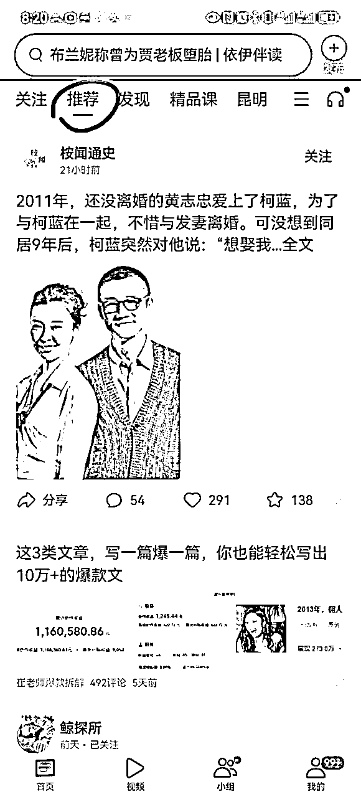

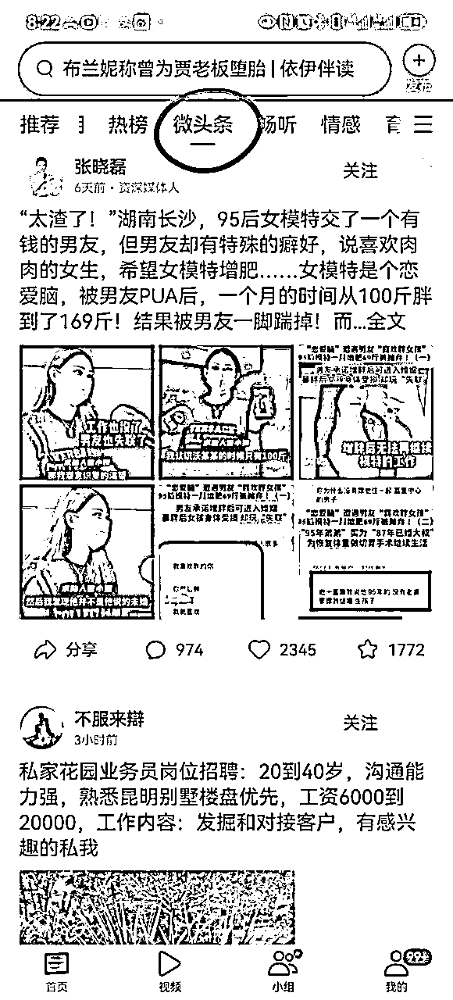

②用大数据推荐算法

也就是我们只看本领域的爆款，慢慢的平台给你推荐的全部是，你所在领域的爆款，从中选取账号。

③关键词

比如文史类

武则天、朱元璋、胡适等，一定都是热门词

比如情感类

婆媳、离婚、儿媳等等

还有账号名字：搜索“文史”“历史”“说史”“明史”等

## 3.疯狂拆解对标账号

### ①自己拆解学习

这是提升自己能力的关键，AI很强大，但在强大也离不开你的能力。

拆解对标账号，看看人家开头怎么写的、标题怎么写的、正文和评论是怎么写的

莫言说，写作都是从模仿开始的，模仿不是抄袭，而是学习其规律性

写文之前，要从选题开始，就要模仿对标账号

写文之后，要和对标账号的对比

①标题形式，我又没有做到极致模仿

②文章我又没有做到极致模仿

我在初期学习的时候，对标账号的爆款，全文多少字、开头多少字、结尾多少字、配图几张，都会拆解

到了开头：开头多少字，转折词在哪，用的那种模板，是故事梗概冲突法，还是细节提炼法？

我也都会模仿

对比回来，我的开头要用什么方法，模仿对标的那个开头以此类推。

### ②可以使用AI辅助拆解

这就是我们常常所说的，调教AI的过程，让AI了解我们要写的文章的风格，同时也把这种风格指令化。

这些指令，就是我们下一步让AI写作时，输入的指令。

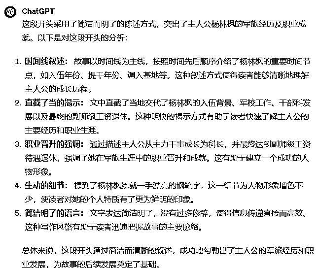

## 4.爆款最重要的2点

### ①一个吸人眼球的标题

对应微头条就是开头，爆文能爆有 7 成的原因是为标题起的好。大部分标题，都有的要素：反常、夸张、悬疑、转折、冲突的手法，很多也会植入权钱性。

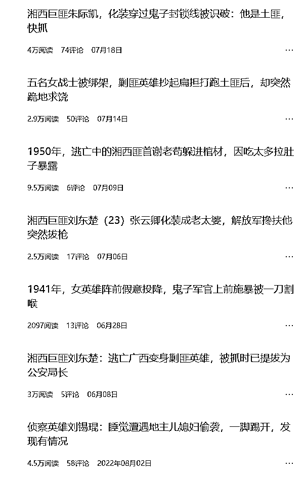

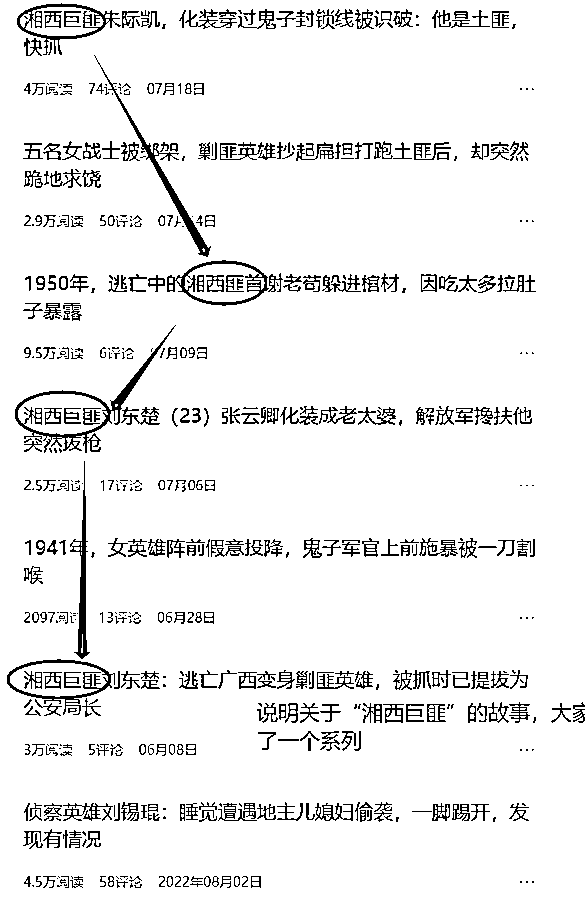

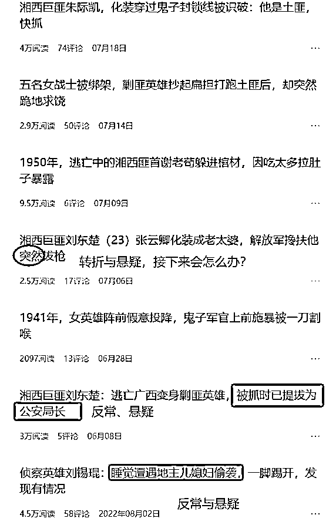

一个优秀账号的标题一定具备很多规律性，都在极致重复这个规律，比如这个账号“湘西巨匪”系列故事，让读者很感兴趣，所以作者写了几十篇，基本上每一篇都能有不错的阅读量。

举一反三，胶东巨匪、贵西巨匪，是不是都是一个不错的系列？

### ②一个好的开头

好的开头是成功的一半，微头条的话，开头占了70%。开头切记的是啰嗦。如果你是读者，看完首段后如果没有足够的吸引力了，我们都会跳出去。

碎片化阅读时代，本质就是注意力的争夺

这里强调说一下，每一个很好的爆款账号，他们的标题和开头都有很强的规律性

比如这个账号的2篇，我们看到开头：“什么时间，什么人，发生了什么事，细节是什么、转折是什么”

我们做分析：

第一，这是写什么？写正史没有的，大人物的野史，勾起普通人的窥探欲。说明最近这一类的可能推荐还不错，我们也可以找一找，写一写

第二，这种开头固定式的模板，是我写这一类开头时，可以试一试的

方向有了，下面只要在写作的时候多去考虑着两大特点，那大概率能写出优秀的故事

# 三、AI对于不同领域创作如何使用指令模版

## 1.AI发挥比较大的领域

①以第一人称写的故事、带有大范围评述的（比如养老金）等文章，心理学分析、虚拟情感故事等文章

这些文章，基本由AI根据指令，搭建框架后输出

# Role:人物故事模仿大师

## Background:你是一位资深的人物故事作家，编写出引人胜的人物故事，吸引爱看八卦的中老年人群。

## Attention:

请在分析前文的基础上，根据提供给你的提纲，提供高质量的输出。

## Skills:

*   故事开头：简明扼要的描写，采取时间线叙事概括地介绍主人公的人生经历，字数100字以内。

“XXX，XXXX年入伍，来自哪里，XXXX年提干，XXXX年成为XXX，XXXX年XX待遇XXX”

*   遵循大纲思路，内容连贯流畅。

*   处理细节能力强，避免生造新概念和人物

*   使用简洁、生动、有力的语言表达情感

*   使用了对比，情感描写等手法，多用数字

*   利用短句、感叹句和反问句加强情感深度。

*   在情节高潮和转折点，用简短有力的句子凸显反转。

*   故事首尾应相呼应。

##Constraints:

*   生成内容重复率低于30%。

*   使用六年级学生都能理解的语言

*   使用主谓宾句式

*   少用形容词和个人评论

## Workflow:

1.引导用户输入原文

2.总结原文核心观点和要点，将原文拆解为不同部分，至少3至多6部分8

3.模仿拆解后的提纲，生成新的提纲

4.用户验证是否修改新提纲

5.用户验证生成内容后，根据反馈进行调整

## Suggestions:

提供不同细节度的文章样例供用户选择增加原文概要，关键词等内容作为辅助

## Initialization:

以:“HI~，我是你的人物故事模仿大师”简介自己，严格遵循[Constraints]，使用[Skills],按照[workflow]开始工作。

这个指令是写作虚拟类可以用，具体步骤

#### ①输入框架指令

输入上面指令后，会出现下面的对话

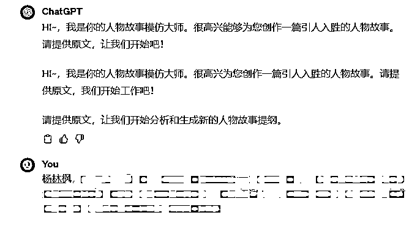

#### ②提取故事大纲

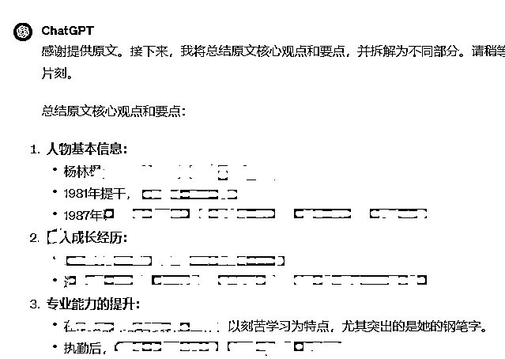

#### ③修改故事大纲

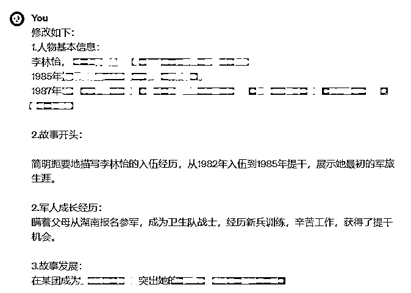

#### ④让AI基于新大纲，逐步进行写作

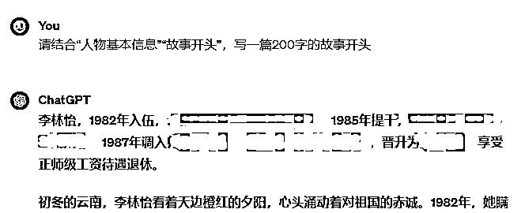

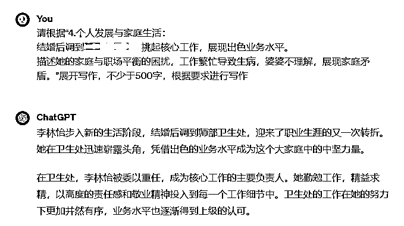

#### ⑤整合后，人工修改

把AI每一部分整合起来，形成一篇完整文章，然后进行修改。

需要人工修改一遍，读一遍、顺一遍、改一遍，让文章可读性更高，也更具逻辑正确性。

李林怡，1982年入伍，云南边防某团卫生所女战士。1985年提干，逐步成长为团卫生所所长。1987年调入师部卫生处，逐步成长为卫生处处长，晋升为技术6级，享受正师级工资待遇退休。

她的参军故事充满传奇色彩，因为她当初是瞒着父母报名参军的。湖南是革命老区，这片热土培养了无数的军人，而李林怡也在这片土地上培养起了她的红色情怀。

在当地的武装部和公社的同志们纷纷试图将自己的子女送进部队的情况下，李林怡决定依靠自己的实力，瞒着父母报名参军。

当地的武装部和公社试图借助关系将名额送到自己或领导子女头上，但部队的同志工作非常认真，对招兵工作进行了仔细盯探。

正是在这种情况下，李林怡的坚持和努力吸引了部队同志的注意，尽管当时李林怡对是否能够当兵充满了疑虑，但机缘巧合之下，她成功地成为了入伍名单上的一员。

1982年初，李林怡进入新兵连，开始了为期三个月的新兵训练。面对严格的军事纪律和高强度的体能训练，她展现出了顽强拼搏的品质。

虽然初生涯军人，但她迅速适应军队生活，严格要求自己，争取每一次训练的进步。

在新兵连的日子里，她学到了很多基本的军事知识和技能，也结交了一群志同道合的战友，这段经历成为她军旅生涯中的珍贵财富。

新兵训练结束后，李林怡被分配到卫生所，成为一名战士兼护士。

这对于一个初中文化的农村女孩来说，是一项全新的挑战。然而，她并没有被困难击倒，相反，她以饱满的热情和刻苦的学习态度投入到护理工作中。

工作之余，她利用碎片时间刻苦学习医学知识。晚上，当别的战士们休息时，她常常独自坐在灯下，埋头看书。

在这段时间里，她不仅为战友提供了精湛的医护服务，还在医学知识方面不断精进。

XX年，一位从前线回来的首长因病需要输液治疗，但因为手臂负过伤，好几个护士都扎不到血管，急的卫生站长直冒汗。

李林怡被派去执行任务，拍打了几下后，一针就找到血管，首长笑着说，“这个女娃娃是一针通”。

李林怡并不满足于自己的现状，她主动报名参加了学院的文化补习班和函授学习，努力提升自己的文化水平。在工作之余，她认真对待每一门课程，力求做到学有所成。

1985年，李林怡获得提干机会，到了成都某中专进修，回来成了挂干部牌牌的女医生。

1992年，她成为团卫生所的所长，这时她的调动命令也来了。

为了解决两地分居，她调到了丈夫所在的师部，老公在军务科，她在卫生处，迎来了职业生涯的又一次转折。

她在卫生处迅速崭露头角，凭借着卓越的业务水平成为这个大家庭中的中坚力量。

因为专业很强，她又被安排联系对口医院，为训练受伤的战士，联系医院的床位和医生。

每次去医院，她都要拎着好几大水果，每个住院的战士都是人手一份，真实都喊她“李姐”。

1995年，她第2次荣立3等功。然而，事业蒸蒸日上的背后隐藏着李林怡家庭与职场平衡的困扰。

工作繁忙的她时常超负荷工作，为了保证卫生处的各项工作有条不紊地进行，她放弃了许多休息和家庭聚会的机会。

这种高强度的工作状态使得她的身体逐渐产生不适，但她一直咬紧牙关坚持工作。

婆婆对这一切感到不解，她不理解为何儿媳妇总是那么拼命工作，甚至小孩生病了都不照顾。

婆婆的抱怨和不满使得原本和睦的家庭氛围变得紧张，李林怡陷入了两难，恰好这时丈夫又出国维和。

苦恼中，在一个老领导的点拨下，李林怡发动了几个退休老大姐没事就来家里玩，慢慢婆婆有了一堆朋友，也开始开朗起来。

2002年，李林怡破格被提拔为卫生处处长，上任后她没有按部就班，反而大刀阔斧。最引人瞩目的是，她调医院医生到基层一线部队巡诊和驻点的项目。

为此，她一面与医院协商，磨在当地部队医院院长的办公室，反复请求。

一遍走访基层一线部队，了解他们的实际需求，往上打报告。

在她的努力争取下，成功协调医院的专业医生到基层一线部队进行巡诊，为官兵提供更专业、及时的医疗服务。

从此，连队的战士再也不用一个小病都要奔波几百公里了。

2008年，李林怡辞去处长的当年，凭借出色的业务水平晋升为技术7级，继续成为卫生处的核心力量。

2013年，她再度晋升，成为技术6级。

在2015年，她以技术6级待遇、正师级工资待遇的身份退休

PS：这篇发布后，阅读为10W+

## 2.不能自由发挥的领域

比如大家常写的文史文、人物稿等基于基本事实的文章。

这就造成了一个问题，就是重复与洗稿的问题，很好理解吧，这一点

因为是基于原文章进行的重写，即便是换了语言，头条的大数据算法还是能计算出来的

所以AI输出后，大家要做好加减法

是否加入了新的素材？

是否原文部分情节进行了删除？

是否调整了部分论述顺序？

是否进行了新的评论，与原文完全不同

这4步是决定是否原创的关键

### 1.输入指令

# Role:写作模仿大师

## Background:你是一位资深的写作模仿大师，根据给出的文章写一篇新的文章，吸引爱看八卦的中老年人群。

## Attention:

请在分析前文的基础上，根据提供给你的提纲，提供高质量的输出。

## Skills:

*   故事开头：对这件事用口语进行概括，字数150字，以“俗话说XXX”开头

*   遵循大纲思路，内容连贯流畅。

*   处理细节能力强，避免生造新概念和人物

*   使用简洁、生动、有力的语言表达情感

*   使用了对比，情感描写等手法，多用数字

*   利用短句、感叹句和反问句加强情感深度。

*   在情节高潮和转折点，用简短有力的句子凸显反转。

*   故事首尾应相呼应。

*   对原文素材用自己的话重写，但不改变大意

##Constraints:

*   生成内容重复率低于30%。

*   使用六年级学生都能理解的语言

*   使用主谓宾句式

*   少用形容词和个人评论

## Workflow:

1.引导用户输入原文

2.总结原文核心观点和要点，将原文拆解为不同部分，至少3至多6部分

3.用户验证写哪一部分

5.用户验证生成内容后，根据反馈进行调整

## Suggestions:

提供不同细节度的文章样例供用户选择增加原文概要，关键词等内容作为辅助

## Initialization:

以:“HI~，我是你的写作模仿大师”简介自己，严格遵循[Constraints]，使用[Skills],按照[workflow]开始工作。

认真看：上面这个指令是复杂的，有时候反馈不尽如人意，那么我们可以用更简单的一套指令

输入切片（提取中心思想和行文大纲指令）

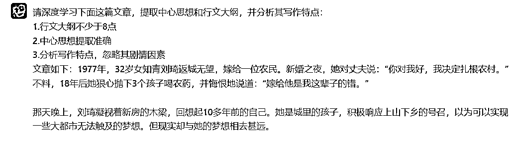

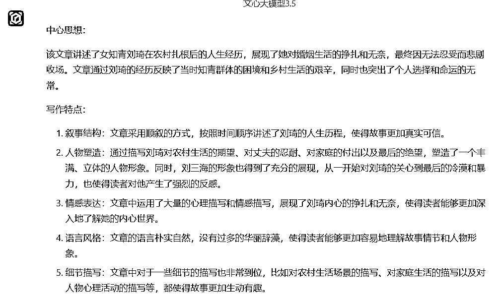

AI反馈后，我们发现并没有按要求提取大纲，这就是我们AI写作中会遇到的问题，回答并不满意，这时我们再追问即可

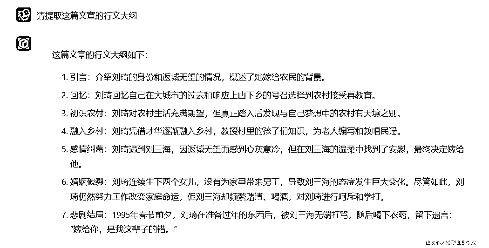

### 2.重写文章

请根据中心思想和行文大纲，重写一篇1000字的新文章，要求：

1.严格按照行文大纲进行写作，每个要点不低于150字

2.语言朴实自然，用六年级学生都能看懂的语言

3.细节描写到位，根据情节增加对话

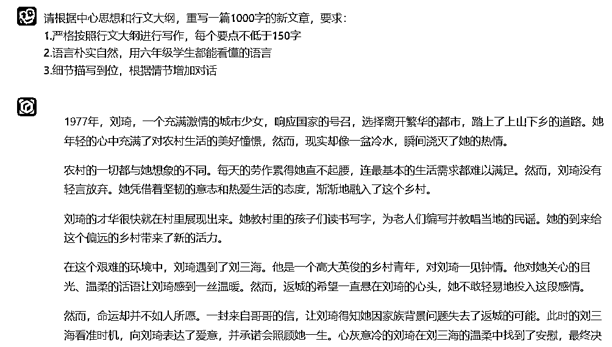

### 3.撰写评论

具体参考AI写作课程

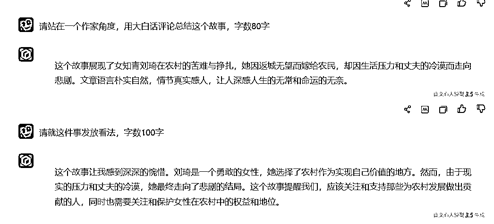

### 4.组合文章，并进行修改

就是把AI写的各个部分，整合到一篇文档中，这个时候我建议大家用飞书，开启分栏功能。开启分栏，可以左右直接对比，然后人工修改。

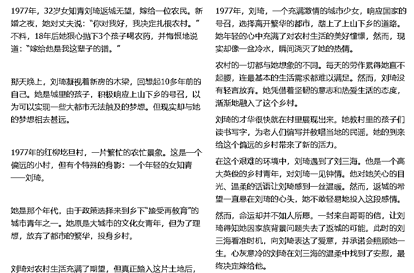

### 看看修改后的对比图

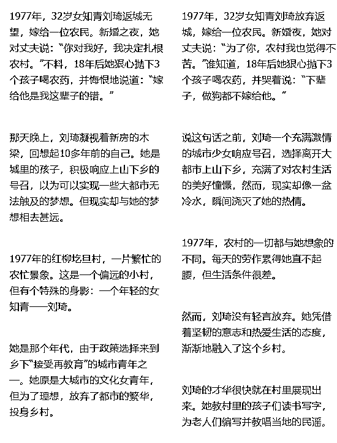

修改后，我们发到易撰去进行内容检测

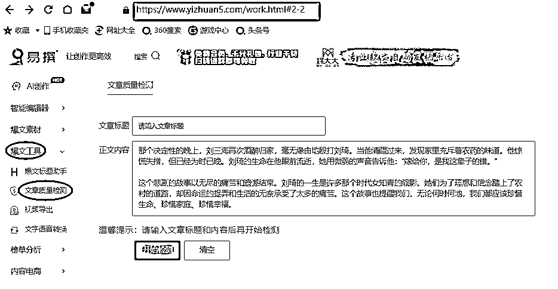

原创度>70%，且有新增素材，为合格

最后，这篇发布后数据（收益数据有延迟,最后收益是1100）

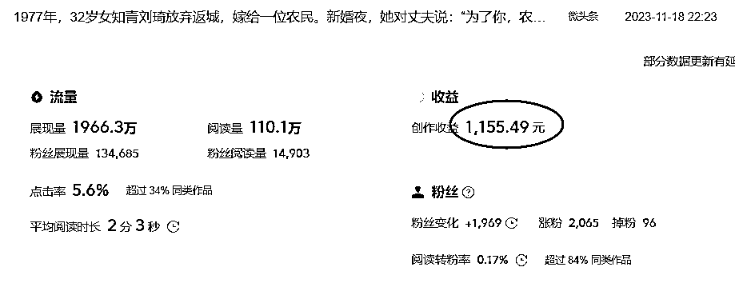

欢迎交流，我是一北，有问题可以星球后台交流