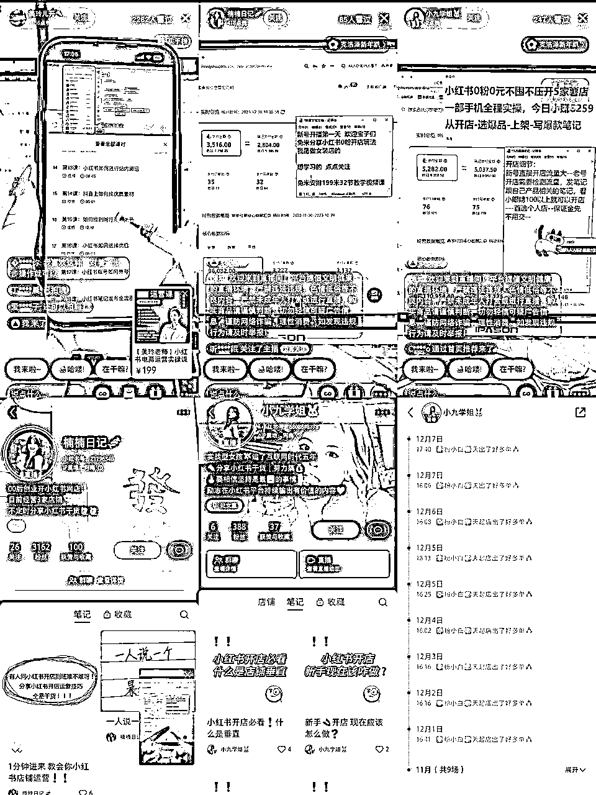

# 风向标拆解第 2 期--小红书那帮教人赚钱的人到底在玩些什么--十巷

> 来源：[https://d60k1uydsg.feishu.cn/docx/CrHndcs2IobdpZxcneacTn5vnih](https://d60k1uydsg.feishu.cn/docx/CrHndcs2IobdpZxcneacTn5vnih)

## 前言

本次只拆解如图，在小红书上低课单价，以直播为主的这类型直播间。

这几个账号都是教别人怎么做小红书店铺的，主要赚的就是卖课的钱。当然有的项目也具有管道收益，或者商家返利等其他顺带的收益，本次拆解不涉及。

这里类型对普通人比较友好，基本的文案模板相同，直播话术相同，也可以批量化账号来做，并且更重要的是，这个小红书项目跟我之前在抖音的玩法，有90%以上的相似度，所以以下是尽最大可能性的拆解每一个板块的玩法，也算是对自己之前的一次复盘和总结。主要可以对这3类朋友有帮助：

1.有讲师能力，有部分直播经验的人刚刚开始入局知识付费，卖课领域

2.例如公众号等有一定成绩的，或者有一技之长的，想把自己的能力产品化的朋友

3.想批量化复制知识付费直播间，矩阵运营的工作室

在生财的团队里，有太多的知识付费领域的大佬了，也有很多我个人都非常值得学习的点，但大多数人都是有非常出彩的一技之长，或者有了长时间的行业积累和认识，他们本身就是超级有内核的，是我们普通人短时间无法复制的。 而我的经验和拆解的这套玩法，更倾向于这个领域的速食，不够健康，也不高级，是针对于我们普通人的，最起码能用这个赚点小钱的，然后再慢慢的成为一个局内人，逐步的丰富补充营养。

### 本次拆解主要分为五个章节：

一.行业分析

二.流量渠道

三.直播间内容逻辑

四.矩阵复制

五.后期交付

六.总结

## 一.行业分析

首先知识付费这个赛道整体的市场不用多说，而且在网赚项目方面，只要有新的平台或者新的收益玩法出来，就会有新的市场，所以就有了割韭菜，韭菜一茬又一茬的说法，但到底是不是在割韭菜，是取决于你的后期的交付质量，具体的操作在第5点说。

其次是有的圈友会有顾虑，说一定是我做出成绩了才可以去开直播教别人吗？这其实就是产品怎么解决的问题。你可以自己知道怎么做了，制作出自己的课程；或者找会做的人合作，他负责学员后期问题的解决就可以，你就来直播，直播就是一场表演，放平心态，演绎好，演绎真。（我在4个这种直播间问案例的账号，都没有回答）

最后就是利润，低客单价的直播间基本上都是用自然流量，所以后期的交付形式就直接决定利润率。现在主流的交付形式有：录播课，直播课，社群，咨询，一对一陪跑等，这次拆解的帐号类型后期是录播课+社群答疑的形式完成的，算上平台抽成，利润率基本在85%左右，还是非常可观的，知识付费的利润率很多都是在50%以上，我们之前是会控制在70%左右，也能保证有一定的交付质量，这种仅录播课+社群答疑的交付质量，存疑。

## 二.流量渠道

#### 小红书上的直播流量主要来源有：发现频道，笔记，推荐feed，个人主页，搜索，直播广场。

而这类型账号很多粉丝基数也不大，也不依赖于笔记，一般就是不发，或者发几条笔记放在那里，每天到点开播就可以，主要的流量来源就是发现频道和推荐feed。前期把标签打好，后边直接在直播间讲操作引导下单成交即可。

#### 也就是说，流量渠道比较单一，就是靠直播，固定的直播话术模板现场成交，在网络平台上很难有存量积累，但是方便短期变现。

## 三.直播间内容逻辑

#### 1.直播间逻辑：

就是在，【晒收益+简单操作+晒案例收益+简单操作】等循环，用收益来诱惑，用实操来留人，然后最后卖课。

#### 2.主要突出的主题有：

风口，简单，不需要任何投资，普通人都能做，你是能拿到结果的等

#### 3.直播节奏：

戳痛点--渲染项目--实操--卖课 （在每个阶段都会穿插着晒自己的收益，晒学员的案例，晒学员的反馈评价等）

#### 4.注意点：

起号阶段直播内容，以免费给的形式要数据，注意话术不要违规就行，怎么诱惑怎么来。起号后，每个账号基本上的直播话术都是一样的，甚至于晒的收益，晒的学员案例等等，这些直播的主播之间都是共享的。

## 四.矩阵复制

#### 一个闭环就是：

起号阶段：用免费送为噱头，对目标人群要数据打标签

成交阶段：固定的开场和实操环节，固定的物料晒图，固定的成交节奏

交付：共用一套录播课/直播课，共同的交流群等

所以只要一套模型跑出来了，其他的账号只要有些直播能力的人就可以完全复制，非常利于团队等多账号多人操作。

## 五.后期交付

#### 涉及2种变现形式的不同交付；

1.直播间售出的就是正价课，无需再次转化。这种后期基本就是课程+助教/客服服务为主，培训简单，交付容易，更多的是提供操作上指导和情绪价值。

2.以这种课程做引流课，后期交付时深挖客户，一般再嫁接咨询的形式进行二次转化，同时在朋友圈进行宣发推广晒案例。

第一种比较简单，基本就是走量，我现在接触到的很多都是这种，当然这个也跟圈子有关系。第二种曾经尝试，失败告终，后续销售团队的二次关单，朋友圈运营，高客单价的交付等等，综合时间，精力，能力，性价比等方面后放弃。当然还可以直接对接第三方进行转化，这里涉及一些法务问题就不做过多赘述了。

#### 先拆解下这里类型账号的后期交付：

本次拆解账号的交付形式：录播课+答疑群+货源分享群。

他们的录播课怎么制作的不得而知，但是一般的录播课程就是按照产品端，流量端，操作端等分模块拆解开，然后分节讲解，这个有机会后边再详细分享。或者直接参考同行。

用户观看有使用第三方小程序观看，更新等，这个市面上有很多。还有以腾讯会议/钉钉群聊的形式展开的。

答疑群在微信中进行，主要有主播和多名助教老师（当然这里的助教老师会起一个其他的名头）

助教老师主要就是答疑和控场，设置好新人公告和群聊规则之后，及时在群内分享课程，某时间段负责好自己的群内问题即可。一般都会建立问题库，如果碰到助教回答不了的会在内群请教技术指导，同时逐渐完善问题库。

缺点，会有炸群风险，这个我知道的就只能靠人工了吧，应该会有类似检测qq群的小插件检测一些敏感词吧，这个点不清楚，欢迎指导和交流。

货源分享群，这个就是纯粹的商家对接，推荐自己的货源，都没有看到帮忙选品，帮忙规避平台对无货源代发的操作，应该可以更精进。

#### 再分享下我们之前如何在可控预算内实现最大能力的交付：

录播课+每周2次直播课+助教一对一回复学员信息

主要在于对后期助教的培训，定期培训相关操作和总结学员问题，有真正有结果的技术老师做后盾进行指导，慢慢也丰富自己的知识，更好的解决学员问题。每周的2次直播课，一般技术老师开讲，或者给想要转主播的助教做锻炼，设置好主题备好课，主要就是锻炼直播的交流感和应变能力，也能给学员带来更好的体验，在同类型竞品中脱颖而出。

最后的一对一回复学员信息，因为客单价注定了就是个入门课程，用户更多的需要的是基本的操作方法，情绪价值上的鼓励，有获得后的关注感，还有有人耐心陪伴，有坚持下去的动力等。成本主要出在这里，但因为交付质量，后续对其他项目的转化，用户认可度，包括直播间主播卖课的底气都会好很多。

（就像后期我在追逐管道收益时，推荐之前学员转型做的小说推文，就是直接利用私域能力进行持续的变现，这个就涉及丰富产品线/二次转化）

## 六.总结

这个项目跟其他的知识付费，教别人怎么赚钱的账号，最大的不同就是，对文章或者视频的制作无要求，直播间也基本是固定的话术逻辑，上手比较容易，但弊端也很明显：

1.很难有互联网上的存量积累，属于当一天和尚赚一天钱的事情。

2.因为是在直播间的即时成交，客单价很难提上去。

3.比较依赖直播推荐，粉丝画像偏了成交很困难，会有场馆虚高但成交率低的假象繁荣。

4.尤其是在小红书这种，短期冲量很难，但长尾流量还不错的平台，仅仅以直播的形式做流量还是比较吃亏的。

最后是几点感悟：

1.知识付费的市场大有可为，但是交付质量口碑很重要。有两种钱比较好赚：一是大量的简单，批量的复制直接怼量，对应的就是下沉市场，更多是把这种教学做成一种服务的感觉。二是极致的优秀，内核丰富的高客单价的精细服务，对应高素质人群也更容易出结果有案例，利润也相对较高。没有优缺之分，只有个人匹配和阶段性追求的差别，在能够温饱的情况下，一定要考虑持续性的事情。

2.这种形式培训出来的主播不是很稳定，要经常加强合作共赢的意识，签署好协议，提前约定好分成，账号，私域等的分配工作。

3.在能赚到钱的时候一定要先抓住机会，很多时候流量是一阵一阵的，有些就是适合短平快的赚钱，不能在流量好的时候膨胀骄傲🦚。

4.要想生意长久，需要一直做的有：个人内核积累+线上输出积累。

等等～感觉很不擅长这种长篇输出，表达能力有限，本篇只能围绕这个小红书卖课的项目拆解，如有不足之处，欢迎指正探讨。