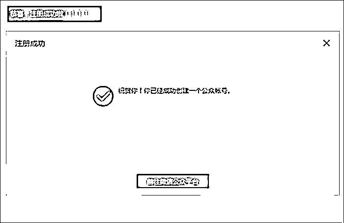

# 公众号小白变现从0到1，最常见的20个问题

> 来源：[https://die28mmde0k.feishu.cn/docx/EIJFdgbkuotapAxqTIwcHzKmnvc](https://die28mmde0k.feishu.cn/docx/EIJFdgbkuotapAxqTIwcHzKmnvc)

嗨，你好，我是安七。（安七：让你安心的幸运七）

应届毕业生，一年双百万。

百万爆款写作人，带出过百万爆款学员，现在在担任生财有术公众号爆文航海教练。

在担任公众号爆文航海教练的过程中，我发现有很多问题，反复、重复被问到。

虽然各位教练们都非常有耐心、回复很及时，但免不了可能有时候大家都忙去了。

所以今天，我把大家经常容易问到的20个问题整理出来，方便接下来的星友们在航海过程中，及时找到并且顺利解决问题。

PS：有的，咱们的航海手册里面已经有，可能就不重复了。如有不小心重复的，就当是重复记忆学习啦。

也欢迎大家在评论区多留言自己遇到的问题，以及是怎么解决的，我会把这些补充到文档中。

一起生财有术。

# 一、公众号相关问题

# 1.公众号注册

官方注册教程：

kf.qq.com/faq/120911VrYVrA151009eIrYvy.html

详细文字版：

①打开微信公众平台官网：

https://mp.weixin.qq.com/

右上角点击“立即注册”

②选择账号类型

（个人的话，一般是“订阅号”就可以啦）

③填写邮箱，登录邮箱，

查看激活邮件，填写邮箱验证码激活

PS：邮箱是没有绑定任何东西的邮箱，如果提示你“邮箱已被占用”

解决方法：：

第1种情况：公众号注册到一半，由于突发情况，关闭了窗口，又重新注册，这时提示邮箱已被使用。

1）电脑端打开微信公众号官网

2）用刚刚使用过的邮箱号和密码登录

3）登录进去，选择类型

4）再次确认类型，点击继续

5）完成后面的注册步骤即可。

第2种情况：公众号注册提示“邮箱已被占用”，可能绑定了其它微信产品。

（如需查看邮箱绑定的是哪种帐号，百度搜索“查看邮箱绑定的是哪种帐号”视频教程。）

先核实所输入的邮箱，是否绑定以下其中一种帐号：

1）已绑定开放平台的邮箱；

2）已绑定个人微信的邮箱；

3）已绑定企业号的邮箱；

4）已绑定订阅号、服务号的邮箱；

5）已绑定小程序的邮箱。

友情提示：同一个邮箱，只能绑定微信产品的一种帐号。

注册公众号时出现“邮箱已被占用”，这时进行解绑，或者输入其它邮箱，再继续注册公众号。

第3种情况：公众号注册提示“邮箱已被占用”，找回密码却提示“您输入的邮箱未注册”。

若邮箱绑定了微信其他产品，但没有绑定公众号，那么无法通过公众号找回密码操作，需要解绑或修改绑定邮箱，然后再注册公众号。

如需查看如何解绑邮箱，百度搜索“查看如何解绑邮箱”视频教程。

④选择类型，选择注册地

注册地，可以选你上班/上学的地方，也可以选择户口本上的地方。

都OK，没关系。

⑤了解订阅号、服务号和企业微信的区别，选择账号类型

（个人仅支持注册订阅号）

⑥信息登记，选择个人类型

⑦填写身份证信息、手机号

⑧填写创作者信息

（选填，我一般没有填）

⑨填写账号信息，包括公众号名称、功能介绍，选择运营地区

账号名称就是你的公众号名字，

如果懒得想，可以从下面4个模板当中选一个：

我是XXX呀；

叫我XXX好了；

努力中的XXX；

XXX在努力

看不出来领域，但是哪个领域都可以用。

⑩恭喜注册成功！

可以开始使用公众号了~

注册好后就可以开始修改账号昵称、简介、功能啦。

# 2.公众号爆文赚钱原理

有学员问了我一个问题，特别好

她说：为什么公众号发文就有收益？这是什么原理？

我们公众号爆文，大部分赚的是流量主收益。（也有接广告的，但是比较少，就不展开啦）

可以这样理解：

现在各个平台都在“抢人”，都想把人、用户留在自己的平台

公众号也不例外

之前，公众号对新手特别不友好，因为它是一个闭环，你有多少粉丝数，就有多少阅读量，不会给你推荐到陌生用户那里

后来，公众号发现这样不行啊，因为大部分还是中小号主，粉丝数就这么多，你也不给流量，我不干了。

很多人都走了，留下的，大部分也不更新了，不活跃，还怎么留住人？

所以，公众号就开始改了：

新人，我也给推荐！只要你的文章有爆款的潜力，我稍给流量，好的就跑在前面了

这就是我们“爆文”的来源。

【变现来源】

平台：为了留住人，给流量，给广告

你：写好内容，抓住流量。

有人看你的文章，文中广告被浏览的越多，你的流量主收益越高

读者：好内容好看，我在公众号多看点。

平台、你、读者，就形成一个正向循环。

平台，不可控。

读者，不可控。

我们能做的，是提高自己的内容质量、把握爆款规律，写爆款。

你的文章阅读量越高，文章中的广告贴片被人看到的越多，曝光越多，平台为了感谢你留住人了，也会自动给你推荐、增加流量主收益。

不知道这样表达清楚吗？

# 2.被关注回复、关键词回复等，怎么弄？

下面是实操步骤：

1.登陆电脑版本的微信后台

（电脑浏览器，搜“微信公众后台” 登陆）

进入后

2.看图片实操。

左边栏，点击“内容与互动”

下面有“自动回复”、“自定义菜单栏”等等。

我们要弄的是自动回复，这里展开。

按照图片来实操的，基本上问题不大。

下面分享我自己的“关键词回复”内容，大家可以参考：

我的被关注回复是：

嗨，你好，我是安七，朋友你来啦（欢迎语）

可以先看下这篇哦：

…………链接 （我的故事文，拉近距离）

安七的公众号一般会发：……等内容（告诉大家我有啥）

专注…………可以联系我哦（推广业务）

一起，共同成长、不断进步、最终成为更好的自己！

回复……可免费加入安七的星球，每月2次提问机会（引导加好友或入星球）

回复……可加入交流群，加好友时备注“交流群”

PS：如果你发现某些二维码过期，可以加我微……，我邀请你

（大家的，没必要这么细，这都是很后面的阶段，才会有的。

刚开始起步的话，就简单一点，表示下欢迎关注都OK的）

收到消息回复是：

若没有得到你需要的内容，可以加安七微信：

XXXX（备注：号）

私聊安七哦

# 3.一天只能群发一次，但一次可以带8篇，怎么带？

如图所示👇

（写完一篇后，记得先保存草稿，避免突然没网了丢了，会崩溃的）

# 4.公众号文章，怎么弄下划线？

问：我看到有的文章中，有那种虚线，我怎么没有？

答：长按某个句子/段落，会出现“划线”两个字，点一下，会划线

问：那为什么我的是实线不是虚线？

答：虚线是别人划的，自己只能划实线。

但是你划的这里，在别人那里看起来也是被人划的虚线

# 5.公众号排版过程中，容易出错的几个点

1.一段，是1-3行，不要超过4行。

电脑页面大点，电脑上排版，一段1-2行就OK了，因为手机上看起来已经有3行左右了

超过会很长一段，密密麻麻的

2.不要自己手动敲，如果你想居中，看图：

不要自己一个个敲，不准确且费时间

3.为什么，段落之间的空行这么大？

有朋友问我，他的文章空行怎么会这么大，找不到原因？

我问，是不是空行了

他说，是的。

问题就在这里了：

直接下一段起就行了，不用中间空行。

这样等你全部写完了，你再按照排版公式去排，是没问题的。

4.为什么已经排版好了，保存草稿、预览又是没有排版好？

# 6.文章原创度，怎么查找？

用“易撰”（网页版）

易撰怎么查找原创度？👇

（微信扫码登陆

一个人一天可以用3次 免费

超过3次要付费）

# 7.结尾的图片、点进去就是文章，这个怎么弄？

# 8.怎么判断，自己找的这篇爆款文章，适不适合自己的赛道？

# 【爆款文章的标题怎么修改？】

和学员聊，才发现大家，对爆款文章是否符合自己这个领域，以及，到底怎么样模仿这个标题，有点不清晰。

统一解答下，该怎么去看？

1.找到爆款文章后，我们先判断，爆款文章的领域到底是什么

符不符合自己的领域？

比如学员找的一篇，爆文标题是：“6大方法，让你睡眠质量越来越好（亲测有效）”

她想写这个，但她选择的领域是“极简”类的，不管是极简生活还是极简存钱，都是极简类

这个属于生活习惯方面的，不太符合她的调性

但又想写的话，建议是放2条，用市场的反馈测一下。

2.爆款文章标题怎么模仿？

最简单的方法是改数字

数字一定要改，

而且，改完后，一定要先把改好的标题复制粘贴，去搜索有没有一模一样的标题？

有的话，要改，继续改哈。

ps：

改也是有技巧的，如果说，你除了改标题，还想再改改、让它看起来不那么像

一定要注意：不要改掉【爆款关键词】！

什么是“爆款关键词”？

也就是你看到的，它这个标题中的人性词/痛点词/好奇词/暗示词……

比如：

1、“6大方法，让你的睡眠质量越来越好（亲测有效）”

爆款关键词：睡眠质量

吸引力词：（亲测有效）

很多人都有“睡眠质量”的痛点，睡不好，刷到这个标题，再看到（亲测有效）这几个字，大部分都会点开看的。

你把睡眠质量这几个字去掉了，别人还看什么？

2、“男生把持不住的23句睡前小情话”

爆款词：把持不住、情话

这几个词很有吸引力

有种若有若无的（性）暗示在

3、“一本改变命运的奇书，央视强烈推荐！”

爆款关键词：改变命运、奇书

吸引力词：央视（有影响力的背书）

如果你要改，可以这样：

“吹爆这本改变人命运的奇/好书，央妈强烈推荐！”（举个例子哈）

# 9.爆款关键词怎么分析？

关键词，要做一个“爆款标题库”，把同行的爆款标题都扒下来，然后，把爆款关键词扒下来，尝试做分析。

分析多了，你就知道了。

比如读书类的关键词，无非就是一些人性的词语，像：人生低谷、好书、强烈推荐……

# 10.公众号文章，一般多少字比较好？

一篇文章，最少900字，1200字比较适中，最多不要超过1500字。

900字：可插入文中广告

1200字：可插2条文中广告（文章中没有插画的情况下）

1500字：偏多，但能接受。再多，就比较长和密密麻麻了。完读率低。

总结：

1200-1500字都OK，不要超过2000字

太长别人没耐心看完。

太短了，文章中不能插入2条广告，自己的收益会下降

# 11.公众号发文，什么时间段发比较好？

这个没固定的时间段，我觉得，只要不太早或者太晚都可以。

不要太早的意思是：

不要早上五六点钟就发文了，这个时候很多人还没起来。

不要太晚的意思是：

不要超过，晚上11点或者11:30发文，太晚的话，很多人爱看的是那种带擦边性质的，你正儿八经写的文章他不爱看。

# 12.公众号图片去哪里找？

这个我们的文档中🈶，但很多同学没有找到，这里再统一说下，不仅仅是极简类，其他类也是一样。

1.小红书搜

你想要什么效果，就搜什么效果的图

比如极简类的，同行一般是那种温馨治愈的，你就搜“治愈动漫图”

‼️博主的简介上没有写“禁止二改二创、严禁搬运”之类的，就可以用。

如果写了，换个吧。

‼️如果图片上有水印的，也建议换了

或者是你勤快点，去水印。

像极简类的，一般搜什么，“魔女宅急便”、“哈尔的移动城堡”、“千与千寻”等等的

2.公众号，你的同行那里盗图

如果它的文章中，图片写了“图片来源于网络”，大概率也是从网上弄过来的

你可以直接用

但聪明点，不要这篇文章模仿了，图片还用人家这篇的，你换一篇的图，模仿这篇的文就好了

你上至图，下至文，都模仿，有的同行认真的，直接举报你。

3.百度。

百度上，一般来说没有版权的纠纷

但要注意，有没有水印

有水印的，懒得去水印就不用好了。

4.堆糖

这个APP有比较多的壁纸的，很多小红书博主的背景图就从这里扣。

# 13.私信要回复吗？

有的同学写爆文，发现某篇爆了后，有很多人私信。

有好的有坏的，但是不清楚要不要回复？

我的建议是：不回复。

人的时间精力都是宝贵的，说你好的，你看着一乐。

说你坏的，甚至有的，为了专门骂你跑过来关注你、关注完就总的这种，也没必要较真。

如果后台有人评论留言，想跟你“合作”：

建议你在公众号菜单栏那里设置一下，放上你的联系方式。

如果真的想找你合作，人家会主动加你。

如果没有加你，只是私信问，那没必要，我们主要也是靠爆文赚钱。

私信，其他读者是看不到的，所以无须担心。

# 二、避坑指南

# 1.为什么不要把自己的公众号名字，轻易暴露出来？

从第一期训练营开始，我经常会强调几个事儿：

不要轻易把你的公众号名字，让别人知道；

也不太建议你的爆文号发朋友圈（IP号除外）；

晒收益图，一定要马赛克自己的公众号名字

……

为啥？

因为人性。

爆了后，有的人会故意使绊子

举报你的爆款文章，举报成功，系统会判你违规，流量大打折扣，很可能号坏了

另外一个，有的人可能会洗你的稿子（虽然你做大做好后无可避免会被注意、模仿、甚至抄袭）。

稿子洗多了，系统不是人，它可能会误判你本人的号。

误伤友军。

# 2.对标账号，不要找每篇都10W+的大号！

今天和同学聊，发现对标账号还是找错了。

切记切记，对标账号，一定是找新号、低粉爆款号！！！

千万不要一上来就找大号，大号不具备参考性。

怎么知道是不是大号？

1.看原创文章

原创文章几百上千的，一定是大号或老号了

2.看创立时间

创立时间怎么看？

之所以不要对标大号，是因为：

大号原本就有几十万上百万的粉丝基础在那里，人家不管写什么，都随随便便几万、10W+的阅读量。

没有可比性。

但有1种情况的老号、大号，是可以模仿借鉴的：

之前，阅读量都是1-5W左右，近期有一篇10W+，那这篇10W+你也可以模仿学习，属于【异常值】。

# 3.发文章被举报了怎么办？

有一次，我的一位学员正式发第一篇文章，对标的是前几天的10W+

结果，刚发没多久，3个阅读量，也被举报了

原因是“滥用原创”，也就是说，别人觉得他的内容和其他人的很像，直接给举报

现在的举报成本太低了，一个顺手的事儿

写文章的，或多或少都遇到过

还有一次，我的一学员因为标题和别人的一样，直接被举报，限制原创功能一天

还有的，写得太好了，被同行妒忌，也反手就来一个举报……

举报，太正常了。

放平心态应对，告诉自己：“不被人妒忌是庸才”

回答几个大家关心的事儿：

1.被举报后，账号还能用吗？

能。

但不要连续被人举报，违规太多次，轻则限制发表一段时间，重则封号。

2.怎么规避？

只能说，尽量规避，没办法做到100%避免，因为人性的恶

①标题不要一模一样

虽然，有的时候我们看到有些标题好像是一模一样的，文章也没有事啊？

我的想法是：能规避的，就不要去碰概率了。

我一般写文的思路是：

a.找到近期爆款文章，并且对爆款文章标题进行一定的删减和改动，但是不改动爆款关键词，

b.把标题填充进入我的ai调教口令当中，让ai去帮我重新生成新的内容，

而且如果我觉得ai生成的内容跟原文太像的话，我会让他换个角度写，重新生成一些新角度的内容，

c.ai生成内容已经符合我80%的需要，我再稍微修改一点，甚至有时候都不用改，可以直接发

所以我手里的一个号从来没有被人举报过，因为除了标题类似，其他的都是原创。

反倒是有很多人抄袭它，被我的号主朋友举报了多次。

②内容框架，不要一模一样

不是说，你改变一下说法、意思不变就可以了。而是，里面的点，也要改。

内容可以去小红书搜，有很多其他素材。

# 4.快捷转载键，一定不要开！

很多同学，写完文章拉到最下面的时候，会看到一个“快捷转载”

在标原创那里

到底要不要勾选这个？

答案是：不要！！！

快捷转载键，一定不要勾选，你勾了，别人可以一键转载你的，会分走你的流量。

# 5.避坑：发文之前看错别字、不要转发朋友圈/社群

再强调下这个问题哈。

文章发表之后可以用自己微信看一遍，检查下有没有错别字，

(公众号文章修改只能修改20个字符，且只能修改一次，标题不能修改。)

可以给自己点赞和在看。但是不要点广告，更不要转发朋友圈和群，也别让别人给自己点广告。

如果一直都是相同的用户给你点赞、点广告，那账号很容易死，就是根本进不了流量池。

ps：

尤其是自己的大小微信号轮流切换，给自己的文章点赞和再看的，更容易si。

所以，大家不要自作聪明，拿小号增加阅读量，也不要总转发给相同的朋友帮忙看

你发完之后就放那里，顺其自然就好了。

# 6.公众号文章发布后，不要马上点开去看。

试下自己不去看的话，那个自然流推荐有多少？

因为你刚发布就立马就去看，很可能会对自己的自然流账号有影响

总是那几个相同的IP在看，很容易把号看si的。

到时候再想起来，非常难，要大量日更才能慢慢起来。

# 7.公众号文章图片，配几张合适？

这个问题也经常被问到。

我个人的建议是：最多不超过3张文章中配图。如果对排版没有特别要求，不配图也是OK的。

因为文章中的广告位，要求是前后300都有文字。

如果你配图太多，把原本的广告位占了，就没有什么广告了。

这就是为什么，有的朋友，哼哧哼哧写了1500字，结果发现系统显示不能插入广告——配图太多。

# 三、其他心得体会

# 1.心态一定要稳，没有下雨的时候就要准备好盆。

这期担任教练的过程中，发现大家的积极性还是很高的，大部分伙伴都是认真在踏踏实实干。

其实，理论方法层面大家都大差不差的，但心态还是不一样的。

有伙伴是第一次参加航海，第一次接触公众号爆文，所以误以为自己：

“都更新7天了，怎么还是0阅读量啊？”

觉得自己无望、号无望。

打住，7天没有起来，太正常啦。

做爆文的，心态要好，因为公众号是有长尾流量效应的，你今天写，没有爆，不代表过段时间等你起号了还是不能爆。

我之前有一个学员，写育儿类的，刚开始几十个阅读量，后面过了一两个礼拜后，阅读量跑到了10W+。

如果她放弃了，就不可能会有这10W+。

一句话：心态一定要稳，没有下雨的时候就要准备好盆，而不是等倾盆大雨下来了，结果发现自己手里没有接水的，空欢喜、白哀叹！

# 2.允许自己慢，行动上要狠

随着做公众号爆文的人越来越多，这个赛道也越来越卷，很多方面都悄无声息的发生了变化。

原来起来一个号，可能是1-21天，现在可能更长，1-60天不等。

1篇就爆，是天选号，富贵在天，老天爷追着喂饭吃，就跟有的人第一次买cai票，就中大奖一样，这种羡慕不来。

我们大部分人都是普通人，普通人想破局，就要允许自己在这个领域前期先没有成绩，在打基础、沉淀。

就像《繁花》中的那句：“人算不如天算，所以，尽量不要自己去算。”

踏踏实实做好基本功，把手册内容认认真真看一遍。

听话照做狠执行，结果不会差。

千万不要嘴上说着“听话照做狠执行”，执行过程中又犹犹豫豫、怀疑，执行力大打折扣，结果也就差了。

# 3.踏实，原创

幸福感是对比出来的，焦虑也是。

看到别人都在群里面报喜，自己还是老样子，毫无起色，心里面免不了焦虑，怀疑自己的路是不是走错了？

想说：

每个号的爆款基因不一样。

前期，测你感兴趣/不排斥的领域，测一段时间后，慢慢会有反馈。

如果头条测这个领域一直没有起来，可以加二条，二条可以再测测其他的领域。

我有一个号，写职场的，前面半个多月一直没有起来，

当我在思考要不要换的时候，我跟自己说：再坚持一段时间

后来，它慢慢的起来了，现在多篇10W+，10天10000+。

可能它只是个例，可能你手中某个号写某个领域就是起不来……

但无论怎么样，结果是试出来的，不是想出来的。

做公众号爆文，咱也不矫情，目的就是想通过这个变现、赚钱。

但是，赚钱也是有讲究的：

有同学的号，一直起不来，一问，发现就是单纯洗别人的稿子，博一个概率，百里出一也OK。

珍惜自己的羽翼，珍惜自己手里的号哇。

这期爆文航海的主题是“原创”，唯有优质内容，才能穿越流量的周期。

自己手里的号优质、总被别人对比、洗稿的同学，也不要灰心，因为：出人头地就是被别人教训的过程。

被洗多了，你就知道该怎么保护自己的号了：

比如，关掉公众号名字搜索功能（IP号还是别关），

比如，当天爆了10W+，能够忍痛割爱的删文……

你优秀，所以才会被看到、被对标。

何不尝试把这套优秀的方法、模型，迁移到其他的号、不同的领域上呢？

以上，共勉。

我是安七，让你安心的幸运七，欢迎大家多多交流。