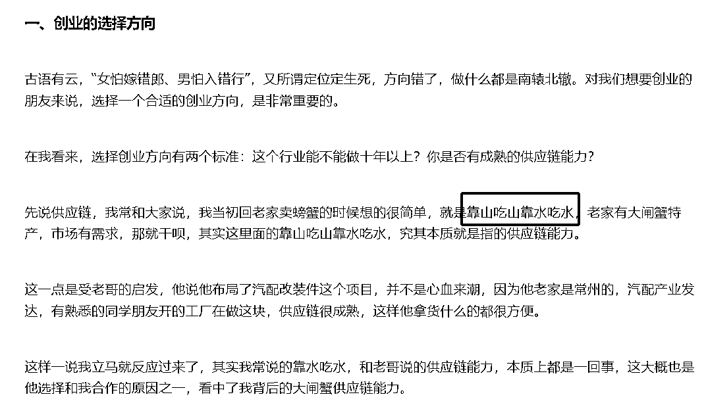
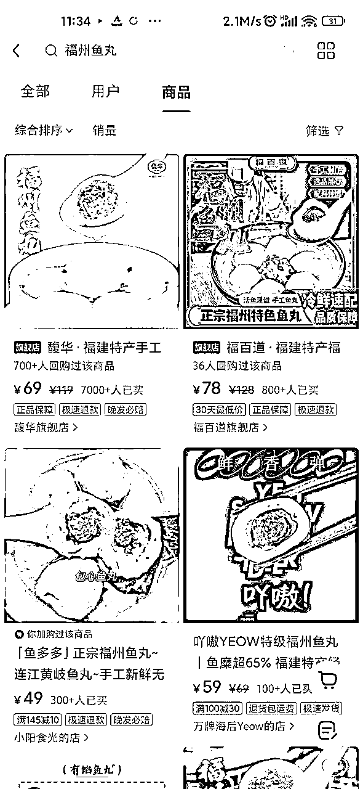
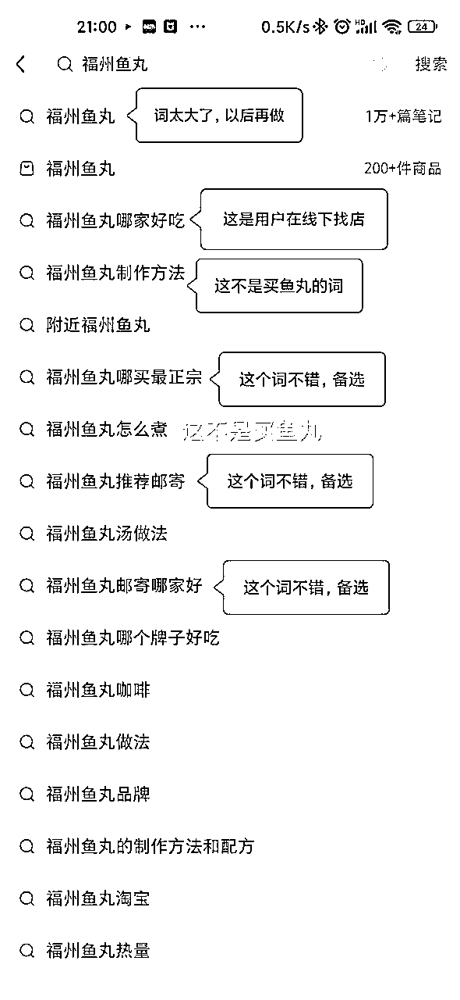
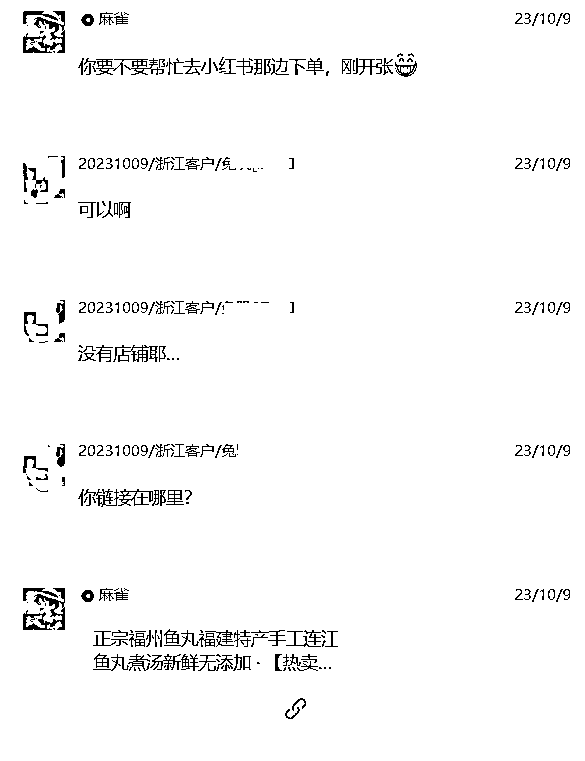
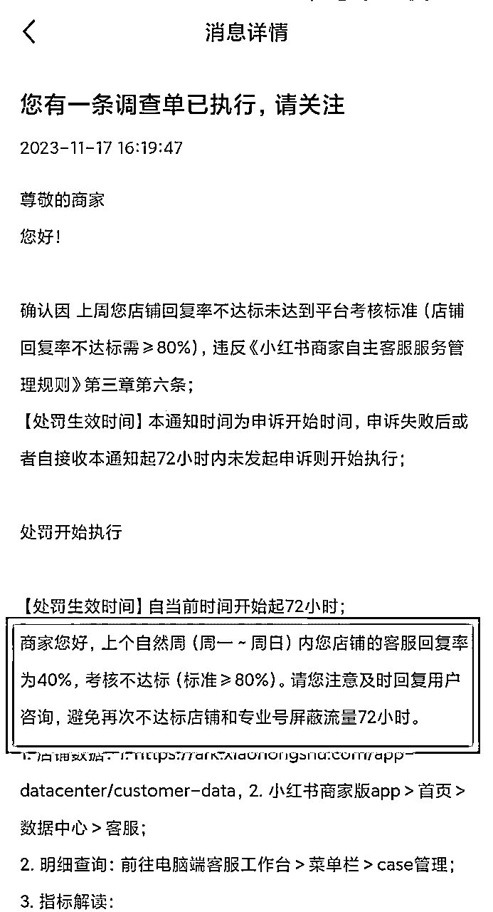

# 小白从0到1跑通小红书电商渠道，4个月卖了1000斤福州特产，变现5W的复盘

> 来源：[https://zrxcll5yfi.feishu.cn/docx/EmmZdPNU1o6uANxdX77czyrInug](https://zrxcll5yfi.feishu.cn/docx/EmmZdPNU1o6uANxdX77czyrInug)

# 一、自我介绍

大家好呀，我是麻雀，来自福州，一个深耕零售、生鲜行业的产品经理，尤为擅长企业ERP、供应链、财务结算等领域，副业专注AI+小红书赛道！

## 一）赛道介绍

我从去年9月份开始到2月底，一共卖出了3千多斤，感觉很适合大部分新人，所以把过程分享出来，希望我的《在小红书卖家乡特产》案例对一些同学有帮助，有启发

为什么适合新人呢，因为大部分新人是卡在了“定位”，觉得自己啥也不是，不知道卖啥。家乡特产我觉得每个人都有资源可以卖的，而且人设也非常适合。总结就是人设没问题、产品没问题，并且特产还自带流量。下面我将这4个月的实操毫无保留的把整个过程分享出来！

可能你收获不到爆款笔记的制作方法，但是可以收获到整个项目--从灵感-->流量-->内容-->转化-->成交的整个实操过程以及若干避坑指南和心态变化！

地方特产在以前，可能体量比较小，但随着近几年直播、短视频的兴起，体量正在指数级增长。甚至还可以期待诸如近期天水麻辣烫、开封王婆这种现象级的流量，直接带火一座城

## 二）成绩截图

9月初开始实操

我从第一篇笔记到引流到第一个用户用了5天，

成交第一单用了8天，

在没有爆文的情况下，单月营业额破万用了不到2个月，

到了第四个月营业额2w+，

### 1、9月4日第一篇笔记到11月30日的截图

9月初开始在小红书卖福州鱼丸，一个号做引流，一个号做店铺

近3个月时间，一共引流240人，成交110人，加上店铺、红包、支付宝等收款，总销售额在2.6w

没什么爆款，就是靠重复的产品展示，总共发了150个笔记，基本上跑通0-1

#### 2、12月份至今店铺号收款的截图

12月份开始，引流号被限流，店铺继续收款近2+4.7+3.2万，私域做复购

由于复盘是1月份写的，所以重新补了2张一月份和二月份的数据，证明我当前还在做

# 二、选品逻辑（为什么想到卖福州鱼丸）

## 一）灵感来源

这个灵感来自于唐葫芦老板卖蟹的案例（原文：《卖蟹第九年，我的一些思考》）

顺着这个思路，我就从家乡特产这个方向就找到了福州鱼丸，

因为福州鱼丸是福州最具出名的特产，并且我同事他哥哥做生意的，每年买鱼丸送礼，都要消费3万元左右，所以有非常靠谱的货源。

## 二）市场调研

### 1、淘宝销量

市场的体量如何，建议先看看淘宝，包括后续定价也可以做参考

可以看到，月销1000+的单品都挺多的，说明市场有需求，是可以做的

### 2、抖音销量

抖音这个是累计销量，量更大

### 3、小红书销量

小红书的量最小，说明大家都没有进来

### 4、总结

通过3个平台对比，发现不同平台卖的好的，都不是同一家，而且抖音都是靠直播卖出去的，小红书都是笔记带出去的

结论：

1.  福州鱼丸可以在网上销售

1.  在抖音卖，要靠直播

1.  小红书商家少，没什么竞争，可能也意味着体量很小

再结合自身情况，决定先拿在小红书试一试

所以，回到最开始说的，为什么说做家乡特产项目，很容易拿到正反馈，而且天花板还不低呢，因为：

①市场有需求

②本地人的人设没问题

③产品本身就自带流量，都很容易获得顾客都信任

④竞争少，真正好的民间产品没有在线上流通，在线上流通的大多数是工业化产品，我们比这些品牌更有优势

# 三、怎么在小红书卖鱼丸

可能摆在最前面的问题是，开店铺还是引流到微信成交

（先说结论，都可以）

我是9月份先做的引流，3周后才开的店铺

我一开始考虑的是如何快速启动，引流的好处是一个账号就可以了，甚至都不要实名认证，

开店铺的话，又要营业执照，又要制作商品链接，设置价格、促销等等，动作太多，怕给自己激情给搞没了，

不管是店铺还是引流到微信，用户信任的是你和你的产品，

店铺或微信只是一个收款工具，不影响任何结果

## 一）小红书账号装修（非常重要）

账号包含昵称、头像、简介、背景图、产品名片笔记制作，目的是突出人设，获取用户信任

特产人设特别好做，不需要你有什么专业，多少资深，你甚至可以说帮村里没有不会搞互联网的叔叔阿姨卖点好东西（最简单的，找个对标模仿就可以了）

## 二）笔记选题怎么来

可能很多人跟我一样，没什么网感，

没开始做这个鱼丸项目的时候，天天看看那种选品的N种方法、爆款选题的N个方法、爆款标题的N个方法、chatgpt制作爆款笔记的方法、N个爆款封面等等，越看越焦虑，导致迟迟没有开始真正用心做一个项目。

总结就是：成功没有捷径！

那我们互联网小白如何破局呢？

其实我们产品的底层能力的是通用的，用户的需求在哪里，哪里就有机会去挖掘！

### 1、首选SEO

也就是吃精准关键词的搜索流量，

既然小红书做的人少，那完全可以把淘宝货架电商的逻辑搬到小红书，

无非就是淘宝搜索的是商品，小红书搜索的是笔记。

在去年12月22日，小红书的WILL商业大会也得到了佐证（下图）

#### 1）怎么选词（这个很重要，我们一直都有关键词互助，别瞎选词啦！）

在小红书搜索栏输入产品名，带出很多关联的联想词，就是用户经常搜索的了，

从里面找到指向成交的词，再看看对应的笔记是怎样的，能不能打的过

（比如”福州鱼丸“这个词就太大了，不适合），

按下图的思路，我选好了词

#### 2）怎么埋词

能写文字的地方，就是标题、图片、正文这3个地方，所以这个词必须在这3个地方都出现，

但是并不是堆叠的，用户背后的诉求是不知道怎么选择，所以文案就是告诉用户怎么选

#### 3）笔记怎么做

我的思维很简单：顾客因为什么去下单，从成交逻辑倒推，应该展示什么，重要的是先做起来。

以福州鱼丸邮寄这个选题为例，

展示的图片分别告诉用户，我支持邮寄、顺丰快递很快，而且是原产地发货、客户评价很好、我的鱼丸是手工的非常健康

这篇笔记现在的数据如下，基本属于躺赚（看持续的流量和搜索比例，关键词和互助功不可没）

#### 4）用户调研

有时候我也会问问顾客，怎么找到我的，这个就是做私域的优势

### 2、晒美食

前期除了自己实拍以外，还有个宝藏小程序”下厨房+“，里面的美食、制作步骤都可以搬运，做起来后，其实顾客的返图就很多了，我基本上靠顾客的图活着

### 3、淘宝的用户评价和提问

评价的感受和提问的问题，都不是个例，都有普遍性，所以以顾客都视角来做选题，也更能吸引用户的注意力

（图片也可以使用用户的晒图，稍微处理一下就可以用了）

### 4、用户好评反馈

就是可以直接晒微信聊天截图，转化率很高，因为用户喜欢看买家秀不喜欢看卖家秀

### 5、同类型近期火的笔记

比如我卖鱼丸，那可以找别人卖牛肉丸、卖腊肠的对标，甚至卖苹果的都可以模仿他们的标题和文案

## 三）变现方式一：引流私域成交

### 1、小红书如何引流

#### 1）建小红书群引流（推荐）

发布笔记的时候，关联群聊，或者在评论区引导进入群聊，用小号在群里发微信号。推荐群主要是因为用户进入群里，后续可以继续触达，每天可以往群里发布一些晒单、介绍等等

#### 2）小号引流

简介”@小号“、评论区有人问怎么买就”@小号“，小号留引流信息

#### 3）更多方式方法

可以去星球搜索，引流没有100%安全的，只有相对安全，

更加建议多多关注小红书其他博主如何引流，好用的方式就拿来自己也用上，时刻把自己当成是猎物，去寻找那些钩子！！

### 2、微信如何转化

用户能加我微信，说明我在小红书已经种草成功了，或者说已经取得了ta的初步信任，

所以，我们微信的门面要做好，目的是继续深化信任，刚开始我没有意识到这些，成交率不佳，后面加一些其他引流博主，学习了这些，总体成交率在55%

#### 1）微信的门面

跟小红书账号一样，包含头像、昵称、背景图和朋友圈（我做的不好，因为是副业，没有敢装修太明显）

*   头像，建议跟小红书的头像一致，这点非常重要

*   昵称，条件允许的话，也最好跟小红书一样的，像我是做副业，也没有新开微信号来做，昵称就不一样了，不过问题不大

*   （主打怎么方便怎么来，多个微信切来切去，我个人是感觉很麻烦）

*   背景图，跟小红书一样，可以放产品图，同时可以把自己的简介放到背景图上面

*   朋友圈，可以置顶朋友圈，主要放产品介绍、产品好在哪、客户好评等

#### 2）加微信后主动打招呼

价格可以先不发，看看用户需求

如”你好，感谢信任，你也是要吃xxx的吗？“

#### 3）产品价格或套餐设定

考虑到转化和利润之间的权衡，最好需要设置【成交款】、【主打款】和【利润款】

我结合用户的购买场景，主要考虑到几种需求：

①经常吃的人这次想试试我的鱼丸

②没吃过来尝尝鲜

③送人

④定向回购，

下面是我的考虑

*   成交款：

新手全家桶（4款产品）----价格145，

询问用户有没有吃过我们这边的特产美食，如果是第一次吃，建议用户不用买多，

主力款各带一包，原价150，现价145，

吃了之后，觉得哪款符合自己口味，再来复购

*   主打款：

5包鱼丸组合--价格199，

用户如果吃过，就是冲着我们的名气来的，那就直接带走鱼丸，5包原价225，现价199

*   利润款：

鱼饺35一包|鱼面25一包，

用户选择主打款的基础上，一般会继续推荐用户试试我们的鱼饺和鱼面，

正常他们都没吃过，也会顺便再带几份走，这样也为后续复购打开更多的选择空间

以及发给客户的介绍

#### 4）促单及复购

节日促销转化等这些方法多试试，有效果的，

特别是加过来很久没下单的，我们标签设置好，针对ta们可以多发一些朋友圈或者促销活动，

因为都是意向客户，不下单大概率是因为价格问题（我的包邮门槛是135元，总体客单价在160左右）

## 四）变现方式二：小红书店铺成交

为什么做完引流，又做店铺呢？

做私域的好处大家都知道，触达的次数更多、更灵活、复购更香、积累用户资产，但是我卖鱼丸的客单价并不高，走量的话后续还得靠直播

还考虑到私域聊天很费时间，账号违规会被限流，所以我就开店了，跟平台一起发展！

另外，也庆幸自己先做引流，好处是：积累初始用户，验证产品的市场反馈，方便拿好评的图片，这些都是高转化的素材，同时也能更了解用户关系的话题

（前2个月每一单都非常认真的找顾客要反馈，现在基本也不找了，心理有底）

#### 1）店铺如何冷启动

（关于店铺如何开，商品如何创建等等，就不介绍了，可以找豆豆领取详细文档，不懂也可以去问问薯队长（客服））

我开店后，有意识的让私域用户去店铺下单，积累店铺的初始销量，客户收货后，引导去做好评。

当然，店铺好评晒单的数据，可以用自己的小号下单，或者让朋友帮忙下单，收货信息填写微信这边顾客真实下单的信息，这样就更好转化了

换位思考，你会去一个0成交0评价的链接且客单价一百多的食物吗？

#### 2）店铺有流量补贴，是个红利期

#### 3）商品卡也能成交（更长远复利）

销量上升后，除了大部分流量的从笔记进来的，还有有部分流量是直接从商品进来的，也就是说开店的复利更大

#### 4）小红书群转化

前面引流的时候，就提到了建议用群的方式，因为用户进群比较简单，有很多用户暂时不想买鱼丸，也没加我微信，但是在这个池子里，我可以反复触达，现在开店了，也可以直接发带链接的商品笔记或商品卡片，都是精准用户，很容易继续被转化

而且，小红书针对群的运营也有流量赠送，一定要把群做起来，笔记除了挂链接，也要挂群入口

#### 5）私信组件和客服欢迎词用好，也能促进转化

*   用户会直接私信我们的小红书账号

*   用户还会找客服

# 四、避坑和复盘

## 一）账号限流

我就做了2个号，都被限流过，第一次是警告、第二次是3天、第三次是7天、第四次是14天，所以引流没有百分百安全的方式，心态上一定要做好被限流的准备，多做几个号，避免限流后，直接没收入。

另外，像上面提到的，引流的方式一定要经常看其他博主，时刻把自己当成是猎物，去寻找那些钩子！！看看别人怎么引流，微信话术怎样，朋友圈怎么做等等

## 二）开店客服考核

*   开店就意味着需要客服，小红书会考核客服3分钟回复率，不及格，会限流。所以我们积累好日常常见的问题，设置好自动回复，让机器人挡住大部分咨询！

## 三）发错货或者包装破损

发错货等事情偶有发生，售后要超出顾客预期，让危机变信任，而且大多数顾客都是很好的，赔付是一次性的，生意的持久的，我们要做长久的生意哦

## 四）爆款焦虑

一开始我最糟心的事是不知道每天拍啥，发啥，但有个要求就是自己必须每天更新，然后看别人好的，就自己也学着做，几乎没用过库存，真的很费脑子。经常24小时小眼睛不过百，好在积少成多，满满的承接住了很多搜索流量。虽然我爆款笔记还没做出来，但是我做出了受用户信任的笔记，我也相信我的爆款系列指不定那天就来了（yy一下🤣）

## 五）本地流量

刚开始做，一看流量分布，大部分流量都是给到本地，然后我觉得本地人不会去网上买鱼丸，而福州鱼丸，带了福州二字，流量自然这样，还专门找薯队长理论，但是，慢慢的，发现本地人也会买，而且很大一部分是本地人买来送人。

本地人太懂啦，知道那些大牌子的鱼丸不能买，所以会去找真正源头的手工鱼丸。

所以，很多东西，只有下场做了，才是真正懂了，不能靠自己想象！

# 五、写在最后

*   从9月4号定鱼丸回来，到12月31日，刚好卖了1000斤鱼丸，卖到27个省，希望能给大家打打气，给纠结没有资源的朋友一点思路（1月份卖了一单新疆，目前是28个省/直辖市/自治区了）

*   好产品真的要好好做，把添加剂打倒！特产之所以是特产，就跟明星一样是自带流量的，把真正好的产品推广到全国，不失为一件有成就感的事！👍

*   今年的思路是店播和多平台复制，这个生意可大可小，不像做大，就躺赢，一个月万把块零花钱，也不要付出什么（前提是前3个月花精力把流量-转化跑通），有点追求要放大，一个月GMV上百万都不成问题！

*   如果你在阅读这篇帖子过程中，有带来一丝信心或灵感，并且这在未来为你带来了更多的成功，那将是我莫大的荣幸。记得回到星球点个赞哦！（谢谢），希望在成长的路上，我们能相遇！

*   也可以找我交流，微信号是:hohoha，备注:生财