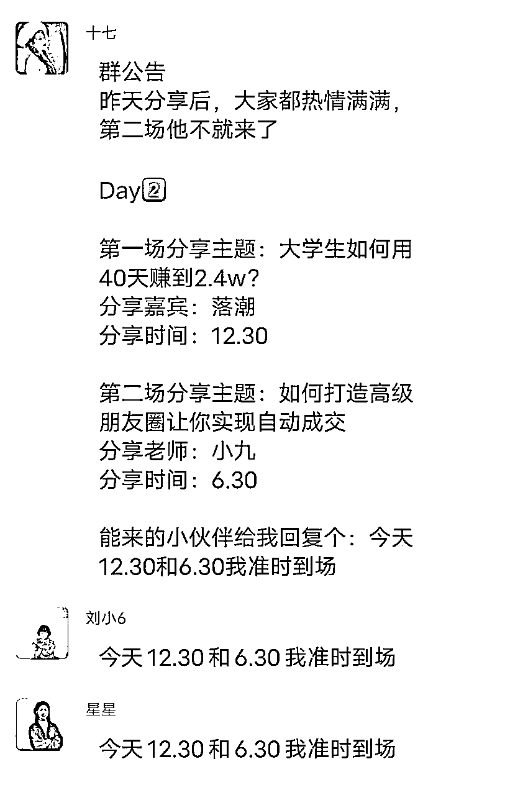

# 一个月操盘5场发售，营收31w➕，不同品类产品发售逻辑，尽数送给生财圈友，让你转化无忧！

> 来源：[https://pqu5cbjcjoy.feishu.cn/docx/Ev3sd2N9Po0QgQxCP3gc0yRon1d](https://pqu5cbjcjoy.feishu.cn/docx/Ev3sd2N9Po0QgQxCP3gc0yRon1d)

# 一、物料准备

# 1、1-2个你准备发售的产品

产品搭配建议高客单和低客单搭配结合着发售，高客单价产品有抬高用户预期的效果，低客单价能更好的承接转化流量 ，我发售过的产品，都是两种价位搭配着卖

比如：

1999的私教和199的陪伴群

6000+的高级班和3000的普通班

4000+产品和365陪伴群

发售的产品记得要有针对发售群里小伙伴的单独福利，感谢大家对咱们快闪群的支持，有针对性的给福利，就能让快闪群的人数多，氛围好。

# 2、准备3种海报

## 第一种：发售海报（戳蓝字拿模板）

海报内容包括：

1.主标题（主要是自己的人生蜕变事件）

2.副标题（主要是快闪群这几天能给大家带来什么变化，会讲些什么）

3.讲师介绍

4.每天的分享课主题（通常是3-5天）

5.进群福利

6.群聊二维码

## 第二种：倒计时海报

倒计时海报主要是为了给客户一个预期，我们能够解决客户什么问题？

（精髓是卡在客户的痛点和痒点上）

## 第三种：产品海报

### 第四种：直播海报（直播的精髓在于有一个解决的问题的主题，设置好直播间福利，让大家对直播有预期）

# 3.准备阶梯福利

### 第一种：进群福利

（这里建议大家不要抠搜，把好东西拿出来，先吸引大家进群再说，很多老板问我，万一他们就是为了白嫖我东西咋办？卉答：不用管，目的是筛选和帮助真心进群听分享的小伙伴）

### 第二种：邀请福利

邀请3人送什么？

邀请5人送什么？

邀请10人送什么？

促裂变非常重要，我们做发售的想法其实就为两点，其一是为了卖号产品，其二就是为了引流私域，作为我们的后续流量，这二者都很重要，流水不争先，挣的是滔滔不绝嘛。

所以咱们的引流福利也要有吸引力而且必须设置，不要因为嫌麻烦就不去设置了。

### 第三种：复盘福利

很多小伙伴进了快闪群之后，很容易因为自己的事情比较多，就不去看我们的分享，所以复盘福利也可以浅浅设置一下，复盘福利不像裂变福利那么重要，主要就是给大家一个必须去看我们分享的动力，如果分享的内容非常优质的话，大家会主动去看的。

### 第四种：下单福利

鼓励大家下单接龙，接龙后送福利。

物料准备的好，我们的动作会多，群内气氛也会很好。

# 4.公开课分享稿

快闪群公开课的分享稿通常分为几个部分

## part1：

分享自己的个人经历，主要是为了让大家了解你这个人，提高粘性，同时跟一部分用户共情，让用户觉得“他跟我差不多，他能成，我也能成 。”

分享稿结构模板如下：

第一部分：自我介绍（名称、年纪、主业副业，目前的成绩）+这次分享课的初衷（帮助大家解决问题）

第二部分：低谷期/成长之前

第三部分：转机+变化

第四部分：说说目前的状态

第五部分：鼓励大家

## part2:

分享干货，帮用户解决问题，这一部分的重点是：“你讲授的东西一定可以针对某一个问题，帮大家解决，比如：小红书封面干货。”带着“谁来了我的快闪群，学不到啥真东西就休想离开”的想法去做这次分享，那么结果一定超出你的所料，很多老板总是害怕“我把真干货都给大家了，大家会不会把我的干货都学了去，最后就不卖我的产品了“。我给的答案是：不会，只有给大家足够高的预期，大家才能对接下来的产品有更好的预期，从而下单。咱们格局打开，收一波好感也是好的

干货模板如下：

第一部分：开头寒暄（发红包、聊天等等）

第二部分：讲解干货（理论+案例+实操）

第三部分：引导大家提问

最后：宣传课程（这个后面发售节奏的部分我还会提到）

# 二、发售节奏和步骤

# （一）、发售前预热

### 预热安排：

发售前的预热至少3天，当然 5天也可以，各位做发售的老板一定要在这个阶段拿捏好我们的预热节奏，抓紧最大的好时机去做裂变，可以做以下几件事儿

第一：提前跟自己关系好的KOL聊一下，问一下帮忙发售的意愿，谈好cps

第二：发售前，各个私域平台铺垫自己的业务，星球、公众号、盆友圈、社群报喜、社群分享

以上两步铺垫属于集中铺垫起势，如果自己本身流量足够大，这一步可以省略，但是要是平时就倾向于默默埋头干事，这一步还是很有必要的。

第三：发售前3天集中朋友圈滚，每30分钟发一次海报，发一条删一条，保证自己的快闪群能被朋友圈所有人看到，同时多鼓励KOL去做分销，操盘手在社群内下指令引流：

指令1：引导添加老师微信领福利

指令2：引导拉好友进群领取裂变福利

指令3：给大家一些可以发的朋友圈文案

第四：准备几种文案

第一种：群公告（欢迎语+发售时间+福利+要求）

第二种：新人欢迎语

第三种：裂变福利语

第四种：控场话术（防干扰，有备无患，发售有时候就是争分夺秒）

### 预热节奏：

01：下指令领福利标准：1、持续进人50人左右下指令2、进群很多人，然后略微安静的时候（注意，不要没规律的反复下指令，会引起用户不适）

02：设置一个固定时间发倒计时海报，给用户心理预期

03：引导用户私信老师领取福利

正式发售安排

# （二）、公开课稿件准备

准备好真诚利他的分享稿，就是对它人的一次帮助

# （三）、发售当天

## 正式发售指令：

指令1：提醒大家听分享

指令2：提醒大家加老师领福利

指令3：提醒大家裂变

指令4：提醒大家复盘

指令5：提醒大家明天继续听分享

指令6：给后续的小伙伴总结复盘，可以私聊小伙伴跟他说社群的分享安排

以上指令，一直持续到发售的最后一天，发售未完，指令不停，这是我作为操盘手的基本素质。

各位KOL和老师记得持续朋友圈营销动作，让势能最大

## 正式发售节奏：

DAY1：

01中午发布指令艾特全员晚上听课，推名片，引导大家刷屏

02正式分享前发红包提醒大家开场，提醒大家加好友领福利

03分享种ing记得插入互动点，多发红包，让场子热闹起来，势能会强。

04分享结束主动提醒大家复盘有礼

爬楼

朋友圈继续吆喝

DAY2-3：

前4点同DAY1

结尾有个新产品的发售，记得丝滑接上

引导用户付款接龙

给付款用户一个仪式感

群冷后给大家爬楼

最后一天：

前面同上，但有一个群聊结束后涨价的逼单环节，这点老板们记得把握住

以上，如果老板们需要开直播，记得同步直播间链接，以及在直播间抢福利、红包、抽奖等等时候，再往快闪群里甩链接。融汇贯通。

# 三：发售注意事项

如：“在的宝子扣666”，“共情的宝子扣个1”，“想知道后续的拍拍我”......等等

# 四、发售群内突发状况处理

# 情景一：打广告

有人打广告

广告类型1：各种兼职广告

这种我们需要的是表达厌恶+提醒大家听老师的分享，相关话术如下：

广告类型2：各种水滴筹卖惨

这种我们的处理方法是用其他话题带过

比如：举手提问，表达期待

广告类型3：同行打广告说什么可以赚钱

表达厌恶+提醒群友这是杀猪盘+正向期待老师分享

# 情景二：闹事

有人质疑分享/课程

1.表达老师虽然买课但也是真诚分享

2.表达免费听到现在的干货就很荣幸了

3.感谢老师和嘉宾的分享

......

# 情景三：用户不适

有人说我们反复欢迎提醒加老师微信太打扰

1.建议可以屏蔽

2.表达确实需要提醒新进群的成员

3.正向带节奏

# 情景四：爆粉

发现直接移除，并且在群里公示给大家，提醒大家注意

# 情景四：炸群处理：

1、工作人员立刻添加封群里面的伙伴，说明情况，询问重新进群意愿，重新拉进群

2、更换群主和管理员，不要让已炸群群主和管理员担任（规避风险）

3、不要用相同话术在群里下指令

# 情景五：封号处理

1、立刻申请小号，更换头像（说明情况）

2、操盘手重新让大家添加老师，为表歉意，多准备一个额外福利（引流到新微信号）

3、不要给信号群主和管理身份，保护账号安全

# 五、不同产品发售重点

说是不同产品，其实不如说是两种产品：

1、离钱近的：比如，项目类、营销类、成长类，都属于离钱近的，有些是给财富加成，有些是直接做了就有收益

2、离钱远的：比如，健康类，教育类（跟钱一点关系也没有，对人的吸引力就会略小一些）

所以我说说这两类产品的发售重点

# 教育类产品：做长期规划，静水流深

不瞒大家说，教育类真的很看目标客户质量，一件非常扎心的事就是，与赚钱关联不密切的东西，就是不容易靠着一次发售能解决的，所以后续会给大家分享+分析一下最适合教育类产品发售的模式。

教育类的对标用户往往是学生和家长，通常成交比较困难的是两种群体

## 1、大学生：四六级阿、各种学习项目陪跑

大学生有几个特点：资金不充足、有自己的资源圈子（比如：各种盗版网课资源、各种学习小组和搭子）、觉得靠自己也可以，所以他们再看到一个知识付费产品的时候，往往都只是抱着“到此一游”的观望态度，大学生的心路历程往往要经过个一年半年的，也就是他们反复尝试，发现自己做不来，效率不够，方法不对等等，才会想起：“哦~对了，有个老师好像专门教这玩意，我去咨询一下吧~”

这是人性，我们无法抗拒

所以我们要做的不是违背人性，而是顺从人性，那我给大家总结了发售重点

## （1）、发公开课的时间一定要足够

起码是5天打底，最好是这5天可以给用户一个小小的成就感，比如：【四六级听力技巧分享+实操打卡】【CPA金融资产讲解+习题演练】【英语写作技巧分享会】

主题详细，能让别人真正地通过这一次小小的分享会收获一些真东西，很多老师有一个误区，就是分享会的时候会藏着掖着，怕别人把真东西学了去，这其实是一个误区，我们反而要抱着让他们真的学到真东西的架势去做好每一次分享，收获用户的好感度，让他们愿意去分享和推荐，并把他们留住在我们的朋友圈，成为我们朋友圈的忠实用户。

这种极致利他思维一下子就格局打开，让我们的用户体验感上升一个层级，粘性也会大大提升，对于教育类产品，做到留住用户，就是成功的一半。

## （2）、公开课的福利一定要好、要多、要全

如果您发售的是一个非常成熟的教人怎么赚钱的产品，那我反而在福利这一块不会卡太死，但是用户是学生，那么我一定会建议找我发售的老板，准备足够好、足够多、足够精良的裂变福利。

因为大学生是最喜欢领取这些小福利的一部分用户群体了，免费网课、免费真题的pdf、7天打卡营体验卡等等，这样他们会为了福利主动去转发、裂变、邀请自己的同学、朋友，一起来学习，来领取福利。

而走量一定是王道，我在考研的时候被朋友推荐了一个老师，最后加上那个老师好友之后，我朋友没有报名考研班，我一冲动报了个名，直接给人家送去3W块的业绩，这就是为什么我们要去做裂变，很多老板就准备一两个福利，还是太少了，而且真的不够吸引人。

如果一次发售，裂变超过了原本流量的一倍，那真的太成功了，这些流量放在朋友圈慢慢养着，咱的福气在后头。

## （3）、可以多做几次发售

但不必每次都卖产品，像教育类有个东西非常有意思，就是他的资讯，每一段时间都会更新一下，比如考研要更换什么书、新添加了什么题型、某种学习方法的分享，都可以做周期性分享，比如每个季度一次（模拟刘润一年一次的演讲）

每一次的分享都是一次重新促活，也是跟大家的一次深度链接，不定期让大家直观感受咱们的专业和负责。

## 2、少儿教育启蒙：

很多人都是没有给孩子早教的意识的，往往都是更愿意再等等，再观望观望，觉得孩子还小等等......所以早教类产品要么筛选用户，要么就是给用户拉到一起，互相看看其他人家孩子的进步。

有一个很有意思的就是，如果让一个妈妈买一个产品，他可能不会买，但是你让她看到自己姐妹家的蛙进步很大，他会立刻下单，这就决定了早教类产品的发售模式。

1、互相做彼此的榜样

2、放长线钓大鱼

3、带实操，让宝妈宝爸们尝到甜头。

这就确定了早教类产品的一个发售重点。

## （1）、这个盘子人手一定要足

零星的两三个人很难带动大家，所以多凑人手很有必要，不管是找僚机也好，还是自己手头的流量本身就很活跃也好，一定要营造一个大家晒娃、分享的氛围，这个氛围能够带动其他宝妈模仿的情绪，想让自己的孩子也如此。

## （2）、实操性强

其实对于宝妈来说，有时候讲过多的理论知识，反而是他们不感兴趣的，说上千万遍，不如让他们自己试一遍，所以只需要我们在公开课选题上，偏实操一些，就可以解决好这个问题。

比如：【亲子xx打卡公开课】【萌娃xx实操体验课】

## （3）、做好朋友圈规划安排

也就是我前面说的放长线，钓大鱼，做好定期的回访督促，爸爸妈妈们看到孩子实打实的进步，才会真正地去推荐我们的产品，认可我们的产品，所以我们的每一步觉得都很重要。

# 健康类产品：给价值+直播+答疑

之前有幸帮一位做刮痧课的姐姐做发售，线上的刮痧课程，发售1天就卖出了110单。

所以我也总结了一些重点给大家：

01：平时在群里给大家更新干货。像我的这位老板就是呼声比较高的那种，一呼百应，课程也很用心，所以大家对她的信任度也高。

02：要学会设置关键节点促销，活跃气氛

03：给到一个下单仪式感

# 其他：干货+直播+案例，把试吃蛋糕做香

先看看彩卉的案例：

01：AI带货，3天，直播+社群，客单价6000+，GMV15w，给大家盘一下项目发售重点。

02：文案营销，3天，直播+社群，客单价1999，GMV5W+(因为交付老板限制报名人数，很快名额就满了）

03：公众号爆文，5天，社群，客单价1599，GMV10w+（长尾流还源源不断）

04：成长陪伴类，4天，社群，客单价388，GMV1w+

1、干货价值给到。

不要藏拙，也不要怕同行抄袭模仿，一篇分享稿3000字，1000字宣传自己的课程，另外2000字没什么干货，水过去了，是非常不可取的，也是发售误区之一 。

把稿子写的实操落地，能让群里的用户看到价值才是重中之重，通常来说，想要变现的小伙伴，都是希望能学到一些真东西，看到曙光，也就很注重理论实操部分，如果这一点上能做好，发售的成绩一定会非常不错。

2、结合直播

直播注意3件事

（1）讲解课程的优势和当下用户的痛点，同时给出痒点

（2）抽奖+逼单+讲解课程福利+给大家答疑：直播时间可以长一些，保证尽可能多的跟用户做触达。

（3）有耐心：直播时间长会有一个问题就是，说到后面会说的有些累，有些烦，可以准备一瓶水，缓一下，不要着急，以免动作变形。

3、注意案例

不管是哪一种赛道，有案例都是一件很吃香的事，项目也是如此：一定要注意介绍案例的人群画像，动作流程，可复制性，给其他同样用户一个预期。

六、一些心得感悟和给大家的建议

到目前彩卉操盘过的项目已经有10几场了，每一场的效果都非常不错，我总结了一些自己的操盘心得。

1、把老板的产品当成自己的产品，把老板的业务当成自己的业务。

像我每次操盘之前，都会详细阅读客户的产品体系，客户的产品介绍，不懂的地方打电话跟客户沟通，确保自己对客户的产品优势、内容、福利、交付模式等等全部烂熟于心，这样在后续筹备物料的时候，就非常容易抓住关键点。

2、不要怕麻烦

一定要跟用户反复确认物料和话术，保证操盘手和用户之间的信息是最早流通的，而不是沟通不及时导致出现问题，包括对用户物料的修改和建议，我都是很精细地修改，保证后续动作丝滑，发售过程优雅。

3、保持冷静

操盘是一场心理战，炸群、被举报、封号、有人在群内捣乱......这些情况我全都遇到过，其实这是最需要保持冷静处理的时候了。

4、把每位老板当作贵人

发售这件事，我一直都很感谢每一位老板的托举，在发售过程中，每次都跟老板处成很好的朋友，一个赛道有很多人做，不同的是走过的路和积累的案例。

好啦，以上就是彩卉几场发售的全部心得啦，2024，轰轰烈烈！