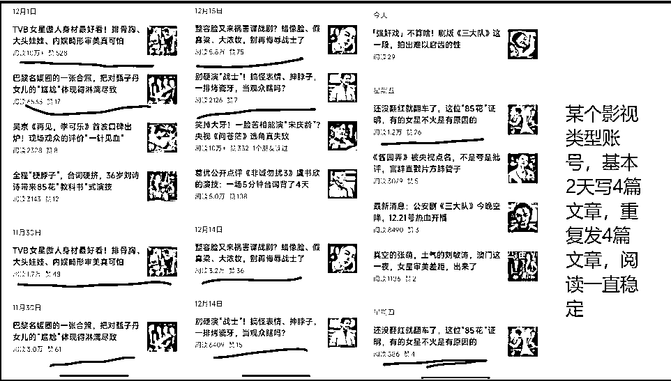
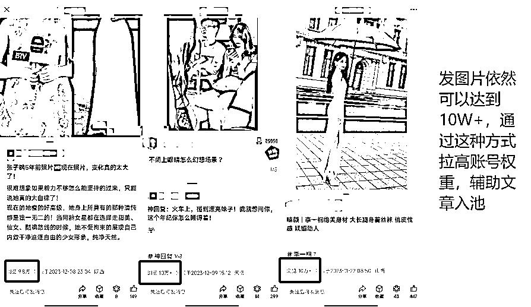
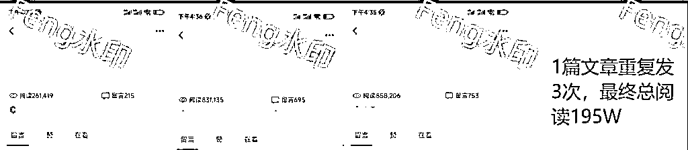

# 公众号爆文变现 6 位数复盘与思考

> 来源：[https://kvsqxrpcce.feishu.cn/docx/FuyAd4FHcoIgKtxBA2xcfr0anFb](https://kvsqxrpcce.feishu.cn/docx/FuyAd4FHcoIgKtxBA2xcfr0anFb)

文章首发：生财有术

大家好，我是在西安的圈友 Feng，生财小透明，特别感谢生财有术提供的平台，让我挖掘到很多有用赚钱信息，并且赚到了第一桶金。

生财是一个宝藏圈，用好它，你就有无限的可能。

保持开放的心态，理性的认知，你就会收获无边的海洋。

加入生财也很久了，一直在默默潜水，我和很多新圈友一样，犯过信息焦虑，有一段时间，我甚至不会打开去看，因为看多了我会怀疑自己的能力。

加入生财之前，我在自己的圈子里，感觉自己能力还不错，后来开始怀疑自己，这个过程其实我们都没错，只是我们的圈子变了。

每一个大佬，都曾有过迷茫，都曾经历过新手村，他们背后付出了多少，或许我们都没看到，所以保持开放的心态，认可别人的成绩，提升自己的能力，少围观，多下场实操。

今年我在生财很早就看到很多圈友做公众号爆文了，包括亦仁哥今年 2 月对公众号爆文的预测，8 月的帖子我都有注意过，但是一直都没有真正的下场实操过，直到 9 月底，我开始为我不稳定的收入开始焦虑，我才意识到我该下场实操了。

幸运的是一个月左右，我拿到了还算不错的结果，并且赚到了公众号领域的第一桶金，直到现在我们仍然有较为稳定的收益。

事实证明，公众号爆文项目在当下任何时间入场都不晚。

声明：以下文章内容涉及到账号数据情况，我打了马赛克和水印，还请各位理解。（主要考虑到可能在传播的过程中被一些同行用来培训割韭菜）

以下是我做公众号的一些经验，希望在这个寒冷的冬天带给大家一些温暖，如果你能因为我这篇文章后续多赚几千、几万，甚至 10W+。

希望你能在生财写个复盘，激励更多的人下场实操，让更多的圈友生财。

再次，感谢生财！

### 公众号爆文还可以入局吗？

这个问题是很多新手都会有的疑问，任何项目都存在。

其实，从项目的角度来划分，只是说是否属于红利期，至于能否入局，我觉得任何时期都有机会，不存在能不能做的问题，只要你下场实操，就有机会，任何项目都没有表面看起来那么美好或糟糕。

最近我们观察过很多新号，有不少号依然篇篇 10 W+，所以还有很大的机会。

包括 24 年 1 月份的公众号爆文航海，我认为大部分圈友都能变现成功。

### 现在还有哪些赛道可以入局

### 

我这边主要做过娱乐、影视、情感、科技、体制的赛道，最近我们也观察到不少同行在更多的细分领域的赛道都做起来了。

*   情感类、养老金、这类赛道，目前不推荐，做起来的概率很小，如果 8 月之前卷这类赛道完全没问题。

*   娱乐、影视赛道，目前还可以继续做，但是不稳定，出爆文的概率相对比较大

*   体制类目前起了一批号，最近 1 个月很多号都做起来了，出爆文的概率比较大

*   科技类型赛道，我们最近刚起号，阅读比较容易破千，破万，但是破 10W+比较难，阅读的单价相对比较高

*   还有一些小众领域，早安、晚安、文案、城市、地理类型，阅读也比较稳定，赚回生财明年的门票也没什么问题

*   以下是我们新起的早安类型小众领域的账号，图迎合老年人，推荐入池的概率相当高，每天8 篇后期稳定每天 1W 总阅读的概率相当大，而且不需要原创，创作成本相当低。

*   以下是我们最近刚开始测的科技领域赛道，阅读容易上去，但是这个领域破十万还是比较难的，单价相对比较高一些，科技类型的领域也是我最近从生财风向标挖掘到的信息，这里建议大家平常没事的时候多看看风向标的信息。

科技数码赛道是我从生财风向标看到的信息，然后我们立马去实操验证，模仿了相关的标题，验证的结果，数据符合预期。

小众领域，还有很多，需要大家不断的去挖掘和测试，只有亲自入局，把手弄脏，才能验证别人说的是对还是错，时刻保持怀疑的态度。

### 现在做公众号爆文的注意事项与常见问题？

做爆文这么久，我们踩过很多坑，以下是我们遇到的一些问题，希望对大家有帮助，不要重复踩坑。

###### 纯写文章自然涨粉 500 再开流量主推荐吗？

不推荐，从我上面的截图可以看出来 200 W 左右阅读，才能自然涨粉 570，也就是你账号至少写出 200W 阅读才能涨粉 500+，这个收益可是 1-3W元。

200 元能解决的事情，就不要死磕写文章涨粉了，如果你擅长从其他平台引流，那么也是可以的。

###### 500 粉是开通流量主的门槛，账号少的情况建议不要省钱。

11 月之前，机器粉永久封流量主的概率不大，11月后，封流量主的概率不小，每一段时间严格程度不一样，机器粉很容易被检测到，所以我建议大家搞真人粉。

真人粉单个 2-5毛（大家自行甄别，稳定为主）如果有人找你交易，因为对方渠道出问题，本人不承担任何责任，机器粉 1毛左右，差距也就是 200 元左右，1-3W 阅读就可以回本，所以更推荐大家上真人粉，我们目前上的真人粉账号没有出现问题。

总结：从我们目前做的账号来总结，有基础真人粉的账号推流更长久

###### 违规会导致账号流量下滑吗？

可能会，一般违规主要是滥用原创或者被投诉侵权

因为我们也收到过滥用原创，但是并不影响后续持续的推流，但是违规的文章肯定不会被持续推流

###### 重复发文会影响账号持续推流吗？

大部分情况都会被限流，部分天选之子的账号影响不大，如果你账号多或者说你能承受住限流的风险，可以尝试，因为爆文 2 次重发爆的概率很大，直接可能将你单篇文章收益拉高几倍。

假设你的一篇10W+文章，重复发 6 次，阅读达到 200W，收益 1-3W元，相当于你写 20篇 10W+，即使这个账号被限流了，我觉得也是一种十分值得尝试。

还是那句话，希望生财的圈友对公众号爆文有一个重新的认知，因为爆文绝对是普通人副业变现的路上的一个好项目。

*   天选之子账号，一直重复发文，一直不受影响

*   非天选之子账号，重复发文 1 次，第 2 天就被限流，还有一些账号重复发文 3 次以上才被限流

###### 每天建议大量发文吗？

我不建议，当然你要去验证，也是可以的。

就拿这个账号举案例，大量发文 1 天，虽然出了篇 10W+，1 篇 9.8 W，但是后续文章的流量再也没有起来，直到今天都是 0 阅读。

如果你的账号足够，当然你可以尝试这种玩法。

###### 账号如何稳定单天 10W+ 阅读？

其实这个我们也很难维持，我们最多维持的账号也就 40 多天，每天 10W+ 的数据，后来因为一个限流，账号数据就直线下滑了。

能稳定的办法我觉得只有一个，每天持续更新 6- 8 篇左右的文章，并且持续能写出爆文，并且建立在你的账号不掉出池的情况下，这样所有文章的长尾流量每天累计都能达到 10W+。

###### 文章阅读字数限制在多少合理？

这个问题不同的人有不同的看法，我们的做法就是保持在 1200 -1800 字左右，1W 阅读收益在 50 - 300左右，我们都经历过，所以可以保证的是，你的文章字数最好在 1200 字以上，1200 字以下文中广告随时都可能会成为 1 条甚至 0 条，直接导致你的文中广告收益变低。

###### 如何提高阅读收益？

其实对于这个问题，我们大部分情况都选择默认系统全选的广告，因为我们测试出，这样广告的收益也可以达到一万阅读 300 收益，反而刻意的去设置广告会导致收益降低。

当然这个观点可能也是错误的，因为不同的领域可能垂直用户不同，总之我们娱乐，影视类型基本都是全选广告的，因为我们相信大数据可以精准的把广告推给用户。

以下是我们最近一个账号的底部广告 eCPM ，可以达到 20-30 元，所以说我更相信大数据。

###### 认证的账号对推流有帮助吗？

对于这个问题，我想说的是可能有帮助，认证的账号毕竟是金 V，不管是对用户还是对官方来讲，都是对你的账号有了进一步的信任。

具体的认证方法，很简单，我放在下面，大家自行查阅。

1.  进入公众号后台，点击账号详情，找到这个界面，点击手动认证。

*   一年可以认证 3 次，最近一个月不能出现违规，最近 30 天要有发文

1.  填写相关的资料，选择领域

*   最重要的一点，就是很多人有个误区，其他平台没有粉丝，自己能认证吗？其实，只要我们一个账号写过 20 篇原创，然后将这些截图作为证明，大概率都可以认证通过。

###### 账号一直无法进池怎么办？

我们做了很多账号，有些账号确实进池比较慢，但是总体我们得到的结论如下：

*   长期不写的老号，突然开始认真更新文章，进池的速度会很快

*   有留言的账号，广告收益明显比较高，有争议的话题更能引起用户留言讨论

*   部分新号进池比较慢，属于正常的现象，坚持更新即可

*   一直发文没有进池，建议发早安、图片、视频号，拉高账号权重，有利于更快的进池

*   一篇爆文进池以后，会联动旧文跟着爆，带动整个账号的文章进池，拉高账号整体权重

###### 3.11 个人账号如何委托企业收款？

个人账号收益一般需要扣税 20%左右，如果你有委托的企业，这部分可以节约不少钱，前提是收入足够多的时候。

以下是相关的财务设置步骤：

1.  流量主 - 财务管理 - 立即完善

1.  填写相关的信息

*   这里需要特别注意，下面我们展示给大家案例：

开户证明图片如下两个均可

*   开户证明上传下面的两张任意一张均可

*   如果上传这张的话，开户凭证打印盖公司的章即可

委托收款协议填写如下

最后提交，等待审核即可，1- 3 天即可通过。

### 单篇文章持续收益 1W左右 复盘思考

12 月我们做一个账号，比较特例，或许很多人都没经历过，我们写出一篇爆文（12.12发布）以后，每天都能涨几万阅读连续涨了 10 天左右了，目前还保持每天几万阅读的增长，这篇文章目前收益 11000 左右，如果持续再推流一周，应该会达到 2W 左右，阅读目前 40W+。

但是我们再写其他文章的时候，阅读始终没办法进行大的突破，最多也就是几百阅读，所以我们现在的做法就是不断的尝试，如果 12 月还没有继续出现第 2 篇爆文，我们会选择暂停更新一段时间，过段时间重新再尝试。

这个事情告诉给我的反思就是不要在一个账号上面死磕，每个账号都有自己的使命，我们不要奢求太多，要学会满足，一篇文章已经帮我们创造了马上 1W 左右的收益了，基本完成了账号的使命。

要学会放下，不要在不值得的事情上面持续消磨自己的时间，把这部分时间放在其他新的账号上面来才是正确之道。

这个案例也告诉我们，公众号的长尾流量非常长，也是这个项目的优势之一。

我们要想在公众号爆文这个项目上面走的更远，就要学会放弃，学会满足，懂得取舍，因为前方的路还很长，赚钱的周期还很长。

不要为自己现在取的成绩沾沾自喜，不要停步不前，只要你还没下桌，一切都还有机会。

### 单篇文章收益 2W左右复盘

写了将近 2 个月文章，我们目前还没有写出单篇百万+阅读的文章，确实很难写，大部分账号都很难达到这个高度，阅读一旦破 50 W以上，很容易触发到人工审核。

虽然单篇文章无法达到百万阅读的高度，但是单篇文章重复发就可以达到这个高度。

我当时写的是恒大的选题，主要是因为当时这个话题比较火，但是因为敏感，我一直在犹豫要不要写这个话题，最终还是选择写了。

现在回想起来，还是觉得过于担心了，当时我们观察到很多同行的账号，写恒大的话题很多 10W +，而且他们每天都写这个话题，每天都爆。

这里有个回顾，我们写第一篇恒大的选题的时候，当天推流到 8W+，然后停止推流了，我们猜测是官方压制这个话题了，所以没有继续写。

第 2 天发现又开始推流了，而且很猛，所以我们隔了一天，将这篇文章直接重复 2 次发，睡醒以后又是 10W+，并且推流很猛，最终达到 80W+。

第 2 篇以后，我们再考虑第 3 篇要不要继续发，担心被限流，所以又隔了 1 天，还是决定继续重复发，结果比第 2 篇推流的速度更快，最终还是大到 80W+ 的推流。

这个复盘告诉我一个道理，该赚钱的时候，只要在合理的范围内，应该把胆子放大，如果我们当时放下担心，坚持每天发 4 篇恒大的话题，或许又是不一样的结果，或许收益又可以翻倍，当然这只是猜测。

前两天我在航海家俱乐部看到亦仁大哥，分享的一个观点 自己真正下注的观点才有价值。

赚钱也是同样的道理，只有你做了才有意义，你没做之前，瞎预测，最终成为了现实和你并没有半毛钱关系。

经过这件事以后，我更加坚信，我们不管做什么事，要为自己的决策负责，不管结果如何，我们都应该坦然的去接受，不要做事后诸葛亮。

### 多篇 10W+ 思考复盘

2 个月时间，我们写过 100 篇左右的 10W+ 文章，其实如果现在让我 2 个月重新写出这么多的10W+文章来，我们也没把握，或许需要在账号数量基础上翻 2- 3 倍才能达到这个效果。

最近我也有关注过董宇辉的话题，俞敏洪能重新复制出一个超级 IP 董宇辉吗？

大概率不可能。

很多时候，需要时机、需要运气，很多综合因素在里面，没办法复制的。

11月之前，重复发文或许不容易被检测到限流，12 月平台调整规则或许就更容易检测到了，所以我们写多篇 10W+ 的难度就会增加不少倍。

要说创作多篇 10W+ 的秘诀是什么？

其实这个问题，很难回答，因为有时候就是运气占很大的成分。

以下是我总结的几个点，或许对圈友友有一定的帮助，不一定对。

1.  做好标题、封面、文章排版（重点特殊标记），每次创作我最看重的就是标题，因为标题直接在很大程度决定你文章的阅读高度，如果你辛苦创作一篇文章，最后随便瞎写了一个标题，其实这种结果大概率不会太好。

1.  多找对标同行，多分析他们的账号，他们测出来的方法，就是帮我们在踩坑，我们要感谢他们，不要恶意举报同行，为自己积点德，不要眼红同行赚钱。

1.  少写一篇文章，也不要大量瞎写，瞎搬运，要对自己的时间负责。

1.  保持怀疑，多测试，不要一直在一条道上面走到黑，方向错了，再怎么努力，都没用。

1.  一个账号并不是只能写一个方向，多个方向都可以尝试，找到适合自己账号的方向，我们账号从情感转到娱乐，照样可以写出爆文。

1.  每个账号都有自己的爆款基因，这就是解释为什么同样的内容别人爆，你就不爆的原因。

1.  爆款是基础，数量是爆的概率，在你数量没有达到一定的高度的时候，一切都是正常的。

1.  你的账号测出一个方向或者一个话题以后，坚持从这个方向或话题写下去，不要跑偏。

1.  能做 10 个账号，绝不做一个账号，一个账号如果没有做出结果，不是你的能力不行，也不是你运气不好。

1.  进池的账号一定要好好更新，好好把握，该赚钱的时候，大胆的去赚，能 3 天干几百万阅读，绝不等下去。

还有很多圈友可能会问文章如何创作，其实创作文章应该是最基础的基本功，生财的航海手册里写的也十分详细了，其它圈友也有相关的分享，大家自行收集学习，我就不再这里过多的赘述了。

### 未来展望

其实对于写文章这件事，我也不知道能走多远，但是我会持续写下去，因为写文章可以帮我持续获得稳定的收益，下次分享可能就是 7 位数收益了，哈哈哈，大力出奇迹，数量对抗流量算法的不确定性是我一直相信的观点。

我是一个一直在犯错的人，一直到处踩坑，很多圈友或许和我一样，但是我想告诉大家即使你有一半时间都在输，到最后依然能赢！

最后，希望生财的圈友都能一起生财。

一起抱团取暖！