# 让你的视频号直播间瞬间“吸粉”的秘密武器

> 来源：[https://jkvuqpws3r.feishu.cn/docx/FxyMd3J8OoE6KoxBuTfcgm56nVb](https://jkvuqpws3r.feishu.cn/docx/FxyMd3J8OoE6KoxBuTfcgm56nVb)

大家好，我是爱学习懂设计的二胎全职宝妈包包。

不知道做视频号的主播们，你们是不是经常在直播间里努力表演，却发现观众寥寥无几？现在视频号有封面，但是不点进去听是不知道说什么内容的。

别担心，今天我要给你们揭秘一个超级实用的小技巧——直播贴片。这不仅仅是一张图片，这是直播间的“门面”，是吸引观众眼球的第一步！

想象一下，你刚开直播，直播间冷冷清清，就像一个刚开业的小店，门可罗雀。这时候，你需要的不仅仅是才艺，更需要一个能让人一眼就记住的直播贴片。它就像是你的“招牌”，告诉路过的观众：“嘿，这里有好戏看！”

视频号直播间贴片学问多多

一：设计原则：

1.  清晰明了的主题：直播贴片应该一眼就能让人知道在直播什么。是教程、游戏、美妆、健身还是聊天？让观众一眼就能找到他们感兴趣的内容。

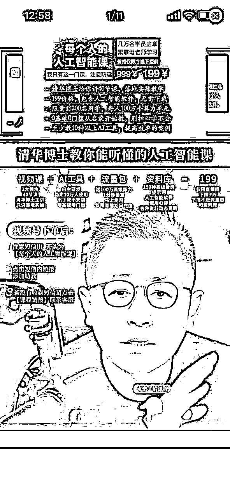

1.  吸引人的色彩搭配：色彩是视觉的第一印象。用对比鲜明的色彩，或者你直播间的主题色，让你的贴片在众多直播间中脱颖而出。

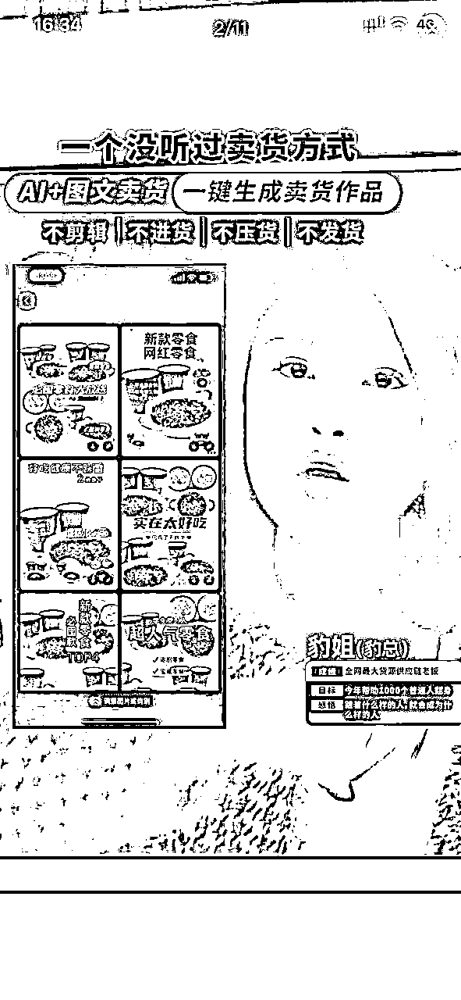

1.  简洁有力的文字：别让文字过多，简洁有力才是王道。一句话，甚至一个词，就能让人知道你的直播内容。比如，“今晚吃鸡”，“美妆教程”，“健身挑战”。

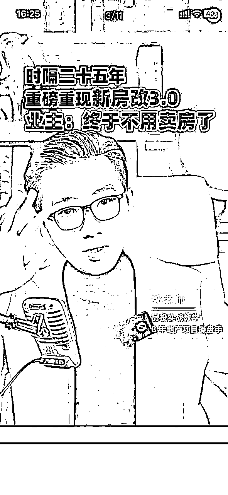

1.  个性化的元素：加入你的个人元素，比如你的卡通形象、标志性动作或者直播间的口号。这样，观众不仅记住了内容，还记住了你。

二：不同设备不一样

微信官方手机就可以加入静态的贴片。但是苹果和安卓会有一定差别。如果制作的话，建议大家制作精简一些的标题样式会更好。

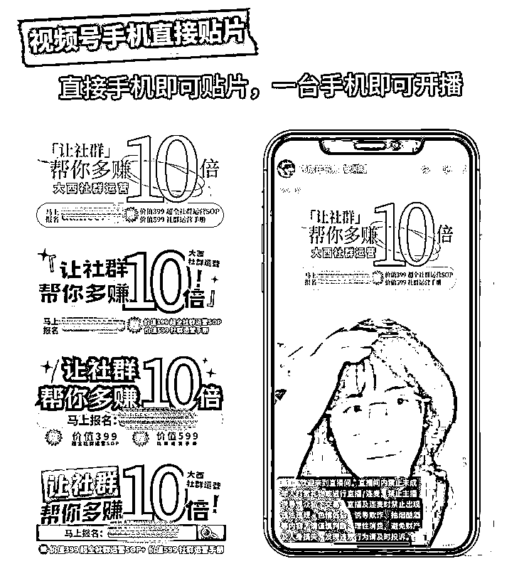

制作完成后可以点击直播，部分可见或者彩排，用第二台手机看看效果如何。不满意可以长按往下拖动垃圾桶删除，重新添加。

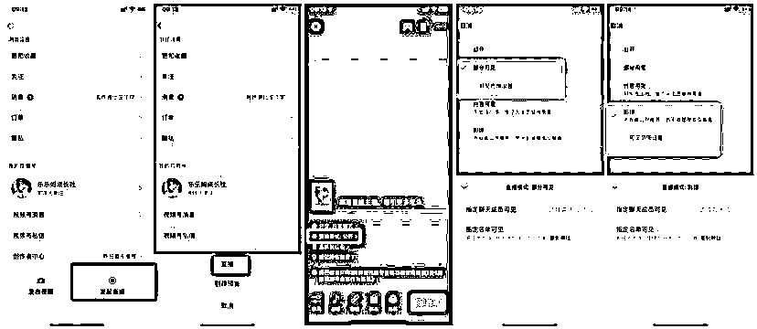

官方每次只能添加1张静态图片，直播过程中可以删除及更换。

三：第三方软件辅助

如果需要有铺满全屏的效果，可以考虑第三方软件，如：obs、直播加加（苹果安卓通用），直播伴侣等软件。有些是需要收费的，大家看清楚条件按需入手。

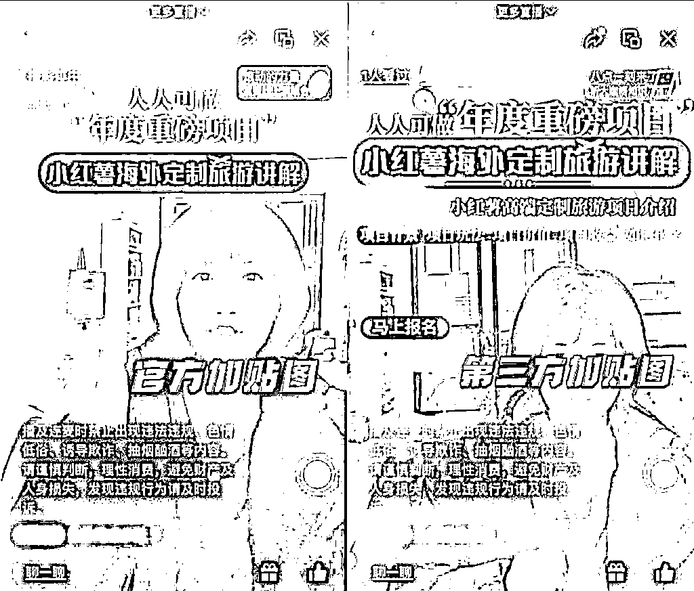

第三方软件可以做什么：

① 动态视频贴片：通过第三方软件，你可以将动态视频片段作为直播贴片，这比静态图片更能吸引用户的注意力。动态视频贴片可以展示直播的亮点，让观众在进入直播间之前就能感受到直播的活力。

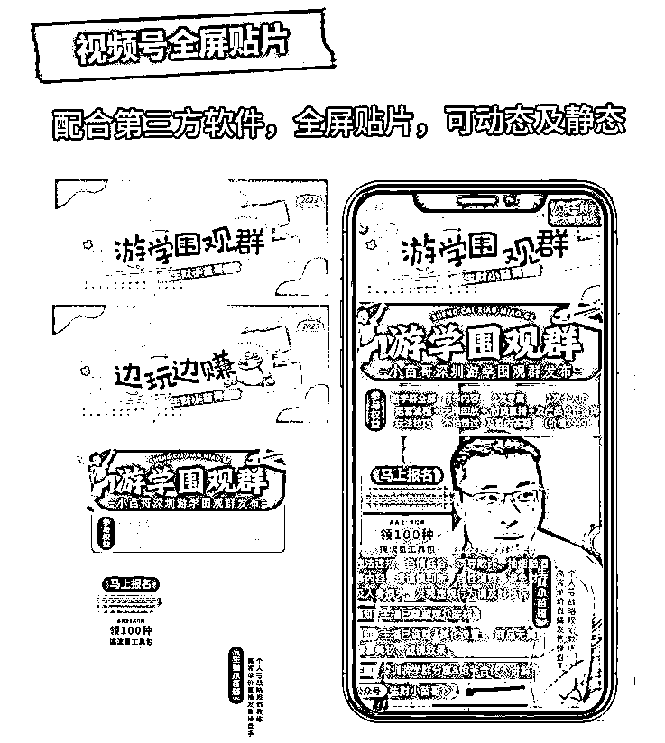

② 多场景切换：在直播过程中，如果能够根据内容的变化切换不同的贴片场景，可以增加直播的趣味性和互动性。比如，当主播进行户外直播时，可以展示户外的实时场景；当进入室内时，又可以切换到室内的场景。

③ 全屏显示：全屏贴片可以让观众在浏览视频号时，一眼就能看到你的直播。这种设计可以提高直播间的曝光率，上下左右栏都可以增加不同程度的细节。

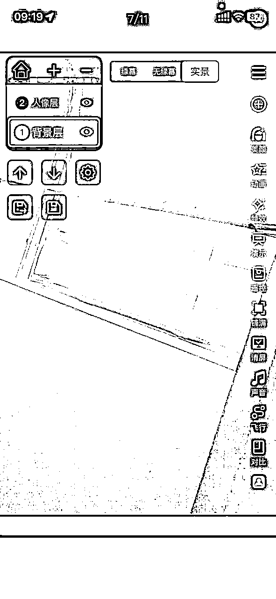

四：如何制作

静态图：电脑可以选用作图软件，如PS。手机端可以使用：美图秀秀、醒图、可画。

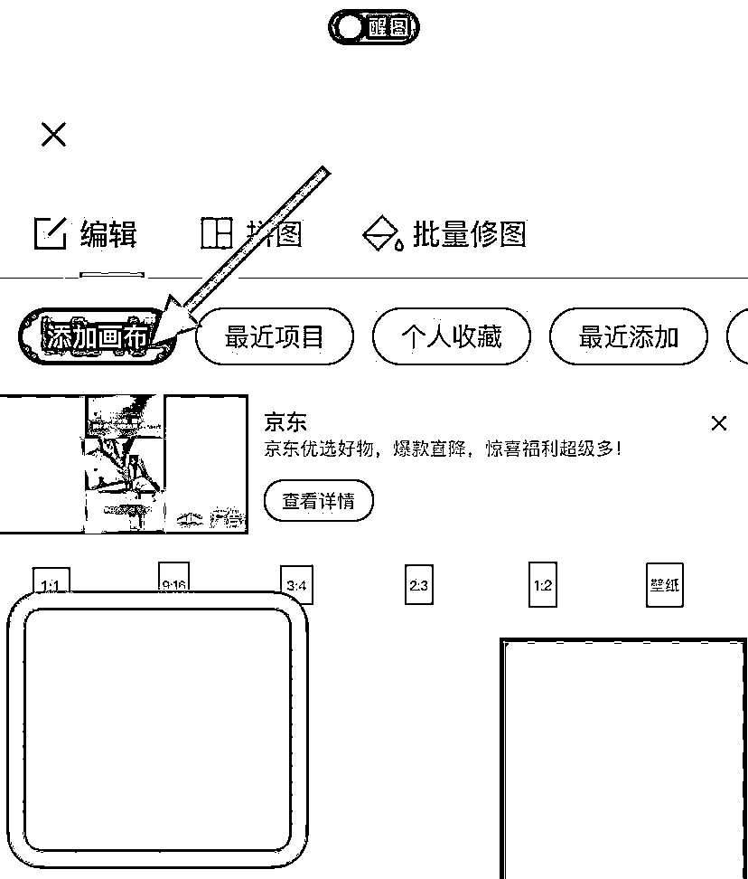

只要是能制作透明背景图层的就可以。

五：手机端如何上传贴片：

将手机微信更新到最新的版本，点击直播，选择底部栏的画面，点击贴图，拖到到合适为止，手指拖动放到最大即可。

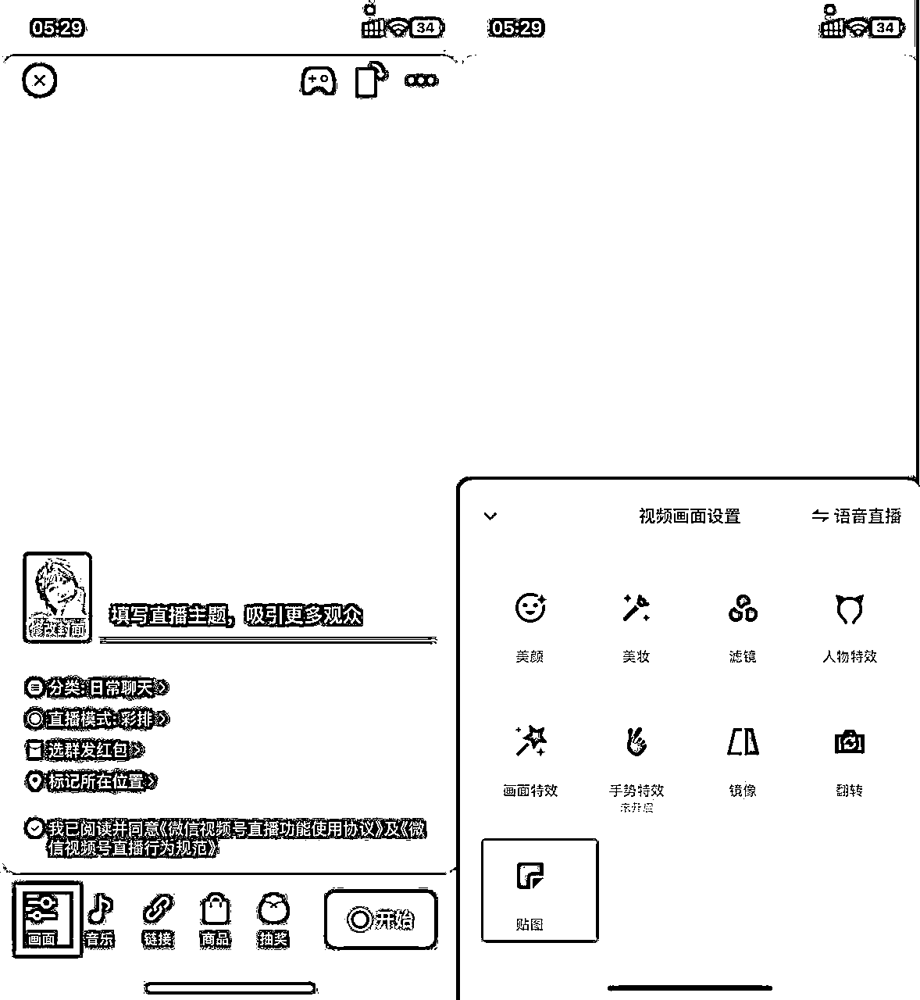

结语：

微信视频号直播的风口已经来临，而直播贴片设计将成为你在这个风口中站稳脚跟的必备工具。直播贴片是你的直播间的“第一印象”，设计得好，就能吸引更多的观众驻足观看。所以，花点心思，让你的直播间从众多直播间中脱颖而出吧！加油，下一个直播间人气王就是你！

为了方便大家，包包推出了直播间贴片定制设计服务及个人IP社群定制表情包服务。有需要可以联系包包

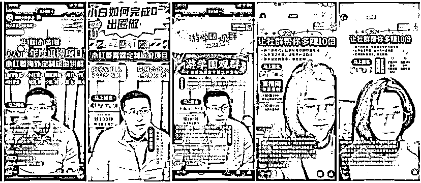

三

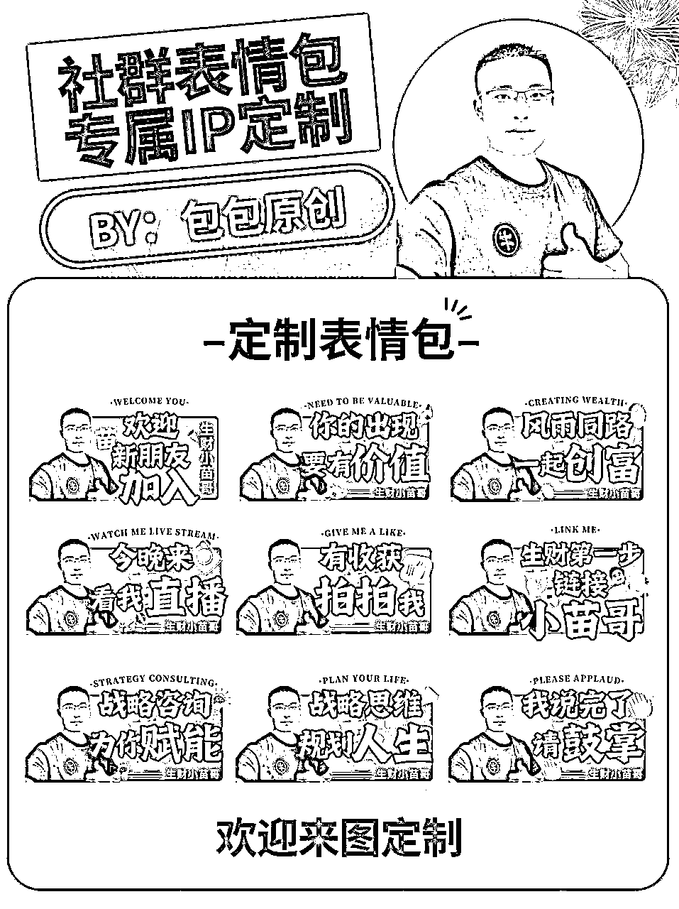