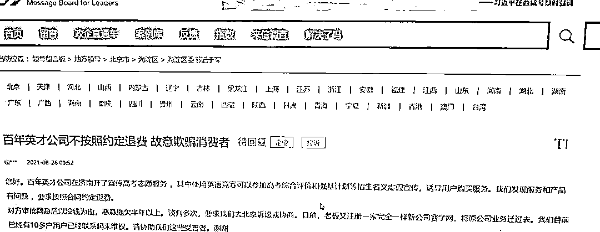

# 风向标拆解第 2 期-《K12，怎么通过升学规划继续卷》-Bob

> 来源：[https://zyf4pciaqe.feishu.cn/docx/Gtnzdpqn1of2AJxfn47cmSxinih](https://zyf4pciaqe.feishu.cn/docx/Gtnzdpqn1of2AJxfn47cmSxinih)

# 升学规划基本概念

## 定义

升学规划是一个全面的教育策略，旨在帮助学生为未来的教育和职业生涯做准备。它不仅包括考试准备和课程选择，还涵盖个人兴趣和职业目标的发展。

## 目的

升学规划的主要目的是确保学生能够最大化其教育潜力，同时寻找和追求他们的兴趣和职业目标。通过这种规划，学生可以更好地了解自己的优势，制定适合自己的学习和职业道路。

## 基本方法

升学规划的方法包括但不限于：

1.  个性化分析：了解学生的个人兴趣、学习风格、学术成绩和未来职业目标。

1.  课程选择指导：根据学生的兴趣和学术目标，选择合适的学科和课程。

1.  能力评估：定期评估学生在各学科的学习进度，以便及时调整学习计划。

1.  职业规划：探索学生的职业兴趣和职业发展路径，包括实习、志愿服务等经验的积累。

1.  辅导和支持：为学生提供必要的学术辅导和心理支持，以应对考试和申请过程中的压力。

通过这些方法，升学规划帮助学生在激烈的教育竞争中获得优势，确保他们能够进入理想的学校，从而为未来的成功奠定基础。

## K12教育

K12教育，即从幼儿园到高中十二年级的全阶段教育，是构建个体学习生涯的基石。在这一关键阶段，学生不仅学习基础学科知识，如数学、语文、科学等，还在这一过程中形成重要的学习习惯、思维能力和社交技巧。这一时期对于学生的认知发展、性格塑造及未来职业道路的选择具有深远影响。

# 中考高考数据洞察

## 中考人数

2023年全国中考人数1500万，相比2022年增加100多万人。2021年秋入学的总人数1700多万，预计参加2024年中考的会比2023多200万人。

## 高考人数

2023年全国高考人数1291万人，相比2022年增加98万人。根据2006出生人口1580W，在校生人数905W左右，在校生人数对比2023年增加36W人。2024年高考人数预估1291W+36W≈1320W+。

2015-2022出生人口数据

2015年：1655万

2016年：1786万

2017年：1723万

2018年：1523万

2019年：1465万

2020年：1202万

2021年：1062万

2022年：956万

根据出生人口和参考率等数据预测分析，高考报名人数将在2034年（2016+18）达到峰值约1700万。

内卷止于何时？指望高考人数明显下降，可能至少还要再等10年。

## 录取率

从小学到初中，因处于义务教育阶段,升学率都比较高。

从初中到高中，中考是人生的第一个分水岭。其中只有北京和内蒙古中考升学率超过60%。超过50%的有10个省市，分别是天津、上海、青岛、宁厦、陕西、吉林、浙江、重庆、湖北、辽宁。超过40%的有12省市，低于40%的有6个。由此看来我国有接近一半的人上不了高中。(契合了教育部中考职高和普通高中学生的录取率分别是50%。也就是说只能有一半的学生上普通高中，还有一半的学生上职高念书。如果没过高中的指标线，想要再拼一次的学生。有的省市政策中是准许考生们进行复读的，有的省市是完全不可以的)

到本科一批录取率最高的前5名依次是北京、天津、上海、青岛、宁厦。

# 升学规划核心价值

在当前教育改革政策逐步明确的前提下，我们会发现，改变人生的考试，高考不再是唯一，中考也成为了决定未来命运的重要转折之一。

国家教育部门以及人力资源部，在当下的教育资源和就业的环境之下，要求中考职业高中和普通高中学生录取比例进行调整为够50%，2023年教育部对此回应作出了最新的改革政策。

为了符合教育现状，将坚持高中阶段教育普职比大体相当，要给社会生产提供较为必要的劳动力，才能让经济保持合理的增长，这项政策等下发则意味着在中考之后学生的群体将被迫分流，有50%的学生无缘重点高中和普通高中，将被送去职业高中就读。

随着教育竞争的加剧，升学规划变得越来越重要。升学规划不仅仅是为了应对考试，更是一种全面的教育规划，它涉及课程选择、兴趣培养、能力提升等多个方面。这种规划帮助学生在众多学习路径中找到最适合自己的一条，不仅促进学生在学术上的成功，也关注其个人兴趣和长远发展。

通过升学规划，学生能够更好地了解自己的优势和兴趣，制定出更符合个人特点和职业规划的学习路线。这样的规划还包括了解不同高等教育机构的录取标准，从而有针对性地准备考试、参加课外活动，提高录取机会。

在竞争激烈的教育环境中，一个合理的升学规划能够为学生提供清晰的方向指引，帮助他们在众多学生中脱颖而出，进而获得理想的教育机会。同时，这也是一种减轻学生和家长焦虑的有效方式，让教育过程更加系统和高效。

# 市场分析

分析K12升学规划市场现状和发展趋势，以及面临的机遇和挑战。

此部分内容主要摘录自公众号[升学有方]的姬老师2021年写的一篇文章。虽然时间较久，但此行业数据相对滞后，还值得参考。

## 高报升学规划现状

2021年高报升学规划行业已走过了小20年发展史，商业化运营差不多已有十来个年头，现在我们就高报行业运营模式和主营业务做下简要分析。

挑选六家有代表性的高报公司，今年上半年发布的半年报，分别是百年育才、旭德教育、远播教育、百年英才、升学在线、清大紫育。

从上表可以看出，高报升学规划行业赛道主要有一对一升学规划、加盟商、填报系统与数据卡、学科竞赛与学习营（背景提升）、招生中介等形式，还有生涯测评与选班排课等业务。其中，加盟商和填报系统净利润非常高，达到了40%，传统一对一规划净利在20个点左右，而学科竞赛（背景提升）和招生中介模式亏损较大，原因是受疫情影响，进校销售宣讲工作无法展开，导致业绩下滑严重。

## 大机构转型挑战

近段时间，双减政策发布，很多教培机构开始考虑转型，那么高报行业是否是转型比较好的选择赛道呢？答案是否定的，高报升学规划行业与学科成绩提升区别很大，这一行业门槛准入较低，大有“庞氏骗局”的味道，从行业规模上来说，高报升学行业及其衍生业务市场规模在100亿元左右，并不是有些机构所说有上千亿的蓝海市场，有升学规划的学生大约占全部高中生的20%左右。

以2015年创立的百年英才为例，被立思辰（现豆神教育）收购，自2020年开始，由于自主招生取消，强基计划出炉，再加上学科竞赛白名单出现，自主选拔类背景提升难度加大，他们提供服务很有限，再加上疫情原因不能进校宣讲，去年至今出现巨额亏损，而且出现退费风波。

同百年英才一样，2020年百年育才也出现了巨额亏损，他们做出了调整，将直营业务全部取消，关闭各地的直营分公司，全部做渠道运营（加盟商运营），在今年扭亏为盈。现在加盟商市场基本是百年育才一家独大，今年年初百年英才陆续关闭各地直营分公司，转型难度已经非常大了。

## 行业前景与竞争

高报升学规划行业的低频次、高并发，用户对象为考生和家长，服务模式较重，且地域性明显，这几个特点决定了直营分公司模式基本跑不通，运营成本非常大。

高报升学规划行业现在已经是一片红海竞争，恶意营销、诋毁竞争对手等现象时有发生，望广大教培机构转型时慎重考虑，这个行业可以作为教培机构的一项增值业务来做，作为主营业务来做并不合适。

新高考实行两到三年后，升学规划刚性需求，增量市场见顶，以后都是存量市场竞争，风口过后高报行业会越来越难做。

## 发展机遇

中考五五开,高考七三开,两个阶段都有强需求。

2014年上海市和浙江省第一批启动了新高考改革的试点，截止目前，全国已有超过半数的省市陆续开启了新高考模式，河南省也将在2021年正式迎来新高考。生涯教育市场仍处于婴儿期，新高考从顶层设计重塑了生涯教育的重要性，是顺应教育发展出现的新模式，将生涯教育理念融入学校管理和目标预设中，是高考制度体系改革的必经之路。

## 相关政策

*   国务院关于深化考试招生制度改革的实施意见国发〔2014〕35号

*   教育部关于加强和改进普通高中学生综合素质评价的意见教基二(2014) 11号

*   国务院办公厅关于新时代推进普通高中育人方式改革的指导意见国办发〔2019〕29号

# 案例分享

通过具体案例，分析升学规划行业的玩法.

## [直播卖课]抖音-吉老师生涯规划

### 基本情况

关注2896

粉丝11.3万

获赞5.2万

### 作品情况

从作品情况可以看到:

此号从2023/2/10 1:20:00开始发布第一条作品,到20240102共发布了118个,最后一条于2023/10/24 20:00:00发布.

*   平均:点赞数约420,评论数约25,收藏数约183,转发数164

*   最高点赞数:3.3W,评论数1014,收藏数9171,转发数1.1W

### 直播回顾

2023年1月28日第一次直播,到2024年1月2日12:00,共426场直播

2023/11/3号至今:<1、初中考不上高中怎么办? 2、中职...>,共108场;

2023/10/13-2023/11/2:<一对一连麦解决: 1、初中考不上高>,共37场;

2023/10/12-2023/10/13:<中专职高技校，如何上大学?>,共2场;

2023/10/10-2023/10/12:<付费直播，中职升学规划。>,共3场;

2023/10/8-2023/10/10:<一对一免费连麦，中职规划升本科>,共5场;

2023/8/27-2023/10/7:<中职规划>,共60场;

2023/7/30-2023/8/26:<中职升学规划，家长提前学，孩子上>,共29场;

2023/7/29-2023/7/29:<连麦，一对一解决: 中职生规划>,共1场;

2023/7/28-2023/7/28:<连麦，一对一解决问题，低分规划好>,共1场;

2023/7/17-2023/7/27:<连麦，一对一解决问题>,共11场;

2023/2/16-2023/7/16:<免费连麦，一对一解决问题>,共158场;

2023/1/28-2023/2/15:<中职生涯规划正在直播>,共11场.

对比作品与直播发现,此号主要是通过直播获客.

此号主近期每天直播2场,每场时长约2.5小时,会在1.5小时左右开始放自己的课程链接.

### 收益情况

约到号主-吉老师面基,印证了他的运营方式,以直播为主,橱窗商品可以忽略.

每天2场,早晚8:30左右开播,计划以后提到3场.

直播时主推198课程,每场GMV约2500.

(偷偷算下,12月份播了57场,月入14W+)

每位客户都会加进私域,继续转化高客单价产品.(看来,14W算少了...)

通过吉老师的直播回放,我发现他回关了每位客户.

目前关注数2896,按198算,就是57W+,OMG

### 运营思路

吉老师的标签:

从事生涯教育十几年时间,是郑州重点高中特聘的生涯规划老师,还是两所中职学校的校董,《中学生生涯规划》主编.

所以他走的是专业路线,经过几百场直播锤炼,他已能做到随时上播,丝滑种草.

每场直播他会先讲6个话题聚人,在此过程中招呼大家关注.在讲到一半时上课程链接,告诉大家限量发售,请"着急"的人先拍.不急的可以跟着我慢慢听.随后会找机会再次上架,逼单.

## [视频卖课]抖音-爸妈指北

非升学规划，但同为知识付费，可模仿。

### 基本情况

关注346

粉丝88.9万

获赞537.4万

### 作品情况

作品425个

此号从2020/5/1 8:38:00开始发布第一条作品,到2024/1/2 11:03:00共发布作品424个。

*   平均:点赞数约11753,评论数约299,收藏数约1363,转发数2002

*   最高点赞数:133.8万,评论数3.0万,收藏数14.9万,转发数13.0万

### 收益情况

抖店上架过6个产品，但已下架。

课程专栏中有2个视频，未见购买链接。

在置顶视频发现通过小鹅通上架的《规则和爱（家庭规则的制定和运用）》，售价98，有3649人订阅。

营收98*3649=35.7W

此号主在视频号店铺有20个产品，《规则和爱（家庭规则的制定和运用）》，售价98，有6237人购买，营收98*6237=61.1W

小红书店铺《规则和爱（家庭规则的制定和运用）》，售价98，300+人购买，营收98*300=2.9W

### 运营思路

陈老师标签：国家二级心理咨询师

她用剧情演绎亲子场景卖课，主要阵地在视频号，抖音与小红书同步上传视频。

## [图文卖课]

可群友梨云的分享，这一块不再详细拆解。

不过，有升学规划行内人士说，这个领域的用户很难在纯图文场景中下单。

小白积累行业知识阶段，可以考虑学习制作相关图文熟悉升学规划相关内容。

# 附件

*   阳光高考网https://gaokao.chsi.com.cn/