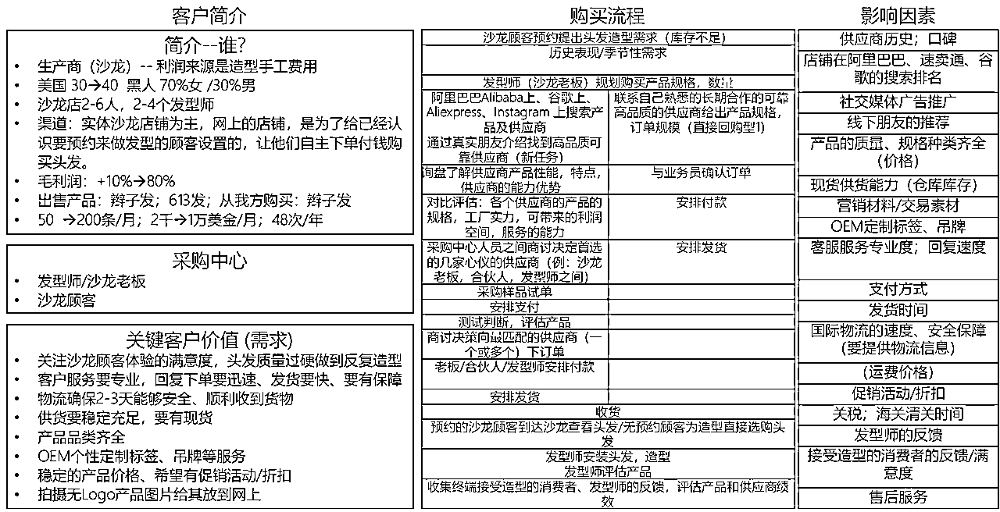

# 假发行业科普B2B

> 来源：[https://hs88nuws9z.feishu.cn/docx/HVmgdGrqzoLU4tx40F0cHhZEngh](https://hs88nuws9z.feishu.cn/docx/HVmgdGrqzoLU4tx40F0cHhZEngh)

大家好，我是Feynman。

这是我上一篇关于亚马逊的文章：https://wx.zsxq.com/dweb2/index/topic_detail/812452254128522

今年在跨境行业第6个年头了，假发行业干了3年，在这个期间从后端供应链到前端流量获取都操作了一番，对假发行业相对有一些了解。

假发行业在跨境这个圈子已经火了有10来年了，目前处于一个存量市场期，每年有很多老玩家死去，也有很多新玩家进入。

# 一、行业简介

## 市场简要数据

从市场上来看，这个市场属于是一个红海市场+存量市场的市场，——搜索趋势相对平稳，代表是有稳定的需求；

2022年有所下降，原因在于受疫情影响，终端消费者收缩了部分需求，属于正常的调整。

在美国，假发市场行业预估为150亿美元市场。复合增长率约为5%；在全球则约为450亿美元市场。

在2010年以前，韩国人垄断了90%的美国线下市场。

美国国家统计局数据：https://www.census.gov/content/dam/Census/library/visualizations/2020/demo/p60-270/figure2.pdf00

## 用户特点以及为什么假发是刚需？

1.  由于黑人群体常年生活在非洲区域，大部分靠近赤道，过度炎热的天气导致物种为了适应气候，头发成为了卷曲的毛发，因为卷曲的头发可防止阳光的强烈照射，又是良好的隔热体，保护头部；卷发中间形成空隙，导致空气可以流通、避免阳光直射，故非洲人多为卷发，这一卷发并没有随着黑人大量进入美国而消失，反而由于这一特殊的发质导致头发非常难以打理，故黑人的正常发质是卷曲、细软易断且蓬松的。

黑人原生头发

佩戴假发黑人

1.  由于历史原因，黑人在美国的政治地位较低，从美国南北战争以后，黑人平权运动一波接着一波，对于黑人来说，被主流群体认同且承认是一个迫切需要解决的事情，从社会认同上来看，黑人原生的卷曲的头发被认为是野蛮和落后的，地位偏于低下，头发与白种人一致的被认同为是有教养和符合现代社会的黑人（在奴隶时代，管理黑奴的黑人就有配戴假发），故从政治历史上来看，黑人群体想要争取自己的利益，首先改变的就是融入主流群体，从而让自己获得群体认同，而不被歧视和偏见。

“像对待美国一样对待我们所有人，种族市场从未真正受到制造商的尊重和支持。”

1.  从生活和工作角度，佩戴假发与未佩戴假发的黑人，在租房上，大部分房东更愿意租给佩戴假发的黑人（房租上二者的差距会>1000美金），在工作机会上，佩戴假发的黑人则会被认为更有能力，更尊重工作机会，所以会更容易找到好工作，而未佩戴的则容易沦落为底层工种（二者周薪差距在500美金以上）

1.  从个人风格上而言，大部分的Social Media的KOL都通过佩戴假发展示了自己的风格，对自己的发型、假发感到非常的自信，在黑人群体内，佩戴不同档次的假发是一种社会地位的象征。

1.  从个人的舒适生活舒适度来看，美国当地的气候相对较复杂，一天反复的刮风下雨是常有的事（这一点从他们不爱打雨伞也有所反馈，因为随身带伞应对阴晴不定的天气很麻烦），这对黑人本来就脆弱的原生头发造成了巨大的损坏，淋雨后他们需要去到Salon店里面打理自己的头发，时间成本需要花费2小时以上，财务方面打理一次在75美金-300美金不等。而佩戴假发则会对自己的原生头发有一定的保护作用。

1.  从社交层面，佩戴假发的黑人在颜值，性吸引力方面有巨大的加成，他们也更想要创造性的表达自己，在线上线下的社交圈中非常想要成为社交圈的中心，这是欧美语境下的人的特点（与中国的藏拙特性不太一样），故假发带给他们的加成非常不同（并且我拍摄黑人的过程里，真的感觉佩戴假发和不配戴假发的黑人简直就是天上地下的差别），这放眼各个族群的女性们都是同一个道理，爱美之心人皆有之。

1.  从生理学角度来看，黑人女性的脱发症患病率要明显高于白人女性。2013～2014年间，一项对美国191748名患者脱发症患病率的调查数据显示，黑人女性脱发症的发病率是白人女性的四倍多。

1.  从历史发展角度来分析，随着非洲奴隶贸易的兴起，黑人女性的发型开始受到欧美文化的影响。黑人女性的传统发型有两类，一类称为kinky hair，就是我们传统印象中的蓬蓬头；另一类称为braids，则是我们传统印象中的小辫子。蓬蓬头和小辫子源自非洲部落，有着非常深远的传统文明，而且都与黑人的发质特点相吻合。但在欧美女性看来，这种发型则给人脏乱的感觉。由于欧美女性的流行发型是以直发和卷发为主，作为强势文化的地位自然而然地影响了黑人女性的发型习惯。例如，南方庄园的奴隶主倾向于让肤色更浅，发型更接近于直发和卷发的女性奴隶从事室内劳动，而让肤色更黑，发型脏乱的女性女隶从事田地劳动。同时为了刻意降低黑人的身份地位，奴隶主更习惯用“wool”而不是“hair”来形容奴隶的毛发。这种安排很自然地在黑人奴隶中产生了了一种对欧美发型的趋向性，而这种趋向性一直延续到了现在的美国黑人社区之中。普遍的观念认为，黑人天生的黑色蓬乱头发不宜出现在正式的社交场合。

1.  以上原因使得黑人女性的发型倾向于向欧美女性的流行发型变化，而假发又以一种方便快捷的方式满足了这种需求。假发不但省去了染发烫发的复杂过程，通过接发，使得女性在日常生活中的发型打理更便捷。而在样式与款式上，黑人女性更倾向于选择欧美女性流行的直发与卷发。这就是假发在黑人女性中非常受欢迎的重要原因。

1.  所以说，黑人女性更喜欢戴假发，是相对较高的脱发症发病率，以及社会文明趋势和欧美强势文化共同影响作用的结果。

## 假发行业历史

假发行业历史--以黑人市场为主：

1、假发行业最早可以追溯到14世纪，欧洲佩戴假发的高峰是在16 世纪的巴洛克时代，因为假发能很好的显示皇帝威严，路易十四将假发当成了最爱，路易十四从不以自己的头发出现在公众面前，假发成为了权力的衍生物。（这里太过遥远，就没什么好研究的了）

2、从假发行业商业化发展的脉络来梳理，假发行业兴起于在一战以后（20s-30s），美国经历长达六年的“柯立芝繁荣”时期（1923-1929年），以美国为代表的消费市场开始崛起，黑人第一次南北大迁徙开始，南北战争导致黑人权力开始逐渐被正视，其中最有代表性的则是在黑人群体中开始模仿白种人西班牙裔的穿搭方式以融入主流社会——最具特点的则是开始佩戴假发，假发市场也由此有了需求，这一需求被犹太人首先发现并开始。

3、40s-60s，从二战开始，美国流行文化开始崛起，随着穆罕默德·阿里(muhammad ali)和伊萨克·休斯(issac hughes)等人物的出现，发型开始发生变化。看到这些人在外面展示他们个性十足的风格，让更多的人加入了进来。这种转变被认为是向黑人民族主义和黑人权力的转移。black is Beautiful运动让头发成为了社区抗议的主要方式。战争期间犹太商人于大屠杀从业人数锐减，导致产业经营被转移至后来者韩国人手上。供应链由原来的欧洲逐渐转移至亚洲。

4、70s-00s，文化产业开始蓬勃发展，黑人拥有的企业也在打造像Eessence这样的媒体，纳奥米·坎贝尔、伊曼、泰拉·班克斯·珍妮特·杰克逊和戴安娜·罗斯这样的女性成为了新潮文化的代表人，黑人群体开始效仿流行文化中的发型。这个时期，韩国人在美国大量开设假发线下店面，与黑人Salon形成对照式发展，假发店面与黑人Salon同一时期逐渐演变成黑人群体的信息获取、社交交流的地方，韩国人在这一时期由于成本的考虑，将供应链迁移至中国青岛、安徽太和与河南许昌三个区域，而后被中国老板学完运营方法和处理技术，中国开始大批量建厂供应非洲市场和美国中低端市场，这一时期，对于8090s的朋友来说应该有个具体的印象，就是各个农村收头发的人也逐渐多了起来，当时差不多一条一米的头发收购价格是50-100块钱。

5、00s-20s，由于互联网的发展，传统线下开始逐渐转为线上化带来了新的机遇，在采购端的便捷带来了大量的黑人本土的假发卖家蓬勃发展，其中，在电商领域走在前列的则是广东的假发卖家，一部分依托于Google、FB获取流量获得了高速发展，一部分依托了阿里国际站、Made In China等第三方平台取得了增长优势。

6、如今，假发领域，逐渐在形成工厂批发品牌>DTC品牌>本土线下线上店结合发展的趋势。

## 行业特点简述：

由于需求又是刚需，产品又属于是非标品，供应链的采购波动极高，所以很难有某一个品牌能够持续的保证质量的稳定性，品控难度极高。

这反应到前端顾客的选择上来看就是他们对于各假发品牌的忠诚度都相对较低，很难培养品牌忠诚度，但由于顾客的需求属于刚需性需求，产品损耗性周期短，从消费端来说是非标高客单重量轻复购频率高的一个产品。

从供应链上来看，原料价格波动大（类似期货）、无多年经验的采购难以判断质量标准-非标品，采购地点隐蔽分散，采购门槛高，地理位置偏僻，进入挑战大。

所以这个市场可以说是：刚需、非标、重量轻体积小、客单价高、易耗品。（这几个关键词下简直就是跨境神品中的神品）

# 二、市场简介

## 发掘利基市场

在进入具体的市场数据前，给大家讲讲我们是如何发现这个行业的，比起后面的分析思路和运营思路，我个人觉得发现利基市场的能力同样很重要；

Glenn stearns在《富豪谷底大翻身》其中有句话我到现在都一直很印象深刻："It's one of the principles of my whole life is find your buyer first, and the rest will fall in place."

### 需求挖掘

那么什么代表着需求？一般来说，用户在寻找什么，就代表他有什么需求，那如何找到用户的需求？回到第一性原理，当一个用户有个需求以后，他第一反应的是搜索。

这里我在之前的那篇亚马逊运营的帖子里面有提到过关于亚马逊的选品方法：https://wx.zsxq.com/dweb2/index/topic_detail/812452254128522

推荐两篇文章给大家看

https://articles.zsxq.com/id_7rwwww5q6gwv.html《如何获得产品idea》刘小排真是我非常崇拜的一位大神

同样，关于搜索需求相关的，这篇文章值得一读，三林《聊一聊Google关键词挖掘需求的方法》 通过关键词也能很精准的定位市场的情况；

### 抓住异常值

除开上面文章内的选品思路，关注亦仁曾经说过的：关注那些异常的指标，往往大的机会藏在异常的指标里。

一是当年我们住在小北淘金，那边有很多杂货店，老黑也很多，那段时间关注每个老黑都在问假发的货，有Wigs，Frontal lace wig、hair bundle等等，于是我们很敏锐的察觉到，假发应该是一个有需求的市场，只是市场有多大，顾客痛点在哪里，供应链怎么切入，我们怎么赢过别人，是通通不知道的迷雾。

二是我们那有一段时间，收头发的人明显多了起来，通过聊天套近乎，了解到收头发的出价在一年内从100逐渐涨到了300+，这说明在供应链端口仍然是供小于求的。

三是广州的黑人与日俱增，这也是一个很明显的异常值，于是我们混入黑人常出没的三元里去了解情况，不看不知道，一看吓一跳，在三元里通通商贸城里面（黑人老巢），黑人的Salon密密麻麻的格子间，除了黑人背着服装的、大部分黑人都等待着缝制头发，找头发购买。

在这几个属于明显异常的值下面，于是我们说干就干，最早的时候先找几个老黑聊了聊是不是有这个需求，然后我们说我们有一批货质量蛮好的，问他们有没有兴趣，后表示有兴趣，于是我们去进了一小批货尝试销售，没想到没隔多久便卖完了。

同时，我们加快对市场的调研，了解用户的诉求（看模块一）和测算市场的规模，得到可以当作长期生意进行的结论。"

## 市场与用户分析

### 用户定量分析

为什么要做定量分析？主要目的是帮助我们搞清楚，市场的体量和增速是怎样的，如果我们选择一条市场在增长的赛道，那不管做什么动作都是事半功倍的，反之，则很容易事倍功半。

在做生意上跟投放上有同样的逻辑：选市场+选产品+选Creative(广告素材+文案)+Targeting (人群定位)+Landing Page(着陆页) ，越靠前影响权重越重要。

如果先不说落地页(落地页后面说)，那其实选品这步是最重要的，其次是Creatives，再其次是Targeting。如果你的选品和Creatives都没问题，Targeting稍微弱一点些的话，其实还是能挣钱的。但是如果你的选品很一般，Creatives很一般，Targeting非常好的话，那其实大概率也是赚不了钱的。大家不要对Targeting有太多的执着，好好整选品和素材才是最重要的。

这段话来自咱们的龙珠圈友：阿发https://articles.zsxq.com/id_wdrg4o3owp1v.html

##### 在这里，分享几个测算市场的方法：

在判断是否应该进入新市场的时候，应该关注什么？

*   市场是不是足够有吸引力

*   市场规模如何，未来前景如何？增长天花板在哪里？（蛋糕是否足够大？）

*   利润率水平和回报水平如何？（蛋糕的质量如何？）

*   竞争程度如何？Concentrated or fragmented？已有的竞争者是否已经建立了强大的竞争门槛和护城河？（蛋糕是否足够分？行业进入门槛是否太高？）

*   剩下的内容大家自己去看图哈

有时候用户自己都不知道他的需求是什么，这是乔布斯说的。

但作为一般人来说，想要去洞察用户深度背后的需求，再开发对应的产品，说服并教育市场让用户能够为此买单，这样的投入是巨大的，试错成本也很高，这对于小玩家来说成功的参考性不大。

这里对于新玩家推荐阅读圈友轩辕的一篇帖子：《项目选择维度推荐》https://articles.zsxq.com/id_ld8sofgrz2ss.html

上一章节有提到市场分析的框架思路，一般来说，用一遍验算方式去验算市场很难得出接近真实的数据，所以要反复的通过不同的数据端口去获取数据来进行交叉验算。

1、通过宏观数据测算：市场规模=潜在需求人数*客单价*购买频次

2、通过各潜在行业的用户体量测算目标群体的市场规模；

市场规模=目标用户群体*目标用户群体数量*登记册率*消费频率*单次消费金额

美国国家劳工统计局：https://www.bls.gov/oes/current/oes_stru.htm#27-0000

3、看行业报告，找假发类上市公司的行业研报；

4、看咨询公司报告——例如尼尔森报告

5、拉平台数据

### 竞争维度分析

这里推荐我之前写的选品的文章，去根据价格带和价格带市场增速进行分析，找到最高增速的价格带、产品规格，从而找到进入后容易挣钱的市场：

按价格带份额增速MOM、Per inch份额增速MOM、产品类型份额增速MOM几个维度去拆解组合：

https://wx.zsxq.com/dweb2/index/topic_detail/812452254128522

这样我们便得出我们主要需要做的产品类型、产品尺寸和定价的价格带；

通过以上的分析（数据模糊处理过），最后可以得到一个结论：

1、市场容量大，且处于上升期；

2、客户需求尚未被完全满足；

3、行业搜索词大部分集中在品类词而非品牌词；

4、腰部玩家仍有增长空间，

5、几个有明显增速的产品方向仍有机会；

经过前面对竞争对手数据的拉取以后，我们基本可以得知，我们要在高价格带去玩，wigs是主要的趋势产品，hair bundle为利润款，短尺寸和长尺寸作为核心尺寸，中间尺寸带少量备货。

这样基本可以确定好一个大的方向，接下来就是搞清楚面向的用户是谁，他们有什么样的个性标签，为了拆标签，我们把facebook的兴趣分组全部拆解了一遍，在这里也分享给圈友。

### 用户定性分析

为什么要做定性分析？主要是帮助我们搞清楚用户是谁，有什么特征，他们的痛点关注点是什么，谁能影响他们的决策，这样能有效的针对他们的需求去设计产品；

针对用户定性分析的方法主要有两种，第一种是直接委托当地公司做用户访谈，核心样本数一般要去到100以上，数据能够回归合理区间。但这种耗时耗钱，我们当时委托这类公司总共花费30W美金，得出的结论和效果基本与我们通过行业专家访谈和行业报告分析的结论一致，所以这种方式方法不建议。

第二种是约行业专家访谈，以及找消费者分析报告，这样的费用一般比较低，访谈一次的成本在1000人民币（或者直接让HR约人聊天），报告一份也就几百块钱。

海外假发这个品类主要针对的人群按人种分有两种，主流人群是黑人女性，又分美国黑人和非洲黑人，这也是我从业主要负责的市场，在假发市场上属于主流用户，对他们来说假发属于刚需品，平均每位黑人女性家里平均有6顶左右的头套+6条发帘+2个发块，一般的假发损耗周期在1年左右。

另外一种是欧美白人，对于白人来说主要就是为了防脱和造型，属于高客单消耗品。（本文不涉及到欧美白人市场，我对欧美白人市场研究的不多，在此略过）

由于黑人群体对假发的依赖性导致假发具有刚需特性，则需要继续往下划分，按照不同需求的侧重点，我们做用户定性调研的阶段会分为几个模块进行：

结合以上的拆解维度+用户访谈，得到以下的一些用户画像，这样基本帮助我们更快的定位到用户：

结论：

1.白人市场饱和需求人群少，不是必需品，有固定大的供应商垄断，市场份额饱和

2.黑人需求量大，黑人必需品，市场份额大，黑人经济水平提高

## 竞争对手分析

好，经过前面我们搞清楚针对哪类人群和哪个市场后，我们下一步的选择就是要搞清楚我们选择的这个市场都有哪些玩家，我们在在和谁竞争，要如何竞争过竞争对手，以及顾客为什么选我们而不是选竞争对手。

具体的分析方法可以参考小航海里面的分析方法：海外工具+Chatgpt航海手册 亦仁团队的内部调研方法论 个人niche站的竞品分析和策略制定

选择竞争对手可以通过关键词去定位到竞争对手是谁，通过流量大小和结构得知竞争对手的情况：

【1】史上最强独立站入门教程-独立站的商业模式

1、由于依托于阿里国际站、中国制造网等平台的销售基本已经趋向于成熟且竞争激烈，而走独立站模式的相对较少，流量情况经过分析也并不激烈，CPM和CPA都远远低于平台，且在近一段时间内有假发站点的广告在放量投放，说明仍然有机会，我们定下来走独立站的模式，核心的动作就是通过Google关键词+Similarsite找到竞争对手的list清单，然后通过Similarweb去分析竞争对手的网站流量情况，用Adspy工具+Ahrefs分析对手的详细数据。

经过对对手的流量渠道、主要产品卖点和价格机制、价格带等等各个维度的分析后，结合以上的内容，我们基本可以确定，发型师和Salon Owner这个群体是一个巨大的潜在池子，并且还未被深度开发。

于是我们定下来的核心策略是联合沙龙群体去销售产品，即用户在网站上购买了假发后，可以到附近的沙龙店免费安装自己的头发。

以上，确定方向后，由于假发行业的供应链的水太深，我们需要对供应链搞清楚，其中有效的2个方法：

1、去工厂上班，实际生产，跟工厂的师傅了解具体的流程是怎样；

2、约了十几家工厂访谈了解对照信息；

3、花钱请行业业务专家咨询——1000一个小时；

# 三、供应链研究

### 产品研究

#### 用户到底关注什么？

任何行业都会有质量好坏高低，明确用户到底关注什么。

##### 1、第一个方法是招聘这个行业的业务员去了解，这样可以初步了解这个行业的客户都有哪些类型，经过访谈，了解到可以分为这些类型：

*   杂货店

*   家庭式实体零售商

*   利益至上的大型实体零售商

*   纯辫子发品牌实体零售商

*   纯泡发网上零售商

*   个人分销商

*   生存边缘挣扎的低端小沙龙/个体发型师

*   典型中小型沙龙店

*   高大上品牌沙龙店

*   品牌网店

##### 2、了解各个客户的采购水平和采购关注点：

##### 3、了解客户对于产品质量的关注，由于客户是沙龙群体，则他们最关注的是自己客户的体验，所以期望的是能够让他们完整展示自己手艺的产品。

1.  头发有垂度——可以理解为没有炸毛、头发不是轻飘飘的，头发会有垂感，视觉观感上来看更好；

1.  可染颜色和重复造型——冷烫和热烫都能支持，这意味着需要头发的毛鳞片是完整的，没有吃酸、倒头和压色，是能够正常的造型和染色。

1.  染色要根据头发底色的色度和目标颜色来调配染发材料的配方，头发的底色、发支粗细、温度、染发材料的质量会影响染色时间、色彩光亮均匀、颜色持久性，染色时温度越高反应越快，但容易让头发受损；温度越低，反应慢，时间长，但可以降低受损程度，发质粗，上色慢，发支细，上色快。

1.  头发弹性和着色时间保持一致——这意味着头发的粗细、方向和色度都要是一样的。

1.  头发不打结，不掉发——打结的原理：毛鳞片遭到损伤，表皮鳞片发生变化，细胞互勾连起来，发生纠缠，掉发是头发没有正常缝纫

1.  头发幅度饱满，看起来多；

1.  碎发少，长短自然；

#### 了解产品的原理

##### 头发生长周期

头发是体表毛发的一种，也是遵循自然规律，所有头发都有固定的生长周期，会脱落、也会再长出。一个周期里包含了三个不同的阶段，分别为头发的生长期、退化期与休止期。在同一个时间点里，我们的每一根头发都分别处于不同的阶段。也就是说，有些头发正处于生长期、有些则处于退化期与休止期。

1、生长期：

（平均约为2～6年） （头发的生长期最长的可达 25 年，所以才能看到吉尼斯世界记录中的头发长达 2 米的美女。）

占所有头发的9成左右，我们绝大部分的头发都处于持续生长中的状态。处于此时期的头发很难脱落，若要硬拔的话，头皮会感到疼痛。

2、退化期

（平均约为2～3周）

占所有头发的不到1%。生长速度减缓，发根会朝着皮肤表面前进，不过头发依然不易脱落。

3、休止期

（平均约为2～3个月）约占所有头发的1成以内，此时头发已经完全停止生长，发根位置很浅，头发很容易脱落。我们梳头发时轻易掉落的头发，都是处于休止期的头发。当头发脱落后，毛囊内又会有新的头发重新缓缓长出，如此循环不息。一般人头上约有十万根头发，大约有一万根头发是处于休止期的易脱落阶段，推估下来成人一天掉落约100根头发以内算是很正常的现象。

头发的生长速度因人而异，不同季节的生长速度也是不同的。一般来说，不患有各种脱发疾病的健康成年人头发每天生长 0.3~0.4 毫米，一个月大约生长 1 厘米左右。夏季头发的生长速度会比冬季快一些。

比如：

3年多 16"

6年多 30"

判断发质的好坏，一般有两种标准：一是指头发的粗细、软硬及弹性好坏；二是指头发的油性程度。

头发的弹性是指头发可伸展和收缩的能力。所有的头发都有一定的弹性，只是弹性的好坏有不同，这是头发可以任意弯曲的基础。头发的弹性好，烫发后的波纹可以保持更久，头发不易松散；头发弹性不好，则表现为松弛，或海绵质，且容易缠结。一般正常的头发可伸展为其原长度的20%，且松开后仍可弹回。湿头发的伸展度则为其长度的40-50%。

头发的油性程度是由皮脂腺分泌油脂的多少决定的，根据头发的油性程度，可以将头发分为中性发质、油性发质和干性发质。

中性发质。头发有直有弯，状态良好。头发的湿度平衡，具有健康的外观。发质柔顺、健康，充满光泽。不油腻亦不干燥，软硬适度。适合于各种发型，是最理想的发质。

油性发质。头发下垂，蓬松度差，非常不易梳理，也不易做发型，常带有静电。

干性发质。卷曲而质硬，缺乏水分。外观干枯，容易打结，梳理或清洗时不能顺畅，发端常有磨损现象。造成这种发质的原因可能是头发纤维中没有存储足够的水分，或是皮脂腺分泌的油脂太少。

发质不佳的因素有很多，如精神因素、健康因素、神经调节障碍或营养代谢等。注意饮食健康，多吃美发食物，便是秀发如诗的秘密。

##### 头发结构，作用，影响

##### 头发的组成：

头发由发根和发干组成，露出头皮的部分是发干，在头皮下面的部分是发根，它被包裹在毛囊内。

我们一般俗称的“头发”就是发干；发根位于头皮下，毛囊内的毛，只占全毛重量的10%~15%，其根部与毛囊下部称为毛球的结构相连接.

发干从外到内可分为三层：

① 最外层的是表皮层（又叫角质层，毛鳞片）是毛干的保护层，主要是抵御外界的物理、化学因素对头发的毛发的轻微损伤。它由6~10层长行鳞片状角质细胞重叠排列而成，游离缘指向发梢，不同的发质其形状、结实程度与拉力也各不相同。这种鳞状物质越接近头皮的部分越光滑，相反，越远离头皮的部分越粗糙，越不规则，且受到外界不同程度的各种刺激后，边缘可轻度翘起或破裂。

② 中间一层是头发的最主要的部分，称为皮质层，是由成束角蛋白链沿着毛干的长轴分布。它决定了头发的弹性、强度和韧性。该层约占整个发茎的一半不到。在该层中还含有许多黑素颗粒。

③ 最内一层是头发的中心部分，称为髓质层，称皮质层的细胞所围绕，其间充满空气间隙，有一定的阻止外界过热的作用。类似于一根狭长的管道，它深入到真皮之中，有时可深至皮下组织。

##### 表皮层可能产生的问题：

当头发外层表皮层（又叫角质层，毛鳞片）遭到化学、物理性损伤时，会使受损伤头发的外层细胞变得奇形怪状，它们不再像平常那样在头发纵轴上平铺着，而是呈现竖立起来的外观，这些受损伤的细胞易于彼此间交互勾连起来，就像两只手上的手指可以互相勾连一样，使头发相互纠缠在一起。

物理性损伤：

梳理（打理）方式错误造成的损伤;剪刀、削刀的不正确使用造成的损伤;电热美发器具造成的损伤;紫外线造成的损伤。

化学性损伤：

日常洗发、护发、定型产品的不正确使用造成的损伤;过度烫、染、漂发以及错误操作对头发造成的损伤;环境的污染对头发造成的损伤;

发质：细软发质的头发容易打结，断发

常见影响情况：

1，干燥（水分不足，头发太干燥容易打结）

干燥的原因：由于外界原因而受伤的头发毛鳞片很容易被破坏，从而降低严密的整齐排列状态，天然保湿因子流失，导致头发变得干燥晦涩容易打结。

改善方法：平时洗发后可以使用护发素，作用是闭合毛鳞片，使头发易于梳理，不过治标不治本，如果想真正改善发质，还需要一些加强护理，可以1周做1-2次倒膜。

2，清洗后打结

改善方法：洗头之前，先把头发给梳顺，按照洗头的方向给梳顺。然后再洗，洗后头发在湿的时候，不要用那种齿比较密的梳子来梳头发，用那种木头的，齿比较粗的梳子来梳理头发，这样头发不容易打结。

3，是不是经常处理（受损的头发容易打结）

3，发质（细软的发质容易打结）

原因：纤细的头发要比粗大头发更容易缠结。这是因为具有纤细头发的人，头发总数要多得多，而且头发细胞较小，数量也多。

4，洗发水不合适

合适的洗发水：PH值介于5-7之间，贴近头皮的PH值，呈弱酸性，能相应减少头发、头皮刺激的同时，让头发毛鳞片在酸性环境下闭合，头发更加柔顺。

5，粗暴的洗头

6，用力的用毛巾擦干湿发

7，吹风机风力过猛

8，头发长容易打结

##### 皮质层：

皮质层：相当于毛发的中间部位，它含有，皮质纤维、凝胶、间充物质、空隙等，是头发的主要组成部分。由它决定毛发的形状、粗细和弹性，也是烫发、染发等化学作用发生的部位。

染色分为：暂时性染色，半永久染色，Demi半永久和永久性

原理：人的原生发中，含有近似于黑的色素粒子，外面有透明的毛麟片，所呈现的是有光泽的棕黑色。这种色素是天然色素，不易分解和流失。染色要具备两种物质：人工色素和显色剂，也就是染膏和双氧乳。在化学物的作用下，毛麟片打开，人工色素把天然色素替换出去，就呈现要求的颜色了。

1.temporary color暂时性染色：

这是一个最大的分子通过覆盖在表皮上，是物理变化不是化学变化，暂时性的头发染膏分子只是在角质层的外面，它们都很大即使渗透里面，一旦你清洗了这些颜色，这些染色都会清洗掉。常见的有四种：彩色的发胶，彩色幕斯，头发染毛膏，染膏洗发水

2.semi-permanent半永久染色：

半永久性颜色与暂时性染色略有不同，因为它们持续约四至六周，因此它们持续较长时间，并且它们中的分子稍微小一点，以致它们不仅涂覆角质层，而且它们实际上穿透了一点点的角质层，渗透到角质层中通常角质层可以保持这种颜色约四到六周，直到它被洗掉，所以看看图片，你会看到这张图片与暂时性染色图片的不同之处在于那些分子是更小，他们是要深入到角质层，这仍然是一个物理变化，没有任何变化发生，分子只是稍微小一点，并且进一步沉积到角质层中，而不是像暂时性头发颜色那样涂覆顶层，半永久性头发颜色对于那些“我从来没有染过头发，他们想尝试它，他们只是对颜色感到好奇，她们不管是否觉得半永久颜色是完美的，因为在4-6周内，如果他们不喜欢它，任何一个人都会清洗掉，但如果只想稍微改变一下他们的头发颜色，但他们只是想为它增加一点红色调，对于那些想要中和头发上不想要的色调的人来说，这很好，通常你会看到有金色头发的人，有点偏黄的颜色，或者他们有那种金黄色的半永久性颜色对于那种类型的客户来说效果很好。

3.Demi-permanent Demi永久染色：

半永久性头发的颜色与这种半永久性颜色不同，因为这些颜色会将颜色沉积到皮层中进入皮层，看看这张图片，为什么不同于以前的暂时性和半永久性的分子，颜色分子不仅渗透到角质层中，而且还进入皮层，并且他们正在存放在中间层的头发中，变成半永久，所以他们不会提高你的天然头发的颜色，他们只会沉积分子，但他们会进入他们放置这些分子的皮层，所以这里发生了物理变化，只是过氧化物很好，它们通常与低含量的过氧化物一起使用，但它不一定是过氧化物，这些过氧化物与它们混合可能是不同的碱化剂，但它们会进入，它们不会减轻已经存在于皮质中的颜色，但它们确实进入皮质并在那里沉积毛发颜色，所以这些分子在角质层上的区别就在于角质层，而临时性的颜色只涂在角质层上，半永久性角质层渗透到角质层中，现在这些是沉积在皮质半永久性头发的颜色是很好的填补多孔的头发。在你着色之前，如果有人进来，他们的头发是多孔的，它会吸收这种颜色，你会得到一个非常不均匀的颜色。所以那么如果你的发型师经常是这种情况，我们会说在头发上填充填充物，这就是半永久性头发颜色会做的事情，它会继续下去，并首先存放一些颜色，这样当你把下一个颜色放在它上面时不会吸收太多，因为在那里已经有了半永久保留在那，对于那些想要掩盖其灰色的客户来说，上灰色最好的选择就是永久性，但是半永久性产品也很好地融合了它，但半永久性产品的确很好地融合了它，当你的颜色变深时，你也可以使用半永久性颜色，所以如果客户进来了，他们有了一个再生长的头发，你需要染永久的颜色在再生的头发上，但你不需要染末端头发的永久的颜色，所以你只需要将你的半永久性头发颜色与你在永久性根部使用的完全相同的方法。你只需要放置半永久性的东西，这样它就可以沉积颜色，梳理已经存在的东西，并且当你对根部的永久物进行润饰时会对头发造成最小的伤害，以及半永久性物质已经预先着色头发的末端。

4.Permanent 永久性

永久有两个步骤的行动，它会去除你已经拥有的头发的颜色，所以它会抬起你现有的颜色，再加上它会沉积颜色，这不同于暂时性染色和半永久，永久性头发的颜色与半永久性颜色相比，永久性头发能够提升自己的自然头发颜色和很好地存进去，所以它的这两个步骤与过氧化物混合通常会增加40个音量级别，并且在图片中您可以看到分子是如何变小的，因此它们会穿过角质层进入皮层，在那里有一个化学作用正在进行，那么你可以从这幅图中看到分子一旦进入皮层就变得很大，所以你已经有了穿透皮层的小分子，这种颜色可以提升自然的颜色和沉积，但是那些较小的分子会与过氧化氢结合，然后与您的颜色混合在一起形成较大的保护，现在它们已经是那些大分子，它们将被困在皮层中，他们会被锁在那里，使它成为永久的头发颜色，所以永久的头发颜色被用于覆盖灰色并永久改变头发的自然颜色。如果想再染色长出来的头发，你的客户将不得不每四到六个星期来维护这种颜色，否则他们的根部会显露出来，所以他们会对永久性颜色进行一些保养，并且对于那些喜欢用永久颜色在家中染发你的头发的人来说，永久性颜色要小心谨慎。他们不会有效地提起超过三个自然色的级别，所以如果有人有黑色头发，他们希望在黑色头发的这一级下降到一个金发的级别，永久性的不能直接染到那个级别，他们必须用脱色剂或漂白剂进行矫正性着色，然后进入永久性颜色，所以要非常谨慎。

烫发分为冷烫，热烫：

原理：烫发一般是先用还原性的化学药水来拆散胱氨酸的小弹簧，使胱氨酸的疏??硫桥键断开，成为两个半胱氨酸。这时，头发的氨基酸链节便松动开来，随人摆布，盘卷成一定的波形。然后再搽抹固定剂，使断开小弹簧的半胱氨酸在就近两两结合，形成新的弹簧，将发型固定下来。

1，冷烫的头发在湿润状态下能够更好的呈现卷曲效果。干了之后，只有湿发30%的卷度。而热烫是改变了头发内部结构，让头发较持久的定型，热烫干了之后能够达到70%的卷度。因此热烫的卷曲度能在干发和湿发时都能有较好保持。

2，冷烫和热烫一个很大的区别在于操作程序上，热烫要通过加热的卷杠对头发进行卷曲塑造。而不同的物理外形会给头发带来不同形态。直发的横切面呈圆形，波发是稍扁的椭圆形，卷发则呈狭长的扁平状。也就是说冷烫和热烫的区别在于，热烫不仅能通过改变头发内部二硫串的排列，而且比冷烫更好地改变头发的物理外形。

3，总的来说，热烫能做到双管齐下，改变头发内部，和头发横切面形状。烫出来的头发能更好的保持卷曲。

4，冷烫和热烫所用的药水（软化剂和定型剂）主要成份基本一样，这两种烫法的原理基本也一样。都是通过软化剂对头发内的二硫串进行“切割”，即所谓的软化，再利用定型剂对切割的二硫串进行重组。,

##### 髓质层：

髓质层：由真空状的海绵体排列形成的（细软的头发里面不存在）

最内一层是头发的中心部分，称为髓质层，称皮质层的细胞所围绕，其间充满空气间隙，有一定的阻止外界过热的作用。类似于一根狭长的管道，它深入到真皮之中，有时可深至皮下组织。

发根包埋在毛囊内，毛囊结构十分复杂，为了研究的方便，将它的不同部分给予不同的命名。

引起毛发收缩的立毛肌附着于毛囊，其附着点下部称为毛囊下部，其上刚称毛囊上部。毛囊下部膨出的部门叫毛球，是头发的发端。毛球的最底部有一凹陷称为毛乳头，它是一团伸入毛球内的结缔组织，含有血管和神经。毛乳头与结缔组织鞘为头发的生长提供营养物质和氧气。如果毛乳头被破坏或退化，头发就停止生长，并逐渐脱落。在毛囊上部，还有一个皮脂腺的开口，这一开口处又将毛囊上部分为上下漏斗部和峡部。

皮脂腺分泌的油脂由毛孔排出，滋润着头发，并且可以根据其分泌的多少来决定头发的属性，如中性、油性和干性。

（头发脱落或者剪下来之后就没有什么作用了。）

染色头发护理方法：

染发是许多人都尝试过的一种美发方式，染过的头发没有光泽或色彩难以保持很令人烦恼。所以我们要了解染发后的正确护理。

染发时，染膏中的碱性成分把头发表层的毛鳞片打开(头发上的鳞片遇碱张开)，人工色素进入到头发的皮质层，与天然色素中的一部分相结合，形成想要的颜色。

染发时染膏对头发表层的毛鳞片有很强的破坏作用，如果养护不当的话会造成头发的鳞片脱落、水分流失，粗糙起毛刺，缺少光泽没弹性。

护理时避免头发干洗，日常最好使用含碱最底、性质柔和的洗发水。针对染发的洗发水与护发素能稳定色素粒子，使之不易很快流失。此外，吹风机的热也会加快色素脱落，所以，一定要在吹风之前涂一些含护发成分的饰发品，以维护发心中的色素使其稳定。

染色头发护理方法：

染发是许多人都尝试过的一种美发方式，染过的头发没有光泽或色彩难以保持很令人烦恼。所以我们要了解染发后的正确护理。

染发时，染膏中的碱性成分把头发表层的毛鳞片打开(头发上的鳞片遇碱张开)，人工色素进入到头发的皮质层，与天然色素中的一部分相结合，形成想要的颜色。

染发时染膏对头发表层的毛鳞片有很强的破坏作用，如果养护不当的话会造成头发的鳞片脱落、水分流失，粗糙起毛刺，缺少光泽没弹性。

护理时避免头发干洗，日常最好使用含碱最底、性质柔和的洗发水。针对染发的洗发水与护发素能稳定色素粒子，使之不易很快流失。此外，吹风机的热也会加快色素脱落，所以，一定要在吹风之前涂一些含护发成分的饰发品，以维护发心中的色素使其稳定。

##### 染色头发护理方法

染发是许多人都尝试过的一种美发方式，染过的头发没有光泽或色彩难以保持很令人烦恼。所以我们要了解染发后的正确护理。

染发时，染膏中的碱性成分把头发表层的毛鳞片打开(头发上的鳞片遇碱张开)，人工色素进入到头发的皮质层，与天然色素中的一部分相结合，形成想要的颜色。

染发时染膏对头发表层的毛鳞片有很强的破坏作用，如果养护不当的话会造成头发的鳞片脱落、水分流失，粗糙起毛刺，缺少光泽没弹性。

护理时避免头发干洗，日常最好使用含碱最低、性质柔和的洗发水。针对染发的洗发水与护发素能稳定色素粒子，使之不易很快流失。此外，吹风机的热也会加快色素脱落，所以，一定要在吹风之前涂一些含护发成分的饰发品，以维护发心中的色素使其稳定。

##### 不同年龄段的人会遇上哪些不同的头发烦恼。

10~20岁最易遇到的头发问题---异味

这个年龄段是一生中精力旺盛的时候，也是头发状况最良好的时刻，但不能忽视头发出现异味的现象。缺乏脂肪头发就会干枯无华、缺锌时头发就会卷曲色黄。还有，喜欢出汗的人也头发异味问题。这时，最好每天使用中性或油性洗发水和护发素来洗头。

20~30岁最易遇到的头发问题---烫染引起的毛发损伤

这个年龄段的女性最是爱美，且烫头发、染头发成为了一种解压方式。但频繁的烫染发会很容易损伤头发。所以，烫头发之后洗发最好都用护发素或者发膜来保护头发。

30~40岁最易遇到的头发问题---精神压力所导致的头皮干燥

精神性脱发是压力太大导致的，30~40岁上有老下有小正是自己精神压力最大的时候，家庭、子女、事业等问题一股脑涌上来。这种精神压力会体现到身体的各个部位，尤其是头发表现最明显。

40~50岁最易遇到的头发问题---内分泌失调引起的脱发

40~50岁，内分泌腺体性能异常而造成体内激素失调导致的脱发出现较多，针对这种情况可以考虑植发，植发是治疗脱发的较好方法，而且对内分泌失调所引起的脱发会有很好的改善作用。

#### 研究市面上产品的种类；

基于客户的关注点，去研究供应链端口上，产品与产品之间的差别到底是什么；

### 供应链

假发这个行业由于产品非标的特性，导致在采购端口产品的质量会天差地别，但由于从肉眼上来看难以感知产品质量差异，所以采购端口需要由有多年经验的专家进行采购。

从村里拿剪子收头发>集散中心卖原料>工厂生产，每一个环节由于假发的货值波动大，会有各类供应商在其中掺不同的产品，例如动物毛，马尾巴，纤维发，还有压色、过酸的垃圾发等等。

#### 从原材料端口，

##### 头发来源

垃圾发：掉地碎发，缺乏营养

削发：理发店。品质比掉地发好，但发质混乱

辫子发：原生发，来自一个人。（地理位置、生活习惯、营养状态）

寺庙发：多见于印度佛教剃度，以及中国佛教剃度的

##### 国外：

1、印度：供应假发最多的国家。人口多。有曲度受欧美喜爱，容易漂色。

2、东南亚：由于炎热的天气缅甸人喜欢头油，印度、老挝等果集散地

3、欧洲：头发发质最好，但是特别少，所以欧洲发最贵

4、朝鲜发，营养不好。发空，不易漂色，发红。

##### 国内：

1.  东北的头发黑粗硬，发质好。但当地文化上染烫的人居多，所以大部分的头发颜色都比较杂，且发质都受过损，需要二次处理；

1.  安徽、山东、河南的头发由于气候干燥问题，导致头发整体会发粗，发干，不够亮；

1.  江苏、福建。福建优于江苏。越往南越细。到海南变粗，海南最好

1.  云贵川的头发最好，第一是气候好，第二是当地喜欢用淘米水洗头发，不烫染头发，整体头发的原生保持的最好；

1.  新疆、内蒙。头发发黄、细且天然波浪，是欧美金发白人喜欢的原材料。

### 生产工艺：

#### 原材料处理

买回工厂的原料的质量是参差不齐的，工厂首先会按照原生发（辫子发）、染烫过受过损的发、老人发银发等方面做第一次的预先区分，有些头发的毛鳞片由于染烫已经受损严重，则工厂需要将毛鳞片完整的头发和不完整的头发进行区分，再进行处理。

处理原材料的方法简要来说有几种，

1、针对辫子发原料，按照尺寸和粗细进行归类；

2、针对染烫受损的产品，有色差的头发，进行药水的处理，在工厂叫做压色，就是用药水将头发染黑，所以过于黑的头发也是不自然的头发。

3、针对毛鳞片受损严重的产品，用酸溶液泡掉表面多余的杂质，让所有毛发处于一个粗细均匀的质地，这种头发的手感会非常柔顺，但是使用寿命较短，且不能造型染色，成本低，是市面主流头发。

#### 成品生产

第一步是先将原料拍齐，确保头发方向一致，不会出现打结现象；

第二个步骤是称重，保证每一个产品的重量一致；

第三是用多重机织发帘，或者钩织头套；

完成以后是质检、用药水洗护，然后梳顺头发晾晒；

最后，若需要做波浪造型的，则成品出来后用药水定型晾干即可。

了解完产品的具体信息后，剩下的就是对比不同的供应商的报价和质量，以及我们的财务模型，这在我上一篇分享里面也有，就不过多的说了，核心要注意的点就是利润如果用全年的来看，是否能够覆盖广告费用，如果能，那生意的底层也就成了。

#### 产业带：

假发的产业带，主要集中在河南许昌、山东青岛、广州白云，在项目初期，我们是直接去了河南许昌和广州的美博城，找供应链的档口去了解产品的报价和质量，然后小批量的拿货进行测试，假发的产品质量有很强的波动性，拿货的时候要特别注意产品质量的辨别。

# 四、流量获取

### 分析竞争对手

主要的流量来源分析思路在航海手册里面都有：海外工具+Chatgpt航海手册

补充一些航海手册里面没有的：

1、第一步按照航海手册用Similarweb查看完竞争对手的流量构成

2、第二步可以针对竞争对手的流量情况去单个平台分析，谷歌就用SEMRUSH、Ahrefs分析竞争对手的广告关键词和自然关键词，Facebook用Adspy工具去分析竞争对手的素材和投放兴趣人群。具体分维度参考以下角度，数据拉完后会很清晰的知道主要增长快速的渠道在哪里。

3、一般来说像批发类的站点会用谷歌比较多，但谷歌见效相对较慢，假发类的内容用Facebook视频去展示反而更有效，且流量的效率会更快。

具体的投放过程，圈友们有很多投放大神，我就不过多讲思路了，核心的点是我们能把竞争对手的素材拆解到多细，按照场景、痛点、解决方案和CTA进行拆解划分，结合Facebook的人群兴趣+Landing Page进行更多精细化的测试。

重点关注的指标是询盘成本是不是低于成交成本。

Facebook投手的自我修养

阿发连载【7】（1万6千字 + 150张配图）全网最系统的跨境电商独立站Facebook广告新手入门教程

以上就是关于假发行业的B2B的一些科普，帮助对假发行业有兴趣的圈友了解这个行业的客户需求和供应链情况。

感谢大家，祝大家生财有术。