# 每天工作1小时，不出门只出单，我如何做到一条朋友圈赚 30 万？

> 来源：[https://c62cs54eo1.feishu.cn/docx/HfyjdmJDcokdxsxOuUwcxx8OnSf](https://c62cs54eo1.feishu.cn/docx/HfyjdmJDcokdxsxOuUwcxx8OnSf)

# 1.一个传说中躺赚的姑娘是什么样的？

大家好，我是左烨紫，加入生财已经3年。

这3年，不仅认识了不少好友，结识了不少的贵人，还顺便在这里赚了几十万。

由于平时偏实战，不太擅长总结输出，一直没有发过帖，但最近鱼丸找我约稿，所以鼓起勇气把自己的经验分享出来，希望能对大家搞钱有些帮助。

大学毕业后，我到现在已经做保险7年了。

这个行业有80%的从业人员坚持不到一年，我是怎么熬过一波一波的考验，甚至在行业人员从1000万缩减到300万的情况下，还能逆势增长的？而且，每天只工作一个小时，几乎不出门只出单，年成交保费就有近千万，毕业5年就在深圳南山买了房？

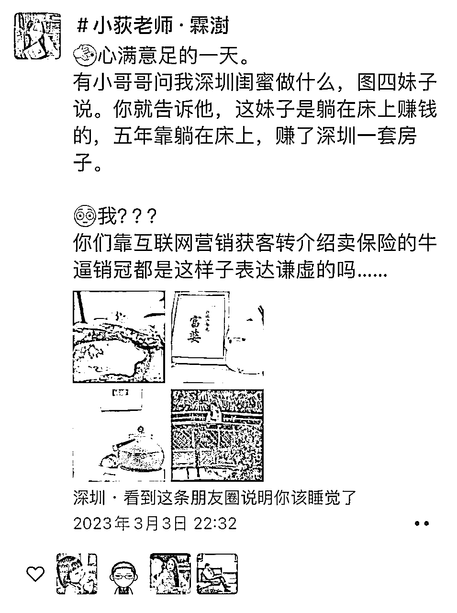

（ 因为不爱出门，被朋友们贴上了躺赚的标签，我也就不反抗了，就当多个记忆点吧）

答案是写朋友圈。

今年我的一条朋友圈更是给我带来了30万收入！不是营业额，不是税前，是真真正正到手30万！

所以我就给大家详细拆解一下我这条价值30万的朋友圈。

大家一定要用好朋友圈这个渠道去成交，毕竟微信是一切互联网的终点，流量越来越难得，注意力越来越稀缺的当下，辛辛苦苦引流到私域成交，输在临门一脚就太亏了。

那很多人会说，我也知道朋友圈很重要，可我文笔不好呀，没素材呀，那你就更应该看我的拆解了，看完以后，保证你一整个自信心拉满，开启朋友圈赚钱之路。

# 2\. 什么样的一条朋友圈，让我能利润30万+？

## 2.1.被动成交、变现率90%、利润30万+的圈长啥样？

我18年的时候就做到过一条朋友圈日入十万，22年的11月30号也曾靠一条朋友圈做到日入十几万，但我想分享的是今年六七月份这条让我变现30万的朋友圈。

不仅是因为它的变现金额最高，还因为今年保险的市场大环境非常恶劣，大家收入下降后，几乎首先砍掉的就是保险的预算，所以我觉得这条朋友圈对当下的大家参考意义更大。

那么，是怎样的一条朋友圈呢？

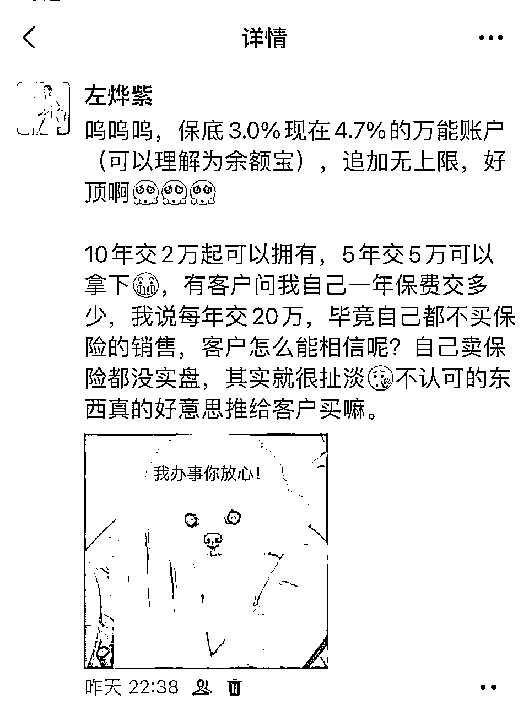

看到这，你可能会想，就这？

对，就这，30万。我发了圈以后，有二三十多个人找我询问保险，成交转化率为90%，因为保险涉及到的产品佣金比较复杂，有的客户只买了2万的保险，有的人直接来个五十万的单砸我。

只用最后的利润来算的话，每个客户给我带来的平均利润是1.5万，这条朋友圈就100多字，用30万来除的话，差不多一字3000元。

但这条简单的圈后，实际上是长达一个多月的运营。

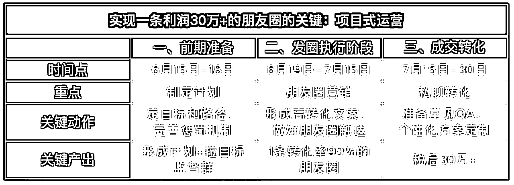

## 2.2 把发朋友圈当项目一样来运营

如果你不是什么流量明星，随便发一点什么，粉丝都会疯狂买单，那就要把写朋友圈当成一个项目来运营，有计划、有目标地推动，而不仅仅是写一段话然后发布这样的单一动作。

在一个多月的时间中，我有分不同的阶段、每个阶段有不同的重点、匹配相应的关键动作，并且有明确的产出，最终才达到了这样的效果。

为什么要这样呢？因为我看到过太多个体户，由于缺乏公司的约束，随着心情做事，做事虎头蛇尾，效果大打折扣，还容易给客户留下不稳定的负面印象。

稳定地出摊、稳定的节奏，很重要。

一次就能抓住风口的猪毕竟是少数，大多数的我们唯有厚积薄发，等风来。

# 3\. 我是怎样做到一条朋友圈净赚30万的？

## 3.1 制定一个靠谱的计划，匹配惩罚机制。

当时我们是有一款保险产品，送4.7%的万能账户，这个万能账户对很多保险客户来讲很有吸引力，我判断这是一款值得推荐的爆品，而且恰逢这款产品即将停售这个时间点，所以我决定抓住这个难得的时机，实现一个收入小目标。

跟不懂保险的同学解释一下，平时我们买东西的时候，大家都会看到“限时特价，仅剩3天”，或者“满100人，涨价100元”这样的信息，保险停售跟这个类似，是给了客户一个必须现在买的充足理由。

由于目前市场环境不好，保险产品的收益一般都是越来越低的。对客户来说，哪怕少1%的收益，100万一年下来也少赚1万，而且保险一买就是几十年，同样的本金投入，就少赚几十万甚至上百万。

所以这个时间点只要稍微推动一下客户，他们就会愿意立刻抓住这个最后的上车时间，那我就必须利用好这个时间窗口。

我没有着急疯狂地发朋友圈或者群发短信，而是参考过去我停售时期的经验（一个月赚过50万），我给自己制定了一个十分具体的目标：在停售前实现收入30万——同时有时间节点和量化的数字，才能算是目标，不然只能叫做梦。

我也很快确定了实现目标的方式：发朋友圈。

长期精准引流让我的朋友圈已经囤积了大量的潜在客户，只要激活他们，这个小目标很容易实现。特别是保险是一个一交就要几年、几十年的重决策产品，去公域引流再来成交的周期比较长，没办法达成当下的目标。

除此之外，为了跟自己的惰性做斗争，我拉了一个目标监督群，设定了一个惩罚机制：如果完不成，给群里的同学每人发1万现金红包，这样我就没有退路了。

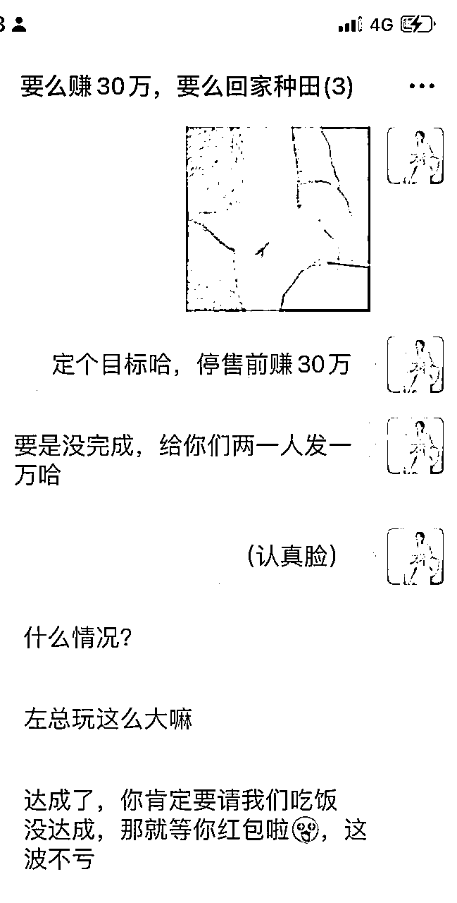

如果你想赚钱，不能只是有一个模糊的愿景，愿景虽然好，像灯塔一样，给我们指出了一个方向，但愿景是没有行动力的，只能在瞬间激励你，只有把模糊的愿景转变为明确、清晰、具体的目标，你才会开始走脑，去思考如何实现它，不会反复纠结和犹豫，这才具备了落地的可能性。

而且我们要对自己的勤劳程度有点数，一定要给自己设定惩罚机制。

这一步其实很简单，只是很多人都忘了做，以至于一直停留在“想”上面。

## 3.2 强有力的执行，才能保证高转化率。

### 3.2.1 测试不同的文案，观察转化效果。

你不可能随便发一条朋友圈都能获得高转化率，所以前期就需要保证一定量的输出，不断地去测试用户的“点”，直到形成一条高转化率的朋友圈文案，然后去放大它的效果。

围绕着这款产品，我有断断续续的写过一些文案介绍，但直到前面截图的那一条朋友圈发布，立刻有7、8个人前来咨询后，感受到这是一条高转化率的朋友圈，我才当即决定要把它怼到底、榨干它的价值。

### 3.2.2 像素级拆解这条价值30万的朋友圈文案

如你所见，这条朋友圈很硬，我先来给大家逐句拆解一下这条朋友圈的小心机。

围绕着这款产品，我先把这个最吸引人的权益放在了最前面，很多懂理财或保险的客户，一看4.7%的万能账户，还追加无上限，眼睛就亮了，在开头第一时间就抓住了客户的注意力，类似于短视频的黄金3秒的作用。

然后，考虑到很多人是不知道4.7%的万能账户意味着什么，我括号里还给出了一个类比：可以理解为余额宝。

敲黑板！这句话很重要！

越专业的人越容易陷入知识的诅咒，没办法共情小白，以为用户和自己一样懂，针对专业名称往往不做解释。导致用户无法代入，以为与己无关，快速滑走了。即使你的用户群体比较高知，我们还是要坚持把用户当成小白，以覆盖更多人群；

要让读者接受一个新的概念，最好用他最熟悉的故事/事物讲出来，而且尽量控制信息量，以降低客户的认知负担。

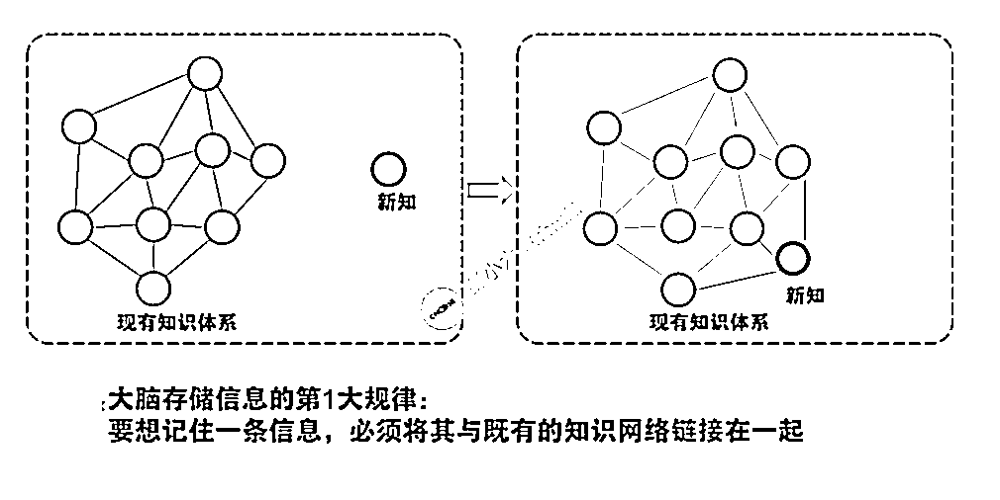

我其实可以用几百字去展示自己的专业，显示我在保险方面有多厉害，而不是简单用余额宝去类比。因为严格地说万能账户跟余额宝还是有一些不同的，在专家眼里这样描述并不严谨，但没有必要，过于专业只会劝退客户，吸引同行。

只要有一点点理财经验的人都不可能不知道余额宝，也知道余额宝的利率是1.7%左右，对比这个万能账户是4.7%，也就是说一年投入100万资金，余额宝产生的收益是1.7万，而投进这个万能账户是4.7万，多赚3万块，还不限额的话，要是投入200万、300万或者10年、20年呢？

这也是为什么大家一看到这个产品眼睛就亮了的原因，哪怕懂行的知道万能账户没有余额宝灵活性高。而不懂的人来询问我，我如实告知就好，不用都写在文案里。

用权益迅速地抓住大家的眼球后，才是讲出获得权益的门槛，每年2万块钱买个保险即可拥有保险公司赠送的这个万能账户。避免很多人以为这么好的权益是有钱人专属，自己不投个几百万，都不好意思来找我。

再用自己每年交20万的保费来佐证，现身说法，比什么都更有说服力。

最后上价值，强调了自己的价值观，做销售，如果只有一个核心，就是百分之百相信自己的产品，还匹配了一个跟我本人风格极其符合的表情包吸引眼球。

我一直都在传递一种相信，相信的力量。其实身边很多人都有用朋友圈营销的意识，经常也在输出，但客户就是无感，主要是因为没有搞清楚朋友圈写作的本质是文案，是带商业目的的，想成交就必须包含以下几个要素，不然文笔再好都没用：

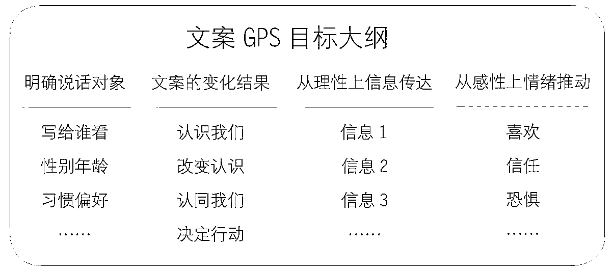

虽然我写的时候压根没想那么多，但因为我长期跟客户们泡在一起，已经形成了本能，知道该怎么说，就像我们说中文的时候，根本不需要学什么语法和结构，只有学外语的时候才需要。

如果你发圈困难的话，就可以参考上图，互相补充一下想法。

### 3.2.3 把一件对的事做100遍，而不是做100件事。

其实，这一条朋友圈并不是一次就带来了30万，当我第一次发这条圈就给我带来了七八个客户询问产品后，我意识到这条朋友圈值得推爆。于是，我把它截图重复发了11次，只是每次的文案稍微有一点点变化：

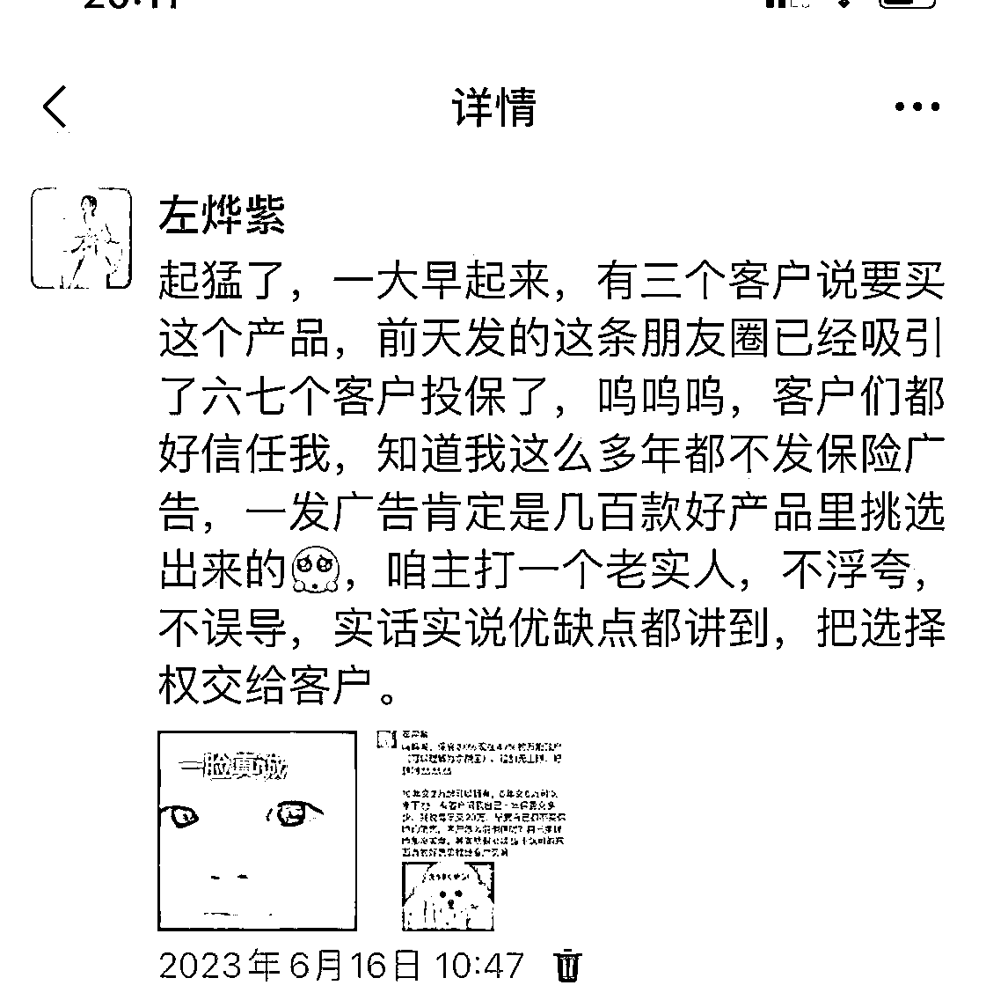

（发完第一条朋友圈后，我又把它截图再加了一段话发一遍）

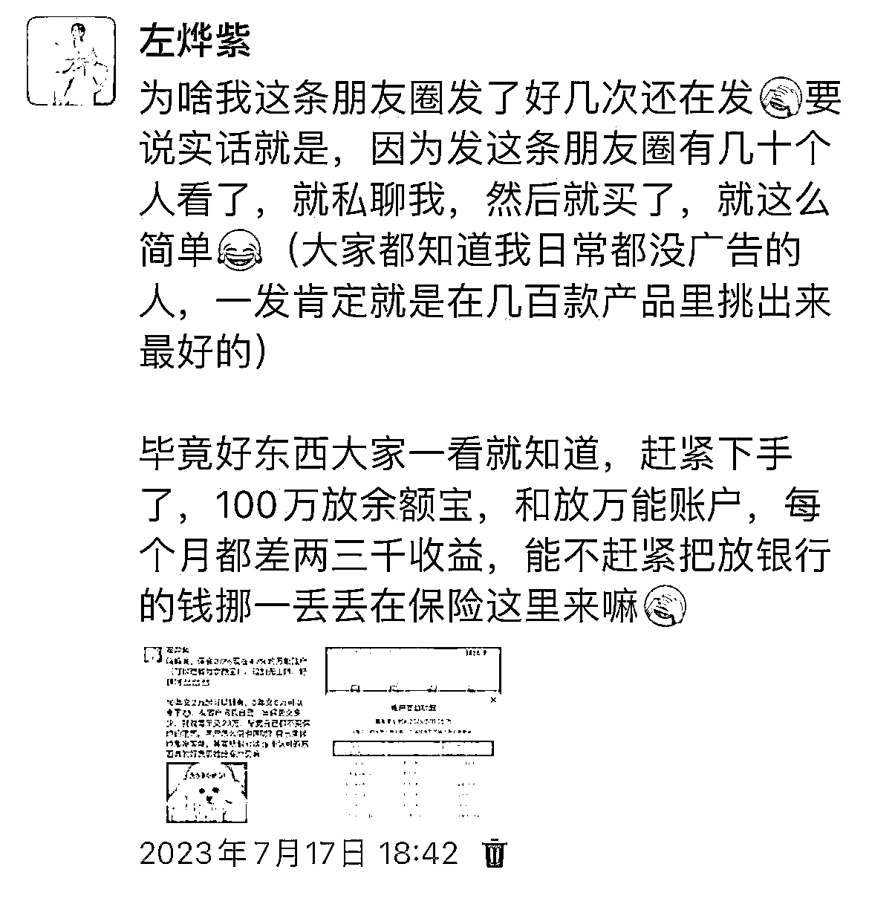

（既然有人疑惑我为什么重复发，那我就解释一遍，再发一次）

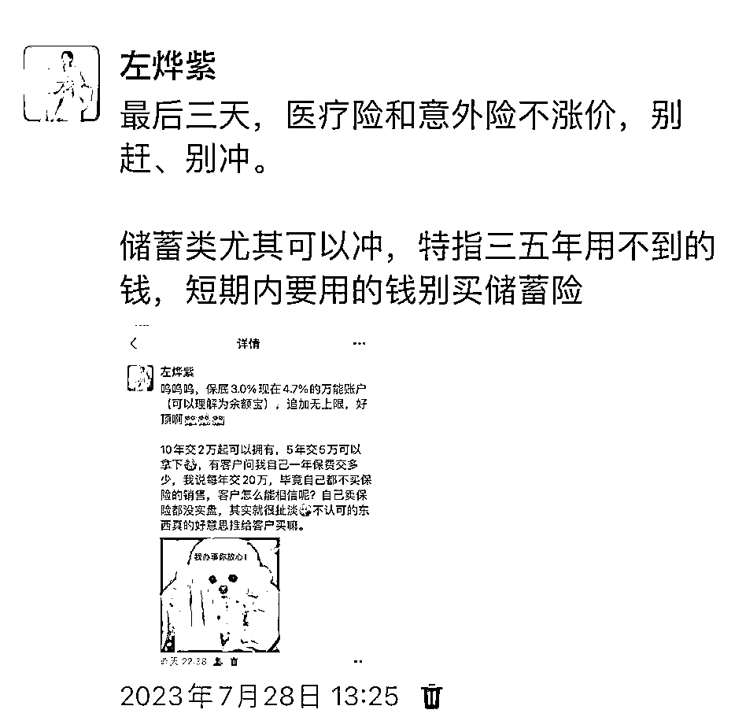

（发到产品停售前最后一刻，“药”不能停）

有用才是检验内容的唯一标准，既然这一条有用，为什么不反复怼到底呢？

我经常遇到很多人总是在费尽心思写新的素材，不断创新，却没有想过为什么一定要创新，自己要传递的信息已经传递到位，覆盖到足够多的人了吗？

以前做IP的秋叶大叔也跟我们说过，与其写10篇1万+，不如把一篇效果好的1万+刷成10万+。

想想也是。虽然累计起来都是10万+，势能完全不一样。

如果你学过一点品牌营销的知识，一定也知道“重复”的力量，那为什么在发朋友圈的时候不用起来呢？

### 3.2.4 90%的人忘记做的事：持续触达。

虽然我这条圈发了11次，保证触达了更多看朋友圈的潜在客户，可是如果平时没有那么多人看我朋友圈呢？

那我这条朋友圈发110次都没用。

因为朋友圈广告泛滥，现在刷朋友圈的人确实在变少，这是一个现实，可是他们都在微信呀！

所以，除了自建社群外，我还积极在其它社群冒泡，吸引潜在客户添加我的微信，或者让已经是好友的人想起来点进我的头像，去围观我最近的动态。

哪怕他们只是点进我头像进入朋友圈主页去看，至少首先能看到我的朋友圈置顶的个人品牌故事，会对我有一个感性上的认知，再有耐心刷上几条朋友圈，就一定能看到我这条硬广朋友圈。

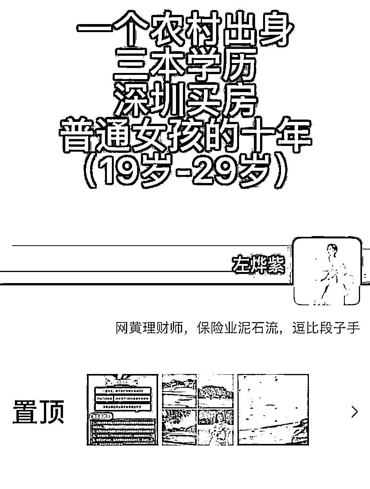

（但是用好了朋友圈背景和置顶，告诉大家我是谁，我干嘛的）

很多人在营业期间，会兢兢业业发朋友圈甚至不惜疯狂刷屏，结果导致被好友屏蔽、被微信折叠。

其实要增加曝光率不只有这种方式，在一些社群持续冒泡，吸引人主动点击你的朋友圈主页、去刷你的圈也是一个好办法。

## 3.3 高效聊天转化，让朋友圈变现30万落地。

在保险行业，普遍的销售转化率是10%，为什么我能做到90%的销售转化呢？

这跟我是被动成交分不开的。

社牛们可能不知道，很多人跟销售聊天是有压力的，所以我这种主动发圈“吸引”而不是主动“骚扰”的方式对大部分人极其友好，当他们看到朋友圈文案前来咨询的时候，一般都是已经有了强烈的购买意愿，成交的可能性很大。

如果临门一脚没有做好，前面的努力就白费了，根本不可能做到税后有30万的收入。

可能有的人会以为销售需要各种“舔”，我的很多同行都会很主动出击，但实际上，在销售过程中，谁先主动，谁会更容易陷入被动。

所以在这个过程中，我主要做以下两件事：

### 3.3.1 准备常见问答，提升效率。

我一般都是等客户上门，询问需求后，先把共性的问题通过视频或者文字等方式发给对方，让对方先学习，客户反而会惊讶：我不是来买保险的吗？为什么要先上课？

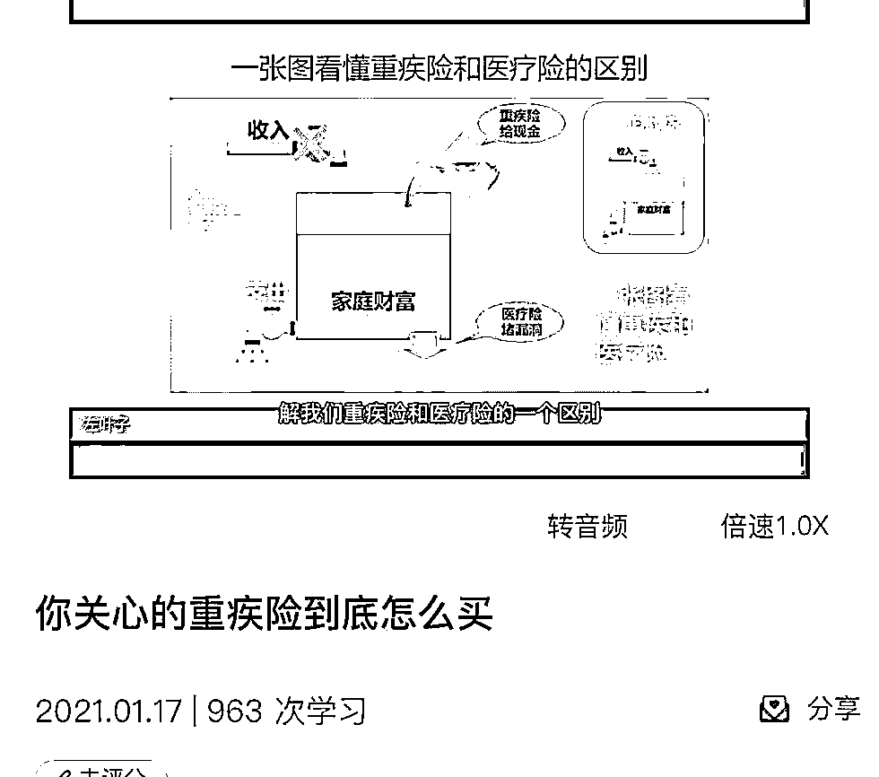

比如这个视频，完全没有其他的流量来源，都是我私聊发给咨询我的准客户学习的，目前已经有962人次的学习了。如果不做这个视频，我可能需要1对1的沟通一个小时，但发了这个视频后，不到半个小时就能成交，我和客户都很喜欢这种高效便捷的沟通方式。

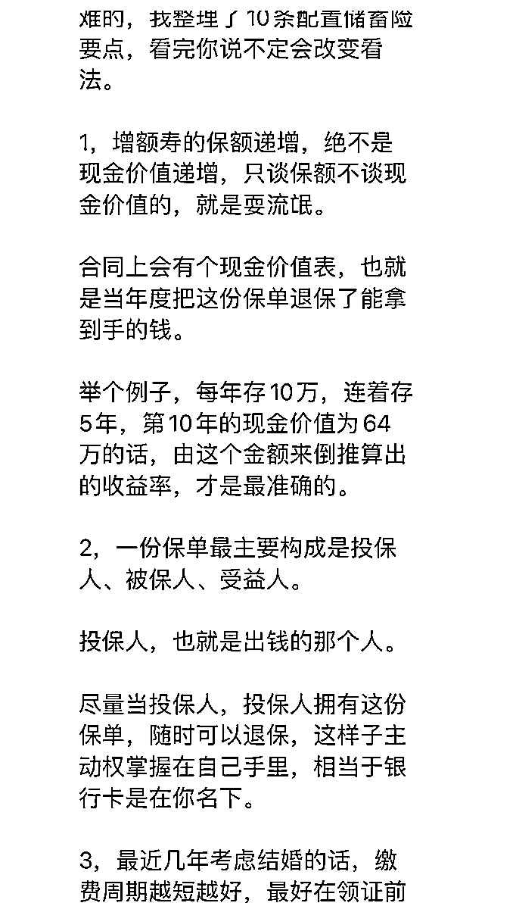

而文字版的QA更方便不看视频的客户快速了解理财险配置重点。

这些内容只要做一次，就能反复利用，边际效益很高，成交转化也特别有效率。

### 3.3.2 给客户定制个性化的解决方案。

有一些客户比较谨慎或者有更多更复杂的需求，我就会根据他们的情况做定制化的保险配置方案，归根到底，保险只是一个工具，而客户需要的是一个解决方案。

比如有的人为了离婚来买保险，希望对方少分一点现金；

有的人为了给女儿存嫁妆来买保险，保全女儿的婚前财产；

我都会出不同的计划书给到他们，满足他们需求的同时，甚至帮他们想到没有想到的，提供更多产品给到他们选择。

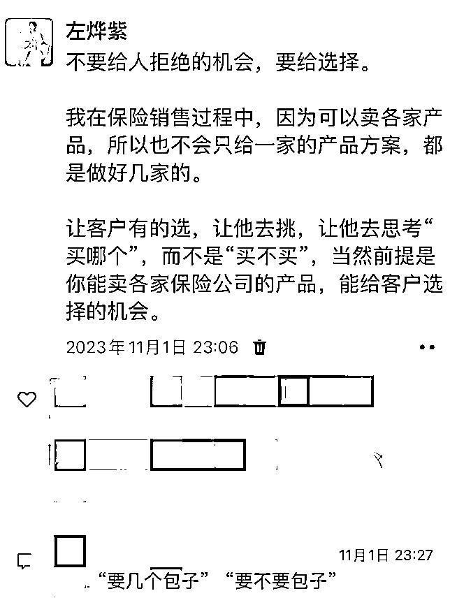

（不同保险公司产品的对比 ↓）

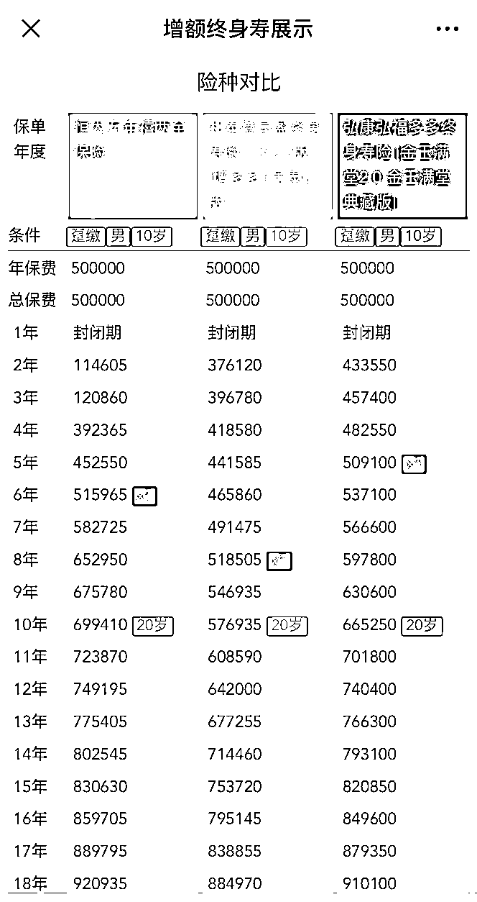

正是因为做了上面两个动作，这条朋友圈来咨询的人，我顺利成交转化了90%，取得了30万+的收入。

# 4.冰山之下：一条圈变现30万的前提

很多新手可能会想，那我照着上面做，是不是也能马上变现30万？

当然不是的。我这条朋友圈能变现30万是因为我日常坚持了这4个动作，大家也一定要重视起来：

## 4.1 常年坚持精准引流。

这条朋友圈发布后，明面上是有二三十个人主动来找我咨询，最终20多个人购买，每单利润1.5万。

但实际上，这二三十个人是我1万个私域好友中筛选出来的，也就是说，假设1万个好友都看到了我这条朋友圈，主动询问我的人是千分之三。

因为保险这个产品不像洗衣液等这样是日常刚需品，非买不可，又不像实物看得见摸得着，一买往往是几十年的，决策成本相当高。我很多客户从有购买意识到真正下单都要几个月，更别说本身没有需求的人。

所以必须要有足够大的用户基数，才可能撑起基本盘，才能实现这个案例的效果。

我平时就特别重视引流这件事，把它作为一个私域的常态动作，经常活跃在各个社群，去讲各种故事，吸引大家来加到我的微信，长年累月地坚持引流，让池子足够大。

总之，不管你是做什么行业，都要把获取精准流量作为首要的目标，这才是源头活水。用户是一定有流失率的，如果没有新的流量进来，或者新的流量进来的速度不够覆盖流失率，你的利润会越来越艰难。

如果你的产品是像保险这样，属于重决策类型的，更是要重视流量，因为变现周期较长，很可能死在现金流上，支撑不到盈利的那一天。

所以有的微商会给自己和团队制定KPI，必须每天引流5个精准用户。

这里还要特别强调一下，流量一定要是精准的，不能是泛流量，个体户不像大公司，能慢慢地做用户教育，我的方式就是找到最垂直的用户，这样教育成本最低且变现路径最短。

以我的保险行业为例，我的精准客户主要有两类，一个是有理财观念的人，他们会觉得保险是理财的一部分，必须配置保险。第二种是宝妈，因为了娃以后，爱的端口是向下的，想为自己的宝贝规避更多的风险。

因为内容输出不是我的强项，而且公域引流变现路径太长，我直接选择去理财社群、宝妈社群引流，讲她们愿意听的故事，吸引她们主动加我，而不是漫无目的地去群发消息、或者乱加人爆粉还被投诉。

建议大家也每天给自己制定一个引流的KPI，长期坚持；并且找到你的精准客户集中扎堆的地方去深耕。池子太小的时候，与其死磕成交转化率，不如找到更多有需求的客户。

## 4.2 少即是多，标签垂直唯一。

举个例子，你们的微信朋友圈，是否留着几个从来不聊天的微商，却从未聊过天，也许是代购化妆品的，也许是卖奶粉的，也许是做医美的，不聊，也不删，但相信我，一旦人们有了真实清晰的需求，一定会想起这个五年前在做代购，五年后还在做代购的人呢，这就是精准标签的力量，配上时间buff的加成，无以伦比的美。

在我的圈子里，只要说到卖保险，大家第一个就会想到我。甚至有人提到自己买了保险，其他人都会问是找烨紫买的吗？因为7年来，我的标签只有一个：卖保险的左烨紫。

而我的同行上一条朋友圈还在卖保险，下一条开始卖芳疗精油，再过一段时间，又在推团购搞体检，让大家压根摸不透她们到底在干嘛。我理解保险这一行生存不易，毕竟0底薪，要完全靠这行吃饭是很难的。但从客户角度来讲，既然要买保险，为什么不找最专业的呢？

我的客户都知道我是以此为生的，一干就是7年，不是来玩票的，一定会竭尽全力做到最后。她们也才能放心地找我，并且介绍给朋友。毕竟保险一买就是几十年的事，谁也不想频繁更换服务人员。

现在有很多人会有一大堆标签，看起来很厉害，其实反而模糊了客户的印象，让他们不知道在什么情况下找你。有时候还会让人觉得你可能什么都不精，建议大家平时多练习一下能不能一句话给人介绍清楚自己是干嘛的，做什么业务的。先不要贪多，把一个标签立起来、卡住位以后，再去拓展自己的标签。

实在是有多个标签或者业务，呈现在客户面前的时候，也要有主次的区分。而且标签最好不要超过三个，多了大家就记不住，没办法给你转介绍了。

这里给大家分享一个表格，可以协助你梳理自己的标签，其实梳理清楚标签了，也可以定很多行动方向。

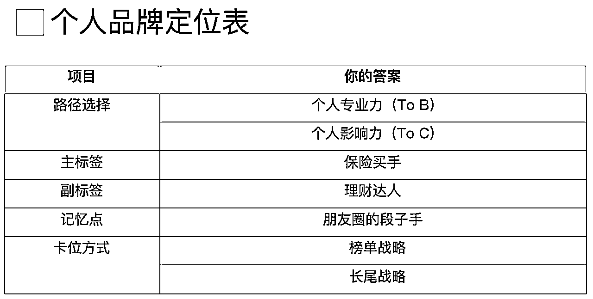

举个自己的例子，从我做保险以后，我的朋友圈签名是：网黄理财师、保险业泥石流、逗逼段子手，一直没有变过。

那我的主标签就是保险、副标签是理财，这两个标签还是互相促进的，大家一看就知道我不只是卖保险产品，还能给人提供全面的理财方案，所以客户有关于钱的事情都会来找我把关。金钱的安排都信任你的建议，买个保险还不是顺手的事？能变现的标签才是有意义的，不然可能就只是一个记忆点。就像朋友圈段子手是我的个人特色，可是没有人会为此买单。除非是在有标签能立住的情况下，记忆点才是有用的。

区分了主次，也会提醒我自己时间分配和精力重点，能提供理财建议的保险买手，和理财KOL顺道买保险，看起来相似，实际上做的事会有很多不同。如果主标签是理财达人，我就得证明自己在投资理财上的专业性、需要学习的、混的圈子也未必相同。

具体到卡位方式，我是榜单战略，做销冠就对了。

所以，我之所以跑赢很多同行，不是因为复杂和丰富，反而是因为不贪心，坚持“简单”。

## 4.3 持续用朋友圈去经营信任。

我这条朋友圈成交的每个客户给我带来的平均利润是1.5万，客户实际掏的保费都是两万~五十万（持续交3-10年）。如果不是足够信任，人家不可能一年在你这成交几十万，甚至几百万。

这些信任是怎么带来的呢？靠群发消息骚扰吗？信不信大家反手一个拉黑举报，而且越是高净值客户，越反感推销，毕竟想卖东西给他们的人太多了。

我就持续用内容去影响他们，让大家想买的时候，第一个能想到的是我。

哪怕做内容是我的短板，我依然持续地写朋友圈，让客户能不断刷到我。

一年记不住我、两年三年五年，她还记不住卖保险的左烨紫吗？

持续营业的状态会让大家更安心，能增强信任度。

就像摆摊一样，一个人风雨无阻地出摊7年，是不是比三天打鱼两天晒网的摊主，更值得信赖？

千万不要以为发圈没人看就不发，很多人只是默默刷而已。

但只是被记住，离让用户买单还有一段距离，发什么样的内容也有讲究。

翻开我的朋友圈，里面有70%的内容是关于我自己的生活成长记录，还有一些段子、干货知识，只有5%是跟保险强相关的，广告更是一年可能只输出几条。因此，只要我一发硬广，熟悉我的客户们就知道这是一款不容错过的好产品，就像这次的圈一样。

（但是用好了朋友圈背景和置顶，告诉大家我是谁，我干嘛的）

我希望客户通过这些朋友圈内容，感受到我是个活生生的人，是真心想跟大家分享交流的，而不是把客户当成流量，只想快速收割。所以，别人不仅不会屏蔽我，还经常主动来刷我的圈，那我影响他的频率就增加了。

如果你从事的是大客户销售、或者你的产品属于需要用户重决策的，你应该把70%的精力放在经营信任和挖掘需求上。在没有经营起信任之前，绝对不能推销。

一个大客户背后可能是一个圈子，不要做那个莫名其妙“死”掉的人。

## 4.4 讨人喜欢可能比专业更重要。

很多学习力较强比较厉害的人，会有一个误区：专业大于一切。结果现实总是让他们受伤：为什么专业的自己还卖不过小白？觉得是客户不识货。

专业当然重要，但想让一个人下单，仅仅获得理性的信息是不够的，还应该有感性的触动。不然为什么直播卖货的人那么多，能带货的超级IP只有那几个？

最近AI不是很流行么，我常思考，AI最后一个取代的职业，或者说最不可能被AI取代的职业是什么呢？对，是销售，销售的关键不是那90%的严肃科普，而是那10%的关系建立，信任，和情绪价值，是最后那一哆嗦。

专业只是底线和门槛，而且你的专业一定对客户有意义吗？就像对于普通人来说，年入3000万和5000万没什么区别，小白用户也不一定能区分得出你和竞品之间的专业差异，也不需要去区分。所以他们为什么要为此买单呢？

梁宁在得到的《增长思维30讲》里就说，我们对一个东西的感受，其实30%是功能、性能和观感感知，70%是心理体验。如果一味的专业，牺牲用户的感受，是不是也是一种傲慢呢？

实际上，很多客户跟我说，他们接触过很多销售，总是试图教会他们点什么，所以即使他说的是对的，客户就是用脚投票，不在他那里买。

你得先让人喜欢和信任，才能有机会展示你的专业。不然专业反而可能起副作用——我怎么知道你坑我的时候是不是也是专业的呢？

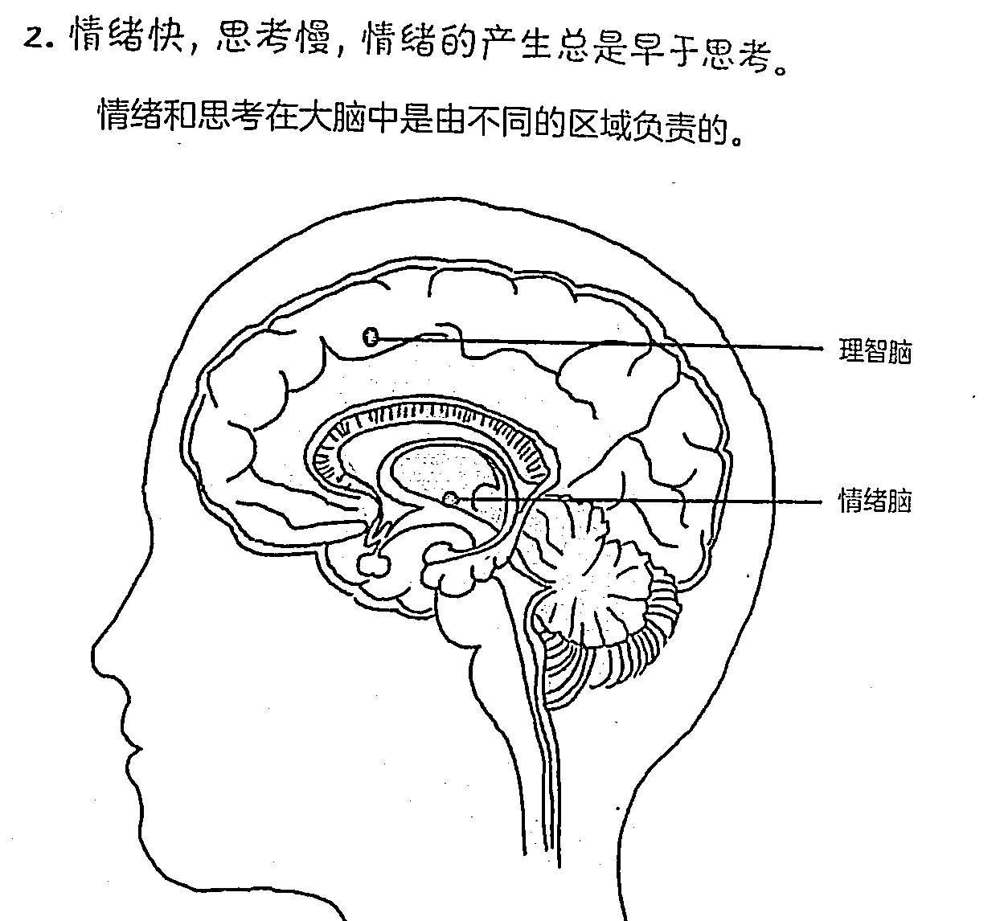

作为一个逗逼的段子手，看起来这个记忆点跟变现没有直接关联，但却成为了很多客户选择我的理由。他们相信我是无害的，会站在他们的角度思考，也能放松地来主动找我聊天，不必担心我时刻想卖他们点什么。

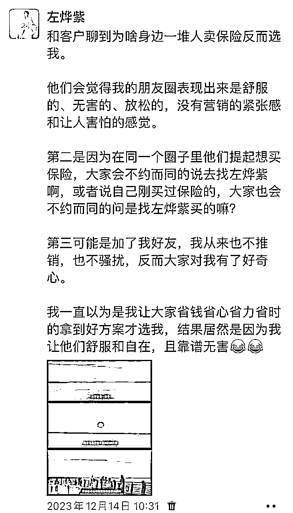

如果你希望不要那么卷，更轻松地赚钱，就一定要努力做一个讨人喜欢的人，给客户提供到更多的情绪价值。

像我的客户95%都是女性，她们天然更喜欢情感上的链接，所以我就讲自己的故事、为什么我一个好好的姑娘跑来从事保险这个不那么体面的行业，那么想赚钱。因为我想掌握自己的命运，而不是早早回老家嫁人，我想证明我可以。这个故事是真实的，也是能引起她们共鸣的。

在专业方面，妈妈们在意的是宝宝的安全。但这只是明面上的需求，背后还有一系列的东西是需要你帮她考虑到的。这些相关的内容和价值输出，我都会在朋友圈里写出来，让她们有所启发，默默地就开始信赖我。到了真的要买的时候，她能敞开地谈自己的需求和担忧，我们还经常聊着聊着就聊哭。

如果你不擅长这些，展现真诚地替客户着想的内容也是一种情绪价值。

2020年，因为当时所在公司的产品涨价了50%，我自己都难以接受，于是我决定宁可不出单，也不要推荐给自己的客户，导致我一整年没有出单，一分钱佣金都没有进账。

我在朋友圈坦诚地说了这件事，没想到，命运的齿轮在此刻转动。

最近这一条30万的朋友圈所带来的客户，就有几个客户告诉我说，前面那一条朋友圈给他们留下了深刻的印象，觉得我是可信赖的人，才会在这个时候选择我来成交。

综上，平时我们要坚持精准地引流，保证自己的用户池子够大；有清晰的变现标签，并且尽量精简；持续用朋友圈去经营信任；做客户喜欢的有温度的人而不是冷冰冰的专家，你才能在时机来临的时候，去抓住这个机会，用朋友圈去把之前的好感和信任变现。在执行的过程中，把发朋友圈当成项目去进行去推动，而不是单一的动作，并且一定要做好私聊的转化承接，避免输在最后一步，才能打造一条30万的朋友圈。而且以后还很可能可以滚雪球，有更多的价值30万的朋友圈。

# 5.致谢以及如何用好生财这个平台

最后，我很感谢生财这个平台，让我认识了这么多朋友和贵人，让我在搞钱的道路上可以越走越远。

进入生财后，一直不敢发帖的我，在涛哥的CP群里有了第一批客户，大家不仅不嫌弃我是卖保险的，还主动加我微信，主动找我买保险，我感受到了因为专业赢得的尊重，特别开心；

很多生财的大佬、圈友们积极分享，还有官方的运营，提升了我对搞钱的认知，极大地减少了我走弯路的可能；

每当我摆烂和emo的时候，很多生财的朋友拉我出来嗨，让我觉得自己没那么差，还有无限的可能，重新燃起对生活的希望；

今年7月开始更是开始负责深圳同城群，我们到目前为止累计线下活动150+,累计参加活动人次2000+，还在12月和醒醒负责了深圳的航海家微天使路演聚会，这些慢慢让我有了生财主人翁意识，认真把深圳生财线下活动办好，让更多圈友有所收获和获得正反馈。

最后特别感谢胭脂王的推荐，让我进入生财，感谢涛哥3 年来对我各种全方位无死角的帮助、感谢明白老师和涛哥让我迈出发帖的第一步，帮我改稿。

谢谢大家~~如果你有朋友圈营销、社群运营、理财保险等方面的问题可以找我交流。要脱单的男士也欢迎加我，我手里有300个生财的单身女生资源（涛哥认证的）。

不要再做小透明，抱紧官方的大腿、勇敢迈出第一步、积极分享有价值的内容、让更多人看到吧。