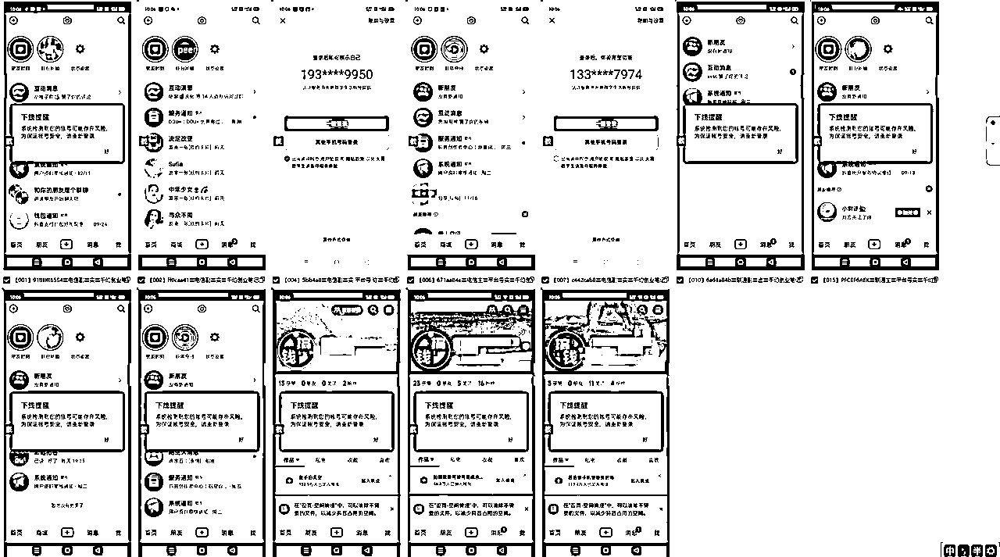

# 十分钟学会截流,日进几百精准创业粉保姆级教程

> 来源：[https://mxns82lqqfd.feishu.cn/docx/HmF1dEbweo6i8lxZcBCcjC59nMe](https://mxns82lqqfd.feishu.cn/docx/HmF1dEbweo6i8lxZcBCcjC59nMe)

🎯 大家好,我是千幻,十年互联网创业者,互联网全职创业十年,做过弓|流/seo/抖音/公众号等等等

目前在做:各平台评论截流/抖音矩阵带货/小红书矩阵弓|流/微信主动十人等等等等

欢迎各位兄弟链接,一起交流

# 一、介绍

相信大家最近经常看到抖音评论区 拉个创业群,xxxx...

这种就是通过评论区截流,大量曝光从而达到引流的目的

如果一条评论火了,可以拉满一个500人群,甚至2个.3个......

实测土豪版流量单个成本3元左右,土豪版不计算人工对接的情况下2元以下~因为我就一个人,没时间对接,放弃...

...

此教程不局限于创业粉,其他任何行业,只要能找到同行,钩子设好,都可以引流

## 引流案例

对标评论区: 想成大事，25岁之前就要不断试错#穷人翻身#提升自己 #不认命就拼命 - 抖音

上面是我个人操作的进粉截图,每天基本上100-200创业粉

# 二、实操(创业版)

适合个人三五台设备,预算不足,人员不足的兄弟

### 工具:抖音账号x个,设备x台

## 操作流程:

以下都是以创业粉引流来操作的:搜索关键词/关注的博主➡评论视频➡有人私信➡引导到微信

### 1,关注博主的评论区评论:

引流号关注一批优质博主,去博主视频评论留钩子即可

如果不知道搜哪些

这里有一份为大家准备的创业类有关的博主信息和话术(花了几天时间才全部整理出来的更新频率快的)

里面的话术/博主仅供参考,并不局限于此类(如果有更好的钩子,请一定告诉我,一起偷撸/坏笑)

如果有人回复,你可以回复一下:拉你/加我/主页/私等等(注意谐音,别违规)

没人回复,如果视频流量大 可以适当用小号诱导一下(现在的评论排名千人千面,不一定你后面评论,就显示在后面)

### 2,搜索关键词:

搜索创业/副业/网创等等关键词,去视频评论区评论

### 3,养号后再进行评论(推荐)

前期通过搜索博主,观看点赞,打上标签后,抖音推送过来的就全部是精准的创业类视频

为什么这样做?有什么好处?(很多类型的视频搜索不到/刷到的视频更精准)

### 4,关于频率/封号问题

每个号一天10-20条(太多不显示)

实操50+个号,除了个人简介设置违规禁言30天,最严重的情况:封私信7天

### 5,关于导流

##### 1,主页三联图

推荐:不封号不违规,可能会漏掉一部分(有人看到这样的会起戒心,不过当你的产品[钩子]足够吸引人的话,可以无视)

三联图制作:制作一个2190*960尺寸的图片出来,然后分割分割图片——免费在线剪切图片成多个小图片

##### 2,个人简介留V

对新号不友好,很难设置成功,违规会导致资料重置,多次违规直接禁言30天

##### 3,对方私信后自己留V

对新号不友好,会禁言 如果非要操作,v信单独发一行,或者发语音说微信(老号基本没什么问题)

##### 4,私信让对方留V,主动添加(工作量大,但不会漏加)

工作量大,但不会漏加

# 三、实操(土豪版)

适合土豪,资金充裕,团队人数多 可以通过付费,解决人员/设备/评论不显/风控/账号不够等情况

#### 流量合伙人模式:

收费9.9/19.9/29.9....价格随意,给他们提供全自动软件(复杂!可以不提供,直接手动更方便),教程,付钱后他们引流过来的流量XX一个回收(一般给到3-5元一个,甚至可以更低)

这样的好处,既激活粉丝,又能搞定流量来源,一举多得,如果没有类似的插件可以找我哈

能搞来流量的,后期更容易转化,搞不来流量的,价格不高,咱们做了第一次变现,覆盖一点成本,核算下来单粉成本3以下,可以说非常低了!!!非常适合有预算的小团队/工作室/大团队等等

把实操(创业版)整套方法教给他们,录个简单的视频即可

视频流程:搜索关键词➡视频评论➡有人私信 直接回复微信号即可(个人老号抗封)

注意:每个给你做的人,给定一个编号(有条件的,后期能做出来流量的用户,直接单独给个微信)

方便给他们结算

给他们的话术 例:我的v:xxx 备注666 不然不会同意 (类似这样就ok,不同的人,不同的编号或者微信)

也可以使用三联封面,简介等方法,这种用户会觉得复杂,效果也不好(有引流到的人,证明执行力不差,再让他们这样设置)

结算流程:录屏当天微信号的进粉页面,发给给你做流量的用户,让他们去按照给定编号统计,然后结算

可以使用腾讯会议等等视频实时共享的方式都是ok的

# 四、实操(个人矩阵版本)

个人操作多账号多设备,利用工具达到全自动引流 适合个人/工作室/团队

待更~ 涉及的细节较多,还有问题没有解决,兄弟们可以关注一波

到时候专门开一帖矩阵科普的,包括 群kong软件选择/设备机型选择/辅助设备选择等等超多细节问题

# 五、项目总结

*   对于做知识付费类的兄弟,是非常好,非常容易复制的方法

*   容易拿到结果

*   可以快速起量

*   ......

# 六、项目总结

累,累,累 熟悉我的兄弟都知道,从始至终我只有一个人,没有团队没有助理,所以做的非常累

再加上我没有成熟的变现运营体系,短期看不到结果,就更累了(一定,一定,一定要搞个团队去~)

不管是创业版,土豪版,个人矩阵版,以我的立场,来说一下我认为的弊端(仅供参考)

创业版:需要手动(光这一点,就退缩了,手动是不可能手动的)

土豪版:需要对接各类小白,需要核对每日进粉等等(时间不充裕,有很多插件/软件想法都还没有做好,对接小白耗神)

个人矩阵版:账号一多,登录是个问题,出现核对/禁言/吞评论(如果能解决核对掉线问题,非常香)

# 最后,欢迎各位兄弟链接,一起交流,一起生财