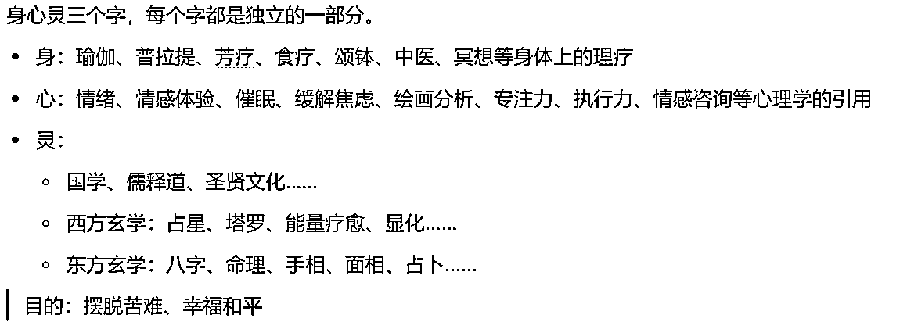
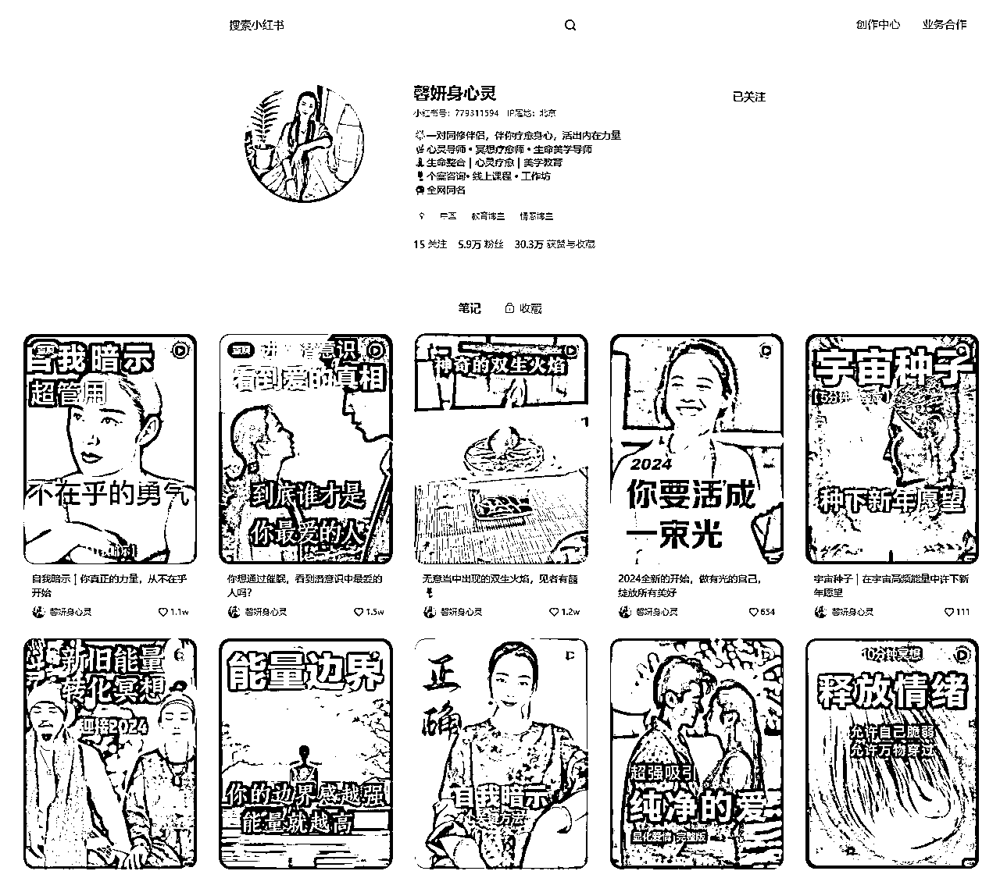
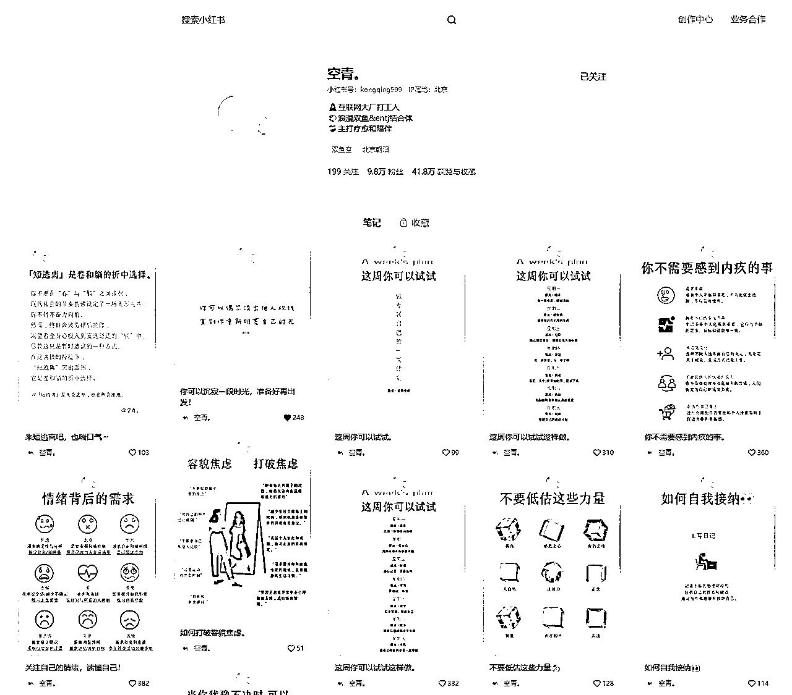
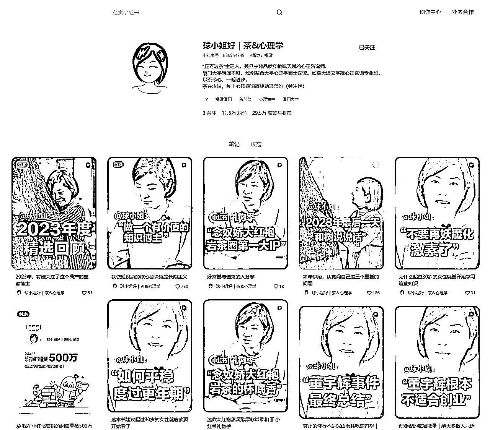
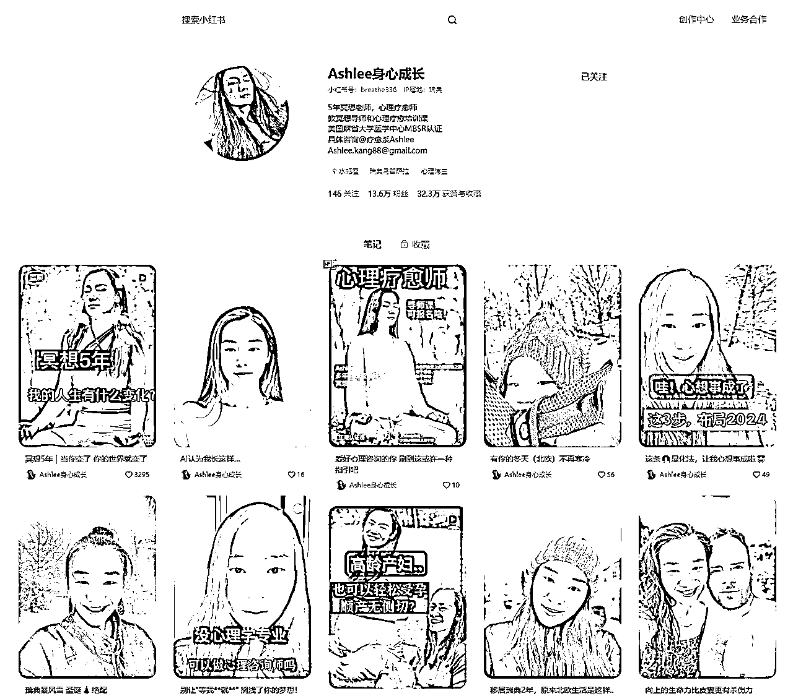
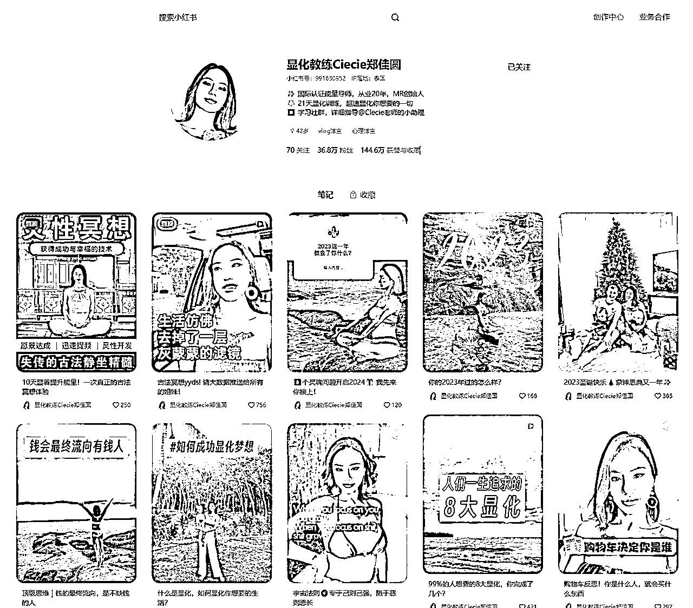
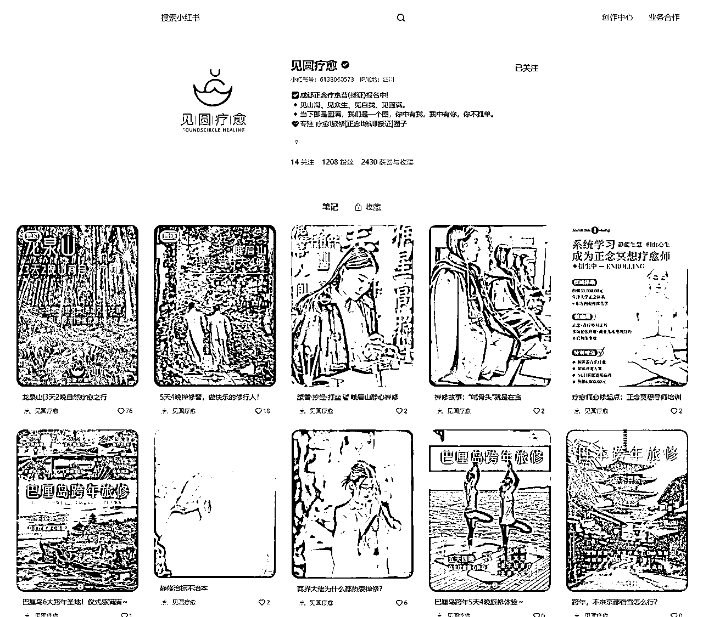

# 风向标拆解第2期--怎么在小红书做一个赚钱的身心灵账号--华尔街之狼

> 来源：[https://qc7u7ru59d.feishu.cn/docx/HtTAdpRpDowFawxyo2DcUv9znif](https://qc7u7ru59d.feishu.cn/docx/HtTAdpRpDowFawxyo2DcUv9znif)

注：以下案例中的人还没通过我的好友，通过之后我会把后端的产品和利润计算补上。大家先凑合看，见谅。😭😭😭

# 1、身心灵包括什么

# 2、项目方案

## 2.1、混剪图文+视频

适用于想入局身心灵的新手，可以快速获得正反馈。适合快速起号。

### 2.1.1、案例一

*   案例主页：馨妍身心灵

*   特点：

*   优点：

*   无需真人出镜。

*   视频制作简单，通过混剪图文和视频来获取流量，适合批量化矩阵操作进行放大。

*   流量高，可以快速起号，拿到正反馈。

*   缺点：

*   由于不是真人出镜，很难建立信任感，所以上限低，大单不好成交。

*   笔记制作：把从知乎和微博抄来的文案或者gpt生成的文案，用自己声音念一遍。

*   产品：个案咨询、线上课程、工作坊

### 2.1.2、案例二

*   案例主页：空青。

*   特点：

*   优点：

*   无需真人出镜。

*   视频制作简单，通过制作图文获取流量，适合批量化矩阵操作进行放大。

*   流量高，可以快速起号，拿到正反馈。

*   缺点：

*   由于不是真人出镜，很难建立信任感，所以上限低，大单不好成交。

*   笔记制作：

*   找文案+创客贴套模版

*   记得模版要温馨一点

*   产品：

*   疗愈陪伴营，21天399元。一般购买体验过一次，我们就能做出差不多的产品出来。

*   变现没有想象中好。

总结：可以前期起号用这种形式，流量好了真人出镜做ip。

其他同类型账号：

*   百岁老人养生计划、

*   格格|美业创业者——身心灵+美业

## 2.2、真人出镜做ip

一个ip要想赚大钱，出高客单，必须满足三个要素：信任感，影响力，有成交。不真人出镜不好建立信任感，所以不容易赚大钱，这也是必须真人出镜的原因。

这里建议身心灵与其他结合起来，这样做差异化定位比较好。

注意事项：

*   ip本人的质感很重要，环境搭建也要注意一下，这个赛道，氛围感很重要

*   需要ip本人具备一定的输出能力

*   如果ip表现力不好，就一句一句慢慢拍

*   选题直接参考同行就行

真人出镜如何放大：

*   降低制作一个视频的时间，一个号做起来后马上铺矩阵。

*   拍口播，找人专门写文案，然后出镜的只记个大概意思，就能拍视频了。一天产出30条视频不是问题。

*   让出镜的人每天直播，把直播素材交给剪辑，做直播切片。

### 2.2.1、案例一

*   案例主页：球小姐好｜茶&心理学

*   定位：身心灵+茶

*   产品：茶室预约、1对1心理咨询、橱窗带货

*   利润计算：

### 2.2.2、案例二

*   案例主页：Ashlee身心成长

*   定位：身心灵+冥想

*   流量：视频+直播

*   产品：

*   引流款：6门线上课

*   利润款：

*   利润计算：

*   引流款：利润大概在5.5w左右。

*   利润款：

### 2.2.3、案例三

*   案例主页：显化教练Ciecie郑佳圆

*   定位：身心灵+三胎妈妈+冥想

*   产品：

*   引流款：灵性冥想课程

*   利润款：

*   利润计算：

*   引流款：客单价68，卖了473份。利润3w。

*   利润款：

## 2.3、卖铲子-教别人做疗愈师

### 2.3.1、案例一：

*   案例主页：见圆疗愈

*   流量：小红书引流，公众号和微信朋友圈承接。

*   产品：

*   疗愈师系统培训线下课，可免费复训，有陪伴群。包括正念疗愈，铜锣颂钵疗愈，催眠疗愈，禅修。客单价4680。

*   音疗师证书，客单价1200元。

*   利润预估

*   营收：

*   线下课：一个月2次。一次12人，客单价4680。合计112320。

*   音聊师证书：按总参与人数一半的人计算，也就是12人，客单价1200，合计14400。

*   后续可能会有其他转化，按2w算。

*   成本：假设自己做流量，后端对一个老师，两次6k。租场地两次4k。

*   单月利润：13万6720。

*   优点：你关注对方后，对方会主动给你发联系方式，减少了用户的抵达成本。都是高客单。

*   缺点：整个账号都是广告，没有人设，没有人情味，甚至都没有线下课的画面。可以改进的地方很多。

*   如果有了真人出镜的ip属性，变现肯定会更高。

### 2.3.2、案例二：

*   案例主页：Su灵商

*   产品：颂钵疗愈师培训、冥想疗愈师培训、芳香疗愈师培训、多个城市线下课、疗愈年卡、30天财富觉醒

*   优点：都是高客单

*   缺点：整个账号都是直接硬怼广告。没有人设，没有人情味，甚至都没有线下课的画面。可以改进的地方很多。

# 3、身心灵ip账号的最终解

混剪图文和视频起号+真人出镜做ip+卖铲子三管齐下，配合引流产品（线上课-低客单）+后端盈利产品（线下课或陪伴型社群-高客单）+培训产品（教别人如何进入这一行-超高客单）。只要坚持并不断优化不好的地方，必然会有一个不错的结果。