# 美国广告联盟 Cj Affiliate 操作指南

> 来源：[https://zo58x45lxn.feishu.cn/docx/Itrfd7QIHoPIFkxedMrcj36Cn5b](https://zo58x45lxn.feishu.cn/docx/Itrfd7QIHoPIFkxedMrcj36Cn5b)

# 前言

我们在注册cj之前需要准备一个邮箱，推荐大家使用谷歌的gmail。

除此之外，注册cj联盟，选择账号归属地的时候其实挺有讲究，因为cj联盟包括里面的广告主对来自不同地区的申请者会有不同的态度和管理制度。

甚至有一些功能是不对一些国家地区开放或只对一些国家地区的申请者开放，比如你注册了cj中国账号，你在后台是找不到“pay per call"这个栏目的。

其中cj联盟的美国账号肯定是最好用的，毕竟cj上的广告主绝大部分是美国的本土公司。

但是作为中国人，地址验证和税务问题，你直接注册美国账号，随时有被封号的可能，因为身份造假在cj是零容忍的。

业内是有一些野路子注册美国账号，这里不展开讲，对新手来说没意义，大家不需要纠结。

中国账号一样可以有很好的收益，中国账号一样可以申请到美国的广告主，我自己用国号一样收了很多钱。

我们注册的第一个账号，推荐大家直接用真实的身份信息注册国号即可。

更多 Affiliate Marketing 内容可以关注我的公众号：陈辰地盘

# 一 账号注册

1 访问cj联盟官网：cj.com，点击get started

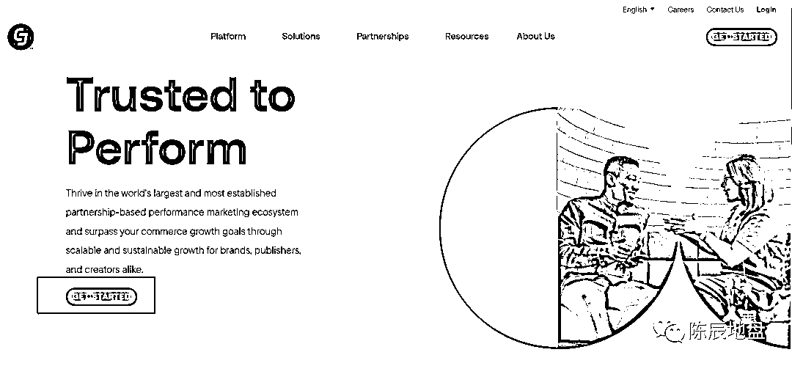

2 我们是推广商，所以我们要选择注册推广商账户：Publisher

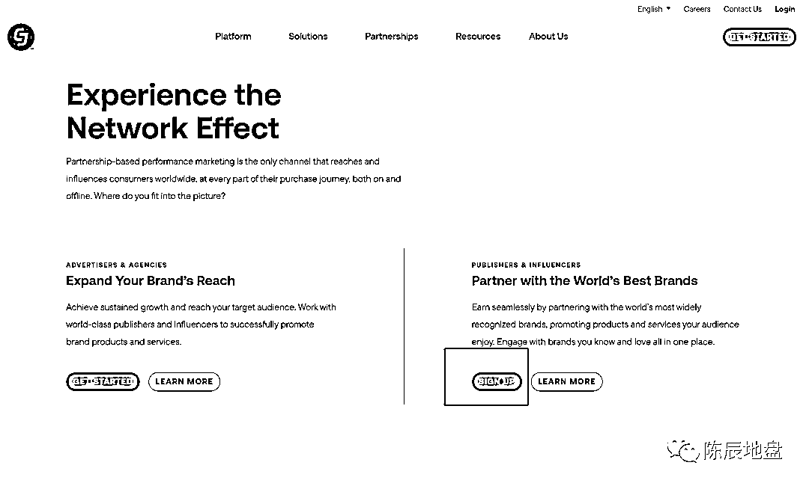

3 选择账号归属地（按你真实的来，你在哪里就填哪里），填写你的邮箱和密码，点击验证邮箱

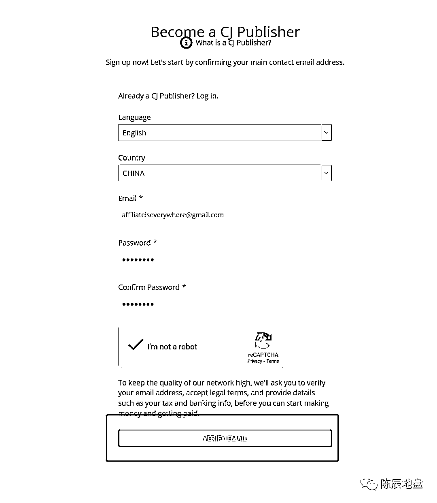

4 到你注册账号的邮箱，点击“ create my cj publisher account"

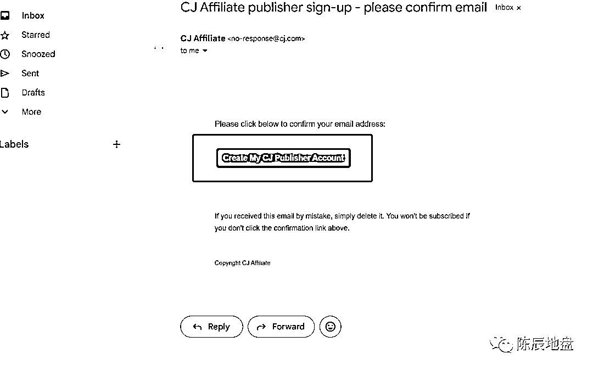

5 该打钩的打钩，能accept的accept，这里有一个tip，就是这些条款你需要点开看一下，那个accept才能点，否则是灰色的。

选择完以后点击continue to account 会跳转到账号登录页面，你填写你的账号密码正常登录就可以了。

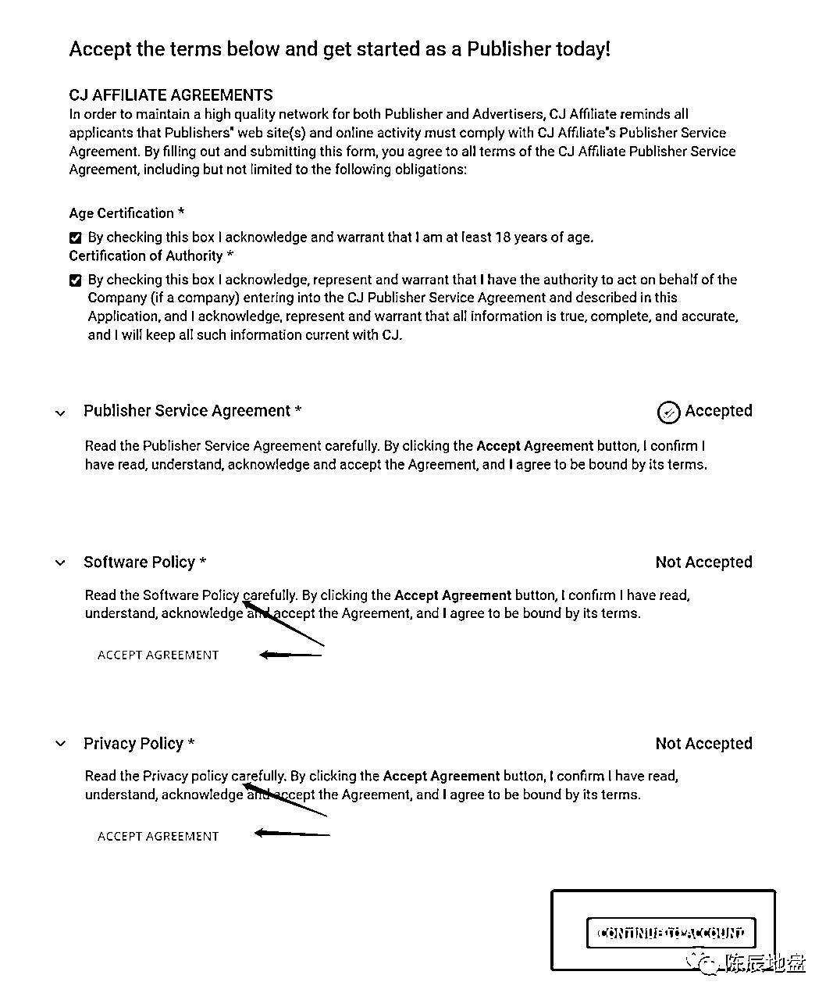

6 进入onboarding checklist，下面我们跟着它提示的一步一步把必填项填完，就可以激活你的账号了。

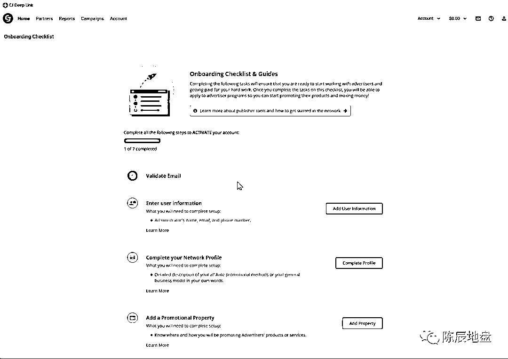

# 二 完善账号信息

## 1 个人信息

咱们填写自己的真实信息就可以了，用拼音即可，那个title，你可以直接填你的名字，填写完以后点击save。

跳转到个人信息页面，再点击一次home，就会回到onboarding checklist。

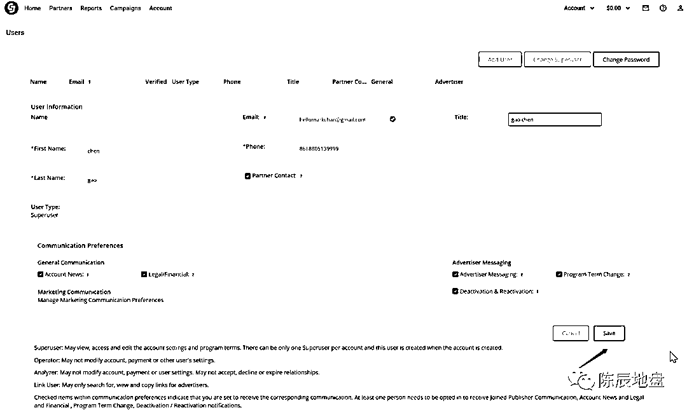

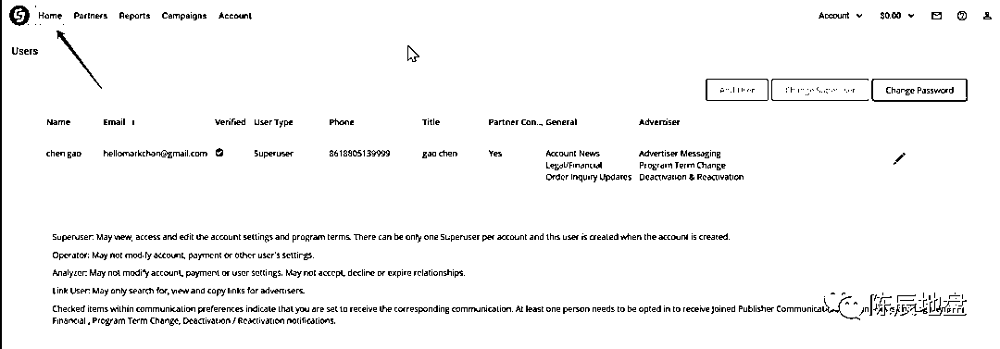

填写完个人信息就往下，填写network profile,以此类推。

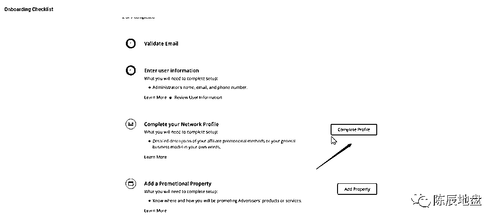

## 2 network Profile 和 推广信息

### 2.1 network profile

这部分内容很多人会忽略，但是其实它非常重要，是我们一个新账号是否能获得广告主推广权限的重要考量。

我们在申请特定的广告主或者广告主主动在cj里搜索它可能的合作伙伴的时候，它首先看到的就是你的network profile。

Network profile相当于是我们的简历，是我们向广告主展示我们推广能力的一个机会。

（这里填写的内容是可以更改的，大家刚开始注册的时候填写的内容不满意或者后续优化，都可以回到network profile 这里编辑更改）

这里有一个填写模板，大家可以做一个参考：

XYZ.com is a leading digital media company delivering news and content to millions of people in the US and Canada. We feature content on lifestyle, fitness, healthy eating, beauty products, fashion and travel.

*   Target Country(ies): US and Canada

*   Target Language(s): English

*   Target Category(ies): All

*   Affiliate Statistics:

*   6M monthly page views

*   2.5M email subscribers

*   60% female, 40% male

*   Average age 25-45 Years

*   Average income of $75k+

*   Placement Opportunities: Homepage, Newsletter, Mobile Push Notifications

*   Other: To work with us, you must be able to provide an updated product catalog.

*   Contact: johndoe@xyz.com

这么看可能不太直观，我给大家看一下，我第一个cj账号是怎么写的。

I am a digital marketing expert from China, I have more than 60000 followers on my WeChat official account,

At the same time I have 56,193 followers on Zhihu (a Chinese version of Quora，my accout url is https://www.zhihu.com/XXXXX),

These followers are mainly Chinese foreign trade practitioners，Building a website is their basic business requirement。

I will live broadcast how to use wordpress to build a website every Friday on my Zhihu.

At the same time, I will continue to update various digital marketing skills on my personal blog https://XXXXX.com（这是我学着米课老华的https://mrhua.net做的个人博客，全中文）, and there will be a topic about wordpress。

*   Target Country(ies): china mainlander

*   Target Language(s): English and chinese

*   Target Category(ies): All

*   Affiliate Statistics:

*   60000 followers on wechat

*   56,193 followers on Zhihu

*   80% male, 20% female

*   Average age 25-45 Years

*   Average income of $50k+

*   Placement Opportunities: Homepage, Newsletter, and all my socialmeida accounts.

*   Contact: 我注册cj账号时留的邮箱。

我第一个cj账号，就给我赚了上百万，推的eig集团旗下的几个网站服务器offer。

这里有两个比较有参考价值的点：

1 我的账号是中国账号，申请时填写的网站也是全中文的。

2 申请cj需不需要网站？其实网站不是必备的，但是你必须要有一个流量入口，这个流量入口，是任何你能产生影响力的地方，比如你的抖音账号，你的油管账号，你的知乎，你的某个论坛的主页等等，但是网站确实是最简单的流量入口，多数广告主都会考察你这个流量入口是否和他们的用户匹配。

新手注册cj账号，在这个位置不知道填什么，可以先找个网站的简介对付一下（因为你空着也不行，是必填项），进到后台找到自己感兴趣的领域，再根据对应的广告主量身定制（做他们感兴趣的内容，写他们关心的指标）。

我们在创建完network profile以后，下一步是添加我们的推广信息。

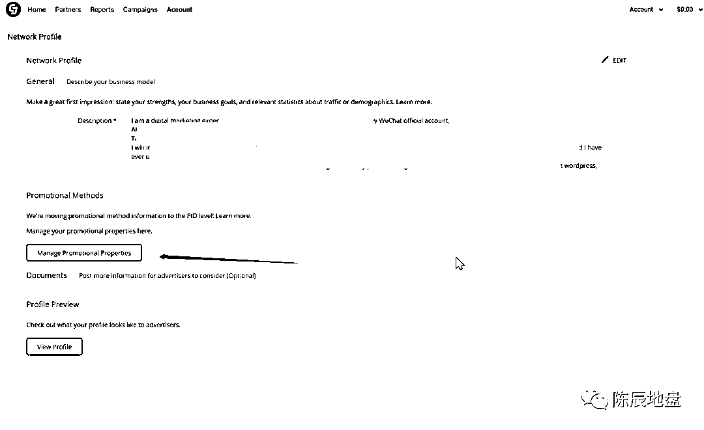

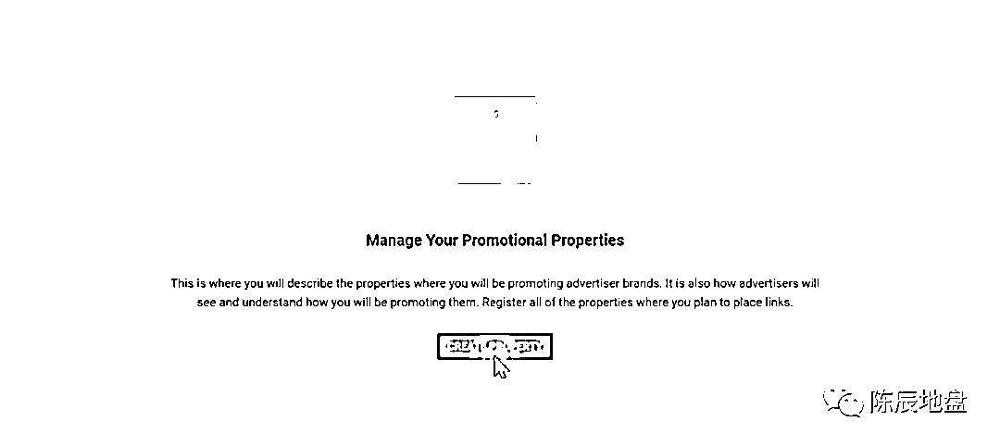

### 2.2 推广信息

这里填的是咱们的流量入口，它可以是网站，也可以是任何你能产生影响力的社交账号地址，脸书账号油管账号什么的都行，你有什么就填什么。

你可以选择website，填一个自己的博客地址。

或者选择social，填自己的社交账号地址。

不需要纠结，因为后续都可以更改。

Plus，cj是不验证流量入口所有权的，换句话说，你可以填任何不是你的网站在这个位置。

再往下是选择推广方式，一般默认选择第一个内容营销就可以了。

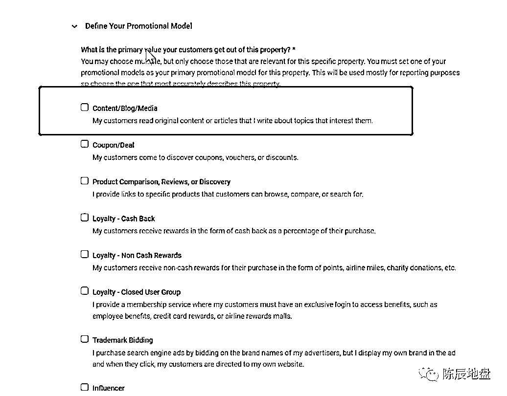

照实填，非必填项可以留空。

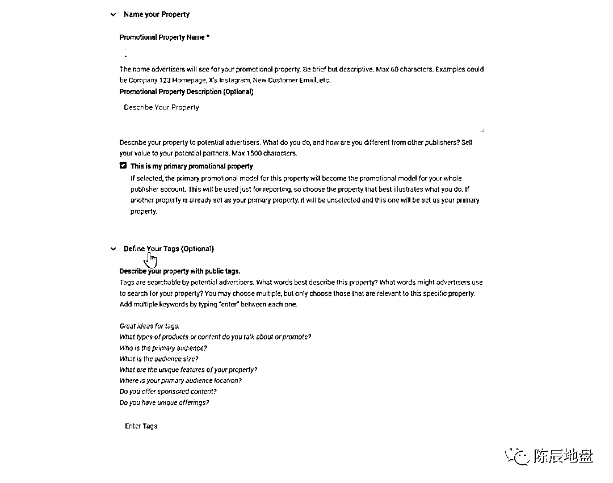

## 3 收款信息和税表提交

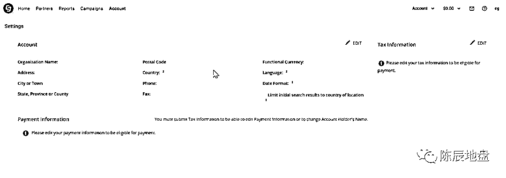

这个页面要填写三个部分，1 账号信息 2 税表 3 收款信息

账号信息用拼音照实填就可以了，如果要求你填一些什么“组织名称”，写自己名字即可，非必填项可以留空。

### 3.1 税表

如果你是美国账号，则选择的是W-9，我们是中国账号，选择第二个W-8ben。

在W-8ben，填写我们的真实信息即可。

有两个注意点。

1 税表里的Foreign tax identifying number ，我是填的身份证号。

2 税表的第二部分”claim of tax treaty benefits",我问了银行的人，这是针对北美的税务减免互惠国才填的，我们是不需要的，所以直接勾选“i am not claiming tax treaty benefites"即可，税表的第二部分全部就不需要填了。

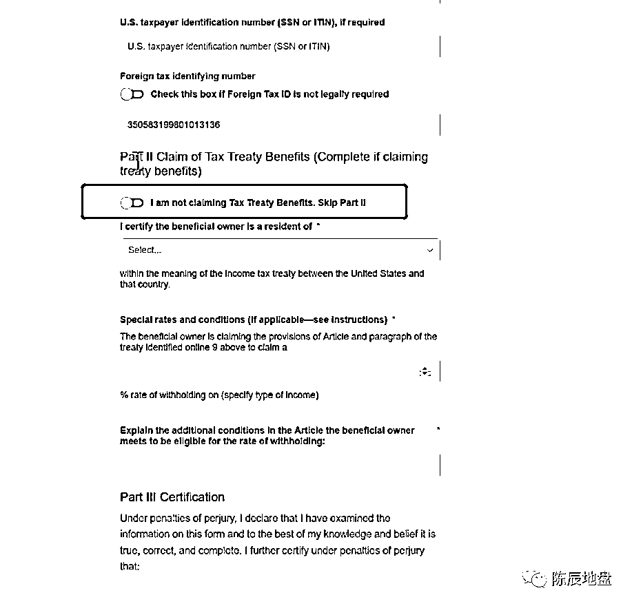

### 3.2 收款信息

cj现在支持的收款方式曾经有两个，一个是支票，一个是银行转账。

如果你有国外的银行账号，直接用，如果没有，cj给的建议是 payoneer，注册payoneer很简单，到处都是教程，这里不赘述。

货币我是选择美元，最低提现额我默认100美金，account type 那里选择 checking 账户。

剩下的这些银行信息，你可以在你的payoneer后台找到

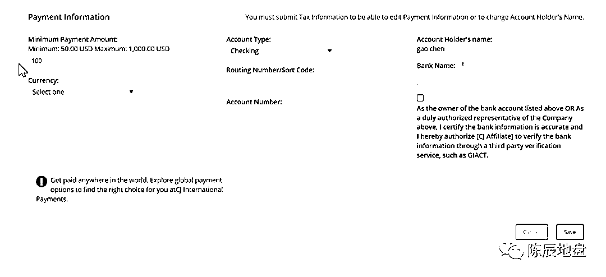

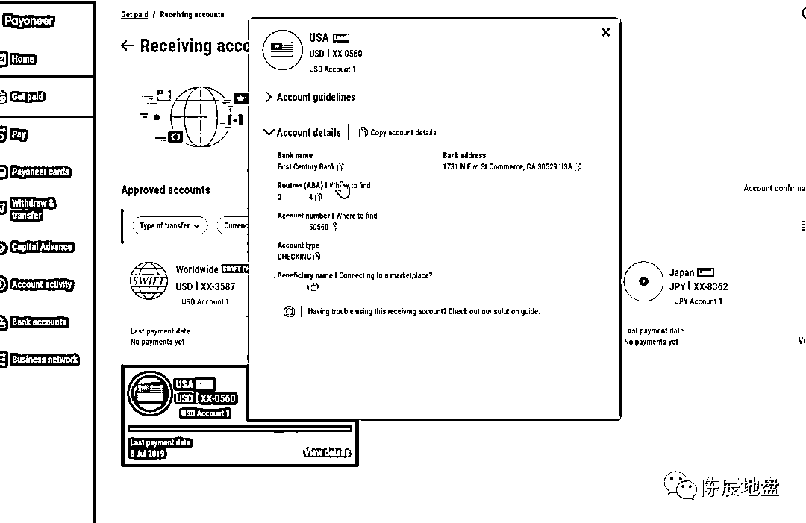

## 4 激活账号

以上填完以后，最后有一个问卷调查，全部选no即可，然后就可以激活我们的账号了。

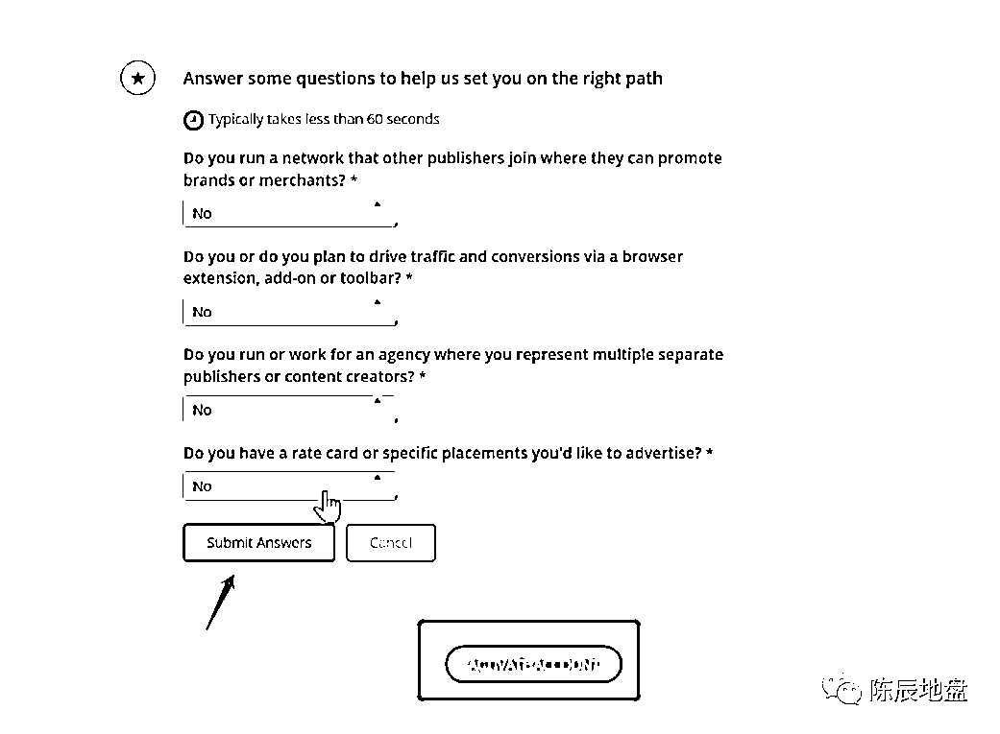

# 三 后台功能

## 1 后台总览

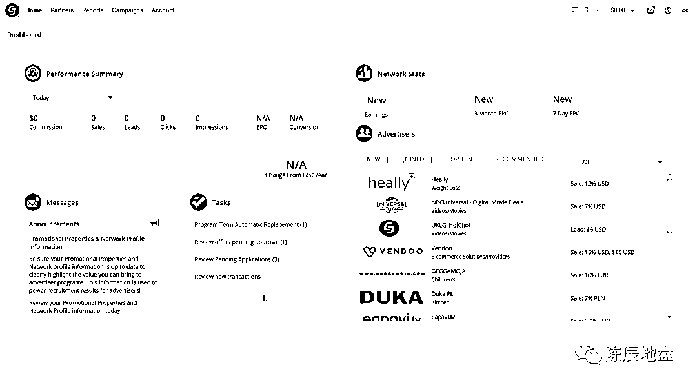

## 2 如何选择和申请广告主

## 2.1 如何申请广告主

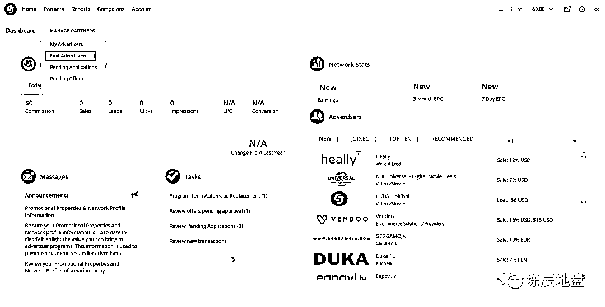

我们通过上方导航栏，点击find Advertisers，可以进入选择广告主的页面。

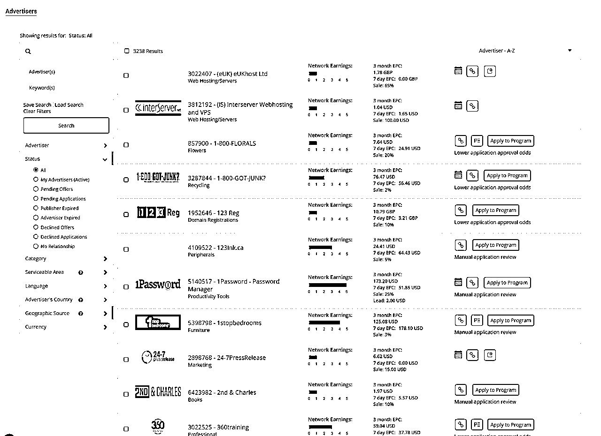

在广告主集合页面，你可以通过左边的侧边栏，选择你感兴趣的类目或者广告主所属的国家，也可以通过关键词，搜索感兴趣的广告主。

选择好你希望合作的广告主以后，点击右边的“Apply to Program",就可以申请权限了。

所有通过你申请的广告主可以在左边侧边栏的“my advertisers(active)"找到。

审核中的在左边侧边栏的“Pending applications”里。

## 2.2 如何判断广告主的质量

cj的广告主有两个很重要的指标，分别是 network Earning 和 EPC。

这两个指标越高，则侧面说明这个广告主的质量也越高。

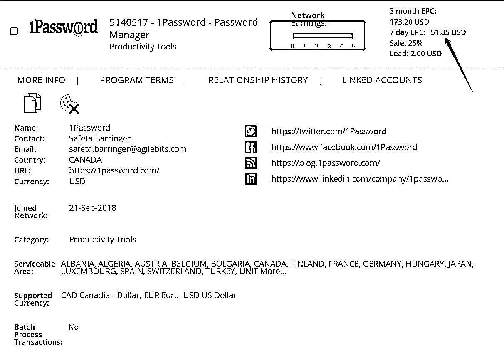

### 2.2.1 什么是EPC

Epc的全称是：Earnings Per Click (EPC)，每个联盟都有这个指标，但是这里要强调一下，每个联盟关于这个指标的解释可能不一样。

比如 cj 的 epc 是 每一百个点击产生的佣金数额，有的联盟则是每一个点击产生的佣金数额。

这一定要明确好，因为这个指标是我们判断offer质量最直接的指标，特别是你使用付费广告推offer的话，指标越高，则说明产生佣金的能力越强，转化率也越好。

### 2.2.2 什么是Network Earning

这是一个相对评级，指的是该广告主在一个周期下，支付佣金的情况，它支付的越多，则评级越高，侧面说明了和它合作的推广商赚的也越多。

## 3 cj联盟的付款政策

标准情况下，cj是次月付款，根据广告主和你账号的情况，你将在次月的20号或者次月的30号收到你上个月的佣金款。

比如你1月份的佣金，会在2月份的10号锁定，第一批收款是在2月的20号左右，第二批是在2月的月底付款。

绝大部分cj的广告主是默认次月10号锁定佣金的（如下图），付款就遵循以上所说的时间表。

如果锁定佣金的时间不是10号，则需要锁定以后，再进入付款周期，这个要看广告主具体的锁定时间。

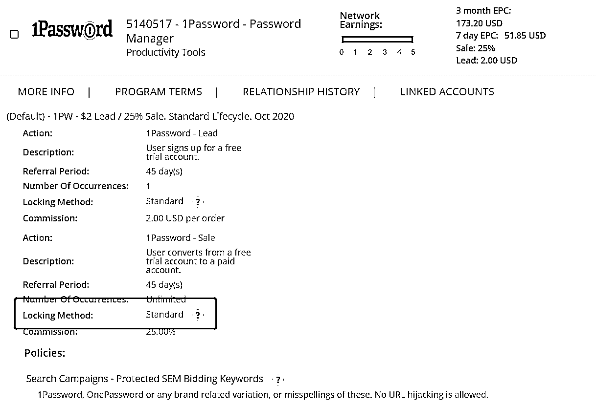

# 四 广告主

## 1 广告主推广条款

我们申请到广告主以后，就是要看一下广告主的推广条款，包括它的佣金是多少，转化方式是什么，允许和不允许的推广方式。

就比如1Password 这个广告主，它给的条款是，当有一个新用户通过你的推荐链接进来注册了一个免费的账号，会给你2美金的佣金，如果它后续付费了，则再给你付费额的25%。

（部分广告主会给出达量奖，为了鼓励你更多的推广它的offer，比如当你每月的佣金达到1000美金，会额外再给你500刀，诸如此类，也会在 Program Terms这个页面说明）

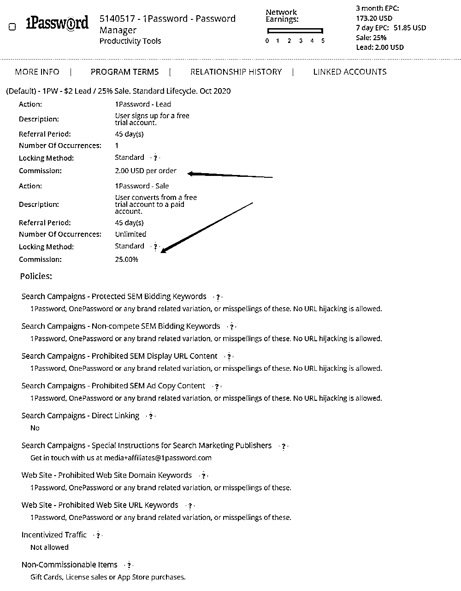

## 2 如何拿广告主的推广链接和素材

当我们被广告主批准以后，要如何拿推广链接呢？

选择你的广告主，点击getlinks，会进入广告主推广素材的集合页

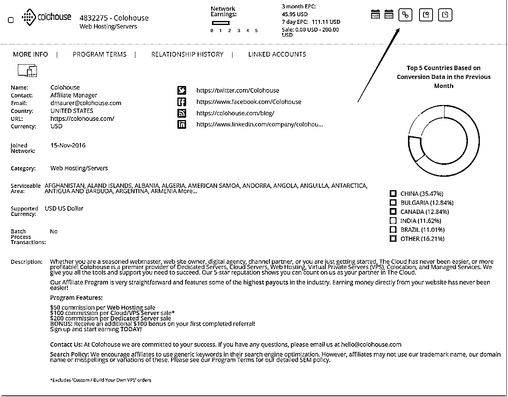

在这个页面，你可以看到广告主预设好的各种广告图和专属于你这个账号的推广链接。

你可以根据你想放置广告素材的位置选择相应大小的素材。

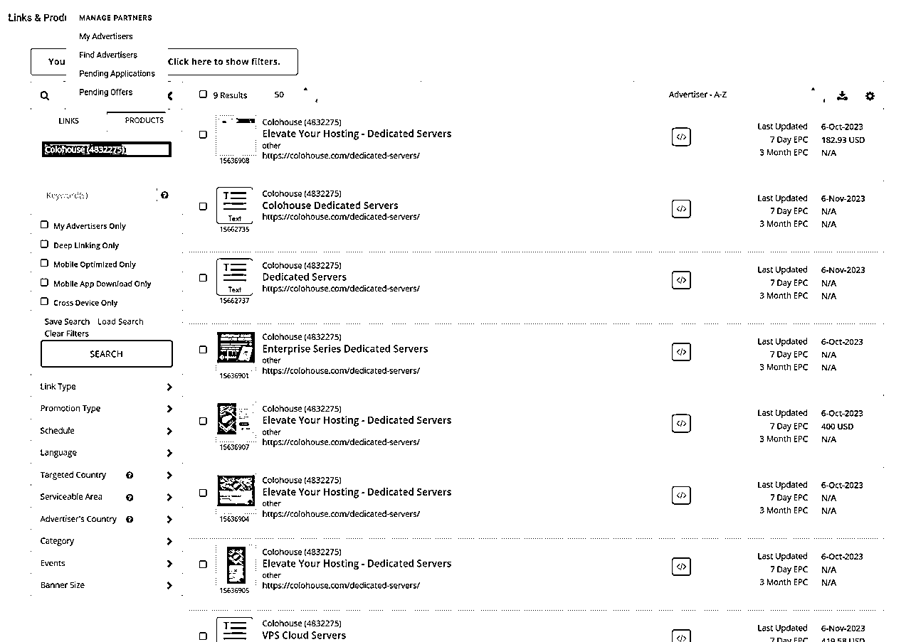

找到你想要的素材，点击右边的“<>”

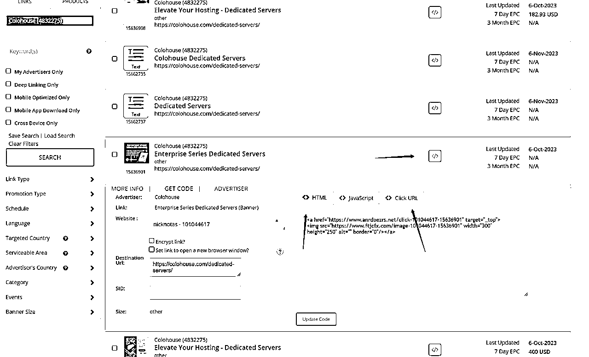

这里的click URL 就是专属于你这个账号的推荐链接，所有通过此链接进入广告主的转化动作，佣金都将记录在你的这个cj账号里。

## 3 Deeplink 工具

广告主在cj给的推荐链接，基本都是跳转到主页或者他们某个推广页面的。

但是我们作为推广者，有些时候，是希望用户访问广告主的某个特定页面的，这样能减少用户的动作，让他们直入主题。

比如我推沃尔玛的affiliate link，用户通过搜索“吹风机”访问了我们的推荐链接以后到达沃尔玛主页，它还得自己去找“吹风机”，这样无形之中就会增加用户的跳出率。

如果我们要用户搜索“吹风机”点的affiliate推荐链接能直接到达沃尔玛的吹风机买卖页面该怎么办。

这里就要用到联盟提供的deeplink工具，这个工具可以给广告主的任何页面生成推荐链接，那么用户点击这个生成的新链接，跳转的就是你希望他到达的页面，同时还能记录你的推荐佣金。

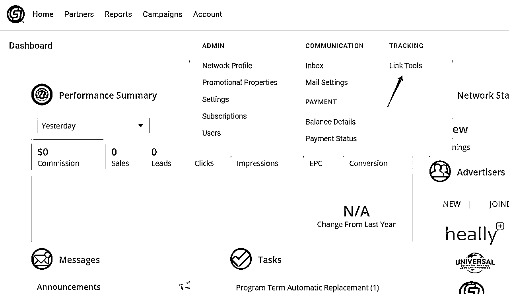

点击Link tools 就能看到cj的deeplink生成工具了，使用方式请看红框，把cj的deeplink 插件拖拽到你chrome的导航栏，然后访问广告主任何你想生成链接的页面，就可以生成推荐链接了。

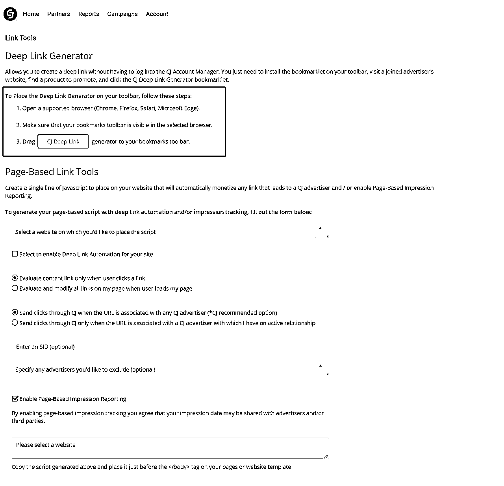

## 4 广告主佣金类型

给大家找几个比较典型的广告主。

### 1 fiverr

这是海外很有名的一个自由职业者平台，它在cj上给推广商的offer是，只要通过你带来的新用户，根据消费的不同类目，只要是第一次付款，哪怕只付款5美金，给15-150美金的佣金（看类目），同时，它还有达量奖，见红框。

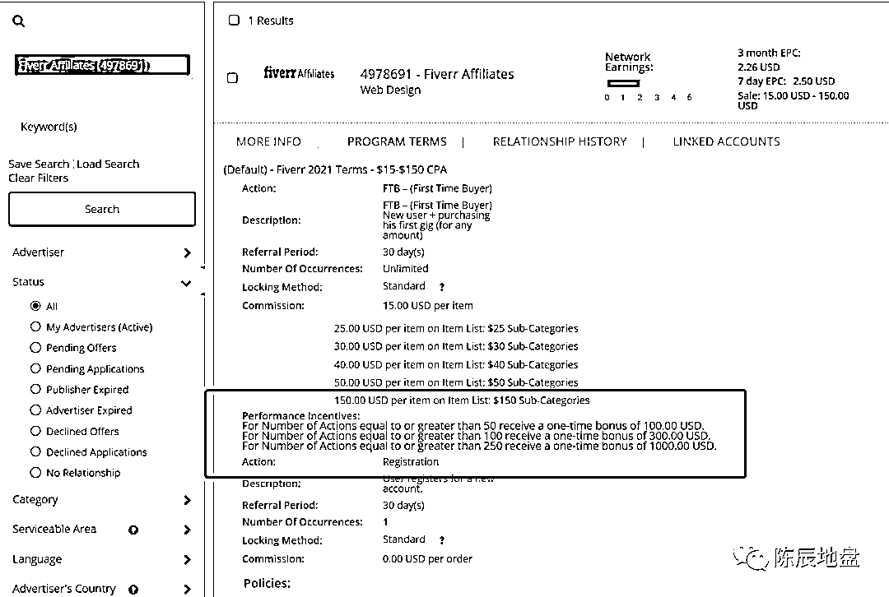

### 2 Getresponse

这是一家邮件服务提供商，一个付费用户给推广商100美金，它之前和icontact一样，有试用账户推广，一个试用给15美金。

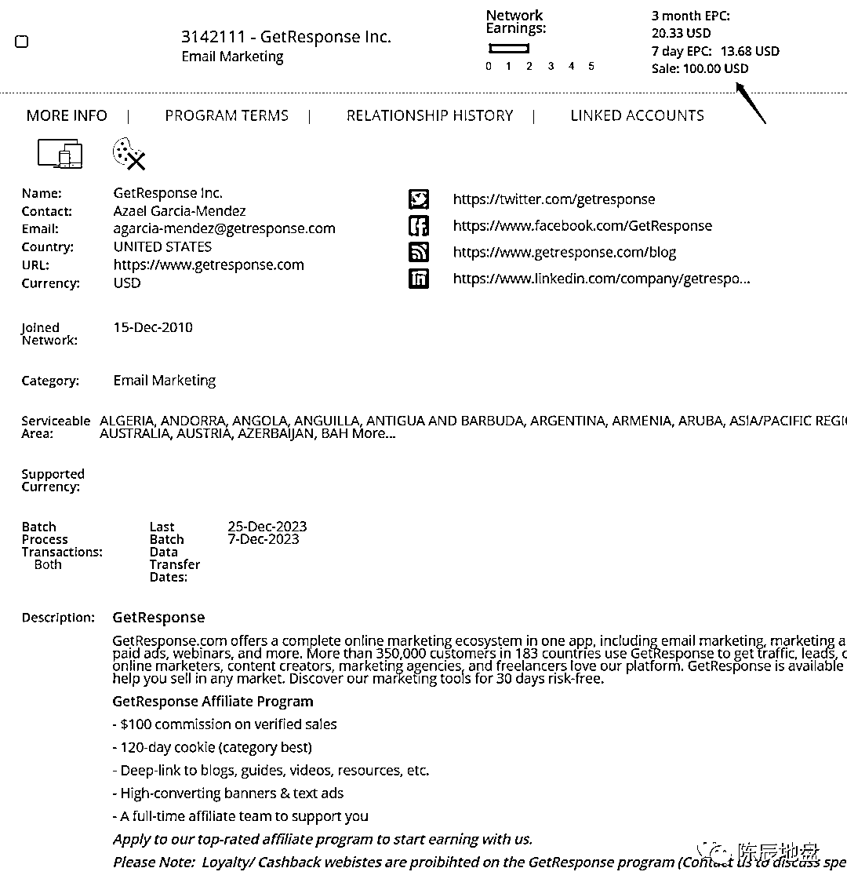

### 3 Barclays

银行offer，一个新用户开户成功给250-300美金的推广佣金，和国内一样，金融类的offer 佣金普遍比较高。

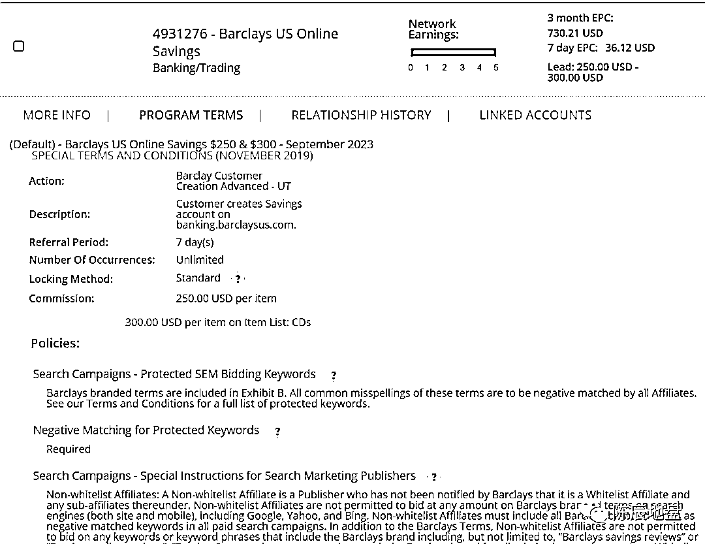

### 4 Choice Home Warranty

这是一家保险公司，在cj上的offer，是一个询盘给20美金，很典型的Cpl （ cost per lead )

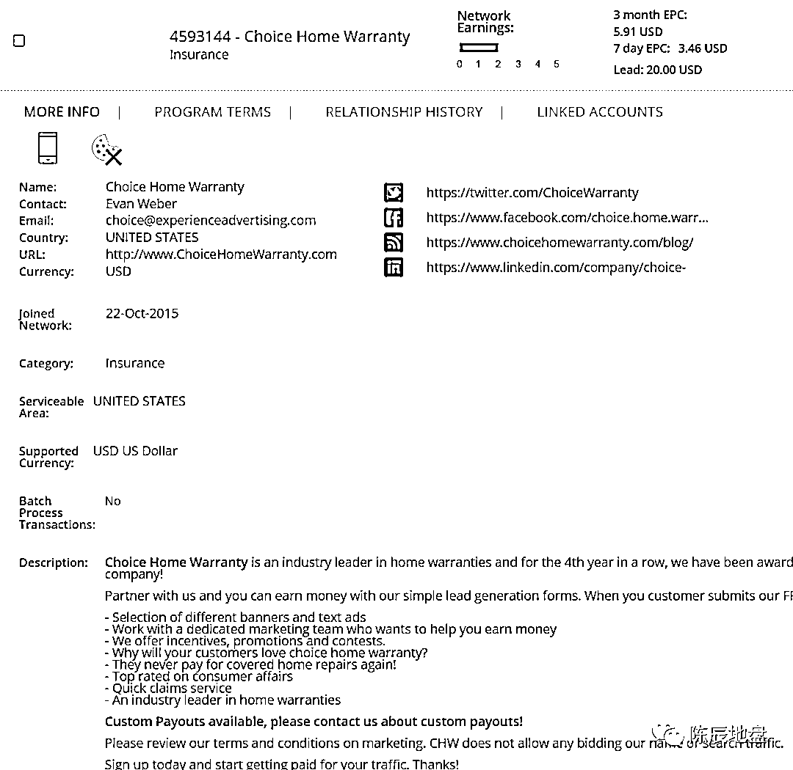

以上这些功能和注意点是大家基本都会用到的，cj的后台还有很多其他的功能，但是大部分其他功能是我们用不到的，就不赘述了。

如果大家还有什么问题，可以在评论区留言。

我是陈辰，一个职业的affiliate，如果大家对国外的互联网感兴趣，也欢迎和我链接，交流学习国外的流量玩法。