# 视频号农村夜晚治愈系怀旧短视频，从制作到变现一条龙复盘分享给你

> 来源：[https://o0yvn3o31a.feishu.cn/docx/JF6hdR8fhoYAGwx3aI5cAIm1nst](https://o0yvn3o31a.feishu.cn/docx/JF6hdR8fhoYAGwx3aI5cAIm1nst)

大家好，我是黄岛主！

今天给大家分享的是农村夜晚治愈系怀旧短视频赛道，这类赛道的短视频基本上被90、80、70后那波人看到，肯定会产生怀旧的感觉，虽然没什么特殊的画面，但搭配治愈系BGM之后，整个怀旧氛围就起来了，反正我是这样，我想下大家看完也是这样。当然，除了有夜晚的，也有白天的，这个制作视频的时候去自定义就行。

我简单的给大家看看视频案例：

看看账号数据情况，真的很热门：

评论也都很符合怀旧风格：

变现方面也很简单，我们主要通过视频号创作者分成计划去做变现，其他的短视频平台，例如抖音、快手，也是可以正常变现的，但我们今天以视频号平台做分享！

我先说下这个开通变现的方法，这个很简单，先发十个风景视频，然后持续发几天农村怀旧视频，就会正常开通收益，基本上没什么难的，开通之后，正常每天去更新视频，然后坐等收益。但是有点，最近掉广告掉的比较厉害，这个还得在观察。

素材获取，我说下，这个素材你可以自己去百度下搜集，可以多观察同行看看人家咋做的视频，然后去搜集素材。我这边反正是搜集了很多，都是自己搜集的，这个想要长期发展还得去做自己的素材库。我给大家看看我们做的素材库案例，都差不多这样的！

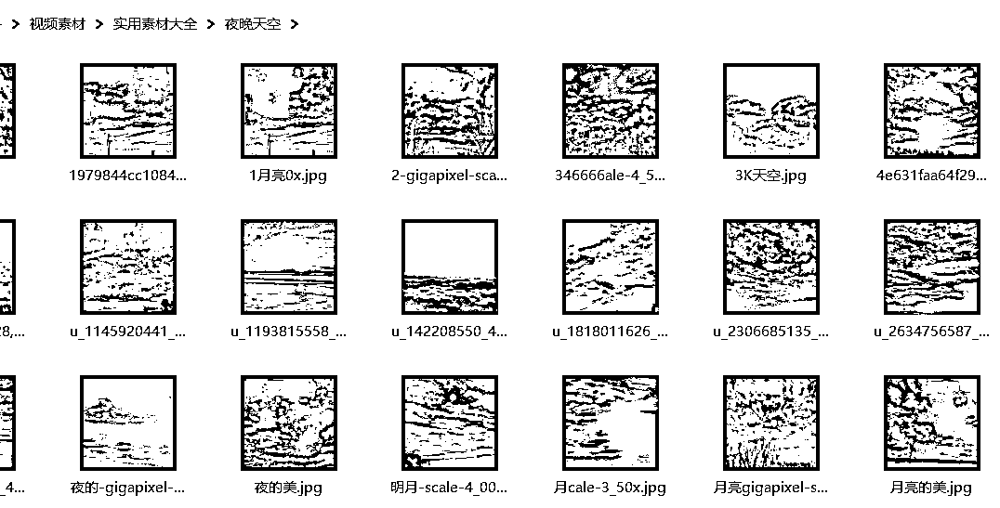

整体下来差不多这些元素素材：

好了，我详细的说下这类视频怎么去做，内容比较多，感兴趣可以看下去！

首先，我们要做软件安装，这个我们用的电脑端哈，手机端目前没法制作，因为有些功能手机上没法实现的！

1、先把ps、ae软件安装下

你在安装之前打开电脑设置，看系统是什么版本，WIN10版本就下载WIN10对应的版本，建议大家用WIN10系统的版本，会比较好用，电脑是WIN7、WIN8、WIN9系统的，就下载对应的软件就可以。

我们需要用到四款软件，AE、PS、colour Finesse、智能锐化插件，这个你可以自己去网上下载，也可以找我要都行，反正这个公开透明化的。

然后你要保证电脑内存剩余40G才可以，安装软件之前一定要先把杀毒软件、360关掉，退出卫士，用软件的时候一定要全部退出。

先装下AE：把需要用到的几个软件解压一下，解压的工具是360压缩包，可以去应用商城里面搜索360压缩，下载一个就可以，解压完成之后先来打开ae，点击set安装一下，点击继续，位置可以更改一下，默认的是C盘，一定要安装到内存比较多的盘里面去，在里面新建一个文件夹，写上ae，方便后期找，点击确定保存到文件夹里就可以了，然后点击继续，安装完之后点击关闭。

装下PS，打开ps，同样点击set安装一下，同样把位置改一下，点击继续，尽量不要选择C盘，然后再点开MP4插件安装一下，点击中间的After，点击安装，完成之后返回再把锐化插件也安装一下。

点击，点击继续、同意，C盘就可以，点击完成，下一步，完成。

然后打开下边的安装简介方法，把汉化补丁复制出来，去C盘粘贴进去，打开文件位置，点击汉化补丁把给它复制粘贴到这个位置去，替换目标中的文件。

再安装color颜色插件，点击安装、下一步，四个软件都要安装，完成之后点开安装路径，复制下面的这个，点开C盘以后，把安装路径放在搜索框上面去，进入之后打开第一个完整界面汉化，点击复制，粘贴到里面去，点击替换。

再把第一个后面的这段文字复制一下，AE也安装好了，打开先把AE创建快捷方式，把AE图标拉到电脑桌面上，鼠标右键，点击属性，打开文件所在位置。

找到plug-ins，点开双击，点击第二个E开头的，在里面新建一个文件夹，把刚才复制的名字粘贴上去，然后打开，去找汉化软件在里的简易界面汉化复制，粘贴到刚才新建的文件夹里面就可以了。

全部弄完之后打开AE，软件刚开始用会有点慢，跟电脑内存有关系，打开之后点确定。

点击左上角编辑，清理所有内存，点击确定。

再点开编辑选项，点开常规，把启用主屏幕关掉

再点击下面的媒体和磁盘缓存，选择文件夹保存的缓存路径改一下，可以放到内存盘比较足的盘，在里面新建一个文件夹，输入ae缓存，就是缓存的文件，每五分钟会自动保存一下，如果电脑出现问题就找不到了。

把磁盘大小缓存更改一下，可以根据内存的大小去改，点击自动保存，保存间隔改成五分钟，就是五分钟会自动缓存，点击确定。

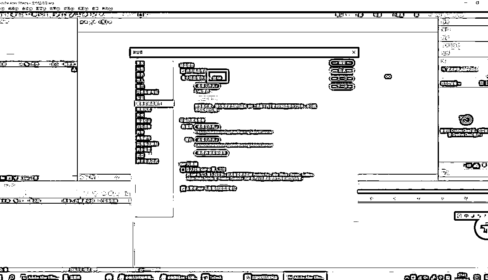

完之后点击左下角彩色录音机，点开之后把宽度改成1080，高度改成1920，持续时间改成七秒，不要制作太长的视频，太长视频完播率跟不上，点击确定。

点击空白的地方鼠标右键，点击新建纯色，先改红色试验一下，改完之后，点击左上角有效果，找到D开头，点击锐化，安装一下，点击继续，去打开刚才锐化的安装包，点开最下面的锐化插件，双击点开，点击安装方法和软件介绍，把名字这些东西都输进去，复制一下，一定要对应好粘贴，点击OK，锐化插件就安装好了。

再点击使用工具，找到应用颜色，点击视频软件找到滤镜，把需要用到的滤镜放进去，第一个是清晰滤镜，后边做视频的时候需要用什么滤镜，直接就从这里面添加就可以，导出点击文件、导出、添加到渲染队列，打开之后，把输出的模块无损点开，把格式改成第二个MP4格式，点击确定。

好了，软件安排完之后，开始准备做视频前的素材，这个很简单，按照步骤即可！

先教你Ps窗户、灯光教程的制作方法

教大家如何制作夜晚的窗户，更直接简单的把窗户的光做出来，效果更逼真，立体感更强，首先把我们需要制作窗户的房子图片拉到PS软件里面，拉进来之后需要复制一个图层，在新的图层上面制作窗户发光的样子，摁住CTRL+J键复制一个图层出来，把下面图层的眼睛关掉。

然后选中图层1，在图层1上面把窗户的轮廓勾选出来，先给它稍微放大一下，点击左边工具栏里的放大镜就可以放大缩小，或者鼠标右键也可以放大缩小，房子上面一共有三个窗户需要点亮，点击左边工具栏第三个，多边形套索工具。

左上角工具栏选择添加到选区，把三个需要制作发光的窗户框出来。

全部选中完之后，再把中间不需要发光的位置区域给它减选掉，点击左上角从选区中减去，把这个不需要发光的位置给它减选掉，一定要勾选虚线以外，再给它减选。

全部都选完之后，再复制一个图层出来，按住CTRL+J复制一个图层，然后按住CTRL+鼠标左键选中窗户图层2，接下来把窗户发光的颜色调一下，点击左下角的拾色器，打开之后选择跟光线差不多的颜色，黄色又有一点偏红的灯光颜色，然后点击确定。

之后点击上面工具栏编辑，找到填充，把内容改成前景色再点击确定，然后窗户就变成黄色颜，变成这个颜色之后。

需要把窗户制作成一种光线从上往下照下来的感觉，会更加的逼真，点击左边工具栏渐变工具，点击完之后把下面的拾色器调成白色在上面，黑色在下面，然后点击基础色，一定要选择中间的白色，选择径向渐变，然后把灯光从上往下稍微拉一点，微微的透一点光出来会显得更加逼真，中间的窗户可以从右往左打，营造一种光线从上往下照下来的感觉。

然后会发现颜色比较生硬，点击右边正常，有融合、正片，选择比较贴合实际的光线效果，颜色减弱、强光、亮光、线性光，这些都比较符合正常晚上的灯光，选择颜色减弱。

然后把下面的图层1，按住CTRL+J键，再复制一个图层出来，点击CTRL+鼠标左键选中，窗户就出来了，现在选中的是窗户，点击左上角工具栏选择，点击反选，把除了窗户以外的其他区域删掉，按住delete键删掉，删除完之后把最下面图层的眼睛关掉看一下效果，现在窗户的形状就出来了，点击右上角选择、取消选择，然后窗户就出现在房子上面。

然后把上面的图层2、图层3，按住shift键都选中以后，按住CTRL+E键，给它们俩合并到一起，这个新图层就是窗户的图层，图层双击给它改成一个名字，改成窗户灯光。

接下来把窗户的灯光图层调的更加清晰，点击左上角滤镜、锐化、进一步锐化，就更加的清楚，有的人可能会觉得窗户的光太红了，可以稍微调整一下，点击左上角图像、调整、色相饱和度，把饱和度稍微调低一点，明亮度也稍微调暗一点，点击确定。

接下来需要把房子抠出来，把房子旁边不需要用的东西抠掉，点击房子的图层，点击左边工具栏多边形套索工具，沿着房子的边缘把不需要用到的给它框进去删掉，沿着边缘抠，选中之后按住delete键删除，除了房子以外其他的地方就抠出来了，接下来保存，点击左上角文件，储存为PSD格式，给它取个名字，比如东北房子，保存确定。

房子做好之后打开ae软件，直接点击新建合成，合成一，点击确定，确定完之后先把需要用到的常用背景、月亮拖进去，点击鼠标右键变换，把月亮缩放一下2.0~2.5之间都可以，拖拽到合适的位置。

点击右边工具栏有效果和预设，里面搜索曲线，双击曲线，把亮度往左拉一点。

然后把做好的东北房子psd格式的直接拖拽到AE里面，在导入的时候一定要点击合成，不要选择其他两个，一定要选择合成，然后点击可编辑图层样式，点击确定。

放进来之后可以任意拖拽到适合的位置，或者放大、缩小都可以，然后把房子的颜色调一下！

房子调节一共需要六个步骤：

第一步、清晰滤镜，双击东北房子的图层，窗户的灯光图层是单独分开的，点击图层调整一下灯光颜色，点击左上角工具栏里效果，一定要在选择效果之前选中这个图层再去点击效果、使用工具、应用颜色、选中清晰滤镜。

第二步、爆款黑夜，再选择一个应用颜色，选择爆款黑夜，正常需要用到的就是这两个滤镜。

第三步、色相饱和度，地面颜色有点不太一样，稍微调整一下，在右边输入色相，双击色相饱和度，在左边就出现了调节，把颜色调一下，比如青色、红色、蓝色、洋红色都稍微拉低一点，看起来整个画面的质感就好多了，调节数据没有准确要求，根据自己的图片去选择。

第四步、高级调色，点击效果，选择S开头的，点击简易控制，往下滑找到HSL，点击全局，点击对比度中心调成0.49，增益和加码没有具体数值，根据自己的需求调节，一般调整到合适的值就可以。

第五步、亮度调节，点击右边搜索曲线，双击曲线，先把每一个点选择一下固定住，一个一个点选。把下面暗的地方稍微调亮一点。

第六步、锐化，点击效果，找到D开头，点击锐化，把锐化数量调到150，全部都调节完之后就变成晚上比较暗的感觉，再返回合成制作灯光打下来照在地面上反射的感觉。

选择上面钢笔工具，选中需要增亮的区域，选中之后右边曲线双击，往右拖一下，地面区域就变亮了，拉完之后边缘比较生硬，点击调整图层，点击蒙板，蒙版羽化拉到90、100就可以，然边缘就比较柔和。

灯光从窗户反射出来，地面上肯定会有黄色的光，在空白位置鼠标右键，新建纯色图层，选择类似灯光的颜色，点击确定。

用钢笔选中一个区域出来，把区域往下拉，先调整一下位置，把蒙版羽化调节一下，点开蒙版，拉到合适灯光的颜色，光太亮了可以把不透明度调低一点，不能太亮，灯光照出来不可能那么亮，有一点点就可以，很自然，这些就是关于灯光的教程。

总结一下：AE夜间视频调色：两种调节方法

第一种、高级调色

选中一个素材，第一个、点击效果、颜色校正、lumetri颜色，左边点击基本校正，色温20、曝光度-2、对比度40、高光-80.

第二个、点击效果、Digital、锐化(让图片变清晰)，锐化组数量150

第二种、滤镜调节

先选择房子图层，打开之后单独找到房子的图层调节

1、点击效果、实用工具、应用颜色LUT、选择清晰滤镜

2、点击效果、实用工具、应用颜色LUT、选择爆款黑夜

3、色相饱和度，右边工具栏效果和预设里面搜索色相，双击色相/饱和度，再左边通道控制里把蓝色、青色、红色、黄色的饱和度拉低一些，让视频看起来不是很暗、很亮。

4、高级调色，点击效果，synthetic、SA color，点击左侧工具栏的简易控制、往下拉找到HSL，对比度0.5，RGB增益稍微降一点，0.4-0.8左右，伽马也降一下(控制在1以内)根据视频的整体效果来。

5、亮度，点击右侧工具栏，搜索曲线，双击打开，会出现在左边工具栏了，先选中中间线上的四个点，然后在下面中间把亮度拉一点即可，

6、锐化清晰，点击效果、Digital、锐化(让图片变清晰)，锐化组数量130-150即可。

亮光反射设置：新建调整图层，钢笔工具，选中需要变亮的位置抠SA出来，右边工具栏效果和预设，搜索曲线，双击，在左边工具栏把最右边的白色线条往左拉一点，地面就变亮了，边缘很丑，点开调整提层下面的蒙版，把蒙版羽化拉高一些(建议90-110)。

好了，下面教大家怎么用一张图片制作比较简单的视频，带天空、云彩、背景，很有乡村夜晚的感觉

先打开ps，直接把需要做的房子图片拉进去，拉近之后我们会发现它的下面这里有一点蓝色的，往下拉一下盖住。

按住CTRL+J键新建图层，在新图层上面抠图，把下面图层的眼睛关掉，然后新建一个图层，颜色调成比较醒目的绿色，方便抠图的时候看的更清晰，点击左边工具栏里的油漆桶工具，放到图层上填充成绿色。

点击最上面的图层，把房子抠出来，点击左边工具栏多边形套索工具，先把房子给它放大，然后沿着边缘扣，抠的时候一定要仔细一点，慢慢抠，电线杆不要的话就把抠出去，把不需要用到的范围选取出来，框出来按住delete键删除，然后选择取消选择，然后再继续抠。

抠出来之后会发现房子整体有点高，因为做图片需要三分构图，天空一份、房子一份，地面一份，现在房子有一点偏高，我们稍微的给它往下压一压，选择这个图层，点击箭头，按住shift键，往下稍微压一下，房子就好看多了。

现在上面空出来了，需要修补上去，点击多边形套索工具把电电线杆选出来，先把电线杆补上，按住图层，点击CTRL+J复制一层出来，选择这个图层，按住shift键，把它拉高一点，稍微放大一下，然后用橡皮擦工具把边缘擦掉就可以了。

后再把电线杆也拉高，点击图层，然后多边形套索工具勾选出来，同样的复制一层CTRL+J，选中这个图层，按住shift键把它拉高，稍微放大一点就可以了，电线杆和柱子就放上去了，放上去之后把这两个图层合并一下，按住shift键选中这两个图层CTRL+E合并。

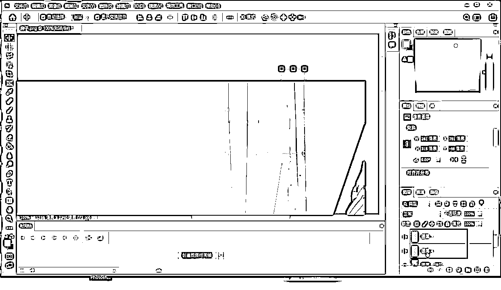

调完之后下一步把房子修补一下，里面比较脏乱的、多余的修一下，点击左边工具栏，找到盖章工具、仿制图章工具，按住alt键+鼠标左键选中区域，松开按住鼠标左键进行修补，修复之前一定要选中这个图层，全部都给它修补一下，黑色盖起来，就稍微完美一些，也不用修补的太狠，老房子有一些斑驳很正常，简单修一修就可以。

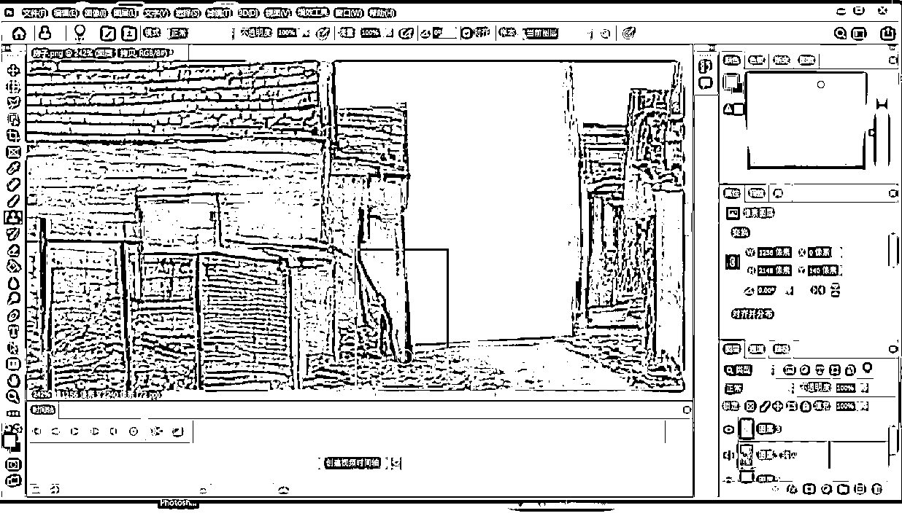

房子修补好之后接下来要把窗户点亮：

首先把需要做窗户的位置框出来，这个之前我已经讲过了，再来复述一下：点击多边形套索工具，把窗户轮廓大概给做出来，做出来之后新建一个图层，把新图层前景色调节成黄色灯光的感觉，点击油漆桶工具填充成黄色，再给它调节一下灯光，点击渐变工具，点击左边第二个，从上往下给它拉一点光出来，左边这个也给它透一点光，显得更自然。

正常里面选择灯光效果，颜色减淡、叠加效果都很好看，再复制一层出来，点击图层，复制图层，要把窗户给它做出来。

选择图层，点击左上角工具栏选择、反选，就是选择除了窗户以外其他的区域，选择之后点击delete键删除，窗户就是单独的图层，选中上面的图层，按着shift键选中两个图层，CTRL+E键合并，窗户图层就做好了，鼠标右键重命名窗户，下面的图层就是房子。

做好之后下面两个图层不需要，可以删掉，然后把房子保存一下，点击左上角文件、存储为、存储为PSD格式，然后给它起个名字，整体的房子，保存确定。

接下来把制作好的完整的房子PSD的图片拉进去，导入种类一定要点击合成，窗户和房子才能分开调整，点击可编辑图层、确定，然后点击鼠标右键、变换、复合宽度。

接下来添加其他的素材进去，星星放进去，只需要用到这颗星星，把它勾出来，点击钢笔工具，把星星圈出来，点击左上角效果、抠像、线性颜色键，因为是纯色的，所以选择线性颜色键就可以，点击吸取天空的颜色，添加星星旁边背景的颜色，星星就扣出来了，把它拖拽到月亮旁边的位置。

星星扣完之后接下来再添加一棵树，直接拖进去，把树也抠出来，点击效果、抠像、颜色范围，上边的笔先吸取去掉的颜色，下面带加号的笔吸取颜色，还有一点白色的，ctri+D粘贴一个出来，先点击重置，再吸取白色，颜色比较多的话可以吸两个颜色，天蓝色、白色，然后把树放到合适的位置，拖拽到房子的后面。

拖拽之前先要把树周边多余的裁剪掉，给他抠一下，点击大树数，双击打开，点击钢笔工具，扣完之后返回图层，把它拖拽到合适的位置，缩小一下放在房子的图层后面，然后把图层拉到房子后面去，树就被房子挡在后面。

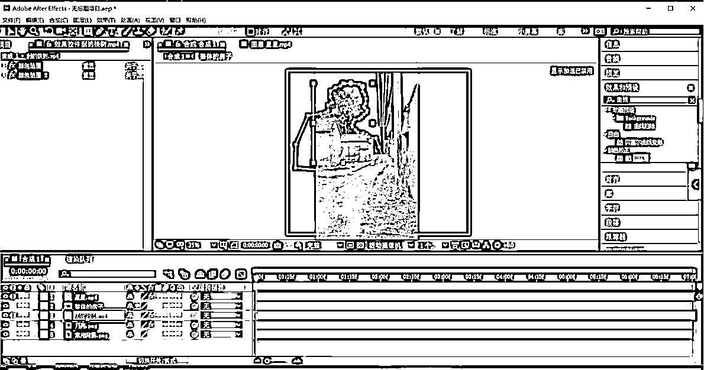

接下来再给房子整体构造调一下，在房子的尽头修补一个小山，或者是其他东西进去，把图片拉进去，拉到房子的后面，一条小路延伸出去的即视感，把小路也抠一下，点击效果、抠像、颜色范围，小路就扣出来了，路有点亮，把亮度调节一下，点击右边曲线，调暗一点，调到跟路融合在一起。

还可以放上云朵，去找天空的素材，拉进来之后点击鼠标右键、变换、适合复合宽度，拉大把云朵调到树和小路的后面，月亮放到合适的位置，天空太亮的话也可以稍微的调暗一点符合夜晚状态。

调完之后接下来需要做晚上的效果，首先打开要调整的房子，窗户不需要调，只需要调节房子，点开房子图层，夜晚灯光调节一共分为六步，上节课也讲过了。

第一步、点击效果、使用工具、应用颜色、清晰滤镜。

第二步、点击效果、使用工具、应用颜色、爆款黑夜。

第三步、色相，双击色相和饱和度，点击主控制通道，把青色、红色、黄色、蓝色、洋红色，都稍微的拉低一点，数值没有具体要求，根据图片去调就可以。

第四步、加高级调色，点击效果、S开头的，点击s，点击简易控制、往下拉找到这个HSL、点击全局，把对比度调到0.49，增益稍微拉低一点，然后把高光降低一下，边缘就没有那么亮。

再调节一下亮度，点击曲线、双击曲线，把四个点选中，亮度稍微拉一下，调亮一点。

第六步、锐化，点击效果、D开头、锐化，数量写到150，更加清晰，然后把这些数据选中按住shift键选中，再按住CTRL+C复制，然后打开合成，把效果依次添加到其他图层上去，先打开树，空白地方粘贴进去。

每个图层都粘贴进去，然后把带有音乐的全部关掉，把背景音乐添加进去，把箭头拉到后面，一定要拉到全部都对齐，要不然音乐没播放完，画面就没有了。

调完之后再来调一下地面光线，月亮照下来的光，点击鼠标右键新建调整图层，把地面的位置用钢笔抠出来，然后点击右边曲线，拉亮一点，这样看起来就更加好看，月亮照在路上的感觉。

接下来再做窗户打出来的光影效果，新建调整图层，把窗户投射下来的光区域选中，把它点亮，稍微拉一点就可以，然后打开蒙版羽化拉一下，拉到100左右，边缘就更加的柔和。

现在窗户倒映下来的是黄色的光线，我们这个是白色的，再给它新建一个纯色图层，找到跟光线差不多的颜色，点击确定，用钢笔工具抠出来一部分，点击箭头，把它拉到合适的位置，有一点点这种光就可以，然后打开图层，把蒙板调一下，同样拉到100左右，看起来就是黄色的光，把不透明度也稍微降低一些，看起来就更加自然。

全部都调完之后还可以再房子上添加烟囱，把烟囱放进来，拖到上面去，太亮了要稍微调一下，如果觉得下面不是很柔和的话，可以点击钢笔工具，把它的边缘抠出来，点击蒙版羽化，把边缘优化一下，这样就更加贴切，把光线调一下，点击曲线，拉低一点，因为夜晚烟囱没有那么亮，符合晚上的烟囱效果。

然后再把烟雾放上去，点击效果、抠像、线性颜色键，吸取，给他拉到烟囱上面去，缩小一点，把烟雾图层拉到烟囱后面，刮的方向要和树一致，风的方向是往左边刮的，要给它变换一下位置，水平翻转一下，如果觉得太亮的话，也一样点击曲线稍微拉低一些，晚上烟雾没有那么亮。

全部都调完之后作品就做好了，把烟雾音量关掉，只留下背景音乐，点击全部，播放缓存一下，然后给它导出，添加到渲染队列，点击无损，格式改成MP4，点击确定，把名字改一下放到桌面上去，然后点击保存渲染。

来，下面教大家运动跟踪视频的方法

运动视频怎么做，如何让图片动起来的视频？

先把影子、倒影插件安装一下，首先把需要用到的两个压缩包下载到电脑上，中文汉化和倒影软件，先解压一下，解压完成之后先安装倒影，双击倒影，选中，复制之后点AE鼠标右键，打开文件所在位置，找到Plug-ins这个文件双击打开，点击第二个eff开头的，双击打开，在空白的地方点击粘贴就可以。

再安装影子插件，就是中文汉化，双击打开之后点击安装前必看，把注册码复制一下，复制完之后点击第二个VFX，里面最下面的安装，双击安装一下，点击同意、继续，把其他的关掉，只留Shandow，就是影子的英文，继续、改变，右上角三个杠，点击倒数第二个进入，把刚才复制的注册码粘贴进去，点击改变。

下面来操作一下运动视频怎么制作，先打开ae，跟踪运动是按照视频去跟踪的，需要导入要跟踪运动的视频素材，分辨率大小要一样，不能把1080*1920的视频做成720*600的视频，跟踪是不成立的，就拿原视频去跟踪。

比如今天要跟踪的原视频是这个，直接导入进去，拉进来之后可以点击鼠标右键、变换、适合宽度调整一下，就直接恢复到原位，就是怎么把一张图片做成运动的视频效果，有素材的话当然最好，边走动边拍的素材随处都可以拍得到，但我们在没有时间拍摄的情况下就要用一张图片把它做成运动的视频。

把需要用到的素材拉进去，背景、路面，直接鼠标右键、变换、调整复合宽度，先把路面调整一下，把路面的不透明度拉低一点，稍微往下压一下，天空一份、路面占一部分，给它放在合适的位置，调整完之后再把路面的不透明度拉回来。

接下来要做的是把后边背景天空抠出来，点击效果、抠像、颜色范围，吸取天空的颜色，提取完之后可以看到上面有一条白色的线，我们要把它去掉，再点击钢笔工具，把需要用到的位置勾出来，白色的线就没有了。

调完之后下一步再给它添加天空进去，跟踪图层先把不透明度拉低，后期跟踪运动的时候再用它，前期的先不要，添加一个天空进来，鼠标右键、变换、适合符合宽度，拉到上面，把天空拉到大路后边，调整一下位置。

天空有点亮，把亮度降低一下，点击效果、声道、转换通道，把亮度选择一下，天空就稍微变暗一些，相对来说比较好看。

接下来再添加月亮上去，把月亮拉进来，直接鼠标右键、变换、缩放一下，一般2.0~2.3都可以，给它放到合适位置，有点暗，把亮度调一下，在右边工具栏里效果和预设里面输入曲线、双击曲线，把亮度往右边拉亮一点，月亮就变亮，也不要太亮，晚上的月光没有那么亮。

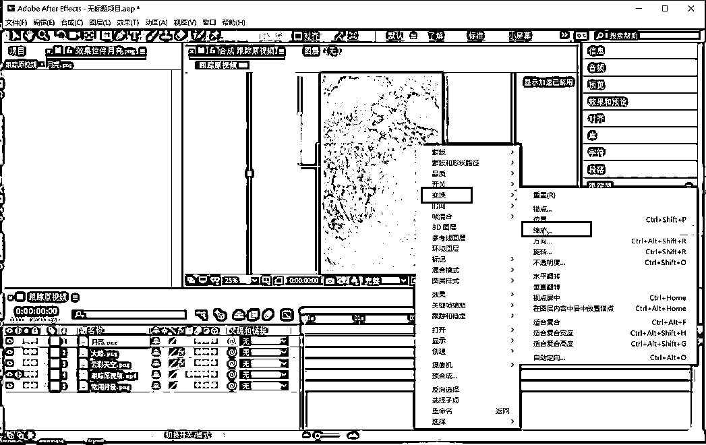

然后再添加星星进去，用钢笔工具把星星抠出来，点击效果、抠像线、性颜色键，吸取天空颜色，月亮的背景就没有了，然后拖拽到月亮旁边。

接下来还可以添加一棵树在上面，再把树拉进来，先把树后面的背景抠掉，点击效果、抠、颜色范围，吸取颜色比较多的，如果是纯色的话就点击线性颜色键，如果是两个以上颜色的话就点击颜色范围，然后把树抠一下，点击钢笔工具，沿着边缘去抠，扣出来之后缩小拉到合适位置。

调完之后接下来添加房子，先去PS里面把需要放上去的房子抠出来，把窗户点亮，点亮完之后导出再放到ae里面，打开ps直接把房子拉进来抠一下窗户，窗户上节课已经告诉大家怎么抠了，这里就简单的说一下就可以，点击多边形套索工具，把窗户轮廓勾出来，点击多选，再点击减选，把中间不需要点亮的减选出来。

全部都弄好之后新建一个图层，在图层上面选择光线的颜色，黄色偏红色，点击油漆桶填充一下，填充完之后把前景色调成白色，选择渐变工具，一定要选择上面中间的这个，往下拉一下，有光照下来的感觉，我们右边工具栏正常，选择光线颜色，远处的光没有那么亮，就选择差值。

图层点击选择反选，按住delete键删除，图层就是窗户，下面的就是房子，做好之后点击左上角文件，存储为PSD格式，点击保存、确定。

打开ae，把做好的发光房子拖进去，点击导入种类合成，缩小一下调到合适位置，把它抠一下，多余的抠掉，点击钢笔工具，沿着边缘抠出来，把它拉到合适位置，房子前面没有路，要把房子前面的路放一个上去。

然后添加房子前面的小路，先找到需要的小路素材，拉到AE里面，鼠标右键变换、缩放，把需要用的小路部分抠出来，点击钢笔工具，扣完之后缩放一下调整到合适位置，小路可以变换位置，水平翻转都可以，然后把边缘蒙板羽化一下，拉到100左右，看起来就更加柔和，在远处一条小路，整体的房子构造大概就做好了。

接下来我们去调整整体颜色，因为是晚上，晚上需要把整体颜色调一下，先调节这段路，点击效果、颜色校正、L开头的颜色，点击基本校正，曝光度拉低一点，就有晚上的即视感，对比度也适当拉一下，高光适当的调低一点，色温往右是越来越黄，往左是越来越蓝，冷色调、暖色调，稍微的拉暖色调出来。

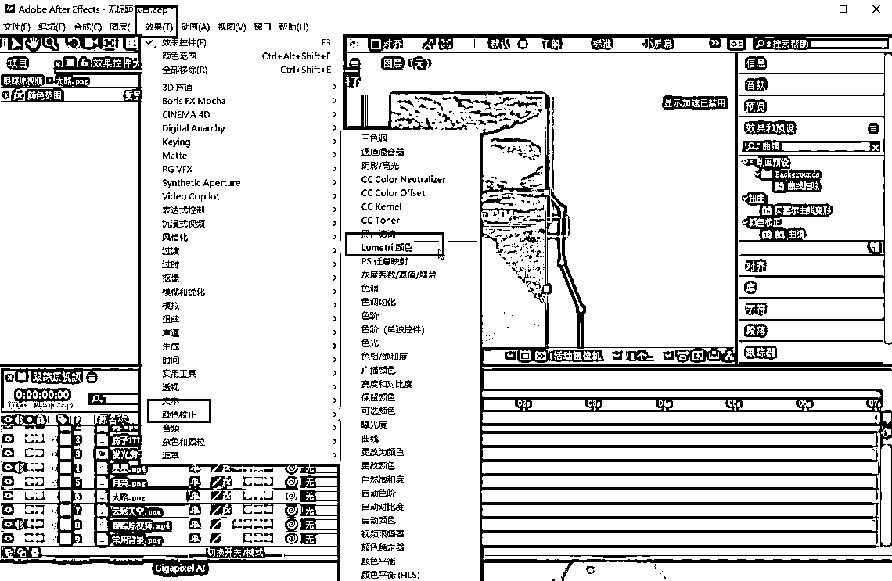

接下来调节一下锐化，先选中这个图层，点击效果、锐化、D开头的，点击锐化，把数量拉到150更加清晰，调完之后把两个数值按中shift选中，CTRL+C键复制，然后粘贴到其他的图层上去，大树、天空都要粘贴，天空显得有点灰暗，可以再来整体的去调节一下，曝光度适当的拉回来一点，对比度、高光也适当的拉回来一点。

点开房子图层，选择房子，CTRL+V粘贴，把房子的颜色也调一下，整体色彩就调好了，调完之后还需要再补一个路面上月亮照下来的光效果，点击大路，鼠标右键新建调整图层，点击钢笔工具，给它抠出一部分需要做月亮发光的图层，点击右边曲线双击，稍微的拉亮一点，不需要太多，然后把它的蒙版点开，羽化值拉到100左右，就是月亮照下来地面发光的效果。

如果有想添加其他素材的话，也可以添加，比如可以在稻田里面放一个小人，或者在路边放自行车都可以，根据自己的构思去放一些东西，怎么好看怎么来，全部都调整完之后，接下来要做跟踪视频，先把这几个图层选中合并一下，除了跟踪点视频和常用背景，把其他图层选中，按住CTRL+shift+C键合并到一起，改成预合成。

接下来去调整晃动效果，点击跟踪原视频，拉到上面去。预合成的音量关掉，只留跟踪原视频的声音，点击鼠标右键、跟踪和稳定、跟踪运动，把跟踪点往下拉，选择比较醒目的绿色，点击右边工具栏的编辑目标图层，预合成、确定，把光标拉到左边，画面上下不一样，点开它，点击变换位置，调一下拉到开头，然后把位置稍微拉大一点，视频的晃动效果就做出来了。

晃动完之后接下来要做视频运动效果，点开预合成，点击缩放，拉到第一针，再给它拉到最后一针，把缩放位置稍微调大一点，一百二左右就可以，大家在预览的时候一定要点击完整，等预览完之后就可以导出。

树的影子直接选择图层点击效果、RG VFX、shodow就是影子，在导出之前一定要把跟踪原视频的小眼睛关掉，关掉之后再导出，点击左上角文件，导出添加到渲染队列，点击无损，格式改成MP4格式、确定，把输出位置给改一下，保存，点击渲染就可以了。

继续看下，教大家制作夜晚水边人家

制作一种水边夜晚人家视频，视频组成就是房子、小狗、人在河边洗东西、水、台阶、树、夜晚天空等这些素材组合到一起，在视频操作之前需要去构思一下，就视频里面要放什么样的素材。

先把房子抠出来，把窗户点亮，在前面的课程讲了好几次，这里就不做详细说了，房子扣好，窗户做好之后打开ae，直接点击新建合成、确定。先把常用背景拉进来，把做好的房子拖进去，导入种类一定要选择合成，点击确定，点击鼠标右键、变换、复合宽度，把房子房子想放的位置，左边、右边都可以，还可以水平翻转，再添加一些其他的东西进去，根据自己的想法去放素材。

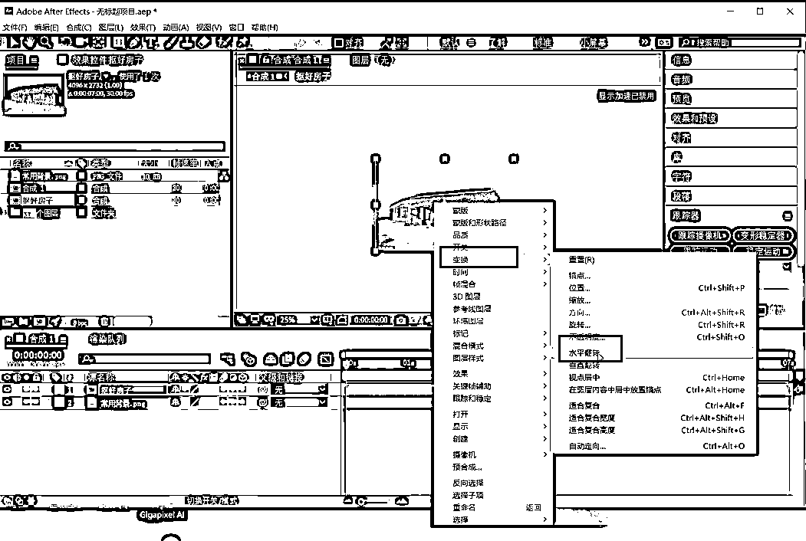

然后我们把水的素材拉进去，鼠标右键、变换、适合符合宽度，素材库里面有很多水的素材都可以用，如果有其他颜色的话可以把他抠出来，鼠标右键、变换、适合复合宽度，把上面的黑色抠掉，点击效果、抠像、线性颜色键，纯色的比较好抠，把它放在合适的位置，可以适当缩小一点。

再放一个河边的台阶，直接把素材拉进来，素材都是从其他图片里面提前扣好的，每一个素材拉进来之后都要鼠标右键、变换、复合宽度，从图片里面把需要用到的部分抠出来，点击钢笔工具，沿着边缘抠出来，点击箭头，把蒙版羽化值拉到100左右，这样边缘看起来就更加柔和，河边小溪的感觉。

接下来去制作房子，房子前面添加路面，用钢笔工具把图片里面需要用到的部分抠出来，把蒙版羽化拉到100左右，房子放到合适的位置。

接下来给房子添加一些元素，后面加背景天空，把天空拖进去，图层拉到房子后面，调整一下天空大小，偏左或者偏右都可以，图片中有月亮就不需要单独加了，再加一个小人在后面山上除草，要抠一下，点击效果、抠像、颜色键，吸取就直接抠出来了，纯色的比较好抠，把除草人拉到房子后面，一定要是以房子为主体，远处没有那么高，适当的缩小一下。

再把树拉进来抠一下，点击效果、抠像、线性颜色键，颜色键吸取树就抠出来了，抠出来之后把它缩小拖到合适的位置，可以拖在房子的后面。

门前还可以给它添加小动物进去，小猫、小狗都可以，给大家添加一个小狗，点击效果、抠像、线性颜色键，小狗就扣完了，给它缩小放在门前，小狗不会太大。

然后在河边再给放一个老太太洗菜进去，同样先抠一下，线形颜色键吸取，把老太太放到河边去洗菜，大小一定要合适，不要太大，也不要太小，调完之后再来看一下画面还缺什么，可以适当的添加进去。

再给房子添加烟囱、烟雾上去，点击效果、抠像、颜色范围，把烟雾缩小，调整方向，拉到烟囱上面，树和烟雾方向要一致，把烟雾图层拉到烟囱后面，把音效都关掉.

接下来需要调节夜晚的效果，先选择一个图层去调节，先把河边调了，点击效果、实用工具、应用颜色，找到清晰滤镜，再点击效果、实用工具、应用颜色、爆款黑夜，就变成晚上的效果。

再点击效果、锐化、拉到150，一共是六步调节。

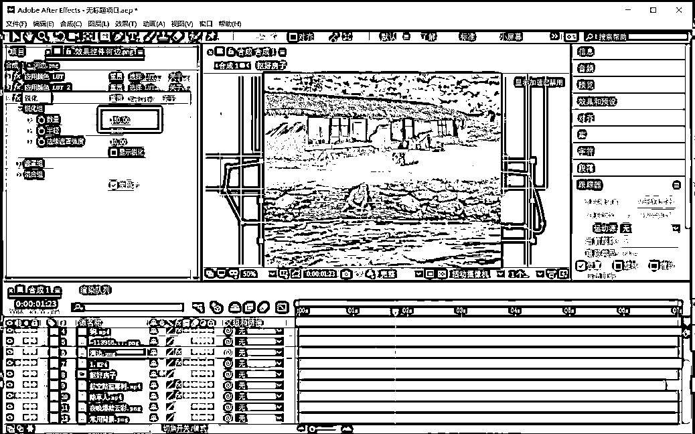

下一步点击右边工具栏、效果和预设、搜索色相，双击把通道控制打开，视频有蓝色的光，把蓝色打开，饱和度降低，往左是变淡，往右是越来越蓝，蓝色的亮度适当降低，黄色没有可以不用调，红色调少一点，青色也稍微降一下，洋红色稍微降低一点点就可以。

第五步、点击效果，SY开头的是高级调色，点击简易控制，往下滑打开HSL里面的全局，对比度调到0.5，伽马、增益稍微拉高一点，往左是越来越黑，往右是越来越亮，晚上稍微降低一些，亮度，可以根据自己的需求调，饱和度基本上不需要动。

还有一步是调节视频亮度，右边搜索曲线、双键曲线，把几个点固定住，把下面提亮一点，不要太亮，因为晚上没有那么亮。

调好之后鼠标按住shift键全部都选中，CTRL+C键复制，复完以后粘到其他图层上，烟雾不需要调，烟囱可以粘贴一个进去，太暗了就把曲线亮度值调高一些，再把小狗图层也粘贴上效果，觉得小狗太暗的话也可以把小狗亮度添加一下，能看出来一点效果就可以。

把洗菜老太太图层也粘贴上效果，前面的路、除草人、树都要粘贴，天空可以放也可以不放，天空本身比较暗，就可以不放，或者放进去，只留锐化清晰度，其他的删掉就可以。

数值根据自己的需求和观感去调节，然后再调节房子，双击打开，点击房子的图层粘贴进去，房子的旁边的这个高光可以稍微调一下。点击这个。然后把他的。高光。给它稍微调一下。给它稍微的减弱一些，后期操作的时候，可以根据自己的经验值去做，不是固定的。

点开水的图层粘贴上去，但是水不需要调那么暗，可以把爆款黑夜删掉就可以了，其他的留住，然后把水面的亮度细节挨个去调。

接下来把窗户门前的地面点亮，窗户透下来的光，选择房子图层，在空白地方鼠标右键，点击新建、纯色图层，选择跟灯光差不多的颜色图层，点击确定，然后用钢笔工具抠一部分出来，往下拉拖拽到合适位置，调整大小，把蒙板羽化调到100 左右，再把不透明度调低一点，看起来就是有微微的光，灯光晚上照出来不是特别亮。

调完之后接下再添加背景音乐，给大家准备好了，也可以自己去找爆款的同行音乐都可以，直接把音乐拉进去，把其他图层带声音的关掉就可以，然后从左往右来渲染一下，渲染之前一定要把对标对好，要卡在最后一针，一定要对齐调到一起，然后按空格键播放加载，全部加载完再导出，一定要等它全部加载完再导出。

视频画面大家一定要有一个构思，想放什么素材进去合成到一起，想放什么就放什么就可以了，一定要全部加载完再选导出，点击左上角文件、导出、添加到渲染队列、点击无损、格式MP4、确定，输出位置选一下就可以了。

下面讲解下摄像机跟踪的方法：

3D摄像机跟踪的教程，不管是人物、花草树木都可以跟踪，打开ae，点击新建合成，宽度、高度、帧速率、像素长宽比都不要动，持续时间视频七秒，为什么是七秒，如果视频太长完播率跟不上，会影响账号的推荐和播放，1080*1920也是抖音默认的尺寸，发视频号也是可以的，我们要做的视频是往前运动的视频，所以不需要调大、调小、左右晃动，点击确定。

先把需要用到的原素材拖进来，跟踪的原视频，视频可以自己拍摄，苹果手机拍摄分辨率会比较高，因为苹果手机很多都是4K的分辨率，不能直接把分辨率太高的视频拉到ae里，会卡顿，需要先放到剪映里剪辑出来七秒，导出的时候把分辨率给调成1080P、帧率60，导出来视频再拉到ae里面操作。

先来把视频名称改一下，比如改成实体，把跟踪点找出来，点击实体，鼠标右键、跟踪稳定、跟踪摄像机，把高级里面的详细分析打开，这样跟踪出来的点会更加的准确，然后让他去分析。

继续把需要用到的素材拉进去，比如在视频上面添加天空、一棵树，把名字都改一下，方便知道是哪一个，把天空往下拉，天空最后去调，先调节树，把树拉到实体上面放到合适位置，选中树缩小一下，比如放在路的尽头，现在看这棵树是不动的，接下来要让这颗树跟着视频一起运动。

实体分析完之后点击渲染跟踪点，视频上就出来很多跟踪的小点，在树的旁边找一个点，让树跟踪红色的点去运动，选中这个点，鼠标右键、创建实体和摄像机，选择跟踪实体的图层，把鼠标放上去，点击鼠标右键、变换、缩放，把宽度和高度拉大，拉到3000。

拉到和树差不多大小，点开跟踪实体，打开箭头，点击变换，把它的位置按住CTRL+C复制一下，复制完之后点开这棵树的图层，先把右边的3D打开，点开树的位置，把在实体上复制的位置粘贴进去，再点击缩放，把树拉大，把跟踪实体的眼睛关掉，树稍微拉大一点，然把这棵树放到需要或者自己想放的位置，然后调节大小。

然后播放一下看看树有没有跟着视频动，树的树根位置看起来很突兀，没有跟旁边的花草放在一起，需要把它扎在这个土里面，复制一层实体出来，把树根的地方盖起来，选中实体图层，CTRL+D复制一层，然后把实体2拉到树的上面去，树不见，点击钢笔工具，沿着刚才树的边缘出来，点击实体2的蒙板，蒙版羽化拉达100左右，看起来树根就像扎在土里面，更加的柔和。

然后现在这棵树已经跟踪了实体视频运动，接下来还需要让天空也跟着它，先把天空抠出来，选中天空图层，点击效果，把实体的渲染跟踪点去掉。

点击实体，效果、抠像、颜色范围吸取一下，边缘还有一点发蓝色的光，点击右边工具栏效果和预设，搜索色相，双击色相饱和度，把主通道里的蓝色饱和度降低，亮度也拉低，边缘蓝色就不见了。

接下来就要让天空也跟着实体视频运动，先调一下颜色，点击实体，点击效果、颜色校正、Lumeti颜色，点击基本校正，把色温调稍微黄一点，天空颜色有一点黄，要把花草树木和地面的颜色调到和天空色温一样，调到30左右，有一点点黄，往左是偏蓝，往右是黄，黄色是暖色系，把曝光度降低，降到负二，中间的白色先不管它，等会儿直接调完把它复制粘贴进去就可以，对比度可以适当调大一点，加到30左右就可以，阴影拉低一点，拉到负十左右，再添加锐化，让画面看起来更加清晰，点击效果、D开头的、锐化，把锐化数量值拉到140。

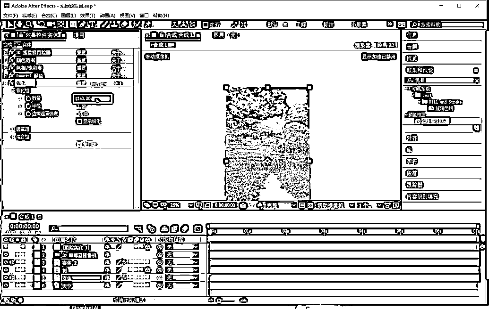

然后选中调的两个图层，按住shift键，选中两个CTRL+C复制出来，给它粘贴到其他图层上，在实体2、树上粘贴一下，如果觉得树太暗的话可以把树的曝光度往回拉一拉，画面颜色基本上调好之后，把几个图层合并到一起，再去单独调天空，选中这几个图层合并到一起，按住键盘上ctrl+shift+C键合并成预合成1图层，点击确定。

合成完之后点击预合成图层，把音量关掉，不需要用它的音乐，点击变换、位置，按住键盘上的上下键，往下稍微移一移，一定要符合三分构图，天空是一份，树木是一份，地面是一份。再给它适当的往下拖一下，一定要按住键盘上的下键去压，然后再把天空的位置稍微的往上拉一拉，点击天空、变换、位置，把天空往上提一提，这样就更加好看。

然后要让天空跟着视频去运动，上面选取一个白色的小点，让天空跟着它去动，放大一下，找个附近有白色的小点，点击预合成图层，鼠标右键、跟踪和稳定、跟踪运动，来找到需要跟踪的点，把它拖到需要跟踪的小点上，选择一个，跟踪完之后，把外面范围缩小一下，先把光标拉到最开头，一定要点击向前分析，加载完之后再进行下一步操作。

要让天空跟着选中的白色点去运动，等加载完之后再操作，跟踪完之后什么都不要动，直接点击编辑目标，选择天空图层，点击确定，点击应用X轴和Y轴、确定，把鼠标光标挪动到最开始，天空和画面有点错位，点开天空图层、选择位置，把天空拖动到合适位置，把缩放稍微拉大一点，不要让边缘有空白的地方就可以。

一定要检查上下左右有没有空白的地方，现在天空、树都跟着视频在运动，由远及近的感觉，再把天空颜色调一下，选中天空图层，点击左上角效果、颜色校正，L开头颜色，点击基本校正，把色温调一下，看一下调到哪个位置比较好看，阴影稍微降低一点。

调好之后需要在地面上做出月亮反照出来的光，点击空白图层，鼠标右键新建、调整图层，用钢笔工具在地面上抠一部分，右边效果和预览里搜索曲线，双击曲线，把抠出来的位置稍微提亮一下，不稍微亮一点点就可以，点开调整图层的倒三角，点击蒙版，羽化拉到100左右，这样看起来地面就有月亮照下来发亮的感觉。

再添加背景音乐进去，去背景库里面去找爆款的音乐放进去就可以了，然后点击完整，加载完渲染出来就可以导出，渲染完之后一定要把模板保存一下，要不然再打开的时候就找不着了，点击左上角文件、保存，保存完之后点击文件、导出添加到渲染队列、输出模块点击无损，把格式调成MP4，其他的不用动，点击确定，名字改一下，点击保存、渲染。

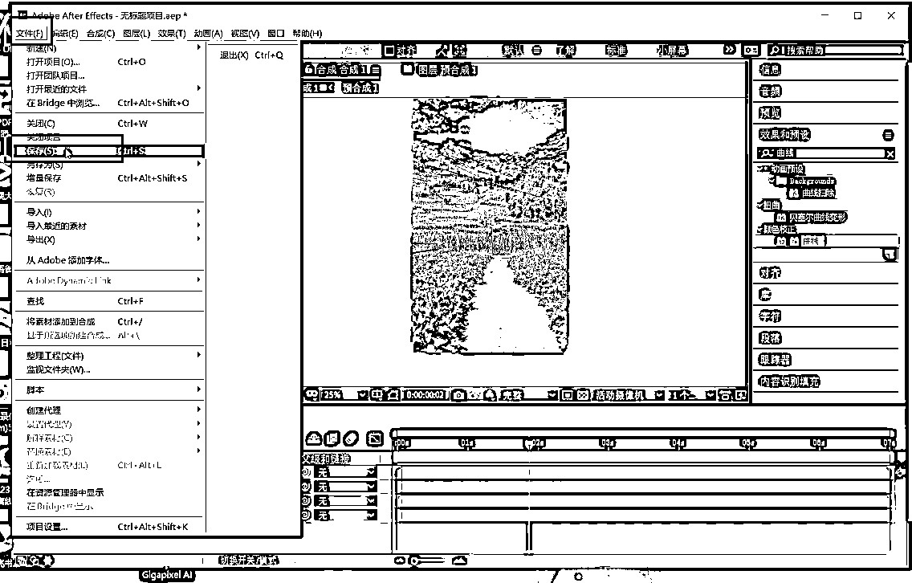

导出来，就是我们文章最开始看到的效果了，然后发布视频就行了，具体的我们可以参考对标，然后用AI改同行的爆款文案，完了直接发就行了。

差不多就到这里，有问题我们在沟通交流！