# 用免费红包封面实现爆流1w+，一天内私域导流500+

> 来源：[https://k874t2qh8w.feishu.cn/docx/JKfHdLzgvouSpLxHsOJc4zaVn9e](https://k874t2qh8w.feishu.cn/docx/JKfHdLzgvouSpLxHsOJc4zaVn9e)

大家好，我是辰风。

这几天公众号平台给很多公众号博主赠送了免费的红包封面数额，少则6000，多则1.8w。

红包封面每年都是一股热潮，入场人数极多，关注度很大，微信指数也是水涨船高。

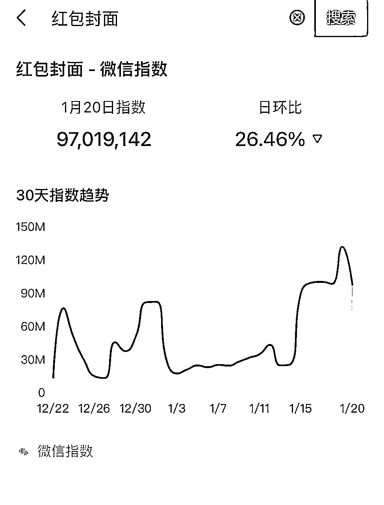

以往很多人都不会玩这个红包，封面放在那里都浪费了，一个是不知道怎么过审，一个是不知道用来发怎么玩。

如果可以借着这个赠送的红包封面去做一波获客的引流，或者是做一波新关注用户，我觉得是一个非常好的操作。

这是其中一个号的加好友数据。（来一点小小的视觉震撼，当然，和流量大佬比算不上什么）

目前的这一套打法用我们验证出来的标题和文案。（下文会介绍）

只要红包封面不是特别丑，基本都能跑出几千，甚至是上万的曝光，可以给思域导流几十甚至是百人。

而最终的变现方式就是卖红包封面项目，收19块9赚个小钱，还有卖红包封面小店，成交想买红包封面的用户，再比如卖副业兼职广告，卖课程广告等等。

先看一下数据实战结果，

账号A

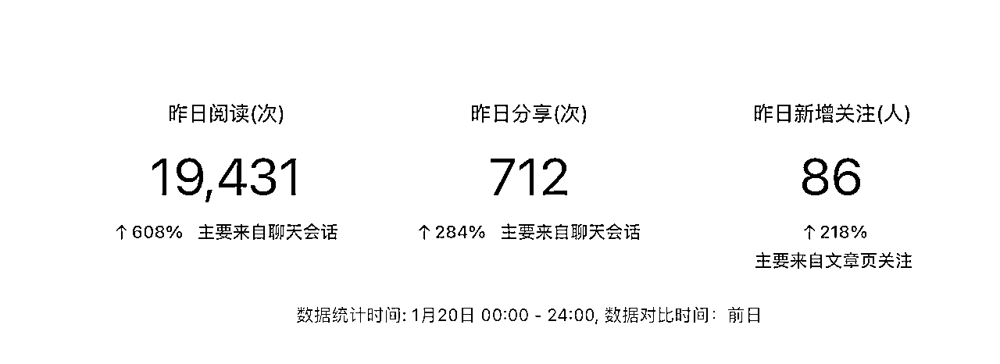

账号B

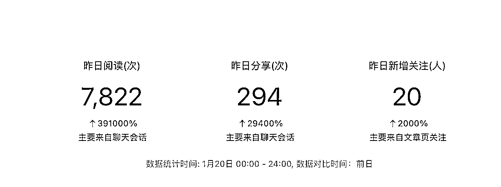

阅读数据

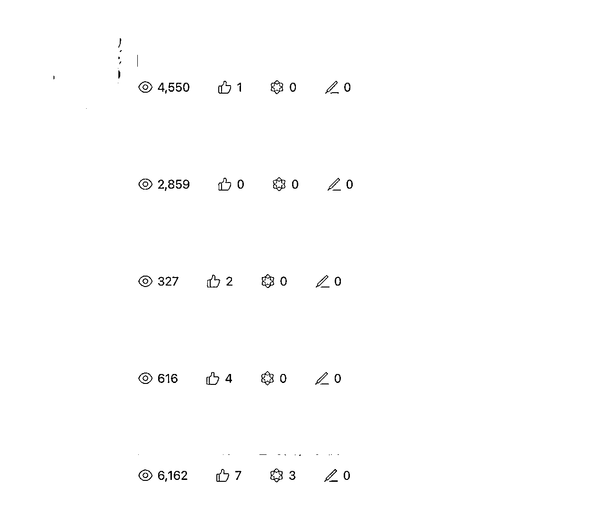

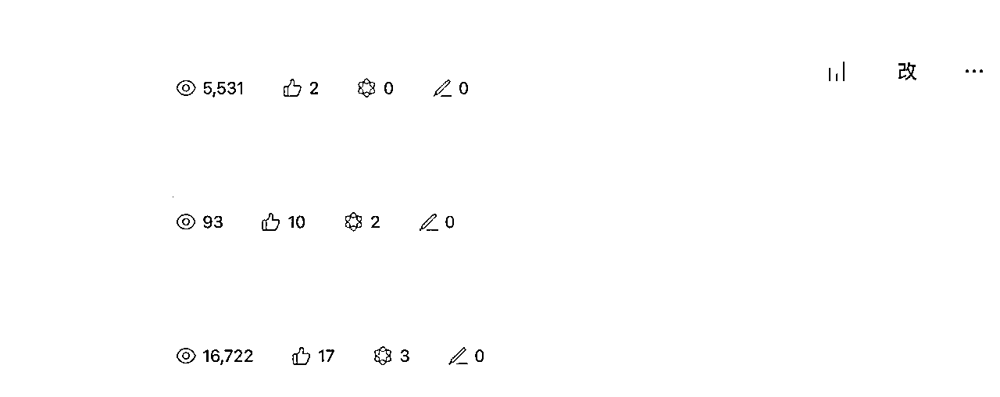

# 红包封面开放平台注册

首先，你要收到微信公众平台送的免费红包封面。

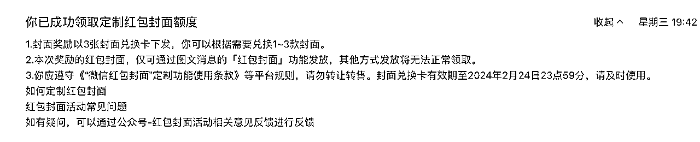

入口在微信公众号的通知年报里。

如果平台没送红包封面，就是没有。

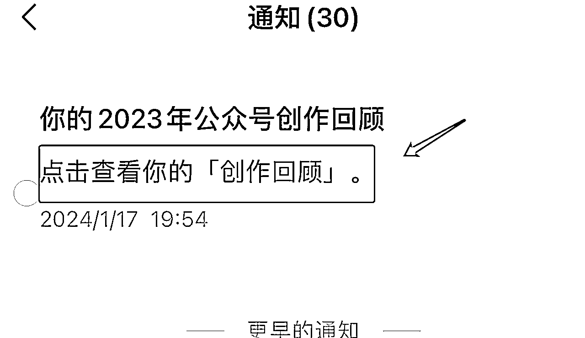

## 完成注册

在微信红包封面开放平台中点击注册。

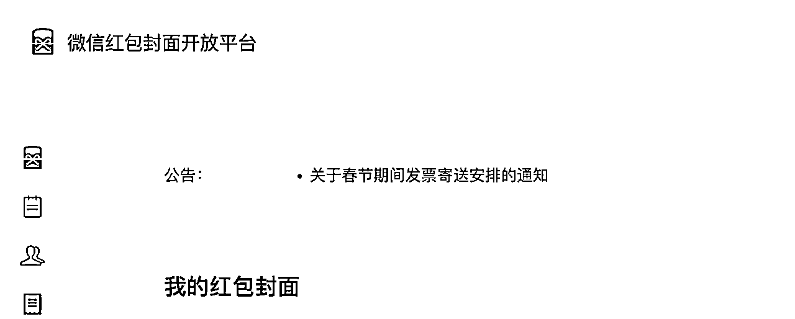

## 个人认证

进入页面后选择个人认证。

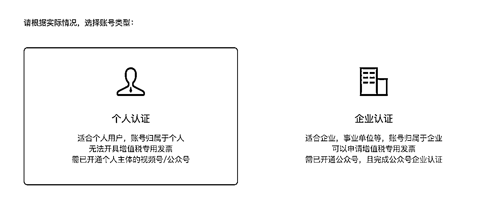

*   选择个人认证的方式。

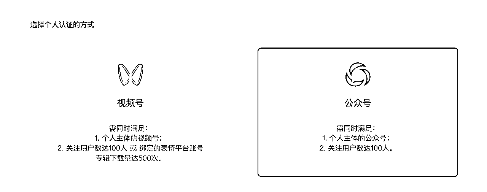

*   进入页面输入邮箱地址。

注意：没有注册过的才行，公众号绑定的邮箱不可以

可以登录网易邮箱，直接使用手机号注册，要多少有多少，很快，接验证码就好（也可以要朋友的邮箱地址，最重要绑定的是微信）

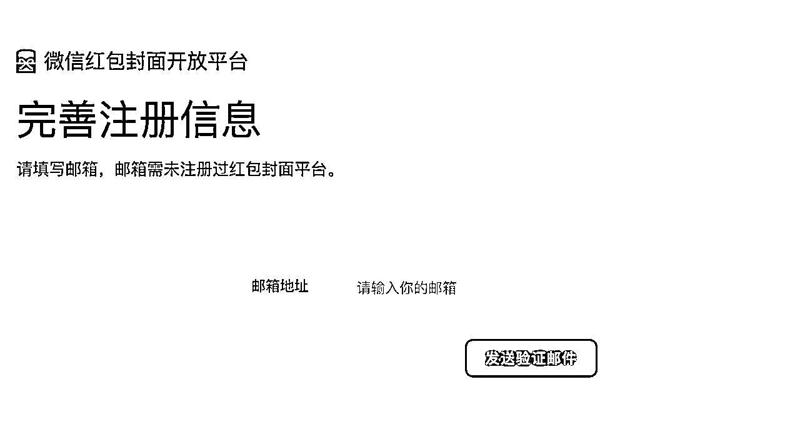

*   打开邮箱，点击链接完成扫码认证。

## 扫码认证

公众号关注100人以上，

完成了实名认证。

可以用收到了红包封面资格的公众号进行绑定（必须是公众号的主体管理员身份）

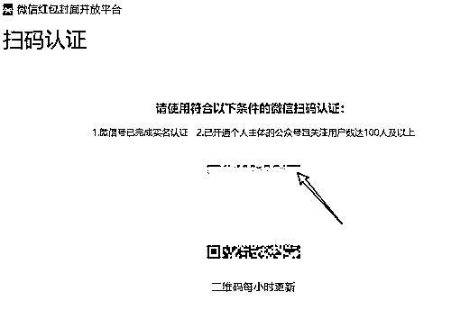

# 红包封面制作要求sop

ai网站：

https://ai.midjourney9.com/?channel=1517719

提示词：

## 封面要求

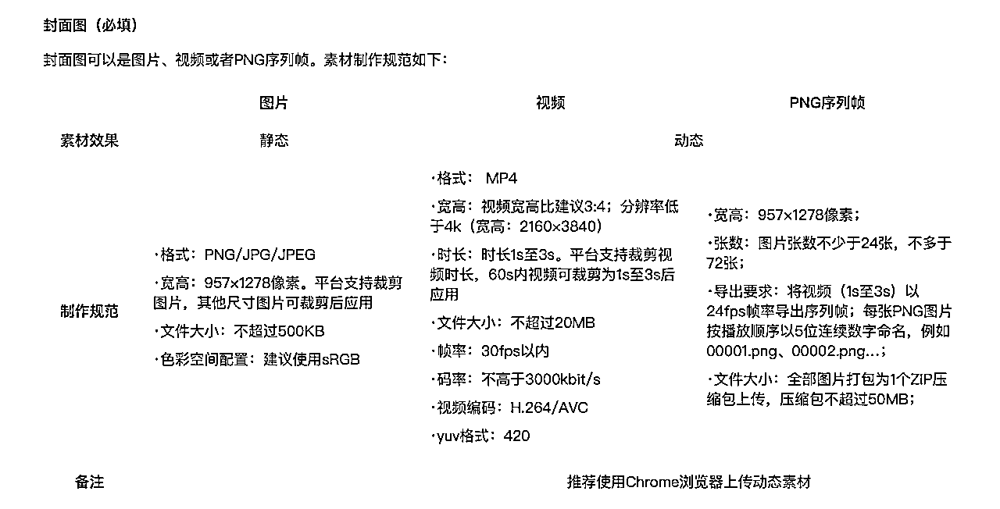

制作封面特别简单，封面要求在网站上都有写。

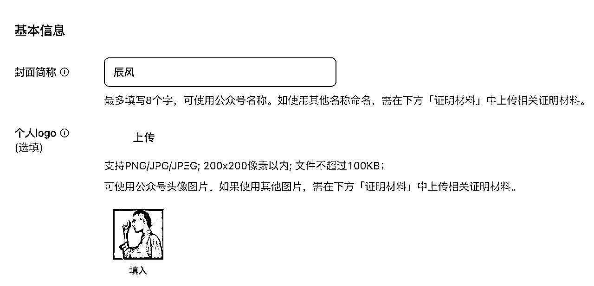

直接填写简称，还有个人的logo。 logo可以放，可以不放。（放的话就要提交证明）

可以在这个内容当中放你的品牌故事，直接使用视频号的视频或者进行视频上传，前提是你的视频号已经发过视频或者你的本地视频跟这个尺寸相匹配。

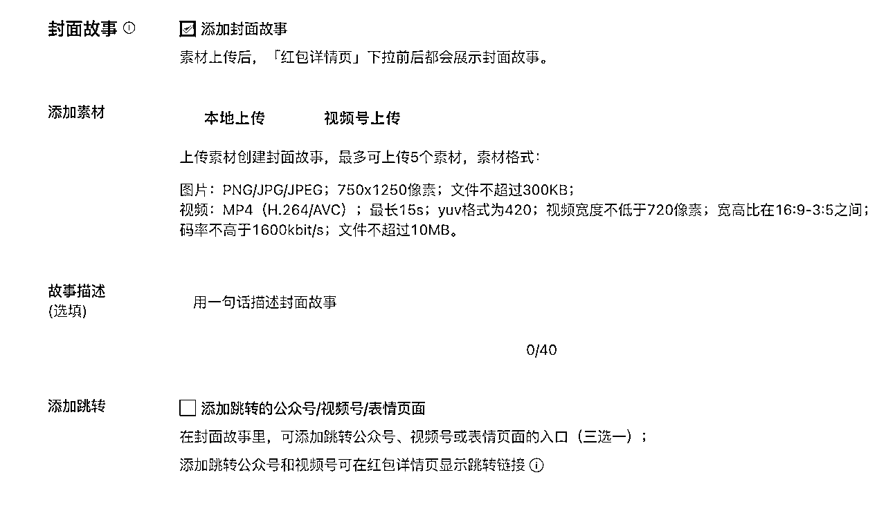

视频的大小是一个很重要的问题，一定要符合他的这个标准，你不然太大了，你放不进去的，你可以使用小丸工具箱进行压缩，但是要注意清晰度的问题，背景音乐的话，过审是一个问题。

你可以使用微信的视频号，然后用手机拍视频，放背景音乐，也可以在制作的过程当中选择BGM搜索，因为这些都是微信平台审核过的视频。

然后你要编辑视频，可以使用秒剪APP或者剪映APP添加热门音乐，然后通过压缩传到手机，再用手机端的视频号进行发布，选择音乐。

## 封面选择

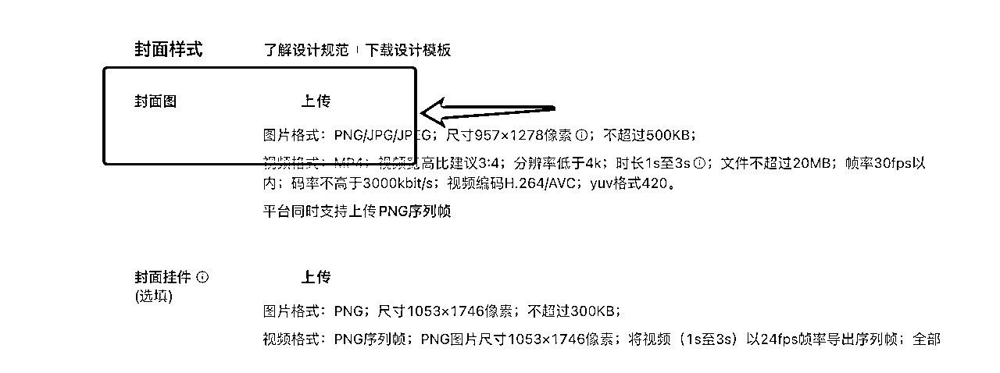

这里是必须上传的，其他的都是非必要。具体平台规则中都有介绍。

可以自己手绘，提交证明即可：制作过程录屏，制作图片的psd。

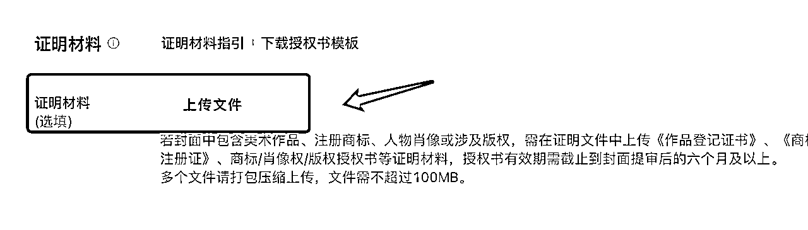

ai绘图也可以，提交提示词截图和制作过程截图，然后把几张图打包成一个压缩包，上传证明即可。

最好的方式可以直接使用平板的procreate自己画一个，然后注意一下尺寸和比例就行，

然后上传到你的微信红包封面的开放平台或者使用AI工具生成红包封面

## 封面发放

首先发放封面，要设置多人领取（唯一方式），链接领取，然后关闭裂变。

如果没有发放完或者想终止，可以进行回收处理。

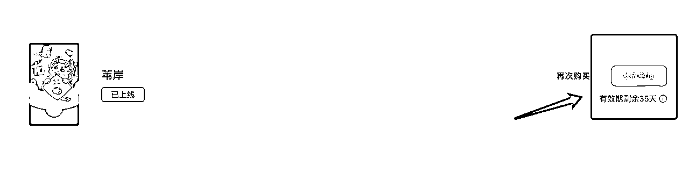

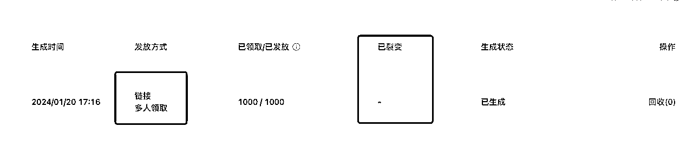

# 红包封面引流玩法

## 公众号页面发放

这一次的红包封面玩法跟往常有所不同，他设定了只能在特定的公众号内进行，以插入红包封面的形式发放。

也就是说你只能用自己的公众号，用自己的红包封面平台，来做成推文的形式，把红包封面插入来实现。

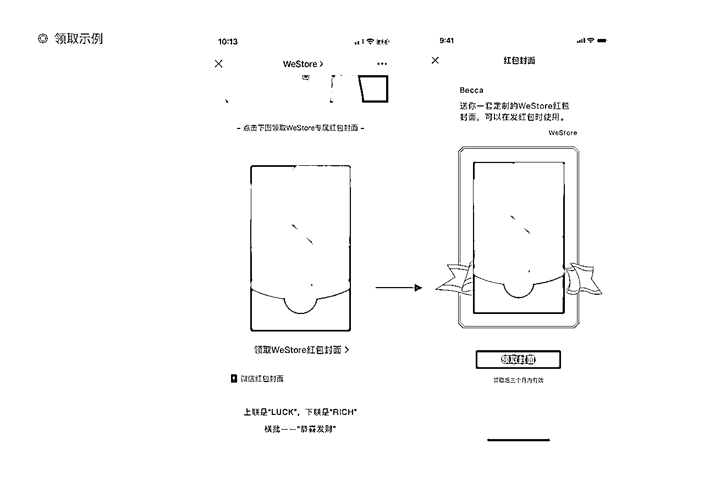

首先你需要在功能处添加开通微信红包封面的功能插件，然后进入推文页，编辑插入红包封面的插件。

1.开通红包封面插件

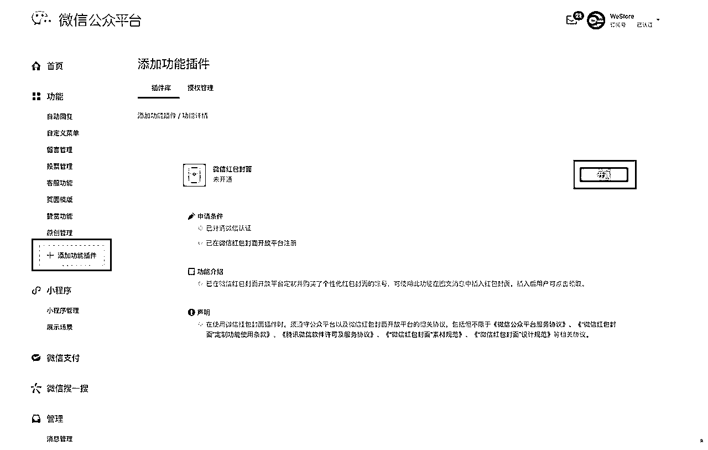

2.新建一篇素材，插入红包封面

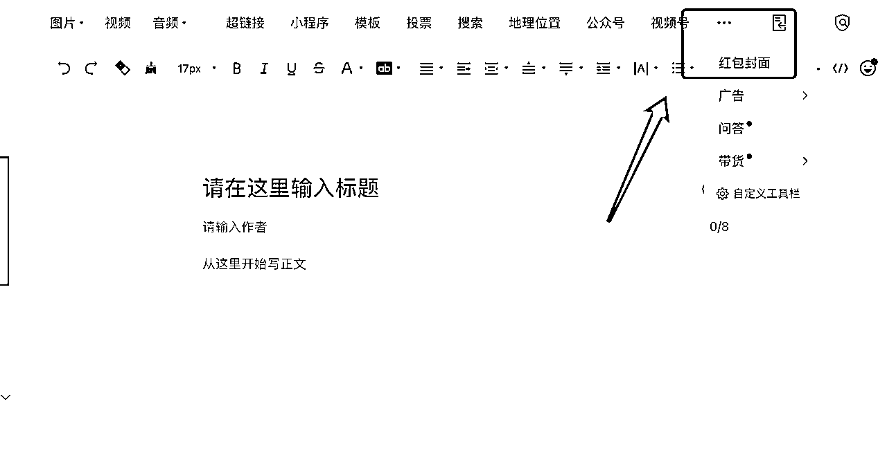

以上步骤，都是讲操作，接下来的步骤讲实战。

微信红包封面赠送的名额非常的多，怎么样有效的利用，把它的红包封面数额最大化，并且做私域的导流或者加公众号关注，这个步骤至关重要。

## 受众是谁

目前来看，红包封面的受众主要以未成年和学生为主。

因为红包封面更多的传播是通过社交传播而非公众号的推流传播，可能推流传播也会有，但是它没有那么快，我们都是发文几分钟甚至十多分钟就马上开始传播的，然后迅速登顶几千甚至上万阅读。

所以我断定它这种传播方式是通过社交来进行裂变的，也就是那些大量存在的红包封面的羊毛党。

## 如何引流

前面放红包封面，后面可以留你的个人微信，以让他们领取其他封面作为钩子，来引导加个人微信。

也可以挂个人公众号，来进行公众号曝光和导流（依然是红包封面的钩子）

除此之外，当然也可以使用其他的钩子。

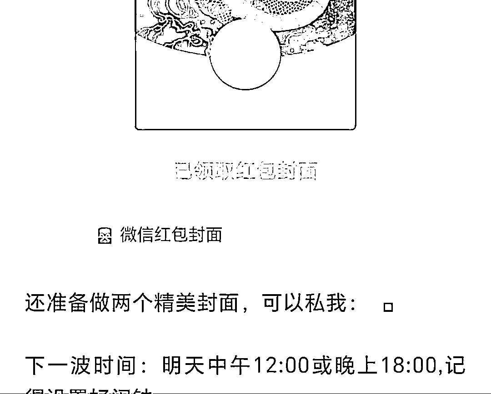

## 发放设置

可以设置发放1000或者是2000数额，可以自定义。

从目前测试效果来看，发放的数量越多，曝光量越大。

如果直接发放6000个，可以达到万阅读以上。

那么，如何通过微信红包封面导流来实现最好的效果呢？

首先是你的标题，关键词一定要进行布局。

如：微信红包封面免费领取，限量多少份。

然后是你的内容，除了送封面之外，你要留钩子，进行公众号的引流，或者是给你的微信做导流。

从目前测试来看，公众号导流效果并不理想，但是以赠送、免费封面作为钩子引导加微信的效果很好。

其次以送他们搞钱资料，或者说你的朋友圈还有更精美的红包封面。

通过这种形式来导流到你的个人微信上。

这里建议使用其他微信号，而非IP号，因为私域的用户是非常不精准的，都是泛粉流量。

泛粉，就是那些钱又不想给钱的，但是又想薅羊毛的人。

那我们就只能卖免费的项目，或者是卖兼职粉，推广告给他们。

微信接流量的时候，可以提前准备好话术，如果有免费的项目或者是广告，可以直接转发给他们，或者让他们去看你的朋友圈。

同样你也可以写项目的推文，或者是做一个软广告的植入，放到你的正文当中。

# 红包封面变现后端

## 公众号回复广告

在进行红包封面导流之前，我是对自己的公众号进行了优化和布局的，一个是关键词回复，挂载了微信小店和红包封面快捷回复。

只要用户在后台发关键词“红包封面”，就可以收到我提前设置的信息，而最后一个蓝色超链接的跳转就是红包封面小店。

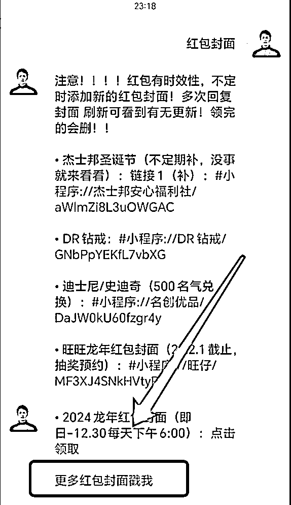

主要目的是实现公众号的促活，然后做私域的导流，同时售卖微信小店的红包封面。

## 副业广告变现

因为红包封面主要吸引的都是泛粉，所以我们最好的变现方式是副业广告，找到相应的副业广告来进行对接，一般是按CPA或者是阅读量来进行结算。

副业粉的白嫖意识是很重的，他们的目标也很明确，他们不会随随便便花钱。

除非你带他们做免费的项目，让他们看到一点钱，那可能他们后续会考虑为你做接下来的付费。

但是需要进行认知的拔高和升级这个步骤，实际还是会有所困难，所以做副业广告变现是最理想的一种路径。

广告海报、推文也可以直接同步到朋友圈增加曝光，进一步带来转化。

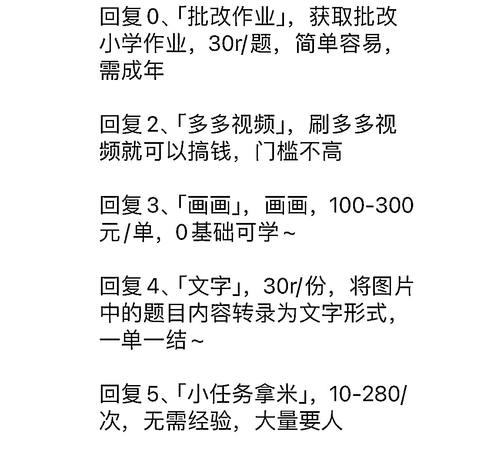

## 红包封面项目

我们发起的就是红包封面，可以直接做红包封面这个项目，比如说你购买了某个红包封面的项目群可以收费，然后邀请他们进群，赚这个佣金。

这类项目客单价是19.9左右，通过提供一整套sop，让对方去多平台发视频，引流，然后用红包封面小店，卖封面，赚取佣金。

视频号快手小红书都可以发布，跟红包封面相关的视频素材。

比如可以做那种新闻的案例，然后引红包封面的题材，或者做黑丝引曝光，然后再转红包封面或者直接拍一个生活中的截图，别人使用手机打开红包封面的。

这几种方式都值得去尝试，主要还是要看别人的爆款案例。

通过大量的去找这种爆款的素材，直接复制过来或者自己做实拍，一般都可能拿下爆款。

通过赠送免费红包封面的形式，引导用户进入公号推文，在公号推文当中埋社群的钩子，也可以在关键词回复当中埋社群的二维码进行导流。

它的底层逻辑就是赠送免费红包封面，定期给大家发福利，通过免费红包封面来转化私域用户到你的社群，然后你再想办法把他们加到你的微信列表上。

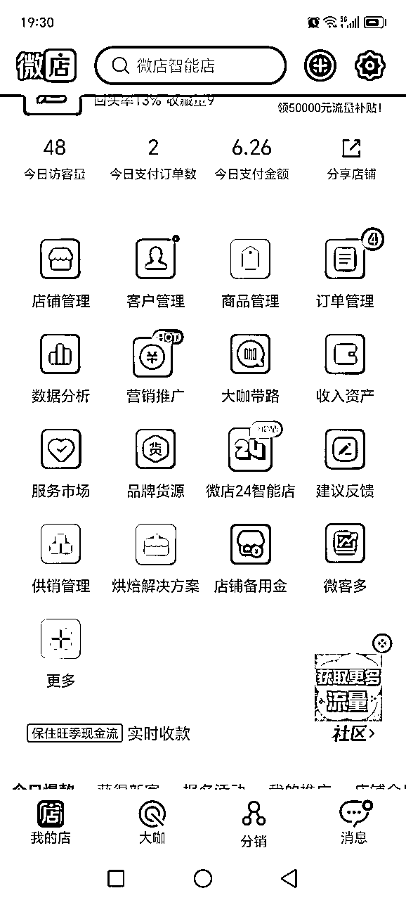

## 红包封面代理

如果对方有一定的付费意识，可以收他来做红包封面的代理，通过做多平台的红包封面曝光，做个人红包封面的微信小店来售卖红包封面，通过代理赚钱。（和项目的区别在于一个是社群模式，一个是个人陪跑）

这种存在一定交付，客单价可以收高一些。

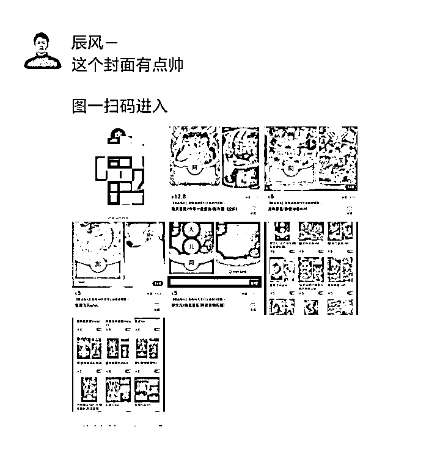

## 知识付费课程

如果你是在某个领域做知识付费的课程，可以把你的红包封面跟你的知识付费课程相挂钩，通过私域沉淀用户，再通过后期的社群或者是朋友圈，公众号推送，来触达用户，做用户的成交。

但这种课程，出单概率较低，因为白嫖粉的受众，第一，没有经济实力，第二，没有自我提升需求。

## 挂小店售卖

通过小红书店铺售卖，6快，甚至7,8快（净利润6/7元）

通过布局关键词，找好看的红包封面，不断的去推送，只要以免费来作为诱饵，肯定会有人点赞或者是评论，那就可以把他们导流到群聊，再进行下一步的引导，做私域的转化，来通过微信红包封面小店或者是微信上成交。

只要封面好看，或者懂设计，爆款可能性很大，只要曝光量上来了，出单就是嗖嗖的。

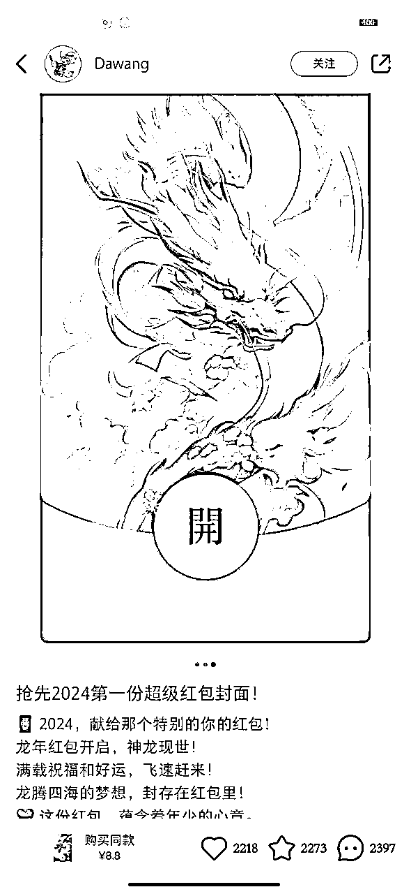

# 常见问题答疑：

## 红包封面开放平台和公众号主体不一样怎么办？

关注微信红包封面开放平台公众号，然后搜索你的微信，绑定，开通全部权限，即可操作

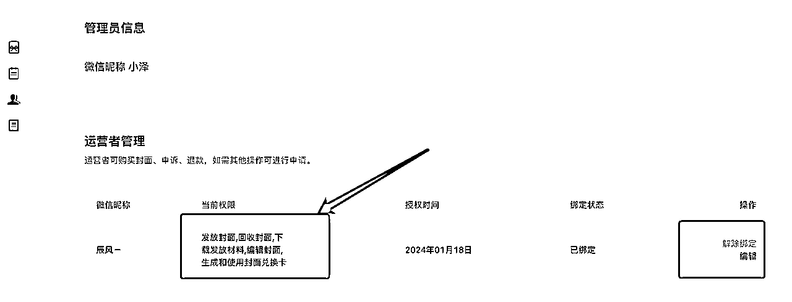

## 可以制作多个封面吗？

如果只有一个兑换卡，就只能兑换一次，但是可以多次发放。

有三个兑换卡，可以兑换三次。

## 可以多次发放吗？

可以，自己设置好额度，没发放完可以回收

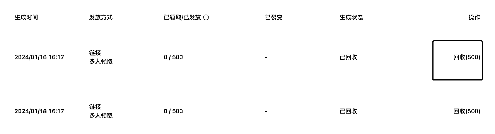

## 如何推广告

可以给泛粉打好标签，给他们推送定向朋友圈（只对他们可见）

## 要发给读者怎么办？

可以设置关闭推荐，只发布，不发表（这样就可以发给你的粉丝，让他们领取）

## 如何赚钱？

可以在文章曝光微店，发广告，接到私域做转化

* * *

大家也可以通过微信指数可以看到这个数据的变化趋势，尽早去玩，尽早的拿到流量。

一个红包封面的利润可能是两三块钱，但是一旦爆单，它的复利效果是很好的，哪怕只是用来转化做私域流量也很不错，后期可以卖兼职粉。

这几天是流量的高峰期，只要你把关键词布局好，直接按照爆款的逻辑去复制，基本都能够跑到千阅读甚至破万。

选择好看的红包封面，埋好钩子，实现精准获客导流至关重要。

剩下的就是执行力，谁先抢跑，谁就获得流量，谁就有先发的优势。

加速玩起来!

感谢阅读，一起生财！

其他：