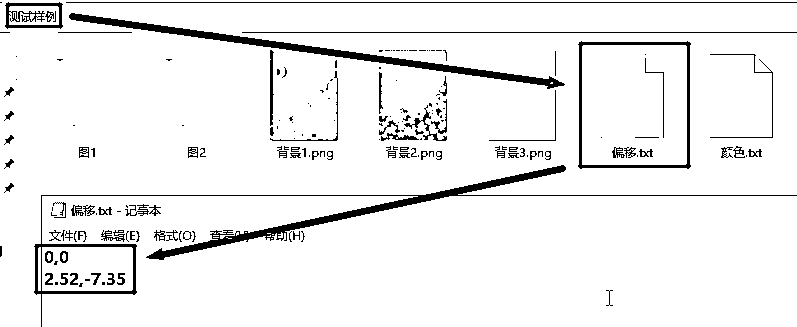

# 土逗的图文排版工具

> 来源：[https://xq23zki45o8.feishu.cn/docx/JV2EdYWfhoN0QvxF3ZbclrfHnbh](https://xq23zki45o8.feishu.cn/docx/JV2EdYWfhoN0QvxF3ZbclrfHnbh)

# 一、照旧，先上效果视频（下载链接在文章底部）：

# 二、讲讲工具强大性的表现：

如上图，我们平时在做电商时可能会有各种各样的维度拓展需求，比如同一模板会有多套图片及文案（图文套数），比如同一套图片及文案想在不同排版结构下看看它们的效果（幻灯片数），比如图片、文案、结构排版都确定了但又想换下不同的背景图片看看效果（背景种数）。这时如果用人工去尝试的方法，就要做“图文套数×排版幻灯片数×背景种数”的尝试了，就少量的2×2×3来说，你也得尝试12次了。这3个维度还是基本的3个维度，如果后续你还想对字体形状、字体颜色、图文位置进行微调的话，又得再来个“字体种数×颜色种数×偏移种数”的共计96种尝试操作了。但是借助此图文排版工具，各种维度的拓展将在程序中有条不紊地完成，且最终将自动生成一个包含各维度信息的文件名称，比如“字体测试实例_1_背景1_字魂扁桃体_52096C_2.52,-7.35_2.png”中前面的“_1_”代表图文内容是第1套，末尾的“_2”表示第2套排版结构，其它的背景1“”，“字魂扁桃体”，“52096C”，“2.52,-7.35”依次代表背景图片\字体形状、字体颜色、图文偏移量。这6种维度你可以根据需求来选择要不要拓展，若要拓展自己可针对每种维度定义若干种方案。此外，工具还支持一些细节上的灵活定义与设置。

# 三、讲讲工具易用性的表现：

在你准备好所有前期工作后，只要简单的选择一个文件夹或者将文件夹拖入矩形框并核对确认就行了。至于前期的准备工作，先从主要的图文套数、排版结构数、背景种数展开讲，再从其它调节方面展开讲。

## 1、图文套数的设置

如上图，在根目录“测试样例”文件夹里创建一个.pptx文件作为模板，在上面调整好各文字元素的位置、大小、颜色、字体名称、倾斜角度、是否加粗等，调整好各图片元素的位置和大小，以及所有元素的图层顺序。同样地创建一个.xlsx文件里写上各文字元素到时要生成的内容，比如A列文1有两行，到时会生成对应的两套文案，对应地，因为有2行文本内容，你一般必须在“图1”和“图2”文件夹下各放2张图片。到时生成的ppt文件或图片文件，内容随.xlsx文件，内容之外的包括位置、加粗、倾斜、下滑线、图片宽高、图层位置等其它样式都随.pptx模板文件。样式、位置、宽高、颜色这些在PPT模板上设置最直观、最高效、最便捷，如果放到其它UI界面里设置只会更加不方便。

这里A01会对应.xlsx的第2行，A02会对应第3行，工具会按数值大小升序排列自动匹配。你要把A01改为005也行，只要保证A02是006、007、008以上就行。

目前市面上一些工具很喜欢以这种方式来设置图片路径，其实我觉得真是不好用，且不说手动一个一个复制进去的傻方式了，就算你有一键导入的工具也显得多此一举。你只要告诉我所有素材的根目录就行了，程序和代码会自己判断出来对应的图片路径的，还用得着再劳费人工去设置？并且当我们有图3、图4、图5怎么办？表格上再新增3列再去人工输入或者怎么再快速生成3列吗？

## 2、排版结构数的设置

一句话，需多少排版结构就创建多少张幻灯片就行。

## 3、背景种数的设置

同样一句话，需要多少不同背景就拉多少张背景图到根目录“测试用例”。

## 4、字体种数的设置

这里的字体种数，指的是“宋体”、“楷体”以及其它各种自定义字体。先分享一个实用但又很多人不知道的技能，去网上下载一些.ttf的字体文件下来，双击.ttf文件并安装，如下图。

这样，在PPT、Excel、Word等基础办公软件下你就可以直接使用这些字体了，如下图。

我们的字体种数设置也是需要基于这步操作（除非你只想用“宋体”、“仿宋”等这些原本就有的基础字体），在安装了“鸿雷拙书”和“字魂扁桃体”后，我们只要像下图这样设置，就可以愉快地使用各种自定义字体了。有两处细节需要注意：一是文件名必须是"字体.txt"（后续的“颜色.txt”、“偏移.txt”同理），二是字体名称以PPT等软件上显示的为准，比如我们之前安装了“鸿雷拙书”字体后，它新增的却是拼音名称“HongLeiZhuoShu”，所以我们“字体.txt”文件里必须填上“HongLeiZhuoShu”。

## 5、颜色种数的设置

支持两种方式设置，16种基础颜色可以直接填“粉红”或“粉红色”，想自定义的话就直接填上类似“F1F2F3”这样的6位RGB字符就行了。支持的16种基础颜色如下图。

## 6、偏移种数的设置

如上图，第一种偏移方案其实就是按原模板的位置，第二种方案基于原模板向右偏移2.52厘米，向上偏移了7.35厘米。左边的数字不带符号即向右偏移，带负号即向左偏移，右边的不带符号即向下偏移，带负号即向上偏移。

## 7、其它说明

6个维度不是每次都要设置和使用，“字体”、“颜色”、“偏移”这些设置文件可有可无，无则按原PPT模板的字体、颜色并不偏移，有则根据“字体.txt”的行数A、“颜色.txt”的行数B、“偏移.txt”的行数C，自动生成“A×B×C”种不同的组合方案。同样地，“背景1.png”、“图1”文件夹等也是可有可无。这样我们就灵活且随心所欲地根据自己的需求来批量自动生成自己需要的图文了。

# 四、写在最后：

该工具用python语言开发，主要使用了pypptx库。本来考虑过通过影刀的python模块出个影刀版的图文排版工具的，但由于最近项目有点太多，所以只能暂时搁置了。当前自己正在开发的项目还有：

1）“微信自动养号及加人”（安卓语言开发、安卓端的.apk脚本）

2）“卡密模块接入”（为了将脚本工具商品化）

3）“微信支付及小程序的基础接入”等。

接下来有可能开发的项目有：

1）PC端、安卓端的电商自动辅助工具（自动发笔记、养号、引粉、爬信息等）

2）电商视频相关辅助软件（视频自动去重处理、视频生成等方向）

3）电商直播相关辅助软件（视频流的复制或生成，摄像头的模拟等）等。

另外，对于所有这些软件工具如何开发制作感兴趣、想学习的朋友，本人乐意招收一些学员。

最后的最后，介绍一下我自己：一个体制内辞职下海的全栈程序员，一个自动化达人与工具百宝箱提供者，一个电商等领域的技术支持者。

工具下载：

https://www.123pan.com/s/SmvCjv-OkJgh.html

提取码：6666