# 风向标拆解第 2 期--怎么在小红书做一个赚钱的身心灵账号--阿黎

> 来源：[https://vy7zcdp134.feishu.cn/docx/B4nydku24oiPXWxrhrJcce0tnwe](https://vy7zcdp134.feishu.cn/docx/B4nydku24oiPXWxrhrJcce0tnwe)

# 先说结论

1、身心灵项目还处于红利期，有能力的尽早下场。

2、身心灵客户具有持续的终身价值，持续在场，做好精细服务和运营，可以持续吃到复利。

3、身心灵项目有广泛的需求，不是心理咨询师、疗愈师的专属，对于一些其他行业，比如消费品牌，茶室/民宿等实体门店，又或者插画设计等，用身心灵+的概念，也能获得很好的流量与变现。

4、文末有3份列表，收集了小红书#身心灵、#疗愈、#治愈 几个标签的爆款笔记、账号、标题、高频词，可自行领取

另外，本文所有案例账号，都没有利益相关，不作任何推荐和背书。

# 1身心灵项目概述

## 1.1小红书身心灵项目是什么?

近年来，身心灵、治愈系等概念比较广泛，主要是指通过某种活动，获得解压放松，以及自我认知、接纳、启发等等。出圈的有颂钵、文玩盘串、佛祖咖啡、电子木鱼、α脑波、断舍离疗愈营、正念冥想等等。

小红书上的身心灵项目，主要是交付一种产品，

这种产品是某个心理工具，以服务、虚拟物品或实物的形式【*注1】，去帮助客户洞察内心、接纳自我、缓解压力、调整情绪，提供成长、认知、心理、情绪和陪伴等价值，以此获得收益。

【*注1】服务（课程、咨询、疗愈、冥想等）、虚拟物品（白噪音、解压音频视频等）或实物（心理卡牌、解压物品等）

大多数灵修方式起源于东方古老的宗教信仰，修行者在持续稳定的练习中达到一种极度专注、平静、祥和的身心合一状态。

如今中国市场上正火热的“身心灵”课程，抽取一些核心方法运营成商品课程，引导人们在最短的时间里尝试着走近“灵性”。

这些课程成为某种工具，帮助抚平人的内在焦虑。

——三联生活周刊 https://www.lifeweek.com.cn/h5/article/detail.do?artId=217039

## 1.2起源和发展

*   起源：

*   身心灵（body-mind-spirit）起源于东方，泛指个体对生命意义和目的的探寻。我们传统儒释道文化，日乎三省吾身、心灵无垢、天人合一的说法。

*   发展：

*   “身心灵”修行是一门古老的学问，以瑜伽和冥想为主的方式，从20世纪60年代传入西方国家之后，冥想、瑜伽等身心灵修行方式逐渐去宗教化，保留了更多实用属性，在60-70年代的欧美新纪元运动流行开来。

*   当时的身心灵修行，吸收了东西方古老的精神与宗教传统，把古老的精神性观念跟现代科学，包括心理学、脑科学等融合在一起，指引人提升个体能量，追求内心的开悟与平和，乔布斯就是其中的拥趸。

*   随后，身心灵概念由欧美传入中国港澳台，本世纪初进入中国大陆，最初，读书会是身心灵主要的组织形式。

*   随着社会环境变化，以及互联网技术与社交媒体发展，身心灵项目持续发展

*   在需求端：人们对内心平静和思考开悟的需求增加，尤其是在疫情三年后呈现迅猛增长态势。

*   在供给端：身心灵市场供给有了更丰富的形式，瑜伽、颂钵、冥想、绘画、芳香疗愈、解压视音频等。

## 1.3小红书身心灵项目近年演变和体系

### 1.3.1小红书身心灵项目近年演变

我们在2021年开始做小红书的时候，接触过身心灵项目。

就我在小红书观察到的身心灵项目而言，发生了一系列的变化：

*   1）身心灵变现形式变化：越来越丰富，有做课程，有做咨询的，有做解压舒缓视音频的，有做解压周边的（玩偶、文具、香薰）等等，引流变现形式从原本主要引流到私域，发展到直接在小红书成交，或者为线下做推广；

*   2）主流内容变化：在小红书官方引导下，从原本近似神秘主义体系，往现代心理学体系发展（大家有没有记得小红书当初打击了一批佛媛，那是比较早期的身心灵代表)，小红书官方号 心理薯，也针对身心灵、身心健康等泛心理学内容，推出了一系列活动，有官方流量扶持，并且会精选参加活动的笔记进行推荐

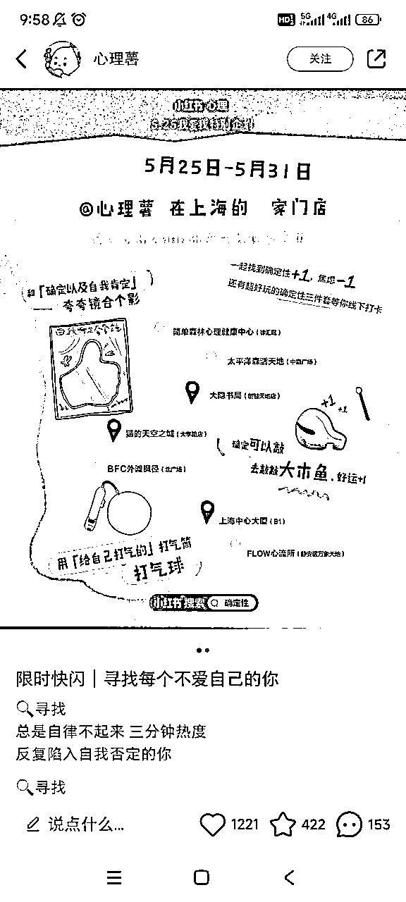

*   3）粉丝群体变化：对身心灵感兴趣的群体逐渐增大，了解也更深入，现在讲身心灵的博主，是需要一定的真才实学了，要不客户咨询时候，一被问住，很尴尬的；

*   4）笔记变化：与身心灵内容相关的笔记、产品呈现形式，越来越精美

*   个人博主以真人出镜视频为主

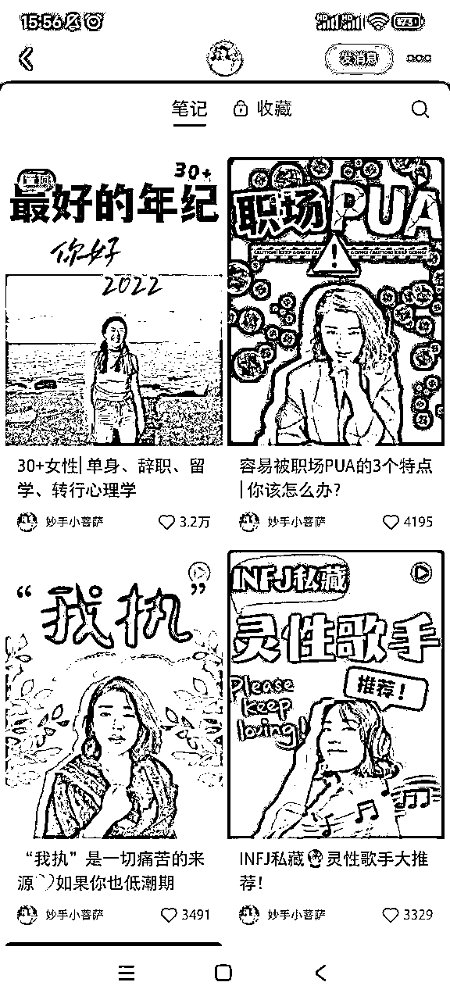

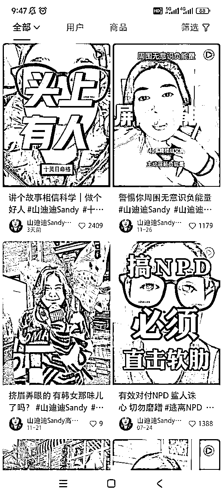

*   机构、线下疗愈实体店，以活动图片、海报介绍为主

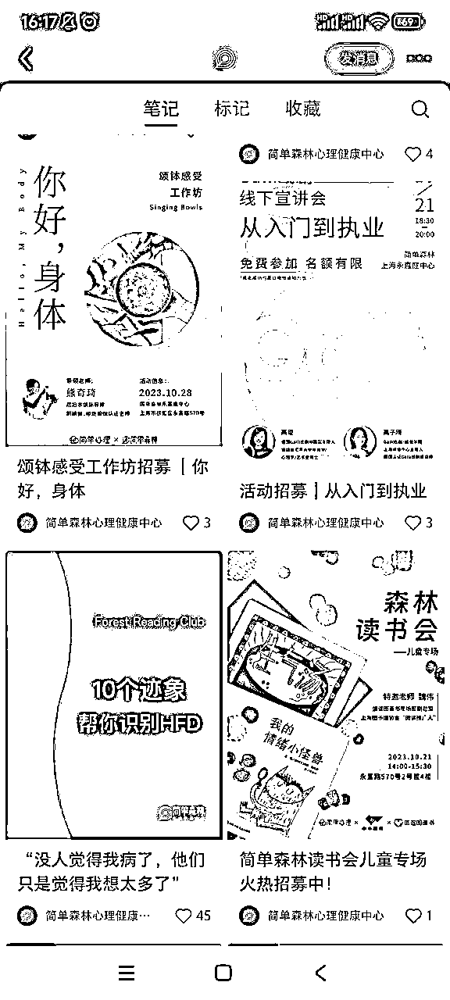

*   正念语句/能量语句（鸡汤）号、解压插画号

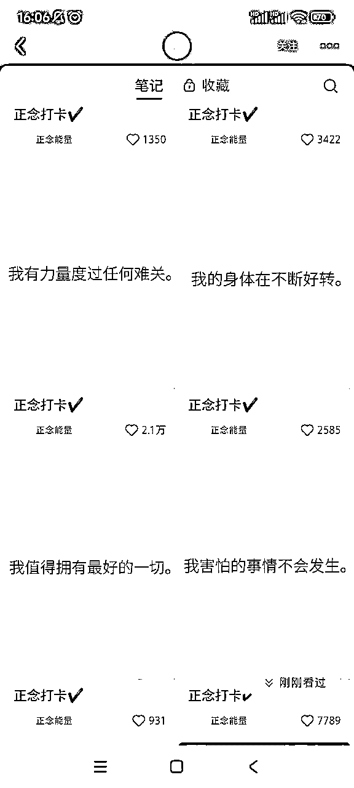

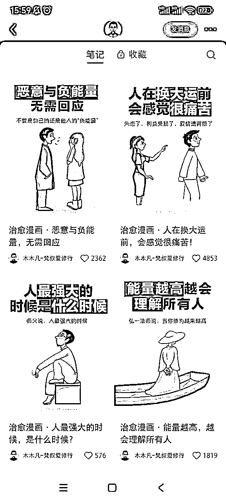

### 1.3.2小红书常见的身心灵体系（不展开不评价，只作收录）

*   现代心理学体系：心理学下的各类分支，比如心理咨询、正念冥想、MBTI、盖洛普等

*   特色理论体系（容易出高客单）：吸引力法则、脉轮、国学、SRT疗愈、希塔疗愈、零极限清理等

*   感知疗愈体系：声音疗愈（颂钵、白噪音）、芳香疗愈、水晶疗愈、园艺疗愈、绘画疗愈、正念语句、漫画账号等

# 2流量和转化

## 2.1以小红书为主要阵地，在小红书变现，或者引流到私域变现

以小红书为阵地的博主，主要是通过内容输出进行引流，输出身心灵知识，帮助粉丝觉知和成长；或者通过输出一些正面肯定语句、治愈系的插画漫画，提供情绪价值，获得流量。

## 2.2全域推广，小红书作为引流的一部分

有的大机构，或者大IP，主要是做全域推广，小红书只是作为他们引流的一个组成部分，因为身心灵包含了疗愈修行体验、知识内容学习，小红书不方便输出大段的文字或者视频。

比如主打心理和情感的KnowYourself，在小红书只作一些日常更新，相比其在微信公众号动辄上万的阅读量，小红书笔记的数据显得相对冷清。

KnowYourself 小红书账号

KnowYoursel 公众号

而一些注重实地体验的泛疗愈机构，比如小红书上很火的抄经小院——成都文殊院香园，更注重其他渠道的推广和运营，在小红书上的账号，基本就把小红书当成一个展示的功能，有点“保持在场，别人来小红书搜索的时候，能搜到我”这种意思。

小红书搜索抄经小院，很多博主介绍

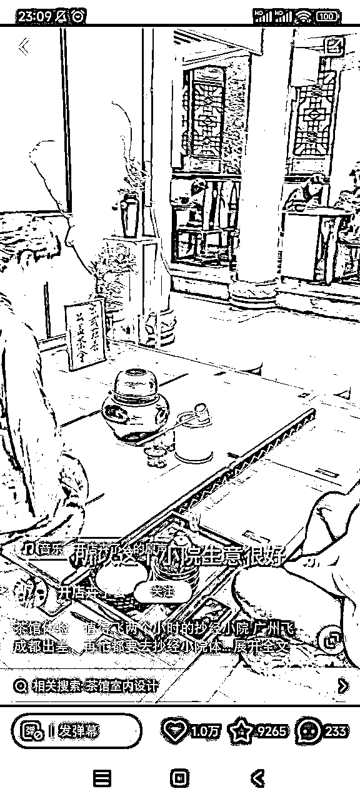

其中一个博主介绍，过万赞，9千多收藏，评论都在问：在哪里？

抄经小院——成都文殊院香园自己的账号，小红书上运营，相对佛系

# 3变现方式

身心灵项目变现方式，和知识付费相近，大家可以好好看一下生财的疗愈赛道合集，点击下方跳转

生财疗愈赛道合集：心灵疗愈需求旺盛，如何抓住风口？

小红书上身心灵变现方式，主要有这几种

3.1咨询、心理治疗

咨询和心理治疗是一体的，

3.2课程、训练营、冥想、疗愈

3.3社群、知识星球

3.4卖货

*   实物产品：

*   文玩手串、颂钵、叮夏、海浪鼓、果壳摇铃、雨棍、水晶、香薰等物品，有的直接在小红书店铺售卖，有的引流到私域。下图就是直接在小红书售卖的手串，都是过万的销量。

*   解压玩偶、文具、印刷品（填色绘本、抄经、正念语句卡牌、身心灵卡牌）等。 *延伸阅读：说到身心灵卡牌，估计很多人都没关注到这小众领域，有的身心灵卡牌还比较贵，销量也好，比如下图在淘宝售卖的OH卡，彩虹卡等，吸金力不容小觑。

*   虚拟产品：

*   视音频、壁纸等，这个方面，大家可以看看下方，生财里孙策老板分享的帖子

生财：日赚过万，喜马拉雅“声谷”40万粉是怎么打造的？

3.5泛身心灵产业

身心灵疗愈馆、身心灵民宿、禅茶馆、香道馆、抄经小院等

3.6接广告

3.7引流至APP变现

例子，FLOW冥想APP

# 4案例介绍

好的案例账号挺多的，不一一列举了，有些更好的可能我也没看到，主要是介绍一个思路，以便学习借鉴。

## 4.1机构

### 4.1.1 KnowYourself

心理学方向，主要以公众号、APP为主，结合私域运营

*   KnowYourself是一个心理学账号，主打都市情感、职场心理方向。

*   在小红书上内容更新基本是一天图文，一天视频，更新内容不如公众号多，基本是公众号内容的精炼和搬运，小红书只是作为全域引流的一个组成部分。

*   这个号的主要阵地是在公众号，大约每天发3条文章，其中第1条是针对解决某个心理问题的文章，内容引经据典，有很多长文都获得了10W+的阅读，靠这些内容获取流量，建立IP；公众号每天发的其余2条文章，大多是机构自己的课程或者产品，包括课程、训练营、聊愈服务（会转到自家的APP交付）。

*   另外，KnowYourself还有APP，叫【月食】，里面是心理学知识，课程和聊愈服务，有免费的，也有付费的项目。

*   产品价格方面，在有赞下单的聊愈240元/次，月食APP里收费又有差异；训练营有499的21天正念打卡疗愈营等；课程有69元的自信成长线上课、3590元的心理助人课（聊愈师培训），学完通过考试，还可以在它那成为签约聊愈师，接客户。

KnowYourself小红书账号

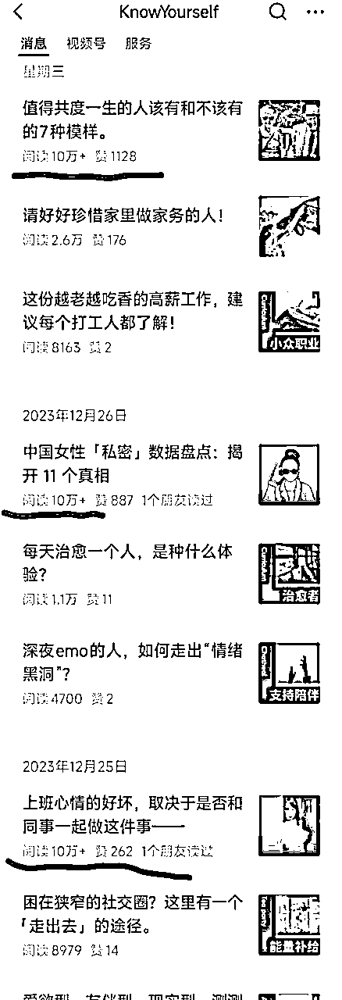

公众号，多篇10W+

公众号有赞上的聊愈服务，240元/次

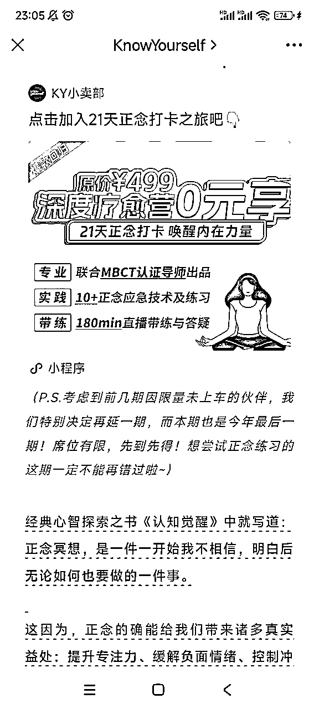

训练营和课程

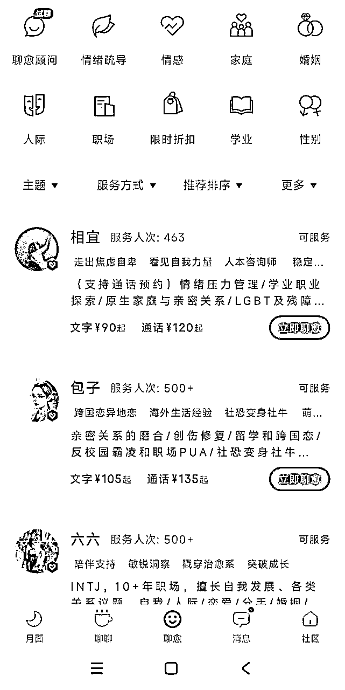

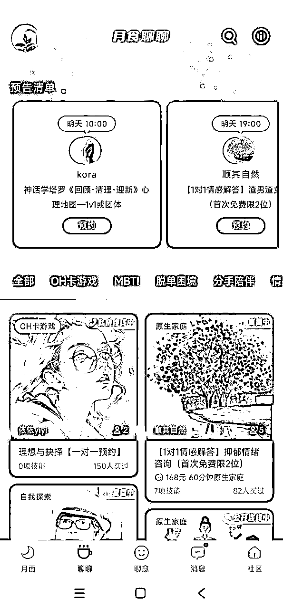

月食APP内项目

### 4.1.2FLOW冥想

冥想方向，以APP为主，线下门店、私域相结合，小红书店铺也开始尝试

*   FLOW冥想有APP、线下门店（叫FLOW心流所），在小红书上简介上明确写明APP和门店（导流），同时开了小红书店铺卖会员卡等。

*   小红书账号发布的笔记内容非常垂直，基本是引导冥想的视频，内容比较精美，评论区也有引导购买。

*   APP里的课程可以单独购买，也可以充付费会员后学习观看，有精油冥想、正念书写疗愈、塔罗冥想、喝茶冥想等等课程。

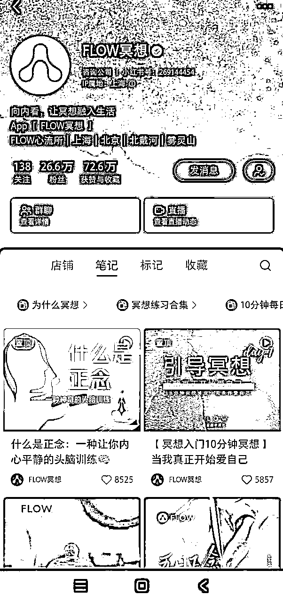

FLOW冥想小红书账号

单品笔记有14万赞藏

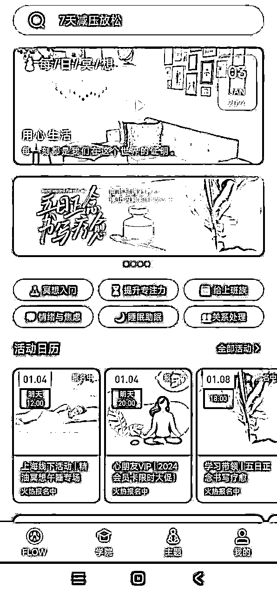

FLOW冥想APP内页

FLOW冥想APP的课程

### 4.1.3简单森林心理健康中心

心理学方向，以线下门店为主，结合私域运营

*   简单森林心理健康中心，主打线下实体门店，账号笔记多次获得小红书官方活动推荐，应该是有合作或投放。

*   笔记引流内容是心理学方面的内容，封面多是纯色底图+文字，看着比较简洁舒适，也会发疗愈工坊的活动招募海报（下方图2）。

*   账号也会通过群聊、私聊等引流到私域，进行变现

小红书账号主页，有线下门店入口

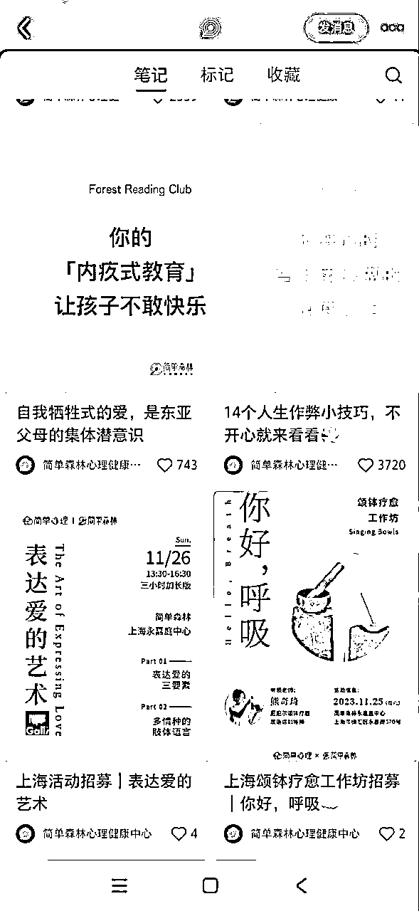

账号笔记中，有线下活动招募海报

私域微信群活动

## 4.2小团队或个人博主

### 4.2.1冥想猫Musecat

冥想猫是主打线下实体的一个账号，主要经营冥想课程、线下冥想活动、疗愈师培训、团建等活动承接、冥想音频授权等，小红书还用了小号来承接私信，引流到私域。

主号 【冥想猫Musecat】笔记内容主要是带领冥想的视音频；

小号 【冥想猫|线下活动】 笔记主要展示线下活动。

做线下实体的老板，可以考虑这样的方式。

主号 【冥想猫Musecat】笔记内容，笔记首图是风景照+白色文字，比较统一

小号 【冥想猫|线下活动】 笔记主要展示线下活动，照片精美

### 4.2.2身心灵博主

主要引流到私域变现，也有在小红书卖商品、卖课、接广告变现

介绍2个例子，其实很多，大家随便搜都能找到

#### 4.2.2.1山迪迪Sandy

大小号搭配，大号是真人出镜的视频笔记，主要讲一些职场、家庭心理学内容；小号是直播号，主页笔记内容有高纬传讯、负能量等特色理论的身心灵内容。

大号主页简介处@ 了小号，主页笔记是以心理学内容为主，真人出镜视频

小号有高纬传讯、负能量、换yun消业等词汇，赞藏数据现实有一定的受众群体

小红书群聊比较活跃

#### 4.2.2.2能量疗愈玛丽露

这个账号属于特色理论体系，介绍希塔疗愈，水晶疗愈，笔记真人出镜为主，开有小红书店铺卖水晶，也有收费的课程专栏，小红书群聊每天更新，有私域运营。

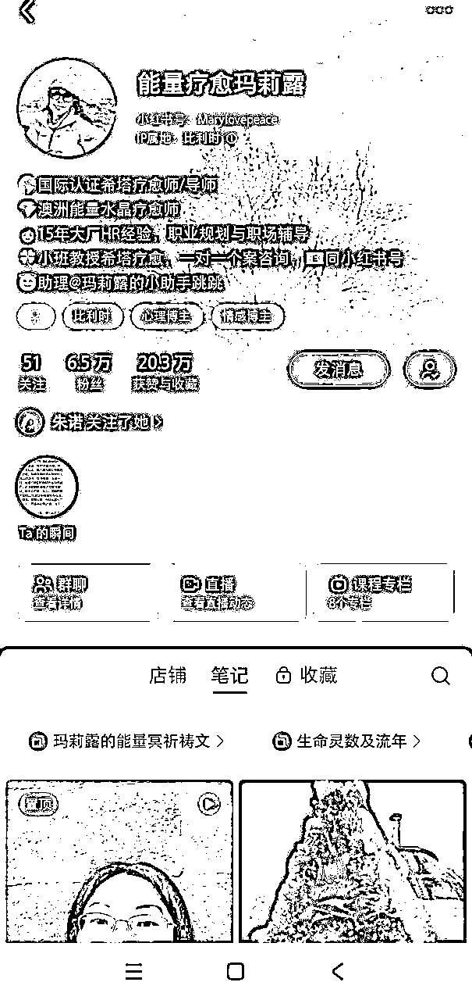

小红书主页

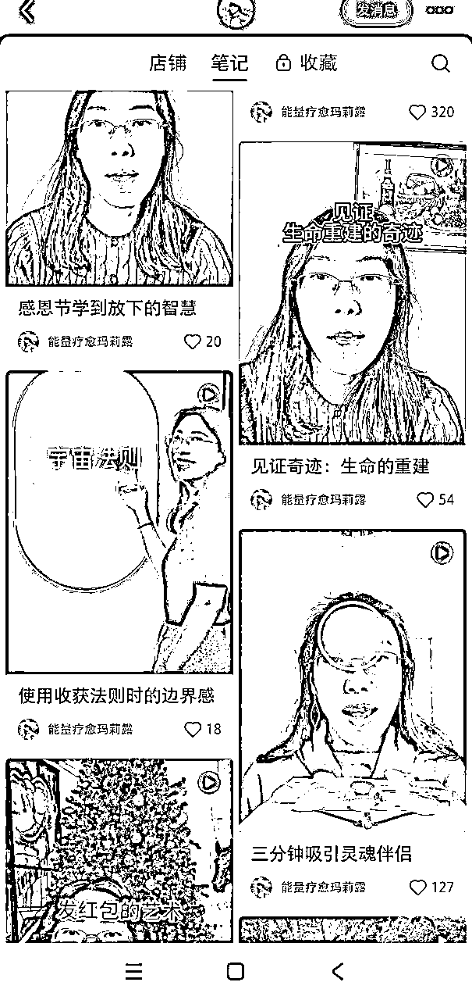

小红书笔记

小红书店铺

小红书课程

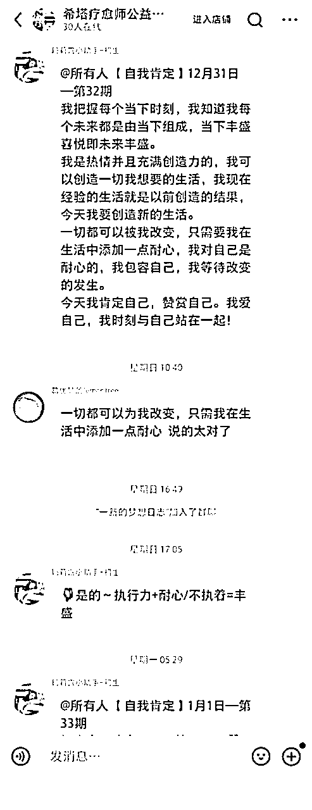

小红书群聊活跃

### 4.2.3插画、正面语句治愈博主

这类账号变现，主要是接广告、售卖周边等，结合AI出图、出文案，加上自己有一些设计能力，流量和收益也很不错。到了后期，如果IP火了，就有更多的可能性。

#### 4.2.3.1粉啵啵

粉啵啵是一个插画账号，笔记内容偏向身心灵的治愈系，可爱的画面配上正面文字，有很多人喜欢，开通了小红书店铺，产品比较丰富，有日历、冰箱贴、手机壳、手机支架、喷画等。

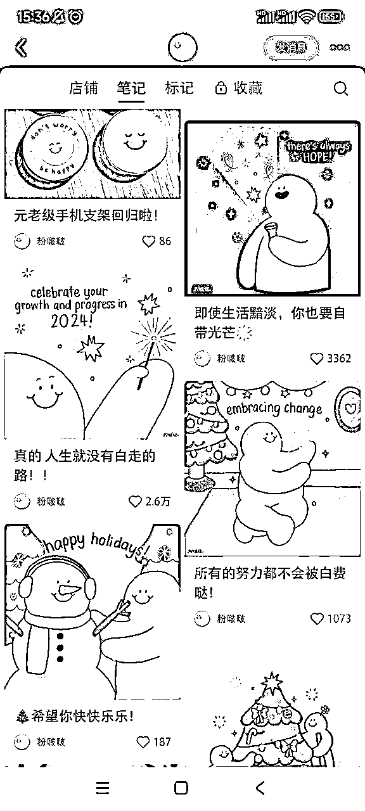

账号主页风格

可爱的插画，配正面文字，小红书粉丝很吃这一套，单篇迎新年笔记就2.6万赞

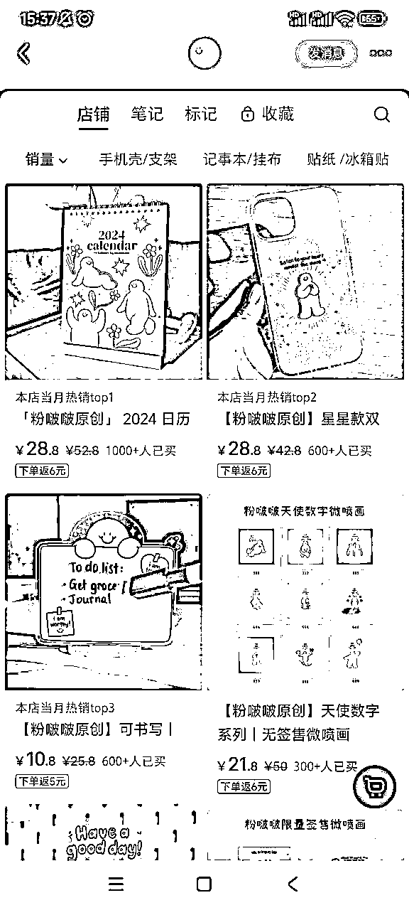

小红书店铺周边产品

#### 4.2.3.2宇宙丸子bubu

这个账号23年11月底刚起号，起号速度很快，画面风格很多人喜欢，我也是主页推荐刷到的，小红书店铺目前是卖壁纸，大家可以留心观察。所以插画师选身心灵方向，是一个好选择，美学治愈。

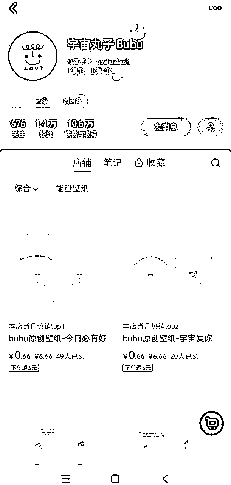

#### 4.2.3.3正面语句博主

这里不赘述了，上面也放过，这样的账号挺多的，笔记非常容易做，流量也不错，主要就是做好流量承接、变现。

2个tips：

可以用【打卡】这样的形式，增加粉丝粘性；

笔记可以批量制作，生财里有不少帖子，文案可以找文案库解决。

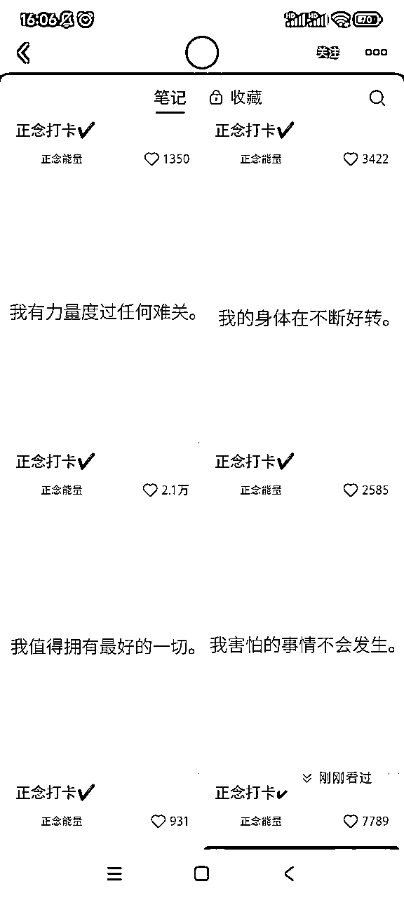

# 5说说踩坑和风险

## 5.1做项目前，执着于先考证

据我了解，目前国内对身心灵、疗愈师行业还没有规范化管理，除了心理咨询师证，其他都没有国家级颁发的证书。市场上的证书，多是一些二级机构或者协会颁发的。所以证书并不重要，证书不重要，证书不重要！不要让证书成为门槛！

## 5.2过度承诺服务效果

1)个体心理活动是独特的、复杂的，同样一个问题，每个人的思维理念、感知程度、环境影响因素不同，疗愈治愈效果就不同。

所以不要用最好的案例效果，作为服务底线去承诺，我们的做法是，让对方明确学习也好，身心灵疗愈治愈也好，这是一个双方都要努力的过程，更主要是客户自己的获得感。

2)心理学工具是有限的，不可能解决所有的身心灵问题，所以，不能“包治百病”，每一个疗愈师都应该针对自己擅长的领域，去解决一类问题，而不是所有问题。最开始客户来咨询的时候，筛选客户，也很重要。

## 5.3被投诉为诈骗

正因为目前市场没有规范化的管理，没有行业规范和标准依据，所以对从业者来说，也缺少一定的保护。服务的人多了，很可能会遇到不理解的，甚至无理取闹的，投诉你诈骗的，这时候直接退款。

过多的解释和拉扯，都是一件非常耗能的事，并且容易对IP造成伤害，看看小红书上那些吐槽就知道了（爱之深，恨之切）。

## 5.4割韭菜因小失大

身心灵作为心灵的美业，就和做美容一样，是一个可以吃客户终身价值的行业。持着割韭菜砍一刀就跑来做身心灵项目，真是因小失大。

让客户信任你，长期持续复购，不香么？

## 5.5特色理论体系的内容，易被同行投诉封号，注意笔记内容，尽量引流到私域

国学、脉轮等特色理论体系的身心灵内容，有时候到句易网上检测没有违规字词，但是发到小红书上，有时候被同行投诉会被判断为无科学依据、封建迷信等，轻则影响账号权重，重则封号。

我看到比较多的做法，是小红书只发布一些偏心理学，或者不讲敏感字词的笔记，通过把粉丝引流到私域后，再分享自己的特色理论内容。

所以这方面是和平台动态博弈的过程，多看对标账号怎么规避，和你项目相近的同行，是最好的老师。

## 5.6做内容要考虑小红书平台调性，前期不确定自己是否合适，可以先多平台测试

小红书是偏向娱乐社交的平台，粉丝喜欢简单易懂，画面精致，有美学感的内容，有些账号在别的平台很吃香，但在小红书就没那么火。

比如knowyourself，主要是在公众号以长文引流；

又比如一个叫欢喜happy的身心灵博主，私域很多高客单，抖音上比较火，小红书相对平淡（见下图）。

所以大家前期做账号时候，可以多放几个平台测试，看看自己更适合哪个平台，当然，能一鱼多吃，更好。

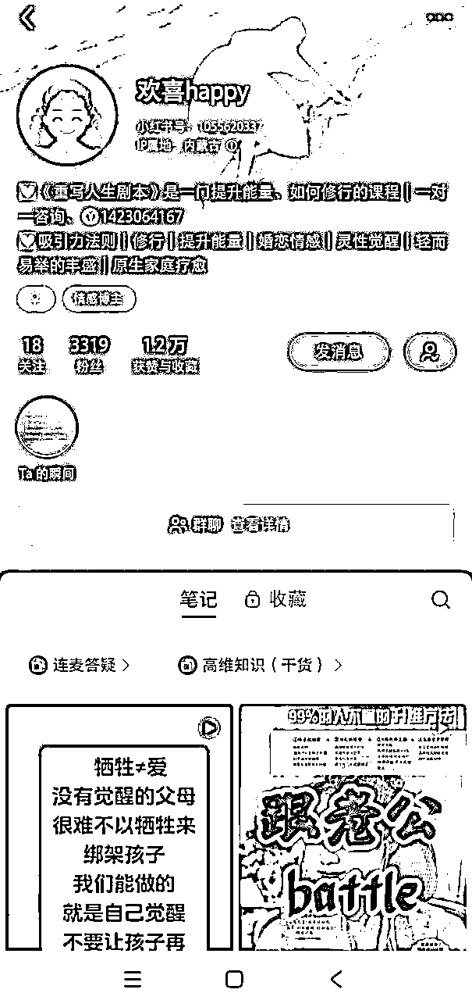

欢喜happy的小红书账号数据

欢喜happy的抖音账号数据

# 6下场建议

## 6.1小红书身心灵项目值得做

### 6.1.1尽早下场，枪红利，抢占市场和客户心智

身心灵项目整体发展，还处在初级阶段，表现在：

1）在行政管理方面，尚未有明确的规范和监管

2）市场集中度不高，还没出现全国范围的头部品牌

3）小红书上需求强（浏览多)，但相对来说竞争不强（笔记不多)，见下图

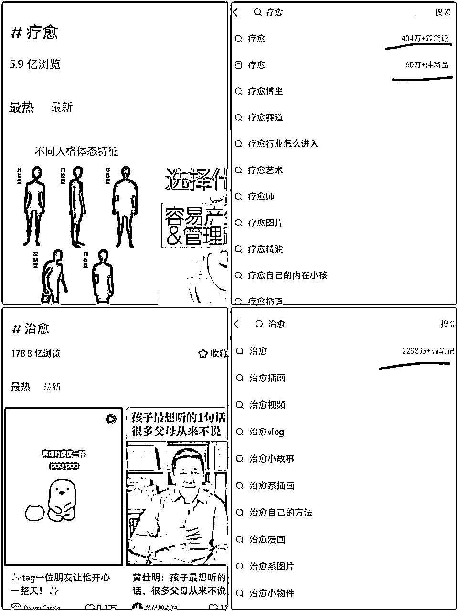

这3张图，标注了#心理学#心理#疗愈#治愈#身心灵 等关键词标签 的浏览量和笔记数。

数亿量级的浏览（需求），只有区区数万量级的笔记、商品（竞争），身心灵赛道，依然大有可为。

也就是说，抓住红利期尽早布局下场，除了可以吃到红利外，还可以抢占市场和客户心智，建立优势。

另外，在这可以再次看到1.3.1说到的，小红书官方正在把身心灵内容，引导到心理学方向，#心理学、#治愈 的浏览量，相对高于#身心灵、#疗愈；

#身心灵 在搜索栏下拉列表甚至不作为一级词推荐，也没有笔记数统计标注

### 6.1.2持续在场，吃复利

每一个个体都是独特的，然而社会的运行需要遵从统一的范式，所以我们每个人都会受到外界影响，当内在和外在有冲突的时候，我们就会有困惑，有烦恼，需要被治愈。

所以，身心灵项目可以说是心灵的美业，是一个持续高复购的项目。保持持续在场，做好服务和运营，就可以获得客户有终身价值，持续的吃到复利。

而且，身心灵IP，越老越香，会有越来越多客户来找你。

### 6.1.3身心灵项目不是疗愈师的专属，品牌、实体门店、插画师等，用身心灵+的概念，也能获得很好的流量与变现

身心灵项目有广泛的需求，不是心理咨询师、疗愈师的专属，对于一些其他行业，比如消费品牌，茶室/民宿等实体门店，又或者插画设计等等，用身心灵+的概念，也能获得很好的流量与变现，上文已经介绍过，不再赘述。

## 6.2根据自己资源、能力选择项目

### 6.2.1集体疗愈项目需要场地、团队、资金等资源

*   个体在群体中更容易获得沉浸和共鸣，所以有解压、社交诉求的人，喜欢参加集体的身心灵活动，比如颂钵、冥想、抄经、画画、治愈手工、读书会等，集体疗愈项目需要场地、团队、资金

*   场地和环境要求：

场地可容纳人数，是否方便到达，是否可以停车等；

环境是否安静、照明是否合理（比如冥想要暗、抄经要亮，大不一样）、疗愈设备/装置是否舒适、通风是否良好、气味/温湿度控制等是否合理，都要考虑，这样客人才能放松。

*   团队要求

集体活动需要服务的客户多，需要有服务团队，制订和执行活动流程，实时控场，实时响应客户需求。

*   资金要求

场地、人工等前期投入成本，需要资金启动；

运营过程中，因为有场地、人工等固定支出，又需要源源不断的获得收益，同时有一定的资金储备。

### 6.2.2课程、咨询、疗愈类项目需要知识和经验积累

课程、咨询、疗愈类项目，需要疗愈师、咨询师有一定的知识和经验积累，在面对不同的客户时候，才能做好身心灵的治愈、指引，获得客户的认可与信任，完成交付获得收益。

## 6.3根据不同项目属性，做好体验环节的运营

### 6.3.1群体类型身心灵项目

情绪和体验排首位，多注重身心放松、社交娱乐、美育欣赏等环节的体验营造。

这类项目有集体冥想、颂钵、念诵、抄经等。

### 6.3.2私密类型身心灵项目

知识和陪伴排首位，注重满足个体差异需求，个体心智的认知塑造等设计。

这类项目有1V1咨询 /疗愈；带领修行、觉知等

## 6.4不同玩家的定位

### 6.4.1机构

打造品牌，出标杆案例或活动事件（结合平台、品牌等)，占据消费者心智

例子 #knowyourself 占据情感心智，#FLOW冥想 在冥想这条赛道布局

如果想做大规模，一定要考虑符合监管，并且做对市场有益的事情，就我观察到的情况而言，机构做身心灵项目，选择现代心理学体系比较容易。

### 6.4.2个人身心灵咨询师、疗愈师

专注某个领域，深耕，聚焦某一类问题，比如情感、职场、成长、自信等

个人身心灵咨询师、疗愈师，应该往IP，以及人生教练的方向做。

### 6.4.3泛身心灵实体门店

泛身心灵实体门店，主要指冥想室、禅茶馆、水晶疗愈馆、芳香疗愈馆、抄经小院等等

建议注重同城流量，做好精细运营，提高体验感

### 6.4.4身心灵治愈周边商品

身心灵治愈周边商品，相对宽泛，可以是香薰蜡烛、书籍画报卡牌等印刷品，也可以是有正念语句的手机壳，某个治愈卡通形象的解压毛绒玩具等

这些周边商品，想要获得变现收益，就要讲好身心灵故事，为客户提供情绪价值、社交货币。

## 6.5身心灵从业者，请保持善良，请关注自己的身心健康

### 6.5.1保持善良，收获更多

认真做身心灵项目的从业者，多少是相信福报的，爱来爱返。

来咨询或者接受治愈疗愈的客户，往往都遇到比较大的心理困扰，焦虑、低迷、甚至有的处在崩溃边缘。

这个时候，从事身心灵项目的人，可能一句话，就能给对方很大鼓励和帮助，相反，如果骗对方，打击对方，会造成更大的伤害。

很多疗愈师的忠实客户，都是在客户最困难时的安慰和陪伴获得的，有什么比雪中送炭和一起成长，带来的关系更牢固呢？

### 6.5.2关注自己身心健康，是很重要的保护机制

情绪真的是一件非常微妙的事情，在做心理咨询、疗愈、陪伴的时候，有些客户负面情绪非常大。

合作的疗愈师经常和我说，不行了，这个客户太执着，负面情绪太强了，和ta接触非常难受。

所以，身心灵从业者，首先要做好自己身心健康，不被客户的负面情绪影响和裹挟，才能去治愈和指引别人。

## 6.6 注意AI使用

AI在各行各业都有了应用案例，身心灵行业除了用AI生产内容，还有一些应用例子，相信后续会更多，保持关注。

### 6.6.1 AI咨询

ChatGPT应用有 hotoke.ai机械佛；微信上有小程序AI佛祖（后因涉及宗教事务监管被下架）。

在咨询领域应用AI，是非常好的方向，但要注意相关监管。

新浪报道

ChatGPT应用hotoke.ai

小程序AI佛祖，后因监管被下架

### 6.6.2 AI情感陪伴案例，大家可以看看生财这条↓

生财：AI 情感疗愈师利用AI换脸和换声技术满足空巢老人和留守儿童

# 7 爆款笔记、账号、高频词收集整理

我收集整理了#身心灵、#疗愈、#治愈 几个标签的爆款笔记，分别做了3份列表，包含爆款笔记标题、链接、账号、点赞数、高频次，有需要的朋友，可以点击下方链接跳转：

-#身心灵 爆款笔记、账号、高频词-

-#疗愈 爆款笔记、账号、高频词-

-#治愈 爆款笔记、账号、高频词-

——

感谢阅读，一起生财有术！