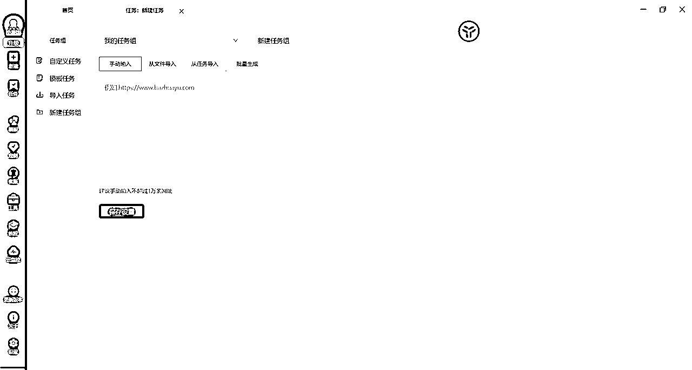

# 我是如何分析数据，将视频播放量平均提高40倍的？（附硬核保姆级操作指南）

> 来源：[https://xko95z0i3k.feishu.cn/docx/JZ9SdWHxeoxQ02xwrw7cnS6hnVf](https://xko95z0i3k.feishu.cn/docx/JZ9SdWHxeoxQ02xwrw7cnS6hnVf)

怎么找最佳对标账号？怎么找到最大的流量池？怎么找到最佳的视频表现形式？

hello，大家好，我是小光，前某官媒的记者和全能编辑，全网500W+粉丝的军事历史博主，之前给大家介绍了现在知识类自媒体还能不能做以及好不好做，还有一些总体上的技巧，做了一个相对来说较为全面的科普。

最近我们在起一个新号，发现自己在没有做数据分析前，整体上流量挺差的。以B站为例，在B站只有1k多的播放量。后来我们做了个数据分析，重新确定了选题，而后的第一个视频就小爆了一下，播放量达到了21.3W！视频的播放量最低也达到了2.7W,是原来的将近27倍。

其余的基本都在100倍以上，标题写的40倍，其实有点保守了。

（在B站发布的第一个视频，截止到2024年1月1日，视频播放量仅有1724，且多个播放量均如此；进行了数据分析，及时调整选题，第一个视频播放量就达到了21.3W；而近期更是有视频突破到了将近70W）

其实20多万的播放量对我们大号来说啥也不是，但注意啊，我这是个新号！权重相对来说是很低的！发出去的前几个视频，播放量5天内的播放量平均就只有1k！一下子暴增了210倍！

另外，就是很多关注B站的朋友可能会问，不是有很多新号刚做，单个视频播放量就上百万了么，确实会有的新UP主刚发视频，播放量就直接破百万了。

但这基本上是个概率问题，就跟买彩票中奖的几率是一样的，这种神仙机遇，对我们自媒体老手来说，也是可遇而不可求，给大家看个图就知道了，即便我们B站的视频播放量平均也就才几万左右，但是已经超越绝大多数人了。

所以，对于我们准备做自媒体账号的人，永远要放弃幸存者偏差，做好长期坚持的准备。

那今天就给大家分享我自己压箱底的数据分析方法，大体上分两类，一个浅层次一个深层次的，文中会有提醒。整体上来说，方法相对复杂，但实操性较强，且每一步都配有图片，大家像素级模仿即可。特别提醒一下，浅层次的方法，也有很大帮助！

本次用到的工具是：抖音网页端、八爪鱼、excel。

一、底层逻辑

既然要做数据分析，那首先得明白数据分析，要分析什么，最终要达到一个什么样的目的，对于我来说，考虑的就是以下几个维度，每个维度具体拆解成几个不同的关注点，从而找到最佳流量池以及最佳对标账号：

1.对标账号的基础数据如何（用作其他数据分析支撑）

*   账号的名称

*   粉丝数量

*   作品数量

*   获赞数量

2.对标账号的效率如何

*   均赞比（获赞/作品）

*   作品获赞离散程度（很重要！下文单独解释）

*   均粉比（粉丝/视频）

3.视频最优风格

*   视频风格

*   视频形式

*   配音风格

*   发布时间

*   视频发布格式

*   更新时间

4.主体流量来源

*   合集选题单集播放量（很重要！下文单独解释）

5.爆款视频分析

*   播放量最高视频

*   弹幕/评论区主流内容（很重要！下文单独解释）

其他的不多说，大家一看基本便知道什么意思，这里我要重点提三个内容，一个是作品获赞离散程度，一个是合集选题单集播放量，一个是弹幕/评论区主流内容。我们一个个来看。

1.先来解释一下获赞作品离散程度

我这里给各个账号下了个平衡的指标，就是作品的均赞比（获赞/作品），他是一个确定的数值。就是在抖音的主页上，用他的总获赞量，除以视频数量，得到的这个结果。主要就是考虑，他一个视频平均能获得多少赞，衡量的是这个账号效率的问题。

一个好的账号，在抖音里，最起码这个数值应该过万。如果本身行业流量小，这个数值也得在5000左右，最次也得在3000左右。如果3000都达不到，我建议直接放弃掉好了，这个账号怕是没法对标。

那讲到这里我们要想一个问题，作品的均赞比（获赞/作品）能否完全说明这个账号的好坏？显然也不行！

或许到现在可能还是无法理解我的意思。我来举个例子，一个地方十户人家，有9户人家穷的叮当响一分钱也拿不出来，而一户人家资产千万，那他们平均下来的数值将是资产人人百万！类比到账号上，我们对标账号可能总体上的获赞量很高，但是100个视频里99个可能获赞量都是1，另一个获赞量达到了100W，显然，这样来分析也肯定不科学。

所以我们需要在平均值的基础上，再加上一个维度的数据，才能够更加综合考量这个对标账号的能力。更深层次的考虑就是同等获赞量很高的情况下，该作者有没有稳定出爆款的能力，还是说所有的视频数据都是一两个爆款称起来的，主要弥补的是平均数的缺点。

所以，这个问题上我想了半天，甚至把我们办公室所有理科生出身的人全都问了一遍。果然，人知识最渊博的时候要么是在高考前，要么是在考研的时候，各类985的大学毕业生们对此竟然一脸懵逼（包括我），后来我突然想到了一个高中数学的概念——离散程度。

在请教了一个正准备考研的同事后，确定了一个数值——标准差。

看起来很复杂对吧，怎么还牵扯到数学了？如果放在高考这将是一个相当复杂的东西，但是放在互联网上，不怕，我们有工具！套个公式几秒钟就能够搞定！后面我会像素级教学，手把手教，不用担心。（当然，这属于深层次的东西，如果实在不敢兴趣也没关系）

2.合集选题单集播放量。无论抖音还是B站，都有一个合集管理，这里面是各个博主的选题集合地，基本代表了各大博主的选题方向，对自己确定选题将有一个非常明显的帮助，不多说！

3.弹幕/评论区主流内容。这点很重要，大家经常疏漏。因为我们很难分析出对标账号的人群，但是从弹幕、评论区主要的内容，大家基本可以判断出该博主的人群画像，比如评论区里一堆打666的，那明显就不是年轻人；弹幕里打给“火钳刘明”的，一看就是年轻观众。如果连人群画像都搞不清楚，那完全是没有方向的。

二、数据收集（浅层次）

懂了分析账号的底层逻辑，对于收集账号的其他信息来说，直接打开抖音端对标账号主页面查找基本信息就行了。

均赞比（获赞/作品）、均粉比（粉丝/视频）、合集选题单集播放量等内容需要大家手动计算一下就行了，具体的视频风格、以及弹幕需要大家点开对标账号的视频看一看，直观记录一下就OK了，不用太复杂，我们把它做成一个表格，情况一目了然。

如果不想计算标准差的话，可以到此结束了，只要你按我的方法分析了10个对标账号，其实也基本就能确定出选题了，而且基本就能确定出最优的视频形式了，直接跳到文章最后即可。

三、数据收集（深层次）

如果还想进一步分析的话，那请继续跟随我的思维。目前基本上就只有离散程度还没有算出来，唯一需动用工具的也就在离散程度上了，我先说明结论，这个数值越小越好，是1的话最好。我先把他的原理讲一下，不想看的可以直接划走，直接跳到实操即可，因为它完全不影响操作。

另外，我要先说明的一点是，后面的实操看着很复杂，其实非常简单！千万不要被多图劝退，我只是想拆分的详细一点！！！！！！！！！！！！

标准差原理（看不懂完全不影响!!）：标准差的数学计算公式，主要就是分两步

*   第一步，计算你选取的各个数据的平均值。例如一群儿童年龄的数值为 { 5, 6, 8, 9 } ，在这里，5, 6, 8, 9的平均值为（5+6+8+9）/4=7；

*   第二步计算标准差σ=√0.25*{（5-7）*（5-7）+（6-7）*（6-7）+（8-7）*（8-7）+（9-7）*（9-7）}=√10/√4=1.58

*   那我们需要计算的，就是该作者视频的点赞数的标准差，从而判断该博主稳定制造爆款的能力

实操步骤：

下面我们上工具，跟我的思维一步步来就行。

你也不用理解这个八爪鱼抓取数据的原理，我折腾了半天也没搞明白，等其他大佬来解释吧。

1.打开八爪鱼

2.输入对标账号的主页链接

3.跳转链接，登陆抖音账号

4.新建自定义任务，

5.输入链接，点击保存设置，自动跳转至该网页

6.还得再次扫码登陆一遍账号

7.点击视频（鼠标移动到视频上方，点击一下）

8.右侧的框图中会出现一个提示栏，选择点击该视频

9.而后选择自动识别网页

10.随即出现采集的预览，下面一栏会开始采集，但这不是真正的采集，只是预览，并不能输出

11.点击生成采集设置

12.点击开始采集

13.选择普通模式

14.启动任务框。

如果没有数据的话，先点击暂停，再点击显示网页，一般就行了。

如果你的网页显示账号没有登陆，那就自然无法采集

15.开始采集，如果还没有采集上，停止采集重新开始即可

16.采集结束后，导出数据，导出为一个excel表格，做下一步的数值转化

17.打开后大概这个样子（这个作者就是点赞数）

18.先做简单的数据处理，删掉没用的，然后点赞数这一栏选择降序

19.选择扩展选定区域

20.数据将会简单排序，但是仍然有问题，单位格式不统一

21.会出现下列情况，按数字排序，但是15.4排到了2的后面显然不对

同时，还有很多数值是千的，后期没办法用公式计算离散值，所以这时候需要统一单位。

这时，我们调用excel自带程序指令，在文本框内输入以下命令（公式在后面的表格中有附件，大家打开复制即可）

成功转化数值，拖住框内右下角的小点往下拉，把所有万字单位全部转化

22.重新再次调整单元格格式

23.选择降序排列，扩展选定区域，成功得到正确排序

24.最后一步，计算标准差，选择如图所示函数

25.框选所有数值

26.成功算出标准差数值

标准差越小，意味着博主的视频效果越发趋于稳定，如果是1的话，每一个结果都跟平均数是一样的。附上案例数据图，公式可以直接拿来套用。

最后，我们把所有的数据汇总以下，就可以得出一个如下的完整表格：

文章到这里基本接近了尾声，要特别提一点的是，视频是否为爆款，我们主要来“讨好”的不是观众，而是算法！但算法基本上都是各个公司最大的商业机密，保密程度相当高，而且应该也会相当复杂，所以算法对我们来说都是黑箱，只有不断摸索，同时各个公司肯定也会及时的修改更新算法，所以，我更推荐的是大家分析对标账号3个月以内的信息，不要刻舟求剑。

四、当然，也必须要强调的是，我的分析方法也有一些局限性：

1.博主删掉或者隐藏的视频无法统计

2.近期更新的视频，特别是刚刚更新的，数据量还没有跑起来。

3.按理来说，表格列出来，应当是有个加权值的，从而达到可以对对标账号有个排名。但我的数学太差了，我不知道怎么衡量，各个数值出来后，大家只能凭借主观分析哪个是最佳对标账号了。

我还要强调一点的是，我视频播放量起来，是确保文案、视频节奏都没问题的情况下，只是原先的选题有问题而已，所以更换选题之后流量可以增长的较为迅速。

另外，我对于RPA的各类操作不太熟悉，这次也报名了RPA的航海，如果有大佬懂背后的原理，欢迎交流讨论，一起优化流程。

最后，如果还有小伙伴想看我之前写的文章，也可以点击下面生财生财内部的链接：https://articles.zsxq.com/id_geud31o3kmj5.html