# 三天就能学会的GPT文章项目有多香？

> 来源：[https://ya0styax55s.feishu.cn/docx/KKMwdwzQioKasCxvF5KcRBL7n9d](https://ya0styax55s.feishu.cn/docx/KKMwdwzQioKasCxvF5KcRBL7n9d)

总共五期的学员，共计34人，实战效果均已出炉。从学员成绩来看，这个项目值得我去进一步优化。

大家好，我是星泽，大一通过文章项目挣到了第一个一百万，目前有了自己的公司。GPT的问世让这个项目效率得到了极大的提升。

新冠初始期间，我就听到了关于人工智能算法的消息，我持续跟进，这是一款语言模型，我大致听了很多了解，刚好那段时间是疫情，让我有时间进一步了解CHATGPT。

在深度观察和了解后，我发现GPT如果真的问世，一定是引爆互联网的存在。对我所做的项目，所处的行业一定有变革式的提升。

诚然，从目前的结果来看，我的猜测是正确的。我将GPT如何运作到文章项目中做了一个精简版的SOP，希望对一些新手圈友们有帮助！

为了方便大家的观看体验，全文请移步飞书：

# 一、风险、市场需求分析

## 1.1风险识别

其实小红书上面有很多这样的机构，也就是论文代写。那论文代写到底是什么样的性质？我这里为大家具体讲解。

论文代写是属于学术不端行为，但在我个人看来，需要将重点放在学术上面，什么样的文章才能归类为学术。

1.大家应该在大学期间都会要求写论文，一些水课的课程论文等

2.专科的毕业论文

3.本科的毕业论文

4.期刊论文

水课课程论文以及专科毕业论文其实并不属于学术范畴，在通俗一点就是，它没有很高学术价值，网友们也经常自嘲自己由于质量不过关而捣鼓出来的论文叫“学术垃圾”。学术不端更多在高端论文，也就是期刊论文，硕士论文，985211的本科毕业论文中体现。

最近很火的华中农大11名学子举报导师学术不端。这个就是属于学术不端，因为他们的导师窃取研究成果，PS伪造研究结论，篡改数据，这几种行为，你在水课论文是没有人说啥的，因为没有什么影响力，但是它是在顶级的核心期刊，sci期刊中体现，这一类的论文属性非常高级，教育局严打，这样的期刊中的论文是可以推进整个学术研究进展的，具有很大的影响力，你在这样的论文里面造假，后果肯定十分严重。

因此，我们从不做高端论文的市场，GPT也无法完成。对于高端论文市场，我们通常是辅导，真正的老师一对一辅导，而我们拥有的师资团队都是各大高校出来的，有的是985博士毕业，有的是985博导等等，这是属于我们团队的后端资源。

为什么专科不做论文辅导？因为专科没有这个市场。很多专科的学生在校的几年都是混日子过去，并非歧视什么，而是陈述事实。他们在学校都不学习，就更不能指望在论文上面学习。

学生们与其花钱去补习写论文，为什么不花同样的钱去找人全包呢。专科老师们也都知道学生论文的由来，他们本身也不想管，因为学生学术氛围已经形成了，很难再去改变了。专科没有这个市场，所以没有辅导。

因此，我们主要就是做专科以及水课论文的市场，这个市场需求仍不可小觑。对于低端论文市场，我们针对性的为其服务，对于高端市场，我们就做纯正规的论文辅导，这样是规避了学术不端的风险。所以从风险上说，这个项目基本规避掉了。

## 1.2市场需求

每一年都会有毕业季，全国三千多所高校，一半是本科，而有1500所左右的职业学校，300所成人高等学校，共计1800多所学校。专科基本上每个人都需要的，这是我们做过市场调研后，以及做了四年之久的经验得出的结论。市场需求毋庸置疑，且年年换新。

# 二、微信谈单技巧

## 2.1报价

专科5000字大概200-400元，如果你有把握谈的更高，可以继续往上报。

基本上价格波动区间就是 字数的一半除以10，仅限专科纯理论。本科可以加1-2百。

比如专科 8000字纯理论 价格就在400左右。本科8000字纯理论 在6-8百左右。

报完价后，说 XX元：包含以下服务：论文初稿+后期修改+知网查重+答辩答疑+毕设通过。

定金尾款制度。定金是付全款的一半。

客户不相信怎么办？ 拿朋友圈信誉图去说。

毕业是终身大事，就一次的事情。

师资团队：我们的老师都是硕士起步，都有简历可以看的

## 2.2实际流程

①加上客户，服务要体现出来，其次就是让客户发一下具体要求。需要问清楚 学历 字数 专业 查重 是纯理论还是数据分析?

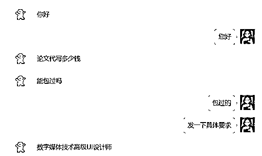

②客户会将要求发给你，然后就需要在心里报价，然后告诉客户

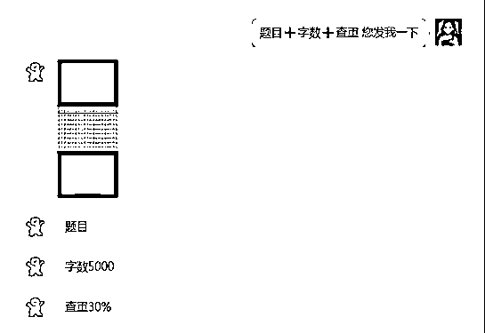

③重点来了，我这里报完价了，说清楚了如下服务，客户仍然觉得贵，但是千万不要放弃！

我们用话术拉扯一下，但是最后实在是拉扯不动，客户都说不看质量，只看查重。那就适当的降一下价格，因为是纯利润，哪怕少赚点也都是赚。

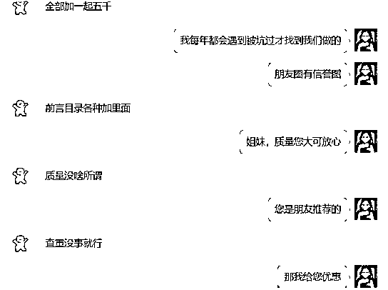

这里客户问优惠多少，已经是有戏了。只要价格谈好，肯定就拿下了。这里我直接优惠60元。但是客户仍然想继续砍价，看话术。

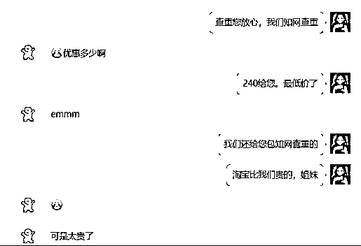

⑤客户还想砍，我们这时候可以说的坚决一点儿。

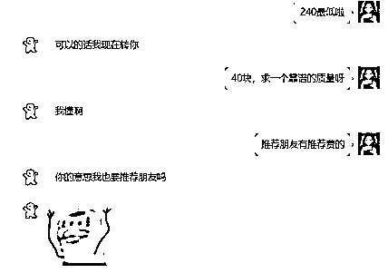

这里基本上就已经成了。为什么，因为客户不再纠结价格的问题，而是在问论文完成的时间。这里就说明已经成了，接下来就是付款的问题。

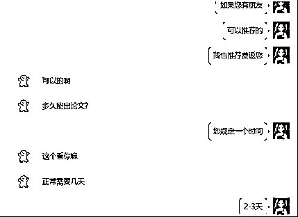

⑥收款，销售完毕。

我这里遇到的客户是比较好的，直接就会支付你定金。当然有一些客户会问如何支付，这时候要说支付宝付款，朋友圈都是信誉图的之类的话术，去拉近与客户的距离

尽量不要微信去收。

# 三、小红书课程

## 3.1创建账号及相关养号步骤

### 3.1.1建立一个全新的小红书账号

把名字，简介，背景图，头像修改成专业号的样子。如图所示

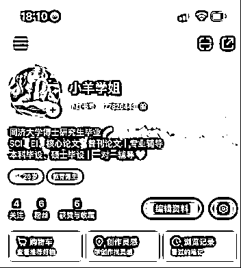

### 3.1.2寻找对标账号（3-5个）观察

注意：蓝V账号1-2个，无蓝V认证账号1-2个，粉丝多一点的。并关注。研究其创作类型。小红书搜索关键词：论文，论文写作，论文辅导，毕业论文等即可

### 3.1.3拆解研究完成后请及时复盘

找出对标账号的共性，一般找粉丝多一点的作为对标账号，前期分享以干货为主，先涨粉再说。

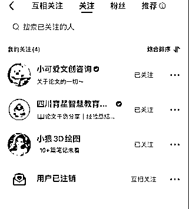

## 3.2、0基础3分钟：爆文笔记公式

1.笔记维度

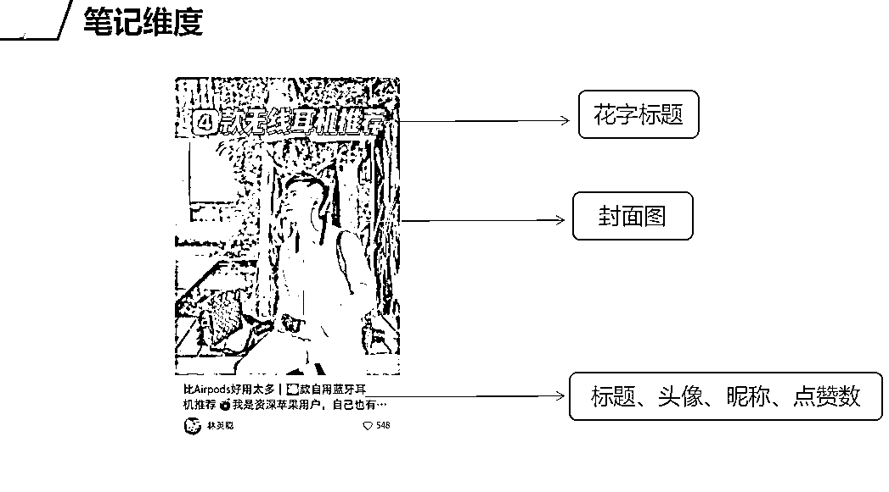

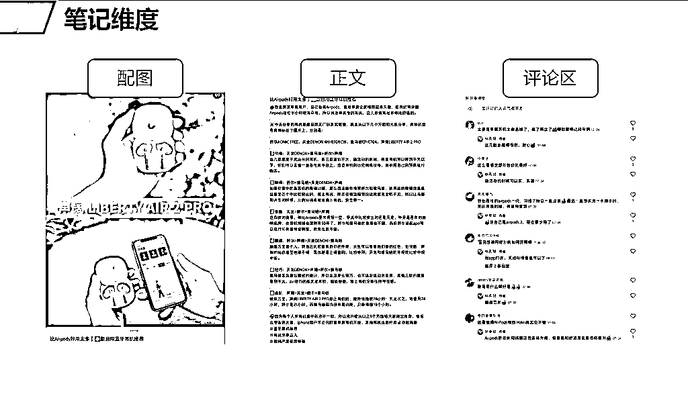

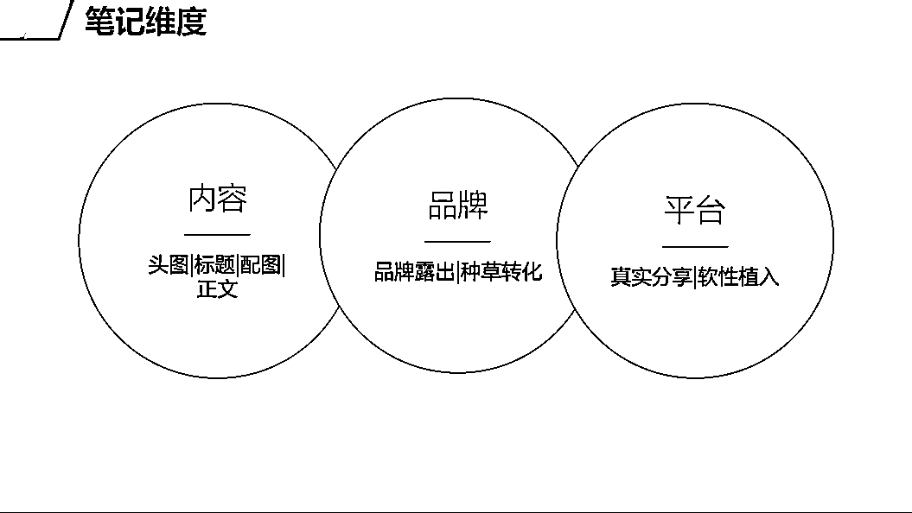

2.头图公式

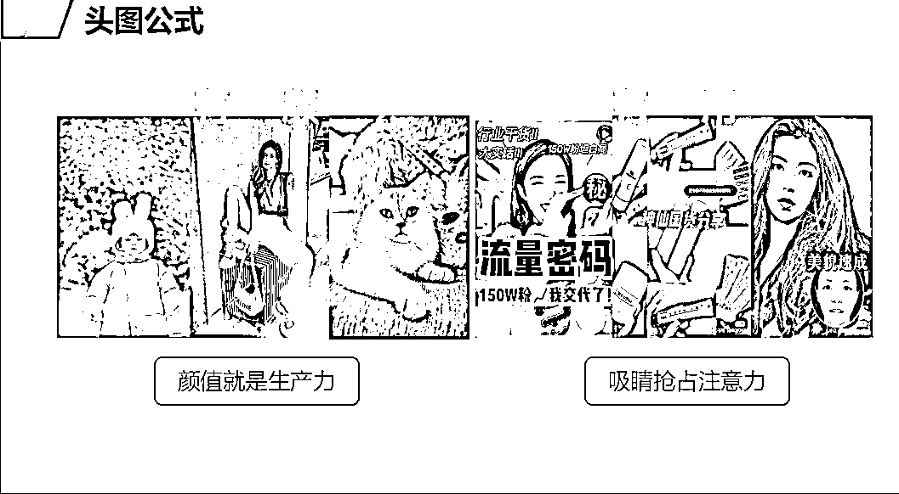

3.头图优化案例

添加文字，凸显重点，可以美观头图。

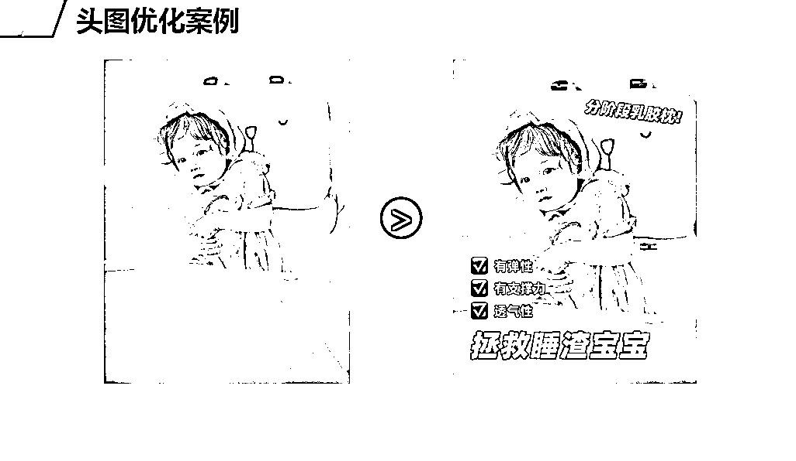

4.标题优化技巧-关键词联想

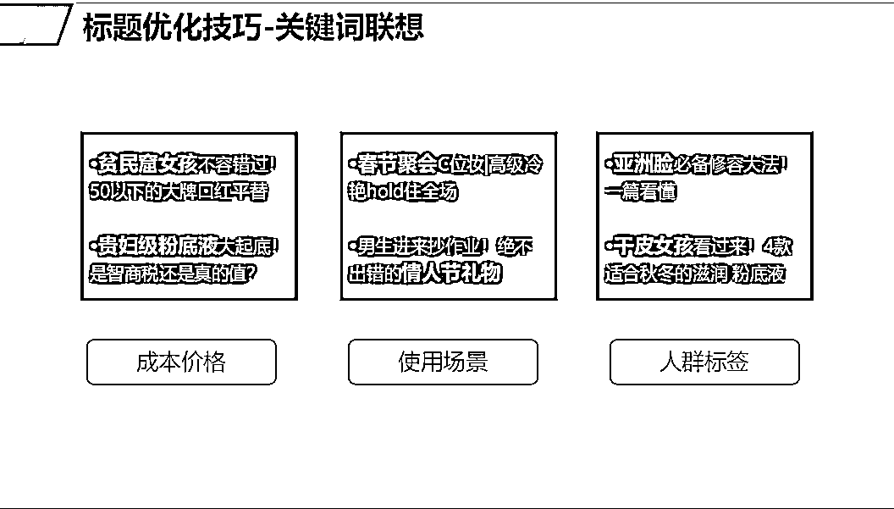

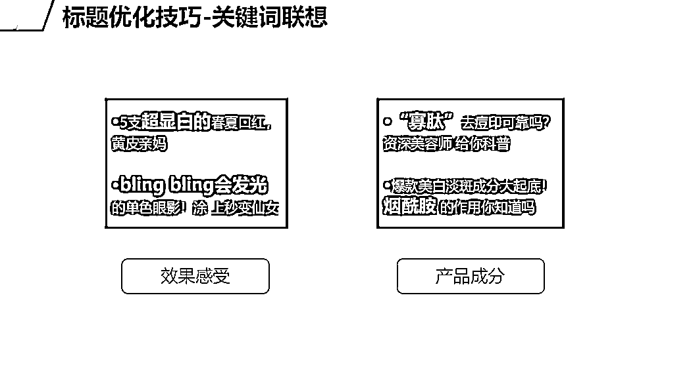

5.标题公式

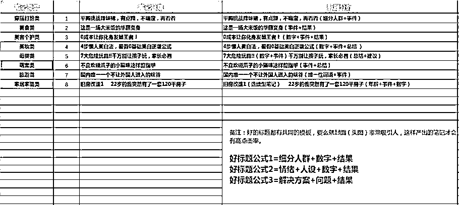

6.配图

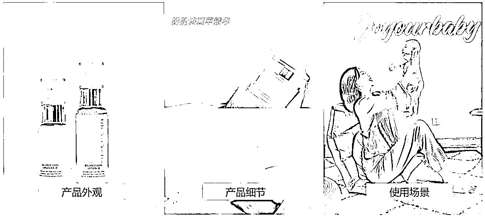

7.正文

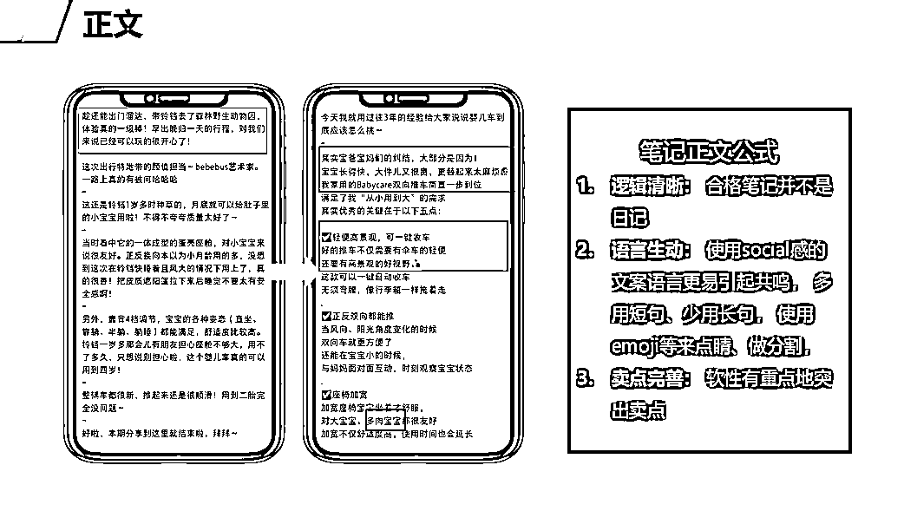

8.过审秘籍

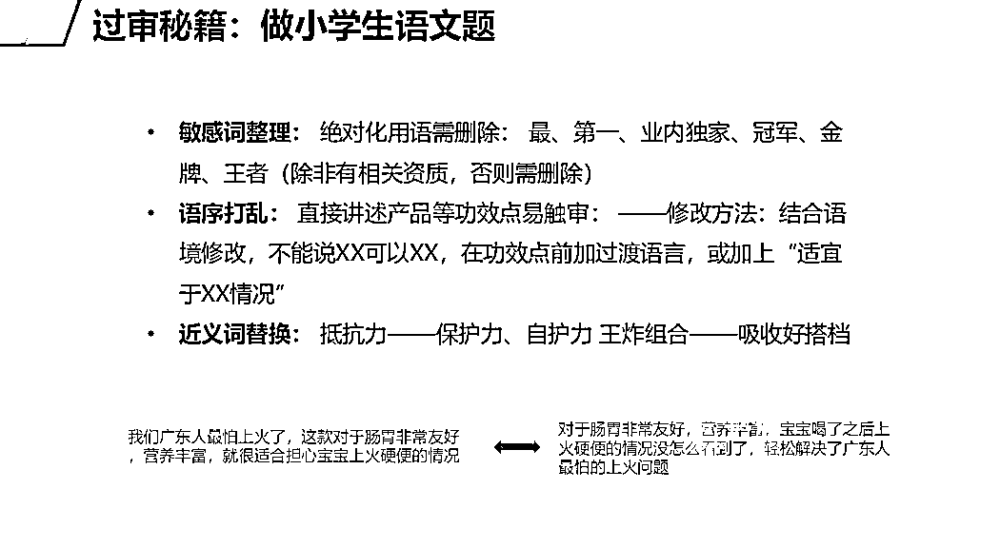

9.零克查词，检测违规词

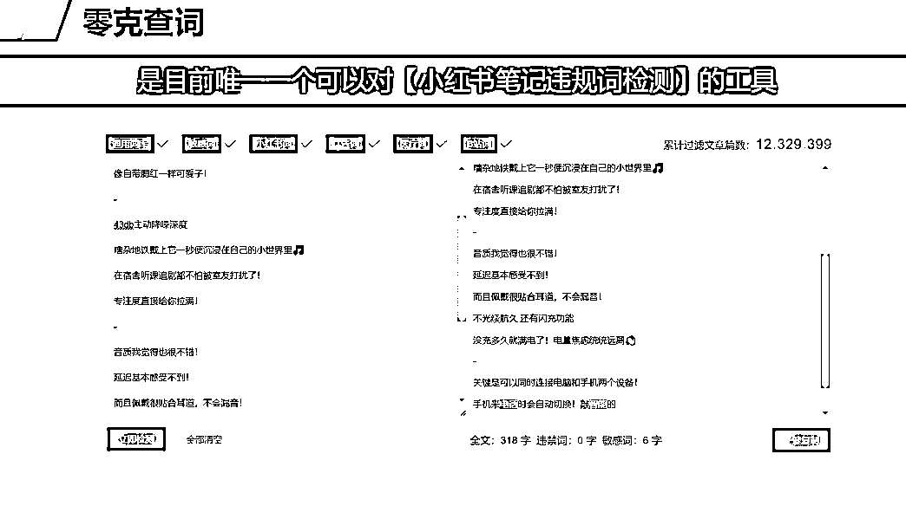

10.千瓜平台，热点词检索

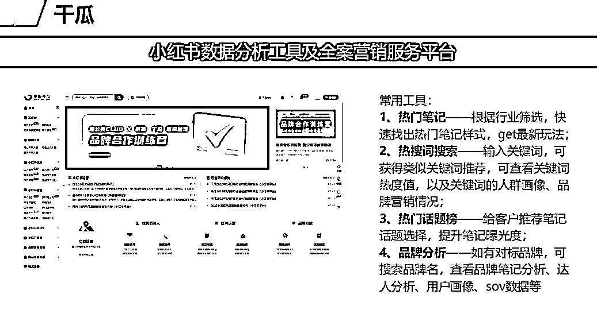

### 3.2.1图片素材寻找

星泽试过了众多图片素材网站以及平台，但都不如我们本身在用的黄油相机。充一个会员，模板免费使用。

首图永远是最吸引的地方，建立起初次印象非常重要。

具体怎么润色加工，因为电脑无法操作黄油，只能自己在手机黄油探索。但其实很简单，后面我出一期视频，很简单的润色。黄油相机可以在抖音也有课程，大概就是配文字，优化图片等操作。

后面的图可以用一张微信信誉图即可。每一篇笔记可以3-4张图。

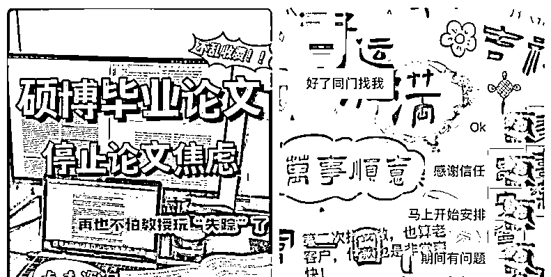

### 3.2.2文案制定

文案模仿同行即可，用GPT进行润色，改写。文案最后，#键可以关联相关的信息，如论文辅导，论文写作

### 3.2.3薯条加热

笔记发布之后，右上角三个点，出来后，下面可以进行薯条加热，虽然可以薯条加热，但是还不足以进入白名单，还需要配合企业号进行。

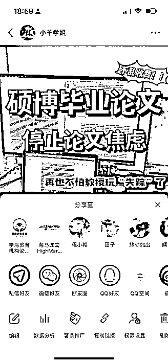

# 四、GPT相关指令

## 4.1选题

在报价完成且客户付定金后。这个时候就可以开始完成交付了。

第一步：确定选题。首先需要确定题目，如何确定题目，在你像客户问要求的时候，客户会告诉你的他的专业/研究方向。那么我们只需要让GPT根据这个关键点去列题目即可。

指令：根据XX专业/研究方向，列五个专科/本科毕设论文题目，不需要对题目做任何的解释。

优化后的指令：根据XX专业，列五个本科/专科毕设论文题目，不需要对题目做任何的解释，不要实证研究，不要数据分析类型的，题目必须纯理论。

这里选择列五个，发给客户后，让客户进行选择就好。

如果没有满意的，客户会进一步提出他的要求。这个时候只需要这样做：

例如，客户的不满意意见是：这些题目都太广泛了，老师不会同意的，要更细一点。

这个时候的指令改变如下：

你上次列的题目已经很不错，但唯一的不足：就是太广泛了，请修正这个缺点，将改善好的题目发给我。

## 4.2大纲

一般的毕业设计大纲都是这样：

题 目

摘要（对全文的概述）

关键词：（摘要中的几个关键词，至少3个）

Abstract（英文版摘要）

Keywords（英文版关键词）

一、绪论/引言（绪论=引言） 此处的标题称为一级标题

1.1研究背景（二级标题）

1.2研究意义

1.3国内外研究现状（也叫文献综述）

1.3.1国外研究现状（三级标题）

1.3.2国内研究现状

1.4研究内容与方法

1.4.1研究内容

1.4.2研究方法

备注：第一章都是绪论/引言。包含研究背景意义等内容，不论题目是什么。

二、XXXX

2.1

2.2

2.3

三、XXXX

3.1

3.2

3.3

四、XXXX

4.1

4.2

4.3

五、总结与展望（总结与绪论一样，不管题目如何，基本上都是这样）

5.1结论

5.2展望

参考文献

拿到题目后，就可以让GPT去列题目了。指令如下：

题目是：XXXXXXX。请根据这个题目列一个专科/本科毕业论文大纲，要求是五个章节，第一章为绪论，最后一章为结论。

优化后的指令：题目是：XXXXX。请根据这个题目列一个专科毕业论文大纲，要求是五个章节，第一章为绪论，最后一章为结论。一级标题为一、，二级标题为1.1，三级标题为1.1.1，每个标题下面不需要出现文字说明。

## 4.3填充大纲

大纲出来以后，就是填充大纲即可，让GPT去帮你完成就可以啦。GPT完成的论文可以直接过查重，无需降重。AIGC的检测，用我们的指令，也可以规避掉很多，而专科的学校好处还在于，他们学校并不会要求AI检测。

# 五、结语

以前完成一篇2000字的大概半个钟，甚至更久，现在用了GPT基本上10分钟出一篇字数更多的文章。

每年的9-来年的6月份都是旺季，2月份更是旺季中的旺季。趁着旺季结束，将这个项目分享给各位，希望大家都能靠这个项目挣到第一桶金！

另外，星泽团队也在招人，感兴趣的小伙伴快加入我们，我们目前是第四期私教课程哦。

有不懂的问题，或者哪里遇到问题了，可以在微信上私信星泽，星泽会为大家具体讲解，并根据大家反馈的问题，不断迭代优化课程。

攀一座山，看一场雪，追一场梦！

感恩遇见！