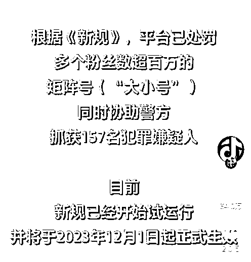
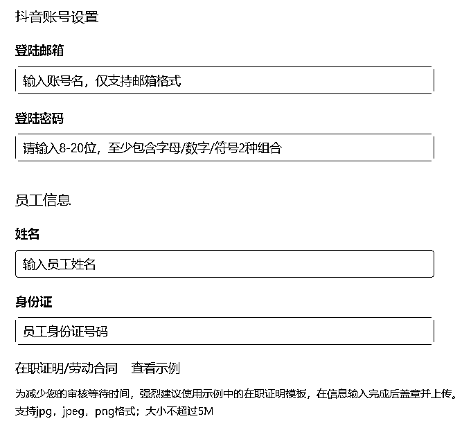
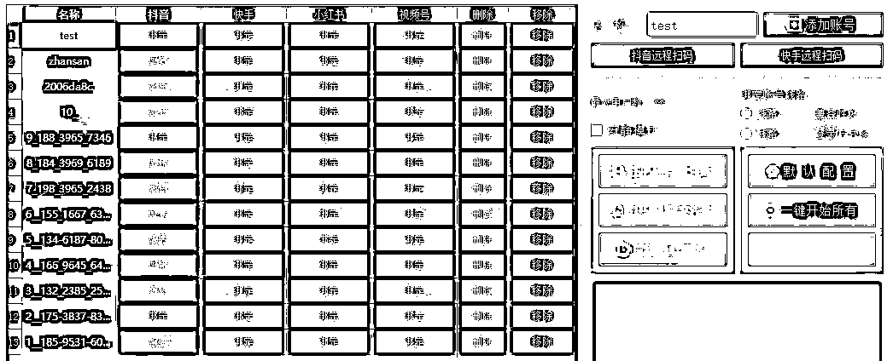

# 如何从0到1搭建短视频矩阵

> 来源：[https://deepaigc.feishu.cn/docx/KLSadgk0Co5xyvx831ZcL4gOn2g](https://deepaigc.feishu.cn/docx/KLSadgk0Co5xyvx831ZcL4gOn2g)

流量越来越贵，获客成本越来越高，内容竞争越来越大。靠单一平台、几个账号，已经很难把流量做起来了。未来做短视频矩阵可能会成为中小商家的首选。今天我们就拆解一下企业从0到1搭建矩阵的详细流程，按照这个流程，开始只要跑通几个账号，后续复制就比较简单了。但是在开始之前，我们首先要了解平台规则，不要做违反平台规则的事，那样是不长久的。

# 一、抖音新规禁止矩阵号不当引流，23年12月1日开始实施

抖音最近更新了《抖音矩阵号不当行为治理规则》。新规明确表示，平台将严格打击有组织批量发布违法违规或低质同质内容的矩阵号；或者自身发布内容未违规，但通过其他违规账号（小号）引流不当获利的账号（大号）。

# 二、什么是短视频矩阵？为什么要做矩阵？

矩阵可以分为横向矩阵：多平台运营；纵向矩阵：同一平台运营多个账号。

做矩阵两个主要目的：

1、降低风险：平台封号很常见，多账号运营可以增加抗风险的能力；

2、放大流量：平台的流量分配有一定的随机性，多一个账号就多一份被推送的几率。同样的内容发在不同账号上，可能数据差别会很大。所以我们以数量来对抗算法的不确定性。

# 三、短视频矩阵运营的三个核心要素

做矩阵的秘诀就是“多”和“快”：账号多、剪辑快。先解决账号问题，再解决内容制作和发布的效率问题

## 1、账号如何解决？

矩阵运营通常需要几十甚至上百个账号，这些账号从哪里来？我们以抖音为例。

首先准备一张营业执照，然后注册抖音企业号，再申请蓝V认证。认证通过后，可以打开抖音企业号管理后台：

https://leads.cluerich.com/pc/growth/home

选择“矩阵营销”模块中的“员工账号”功能，里面有两个选项：“企业员工号”和“员工个人号授权”。这两个有什么区别呢？

首先说“企业员工号”。员工号也叫邮箱号，意思是用邮箱就可以注册并登录抖音，不需要手机号码。

蓝V账号是分等级的，普通等级的可以开通5个企业员工号，黄金等级可以开通50个，最高等级可以开通1000个。

一张营业执照可以认证两个蓝V号。也就是说，如果我们是黄金等级的蓝V，一个企业可以开通100个员工号加两个企业蓝V号，一共102个抖音账号。

员工号申请只需要提供邮箱、身份证号码、在职证明。邮箱随便填就行，因为不需要验证，所以填个不存在的也没问题。员工号跟个人抖音号不冲突，也就是一个人可以同时拥有两个抖音号；员工号可以开直播，挂小黄车等，且资产属于公司，员工离职后可以将账号继承给其他人。

多账号的另外一个解决方案就是“员工个人号授权”。就是将员工自己的抖音账号授权为员工账号。但是所有权是属于员工的。这里不建议直接用员工个人号授权，而是利用这个功能，将新注册的抖音号转为员工号。也就是购买多个新的手机号，注册多个抖音账号，然后在这里授权成为员工号；这种方式跟前面说的邮箱号，区别在于邮箱号需要实名认证（登录时要本人刷脸）；而个人号授权只要不跳核对，不实名也可以（只要购买的手机号段和登录时使用的设备足够干净，是有很大概率不跳核对的）。未实名的个人号可以用来发视频、挂在线预约、表单等营销功能，但是不能开直播。

上述两种方案结合使用，基本上至少可以搞定几十个账号了。

## 2、账号如何管理？

几十个账号需要准备几十部手机吗？答案是不需要。我们可以借助矩阵系统来实现多账号管理。

矩阵系统有两种版本：

一种是网页版（SAAS系统），打开网站就能用；另外一种是本地版，需要在本地电脑上安装客户端软件。

网页版矩阵系统界面长这样：

只要把我们注册的员工号扫码绑定到这个系统，就可以实现批量化管理，一键上传、发布视频，查看播放数据、回复私信等。也可以设置智能发布，就是每天定时、定量发布视频，摆脱繁琐的人工操作。目前这种系统支持抖音、快手两个平台，而且使用的是官方接口，所以不会有封号、限流等风险，但前提是一定不能发布违规内容。

值得一提的是，抖音从去年12月初开始限制申请新的接口，目前市面上能用的矩阵系统基本上都是以前申请的老接口，所以最近一段时间有很多实力不强的公司因为接口问题跑路，导致很多购买了系统的人不能正常使用，这个问题需要注意，未来可能会更紧张。

本地版矩阵系统界面长这样：

跟网页版相比，本地版除了可以做抖音、快手以外，增加了视频号、小红书两个平台，还可以发抖音图文

矩阵系统的核心功能就是多账号批量管理、批量发布。至于其他AI文案、AI剪辑之类的，在我看来不过是辅助功能，可有可无，有很多更好的替代工具。因为都是用的官方提供的开放接口和功能，而且设置了IP隔离，所以正常发布视频，不会有限流、封号等问题。

## 3、内容如何制作？

前面两个问题属于基础设施，都不难解决，比如营业执照、蓝V认证、等级提升、注册用的手机号、矩阵系统、剪辑工具等等，可以说用钱都能搞定。真正的考验是第三个环节：如何持续生产高质量的视频内容？特别是对于中小商家来说，难度其实是很高的。因为做矩阵意味着每天要生产和发布大量的视频内容，而且抖音新规严格打击批量发布低质同质内容的矩阵号。 这就要求我们现在正在做矩阵，或者未来想入局的玩家，必须解决内容生产力的问题。最好从一开始就做好内容规划，包括素材来源、视频形式、发布频率、引流转化SOP等。

市面上所有卖系统的都在宣称矩阵系统的AI批量剪辑功能，可以一天生产几千条混剪视频。我们跑过简单的混剪视频，实际观察下来，这种视频是很难有播放量的，大多数都是个位数，成为爆款的概率更加微乎其微。特别是在新规则的影响下，不但限流，还有封号的可能，因此我们不建议大家用这种方式生产内容。

那么什么样的视频才符合平台所要求的高质量、不重复的内容呢？我的建议是：做出能打60分的视频即可。不要追求80分、90分甚至满分，那个不适合大多数人，而且制作成本高、产量也有限，不符合矩阵的需求。但是也不能做2、30分的垃圾内容，用户不爱看，平台也不推流。那么如何快速批量生产60分的视频呢？

我们重点分析一下这个问题。

矩阵短视频的内容形式主要有三种：真人出镜的口播视频；产品展示视频；直播切片。

如果全部是产品展示，广告意味太明显，不推荐；纯口播视频，太单调，观众容易疲劳。最好的方式是真人口播+产品（店面）展示混剪，这样既能提高视频原创度（真人出镜原创度肯定是最高的），也能提高生产效率（混剪视频可以借助工具批量制作）。如果你有在做直播，那么可以加上直播切片的内容。

产品（店面）展示素材拍摄很简单，用手机对着目标多角度、大量拍就可以了；真人口播也不复杂，但是有一个问题需要注意：如果我们把同一段真人口播视频，批量发布到多个账号上，理论上也是有可能被判重复的。

因此我们需要做一些调整：

用专门定制的工具，把同一段口播视频自动、批量地更换背景（背景可以是图片或者视频）：

用工具批量对视频进行自动抽帧、变速、调色等，尽可能改变每个视频的参数，以降低重复概率

通过上述调整，我们就可以快速制作出高原创度、不重复的视频内容，再通过矩阵系统自动分发，工作效率大幅提升。

最后，如果你有做直播，那么直播切片也是非常好的矩阵素材。

直播切片的难点在于剪辑。一段两小时的直播录屏，从中挑选出精彩片段、高光时刻，非常耗时耗力。而做矩阵必须要考虑效率问题，任何环节如果不能高效完成，那么做矩阵就无从谈起，最终还是会回到一个人只能负责几个账号的原始状态。为解决直播切片的效率问题，我们也尝试了很多的方案，目前的方案可以说是效率最高的：

利用工具把直播录屏按直播话术自动分割成多个视频片段，每句话一个视频片段，且每段视频用话术命名，也就是说只要看文字就知道对应的视频片段在说什么内容，然后根据需要把不要的片段删除，再把需要的片段合成为短视频，做矩阵分发。这样大大提高了直播切片的效率：

这个方法同样适用于口播、短剧等有大量文案的视频剪辑。

关于短视频矩阵，大家有什么问题可以在评论区留言，我会解答并定期更新在文档中。感谢阅读！