# 从200元到25W+，小红书无人直播30天踩坑到爆发复盘贴

> 来源：[https://iqwin9cn5r.feishu.cn/docx/KfiwdVNIuo8v3mxYZbFcPrJmnQe](https://iqwin9cn5r.feishu.cn/docx/KfiwdVNIuo8v3mxYZbFcPrJmnQe)

## 前言

大家好，我是梵野

一个普通的90后宝妈

熟悉我的人应该知道

这两年我一直深耕视频号

今年视频号迎来了大爆发

我们团队因为一直在视频号赛道

所以也吃到了一波肉

今年11月底的时候，正好视频号属于一个玩法更迭的时期

我们一边探索视频号新玩法

一边把目光放在了小红书

去看小红书是因为

我们在今年6月时候跟风做过2个月店群

3个店GMV大概20W+

下面是其中一个店铺的数据

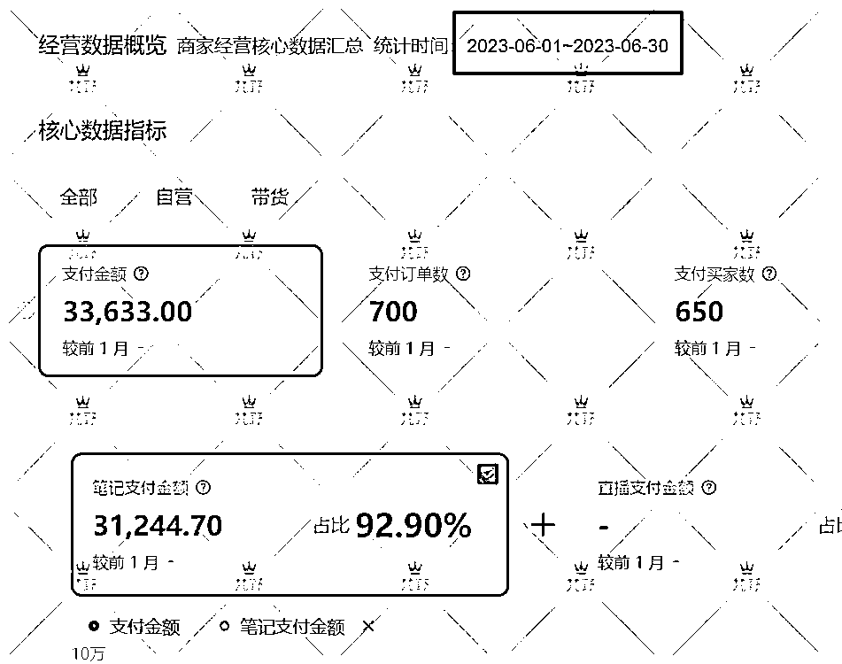

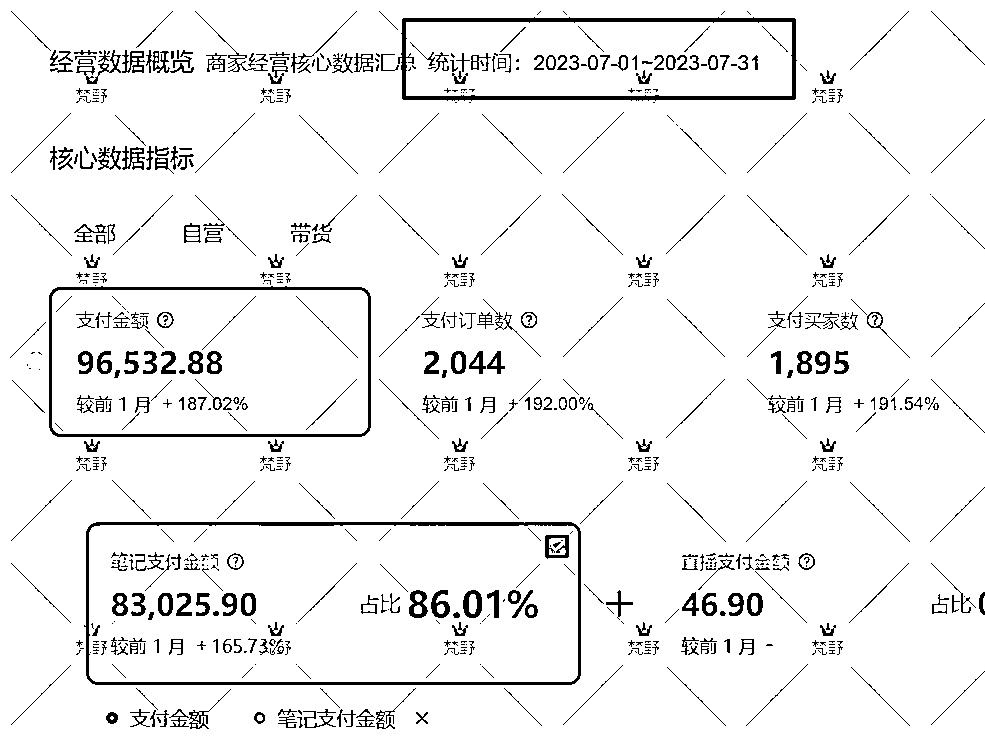

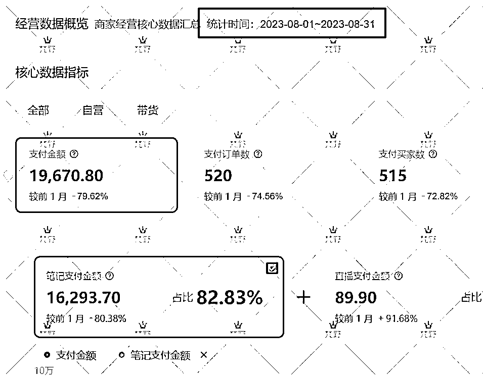

后面因为无货源稽查加上我们的主要精力在视频号

所以后面就放弃了小红书店群玩法

也是因为有了之前店群的基础

11月底时候

我们分了2人小团队去测试小红书直播

最开始一天只有几百GMV，月中加设备

到现在30天过去了

我们累计GMV达到了25W+

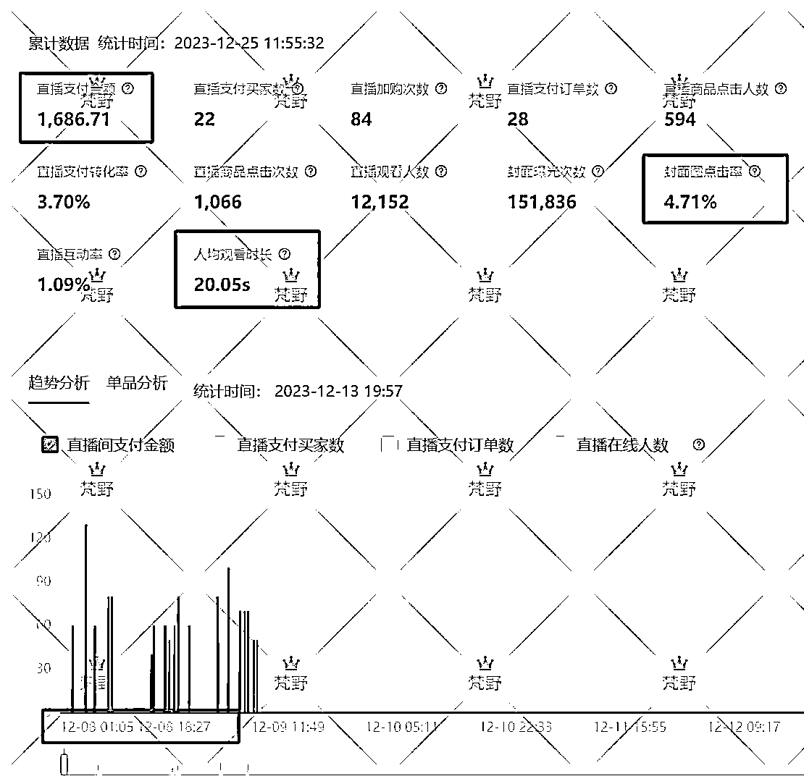

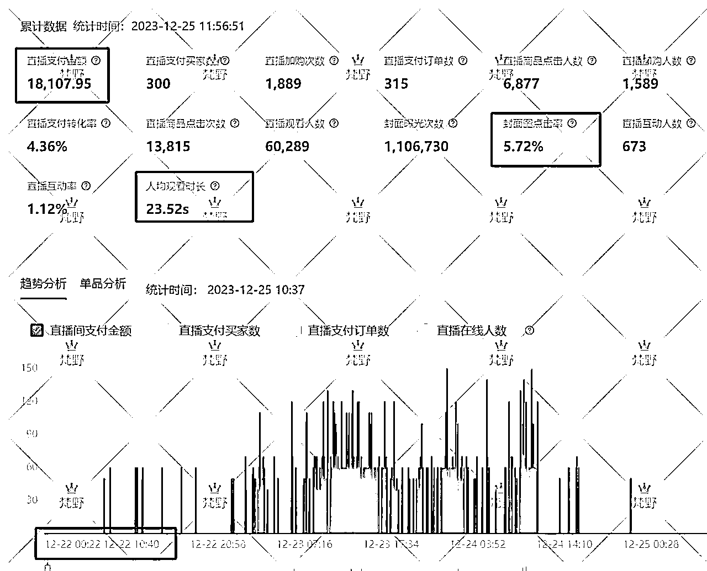

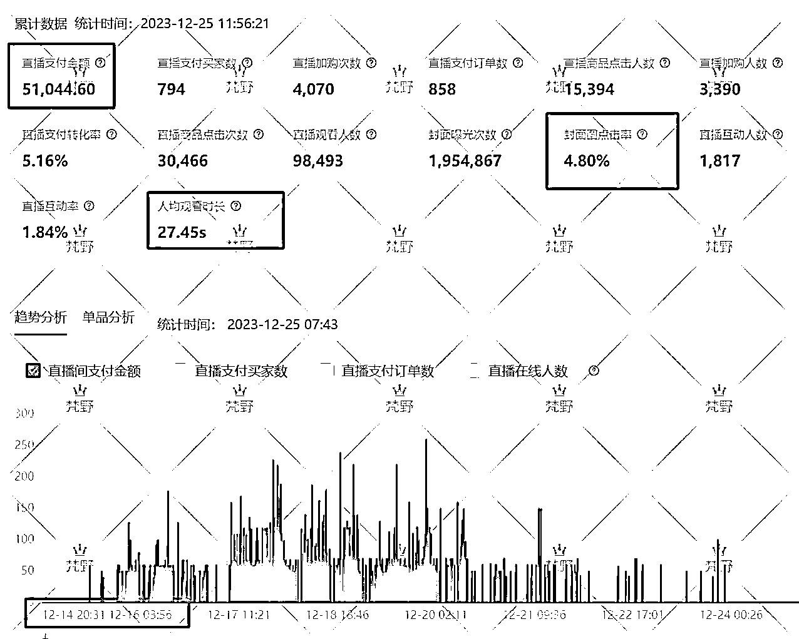

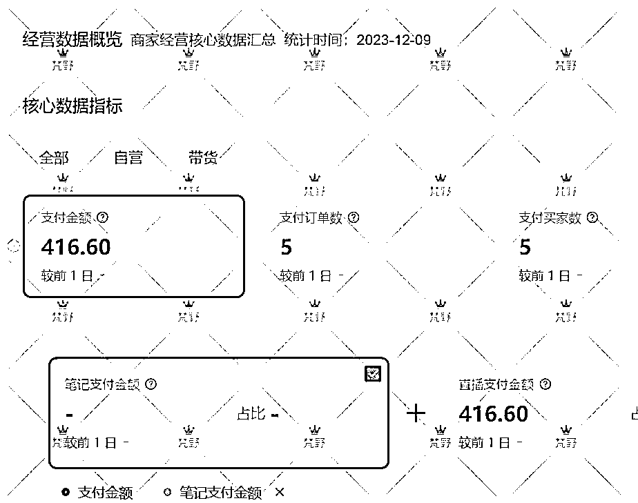

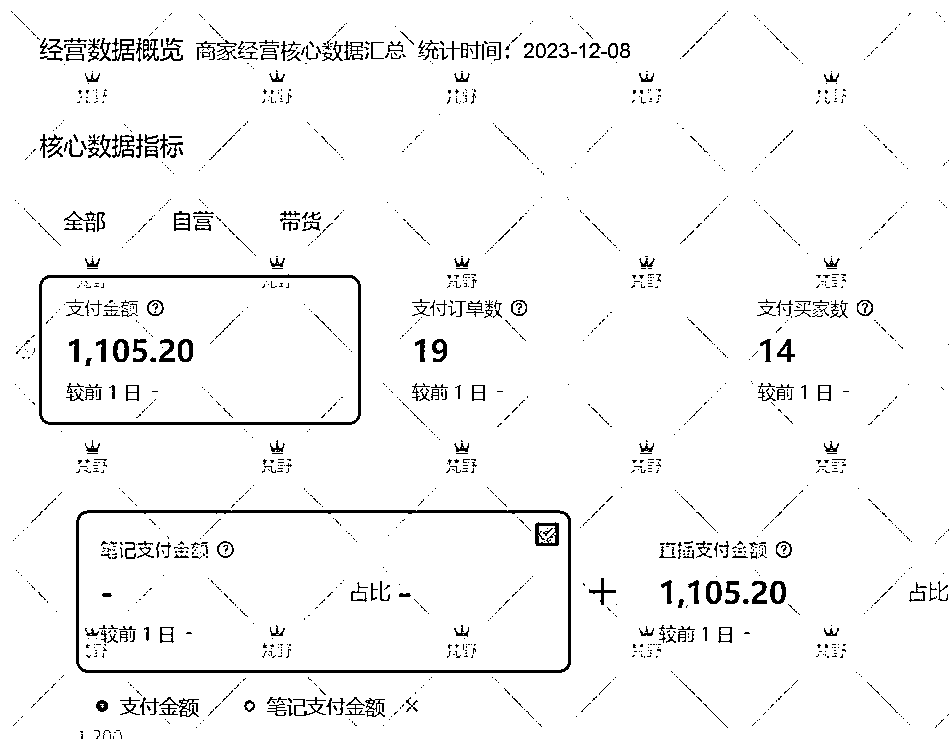

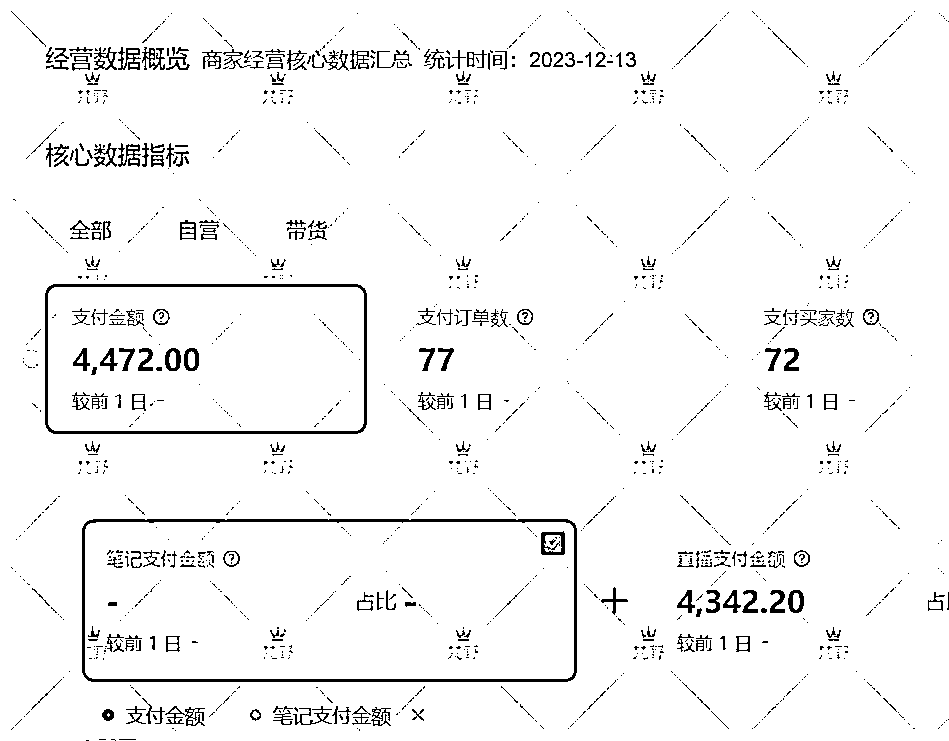

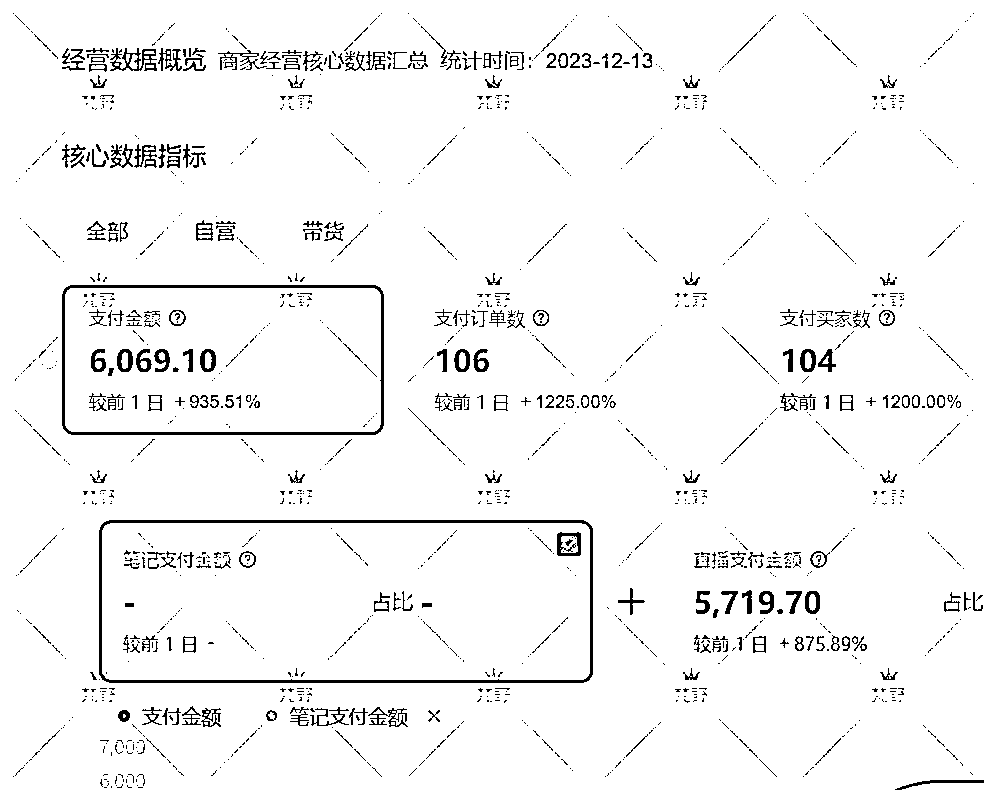

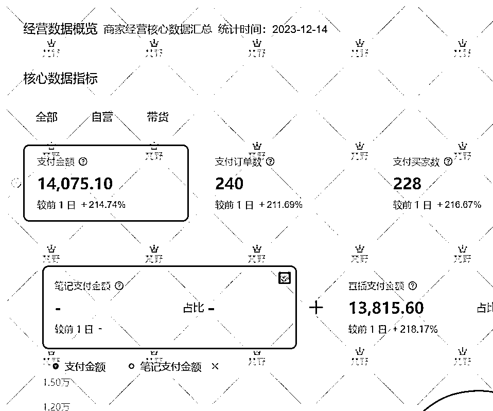

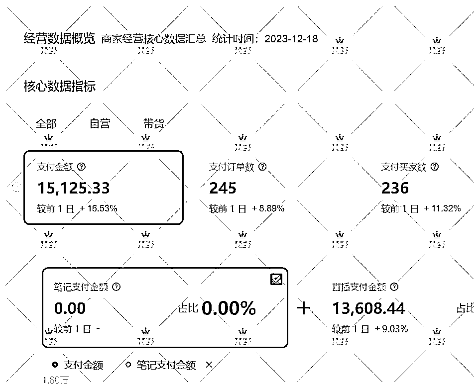

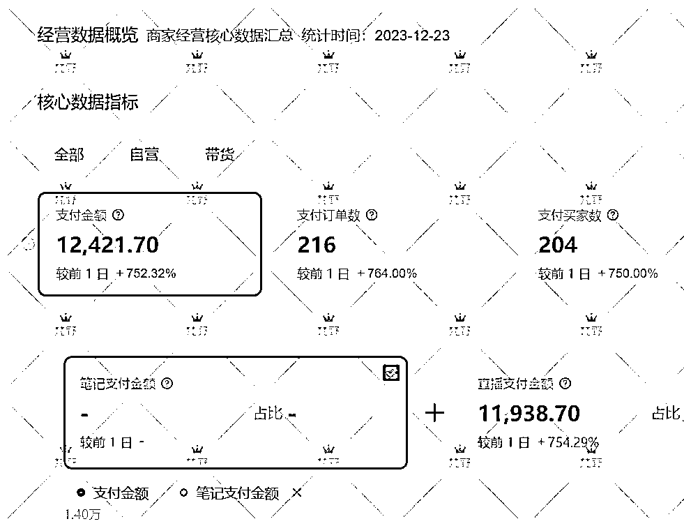

上面是部分数据图，可以看到从月初开始，几百块的GMV，到月中大几千，到现在是几万GMV

一路踩坑，一路进步

现在也算是一个阶段性突破

全流程已经十分熟练

昨天我们把小红书无人直播小组

新增18台电脑（租赁）

30台手机，准备按照已有的25W+的流程

风口项目，而且是趁着平台还没有进行严格监管

放大再冲一波，先赚一波快钱，过个肥年

下面是我们30天的详细复盘，希望对大家有所帮助

## 一、项目简单介绍

小红书无人直播的基础逻辑：录制抖音、快手直播间素材，然后通过OBS软件把素材在小红书直播循环播放，0粉开店，直播挂自己店铺链接，出单后去1688拍单，赚取差价。

优势：易操作，只需要电脑、执照、拍单货款就可以完成整个闭环，选对品就是睡后收入

劣势：风口项目，短期红利，趁着平台还没严格监管偷偷捡钱，如果抱着长期去做的心理，就不建议去尝试

## 二、踩坑经验

### 1.选品踩坑：

#### 跟品：

一开始我们按照之前做店群的思路去选品，简单来说就是跟爆款，在小红书刷新出来的爆款，只要符合纯直播不发笔记，场馆大于5000+以上，店铺出单销量不错的直播间，用他们在播的款去抖音找这款产品的直播间，尽量做到和爆款直播间相似的直播场景，抖音账号也是要符合粉丝数量少，在线多，非投流

但是做了一周后发现，这种思路是可以出单，但是一直维持在几百块GMV或者好一点一千多GMV，不是我们预期的数据。当然这种思路适合新手，他能很快取得正反馈。

讨论后我们决定，发挥自己团队的特长：自己选品

#### 选品：

我们对小红书人群做了细致的分析，小红书的人群画像和需求众所周知，小红书粉丝一般是年轻女性，18-35岁，这其中还可以细分为很多人群，比如：学生群体、新锐白领、精致女性等等，但是共同点都是对产品要求要有调性和审美，其次，每个年龄段根据年龄和季节又有不同需求的变化，女装、食品、百货都是不错的赛道。

通过人群细分，我们再用第三方软件考古加根据这些人群年龄段和喜好，筛选出一部分品，再根据品去找对应要求的直播间，自己测品虽然才开始慢一点，但是出爆款的概率很大，我们也从几百GMV突破到了2000-3000GMV

### 2.直播素材踩坑：

#### 录制：

最开始我们用的小绿点录制，最后发现它后期要收费，免费只能一台电脑录一个直播间，限制的是机器码，对于我们做矩阵来说很不方便，如果自己低成本测试可以试试

录制工具小绿点: https://www.maijiacanmou.com/218.html

后面我们找到好用的工具就是江湖，江湖也有一点弊端就是录制会有不稳定时候，偶尔会断录，但是总体俩说还是挺好用。

#### 素材处理：

经过死了几个号的测试，素材录制时间最后测试出来2小时以上比较好，最开始我们做的比较粗糙，素材也没有去精剪，出现了很多违规词，抖音、猫猫店、抖店、快手，视频号绝对还有很多明令禁止的词语，最开始我们没有注意违规词，导致了很多账号直接死了

经过几天调整后，我们把素材时间严格控制在2小时以上，素材全部过一遍飞书妙计，把违禁词挑出来，因为飞书妙计可以显示在几分几秒出现了违禁词的，所以很方便我们在剪映找到对应时间段减掉，大大提高了效率

素材处理后把素材添加到OBS中，OBS的设置：视频-基画布分辨率:1080x1920，声音设置-编辑高级音频属性-把要播放的视频打开为监听并输出，码率设置6000，启动虚拟摄像机。

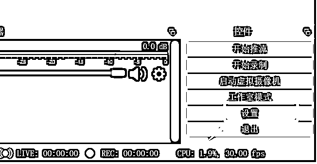

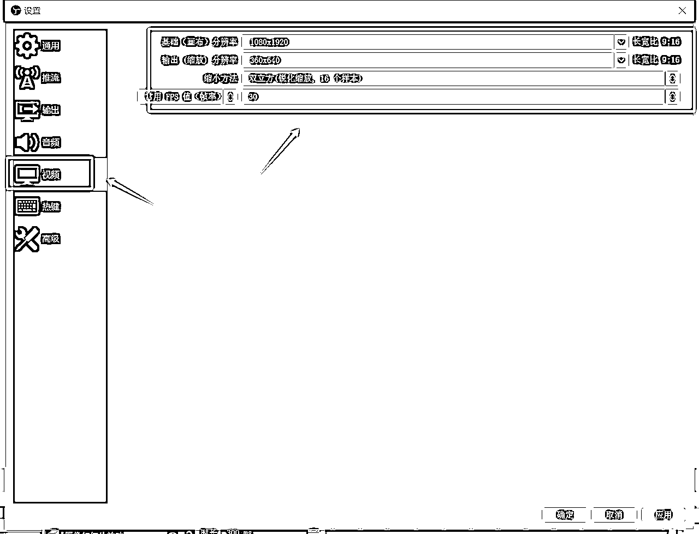

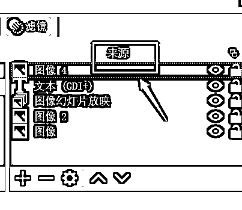

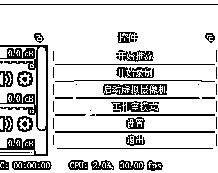

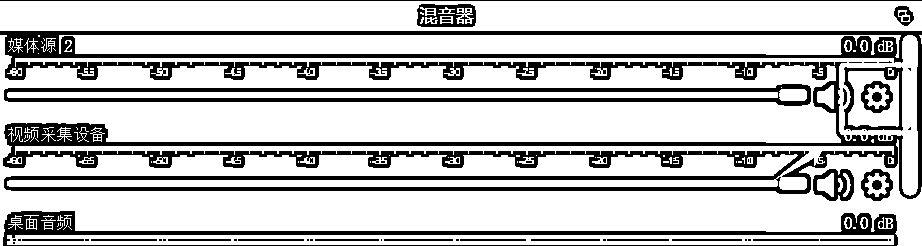

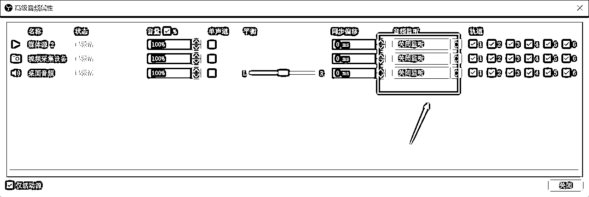

打开小红书直播助手https://www.xiaohongshu.com/zhibo/robs，选择 OBS 虚拟摄像头即可

### 3.封面踩坑：

封面一开始我们认为不重要，基本是以产品图或者直播素材的画面作为封面

但是发现直播间的点击一直上不去，点击上不去导致场馆一直没有突破

但是因为有之前做小红书店群的经验，我们立马意识到，小红书直播和笔记一样，封面点击占比很大，立马修改了选封面的思路

最简单是就是抄爆款封面、标题，搜这个品的爆款笔记，因为这个封面标题是已经验证过的，直接拿来用即可

以数据来判断：封面点击率大于4%，是判定这个封面好不好的标准，如果低了可以下场直播再换

### 4.测品踩坑：

不要太心急，一开始做的时候我们因为换品和换素材太频繁浪费了很多时间

一场没起来我们就换品和素材了，太心急了

虽然品是有生命周期，但是测试一定要有耐心

后面总结经验：

一个品多个账号去测试，一般我们用3个号去测品

以4-6小时为基准，最开始每场只要正常进几百人，那说明账号是正常的

三个号用不同直播间素材，测试哪个素材点击、观看、出单比较好

能出单就一直挂着，如果能够做到封面点击4%，观看时长大于20秒

那基本就能迎来爆单，场馆起来后用评论互动插件配合直播间做互动提升转化

### 5.货源拍单踩坑：

目前是需要自己开店和拍单的

所以在选品前就先找好货源，比对好利润比，尤其女装这种退货很高的赛道

我们就做过选对了品爆了，但是按照出单价格去找供应链时候发现一单才赚一块钱多钱

加上退货下来没赚反而亏了，所以供应链一定要提前找好

### 三、总结

无人直播本身就是一个短期红利，废号是正常的，心态是一定要稳。

我们做了20个号，前期测试踩坑浪费了不少，目前有10个号正常运转，我们也每天在加号，标准流程后，测品目前起号率大概在60%以上，只要自己有选品逻辑，爆率很大，而且出违规的号也都是爆过大几千几万GMV的，后期也可以申诉救回，所以就算暂时违规也都不心疼。下图是申诉后成功的号：

这其中经历的各种坑该踩的都踩了，希望对想要去做的圈友有一定的经验作用。

最近如果有在做小红书无人直播的欢迎大家一起交流，大家抱团取暖，2024一起暴富！