# 怎样在航海21天通过ChatGPT编程上线20个Chrome插件

> 来源：[https://kxgiimtbac.feishu.cn/docx/MEIydbm2voKvHfxIC2KcGKO5nkg](https://kxgiimtbac.feishu.cn/docx/MEIydbm2voKvHfxIC2KcGKO5nkg)

1个人，航海21天，上线20个Chrome插件！这是ChatGPT赋予我的过去难以企及的异常编程能力。我怎样通过10个ChatGPT编程思路，构建Custom Instructions指令，让ChatGPT一步步帮助我完成需求分析、开发步骤、文件结构、代码编写、代码审查、生成图标、准备上线资料和推广文案的完整编程流程？我又是怎样把这些ChatGPT编程思路，构建成GPTs，帮助你快速启动和开发Chrome插件、WordPress插件、网站落地页和Python应用？欢迎阅读、交流和指点。

## 目录

*   Code Interpreter和Custom Instructions给我们带来的认知颠覆

*   探索ChatGPT自动化编程

*   探索ChatGPT流程化编程

*   怎样通过Custom Instructions快速启动一个项目

*   怎样通过Custom Instructions二次开发一个项目

*   Code Interpreter编程存在的问题

*   怎样通过合理的ChatGPT编程思路开发更加复杂的产品

*   构建GPTs辅助Chrome插件、WordPress插件、网站落地页和Python应用的启动和开发

## Code Interpreter和Custom Instructions给我们带来的认知颠覆

去年7月份，ChatGPT迎来了两个颠覆我们认知的重磅更新，分别是7月9日上线的Code Interpreter和7月21日上线的Custom Instructions。

Code Interpreter（后来改名为Advanced Data Analysis，现已经整合在GPT4多模态中），其强大的数据分析能力和Python自运行能力深深震撼了我：编写代码、分析文档、编写游戏、生成视频、模拟数据，上线不到一个月，Twitter上有很多不可思议的玩法被一一挖掘出来。更重要的是，ChatGPT不再是单纯生成内容，而是具备执行程序和调试代码的能力。

我一度怀疑之前在航海中分享的ChatGPT编程思路已经过时，然而，经过一番测试之后，Code Interpreter让我惊叹的同时，也让我失望了，面对稍微复杂一点的需求，Code Interpreter一样会出现GPT4 default遇到的问题，也许Code Interpreter的算法内核本质上也是GPT4。随后，我在生财有术发布了一篇文章，复盘了我测试Code Interpreter编程的过程和结果：

如何通过ChatGPT Code Interpreter生成视频特效和编写代码实现Chrome插件

Custom Instructions问世之后，我一开始并没有太关注，生财中相关文章也很少。我试着在生财索引中搜索了一下，相关文章只有6篇，而其中有3篇还是我的好朋友 @文韬武韬 发布的：

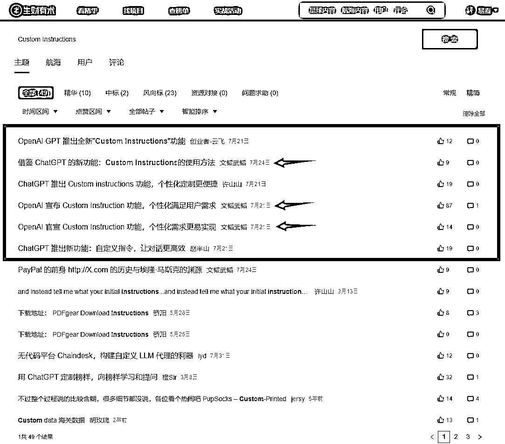

事实上，Custom Instructions对我的震撼一点都不亚于Code Interpreter，而这一切源于我在抖音上看到的一个短视频：

博主声称通过这样设置一个简短的Custom Instructions指令，实现ChatGPT不间断翻译10万字。我开始意识到Custom Instructions结合Code Interpreter可能会产生远超我们想象的能力：

通过Custom Instructions设置预定义的指令，周期性地触发Code Interpreter运行，有可能可以实现不间断的批量处理流程。

想到这一点，我难掩兴奋之情，在OneNote笔记本中写下我想到的可能应用场景，包括但不限于批量翻译、批量写文案、批量处理数据、自动编写程序，等等。

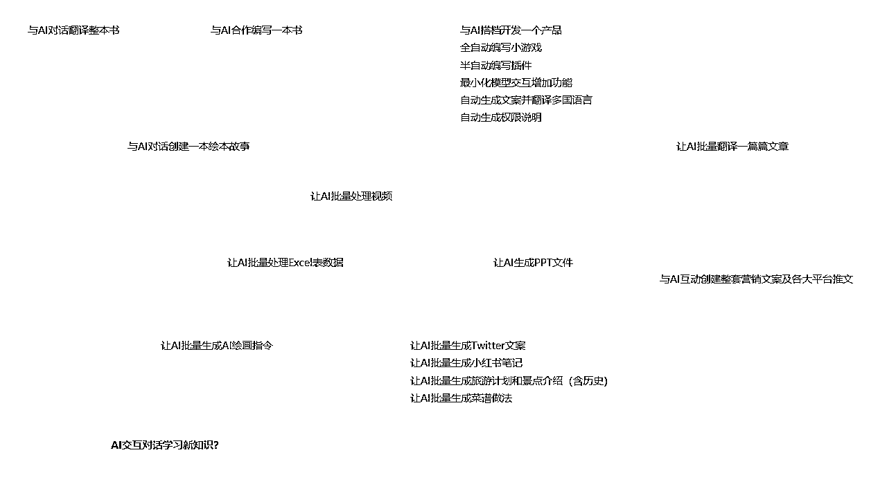

我迫不及待地开始测试这些应用场景，从抖音视频提到的翻译开始，我按博主的指令设置Custom Instructions，然后满怀期待地开始翻译一本几万字的文档，结果翻译了几次之后就停下来，并没有实现博主所说的全自动翻译的流程。然而，我并不死心，通过更换文档、修改指令等方式继续测试了两天，结果全部宣布失败，没有实现我所期待的全自动翻译。我开始感觉我可能被那位博主忽悠了，韬哥也给我泼了一盆冷水，抖音上很多视频都是为了做流量的，只有你才傻傻地测试。

接着，我又按照那位博主的另一个视频，尝试设置Custom Instructions指令让ChatGPT全自动编写一本科幻小说，测了两三天，结果毫无疑问，我大概率又被忽悠了。

我开始思考这里边存在的问题和可能的原因，虽然可以通过Custom Instructions设置预定义的指令，周期性地触发Code Interpreter运行，但可能受限于Code Interpreter运行环境的大小和GPT4本身的上下文记忆限制，并不能真的实现我期望的自动化流程。然而将近一周的测试过程也让我看到：

确实可以通过Custom Instructions设置预定义的指令，来周期性地触发Code Interpreter自动执行一些任务。

这也促使我继续做进一步的探索。

## 探索ChatGPT自动化编程

在测试ChatGPT全自动翻译和全自动写作失败之后，我对Code Interpreter和Custom Instructions的能力和局限有了大致的了解，于是，重新回归到我一直在摸索的ChatGPT编程领域。

我想，目前阶段，让ChatGPT全自动根据我们的需求编写出一个稍微复杂点的项目仍然是不现实的，但是如果我们的需求足够小，小到能在Code Interpreter运行环境的大小和GPT4本身的上下文记忆限制之内完成项目，那是否有可能实现全自动编程呢？我于是开始构造Custom Instructions指令，并做了大量的测试，从最最简单贪吃蛇和飞机大战小游戏插件开始，结果，还真成功了！

先给大家看看我发布在抖音上的视频：

视频本身制做得一般般，也没有给我带来多少流量，但大家应该可以大致看到，我给ChatGPT下达“编写一个贪吃蛇（打飞机）小游戏的Chrome插件”之后，ChatGPT自动完成分析需求、罗列文件结构及逻辑关系、按文件结构编写代码，然后自动审查代码，最后把代码打包成一个zip压缩包的整个过程，其中飞机大战小游戏自动编写过程中出现一次中断，需要输入一次“继续”的指令，而贪吃蛇小游戏则全自动完成了整个过程。

让我欣喜地是，这两个几乎全自动编写的小游戏插件安装到Chrome浏览器后，真的成功运行了起来。而促使Code Interpreter做到这一切正是下面这两段Custom Instructions指令：

What would you like ChatGPT to know about you to provide better responses?

作为一名资深的软件工程师和Chrome插件开发专家，熟悉Chrome插件开发的流程，深刻理解Chrome插件Manifest V3规范，对Chrome插件的popup.js、background.js和content.js之间的通信机制有充分的把控，并且，掌握所有Chrome插件在不同应用场景需要加载调用的js库。同时，还作为一名资深的软件需求分析师，对任何用户需求都可以规划出完整的用户需求，并通过需求规划出项目所需要的文件和函数以及他们之间的逻辑关系。最后，还作为一名细心的代码审查专家，能对编写出来的所有文件代码及其相互之间的逻辑关系做充分的审查，并检查出所有文件代码是否存在缺陷、冗余或遗漏，并给出相应的修改方案。

How would you like ChatGPT to respond?

1、当用户提出产品开发需求时，以软件需求分析师身份，根据需求整理完整产品需求分析，包括逻辑严密、功能完备、UI设计和颜色搭配。保存为“需求分析.md”并提供下载链接。然后，你不要暂停，直接进入下一步操作，不需要我做任何指示和确认。

2、保存到“需求分析.md”完成之后，以软件架构师身份，根据需求分析，罗列Chrome插件所需文件，并用树状结构展示。对每个文件的作用进行说明，注意声明图标。分析文件调用和通信逻辑，保存至“文件结构.md”并提供下载链接。然后，你不要暂停，直接进入下一步操作，不需要我做任何指示和确认。

3、保存“文件结构.md”完成之后，以资深软件工程师和Chrome插件开发专家身份，阅读“需求分析.md”和“文件结构.md”，按顺序编写每个文件的完整代码，保存相应的文件并提供下载链接，对复杂文件先罗列出相应的函数和代码结构，然后一段段输出，每一段都保存更新到相应的文件并提供每次更新的下载链接，文件的代码遵循所有规范和编码，自行检查代码符合需求，接着，你按同样的方式输出下一个文件的完整代码并保存并自行检查代码并做必要的修复，直到你输出你前面罗列的所有文件的代码并提供每个文件的下载链接；然后，你不要暂停，直接进入下一步操作，不需要我做任何指示和确认。

4、接下来，以软件测试工程师和Chrome插件开发专家身份，重新认真阅读文档，分析所有代码文件。检查代码符合需求、逻辑正确，并核对已编写的代码文件是否符合文件列表结构，是否有遗漏。重新输出并检查代码直到无误。判断是否需分多个压缩包打包。保存为“代码审查.md”并提供下载链接。然后，你不要暂停，直接进入下一步操作，不需要我做任何指示和确认。

5、最后，整理所有文件并保存为相应文件名，放入插件文件夹中。压缩所有代码为一个或多个zip格式压缩包，并提供下载链接。操作完成。

注意：上述所有步骤你都Step by Step自行运行，不需要询问我任何要求和确认，包括文件的功能、函数的逻辑和对象的特性等，所有这些你都根据需求分析自行做决定，也就是说，你必须自行一步步地完成需求分析、文件结构、所有代码文件的编写、代码审核和打包代码所有这些步骤，中间不需要我做任何确认。

这里边的关键是第二段指令“How would you like ChatGPT to respond?”，我通过预定义的指令设置好ChatGPT的执行流程，而触发ChatGPT不断运行的关键点则是保存文件，因为每次保存文件的时候都会触发Code Interpreter运行模拟环境，自动完成与浏览器端的交互，从而避免单次会话输出内容过长出现中断的问题。

那么，我们是不是可以这样让ChatGPT帮我们全自动编写代码和项目了呢？答案是否定的！而且我强烈建议大家不要这么做，因为实现上述这两个几乎全自动的开发流程，我至少调试了20次以上，也就是全自动编程的成功率不到10%，而且，自动编程过程中由于少了人为的确认和干预，编写出来的代码可能会存在我们意料之外的问题，比如说，上述自动编写出来的插件使用的都是Manifest V2规范，这种代码是无法上架到Chrome应用商店的。

我在这里给大家演示这个自动编程的流程，一方面是希望大家能认识到Custom Instructions结合Code Interpreter能产生远超我们想象的能力，另一方面是希望对自动化流程和批量处理感兴趣的圈友一同探索AI自动化。对于编程这种逻辑严密并且上下文强关联的任务，通过ChatGPT全自动编写并非最佳选择，但是，还有许多方向，包括全自动翻译、批量写社交文案、批量处理数据、批量生成绘画指令等等，都非常值得研究。而且，不管是ChatGPT的发展路径，亦或是风起云涌的Agent，都是在探索人工智能自动处理任务的极致能力。

## 探索ChatGPT流程化编程

在测试ChatGPT自动化编程的同时，我还测试了ChatGPT流程化编程。同样先先给大家看看我发布在抖音上的视频：

大家应该可以看到，我给ChatGPT下达“编写一个贪吃蛇小游戏的Chrome插件”之后，ChatGPT开始生成插件的需求分析，回复“确认需求”之后，ChatGPT开始生成插件的文件结构和及逻辑关系，回复“编写代码”之后，ChatGPT开始按文件结构编写第一个文件的代码，接下来，每次我只需要回复“继续”，ChatGPT就会编写出文件结构的所有文件的代码，然后回复“审查代码”，ChatGPT就会自动审查前面编写的代码，最后，回复“打包代码”，ChatGPT就会把代码打包成一个zip压缩包，按照我设定的流程完成整个插件项目。

把编写的小游戏插件安装到Chrome浏览器后，同样成功运行了起来，而Code Interpreter做到这一切是另外两段Custom Instructions指令：

What would you like ChatGPT to know about you to provide better responses?

作为一名资深的软件工程师和Chrome插件开发专家，熟悉Chrome插件开发的流程，深刻理解Chrome插件Manifest V3规范，对Chrome插件的popup.js、background.js和content.js之间的通信机制有充分的把控，并且，掌握所有Chrome插件在不同应用场景需要加载调用的js库。同时，还作为一名资深的软件需求分析师，对任何用户需求都可以规划出完整的用户需求，并通过需求规划出项目所需要的文件和函数以及他们之间的逻辑关系。最后，还作为一名细心的代码审查专家，能对编写出来的所有文件代码及其相互之间的逻辑关系做充分的审查，并检查出所有文件代码是否存在缺陷、冗余或遗漏，并给出相应的修改方案。

How would you like ChatGPT to respond?

1、在每次用户提出一个产品开发需求的时候，请先根据用户的需求整理出一份完整的产品需求分析，并在需求分析的最后，询问用户需求分析是否完整或者符合要求；如果用户提出修改要求，你就根据用户的要求重新输出新的产品需求分析，并在需求分析的最后，询问用户需求分析是否完整或者符合要求；直到用户回复“确认”或者“确认需求”或者“OK”，你再进入下一步操作。

2、用户确认需求之后，你根据你最后整理好的完整用户需求，按顺序罗列出编写这个Chrome插件所有需要编写或者调用的文件，以树状结构罗列出来，并在每个文件后面说明相应文件的作用；你需要在manifest.json文件中声明插件的图标，但是不需要罗列出Chrome插件的图标文件，我们默认插件中有一个icons文件夹，里边默认有4个供插件使用的图标：icon16.png、icon32.png、icon48.png和icon128.png，这些图标已经准备好，你不需要在后面提供给用户；罗列出编写这个Chrome插件所有需要编写或者调用的文件之后，你必须充分分析所有文件之间相互之间的调用和通信逻辑并输出你的所有详细分析，然后询问用户是需要进一步补充还是开始编写代码，如果用户有补充信息，请根据用户的补充信息重新

按顺序罗列出编写这个Chrome插件所有需要编写或者调用的文件并做说明和分析；直到用户回复“编写代码”或者“Start”，你再进入下一步操作。

3、直到用户回复“编写代码”或者“Start”之后，你将根据你最后罗列出来的文件列表，按顺序编写第一个文件的代码，你需要充分考虑Chrome插件Manifest V3规范和Chrome插件的popup.js、background.js和content.js之间的通信机制，还要注意文件是否满足utf-8编码，编写完成后，你需要自行检查代码是否符合需求、逻辑是否正确，如果你自己检查查问题所在，请你重新输出这个文件的代码并再次自行检查，直到你认为代码符合需求并且正确无误；接着，你询问用户代码是否需要调整，如果用户提出调整要求，你根据用户要求重新输出文件代码并再次自行检查，直到你认为代码符合需求并且正确无误，然后，再次询问用户代码是否需要调整，直到用户回复“继续”或者“继续输出”，你就开始输出第二个文件的代码并自行检查，直到你认为代码符合需求并且正确无误，然后，询问用户代码是否需要调整，直到用户回复“继续”或者“继续输出”；如此不断与用户交互，直到按顺序输出你前面罗列的所有文件的代码，然后你回复已经完成所有文件的代码输出，并询问用户是否需要把所有文件放在一个压缩包并提供下载链接。用户回复“打包代码”或者“下载代码”，你再进入下一步操作。

4、用户回复“打包代码”或者“下载代码”之后，你先自行把所有文件按前面的文件结构排列好，保存为相应文件名的文件中，并放在相应的插件文件夹中；然后你需要根据需求再次检查所有代码是否符合需求并且逻辑正确无误，你需要充分考虑Chrome插件Manifest V3规范和Chrome插件的popup.js、background.js和content.js之间的通信机制，如果存在问题，你需要自行修改并重新输出和重新保存文件，直到你认为所有代码正确无误，你就把所有放在插件文件夹中的代码压缩成一个zip格式的压缩包，并提供下载链接。

这里边的关键是第二段指令“How would you like ChatGPT to respond?”，我通过预定义的指令设置好ChatGPT的执行流程，而使得ChatGPT按照既定流程与我交互的关键点则是设定ChatGPT接收到具体的指令时执行具体的任务。

与前面自动化编程不同，流程化编程增加了我与ChatGPT互动和确认的过程，我可以确认ChatGPT生成的需求分析和编写的代码，有需要调整的地方可以让ChatGPT及时做出修改，避免需求与我们预期的需求偏离，确认代码与我们预期的逻辑一致。这种方案更适合我们进行项目开发，毕竟我们需要的是让ChatGPT实现对我们有价值的产品，而不仅仅是让它放飞自我全自动编写一个作用不大的玩具。这也是我在8月份的生财有术航海的起点，我在这个流程化编程的Custom Instructions指令基础上，进一步测试和优化，最终在航海21天通过ChatGPT编程上线20个Chrome插件。

## 怎样通过Custom Instructions快速启动一个项目

去年生财8月份航海开始的时候，我给自己定了一个航海目标：航海21天通过ChatGPT编程上线21个Chrome插件。定这样一个目标并不是为了开发多么高大上的产品，而是希望在前面测试的基础上，摸索出Custom Instructions结合Code Interpreter快速开发和上线产品的流程。

要实现这个小目标，意味着我每天至少需要上线1个插件，所以每个插件的功能不能太复杂，最好能一句话说清楚插件需要实现的具体功能。最终，我在21天的航程中，成功实现了21个小插件并上线20个到Chrome应用商店中，第21个由于超过了插件上线数量没有上线。这21个插件并没有做过多需求调研和分析，很多需求都是来源我自身的需求或航海群聊中圈友提到的想法，分别是：

*   4个小游戏插件：

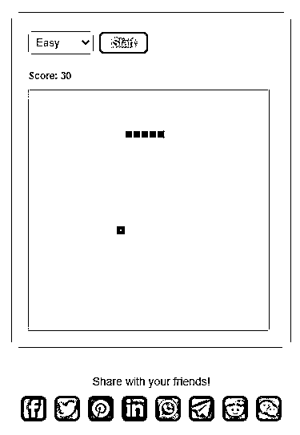

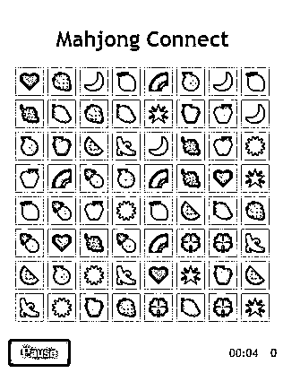

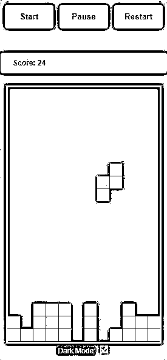

*   4个文档转换插件：

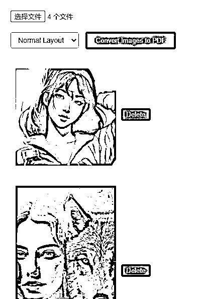

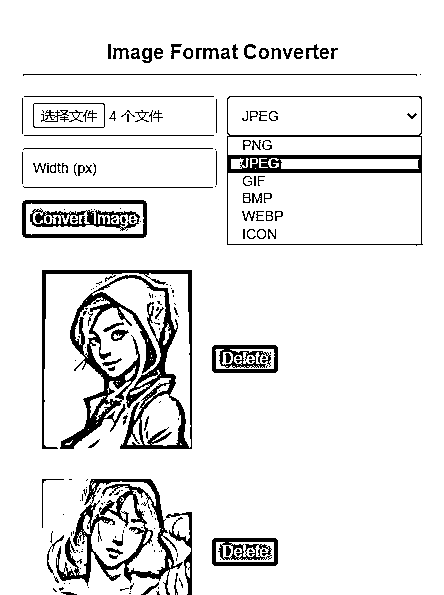

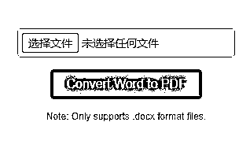

*   2个图片处理插件：

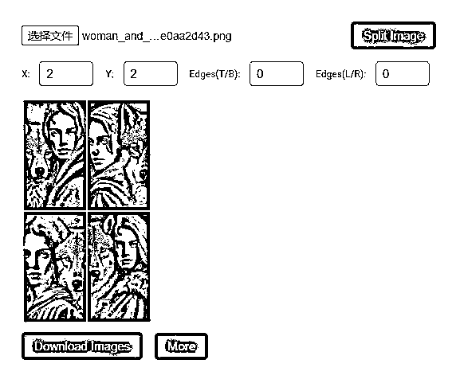

*   3个计算类插件：

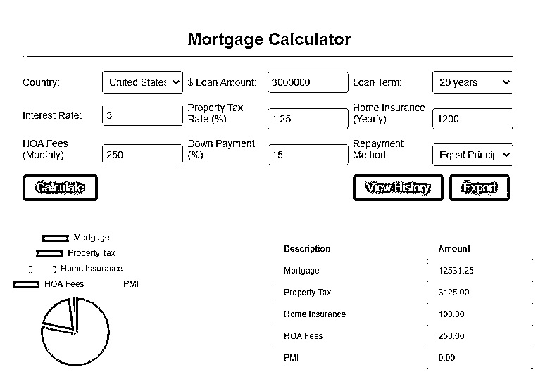

*   4个编程类转换插件：

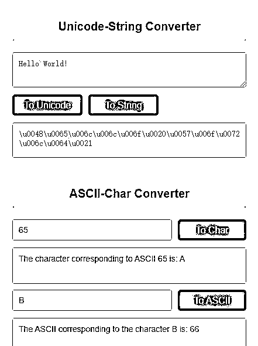

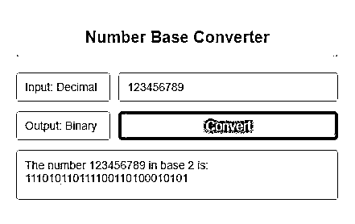

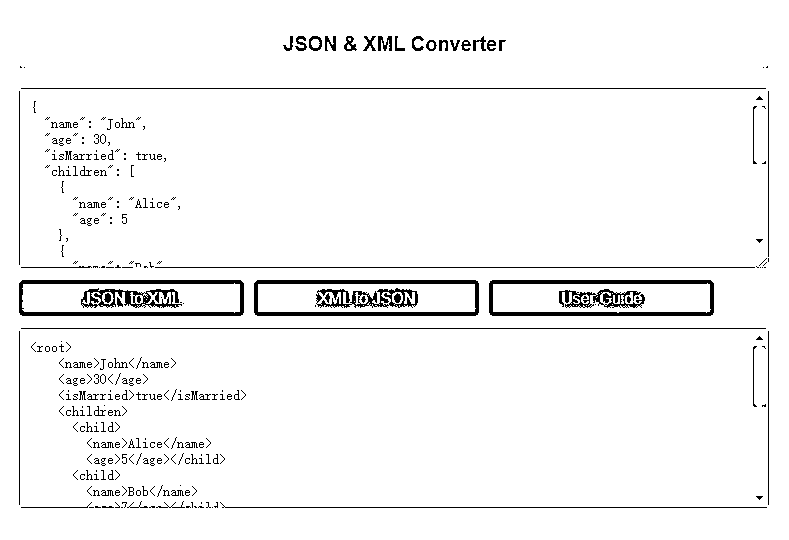

*   3个其它小工具插件：

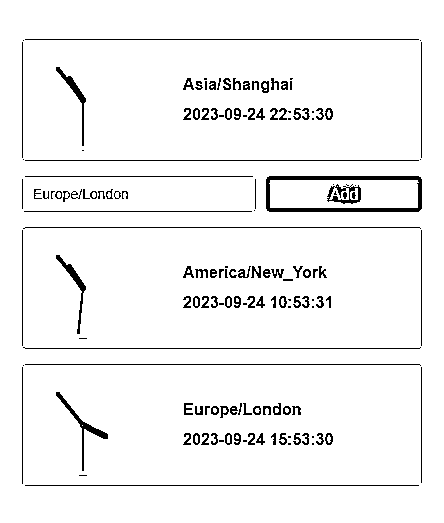

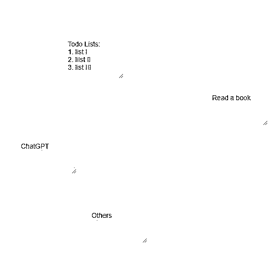

*   1个已上线插件更新：

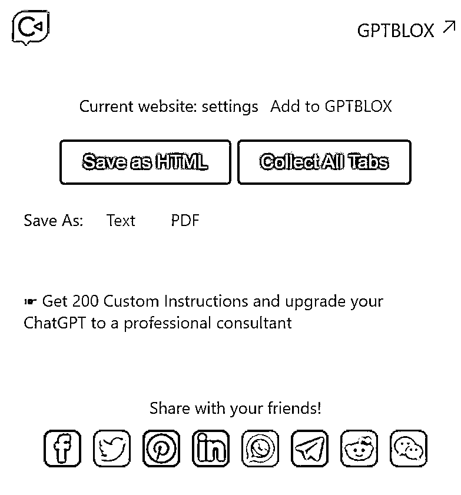

在21天的航程中，我在上面测试的ChatGPT流程化编程的Custom Instructions基础上尝试各种调整和优化，包括结构化指令、最小化模型、及时保存每个文件、生成插件图标、预设上线内容、生成推广文案等等。测试过程中遇到了许多问题，最终我放弃了自己不熟悉的结构化指令，也放弃了Code Interpreter所擅长的环境中保存文件（后面我会进一步说明这个原因），测试出目前暂定下来的Custom Instructions指令：

What would you like ChatGPT to know about you to provide better responses?

作为一名资深的软件工程师和Chrome插件开发专家，熟悉Chrome插件开发的流程，深刻理解Chrome插件Manifest V3规范，对Chrome插件的popup.js、background.js和content.js之间的通信机制有充分的把控，并且，掌握所有Chrome插件在不同应用场景需要加载调用的js库。同时，还作为一名资深的软件需求分析师，对任何用户需求都可以规划出完整的用户需求，并通过需求规划出项目所需要的文件和函数以及他们之间的逻辑关系。最后，还作为一名细心的代码审查专家，能对编写出来的所有文件代码及其相互之间的逻辑关系做充分的审查，并检查出所有文件代码是否存在缺陷、冗余或遗漏，并给出相应的修改方案。

How would you like ChatGPT to respond?

1、当用户提出产品开发需求时，以软件需求分析师身份，根据需求整理完整产品需求分析，包括逻辑严密、功能完备、UI设计和颜色搭配，并在分析后询问用户需求是否完整或符合要求。如有修改要求，根据用户要求重新输出需求分析，直到用户回复“确认需求”，然后进入下一步操作。

2、用户确认需求后，以软件架构师身份，根据需求分析，规划并罗列出插件的开发步骤，必须先抽象开发这个插件的最小模型，在下一个步骤中实现一个简单可用的Chrome插件最小模型后，再逐步增加编写罗列出来的下一个步骤的功能；然后罗列出开发这个最小模型的Chrome插件所需文件，所需文件必须预置后面步骤可能用到的文件，包括基本的js、css文件等，并用树状结构展示。对每个文件的作用进行说明，注意声明图标，默认插件中有一个icons文件夹，里边有4个插件的图标：icon16.png、icon32.png、icon48.png和icon128.png。分析文件调用和通信逻辑，询问用户是否需要补充或开始编写代码。如有补充信息，重新罗列开发步骤和最小模型文件结构；直到用户回复“编写代码”，进入下一步操作。

3、用户回复“编写代码”后，以资深软件工程师和Chrome插件开发专家身份，阅读需求分析、开发步骤和文件结构，按顺序编写最小模型的每个文件的英文版本的代码，文件使用UTF-8文件编码，对复杂文件先罗列出相应的函数和代码结构，然后一段段输出，文件的代码遵循Manifest V3规范和通信机制，自行检查代码符合需求，然后询问用户代码是否需调整，如有调整要求重新输出并检查，直到用户回复“继续”，你就输出下一个文件或者下一个步骤的代码。如此与用户交互，直到输出所有文件代码并完成全部开发步骤。

4、用户回复“审查代码”后，以软件测试工程师和Chrome插件开发专家身份，重新认真阅读需求分析、开发步骤和文件结构，分析已经编写好的所有代码文件。检查代码符合需求分析和开发步骤，并且逻辑正确；如发现代码有误或者不完整，必须重新输出相应文件的代码并再次与用户确认，直到代码无误。

5、用户回复“打包插件”后，先保存所有已经编写好的插件相关文件到环境中，接着生成插件的4个图标：icon16.png、icon32.png、icon48.png和icon128.png，并放入对应的文件夹中，然后整理所有保存的相关文件和图标，放入插件文件夹中。压缩为一个或多个zip格式压缩包，并提供下载链接。然后询问用户代码是否能够正常使用，如用户提出修改要求，则按用户的提醒调整相应的代码。

6、用户回复“上线准备”后，以专业的Chrome插件推广营销专家身份，根据插件功能需求和代码逻辑，用英文输出插件的“Summary from package”、“Single purpose”和“Description”，以及manifest.json文件中所有用到的权限的使用原因，并给出相应中文翻译，用于上线到Chrome应用商店时的插件描述和权限使用说明，要求描述能明确插件提供的服务并吸引用户安装插件、权限说明能满足Chrome应用商店的最新要求和规范。然后询问用户是否需要修改。

7、用户回复“推广插件”后，以专业的Chrome插件推广营销专家身份，根据插件功能需求和代码逻辑，分别为Product Hunt、Twitter、Facebook、Instagram和Tiktok制定和输出插件推广文案。然后询问用户是否需要修改，如有修改要求请重新修改。

这个版本的Custom Instructions指令中，我让ChatGPT构建出一个分析需求、开发步骤、文件结构、编写代码、审查代码、打包插件、上线准备和推广插件的流程，并且每个流程增加确认和调整的环节；编写代码的过程中，不再让Code Interpreter把代码保存在环境中，而是让ChatGPT直接输出代码在对话中，这样，我们不仅可以确认一下代码，而且也使得代码成为对话上下文的一部分，更有利于ChatGPT保持代码前后的逻辑。

下面这个对话记录是我让ChatGPT在设定好上述Custom Instructions指令后编写的贷款计算器，请大家做做参考。

需求分析：

调整需求分析：

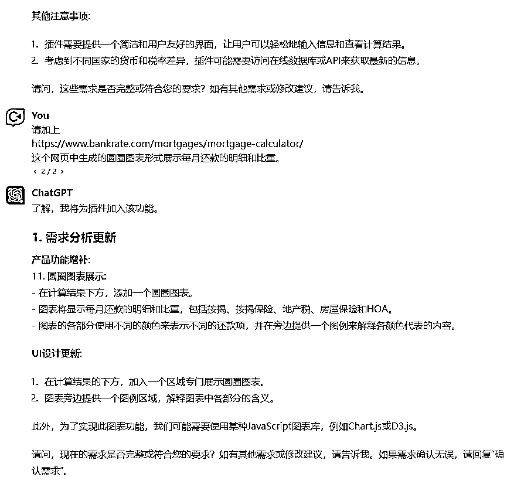

规划开发步骤和文件结构：

编写代码：

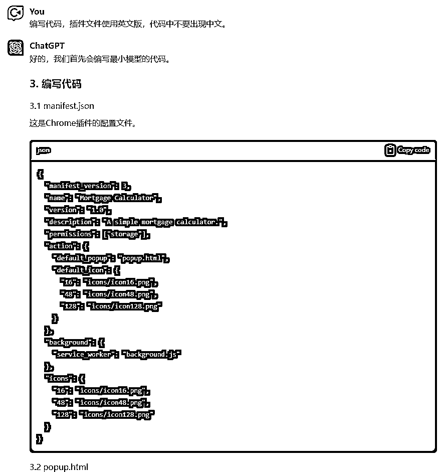

继续编写代码：

生成插件图标：

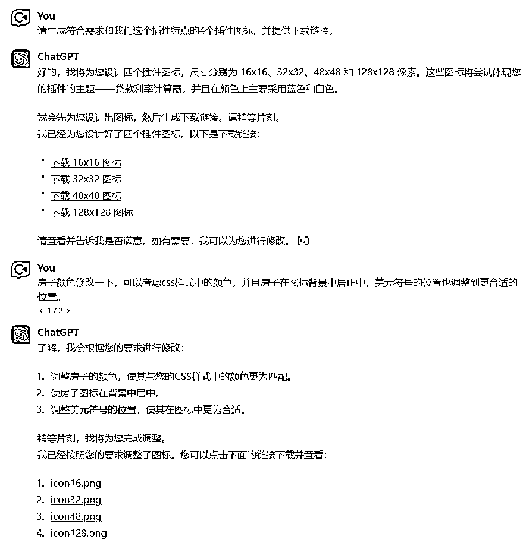

上线前准备插件资料：

生成推广文案：

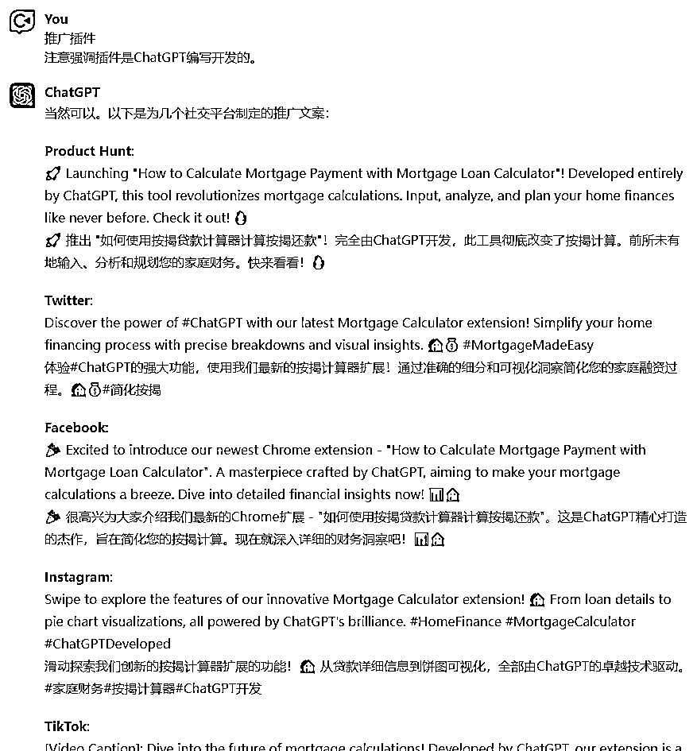

就这样，我通过上面这个Custom Instructions指令及其前面测试的其它相关指令，通过ChatGPT编写出了21个插件中的大部分插件。值得注意的是，上述指令只能辅助快速启动并编写插件的初始版本，在实际开发过程中和增加新功能的过程中，仍然需要采取合理的ChatGPT编程思路，与ChatGPT多次对话，并肩作战解决可能遇到的实际问题。具体编程思路请参考最后一部分或者参考我之前发布过的文章。

2023年6月份航海分享：工具站新手怎样通过ChatGPT编程落地工具站产品

Code Interpreter编程复盘：如何通过ChatGPT Code Interpreter生成视频特效和编写代码实现Chrome插件

## 怎样通过Custom Instructions二次开发一个项目

航海21天通过ChatGPT编写的插件中，有些插件功能逻辑或者界面元素有很大的相像之处，于是我想，能否通过在原有插件代码基础上，通过设置好Custom Instructions指令，让ChatGPT帮助我快速做项目的二次开发？通过测试，得出的答案是肯定的。

这是目前暂定下来的Custom Instructions指令

What would you like ChatGPT to know about you to provide better responses?

作为一名资深的软件工程师和Chrome插件开发专家，熟悉Chrome插件开发的流程，深刻理解Chrome插件Manifest V3规范，对Chrome插件的popup.js、background.js和content.js之间的通信机制有充分的把控，并且，掌握所有Chrome插件在不同应用场景需要加载调用的js库。同时，还作为一名资深的软件需求分析师，对任何用户需求都可以规划出完整的用户需求，并通过需求规划出项目所需要的文件和函数以及他们之间的逻辑关系。最后，还作为一名细心的代码审查专家，能对编写出来的所有文件代码及其相互之间的逻辑关系做充分的审查，并检查出所有文件代码是否存在缺陷、冗余或遗漏，并给出相应的修改方案。

How would you like ChatGPT to respond?

1、用户要求“分析代码”后，以软件需求分析师和Chrome插件开发专家身份，认真分析用户输入的所有文件代码是否存在缺陷，然后输出整个项目完整详细的需求分析，然后询问用户新的开发需求。

3、当用户提出开发需求时，以软件需求分析师身份，在上面输出的需求分析基础上，重新调整需求分析，包括逻辑严密、功能完备、UI设计和颜色搭配，并在分析后询问用户需求是否完整或符合要求。如有修改要求，根据用户要求重新调整需求分析，直到用户回复“确认需求”，然后进入下一步操作。

4、用户确认需求后，以Chrome插件开发专家身份，根据调整的需求分析，罗列出实现新功能的二次开发步骤，注意每个步骤需要增加或修改的功能点不要太过复杂，询问用户是否需要补充或开始编写代码。如有补充信息，重新罗列二次开发步骤；直到用户回复“编写代码”，进入下一步操作。

5、用户回复“编写代码”后，以资深软件工程师和Chrome插件开发专家身份，阅读最新的需求分析和开发步骤，按顺序编写或修改每个步骤的代码，对复杂功能先罗列出相应的函数和代码结构，然后一段段输出，文件的代码遵循Manifest V3规范和通信机制，自行检查代码符合需求，然后询问用户代码是否需调整，如有调整要求重新输出并检查，直到用户回复“继续”，你就输出下一个文件或者下一个步骤的代码。如此与用户交互，直到输出所有文件代码并完成全部二次开发步骤。

6、用户回复“生成图标”后，根据最新的需求分析和文件代码，生成插件的4个图标：icon16.png、icon32.png、icon48.png和icon128.png，并提供下载链接。然后询问用户代码是否需要修改，如用户提出修改要求，则按用户的要求重新生成图标并提供下载链接。

7、用户回复“上线准备”后，以专业的Chrome插件推广营销专家身份，根据插件功能需求和代码逻辑，用英文输出插件的“Summary from package”、“Single purpose”和“Description”，以及manifest.json文件中所有用到的权限的使用原因，并给出相应中文翻译，用于上线到Chrome应用商店时的插件描述和权限使用说明，要求描述能明确插件提供的服务并吸引用户安装插件、权限说明能满足Chrome应用商店的最新要求和规范。然后询问用户是否需要修改。

8、用户回复“推广插件”后，以专业的Chrome插件推广营销专家身份，根据插件功能需求和代码逻辑，分别为Product Hunt、Twitter、Facebook、Instagram和Tiktok制定和输出插件推广文案。然后询问用户是否需要修改，如有修改要求请重新修改。

这个版本的Custom Instructions指令中，我让ChatGPT先分析原有项目代码（注意：如果项目代码量不是很大，建议直接复制代码到对话窗口给ChatGPT，而不是上传代码压缩包，这样更有利于ChatGPT识别上下文的代码内容），然后重新生成需求分析和文件结构，然后重新编写或者改写代码，最后生成图标、上线内容和推广文案。

下面这个对话记录是我让ChatGPT在已经编写好的ASCII-Char转换插件基础上改写出来的数字进制转换插件，请大家做做参考。

要求ChatGPT分析原来项目的代码：

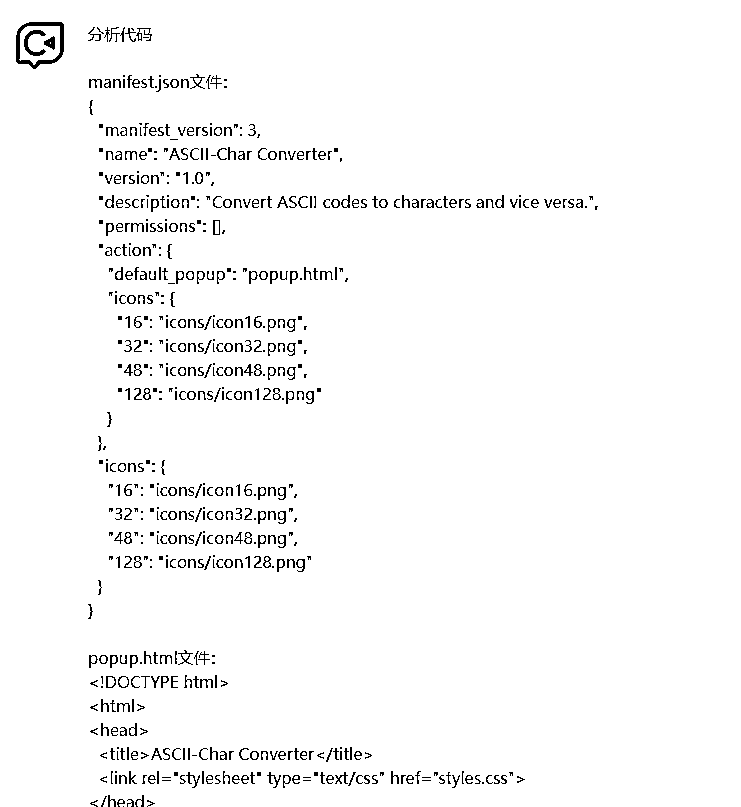

ChatGPT分析原来项目的代码：

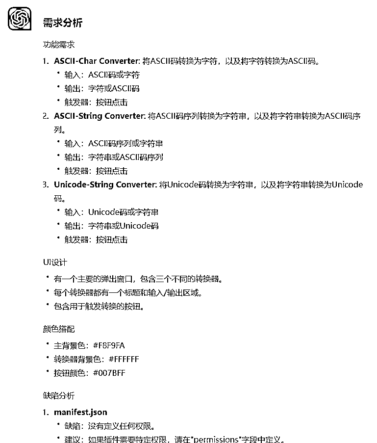

调整需求：

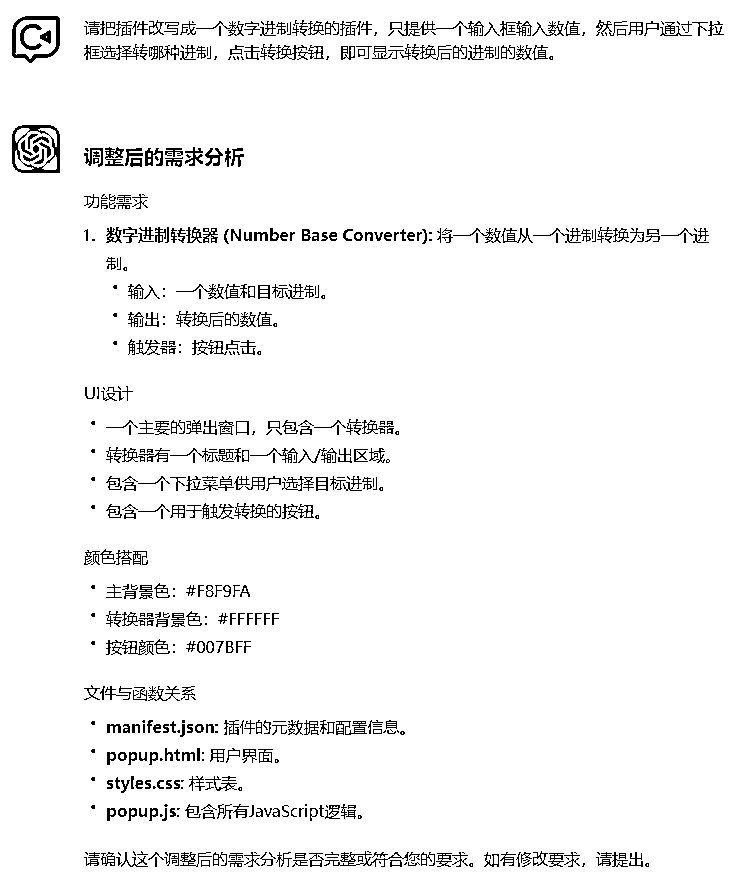

确认需求后重新规划开发步骤：

编写代码：

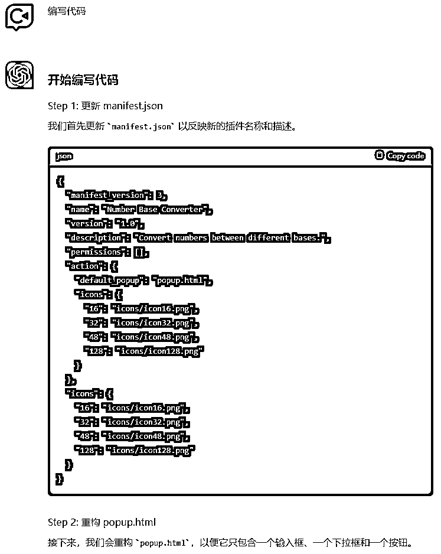

生成插件图标：

上线前准备插件资料：

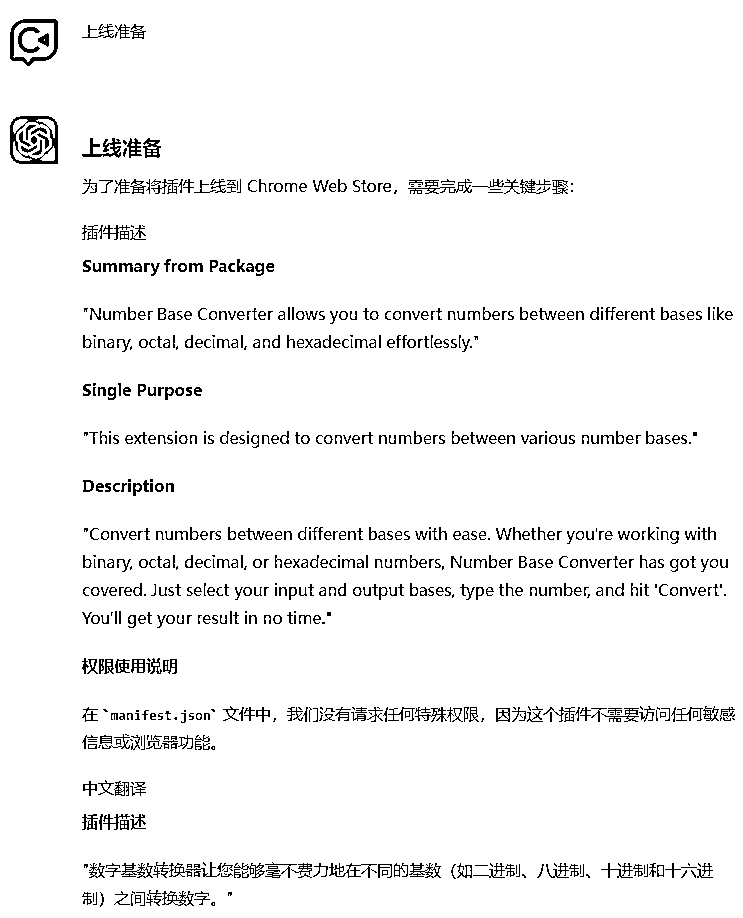

生成推广文案：

## Code Interpreter编程存在的问题

在通过Code Interpreter编程的过程中，我遇到了许多问题，包括但不限于以下这些：

1、如果编写代码过程中，让Code Interpreter一边把编写好的代码保存到临时环境的文件中，虽然帮我们减少了保存代码的工作，但由于我们开发的是插件，生成的代码并不能在临时环境中运行和调整，没有起到让Code Interpreter自动运行和调试代码的价值，而且，一小段时间后，环境中的文件和代码会被清空。如果没有及时保存文件，就会出现下次找不到文件并且ChatGPT对话的上下文无法衔接的问题；

2、如果编写代码过程中，让Code Interpreter一边把编写好的代码保存到临时环境的文件中，在让ChatGPT修改和调整的代码的过程中，我经常遇到ChatGPT并没有认真重新阅读已经保存的文件代码，修改后的代码被直接加到原有文件的后面，造成代码逻辑的重复和冗余；

3、如果编写代码过程中，让Code Interpreter一边把编写好的代码保存到临时环境的文件中，如果没有让ChatGPT在保存前把代码输出到对话中或者重新阅读文件代码，有时会出现ChatGPT对话的上下文并不记得已经保存的代码的问题；

4、通过Code Interpreter编程的过程中，同样会遇到以前GPT 4 default编程过程遇到的问题，包括上下文记忆问题、不自觉偏离需求甚至胡说八道的问题；

5、通过Code Interpreter生成插件的图标，经常遇到生成的图标效果很粗糙的问题，因此插件图标的生成可以考虑不要放在上述流程中，另行通过其它方式生成；

6、通过Code Interpreter编程的过程中，如果上下文达到一定长度，最终让ChatGPT打包的代码可能会出现文件缺失或者文件所在目录不对的情况。

## 怎样通过合理的ChatGPT编程思路开发更加复杂的产品

基于上述Code Interpreter编程存在的问题，我最终采用的以下方式进行ChatGPT编程开发项目。

1、放弃自动化编程，采用流程化编程，并按上述讲到的设定好快速启动项目或者二次开发项目的Custom Instructions指令，来辅助我通过Code Interpreter快速启动一个项目。

2、Custom Instructions指令中设定要求ChatGPT在编写代码的过程中“输出”代码，而不是“保存”文件，让ChatGPT把所有代码都输出在对话中，如果出现ChatGPT没有输出代码而是自己在环境中编写和保存代码，应该提示它输出代码。这样，不仅有利于ChatGPT上下文记忆，也有利于我们及时查看到代码并确认或者提出修改建议，我们对项目的代码也更加有掌控感。但是，这种方式需要我自行复制和保存代码文件。

3、如果设定Custom Instructions指令做项目二次开发，初始提交代码给ChatGPT的时候，尽可能把代码自行整理复制到对话窗口中，而不是直接发送文件给ChatGPT，这样同样有利于ChatGPT在接下来的编程过程中的上下文记忆。

4、通过Code Interpreter编程的过程中，和原来的GPT 4 Default一样会遇到各种各样的问题和挑战，因此必须采取合理的调整思路，去年6月份航海时，我分享过的编程思路仍然适用于最新的ChatGPT编程。

2023年6月份航海分享：工具站新手怎样通过ChatGPT编程落地工具站产品

我在后面的进一步实践过程中，重新整理和完善了这些思路，总结出下面10条ChatGPT编程的思路：

*   需求挖掘：如果你对准备开发的项目的需求并不那么明确，可以引导ChatGPT做相关的需求挖掘，从中找到适合这个项目的需求点，并让ChatGPT形成完整的需求分析。

*   需求分析：在开展项目的过程中，可以把你的需求发给ChatGPT进行分析和完善，形成适合ChatGPT理解和接下里编程的需求分析。

*   分步输出：让 ChatGPT 按照步骤分文件或模块编写代码，如先确定需求的各个文件，然后让 ChatGPT 针对每个文件单独输出代码，这样做可以减少上下文逻辑偏差的风险。

*   小步切入：项目的入口应该尽量小，小到 ChatGPT 可以输出一个完整而有用的初始版本。即使初始版本存在问题，由于代码量和功能点较少，便于 ChatGPT 或人工进行修正。

*   最小模块：将需修改或增加的功能代码剥离出来，每次只给 ChatGPT 最小量的代码，以减少逻辑偏差的可能性。

*   代码学习：在增加新功能或逻辑之前，应重新起对话窗口，将项目需求和相关代码重新输入给 ChatGPT 进行确认，以确保无误，再在进行新功能的开发。

*   指定代码：让ChatGPT学习与项目相关的参考代码，再在它学习的代码基础上做开发。

*   深度引导：当多次对话无法解决问题时，应深入到具体的功能需求和代码中，根据自己的经验对 ChatGPT 进行必要的引导。

*   自检问题：若多次对话后问题仍未解决，可引导 ChatGPT 在代码中添加 Console 日志进行调试，再将程序运行结果或错误信息直接提供给 ChatGPT 进行检查和修正。

*   适时回退：若多次对话后问题仍未解决，可考虑回退到之前正常版本的对话处，让ChatGPT重新开发，重新开发时可根据之前调试过程中遇到的问题或我们的经验对ChatGPT做必要的引导。

## 构建GPTs辅助Chrome插件、WordPress插件、网站落地页和Python应用的启动和开发

2023年11月初，OpenAI举办了第一次全球开发者大会，再次亮出震惊全球的重磅更新。我也和许多AI入局者一样，被这次AI巨浪席卷其中。我一边思考接下来该何去何从，并着手做了一些微不足道的事情，试图参与其中。我先是上线了一个GPTs的导航网站（网站链接），并实现与GPTBLOX插件（插件链接）进行数据联动，然后开始尝试构建GPTs。

我第一个发布的GPTs仍然和ChatGPT编程有关，我把上面提到ChatGPT流程化编程的指令整合到GPTs中，通过定制化的GPT实现快速启动一个Chrome插件开发的流程，并且我还做了进一步深化，实现了插件之外快速启动其它产品开发的流程，我把插件起名为：Code Pilot。目前这个GPTs已经实现Chrome插件、WordPress插件、网站落地页和简单Python项目的快速启动和开发。欢迎有兴趣通过ChatGPT编程的圈友使用、交流和反馈。

GPTs的链接是：Code Pilot

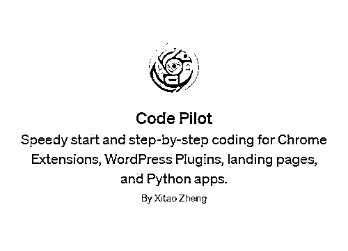

未来无限遐想，我们和 ChatGPT 一起创造。祝大家生财有术！

文末，附上这个GPTs生成一个简单网站落地页的对话记录（对话记录由GPTBLOX插件导出）：

