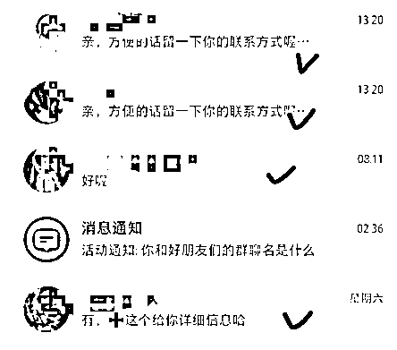
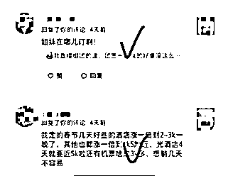
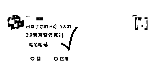

# 十天就能拿到正反馈！——纯小白起步经验分享

> 来源：[https://fxx6d3i9bl.feishu.cn/docx/MhEfdzV4GobIUWx5RvOce2fCnyb](https://fxx6d3i9bl.feishu.cn/docx/MhEfdzV4GobIUWx5RvOce2fCnyb)

# 开篇

哈喽，我是沐一，一个爱折腾的终身实践者。

简单介绍一下我自己在跨境游这个船的情况：从来没对接过旅游社，没有做过旅游产品，不知道跨境游需要的资料，完全跟我主业赛道不相关，上这个船之前，也没有任何运营小红书的经验。

也就是说，在2024年1月3号之前，我对跨境游+小红书两个东西完全——0认知，0运营。小白的不能再小白了。

那么这十几天时间里，我拿到了什么样的结果呢？给大家看一下真实小白能做出来的成果↓

# 1、结果展示

2024年1月6日发布第一篇小红书笔记

准备时间：2024年1月3日-1月4日

运营时间：2024年1月5日-1月16日（结果记录的截止时间）

平均每篇笔记小眼睛：700-800+

评论+私信

10天左右的时间做到这个结果，其实不算很爆，跟很多大佬比起来，超级小儿科，但是对于我自己来说，已经是超迅速达成我报这个船的目标啦！那么能在十天时间拿到这样的结果，我做对了什么呢？

# 2、做对了什么

## ①直接干，持续干

1月3日-1月4日，完全是按航海打卡的时间参考，做了2个账号的准备+目的地的选择+供应链的对接；十分简单粗暴，直接参考了教练发的帖子参考的怎么选择目的地，没有想太多纯纯是因为太小白了，做哪个目的地都一样。

1月5日-1月6日，着急，觉得航海时间很短，我怕我在这个时间内，基础打卡内容都没有完成，笔记东抄一点西抄一下，十分潦草就发布了（就是你们刷小红书都不愿意点开的那种封面笔记）。

1月7日-1月10日，优化笔记+素材库建立+爬虫工具使用，这里要感谢梨云大大做的爬取器，非常迅速的让我锁定我选择的目的地的爆款笔记是什么样子的，如何精准模仿。

1月10日-1月16日，每天养号+更新素材库，笔记2-3天更新一篇，持续引流动作（引流动作都是教练讲的比较安全的方式：表情包添加微信；粉丝群用小号引导；直接私信意向客户留联系方式等等）

这几天我唯一保持的就是持续做，持续打卡，持续优化，持续更新素材库，遇到问题就在群里举手提问或者手册里找答案，以及看高手领航里教练直播会讲到的一些内容点。

## ②快速抓取有效信息→航海手册/高手领航

刚开始做的时候，不知道怎样做，不知道如何做，航海手册扒拉了两遍，也还是理论知识，过了两边脑子，留痕了一点但不多。

于是我就决定，做到哪一步，就看哪一步的资料!

养账号的时候就只看养账号的，优化笔记的时候就只看优化笔记的，引流的时候就只看引流的，其他的写的再好，都不看，在哪个阶段就看哪个内容。

高手领航，有问题就直播间提问，没有问题等回看，快进到我想看的重点内容，边做边寻找答案再进行解决。

其余信息资料再没实操到对应阶段/没遇到对应问题之前，先不看，遇到的时候，第一时间查找解决。

## ③高效建立/更新素材库→善用工具

我用了两个工具快速建立的素材库，一个是飞书，另外一个是爬虫插件，这里感谢梨云老师提供的爬虫代码，加速提高了素材库的效率。我每天大概会用1小时左右的时间更新10－15篇对标的素材。

## ④精力管理

我是保持记录时间的习惯+复盘，每天看一眼我大部分时间花在哪里，保证在不耽误主业的情况下，两条船能持续打卡

## ⑤稳定心态

因为跨境游对小白不友好（尤其看了教练发的帖子以后知道壁垒很高），加上目的地完全不了解，所以时不时还是会有劝退心态出来。

但是每次起来又会让自己先坚持再做一下，先把能做的都做了，把该学的经验都学了，降低对自己的期待跟要求，当正反馈来的时候，就会发现其实我只是老老实实跟着打了卡进行了实操。

# 3、踩过什么坑

## ①不知道怎么发笔记

刚开始完全不知道怎么发笔记，硬是搜索了一堆笔记，做了个超级煳的笔记出来（就是大家平时根本不想点开的那种封面），硬生生先发出去了。

后面持续更新素材库，迭代笔记内容，才慢慢的把笔记越发越好，加上每次跟着高手领航复盘自己的账号有没有没发的内容，记录关键点，不断优化到下一次的笔记里面，时间一久，每一篇笔记发出去之前，我就有个大概的预判，小眼睛会有多少，点赞收藏会有多少，评论私信会有多少。

## ②害怕引流动作封号

说白了还是太老实了，引流动作刚开始的时候一个也不敢放。

后面到了第四天还是第五天，开了第三个账号，以防万一（后面真的封了1个号）。

现在已经相当熟练的把教练教的相对安全一点的引流动作来回倒腾。

## ③引流动作没有反馈后，不及时优化

刚开始我选择粉丝群，用小号维护引流，后面发现很多客户不进群（可能是我引导进群的动作比较小）导致很多私信/评论的意向客户后面就没声音了。

大概是过了一天的样子我才又换一种引流方式：表情包微信制作+私信回复客户留他们的联系方式。这样才又把引流做起来了。

## ④养号不垂直，数据反馈差

刚开始的时候虽然选择好了目的地，但是我发的笔记不是只关于这个目的地的，太泛，导致有人看，但是没有精准切进意向的需求。

后面发了几篇相当垂的笔记以后，意向询问的就开始多起来了。

尤其加了”特定地点起飞“、”特定航班时间“、”特定行程“、”特定人群“这样的笔记，加上小红书的长尾效应，导致有一篇笔记发出很久了，还是有源源不断的意向从那篇笔记私信询问的。

## ⑤封号：自己评论的时候带了敏感词而不自知

评论了关注我等敏感词，不知道这是敏感词，刚发评论立马整个账号被封掉了。总结一下还是新人，不要过于着急，对于平台规则熟悉度还没这么高的时候，再谨慎一点。

# 4、推荐工具

## ①爬虫工具

凌云采集器：小红书笔记批量导出神器https://t.zsxq.com/16cGfTV3X

## ②素材库

·飞书+用好搜索

·小红书如何搜集笔记素材，解锁变现赛道选择自由度https://t.zsxq.com/168bLAuq7

## ③违规词检测器

https://duozhongcao.com/

# 5、总结

1.  持续做，每日迭代的力量很重要。我能快速从纯小白到笔记能引流，核心还是每天会抽出一点时间（每天更新素材库1小时左右）泡在对应赛道的爆款笔记里面，拆爆款标题/图片/内容/评论，给自己【扫盲】

1.  保持好奇，保持【学力】。由于养了多个账号，我会用小号有的时候看一下别的赛道别人是怎么做的，怎么进行引流、怎么留钩子、怎么控评。直接照搬别人的方法用在自己的赛道上。

1.  关键词抓取。在什么阶段，就找对应阶段别人已经有的经验/方法学习，不追求把自己打造成【百科全书】，但追求目标精准，遇到什么问题就解决什么问题，问题没遇到之前，不做过多深入只做简单了解。

1.  稳定心态，精力管理。报了多个船，精力分配是一定会遇到的问题。效率的迭代以及时间的分配相当重要。

1.  构建自己的【武器库】。在航海期间，主要讲的是素材库，素材库的方式学会以后，迭代到自己以后如果做其他的项目，就是自己的优质【武器库】，了解自己的【武器库】就知道什么时候该拿出来用，迭代自己的【武器库】就能及时拿出最有用的兵器，扩充自己的【武器库】就能慢慢有自己的护城河。

最后，我毕竟还是个小白，小白说的东西，还待更多时间的验证与校正，所以有意见/建议，也欢迎保持开放且质疑的态度讨论。感谢生财有术以及咱们船的教练跟志愿者们，能给我这样一个分享的机会，我也希望我的经验能帮助到更多人。