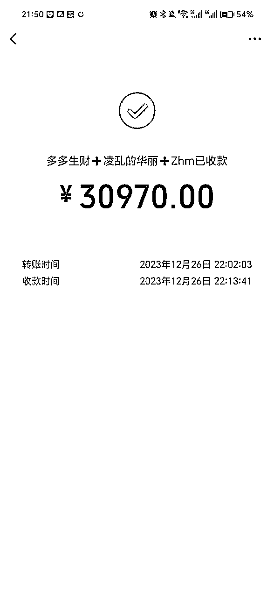
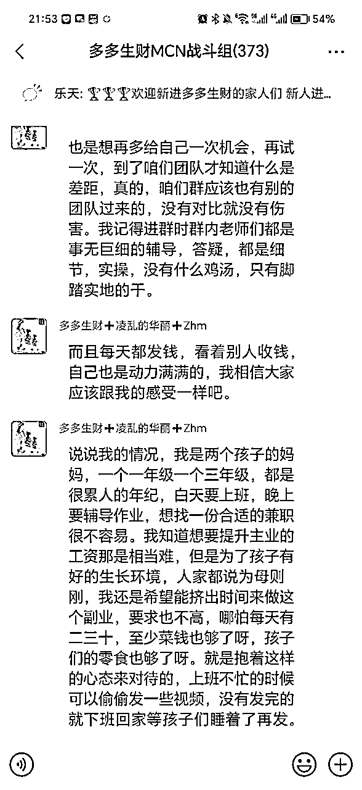

# 从电信诈骗负债70w到正向盈利50万，一个生财小白的浴火重生之路

> 来源：[https://qf74wkdh4b.feishu.cn/docx/N7bBdSPhToIZdSx3PnXcx2Svnle](https://qf74wkdh4b.feishu.cn/docx/N7bBdSPhToIZdSx3PnXcx2Svnle)

大家好，还记得年初这篇匿名提问的帖子吗？https://t.zsxq.com/15sHyDnaM。提问的人是我。其实我那时候的状况远比帖子里面描述的要糟糕，那时候我遭遇电信诈骗，负债70多万。用一年时间在生财上深度学习，与圈友合作，实现了逆风翻盘，成功填平负债，并稳定获得多个副业收入。

这一路走来十分不易，好在在这里收获了老师，朋友，合作伙伴还有精神榜样，让我能够浴火重生。感谢亦仁老大提供的这么有爱，利他的平台。全文很长，一年的无处诉说，希望通过这篇文章全部吐露。愿像我一样遭遇人生低谷的普通人，能够将这份力量传递下去，就像生财传递给我的一样。感谢。

一、别人家的孩子

二、遭遇电诈，跌入谷底

三、紧抱生财，屡败屡战

四、死拼执行，终有所获

五、致敬木易，调整心态

六、个人的思考

七、生命里的那些贵人

八、引用

## 一、别人家的孩子

我今年33岁，前二十多年，我可能就是大家眼中的别人家的孩子，一路读书，考入985，大三签了一家央企，然后十年没换过工作，对未来一直没有太大的目标感。由于一直处于一人吃饱全家不饿的打工状态，有点小存款，更没有什么危机感。如果一直是这个状态的话，我可能这辈子都停留在这个舒适圈里面，与生财永远不可能相遇。

后来遇到了我的老婆，稀里糊涂在深圳买了套小房子，掏空了所有的积蓄进入到了房奴生活，一下觉得自己肩上的担子重了。人生困惑的时候，总有一些挚友像你生命中的阳光一样，让你如沐春风。这里特别感谢圈友也是我的高中朋友@brady 带我进生财。

刚入生财的故事在这里：从0到副业收入16w+，一个新手小白的副业探索之路。

## 二、遭遇电诈，跌入谷底

如果没有遭遇诈骗，我可能还会像我前20多年一样，按部就班，将我们的生活慢慢经营成知足常乐的状态。但天不遂人愿，我遭遇了电信诈骗，副业收入全部清空，还背上了70w的信用贷。

刚遭遇电信诈骗的那段时间，每天都浑浑噩噩的，神经高度紧张，工作生活上的任何风吹草动，对个人的心情都影响极大。读过很多书，在书本里面所有的正能量，坚毅和不屈是那么的理所当然。但当自己亲身经历时，似乎一切都不奏效了。不敢告诉家里人，还要装作若无其事，不能让他们发现异样。每一口呼吸都像是胸口压着一块石头一样，喘不过气来。而且每个月还要像以前一样按时上交工资还房贷，账户里面永远不会剩下超过三位数，收入一进来，马上就被扣走了，吃饭全靠饭卡，每个月信用贷光利息就三千多，根本没有额外的收入填完这70w的坑。我性格是个i人，不想找人借钱，只是通过向银行借钱去还银行的利息，以此来拯救随时可能逾期的征信，但是没有办法还本金，债务只会越滚越大。而立之年，本应是成家立业的年纪，我竟然混的如此窘迫，心理的落差只有经历的人才能理解。

那时候白天无心工作，一到晚上就很EMO，想破脑袋都想不到解决之道，陷入巨大的焦虑中。而且潜意识的那种逃避的思想很严重，想不到就开始刷短视频，一刷一晚上，巨大的焦虑感真的能让人彻夜难眠，工作上也经常走神。心里压抑无人诉说，让我变得很反常，很莫名奇妙，在周围人眼里，我突然很排斥与外界接触，不想去跟同事社交应酬，不想去做无效社交，年终联络感情，团建之类的，不想去面对父母的催生，不想再去退让包容老婆。所有以前都能轻松应对的事情，此刻都变得那么不情不愿，封闭自己。虽然都是些琐碎的事儿，但是对于当时的自己来说，都是非常消耗心力的。

其实，这几年买房后经济负担变大，父母一直节衣缩食想办法给我们帮衬。而我却突然身背70w信用贷，让他们在本应安享晚年的年纪，依然要为自己的儿子担心，每每想到这里，总有一种万箭穿心的痛。

既然是自己闯的祸，窟窿必须我自己补。为了家人，我必须振作起来，不能再陷入无休止的内耗和逃避中。

## 三、紧抱生财，屡败屡战

在经历很长一段时间的调整和挣扎后，虽然不知道选择尝试哪个副业去开始自我救赎之路，但是内心笃定一定是紧紧抓住生财这个救命稻草。适逢年底，遭此劫难，更受不了年底的这种节日气氛。焦虑迷茫之际，我给亦仁大佬发了个匿名提问。https://t.zsxq.com/15sHyDnaM 亦仁老大的鼓励和建议真的很受用，给了我很多能量。

听了亦仁大佬的建议，我过年真的没有回家，重新理清了自己的方向，紧紧拥抱生财，开始了打怪升级之路。项目上有问题，就在生财上找答案，焦虑爆发的时候，就去看看别人的成长故事。其中让我印象深刻的是，木易大佬的这篇帖子，我看了不下二十遍。《绑着炸弹做淘宝，负债百万的逆袭之路》 。我常常这样宽慰自己，相比于木易大佬来说，我其实情况已经好很多了，我负债只有70w，在负债前就已经加入生财，并拿到了一些正反馈，且还有一份稳定的工作不至于流落街头，他能做到的，我也一定也能做到。

### 小红书副业尝试

亦仁说小红书是今年为数不多的红利项目，我就毫不犹豫报名参加了小红书资料引流小航海。那段时间疯狂看生财贴，刷小红书，去找对标，像素级模仿，期间为了强制自己沉浸进去，也做了很多笔记。而实际是发现每当刷小红书的时候，注意力很容易被小红书的内容给刷跑了。刷着刷着就忘了自己是在分析人家是怎么发小红书笔记的，整个过程效率非常低。基本上一晚上分析完没来得及好好实操一下，一天就过去了，完全没有之前做多多视频那么简单，拼执行。为了提升自己的时间利用效率，我还特地报了一个时间管理小航海。虽然最后小红书资料引流的探索还没怎么有结果就结束了，但是没想到，通过这个副业项目，让我明白时间管理的重要性。回头看，这套时间管理的方法论是贯穿我整个一年很受用的技能，为我后面高效利用个人时间，开展多个副业打下了基础。

### 美团短视频副业尝试

年初，从多方了解到美团短视频项目。秉着任何项目在平台推出的初期，都是一个巨大的红利期的想法，我又开始尝试了美团短视频项目。这个项目因为是非常早期的项目，很多人不知道，又想到之前尝过拼多多短视频项目初期的红利，我对这个项目寄予厚望。希望通过这个项目一举翻身。操作简单，简单来说，就是从别的短视频平台下载一些短视频素材，上传到美团短视频这个平台，没有任何技巧可言。那时候我借几台电脑日夜开工，不停搬运，借助了一些自动化工具，保证整个操作的不间断（下图是当时搬运的部分还没删的视频）。但是不曾想由于平台本身内部政策不稳定，具体的激励方式也不明确，最终项目不了了之。

这个项目像一盆冷水一样浇灭了我所有的急功近利。让我明白了什么叫尽人事，听天命。让我在接下来做项目时，能更加淡定去对待一切规则的变化并及时作出调整。

### ChatGPT副业尝试

年初正值chatGPT比较火，我也报名了航海志愿者。想借此机会看能不能挖掘一些副业变现的机会，认识一些这方面的大牛，并且填补我随时焦虑发作的大脑。结果是并没有挖掘到什么变现点。倒是年中的时候利用ChatGPT辅助写了一个报奖材料，编写效率很高，一晚上写完材料交上去，成功入围了公司内部奖项评选名单，大大提升了我的工作效率。

这三份副业经历并没有什么跌宕起伏的情节，全是一个普通人的挣扎。写在这里只是想表达，哪有什么天降神兵，力挽狂澜，哪有什么神力在手，瞬间逆袭。其实我跟绝大多数普通人一样，做事儿三分钟热度，对未来没有什么长远规划，基本上是什么热门干什么。负债后的急功近利，急于改变，对于我一个普通人来说是再正常不过的反应。所有的心酸和摔打，都是通往翻身的必由之路。在此之前，你只需要认识自己，不断调整，积蓄力量。

木易大佬在他的帖子里面说“在这个负债阶段，我经受不起任何折腾，我害怕任何一个风险又再次将我击垮，我必须要求稳定，才能让自己的心态更加平稳。”当时对这句话真的太有共鸣了，经历了这三份副业尝试后，我深刻认识到，我有本职工作，精力有限，无法像木易大佬一样全职投入，以小红书为例，要做好小红书我需要做好公域引流，私域成交，反复做用户触达等很多环节，在个人精力有限的情况下，要同时做好这些环节，需要付出的试错成本太大了，一个环节没做好，这个闭环就形不成，就没办法实现变现。当屡次的失败，消耗的不只是个人精力，更是心力，因为内心虚弱到已经经不起任何的起伏了。因此，经过这几次尝试后，我个人还是更偏向于那种变现路径短的项目，比如短视频带货。

## 四、死拼执行，终有所获

有时候，开始我们为了A而努力，中途看到了B的高度，最后在C上开花结果。当你调整心理状态，平常心去探索一切，不再焦虑，不再急功近利的时候，剩下的要做的可能就是等待机会吧。正当我还在苦苦探索副业项目时，我之前项目的合伙人徐子浅找到我。徐哥，待续老大，孟meng一起测出多多视频带货线下结算玩法。想拉我一起做交付。

### 重新起航

长风破浪会有时,直挂云帆济沧海。

回想22年，其实我们一起合作的很好，做了一个两百多人的实操训练营，小范围交付了我们的多多视频带货项目。当时绝大多数学员都赚到了钱。也因此积累了很多拼多多头部商家资源。这也是我们后面开始做多多视频线下结算训练营的基本盘。

我们开始新玩法招生时，原来的学员报名很积极，为了保证整个的交付质量，初期我们并没有大规模招人，只是从原来的学员里面筛选了90名执行力还不错的学员进行内测。

项目3月1号开始内测交付，主要是跟拼多多优质供应链商家合作，推广他们的潜力链接，并根据推广金额与商家直接进行线下结算带货佣金。这个模式的一个主要好处，就是一方面不用每个月浪费2-5天时间发爆款视频，获取下个月的带货资格，另一方面直接与商家结算，有效避免了平台吞单导致达人的佣金损失。时至今日，该模式依然可以跑通，依然可以稳定给我们带来佣金收益。

由于22年一整年我们都是以自己做多多视频带货为主，积累了很多优质供应链商家资源，建立很好的合作关系，很快我们利用这些商家资源和90位强执行力的学员，首月就打开了局面。并反复打磨建立了自己的一套完整的交付体系。

### 思考放大

业精于勤荒于嬉，行成于思毁于随。

既然模式跑通，剩下就是思考如何去放大了。我们初步讨论确定的是通过抖音直播招副业粉的方式，增加达人，让视频爆单的概率进一步增加，爆单概率增加对供应链就有更高的议价权，更高的议价权又能吸引更多的达人，逐渐进入正向循环。

通过无底薪招聘合伙人的方式来吸引达人搬运剪辑，发布视频，我们自己则负责后端，最终实现双赢。但是我们四个都没有直播经验，短时间现学又要花费很多试错成本，当时就达成一致，在自己学员里面找合适人选。一方面学员是对我们几个高度认可的，且是对我们这个项目非常熟悉的一群人。最终我们跟武汉萍子沟通合作，由萍子负责我们的直播招商工作。（又是一位素未蒙面的生财圈友，所有的工作都是在线上沟通完成。不得不说生财圈友之间天然的信任感和利他精神也是独一份儿的了）

在萍子的加入后，我们线上团队的最后一块短板也补齐了，在萍子的助力下，我们用两个月时间招收了600多位学员。通过无底薪筛选过来的宝妈，她们的主观能动性特别的强，赚钱欲望极高！刚开始我们的设想是，第一个月以开单为主，争取让大部分人看到第 1 块钱，并没指望他们在短期内能真正赚到钱，因为这是一群毫无经验的宝妈。没想到通过无底薪筛选过来的宝妈，执行力特强，听话照做，自己实操过后，再来反馈问题。不像我们之前曾引流过其他类型的副业粉，还没开始干，就一大堆问题。也正是因为多多视频项目让我对宝妈这个群体充满敬意。截至到我发帖，有位两个娃的宝妈单条视频都已经累计变现了15w。当然这是个例，大家理性看待。

### 排除万难

千淘万漉虽辛苦,吹尽狂沙始到金。

随着人员的增加，又是线下结算训练营，我们的整体交付变得很重。每个人几乎都是连轴转，没有周末，没有假期。需要做的日常工作很多，包括对接商家谈合作，整理商家要推的链接，日常数据核对与结算，学员答疑，引流招生，不定期直播教学，课程沉淀等。刚开始干的时候，大家也没有明确的分工，基本上谁有空谁上，相互之间配合默契，都是主动担当，那种创业做事的氛围有时候真的很让人动容。

经过几个月的打磨，为了保证几位老大有足够的时间精力去测品，测试新玩法，去跟商家谈合作，我尽量承担大部分的日常链接整理，数据核对与结算，机构学员维护等基础工作。那个时候每天都要对接几十家商家，整理推广链接，整理学员爆单报备信息，核对商家后台数据，核算线下佣金等。平时还要完成本职工作，我几乎压榨了我所有的时间。每天早上六点多起床，健身运动半个小时，上班和做副业，忙到凌晨一点多是常态。周末，五一清明全年无休。整个人进入到一种心流的状态，手时刻不停，不停的遇到问题，解决问题，很充实，几乎已经忘记了自己是一个负债70w的人。

到了七月份，很多宝妈因为要照顾小孩，发的视频也少了，七月份开始收益有下滑迹象，商家那边的出单数据也变得不是很理想。屋漏偏逢连夜雨，正好七月家父生病住院，需要人照顾，我母亲长期脑梗，行动不便。我不得不在项目最关键的时候，请假回家照看。那段时间，每天往返于家和医院，给母亲做饭，给父亲陪床，每天能睡觉的时间不超过五个小时。还要兼顾学员的答疑和结算，商家的对接。经常带着一个笔记本在医院大堂连着手机热点忙到凌晨两三点。那个时候我常常安慰自己，幸好还没有小孩，不然真的就要提前体验一个中年人的痛苦了，上有老下有小，兜里还没钱的窘迫状态。

直到此时，我才真正感受到钱的重要性。心里暗暗下决心，一定要多赚钱，使劲赚钱，让自己的未来生活的更加从容，能够把父母，老婆和孩子都照顾好。这也是为啥在医院的那段时间反而是我效率最高的一段时间，团队日常工作没有落下，还鼓励协调了多名学员分享自己的经验。我们将学员的分享资料全部沉淀到我们的交付文档里面，让新进的学员能够更接地气，更快度过迷茫期，步入正轨。经过我们多场分享，赋能学员成长，很快我们的训练营收益终于有所回升了。

本以为达人端一切理顺了，后面收益只会越来越好，却不曾想商家端又出了问题。我们达人好不容易带爆商品链接，却遭遇商家修改销售额数据。幸好我们几个对品类转化率比较熟悉，对平台足够熟悉，很快就发现了这个问题。为杜绝此类问题，我们完善了我们的风控规则，建立了黑名单机制和押金机制，不管再牛逼的商家，再熟的商家都要根据日订单量，收取一定的押金。很快，我们和商家建立了有效的长期合作机制，及时挽回了不少损失。

### 负债清零

轻舟已过万重山。

9月15号，这一天对于我来说意义非凡，我的负债清零了。再也不用过那种随时可能征信逾期的日子了。这一天我没有告诉任何人，也没有任何庆祝。生怕自己的得意忘形会吓走这泼天的富贵。这个月，我给妈妈买了一条金项链作为她六十岁大寿的礼物。其实刚遭遇诈骗，一直很焦虑这些重要的日子，因为兜里空空，很怕不能像往常一样给家人准备礼物。从小对金钱没有什么概念，但是这一年让我深刻知道钱的意义。对于我来说，钱是底气，是保护家人和自己的底气。

（十月份我去看了电影《孤注一掷》，当时对于他们安排很多人去取钱的情节真的很有代入感，让人咬牙切齿。）

### 第二曲线

欲穷千里目，更上一层楼。

九月前，各种日常细节我都亲力亲为，事无巨细，生怕处理不好影响到团队交付，生怕紧紧抓抓的救命稻草有什么闪失，每天如此，非常肝。虽然说我一直都有健身的习惯，即使很忙，依然会尽量抽出时间去健身，但是十月份体检依然出现了轻度脂肪肝的情况。既然身体已经在报警了，咱就一定要尊重科学规律。反思过去几个月，靠着团队协作和拼命执行短时间实现了翻身，一切都像梦一样。每天没有时间去思考，不停在问题中迭代自己，拼命适应快速发展的团队。多多视频带货实操营收益依然稳定，但是这种无法抽身的感觉，让我很有危机感。生怕收益下滑，我又回到以前那种苦苦寻找副业的状态。我必须要想办法从日常的事务性工作中抽离出来，去跟随团队探索新的可能。

于是我找了个助理，将部分机械工作交由助理完成（PS：多看看亦仁老大给圈友的回答，真的很有价值。这个动作也是从亦仁老大给别的圈友回答中吸收的精华。）自己抽出一部分时间去跟着团队探索视频号带货项目。经过我们反复测试，我们跑通了视频号实拍口播玩法。借助供应链资源优势，同样在视频号探索出一条以口播实拍为主，多账号内容分发，线下隔天结算的模式。

有了多多视频线下结算训练营交付的成功。我们的视频号口播实拍就顺利了很多。先小范围测试，打磨交付体系，再想办法放大。截至到发帖，我们交付了两百位多位视频号学员，其中160多名学员成功开单，成材率高达80%。现在视频号项目和多多视频项目一样在稳定交付中。

回想过去这一年，真的是充满感激，特别感谢几位老大的信任和包容，年初第一个想到我，拉我一起做了这个线下结算训练营，在日常运营的工作时，出现差错也没有一句指责，让我能够放开手脚和几位老大一起配合完成社群的交付。包括现在的视频号训练营，我们依然一同前行，无论平台规则怎么变化，我们都能团结一致，从容应对。经过和几位老大的一起努力，这一年我们交付了一千多名学员，与两百多家pdd头部商家达成了长期合作。通过我们玩法的迭代，无论平台规则怎么变化，我们依然能够获得较为稳定的收益。视频号项目也在稳步推进，持续交付200位学员，收益也在持续提升。

## 五、致敬木易，调整心态

说到低谷期的心态调整，我的确有很多话说。书本上那些励志故事都是那么理所当然，那种距离感只会不停地提醒我，自己是个普通人。我跟绝大多数遭遇低谷的人一样，在低谷时，充满自责，焦虑，愧疚，绝望，封闭，无助甚至是自暴自弃。我想跟你说的是所有你这些反应都是低谷期最正常最真实的反应。如果你没有这些反应，那才是不正常的。我们常常在书本中获取力量，但那些活在书本上的偶像，终究跟我们遭遇的境遇有所区别。偶像的力量固然给人力量，但现实的榜样更能振奋人心。没错，我说的是生财圈友木易的故事。

那篇《绑着炸弹做淘宝，负债百万的逆袭之路》是我在无数个日夜反复研读的帖子。在这篇帖子里面，我获得了太多能量。（以下双引号部分摘自原贴）

1、“尽快解决低谷下落趋势，也就是负债的时候先冷静下来。不要奢望做什么事情能够一次性回本，而是要先想着做什么可以跑赢负债的利息。只有跑赢了利息，我们才能看到向上的希望。”

年初，以前教培机构的老板找到我，问我有没有意向重新兼职教培。其实兼职教培那点课时费是不足以让我在短时间内填完这70万的坑的。但是那是那个时候我唯一看得见的确定性副业收益，收益足够跑赢我负债的利息。这个思路很有效，现在回过头来看，这个选择有效稳定了我的心理状态，它让我有一份保底，不至于在尝试其他副业的时候，心态波动很大，能够平常心的去对待项目试错阶段的波动。

在接下这个兼职前，其实我也做了一些取舍。毕竟兼职教培还是需要花费时间去备课的。跟老板协商，我砍掉了所有其他科目其他年级的教培工作，主攻初中二年级的数学。这样我只需要花费一个晚上备课就可以保证周末教学补习。既保证了上课的质量，投入的时间也不至于太多，有效兼顾了我的副业探索。后来还获得了多个学生家长的好评，老板还打算拉我入股。

2、“不要自责，即使是自己所犯下的滔天大错，事已至今，自责也已于事无补。再者漫漫人生路，谁不错几步？只要能够吸取教训，在犯错中成长就是好事。调整好心态，我们不能改变过去，至少我们还能把握未来。”

在刚遭遇诈骗那个月，一直都比较煎熬，也很自责。特别受不了家人的笑脸。那些笑脸都无时无刻提醒我，都是你搞砸的这一切。当时我花了一个月了解了很多缅北诈骗的情形，后来才知道我们整个公司每年都有很多人被骗，对于这种公司化，专业化的诈骗团伙，普通人真的很难招架。我能够很快释然，走出来，不再陷入巨大的自责中的一个很重要原因，也就在这里。真心建议圈友都装一下国家反诈app，是真的很有效，至少这个前置拦截可以避免很多骚扰和不幸。那些网上冒充京东客服的千万别信！那些网上冒充京东客服的千万别信！那些网上冒充京东客服的千万别信！

3、“不要弱者抱团互相倾诉，不要怨天尤人。同一群身在低谷的人相处，每天都只能相互安慰以抚慰心灵，缓解焦虑，但对于解决问题本质起不到半点帮助作用。此时最需要的就是走出来，与上进者前行，尽快的步入生活正轨。”

遭遇诈骗的时候，我没有告诉任何人。一是不想关心我的人担心，二是不想看到别人对于负债人的偏见的眼光。低谷期不要去奢望别人的施舍，发展自己才是一切的良药。

4、“注意身体健康，不要太拼命，也不能不拼命。贵有恒，何必三更眠五更起；最无益，只怕一日曝十日寒。”

这一年无论多忙，我依然会抽出时间去健身，宁愿不睡觉，也要去健身。身体上的酣畅淋漓，总好过心理上的焦虑绝望。通过物理手段强行刺激多巴胺的生成，让我度过了每一个内心煎熬的日子。

## 六、个人的思考

谈到过去这一年的经历，的确多了很多感悟，见到了更大的天，更不敢妄谈成功。这一年进一步认识了自己，这里只想简单分享下我的一点体会，希望对于身处低谷期的你有所帮助，将生财给我的这份能量继续传递下去。

「人生是多线程的」

有时候要想把所有的事都做好，那是不可能的，尤其是在低谷期的时候，那更是不可能。低谷期多做减法，放下包袱，勇敢前行，践行精要主义，会让你原本不堪重负的生活稍微好受一点。

那个时候，明明已经是最低谷了，根本就没多少能量了，就不要再去做消耗能量的事儿。那个时候已经非常不情愿做自己以前可以忍受的事儿，不想去跟同事社交应酬，不想去无效社交，年终联络感情，不想去面对父母的催生，不想再去退让迎合老婆。所有以前都能轻松应对的事情，此刻都变得那么不情不愿。虽然都是些琐碎的事儿，但是非常消耗心力。既然不情愿，那就统统不做了。甩开所有包袱，全部只专注于提升自身上。每天健身，工作，搞副业，每一件事儿都是在提升自己的能量。砍掉所有让你觉得难受，让你觉得内耗的事儿，只做增加能量的事儿（健身，副业，工作等），慢慢一点点积蓄能量，等待状态的回升。

「焦虑的反义词是具体」

当你身处低谷的时候，脚踏实地的让自己每天进步一点比每天思考如何快速脱困，思考宏大的目标来的实在。宏大的目标对于眼前要做的事，要解决的问题没有帮助，只会增加焦虑。而当你把所有注意力放在提升自己的能量，积蓄自己的力量上的时候，你的焦虑会缓解很多，经济负债不可怕，可怕的是心理开始负债了。一旦心理陷入巨大焦虑中的时候，日常的基本动作都会变形，根本无法完成副业项目的基础动作。当基础动作没做好时，副业结果也不会太好，只会陷入恶性循环中。

没有战略思维，并不妨碍我们普通人赚到第一个一百万。不要一直盯着大目标，让自己陷入巨大的焦虑中。多思考每天每个月的小目标来的更实在。回头看的时候，当把无数个小目标拼凑到一起时，你会发现大目标就在脚下。

当你把自己的时间压榨到极致的时候，每时每刻都在思考如何去解决具体问题的时候，你根本就没有时间去迷茫，去焦虑，你甚至不需要有什么长远的眼光，考虑什么投入产出比之类的问题，你只会想着如何快速的先挣到钱。只要有赚钱的机会，就努力先赚了再说。现在回头看，真的就是亦仁老大说过的，做项目最重要的是先下场，先赚到第一块钱。

「不要高估自己的意志力」

光靠意志力去强制克服负面情绪是很难的。人是环境的产物，主动改变环境，靠近能量高的人，去接受影响，作为普通人，我们可能发不了光，但是我们可以反射光。在生财这样的环境里，只要你长期沉浸其中，去刨根问底，去挖掘价值，去沉浸在具体的问题解决上，时间会给我们答案。

「靠近优质的信息源」

一个人获取信息的深度和广度其实是有限的，光靠自己每天去挖掘优质的信息，有用的信息，这样效率是很慢的。生财就是一个优质的信息源。在这里我认识徐子浅，待续老大，孟meng还有李诚老师。并因此才有后面李诚老师无私分享美团短视频的项目，徐哥邀请我一起做多多视频带货线下结算项目。靠近优质的信息源，会让你获取优质信息的速度和效率更高，赚到钱的概率也就更大。

「资源有限，选择闭环路径短的项目尝试」

以电商为例，你要想赚钱，必须形成，站内站外引流，客服，成交，生产，物流，售后等全部动作闭环你才有可能赚到钱，只要有一个环节没搞定就不能完成闭环，就不能赚到钱。在资源有限的情况下，你要让每一个环节都高效运转，需要花费的代价精力就很大。而短视频带货就不一样。你只需要选好品，做好剪辑，其他客服，成交，生产，物流，售后都是有市场上的高效供应链去完成。所以你只需要把有限的资源，有限的时间将短视频制作，选品做到极致就一定可以赚钱。而且当流量这一端做好，再去向上下游去扩展的话，相对来说又会容易一些。我们熟知的东方甄选，小杨哥基本都是这样起盘的，最终将商业版图扩充到自营产品上。

## 七、生命里的那些贵人

其实这一年我能够迅速翻身摆脱负债，运气的因素占据90%。前三十年的生活可能太过平坦，一路遇到的全是师长，朋友和家人。用过自己的信用贷给朋友做过桥，没有契约合同全是信任。所有的信任，也都得到了回应，从未遭受背叛和欺骗。从不曾体会社会也有其险恶的部分。

作为一个普通人，真的非常幸运生命中遇到了太多贵人。如果没有这些贵人，我可能还是在背负巨债，苦苦挣扎。他们不曾知道，自己的一个举手之劳，自己的一次信任，足以改变一个普通人的轨迹。感恩~

感谢李诚老师。是他在我处于困顿的时候，告诉我美团短视频项目。虽然项目因为平台规则原因不了了之，但是李诚老师的无私分享，让我体会到圈友的利他，助力我积极作出改变。

感谢教培机构老板的信任。在我最缺钱的时候，找到我，给我兼职教培工作机会，解了我的燃眉之急，让我有更加稳定的心态去探索其他副业。

感谢亦仁，给我们创造了这么好的平台，让我能够认识这么多志同道合的朋友。那篇建议贴给了我很多力量。让我能够及时做出调整，甩掉包袱，重新出发。

特别感谢生财前辈：梁靠谱，鱼丸协助我完善这篇文章。

最后，特别感谢我的几位事业上的合伙人（徐子浅，待续，孟meng，武汉萍子）。没有他们的信任，我可能还在苦苦挣扎尝试其他副业。希望未来我们还能继续一起合作，一起多多生财。

## 八、引用

1、遭遇低谷时，我发的匿名贴以及当时亦仁老大的鼓励建议：

https://t.zsxq.com/15sHyDnaM

2、遭遇低谷时，常读的木易大佬的逆袭帖子：

《绑着炸弹做淘宝，负债百万的逆袭之路》

3、我刚开始在生财里探索的一些经历：

《从0到副业收入16w+，一个新手小白的副业探索之路》

4、我们在做的多多视频项目拆解【精华帖】：

《从1条风向标到实操闭环变现100w，赋能千人团队月GMV破千万的多多视频创业实操分享》

5、我们在做的视频号口播项目拆解【精华帖】：

《视频号口播实拍带货，单条视频变现14w+，像素级拆解！》