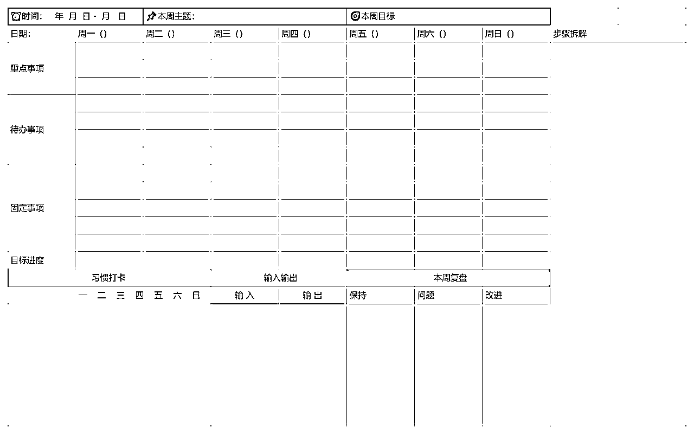
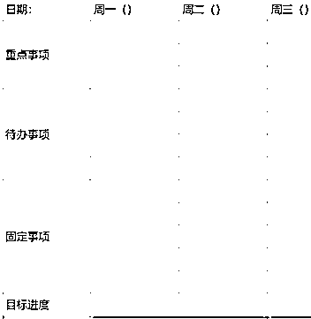
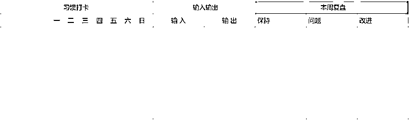

# 如何正确复盘，提高工作效率

> 来源：[https://w9h8opubld.feishu.cn/docx/NFe9dU0cMoJBfTxGFIhcXvT1nCf](https://w9h8opubld.feishu.cn/docx/NFe9dU0cMoJBfTxGFIhcXvT1nCf)

## 一、为什么要做复盘

哈喽，大家好，我是大魔王，前TOP理财公司社群运营，现自由职业，内容创作者，专注个人IP孵化，自媒体变现

拆解了很多上市公司的财务报告，形成了一个理念：像经营一家公司一样经营自己

很久之前，没有意识到要复盘的时候，我的生活都是顺其自然，乱七八糟的，随意挥霍，想做什么，就做什么，结果一年到头来发现自己什么都没有做。

更不用说收获什么了。

虽然几年前开始就开始做自媒体，但是市面上可选择的内容太多，项目琳琅满目，有种刘姥姥进大观园的感觉，什么都好奇，什么都想摸摸看，想带回家试试。

最后就是消耗了自己的精力和时间，在个人成绩上面没有太多的增长，甚至个人基础技能也没有什么提升。

前段时间做年度复盘的时候，忽然发现，当我把每个月的大事件罗列出来时，看到其实自己在年初时做了不少计划，甚至在每个月都会规划要做某个事情，但是一直没有做。

认真复盘了之后才意识到，造成这个局面的主要原因是因为自己复盘不到位。

没有明确的当下的主线任务，更不知道在某个阶段应该做什么事情，所以，全年没有规划，乱七八糟的。

所以为什么要做复盘呢？

因为做复盘，可以客观的看待结果，量化结果与产出

能够明确自己在做的事情，以及要做什么样的事情，达到了一个什么样的状态

可以总结沉淀经验与方法，避免自己在同样的事情上反复犯错。

可以拆解每一个环节的关键影响要素，只有知道为什么，才能清楚下一步应该怎么调整。

总结经验，提升能力，形成方法论。

有目标的人生会让你走的更坚定，但学会了有效复盘的方法，可以让自己少走弯路

我们要实现目标，就要沿着自己的目标前进，才能达到，而复盘可以让我在向目标前进的过程中，不迷失方向，还可以让我们不断精进迭代，更快地到达目的地。

远离内耗、迷茫和不知所措，也会让我们不在同一个问题上跌倒两次，复盘让我们知道我们在奔向目标的过程中是否有偏差，会让我们绕开弯路

每一次复盘，都是沉淀自己的时间

每一次复盘，都会把自己从错误的轨迹中剥离出来

每一次复盘，都是离目标更近一次

## 二、我做复盘收获了什么

通过不断的复盘，记录，我从一个迷茫无措的状态，不知道该做什么，我的路在何方，变成了一个自律，有想法，有方向，不断向上的人

并且，经过复盘，记录了自己生活的点点滴滴，让自己的生命有迹可循

知道了自己应该做什么，可以做什么，自己当下处于什么样的状态。

我现在特别喜欢的一个状态就是知道自己在做什么，自己欠缺什么，需要学习什么样的知识来弥补自己的不足。

我想很多人卡点不知道如何解决就是因为当下的状态是混沌的，对自己了解的太少。

所以多了解自己做了什么？什么做的好，什么做的不好，应该如何及时的纠正回归正轨。不断的迭代自己。就一定要学会去复盘，反思自己的行为动向。

## 三、如何正确科学的做复盘

### 3.1以终为始快速达成目标，先设立目标，可操作性

在开始行动之前，要清楚目标在哪里。

没有目标的努力和付出，是很容易迷航的

就像我们每次出门要知道我们要去哪里，我们才知道应该如何行动，外出。

但，我们的目标和重点不能太宽泛，这个“终”要是一件非常具体的事情，比如我说我要减肥鸭，我的目标不能是减肥，而是要明确的我想减20斤这种具体的目标，我要用100天的时间，或者200天的时间完成这件事。

要有非常明确的目标，以这个终点为结果导向而努力

当然也可能不少人说，我不知道我要做什么，我不知道我的终点是什么，不知道怎么去具体自己的终点

那我们可以尝试记录一下自己的生活

来思考我们自己的价值观和人生目标，包括你的职业、家庭、个人成长等方面的愿景

把这些方面用笔、纸写下来，逐渐拆解、具体化

也可以通过复盘过去，来设定自己的未来。

看自己过去的一年在做什么事情，比如问自己一些问题：

1、这一年我做过最明智的决定是什么？

2、这一年我学到最宝贵的一课是什么？

3、这一年我遇到了哪些挑战？

4、这一年最让我自豪的是什么？

5、这一年对我影响最大的是谁？

6、这一年我有哪些遗憾？

7、这一年我发现自己最大的闪光点是什么？

8、这一年我最感恩的人或者事情是什么？

去回答这些问题的时候，一定要深挖，不要只是单纯的回答问题

我们要去关注到问题最根本的原因所在，多问几次为什么，这样我们就能了解到自己对于什么事情是比较在意的，以及我们当下所处的状态。

### 3.2【周主题计划】集中精力

#### 3.2.1什么是【主题周计划法】

这个灵感来自之前很喜欢的一个博主：俩不正出的30天挑战。就是用30天时间来完成一件事，比如她一开始出的挑战是学习跳一支舞。

我特别喜欢观战别人立flag，然后一步步完成的样子，感觉见证了一件很了不起的大事。

那个时候俩不正每天出一个视频，同步她在这场挑战中做了些什么，有了什么样子的进步，当然都是围绕着她所要做的事情。

也有不少人每天在评论区打卡，自己30天要完成的事情，以及自己第1天，第2天，第xx天，做了什么。

30天过后，她如自己所愿完成了舞蹈学习，甚至出了两支MV，来展示自己的30天成果。

评论区有不少人表示，原来专注的做一件事情，真的还蛮酷的，也让自己有了很坚定的选择，知道该做什么。

当时，这个计划对我自己触动还是比较大的，因为我总是会认为30天的时间太短了，什么都做不了，但是自己却又想做很多事情，这个项目想要涉足，那个项目也想尝试。

所以，会导致自己很拉扯，并且什么都做不到，只会无尽的消耗自己的时间和意志力。

对自己目标不清晰，能力不了解时，就很容易走向一个误区。就是每个月的起始，都会认为一切清零，自己有大把的时间可以做很多事情。

因此我开始设想自己一个月就搞定一件事，但对于有拖延症的人来说，一个月的时间似乎也是比较久的，没有形成良好的习惯控制，就会无限拖延。

但一个星期的时间相对来说就好掌控了许多，时间线也不会拉的特别长久。去做一件事也能够完成一个很小的闭环，获得成就感。

所以，思考了一个新的方式叫做【主题周计划法】

简单就是这一周给自己定一个主题，这一周除了工作和必要的事情之外，空出的大部分时间都用来做这件事

也就是说用一周的时间来推进一件事的进度。

而不是把我们仅有的精力拆散开，一会做做这个，一会做做那个，毫无章法可言。

我想多数人都会这样，想做的事情太多，哪个都不想舍弃，每一个都想做起来，做出点成绩，并且希望能够快速见效，获得结果。

但是同时去做的时候就会发现哪个都搞不定，精力会被消耗的很厉害

但如果我就锚定一件事，结果可能会完全不同，我们把想做的事情都罗列出来，从中挑选当下最想做的，或者离自己的目标计划最近的事情，作为我们当下的【周主题】,比如我的本周主题就是【搞定视频号直播】

那我这周就聚焦在这个任务上

每天做完必要的工作，就是来学习操作视频号直播相关的内容

坚持一周就会把对应的课程以及基础玩法搞定，并且一定可以顺利开播

这样做的好处就是，我们可以聚集我们的精力

而且时间周期短，也不会用意志力强迫自己

从拖延摆烂到动力十足，铆足全力去完成

一件事做久了多少会懈怠，而【主题周计划】可以很大程度上保持你的热情，一个月轮换四个主题周，就像通关打游戏一样，每天都有所期待

所以想做的事情太多，无从下手，或者给自己安排的任务太多，有些无力的小伙伴，可以尝试把内容都梳理出来，然后选出一个当下最重要的

或者变现路径最短的事情，或者最迫切的事情，来当做自己本周的主题

周计划更有掌控感，相对于月计划来说，比日计划更加灵活

#### 3.2.1操作步骤

1、确定自己的主题，比如本周我要做的是做【视频号直播】，确定一个本周的中心任务

2、拆解自己的主题，拆解成具体的行为，比如完成这个主题需要哪几个步骤，罗列出来

3、把主题拆解后的步骤安排到每天，根据当天可被利用的时间，评估安排什么事情

可以根据下面的表格进行自己的主题拆解，围绕着我们的年度目标，月目标，进行每个周的任务分配和执行

（可以找魔王领取模板）（nihaodamowang001）

这个表格的设计是按照魔王的计划，复盘的方式进行的。

*   先明确，当下的时间。本周的主题是什么，本周的目标是什么。

比如：本周主题：【视频号直播】

本周目标：【周五之前做好准备工作，并开启一场直播】

*   第二步，根据自己的【周主题】进行步骤拆解。即要完成自己的目标需要做什么样的步骤。

比如：【视频号直播】

步骤：

1.  注册视频号的账号

1.  学习了解如何开启一场直播，直播的步骤是什么

1.  准备直播的主题内容

1.  准备直播的大纲

1.  开启直播

*   第三步，把拆解好的大致步骤，按照需求，划分到周内的每一天中。

这样我们本周要做什么，以及如何做就会非常的清晰明确了。

*   每日计划这块呢，我分了三个板块进行任务的梳理

1.  重点事项：就是今天务必要完成的任务。当我们知道我们本周要做什么内容的时候，并且任务也拆解了步骤，那我们重点事项就是围绕着【周主题】来进行。

把要做的事情安排到每一天，进行清单化作业

1.  待办事项：即完成完重要的事项后需要做的事情，比如一些额外的事情

1.  固定事项：这块相对来说是比较好理解的，就是我们日常要做的动作。比如，做IP的宝子每天要发朋友圈，要引流等等之类的内容。

当然也可以根据自己的年度/月度目标，划分出来的每天要做的事情。比如，魔王年度目标要读300小时书，每 天固定月度一个小时

*   第四步，也就是我们的总结复盘，以及一些些习惯打卡

1.  习惯打卡：可以是自己日常的要求，比如早起，早睡，完成打钩，没有完成直接打×

1.  输入输出：输入：比如读了《xxx》书籍，看了《xxx》纪录片等等。输出：写了公众号xx篇，写了小红书xx篇笔记等等。

1.  本周复盘：

保持：本周做的好的事情，比如学会了复盘，那就坚持下去。或者处理某个问题处理的不错，学会这个处理的方法，坚持使用。

问题：本周面对的问题有哪些？比如：早起会玩手机、晚上睡觉太晚等等

改进：根据自己的问题来想一个合理的方式，进行改正。比如：早起玩手机，那就睡觉之前把手机放远一些，早起不方便拿到，就可以直接起床等等

每周不用给自己设定太多的限制，我们去做成一件事情，改正一个问题毛病，就是在进步和成长的。

## 四、写到最后

每个周一个表格，卡片，可以直接线上操作，也完全可以打印出来，用纸笔记录下来

一年52周，我们就可以通过这个形式很清晰的理解到自己做了些什么事情，有了什么样子的成就

能够看到我们努力的痕迹和不断向上的路径

当然这只是众多复盘方式中的一种，如果没有既定的复盘方式，可以尝试一下这个方式。

我们坚持复盘一个月，三个月，就会很清晰的知道自己在做什么，可以做什么，会对自己，对未来有清晰的了解。

也能够帮我们节约不少时间和精力，把一些没必要的时间消耗砍掉。

感谢大家的观看，最后，如果有需要模版的宝子，可以联系魔王获取（nihaodamowang001）