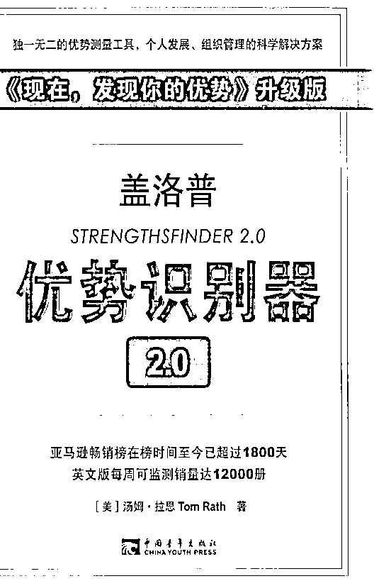

# 请把你的《盖洛普优势识别器》扔进垃圾桶，收下这份手册

> 来源：[https://i0izh5b4v98.feishu.cn/docx/NW2UdE0iGod0EzxqidIcekmjnRe](https://i0izh5b4v98.feishu.cn/docx/NW2UdE0iGod0EzxqidIcekmjnRe)

# 《盖洛普优势识别器2.0》华人大白话版（34个优势才干的浅显解释与行动建议）

原书为《盖洛普优势识别器2.0》，奈何真的太晦涩难懂了。

于是我产生了一个想法，通过AI转化为“大白话版”，于是有了本文件。

感谢这个时代！

顺便提一句：如果要原书的PDF版或doc版，请到本人公众号“从零实现人生富足”回复“盖洛普识别”（文件太大）。一切本着免费利他的原则，不因此产生任何盈利。

使用方法很简单，测出你的前十优势才干后，直接找到相应的主题来看就行。

其实还有更好的方法，可以轻松借助AI的力量读懂盖洛普优势才干报告，可以看我文章[AI时代我们如何打造学习力]。

## 最简版

### 一句话解释

1.  成就：你是个工作狂，喜欢看到自己的努力有实际成果。建议：找能让你忙碌的工作，庆祝自己的成就。

1.  行动：你是个行动派，喜欢把想法变成现实。建议：找能自主决策的工作，快速实施新想法。

1.  适应：你擅长应对变化，能灵活适应新情况。建议：在需要快速反应的工作中表现，保持冷静。

1.  分析：你喜欢深入研究，用逻辑和数据来解决问题。建议：选择需要分析的工作，确保信息能被应用。

1.  统筹：你擅长协调资源，找到最佳解决方案。建议：参与团队建设，组织大型活动。

1.  信仰：你有自己的价值观，这些信念指导你的行为。建议：寻找符合你价值观的工作，分享你的信仰。

1.  统率：你天生就是领导者，喜欢影响他人。建议：准备好面对冲突，自然地影响团队。

1.  沟通：你善于表达，能吸引听众。建议：在需要沟通的工作中发挥作用，练习讲故事。

1.  竞争：你喜欢竞争，通过挑战来提升自己。建议：选择有竞争性的工作环境，庆祝胜利。

1.  关联：你认为万物相连，善于建立联系。建议：在需要协商的角色中发挥作用，帮助理解全球工作的重要性。

1.  公平：你重视公平正义，反对不公平。建议：在需要公正的角色中工作，建立奖励制度。

1.  回顾：你喜欢回顾过去，从中学习。建议：在计划项目前研究过去的项目，用案例研究来教育。

1.  审慎：你谨慎行事，避免冲动。建议：在提供建议的工作中发挥作用，解释你的决策过程。

1.  伯乐：你有发现和培养他人潜能的天赋。建议：帮助他人成长，寻找能赏识你的导师。

1.  纪律：你对秩序和规律有强烈需求。建议：经常检查以确保事情正确，提高效率。

1.  体谅：你能深刻理解他人的感受。建议：帮助朋友和同事度过困难时期，成为他人的知己。

1.  专注：你需要明确的目标来指导行动。建议：设定严格的目标，帮助他人设立目标。

1.  前瞻：你对未来充满憧憬，能看到可能性。建议：选择能提出未来想法的角色，与他人分享你的想法。

1.  和谐：你追求和平与一致，避免冲突。建议：建立不同观点的人群关系网，解决冲突。

1.  理念：你对理念和概念感兴趣，喜欢探索事物的本质。建议：在需要创新思维的工作中发挥作用，分享你的想法。

1.  包容：你接纳和理解不同的观点和人。建议：帮助新人融入团队，寻找共同点。

1.  个别：你对每个人的独特性有深刻理解。建议：选择能发挥你理解个人差异能力的工作。

1.  搜集：你喜欢收集信息和资源。建议：考虑接触新信息的职业，建立信息存储体系。

1.  思维：你喜欢思考和反思。建议：记录你的想法，与人进行智力思辨。

1.  学习：你热爱学习的过程。建议：提炼你所学到的知识，帮助他人适应新规则。

1.  完美：你追求卓越，注重细节。建议：专注于开发你最显著的天赋，寻找能帮助他人成功的职务。

1.  积极：你拥有乐观和积极的态度。建议：在突出你优势的工作中发挥才能，为工作场所注入动力。

1.  责任：你对自己的承诺和责任有强烈的认同感。建议：在求职时强调自己的责任感，主动承担更多职责。

1.  排难：你具有解决问题的天赋。建议：寻找需要解决问题的工作，提高技能和知识。

1.  自信：你对自己有着坚定的信念。建议：寻找尚无规则建立的工作，让你的自信心感染他人。

1.  追求：你渴望在他人眼中显得卓越。建议：选择可以自己决定任务的职务，分享你的梦想和目标。

1.  战略：你具有独特的思维方式，能预见未来。建议：花时间全面自省，参与新计划的早期创建。

1.  取悦：你喜欢结识新人并赢得好感。建议：选择能让你与许多人交流的工作，建立人脉网络。

1.  交往：你重视与他人的亲密关系。建议：找一个重视友谊的工作场所，主动了解你接触的人。

### 每个才干的核心特质

1.  成就：追求者 - 总是渴望达成目标。

1.  行动：实干家 - 喜欢立即行动，不喜欢空谈。

1.  适应：灵活者 - 能迅速适应新环境和变化。

1.  分析：逻辑家 - 喜欢用数据和逻辑来解决问题。

1.  统筹：协调者 - 擅长管理和优化资源。

1.  信仰：信念者 - 有坚定的价值观，行为一致。

1.  统率：领导者 - 喜欢影响他人，有领导力。

1.  沟通：讲述者 - 善于用言语吸引和沟通。

1.  竞争：竞技者 - 喜欢挑战，通过竞争提升自己。

1.  关联：连结者 - 认为事物相互关联，善于建立联系。

1.  公平：公正者 - 重视公平，反对不公。

1.  回顾：历史者 - 从过去中学习，重视经验。

1.  审慎：谨慎者 - 决策前深思熟虑，避免冲动。

1.  伯乐：导师 - 发现并培养他人的潜能。

1.  纪律：组织者 - 需要秩序和规律，追求效率。

1.  体谅：同理者 - 能理解他人的感受和立场。

1.  专注：聚焦者 - 需要明确目标，集中精力。

1.  前瞻：梦想家 - 看到未来的可能性，有远见。

1.  和谐：和平者 - 追求一致，避免冲突。

1.  理念：创新者 - 对新理念感兴趣，喜欢探索。

1.  包容：接纳者 - 尊重多样性，创建包容环境。

1.  个别：个性化 - 关注个人差异，因材施教。

1.  搜集：收藏家 - 对信息和资源有收集的兴趣。

1.  思维：思考者 - 喜欢深入思考，反思问题。

1.  学习：学者 - 热爱学习，不断求知。

1.  完美：完美主义者 - 追求卓越，注重细节。

1.  积极：乐观者 - 保持积极态度，面对挑战。

1.  责任：守信者 - 对承诺负责，重视信誉。

1.  排难：问题解决者 - 面对挑战，寻找解决方案。

1.  自信：自信者 - 相信自己的能力和判断。

1.  追求：卓越追求者 - 渴望被认可，追求卓越。

1.  战略：策略家 - 能预见未来，制定计划。

1.  取悦：社交者 - 喜欢结识新人，建立关系。

1.  交往：亲密者 - 重视深度关系，愿意分享。

## 详细版

以下为34个优势才干的解读、行动建议和关键词：

### 成就

第一个主题是“成就”，这个主题说明你天生就有一种追求成功的驱动力。你每天都像从零开始一样，必须看到实实在在的成果才会感到满足。这种追求成就的渴望可能没有逻辑，但总是驱使你不断前进，即使有时候可能会让你感到不满足。你需要学会和这种不满足感相处，因为它能给你带来动力，让你长时间工作而不觉得疲倦。

行动建议：

1.  选择那些能让你忙碌且鼓励你评估工作效率的工作。

1.  庆祝成就，给自己一些肯定。

1.  在会议中提前了解目标，确保会议高效。

1.  通过获得认证等方式提升自己。

1.  设定挑战目标，自我激励。

1.  与努力的人合作，共享目标。

1.  用你自己的评分体系来衡量个人成绩。

1.  展望未来，展开新计划和项目。

1.  确保工作质量，制定可衡量的标准。

1.  与具有“成就”天赋的人共事时，要让他忙碌，帮助他测量业绩，通过合作建立联系，给他更高的目标，以及了解他的其他天赋主题。

关键词：追求成功、动力、不满足感、自我激励、合作、目标设定、质量保证、自我评估、未来展望、工作质量、团队合作。

### 行动

第二个主题是“行动”，这个主题表明你是一个行动派，喜欢把想法付诸实践。你不喜欢空谈，更看重实际行动。一旦做出决定，你就会立即行动起来，即使其他人还在犹豫不决。你认为只有通过行动，才能实现目标和成果。你相信最好的学习方式是通过实践，即使这意味着要面对失败和挑战。

行动建议：

1.  寻找可以自主决策并采取行动的工作。

1.  确保你的经理根据可衡量的结果评价你的能力。

1.  将创新思想快速付诸实践。

1.  寻找讨论或阻碍导致事情停滞的局面，制定计划推动事情发展。

1.  通过实际体验而非理论探讨来学习和提高。

1.  与有影响力和决策能力的决策者建立联系。

1.  与善于分析、前瞻或战略的人合作，互补优势。

1.  准备好批准你行动请求的理由。

关键词：行动导向、决策、实践、学习、挑战、合作、影响力、理由准备。

### 适应

第三个主题是“适应”，这个主题意味着你能够灵活应对变化。你不喜欢一成不变的计划，而是喜欢根据当前的情况做出反应。你能够迅速适应新的要求或意外的曲折，即使这意味着要改变原有的计划。你是一个能够随机应变的人，即使在压力下也能保持冷静和高效。

行动建议：

1.  在他人因日常琐事心烦意乱时，保持镇定自信。

1.  避免承担需要组织和预测能力的角色。

1.  帮助犹豫的朋友、同事和客户找到整理心情和控制形势的方式。

1.  不要让他人滥用你的灵活性天赋。

1.  寻求需要对不断变化的环境快速作出响应的工作。

1.  调整你的快速反应能力。

1.  寻求由他人制定计划。

1.  在面临曲折处境时保持良好心态。

1.  公开表现可靠风度以安抚不满的朋友或同事。

1.  与具有“适应”天赋的人共事时，要让他参与到需要立即行动的短期任务中。

关键词：灵活性、适应变化、随机应变、压力下保持冷静、快速反应、短期任务、保持良好心态。

### 分析

第四个主题是“分析”，这个主题说明你具有挑战和分析事物的天赋。你喜欢用数据和逻辑来验证观点，寻找模式和关联。你的问题总是深入到事物的本质，试图揭示背后的原理。你相信只有经过严谨分析，才能得出有意义的结论，这种追求精确和逻辑的态度使你在解决问题时显得特别有条理。

行动建议：

1.  选择可以通过分析数据、探寻模式或构思创意来获得报酬的工作。

1.  确保你依赖的可靠信息来源。

1.  表达你的想法，无论是通过写作、一对一谈话、小组讨论还是演讲。

1.  确保你积累和分析的信息能被应用和实施。

1.  参加学术课程，扩展你的“分析”天赋。

1.  主动发挥你的“分析”天赋，帮助他人组织大量数据或构思。

1.  与拥有优秀“行动”天赋的人合作，将分析转化为行动。

1.  帮助他人理解你的分析方法需要数据和其他信息来支持。

1.  寻找数据模式，帮助他人看出其中的规律。

1.  在与具有“分析”天赋的人共事时，深入探讨重要决策，提供支持性数据，解释决策的逻辑依据，提供准确数字，认真考虑他的意见。

关键词：挑战、分析、数据、逻辑、模式、关联、精确、应用、合作、逻辑依据、数据模式。

### 统筹

第五个主题是“统筹”，这个主题表明你擅长管理和协调各种资源以达到最佳效果。你喜欢控制变量，寻找最佳组合，以实现目标。你能够在复杂的环境中灵活调整策略，找到新的解决方案。你的这种能力让你在面对变化和挑战时显得游刃有余。

行动建议：

1.  了解同事和朋友的目标，帮助他们实现。

1.  如果需要建立团队，确保你参与其中。

1.  识别不同人可以合作的潜力。

1.  注意任务、项目和职责的持续期限。

1.  寻找复杂、充满活力且不拘一格的环境。

1.  承担组织大型活动、会议等。

1.  解释你做事的方法，让他人理解。

1.  用灵活的方式组织工作和分配空间。

1.  在与具有“统筹”天赋的人共事时，让他负责，承担复杂任务，挑选和分派项目组成员，寻找解决问题的新途径，化解矛盾。

关键词：管理、协调、控制变量、灵活调整、最佳组合、复杂环境、组织活动、解释方法、灵活组织、团队合作。

### 信仰

第六个主题是“信仰”，这个主题意味着你拥有坚定的价值观和信念。这些核心价值指导你的行为和决策，让你在面对诱惑和干扰时保持恒定。你的信仰让你在工作和人际关系中寻求意义，并且你倾向于选择那些与你的价值观相符的工作。

行动建议：

1.  回顾你度过的最好日子，理解你的价值观。

1.  寻找符合你价值观的角色。

1.  提醒他人工作的重要性和意义。

1.  分享你的价值观，激励他人。

1.  平衡工作和个人生活的时间。

1.  不要害怕表达自己的价值观。

1.  结交有共同价值观的朋友。

1.  与具有优秀“前瞻”天赋的人合作。

1.  在与具有“信仰”天赋的人共事时，了解他的激情所在，尊重他的承诺，将他的价值观与公司文化相结合，理解并尊重他的信仰体系。

关键词：价值观、信念、行为指导、恒定、工作意义、个人生活、表达价值观、共同价值观、信仰体系。

### 统率

第七个主题是“统率”，这个主题表明你具有强烈的领导倾向。你喜欢明确地表达自己的观点，并希望影响他人。你不怕对立，甚至认为这是解决问题的第一步。你推动他人承担风险，有时甚至会逼迫他们。人们往往愿意跟随那些立场鲜明的领导者。

行动建议：

1.  准备好迎接正面的冲突，练习言辞和技巧。

1.  在关系圈里，坦白且直接地谈论敏感话题。

1.  咨询别人的意见，解释你的率直原因。

1.  在危机时刻，利用你的“统率”天赋减少他人的恐惧。

1.  考虑领导委员会，自然地影响团队跟随自己。

1.  寻找说服他人的角色，如销售。

1.  在与具有“统率”天赋的人共事时，让他评估公司现状，牵头项目，除非说到做到，否则不要威胁他，如果他犯错，要果断处理。

关键词：领导倾向、表达观点、对立、风险承担、危机管理、领导委员会、说服他人。

### 沟通

第八个主题是“沟通”，这个主题说明你善于用言语表达和交流。你能够将枯燥的概念变得生动有趣，吸引人们的注意力。你希望人们记住你传达的信息，因此你会用故事、案例和比喻来讲述。你的沟通能力使你在教育、销售、市场营销等领域发挥出色。

行动建议：

1.  考虑在需要吸引注意力的工作中发挥作用，如教学、销售、市场营销等。

1.  收集和练习讲述共鸣的故事或成语。

1.  关注听众的反应，找出吸引他们注意力的部分。

1.  准备演讲，但保持即兴演讲的自然感。

1.  与能够良好沟通的个人或群体建立联系。

1.  谨慎使用词语，注意听众的反应。

1.  确保传达的信息有实质内容。

1.  在与具有“沟通”天赋的人共事时，让他参加社交活动，了解他的生活经历，讨论社交活动计划，鼓励他搜集公司内部的故事，帮助专业人员改进演示效果。

关键词：言语表达、吸引注意力、故事讲述、听众反应、即兴演讲、沟通技巧、实质内容、社交活动。

### 竞争

第九个主题是“竞争”，这个主题表明你天生喜欢竞争，并且通过比较和挑战来衡量自己的成就。你的动力来自于与他人竞争，并且享受胜利带来的满足感。你相信通过竞争，可以推动自己不断进步。

行动建议：

1.  选择可以衡量自身成就的工作环境。

1.  列出表现得分，了解自己的进展。

1.  确定一个有高成就的人作为比较对象。

1.  把任务变成竞争性的比赛。

1.  研究胜利的原因，从成功中学习。

1.  庆祝胜利，认识到没有庆祝就没有胜利。

1.  设计精神策略来面对失败。

1.  在与具有“竞争”天赋的人共事时，使用竞争性语言，帮助他寻找获胜的机会，与好胜的人进行比较，讨论天赋，安排竞赛。

关键词：竞争、比较、成就、挑战、胜利、庆祝、失败策略、竞争性语言。

### 关联

第十个主题是“关联”，这个主题意味着你认为万事万物都是相互关联的。你相信我们都是宏观世界的一部分，这种关联感让你对人和事都充满同情和理解。你成为不同文化和背景之间的桥梁。

行动建议：

1.  考虑在听取他人意见和进行协商的角色中发挥作用。

1.  研究方法来开阔你对联系的感觉。

1.  在组织中帮助同事理解他们的工作在全球工作中的重要性。

1.  帮助他人了解他们的天赋、行动、使命和成功之间的联系。

1.  与拥有优秀“沟通”天赋的人合作。

1.  在与具有“关联”天赋的人共事时，认真倾听他的立场，鼓励他与不同团队沟通，了解并接受他的宗教立场，帮助组织构思和定义使命。

关键词：关联、宏观世界、同情、理解、文化桥梁、协商、使命、沟通合作。

### 公平

第十一个主题是“公平”，这个主题表示你非常重视公平和正义。你相信每个人都应该受到平等对待，无论他们的社会地位如何。你反对任何形式的不公平，并且愿意站出来维护公平原则。

行动建议：

1.  列出你一贯遵守的公平原则。

1.  在工作或社区中寻求主持公道的角色。

1.  建立荣誉制度，奖励真正应得的人。

1.  挑战那些破坏规则的人。

1.  关注业绩，确保公平对待。

1.  起草备忘录以确保规则清晰。

1.  在与具有“公平”天赋的人共事时，支持他的变化，喜欢他的现实主义，让他在项目完成后表彰团队成员，进行群体数据分析，公平严格地执行规章。

关键词：公平原则、主持公道、荣誉制度、挑战规则、业绩关注、备忘录、支持变化、现实主义、表彰团队、群体数据分析、执行规章。

### 回顾

第十二个主题是“回顾”，这个主题表明你倾向于回顾过去，从中寻找答案和指导。你认为了解历史和前因后果对于理解现状和未来至关重要。

行动建议：

1.  在计划项目前，鼓励参与者研究过去的项目。

1.  根据案例研究来组织课程。

1.  通过民间故事加强组织文化建设。

1.  与具有“前瞻”或“战略”天赋的人合作。

1.  接受改变，但不忘过去的教训。

1.  与过去的成功事例比较，为他人描绘未来的画面。

1.  在与具有“回顾”天赋的人共事时，每次开会都让他做回顾，喜欢通过案例思考，向他介绍新同事时先让他了解背景，解释行动的构思过程。

关键词：回顾过去、历史、前因后果、组织文化、前瞻、战略、接受改变、成功事例、案例思考、了解背景。

### 审慎

第十三个主题是“审慎”，这个主题意味着你是一个谨慎和警觉的人。你深知世事难测，因此你总是小心翼翼地评估风险和可能的后果。你避免冲动行为，而是通过深思熟虑来做出决策。

行动建议：

1.  考虑从事提供建议和劝告的工作，如法律或商业咨询。

1.  解释你做决定的审慎是为了控制风险。

1.  在变革期间，考虑保守决策的好处。

1.  不要过早地向他人透露个人信息。

1.  与具有“统率”、“自信”或“行动”天赋的人合作。

1.  在与具有“审慎”天赋的人共事时，让他加入容易冲动的团队，帮助决策前排除隐患，尊重他的隐私，不要让他担任需要当机立断的工作。

关键词：谨慎、风险评估、深思熟虑、保守决策、隐私、合作伙伴。

### 伯乐

第十四个主题是“伯乐”，这个主题表明你有发现和培养他人潜能的天赋。你关注每个人的成长和进步，乐于帮助他们实现潜力。你寻找机会挑战他们，帮助他们成长。

行动建议：

1.  列出你帮助他们学习和成长的人的名单。

1.  寻求你主要负责推动成长的角色。

1.  确定能赏识你内在的某些独特之处的导师。

1.  与拥有优秀“个别”天赋的人合作。

1.  在与具有“伯乐”天赋的人共事时，增强他催人奋进的自我意识，让他出面表扬优秀的同事，帮助他在工作中取得进步。

关键词：发现潜能、成长、挑战、导师、个别天赋、表扬、进步。

### 纪律

第十五个主题是“纪律”，这个主题表示你对秩序和规律有着强烈的需求。你喜欢有计划和组织，并且通过建立常规和时间表来实现目标。你讨厌意外和失误，追求精确和效率。

行动建议：

1.  不要犹豫，经常检查以确保事情正确。

1.  接受犯错会使你沮丧的事实。

1.  寻找方法以转移烦恼，防止愈演愈烈。

1.  提高效率，找到浪费时间和金钱的情况。

1.  在与具有“纪律”天赋的人共事时，确保提前告诉他任务期限，不要突然改变计划，给他整顿混乱的机会。

关键词：秩序、规律、计划、组织、精确、效率。

### 体谅

第十六个主题是“体谅”，这个主题表明你能够深刻理解他人的感受和立场。你善于设身处地地考虑问题，能够察觉他人的需求和情感。你的这种能力让你在人际关系中显得特别有同理心。

行动建议：

1.  帮助朋友和同事意识到某人的困难时期。

1.  当某人的行为方式不利于他们自己或他人时，采取措施制止。

1.  考虑成为他人的知己或导师。

1.  制定固定的程序以在每天结束时使用，表明工作已完成。

1.  在与具有“体谅”天赋的人共事时，让他帮助你弄清楚组织内某些人的想法，了解他和其他人对行动方案的感受，向他求助以感知员工或顾客的疑问，安排他与积极乐观的人共事。

关键词：理解他人、同理心、困难时期、知己导师、工作完成。

### 专注

第十七个主题是“专注”，这个主题说明你需要一个明确的目标来指导你的行动。你本能地过滤掉那些与你的目标无关的事情，这使你能够更高效地工作。你的专注力让你在团队中成为一个宝贵的成员，能够确保团队保持正确的方向。

行动建议：

1.  当设定目标时，严格要求自己遵守时间期限和测评标准。

1.  作为团队成员，帮助他人设立目标。

1.  把你的目标延伸到工作之外的领域。

1.  制定计划并坚持遵守，确保实现所有目标。

1.  在与具有“专注”天赋的人共事时，让他参与有严格期限的项目，定期与他碰头，解释变化，让他参加时间管理培训。

关键词：明确目标、过滤无关事务、团队方向、个人生活目标、时间管理。

### 前瞻

第十八个主题是“前瞻”，这个主题表明你对未来充满憧憬，并且能够看到未来的可能性。你是一个梦想家，能够激发他人对美好未来的期待。你的思维不受现状的限制，总是寻找新的机会和创新的方法。

行动建议：

1.  选择一个可以提出未来想法的角色。

1.  花时间思考未来，与他人分享你的想法。

1.  与具有优秀“前瞻”天赋的朋友或同事讨论未来。

1.  与拥有优秀“行动”天赋的人合作，将愿景付诸行动。

1.  在与具有“前瞻”天赋的人共事时，让他分享他的愿景，经常讨论可能性，提供相关资料，给他时间去思考和规划未来。

关键词：未来憧憬、梦想家、新机会、创新方法、愿景分享。

### 和谐

第十九个主题是“和谐”，这个主题意味着你追求和平与一致。你努力避免冲突，寻求共识。你认为团队的和谐是成功的关键，因此你总是努力维护团队的和谐氛围。

行动建议：

1.  建立拥有不同观点的人群关系网。

1.  当两个人正在争论时，邀请组中的其他成员分享他们的想法。

1.  避免担当日常工作中会与他人对抗的角色。

1.  锻炼你在不产生对抗的情况下解决冲突的技巧。

1.  在与具有“和谐”天赋的人共事时，尽量使他远离冲突，不要浪费时间与他讨论有争议的问题，当他和别人争执不下时，他可以化解矛盾。

关键词：和平追求、避免冲突、共识、和谐氛围、解决冲突。

### 理念

第二十个主题是“理念”，这个主题表明你对理念和概念有着浓厚的兴趣。你喜欢探索事物的本质，寻找事物之间的联系。你的思维活跃，总是试图从不同的角度看待问题，这让你能够提出创新的观点和解决方案。

行动建议：

1.  寻求能发挥你想象力的工作，如市场营销、广告业、新闻业、设计或新产品开发。

1.  在你的工作或生活中引入小变化，以保持积极向上的状态。

1.  在交流前完成你的思考和想法，确保你的观点成熟。

1.  学会整理想法或找到一个能“证明”你的想法正确或能指出有潜在缺陷的朋友或同事。

1.  在与具有“理念”天赋的人共事时，分享能准确表达概念、观点或模式的词组，让他发挥设计才干，向他灌输新观念。

关键词：理念探索、概念联系、创新观点、思维活跃、设计才干。

### 包容

第二十一个主题是“包容”，这个主题意味着你乐于接纳和理解不同的观点和人。你相信每个人都是独特的，并且尊重这种多样性。你努力创建一个包容的环境，让每个人都感到被接纳和尊重。

行动建议：

1.  考虑从事你能代表他人表达被忽视想法的工作。

1.  帮助刚进组织或团队的新人认识其他人。

1.  属于反精英主义，帮助每个人找到他们所做的贡献的共同点和价值。

1.  当必须要传达坏消息时，接纳不和谐的声音。

1.  在与具有“包容”天赋的人共事时，让他动员每个人参加集体活动，帮助想想还有哪些潜在的客户、市场或机会是现在没有发现的。

关键词：接纳多样性、代表他人、共同点价值、不和谐声音、集体活动。

### 个别

第二十二个主题是“个别”，这个主题说明你对每个人的独特性有着深刻的理解和欣赏。你关注个人差异，并且本能地观察每个人的风格、动机、思维方法和交际方式。你能够因材施教，使每个人发挥其最大的潜力。

行动建议：

1.  选择一个能发挥你“个别”天赋的职业，如咨询、监督、教学或销售。

1.  在描述自身优势和个人风格方面成为能手，并帮助他人规划未来。

1.  让他人认识到真正的多元见于细微差别之中。

1.  弄清你团队中每个人的长处，并帮助他们发挥天赋、技能和知识。

1.  在与具有“个别”天赋的人共事时，当他觉得理解一个人的想法有困难时，向他求助，让他帮助设计绩效薪酬方案，参与职务选拔委员会的工作。

关键词：独特性、个人差异、多元、因材施教、团队长处。

### 搜集

第二十三个主题是“搜集”，这个主题表明你对收集信息和资源有着浓厚的兴趣。你喜欢积累各种信息，无论是词汇、事实、书籍还是实物。你对世界的好奇心驱使你不断学习和探索。

行动建议：

1.  考虑每天都能接触新信息的职业，如教学、研究或新闻。

1.  建立可以存储和轻松查找信息的体系。

1.  与具有明显“专注”或“纪律”天赋的人合作，保持注意力集中。

1.  分享你的知识，帮助他人利用这些信息。

1.  在与具有“搜集”天赋的人共事时，保证他能获知最新消息，安排他担任有大量研究任务的工作，帮助他开发一套信息存储系统。

关键词：信息收集、好奇心、资源积累、知识分享、信息体系。

### 思维

第二十四个主题是“思维”，这个主题表明你喜欢思考和反思。你喜欢深入探讨问题，无论是解决难题、酝酿创意还是理解他人的感受。你是一个喜欢独处的人，因为这样你才能沉思冥想，你的内向性格使你成为自己最好的伴侣。

行动建议：

1.  考虑开始或继续对哲学、文学或心理学的研究。

1.  用日志和日记记录你的想法。

1.  有意识地与你认为的“思想家”建立联系。

1.  与人进行智力和逻辑思辨。

1.  在与具有“思维”天赋的人共事时，随时向他的思想挑战，鼓励他用整块的时间来思考，同他详细讨论他的优势。

关键词：思考、反思、独处、智力思辨、思想挑战。

### 学习

第二十五个主题是“学习”，这个主题说明你热爱学习的过程。你被从无知到熟练的过程所吸引，无论是新技能的掌握还是知识的积累。你对学习的激情使你能够在不断变化的环境中保持适应性。

行动建议：

1.  提炼你所学到的知识。

1.  制定跟踪学习进度的方法。

1.  促成转变，帮助他人适应新规则、新技能或新环境。

1.  寻找要求一定技术核心能力的职务。

1.  在与具有“学习”天赋的人共事时，为他创造学习的条件，帮助他记录学习过程，鼓励他成为某个领域的专家。

关键词：学习过程、适应性、提炼知识、技术核心能力、学习条件。

### 完美

第二十六个主题是“完美”，这个主题表明你对卓越有着不懈的追求。你致力于将事物做到最好，无论是个人的工作表现还是团队的成果。你关注细节，追求完美，这使得你的工作和成果总是超出平均水平。

行动建议：

1.  专注于开发你最显著的天赋。

1.  将你的才华用于工作之外的领域。

1.  研究成功之道，与那些已发现自身优势的人接触。

1.  寻找能帮助他人获得成功的职务。

1.  在与具有“完美”天赋的人共事时，让他专注于将正常业绩最大化，了解他的优势，帮他开辟事业之路。

关键词：卓越追求、专注天赋、成功研究、帮助他人、事业之路。

### 积极

第二十七个主题是“积极”，这个主题意味着你拥有一种乐观和积极的态度。你的热情和活力能够感染他人，使环境变得更加积极和有活力。你相信生活是美好的，工作是有趣的，即使面对挫折也不应失去幽默感。

行动建议：

1.  在突出你优势的工作中发挥你的才能。

1.  为你的朋友或同事安排表彰活动。

1.  解释你的热情并非只是率性之举。

1.  鼓励他人为你带来极大快乐。

1.  在与具有“积极”天赋的人共事时，让他为工作场所注入动力，使组织变得更加积极，有活力。

关键词：乐观态度、热情活力、表彰活动、积极环境、工作动力。

### 责任

第二十八个主题是“责任”，这个主题表明你对自己的承诺和责任有着强烈的认同感。一旦你做出承诺，无论大小，你都会全力以赴地去履行。你的名声和信誉建立在这种高度的责任感之上，你不愿意因为任何原因而失信于人。

行动建议：

1.  在求职时强调自己的责任感。

1.  超出经验范围时，主动承担更多职责。

1.  与具有责任感的人保持一致，共同创造出色的成果。

1.  强迫自己说“不”，避免承担过多的责任。

1.  在与具有“责任”天赋的人共事时，尊重他的做人准则，不要催促他，定期询问他愿意承担的新责任。

关键词：承诺履行、责任感、信誉、主动承担、说“不”。

### 排难

第二十九个主题是“排难”，这个主题说明你具有解决问题的天赋。面对挑战和困难时，你不仅不会感到沮丧，反而会感到兴奋。你喜欢分析问题、找到解决方案，并享受将问题解决的过程。

行动建议：

1.  寻找需要解决问题的工作。

1.  让自己有机会休息，避免对自己要求过于苛刻。

1.  换位思考，为停滞的项目或团队重新注入动力。

1.  提高技能和知识，预防和防止问题的发生。

1.  在与具有“排难”天赋的人共事时，当他遇到棘手的问题时，给予支持，了解他希望如何改进。

关键词：解决问题、挑战、兴奋、技能提升、支持与改进。

### 自信

第三十个主题是“自信”，这个主题表明你对自己有着坚定的信念。你相信自己的能力和判断，这种自信让你在面对决策和挑战时显得果断和坚定。你不会轻易被他人的观点所左右，而是依赖自己的直觉和判断来指导行动。

行动建议：

1.  寻找尚无规则建立的起步阶段的工作。

1.  让你的自信心表现出来，感染他人。

1.  注意表达自信时的语言，避免让他人误解为自以为是。

1.  与具有显著“战略”、“审慎”或“前瞻”天赋的人搭档。

1.  在与具有“自信”天赋的人共事时，给予他充分的自主决策空间，指出他决策和行动的有效性。

关键词：坚定信念、果断、直觉、搭档、自主决策。

### 追求

第三十一个主题是“追求”，这个主题意味着你渴望在他人眼中显得卓越。你希望获得真正的认可，希望自己的意见受到重视。你追求卓越，希望别人了解和赞赏你的独特优势。

行动建议：

1.  选择可以自己决定任务和行动的职务或职位。

1.  与家人或亲密朋友分享你的梦想和目标。

1.  关注进步，设定宏伟目标。

1.  寻找让自己备受瞩目的机会。

1.  在与具有“追求”天赋的人共事时，了解他需要独立，及时表扬他的贡献，给他机会亮相。

关键词：卓越、认可、梦想、进步、瞩目。

### 战略

第三十二个主题是“战略”，这个主题表明你具有独特的思维方式，能够透过日常琐事看到前进的捷径。你能够预见未来，制定计划，并为可能出现的各种情况做好准备。你的这种能力让你在面对复杂问题时，能够保持冷静和有条不紊。

行动建议：

1.  花时间全面自省，思考你的目标和模式。

1.  详细规划各种可能的回应和策略。

1.  加入能够促进你战略思考的团队。

1.  参与新计划或新公司的创建早期。

1.  在与具有“战略”天赋的人共事时，让他参与制定规划，给他足够的时间思考，让他为组织打头阵。

关键词：独特思维、预见未来、计划、团队、早期参与。

### 取悦

第三个十三个主题是“取悦”，这个主题意味着你喜欢结识新人并赢得他们的好感。你擅长建立人际关系，无论是在社交场合还是在工作场所。你的热情和友好让你能够轻松地与他人建立联系。

行动建议：

1.  选择能让你与许多人交流的工作。

1.  在认识你的人中建立人脉网络。

1.  参加当地社团，加入委员会。

1.  记住他人姓名，建立熟人名册。

1.  在与具有“取悦”天赋的人共事时，帮助他创造每天都能认识新人的机会，让他帮助组织广泛建立市场联系。

关键词：结识新人、人际关系、社交场合、人脉网络、市场联系。

### 交往

第三十四个主题是“交往”，这个主题表明你重视与他人的亲密关系。你喜欢与人建立深厚的联系，了解他们的情感、目标、恐惧和梦想。你愿意分享自己的感受，并且希望他人也能以同样的方式了解你。这种对真诚关系的渴望让你愿意承担风险，因为对你来说，只有真诚的关系才有价值。

行动建议：

1.  找一个重视友谊的工作场所。

1.  主动了解你接触的人，建立信任关系。

1.  保持与朋友和家人的联系，享受与他们在一起的时光。

1.  努力与同事或团队成员建立工作之外的联系。

1.  在与具有“交往”天赋的人共事时，定期投入时间和精力建立真诚的关系，直接告诉他你很在乎他，关注他的其他天赋主题。

关键词：亲密关系、真诚、信任、分享、团队联系。

请注意，这是《盖洛普优势识别器2.0》中提到的34个主题及行动建议的最后一个。如果你需要更多信息或者有其他问题，请告诉我。