# 与“小天”圈友详细沟通细节，双方消除误会

> 来源：[https://li2o21t8ko6.feishu.cn/docx/Ns51d8O3SoVWKHxzWaMcrDL7nud](https://li2o21t8ko6.feishu.cn/docx/Ns51d8O3SoVWKHxzWaMcrDL7nud)

大家好，我是berttao，一个连续创业者，感谢生财有术这个平台，让我从一个默默无闻的小白慢慢走到了前台，让一部分圈友关注了我，让我感受到自己不再是一棵小草，我也能走到前台让所有人看到，把自己经验分享出来，在利他的前提下，同时也做到了利己，特别当帖子被评为精华帖子之后。

首先，XX圈友的工作室第一时间找到了我，承蒙信任，从11.29号到1.11号，陆续在我这边做了近十个声音克隆模型，得到了圈友工作室小伙伴的好评和肯定哈。当然还有几名圈友也在我这边做了声音克隆模型，这里就不一一列举了。

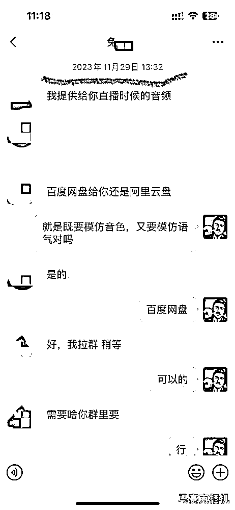

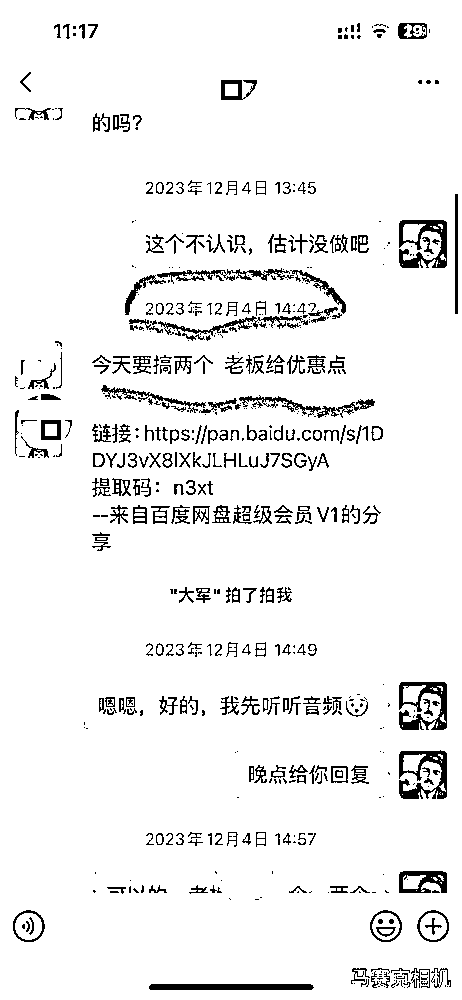

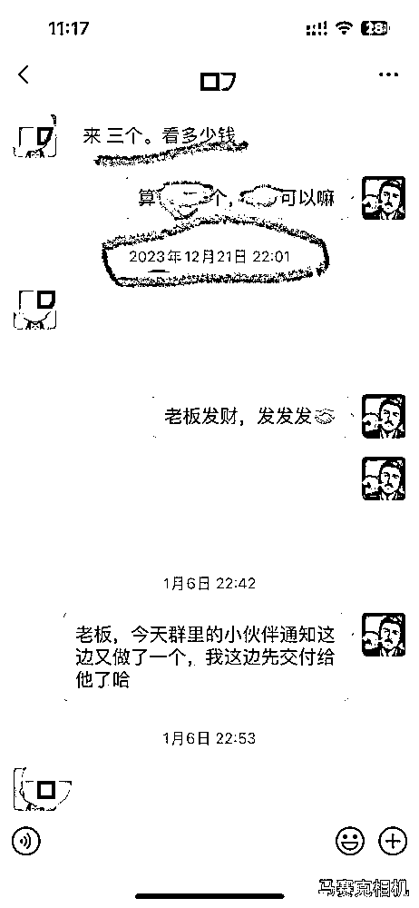

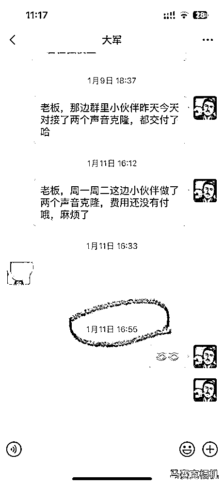

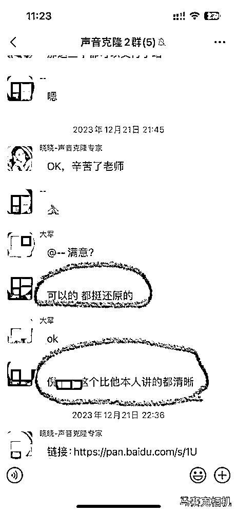

其次，结交了志同道合的朋友，有很多大佬级别的圈友加到了我，虽然只是简单的交流，但从他们的日常朋友圈能够学到很多东西，放在以前估计想加到大佬，估计人家都不理我，哈哈。

再次，既然自己能够通过声音克隆赚到钱，加上有几个圈友建议我开个训练营啥的做教学，于是赶鸭子上架就在朋友圈推出了声音克隆项目教学，以视频教程内容为主，内容主要是讲的如何做声音克隆的技术培训，以及怎么去闲鱼淘宝上面去发布找客户，有几位圈友加入声音克隆的项目，精力的不够以及培训经验的缺乏，以及后面和学员圈友小天沟通出现了一些问题后，由于当时比较忙，个人也没有太在意，直到助理鱼丸联系到我，才知道了圈友小天发帖维权，这边首先发了所有课程给鱼丸审核，然后主动联系了当事人，双方也做了深入的沟通和交流，个人这边对小天表达了歉意，在反省自己的同时，进一步说明自己项目的特点和方式方法，双方的分歧体现在以下几个方面：

1、我的招募海报是写的零基础，后面觉得确实有一点的夸张了，做声音克隆还是有一定的门槛和技术要求的，开源软件避免不了不完善和使用的问题。由于是自己原创项目，对于项目本身自己还是过于自负了，认为课程普通人照着操作是很容易成功的，没有考虑到学员的技术基础，有时候缺乏了一定的耐心。下面这个客户就是昨天觉得我做的声音效果好，付费学习，后面还是让我帮训练，一下子下了6单给我。

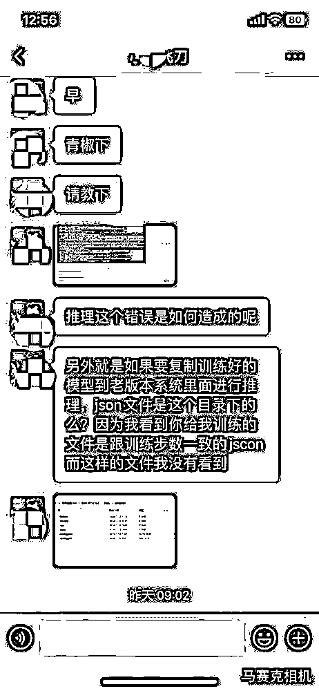

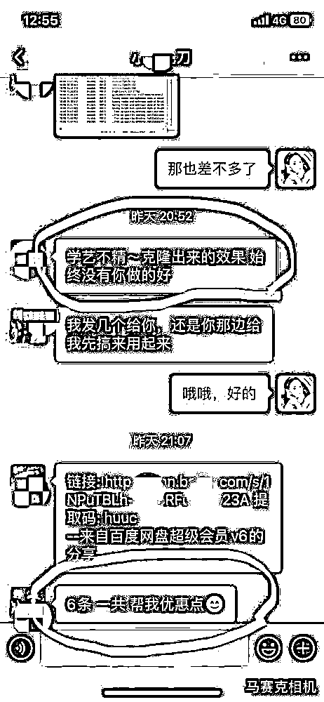

2、 项目里面所用的软件都来github开源软件，确实不是自己原创的，但是我认为是一个资源整合的过程，不能因为我拿别人的开源软件来做项目而否定项目，项目本来就是用各种各样的工具来为我所用，重要的是把工具整合起来，帮助客户解决现有的问题，一对一咨询的重点在于如何解决客户的问题，对于他们的要求我们是否有好的解决方案给他，我们能用什么软件可以给他更好的解决，如何精确的对症下药，让客户满意为我们付费，比如客户需要翻唱，我们用什么软件的哪个版本去训练，如果客户需要是文字生成语音，是否需要情绪，是否需要语气，他需要训练的是什么语音，中文用哪个版本，日语用哪个版本，韩语用哪个版本，这些都需要有经验的人去给学员建议和咨询，这一块我觉得这个是重点。

3、 引流这一块是我的圈友小天之间争议比较大的，我这边主力流量现在是10个闲鱼号，本人做闲鱼这块本来就比有心得，可以说是我运营的重点，用闲管家管理着十个号，每天早上用影刀自动化实现了自动上品，每天上四个，分别上到4个不同的城市。

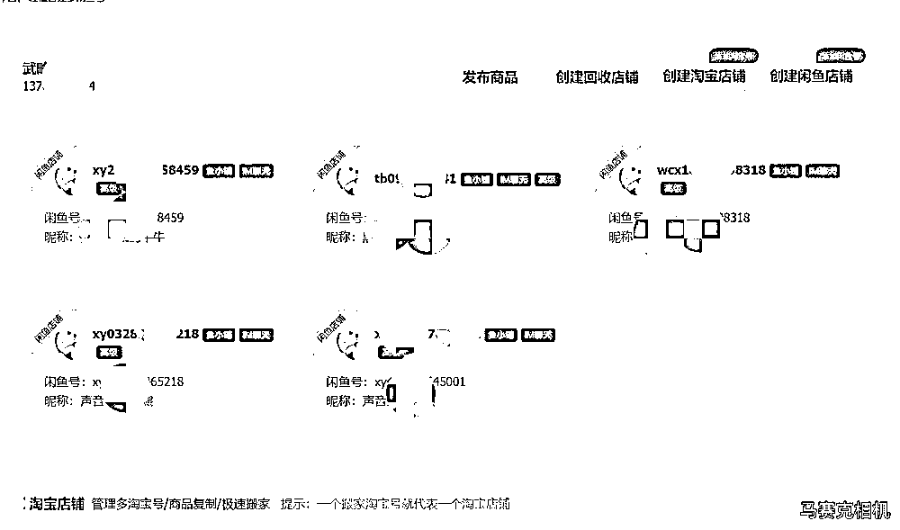

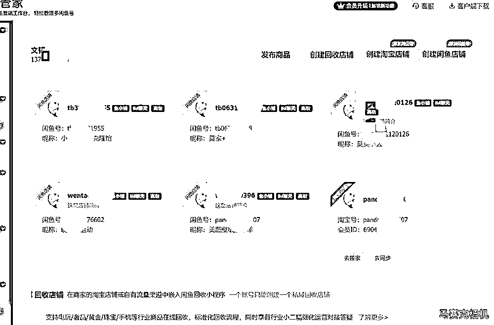

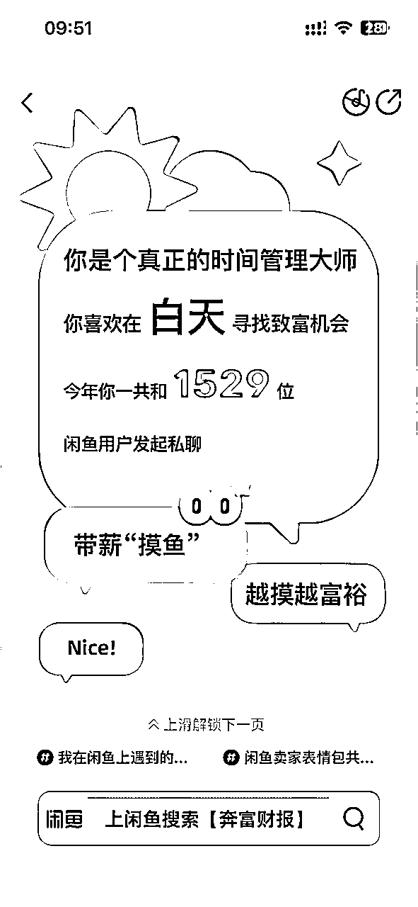

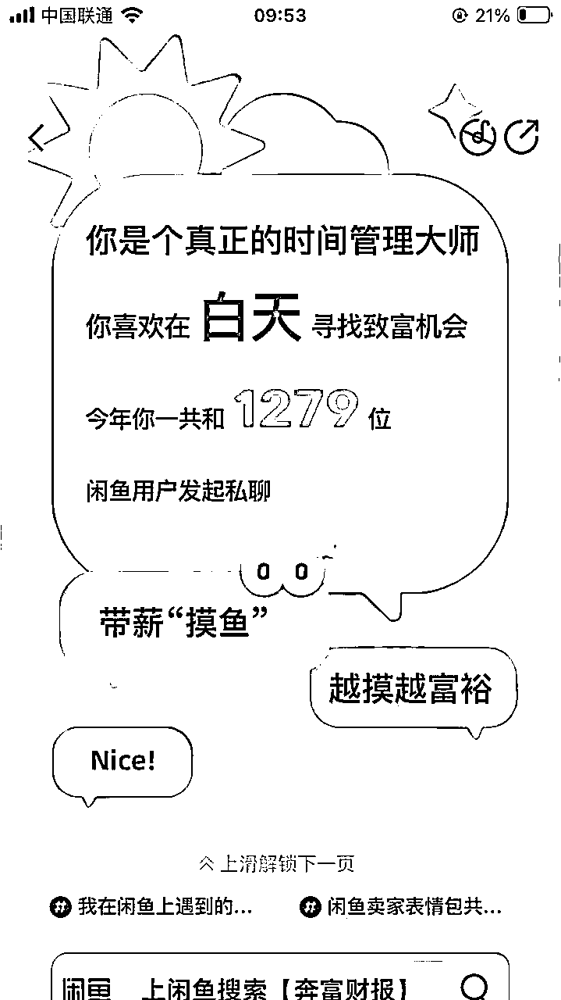

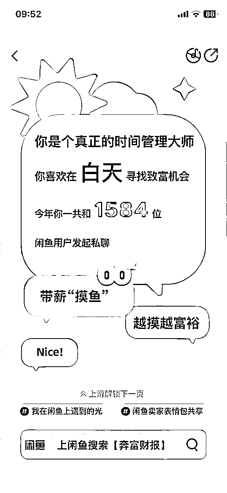

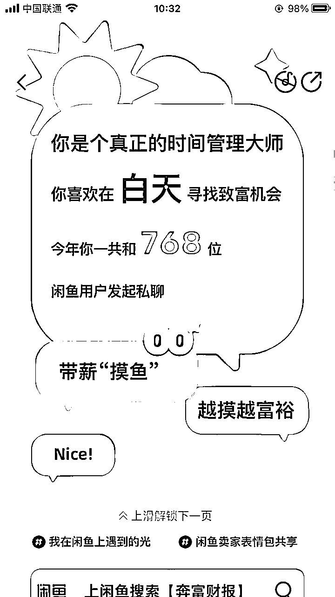

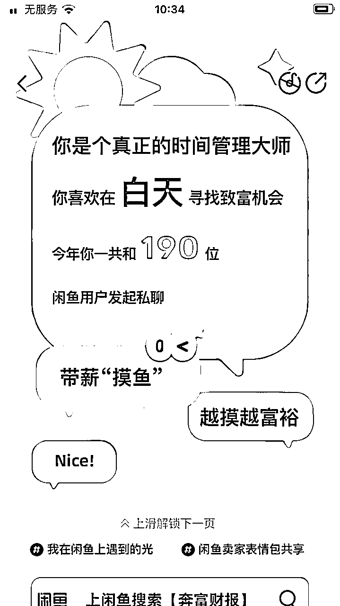

4、淘宝这块做的时间不太久，经验不是很足，我和圈友小天也讲过，我这个人不会说谎也不夸大事实，不过也还是有成绩的，有3个商品做到了品类的前三，全部是自然流，没有做任何投流！

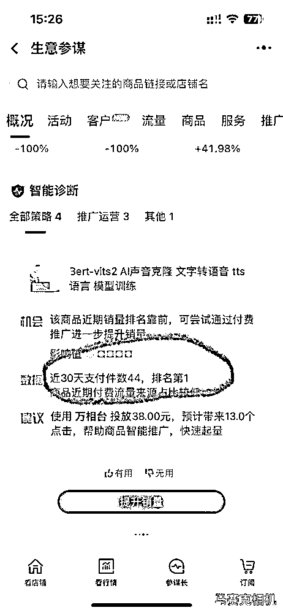

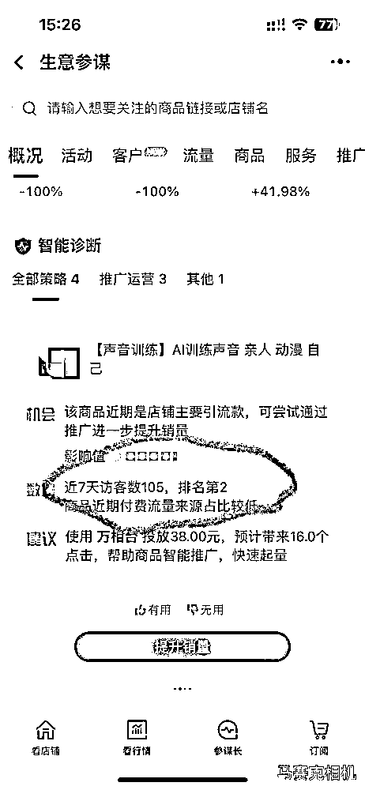

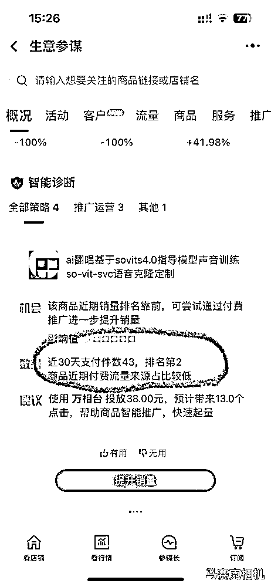

5、另外个人还有几个抖音号和几个视频号，引流也有，每天大概就是十个左右，这个确实不怎么样，可能这一点造成了最大的分歧，圈友小天说她做小红书赚了10W+，她觉得我的引流能力不行，确实这块我做的不够好，我也承认了。

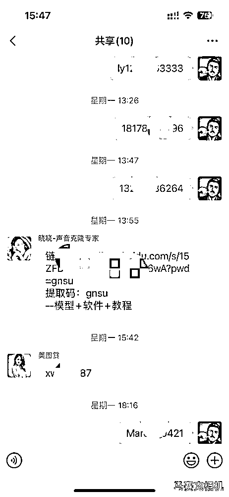

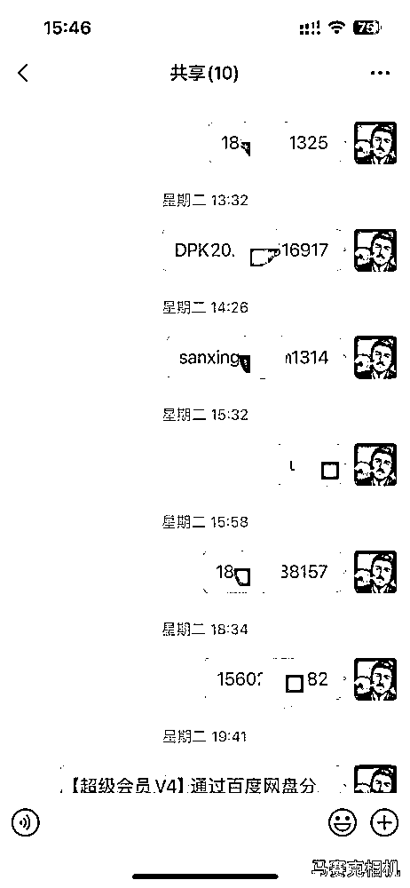

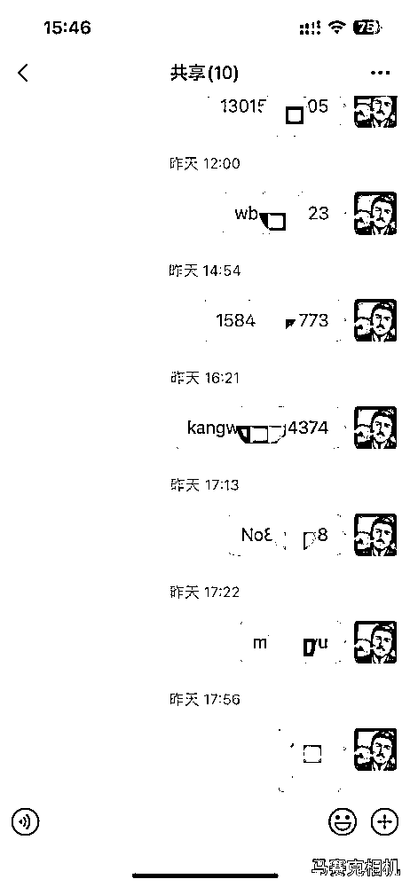

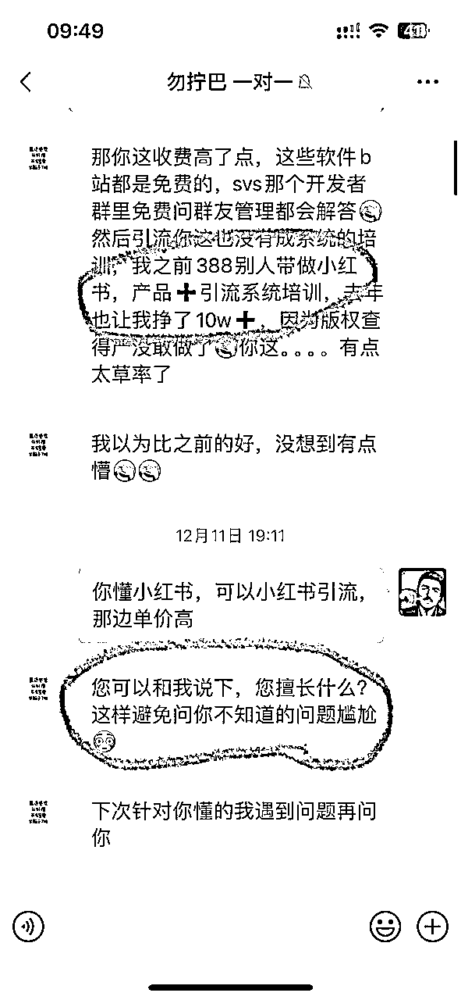

真的假不了，假的真不了，我保证以上所有的截图都是我个人的真实截图，每天只要做两单或者三单，就可以实现月入过万，再加上大几个月的时间，我的私域已经积累了上千的精准用户，至少有300+的客户做了声音克隆，几乎零差评，老客户复购和转介绍也是非常可观的，当然你想月入十万，通过这个项目我感觉还是很困难的。

个人反思：

1、作为知识付费者，收了学员的学费，确实需要用百分之百的精力和热情去帮助学员答疑解惑，耐心就其实特别重要，从这件事情我觉得是我做知识付费成熟的一个拐点吧，也给我上了生动的一课。

2、课程的打磨，学员有异议，有想法是完全正常的，不能站在一个制高点去居高临下的态度去解决，后续我也更新了几次课程，尽量能把项目的操作更加的简单，方便，也更加容易理解。

3、交付体系的打造，虽然有个人工作室，但是学员交付一直是我一个人在做，这一块后续会请教圈里的大佬就如何更好的交付付费学习。

后续和圈友小天沟通了以后，结果还是很愉快的，双方误会解开了，和气生财嘛，祝各位圈友龙年大吉发大财！