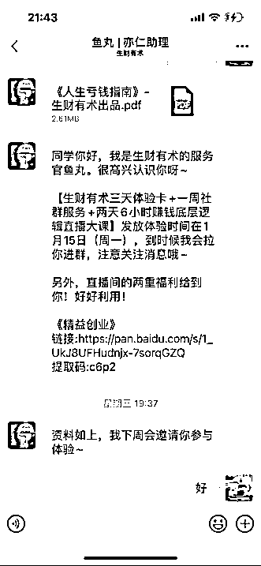
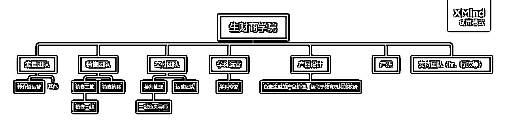

# 借鉴在线教育公司的扩张路径和组织模式，做一个生财商学院，会是个 10X战略吗？

> 来源：[https://wi1v74w740.feishu.cn/docx/O8QKdiDjLodJ6cxhFe2cBxqFnbf](https://wi1v74w740.feishu.cn/docx/O8QKdiDjLodJ6cxhFe2cBxqFnbf)

前段时间参加了北京的航海家路演，亦仁分享了生财的战略思考，其中提到，生财有一个很突出的能力，就是以社群为主线做运营，通过内容+实战+链接 做交付。后续的10倍增长战略，也是基于这样的组织优势去设计。生财可以说是现在市面上做知识付费产品，交付做得最好的，这种交付，口碑，和续费率，比很多重人力的在线教育公司都做得更好。过去几年，很多在线教育公司获得了几十上百倍的增长，体量过亿的公司不在少数，虽然有烧钱买量的主因在，教育公司的一些扩张路径不无可取之处。

活动结束后，我忍不住思考，如果生财在保持现有优势的基础上，借鉴在线教育公司的扩张路径和组织模式，能不能实现体量的10X增长？我自己在过去7年，完整经历了少儿编程教育从小众到起飞的全过程，深度参与了两家行业头部公司从零到过（十）亿体量的0-1，基于过往的行业经验，斗胆针对以上主题开了下脑洞，详细思考了借鉴在线教育公司的扩张路径和组织模式，打造生财商学院的可能性。

本文会重点提到在线教育公司的销转体系建设，转介绍流量获取，交付体系设计，以及配套的组织模式，同时算好这几个子系统的账，全文1万多字。

# 一、知识付费 VS 在线教育

首先我们先厘清知识付费和在线教育这两个行业最根本的区别。分不清楚的圈友，可以从这部分了解一下背景，如果是有相关从业经验的，直接略过，从下一部分，打造以转化为导向的销转体系，开始进入干货。

两者的相同点在于优质内容都是核心竞争力，不同的地方在于交付方式。知识付费本质上是出版业，我把内容给你，就完成交付了，至于你拿到内容后，看不看，那就和我无关了，而教育培训行业，本质是服务业，内容（课程研发）只是其中一个关键环节，内容交付后的服务，才是最核心的环节，所以怎么构建一个前后端都能大规模交付的体系，就是在线教育公司的核心竞争力。

从体量上来看，知识付费由于缺少服务，客单价相对低，同时对于客户的要求也较高，所以体量的天花板较低。而在线教育行业重服务，客单价相对高，而且由于这种大规模交付的组织能力，对于客户要求较低，能覆盖更广阔的客户群。用类比来说的话，知识付费类似于卖健身卡的，只管卖不管你来不来，甚至巴不得你不来；教育培训，类似于卖健身私教课的，有人一对一催着你来上课，服务好了，你健身有效果了，才能持续卖课。生财有术现在的形态，在后端交付上已经比较接近在线教育行业，所以客单价也比较高，不过在前端销转体系上，还是和知识付费行业一样做得很轻。

| 行业 | 知识付费 | 生财有术 | 在线教育 |
| 交付形式 | 内容 | 内容+实战+链接 | 内容+服务 |
| 服务强度 | 基本没有 | 较少，提醒服务，志愿者服务 | 较重，专属导师陪伴服务，偏个性化 |
| 客单价 | 1-1000，200内客单价较多 | 2500 | 1000-3w |
| 公司人数 | 很少，很多超级个体户 | 较少，100人量级，交付运营等以志愿者体系为主 | 多，上千人，80%为一线人员，负责前端销转和后端交付。人数和业务体量正相关。 |

说完整体区别，我们再拆分一下，这两个行业在 流量 -- 销转 -- 交付 链条上不同环节的差异。先看知识付费行业，知识付费行业由于交付轻，客单价低，毛利率高，大量的使用分销模式进行流量的扩张，通过已有学员或行业kol 分销产品，裂变出更多学员；销转环节的话，都做得相对“佛系”，以私域池子里不断地洗认知，不断筛选出匹配的客户，被动成交为主，成交周期也比较长，尤其依赖于大型的节点造势，统一引爆成交，如生财每年的418 ；交付端的话相对都比较轻，交付完内容，就完成履约了，最多建个社群/知识星球进行答疑或者让学员交流。在公域侧，很少采买付费流量，以内容吸引免费流量，引流私域为主。整体链条走的是 ”内容引流 --- 沉淀私域 -- 朋友圈反复洗认知 -- 重要节点引爆成交” 这样的爆发模式。

而在线教育行业的整个链条走的是细水长流的模式。在流量侧，更多倾向于从各个渠道去采买流量，获得稳定的供量，然后以固定的周期进行销转，以稳定的速度获得学员量的增长。在交付端，做得也很重，有固定的老师陪伴进行服务，完成答疑等工作，然后在固定节点进行续费。整个链条环环相扣，都是以很稳定的、可预期的方式获得增量，不依赖于大型节点的爆发式增长。下面我们重点介绍一下在打造生财商学院的过程中，这三个环节可以借鉴的地方。

# 二、打造以转化为导向的销转体系

在流量 -- 销转 -- 交付这三个环节中，销转体系可以说是整个链条里面最核心的一环。流量端各家的投放成本会趋于一致，交付环节，大家也都能做到合格线以上，同时很难做出差异化，而基于自身产品特性的销转体系的打磨最考验组织能力，销转环节1%转化率的差异就能决定整个模型是否能跑通，所以我们先讲这部分。

在线教育普遍采用的销转体系，都依托于体验营。所谓的体验营，就是精心设计包装1-5节课的短期课程，辅以精细化的服务，让你提前感受到买的产品的价值点，最终促进到高客单正价产品的成交。生财之前也做了不少体验营的迭代，相信也沉淀了很多思考。

体验营设计的核心点是什么呢？我们分三部分来讲。第一部分，产品的设计，要让客户有获得感，塑造“aha moment”；第二部分，流程的设计，要达到 筛选客户意向和提升升客户认知的双重目的；第三部分，在体验营助教的角色设计上，要以强销售为导向，这个助教本质上就是个销售，而不是老师/客服，通过标准的销售动作，包括挖掘需求，解决异议，给客户做规划（俗称画饼），最终达成转化的目的。

先聊聊体验营的产品设计，在设计思路上，要避免走入一个误区，就是希望让客户真正有很多收获，导致课程设计得干货很多，但枯燥乏味，没有明显的正反馈。大家都知道，关于赚钱的技能或者认知，是需要较长时间去习得的，短短一周的时间是起不到很明显的作用的。所以体验营的设计初衷，一定不是让客户在这几天学会多少知识，提升多少认知，或者就赚到多少钱，因为客观上做不到，也不符合教育学原理，而是让客户快速得到正反馈，感受“aha moment”，让他在某一个时刻体会到 “原来我也可以” “原来赚钱并没有想象地难” “原来赚钱的机会这么多” “原来我可以和这么多赚钱高手交流”，就是实际上他没有收获很多，但是有很强的收获感。这个大家好好品一下两者的区别。

听上去是不是有点割韭菜，其实大家换个角度想，如果他是你的目标客户，你真的想影响他，那就通过体验营的设计让他对你产生认可，真正转化成你的正价学员，然后在交付过程中不断地让他得到提升。如果他不是你的目标客户，那你就应该快速筛掉他，而不是指望短短几天时间就改变他。所以体验营的产品设计，一定是提高客户的获得感，让客户爽，让客户产生期待，从而促进成交率，这才能够影响更多人。

就像线下的各种培训，如果你是家长，一定有这样的体验。带着孩子去参加机器人课程，或者钢琴/吉他课程，在体验课阶段，机构老师都会快速地让孩子搭出一辆小车，或者弹出一首曲子，家长看到成效，才会买单。事实上，一节课就让孩子真正学会是不可能的，这里面做了很多简化，但是家长也都能理解这样的设计。通过极强的正反馈，先让孩子产生兴趣和看见未来的自己，然后孩子才会反人性地去学习。

说完产品设计，再说一下体验营流程设计的目标。在线教育的体验营一般有以下几个环节，讲座环节，上课环节，群内营销环节等，典型的节奏是以下这样的。

等待期 -- 开营专家讲座 -- 第一课 -- 第二课 -- 第n课 -- 闭营专家讲座 -- 进入转化节奏 -- 转化结束，课程的长短不一，有2节课，3节课，5节课等，课程长度和产品的市场成熟度有关。

那这个流程设计的目的，要达到双重目标，一是不断地筛选用户意向，客户会越筛越少，通过客户的参与度，能一定程度上判断客户意向，比如是否参与了讲座，课程是否都完成了，这里就要求数据的基建要做好，每个环节都要做好数据打点。

第二个目标，要在流程中不断地强化客户的认知，俗称“洗脑”，让他更认可赚钱的重要性/紧迫感，更加认同你的品牌，更加相信你的产品和他需求是匹配的。这也是在线教育之前被人诟病的一点，在体验营设计时，教育机构会不断地激发家长的焦虑感，让他觉得产品非买不可。当然，这里营销的程度完全是设计者可以把控的。

通过这个流程的设计，反映在数据层面上的是两个漏斗。

一个是数量上的正向漏斗，客观数据，从开营讲座 -- 一课 -- 二课 -- 三课 -- 闭营讲座，至少5个环节下来，每个环节的人参与率是多少，这个参与率是越漏越少；一个是认可程度的反向漏斗，这些留下来的人，他对于赚钱和生财商学院的认可度越来越强，刚加入时可能是模模糊糊的，抱着试一试的心理，认可度在5%，跟着专家讲座，开始感觉生财是靠谱的，能帮助他提升的，认可度上升到20%，上课时感受到“aha moment”，认可产品的价值，认可度到50%以上，到最后闭营讲座，对于生财规划的长期学习体系有了认同感，认可度到到达60-80%，然后等待销售踢进临门一脚。

要达到高转化率，让投放模型能跑通，除了产品设计有爽点，流程设计双漏斗外，还需要最重的一个环节，销售的强力干预，这也是在线教育和知识付费在组织结构上最大的差异。知识付费产品基本都是被动成交，你觉得我好就交钱，觉得不好就放在池子里持续洗，基本没有销售的概念，而在线教育的成交90%都是销售主动成交，在体验营期间留出专门的转化期，通过设置特定的优惠/福利等转化抓手，不断迭代转化策略，让销售高强度关单，目标是在体验营期间就完成成交。

我们先看该角色在体验营期间要做的一些动作，在加上客户微信后，鱼丸除了通知以外，还需要和客户简单挖需，聊聊他报体验营的目的；开始上课后，需要通知客户来听专家讲座，由专家洗一下认知，上完第一节课后，鱼丸要对客户进行回访，了解客户对于产品的反馈，进一步挖掘客户的需求，然后上第二课，第三课，需要提前铺垫后续的课程规划，等到转化期，鱼丸需要把产品价值，报名优惠，后续对客户的规划，和客户一对一聊清楚，如果客户有异议，还需要解决客户的异议，必要的时候，还需要使用一些销售技巧，如默认成交，施加压力，逼单等手段，来促进关单。

整个过程每个环节的目的，和产品流程的设计，是统一的。通过不断地梳理客户的需求，一方面筛掉无效客户，一方面加深和目标客户的粘性，提高客户对你的认可度。这里的动作，如挖需，回访，解决异议，关单，等等，都是销售层面的具体工作，使用鱼丸这个角色主要承担的是销售工作。当然过程中，也会有不少通知上课、内容答疑、微信群运营、朋友圈营销等工作，但那不是主线。如果按工作内容比重来区分，服务，教学答疑，销售，这三块工作，工作量比重大概在2:2:6 这样的比例。

由此可见，为了获得稳定的转化率，体验营期间人工层面的工作是很重的，先营销再销售，先服务再转化。我最近也在感受生财体验营的流程，加上鱼丸后，鱼丸当前起到的作用更多还是一个通知和客服的工作，目前做得还比较轻。

从在线教育的经验来看，服务好，销售能力一般的鱼丸，转化率是低于 服务一般，销售能力好 的鱼丸的。所以体验营鱼丸的能力模型，一定是按照top销售的画像去招聘，然后帮他补上产品和服务方面的认知。

光是一个体验营设计，就做得这么重，要考虑产品设计，流程sop的设计，销售的招聘、培训等工作，所以这部分工作也需要有相适应的组织结构。一般来说，会有一个专门的销售业务团队，这个团队里就是通常的 “销售负责人 -- 销售主管 -- 一线销售” 这样的金字塔结构，对转化率负责。同时，会有一个销售策略的小团队，这个小团队主要负责，持续优化体验营的流程和策略，比如设计更吸引学员的关单福利，对各种策略进行ABtest，进行数据分析和复盘，主要产出就是 过程数据/转化率的增量。与此同时，还会配备一个跨部门的合作团队，在线教育里叫学科运营团队，这里面的角色主要是该学科的专家，负责进行专业物料生产、专家讲座、产品培训等工作，提升大家关于产品价值的认知等等。这个角色在生财商学院里，就得是一个拿过赚钱实战结果，对于商业认知较高的人，能持续地向学员/内部团队输出认知。这几个团队持续地配合，不断地研究各个不同渠道的用户画像，提高流量的转化率。

对比知识付费非常轻、佛系的转化链路，在线教育的这套销转体系可以说做得非常重了。那为什么要在这个环节投入这么多，其中一个原因是，只有一个稳定的销转体系，才能支撑前端持续地采买流量，同时把整个链路的 roi 算清楚，只要 roi 大于我们设定的目标值，就能持续地放量，从而支撑稳定扩张，让整个增长飞轮转起来。那销转体系做得这么重，成本会不会很高。对于生财商学院这种客单价上千的产品，销售成本是完全能cover住的，我们在第五部分会重点算一下各个子系统的账。

# 三、如何通过转介绍稳定获取10X流量

前面提到，销转体系的构建，是为了把各个渠道采买过来的流量，都实现相对稳定的转化。所以销转体系，和流量获取是密不可分的。生财的流量获取，肯定是不用担心的，有很多很强的流量操盘手、大kol 都在生财这个圈子里。对于流量和增长，我过往的工作没有直接经验，所以就不纸上谈兵了。不过这里我特别想强调一个流量渠道，对于生财这样产品力很强的公司，有非常巨大的挖掘潜力。而且最好先从这个渠道的流量做突破。

这个渠道就是转介绍。原因有以下几点：

1.  刚开始打造生财商学院的销转体系的时候，有很多不可知因素，本身这个体系的搭建就需要投入不小的成本，而且打磨过程中转化率不可预知，外部流量投放采买，一来不一定能买到足够的量，二来流量的质量未知，而转介绍流量天然的带有一部分朋友背书，对于销转来说降低了难度，有利于销转体系由易到难的打磨；

1.  转介绍的流量成本是所有渠道中最低的，率先把转介绍渠道的流量做到一定比例，具有重大战略意义，会让后期的竞争有更多选择。前几年在线教育的广告大战中，转介绍渠道在其中起了很关键的作用。除了极少数拿了天量的钱的公司，其他公司的投放都要看整体获客成本，卡一个安全线，那在外部渠道的成本不断攀升的时候，转介绍的流量占比越多，由于他的成本较低，就能有更多的投放成本给到外部渠道，外部投放就能拿更多量，从而扩张得更快。用一个简单模型来做假设，获客成本卡 2500元的安全线，转介绍的获客成本是 1000，如果能把转介绍的流量占比做到 20%，那外部投放的安全线就抬升到了 2875 元（2875*80% + 1000*20% =2500）。

1.  生财现在积累的口碑，在圈子里的能量和势能，做转介绍渠道，就像把一颗大石头从高处往下推，轻轻发力就能起到四两拨千斤的效果。重点投入这个渠道的话，获取10X的流量完全不是问题。

所以在当前阶段，大力获取 低成本、高质量 且一定程度可控 的转介绍渠道流量，对于早期的销转体系打磨，以及（可能发生）后期的投放竞争都具有重大意义。

那么，要如何快速把转介绍渠道的流量放大 10倍呢？主要有以下几个思路，具体细节先略过不表。

1.  改邀请有礼，到分享有礼

生财现在的转介绍是以“邀请成为圈友”作为主体形式，辅以小部分邀请到体验营。比如知识星球的邀请就默认是邀请成为会员。

这两种形式的邀请效率至少差10倍以上。以我为例，如果要邀请一个人直接成为圈友，我需要盘点朋友圈的熟人，这个人得对赚钱比较有动力，认知还得高一点，有过知识付费的习惯，不能我推荐过去，他认为我在割韭菜，还得要求他比较信任我，同时我能把生财的价值点说得比较清楚，不管在我分享的心理门槛上，还是真实的转介绍过程中，难度都相当高，我这两年也只邀请了1名好友加入生财；而分享有礼，指的是我只要把生财体验营的信息分享到朋友圈或者社群，我就完成动作了，剩下的产品价值介绍、认知清洗，销转过程都由生财完成，因为我分享出去的主要是一条信息差，这里有一个赚钱高手交流的圈子/让你进行赚钱实战的社群，本身分享的压力小很多，而且还能把信息触达到朋友圈里的弱关系中，这些人看到生财圈子2000多的价格肯定直接劝退了，但是看到一个几块钱就能参加的赚钱体验营，肯定有很大概率被转化。

所以把邀请进入生财圈子的转介绍形式，改成分享信息让人参与体验营，可分享范围，分享后的转化率都会提升，效果上至少会获得10倍以上的流量。像这种直接邀请加入生财圈子的形式，其实就是分销，可以保留给有更多流量，转化强的生财大V，如涛哥，靠谱等等，大量的圈友，更适合分享体验营。这里可以看一下数据，过往把邀请链接发出去的生财圈友的比例，我想应该不会太高，大量的认可生财的圈友并没有被激发起来。

1.  增加分享频次，由中台提供物料

由于知识付费过往的营销节奏，大部分的转介绍/分销活动都是借助于一年中特定的几个点，比如生财418等，其他时间没有很好的邀请由头，把邀请改成分享后，能大大增加分享的频次。教育公司都是按周进行分享，因为孩子每周上完一节课，上完后家长看到孩子生成的学习报告，或者课堂场景，只要是可以外化的场景，都能进行分享。生财商学院也可以把分享频率提高到按月，甚至按周的维度，养成大家定期分享的习惯。

只要你在赚钱道路上，有了一点进步，就可以在朋友圈里大大方方进行分享。比如在每个航海实战的时候，就可以鼓励大家把每天的打卡，航海好事分享到朋友圈，然后带上二维码，直接扫码就能参加体验营。以现在这样万人航海的体量，一次航海带来几万个leads，应该不是难事。

这里的逻辑就不是借助于生财圈子的大事件进行营销，而是借助于每个生财圈友，自身的小进步去进行营销。我赚钱认知提升了，所以我分享一下心得到朋友圈，顺便推一下让我取得进步的生财体验营；我参加航海实战，迈出实践第一步了； 我发小红书有流量了；我开始赚到第一块钱了；我积累了更多的客户了；日常有很多的小确幸，每一个圈友的小确幸，都是分享的引子。

当然了有些圈友可能自己的进步没这么明显，也想参与活动，那可以通过一个中台小团队，定期产出突出产品价值/圈友实战成绩/赚钱认知 的各种物料，并且不断测试每种物料的引流效率，给圈友提供一些可以分享到朋友圈的素材，把他们也激活起来。

1.  打造成体系的激励体系

要把这些还没取得成绩，对生财的认可度还没很高的圈友也激励起来，就需要打造一个成体系的激励体系。这块生财非常擅长了，之前的生财418里的战队PK，各种龙珠激励，航海里程，都设计得非常好，我这里就不班门弄斧了。这里的核心关键点，就是像设计游戏的激励体系一样，让参与的人不断的有正反馈。我们假设分享出去带来一个leads，可以获得 50积分。那么50积分就应该能有一个可以兑换的东西。50积分换什么，100积分，500积分，1000积分换什么，不仅有实物激励，同时达到什么成就，有什么小的精神激励。生财的龙珠获取的门槛比较高，需要一个比龙珠低很多量级的另一种货币，来进行日常的这些激励兑换。

这个激励体系里面的产品，可以找很多生财圈友赞助，就像418会员日的礼品一样。圈友的产品有了一个日常曝光的广告位，生财降低了激励成本。

1.  人工强提醒 不单纯产品触达

生财的产品和口碑这么好，我相信如果亦仁把这个转介绍的激励规则发到生财里，就会有一部分人就开始做起来，辅以一定的产品的提醒，就能有不错的转介绍流量。这也是生财巨大的优势。

当然如果想最大程度的挖掘转介绍流量，可以考虑用人工触达的方式进行加强，每周/月定期的提醒圈友参与转介绍活动。这个部分人工的动作比较重，和交付体系的设计有关联，我们第四部分再提。

这里讲一个有意思的故事。能把产品做到“家长认可产品，愿意转介绍”的程度，是不那么容易的。核桃编程早期也想重点发力转介绍，但是编程这个产品外化难，很多家长不是很理解，所以孩子学了一段时间后家长也不清楚孩子学了什么，更别提产生很好的口碑了，所以核桃做转介绍的这个前提条件没那么强，一开始是碰到了很大的困难。一直没有突破口。

后来是怎么解决的，如果家长主动分享的意愿没那么强，我们就用人力去干预。所以核桃给一线的老师很好的激励，让他们一对一和家长打电话，确保把转介绍这个活动触达给了所有家长，通过100%的触达率，里面有一些家长还是偏利益型的，即使对于课程没有那么认可，但至少孩子还在学，也没什么坏体验，而且分享完还能有直接的利益，有核桃币，核桃币能兑换各种实物礼品，这个获得感是很强的，就这样，有大概20%的家长就养成了每周分享的习惯，通过这种方式，也把转介绍渠道做起来了。

生财依托于这些年的超值交付和口碑，发力转介绍渠道可以说是四两拨千斤。再加上，有这么多的流量操盘手，他们的私域池子里也有大量的目标用户。只要设定好了合理的激励体系，把3万的生财圈友，流量操盘手发动起来，每个月保守点估计，至少是以万为量级的leads供给。如果搭建好了一套稳定的体验营销转体系，这条增长链路的启动应该不成问题。

# 四、配备赚钱私教的交付体系

最后说一下第三个环节 -- 产品交付，这部分内容老实说有点班门弄斧了，生财现在的交付已经非常牛逼了，海量的、实战验证过的、领先市场半年以上的赚钱内容，主题丰富的、陪伴型的航海实战，同城圈友的高频链接机会，这三部分真是把交付价值拉满了。也正在这些超值交付，构成了生财的核心竞争力，才能支撑生财去大规模驱动转介绍流量，去构建一个强转化的销转体系，去放大十倍规模，不然的话就又变成另一个一波流的割韭菜项目了。在这部分，我只想讨论一个问题，在放量后的长期会员的交付中，要不要配备一个专属的鱼丸导师？这个导师的主要作用是为每个会员建立专属的成长档案，日常活动通知，航海实战的领队，适合会员的赚钱信息推送，会员碰到赚钱实战问题的第一答疑官，以及对生财组织最重要的作用，做好会员的效果外化，和最终的续费工作。简单一句话，长期会员的鱼丸，是你的专属赚钱私教。

也许一部分的生财会员会说，完全没必要，如果赚钱还需要人盯，这样的人是赚不到钱的，也不是生财的目标客户。而我的看法恰恰相反。我认为生财如果想扩大10倍规模，绕不过这样的重服务。

生财早期的客户群体，主要是 自驱力，执行力强，目的性强的想赚钱的圈友，这部分群体其实在人群中占比不会高，毕竟能有这样特质的人，要么已经赚钱了，要么就在赚钱的路上。慢慢地，随着生财的范围扩大，一定会出现，自驱力没那么强，想赚钱，但是付出又比较少的圈友，俗称‘晚上想想千条路，早上起来走老路’，间歇性踌躇满志，持续性混吃等死。当然，也可以说，这部分人赚不到钱是活该，不过，其中一定也有一部分是值得挖掘的，在更高强度的陪伴下，能拿到结果的圈友。

这个客户群体的变化，有点类似于俞敏洪在书里写的一个现象，早期的留学培训的学生，都是自驱力很强的大学生，所以可以上几百人，一千人的大班，只要老师把课讲好了，学生自己有很好的学习习惯，可以完成剩下的部分。后来，中学生开始留学了，就不能用大班课的模式了，因为中学生自驱力不强，就得换成关注度更好，服务更好的小班课模式，由老师督促着这些学生，看看他们是否吸收了知识，是否完成了作业，确保学习效果。

一种群体是想赚钱，自驱力强，也就是现在生财的圈友们，另一种群体是想赚钱，自驱力不强，也就是生财商学院的目标客户，我想后者的比例至少是前者的几十倍。当然了，生财现在是不是到了这个临界点，需要做更多的服务，去把这部分客户纳入进来。或者，这部分群体（想赚钱，执行力不强）的人到底算不算生财的目标用户，那是一个很值得探讨的问题。我这里没有答案。

除了以上这个最重要的原因，还有另外一个好处，如果有这样的一个专属鱼丸导师，很多环节的效率会大大增加。比如服务的体验上，日常的各种通知，除了生财星球里通知，一些重要活动的通知，比如每个月的会员日，都可以由这个导师一对一触达，再也不怕错过了；在上面的转介绍环节，如果定期有人跟进你的赚钱进度，把你的一些小确幸外化出来，让你能够更好的参加转介绍，或者定期把好的转介绍物料发给你，转介绍的参与度，和由此带来的转介绍leads，都会增加不少。再比如，前面的服务环节做好了，鱼丸确保每个圈友在一年中都至少参加一次航海实战，参加若干次线下链接，最后的续费率在现在的高续费基础上，再提升 5%或者10%的续费率，也不是不可能。另外，如果多了这么一个赚钱私教，你愿不愿意多花500块钱？这样的服务交付，应该能够支撑一定幅度的涨价。

以及我们再开个更大胆的脑洞。假设这个鱼丸导师从你加入开始，持续跟踪你赚钱路上的每一步，有你很详细的成长档案，那你下一步想专攻哪个方向，项目碰到什么问题，可以从星球里获得什么帮助，鱼丸是可以给出很个性化的建议的，同时有这么强的粘性和信任感，鱼丸给你再推荐更细分领域的产品，我想成交率是很高的。生财可以给自己航海家的合伙人，导入更多精准的流量。比如你碰到了流量瓶颈，想从新渠道获取流量，那鱼丸可以给你推荐 小红书实战/视频号实战 的相关产品，或者找到对应的合作方。相当于你在生财接受了通识的赚钱教育，然后下一步进入一个专业院系里面，继续选修更垂直的方向。

以上列出的这些鱼丸承担的功能，其实对应的就是在线教育公司后端老师常做的几项工作，服务，续费，转介绍，扩科。通过这些工作，这个导师带来的收益，是大大超过他的成本的，同时也让会员的体验变得更好了。

# 五、组织结构和算账

上面洋洋洒洒说了这么多，要加这加那，把模式变得这么重，到底具不具备可行性，我们最后再算一下各个环节的账。

先看一下这个模式下的大概的组织结构。

再算一下各个环节的成本。

先说流量端的成本

在线教育各个渠道的leads成本，和对应的转化率区间大概是下表中这样

| 渠道 | Leads成本 | 转化率 | 投放cac |
| Kol推荐 | 200-400 | 20-40% | 1000-2000；cps合作居多，可以直接卖大课 |
| 转介绍0元领课 | 50-200 | 10% | 500-2000 |
| 抖音/小红书买量 | 200-500 | 10% | 2000-5000 |
| Tmk 9.9元体验课 | 150-200 | 8-10% | 1500-2500 |
| Tmk 0元体验课 | 30-50 | 2-3% | 1000-2500 |

我们先只看转介绍的流量成本。

假设圈友把生财商学院的信息分享出去，只要带来一个体验营的leads，就能获得 30元，或者对应的实物礼品（不知道对圈友是不是有吸引力），按在线教育通常的转化率 10% 来估计，那投放成本在 300元左右。生财现在邀请一个正式会员加入，圈友会获得 493元赏金，但这个难度是很大的。相反，如果圈友通过朋友圈给生财带来了 10条体验营的leads，也能给生财带来一个正式会员，而圈友的难度却大大降低了。

再看销转端的成本。这里有一个很重要的概念，人效，也就是一个人每月最多能服务多少人。

在线教育公司，销售端的人效一般在400-800之间。

假设一期体验营为期10天，一个销售一个月能带3期班，每期班销售可以同时服务200人，那一个月人效即为 600人，转化率是 10%，那成交60单，贡献 15万的GMV，他一个月的成本（固定成本+提成）假设是 1万，那每一单的销售成本是 167元左右。加上销售的一些管理成本，中台摊薄成本，假设一单再加个30块钱，那整体成本在 197元。一个客户的投放成本 300元 + 销售成本 197 =497元。

生财现在邀请一个会员加入，圈友会获得 493元赏金。这么算下来，成本是差不多的。

| 渠道 | Leads成本 | 转化率 | 投放成本 | 销售成本 | 获客总成本 |
| 转介绍0元领课 | 30 | 10% | 300 | 197 | 497 |

最后我们再看一下交付成本。

假设每个生财商学院的会员，都会配备一个专属的赚钱私教。按在线教育的经验，长期课辅导老师的人效通常都在300-600，而他们要负责孩子每周的上课辅导答疑，给家长学情反馈，续费转介绍等工作，工作强度会比单纯服务成人大一点。所以每个鱼丸的人效可以定在500-800。一个鱼丸一年的成本假设是 10万，那么每个客户额外多出来的服务成本是 125-200元。

而通过鱼丸这样的深度服务，如果续费率提升10%，那么一个客户就额外贡献 250元的GMV。带来的收益就把成本 cover掉了。这还不考虑其他可能的收益，比如带来的转介绍leads量的提升，以及有可能的涨价空间。

所以，通过在线教育公司这样的重服务的体系，在初期以转介绍流量作为主体流量的情况下，并不会在现有的基础上增加太多的成本。

我们再算一下这种模式的增长潜力。只要这个链条跑通了，那么放量的潜力就取决于前端leads量的多少。

转介绍每月leads量 = 分享人数 X 每次分享后转化率 X 每月分享频次

分享人数由于生财产品好，所以不用太担心，生财现在 3万会员，假设初期有 20%的人参与，每次分享后，由于赚钱/副业 算是现在的一个小共识，每次分享后可以带来 1个人，每月分享 2次。

那么，每个月的lead量 = 3w*20%*1*2 = 12000 个leads

当然，上面的这个模型和里面的数字预估，都比较粗糙，做得精细的话，还可以进一步拆分为更小的环节。上面的粗算，只是为了说明，转介绍渠道每月带来的leads量一定是以万为单位的。

按照每个月 12000个leads，10%转化率，则生财商学院可以从这个渠道每个月新增 1200名会员。

当然，以生财的流量获取能力和圈层势能，我想一个月1万个流量应该相当轻松。那假设，这个流量变成 10万呢？每个月有10万个流量进入生财的体验营，然后用稳定的销转模式，新增几千到 1万名会员。这里是不是就实现了 10X的增长。过往的在线教育公司，就是通过这样一个 流量采买 - 销转 的模式在不断地扩张。这样的扩张模式，更系统，可控，且稳定。

而这样的模式会带来什么样的组织变化吗？最大的变化就是，会多出来很多一线的业务人员。体验营的业务团队规模，由流量的大小决定，如果一个月有12000个leads，每个销售一个月人效 600，那么会多出来 20个销售。流量规模越大，这个团队的规模随之变化。

长期会员的鱼丸导师的团队规模，由总会员数决定。如果有5万会员，每个导师承接 500人，那么就会多出来一个 100人的鱼丸导师团队。当然，也会多出来几个对应的中台人员，体验营的销售策略，长期会员的运营，学科专家，人数不会多。在10人以内。

这个就是对于组织最大的变化。由一个很轻的公司，几十个人就能支撑几万名会员，甚至十万名会员的公司，变成一个组织规模随会员规模不断变大的公司。

写在最后

过去几年，我完整经历了在线教育行业的起起落落，疫情的助推，资本的疯狂，让很多在线教育公司短时间从零到 过亿体量，再到zc的一锤定音，很多公司归零，但也有一些产品力比较强的健康的公司，活了下来。很幸运，我待的两家公司都还活着。其中一家体量从0做到了20亿，而另一家我所在的业务也从0到破亿规模。

当我听完亦仁分享 10X战略后，借鉴教育公司的扩张路径，打造生财商学院的这个想法就一直在脑海里盘旋，终于花了10天的时间，把我脑海里的这些想法梳理成文字了。也许这上面的一些思考，模型，或者估算的数字，不一定准确，但如果其中某一个小点能给到生财团队一些思考，就是我莫大的荣幸。也许这全篇都是错的，那就当做我做了一个头脑风暴，让各位客官见笑了。

分享后，亦仁说，他对生财的定位一直就是中国的YC，而作为生财会员，其实我更希望，生财成为中国的斯坦福，让更多没有赚钱认知的人，掌握基本的赚钱框架，让更多想赚钱还没动起来的人，在生财的氛围里行动起来，让更多行动起来的人，有更大的舞台，让舞台上的人，有更多的资源加持，变成大佬后，扶持更多的学弟学妹。

关于我个人（20240618 更新）

之前：

深耕少儿编程教育7年，深度参与了两家创业公司的 0-1，核桃编程 18 号员工，前教研负责人，从月营收 50 万到年营收 8 亿；火花编程前学科运营总监&销售团队负责人，从 0 到年营收过亿。

现在：

在生财孵化器里，一起做教育培训/IP/知识付费领域的 10X 赋能计划

https://scys.com/form/z27VzfX3?number=27725&timestamp=1718765135690&signature=11fa91ba14993970298a14a88d0c930c3a97f801

其他文章：

摆脱小作坊状态，核桃编程从月营收50万到1000万的几点启发（精华）

怎么从零搭建和管理一个“正规军”的销售团队