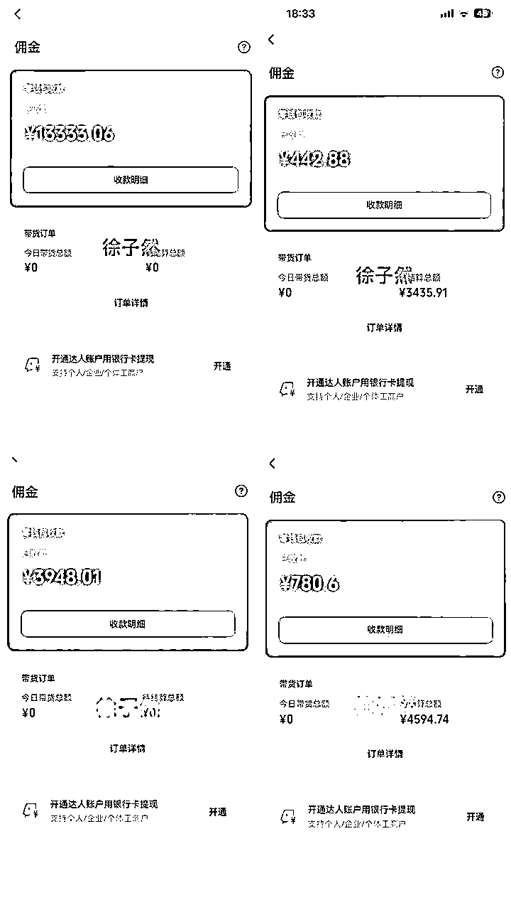
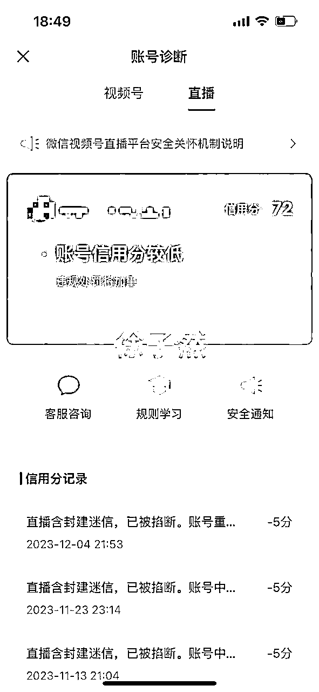
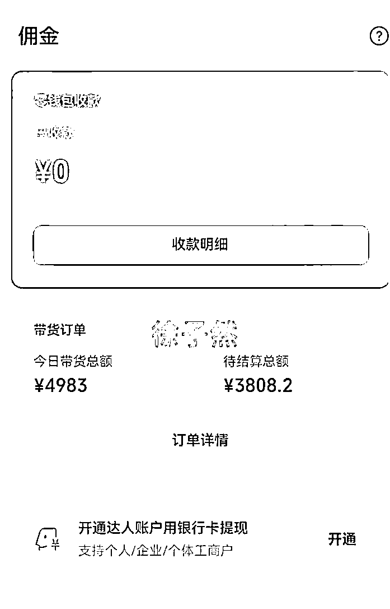
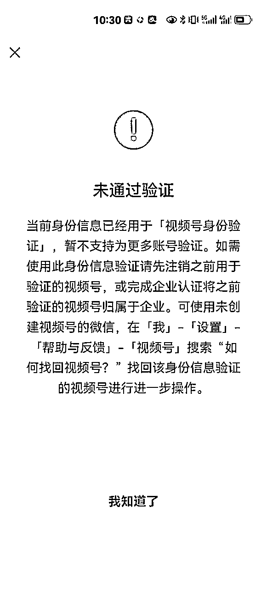

# 新手小白入局视频号3个月变现4w+，总结出来的实用避坑经验

> 来源：[https://rxxy4o2wwcf.feishu.cn/docx/OGbvdpwhKonziwxrsKGc5gaDnCf](https://rxxy4o2wwcf.feishu.cn/docx/OGbvdpwhKonziwxrsKGc5gaDnCf)

新手小白入局视频号3个月变现4w+，总结出来的实用避坑经验，分享给大家

在此感谢@梁靠谱@李千万@芷蓝，感谢3位老师的帮助

大家好，我是徐子然，2022年底裸辞，2023年3月和老婆正式开始互联网之路，4月加入了生财有术，这是我的第一篇文章，这里面有我过去3个月踩坑的经历和创业的心路历程，也包括踩坑的解决方法，希望对大家有帮助

正式开始做视频号，是9月中下旬开始的，当时报了生财的视频号航海，在那之前我在做小红书，所以不管是对于选品，还是营运，我都是迷糊的，什么都想做，又好像无从下手，不知道怎么选品，也不知道该卖什么，也许是为了拿回航海押金，思来想去，唯有行动。

当时看完选品相关的航海手册后，决定用最简单的方法（直播广场选品），看到广场卖秦东魁老师国学书籍和摆件的的人比较多，而且很多橱窗都是已售1000单，已售2000单，正好我老婆之前买过秦老师的书籍，那就从这里开始吧，报着试试的心态开通了店铺，缴纳了100块钱押金，开始剪辑第一条视频。

当时自己对混剪还不是很熟悉，虽然之前做小红书学习过简单的混剪，可是看到同行发布的视频需要换背景，换声音，贴纸等操作，于是我自己去B站搜索了关于混剪的视频去学习，然后每个步骤都手写下来，我记得当时我把自己学到的剪辑步骤进行了作业打卡，还获得了加精

就这样每天剪3个视频，发布到视频号，到了第三天，偶然间打开手机，今日数据显示17笔订单，当时的心情又开心，又惶恐，开心是因为出单了，惶恐是因为我只能看到订单，看不到佣金，以为是假的，后来截图到航海群，在群里圈友的帮助下，找到了订单详情，我看到了自己当天的佣金236，那一刻真的很开心。

于是我们又新开通了2个账号去发布视频，在做事的过程中，我们出现了第一个问题，只要有一条视频跑到5000，账号马上就会提示非原创限流，需要发布10条原创视频才可以继续操作

解决非原创的方法：

*   直接用视频号自带的模板怼脸拍10条真人的视频

*   拍十条风景随拍视频

为了解决原创的问题，于是我看了大量的同行账号剪辑方法，发现同行的视频都是开头第一秒用国学老师的视频，接下来中间的部分全部都是自己拍的风景视频，这就给了我启发，我也学习同行的方法，外出拍摄大量的风景素材，这个方法确实有用，有好几个视频跑了十几万的播放量

当时航海教练告诉我们，只要视频播放量跑到5000就要开播承接流量，在第一个视频播放量跑起来的时候我也蠢蠢欲动的想开播，可是总感觉自己没有准备好，迟迟没有开播，只依赖于每天自然流出单

过了两天，我看到很多同行都在直播，而且每天都能卖几十单上百单，我就在想，别人都可以直播，我们是不是也可以尝试呢？因为很多同行都是通过语音直播，播放秦老师的录音去销售产品，我们也照葫芦画瓢，试着去直播

但结果却不近人意，同行播一天24小时没有问题，我们播了10分钟就被限制，后来我总结了被限制的原因，主要是因为我们播放的录音没有进行处理，里面有很多违规词，这可怎么办呢？得找出路呀。

紧接着我去抖音下载秦老师10分钟左右的长视频，进行混剪，把感觉会违规的话进行删减，多个短视频拼成了一个50多分钟的长视频，在次尝试直播，然后用电脑播放录音，播了2天，效果还是不太乐观

紧接着我们又尝试了真人出镜，去念秦老师的书，念了一个多小时，没有人，自己累的半死，也没出单，没有其他办法了，那就只能硬着头皮上了，因为我老婆听过秦老师的课程，所以提议尝试自己去讲解，就这样我们正式开始了真人出镜的直播之路，老婆负责讲解产品，我负责在评论区引导购买，我们也不知道自己会不会出单，但是勇敢的人先享受世界，总得去尝试吧！

还记得第一场直播大概播了一个多小时，场观120左右，虽然没有开单，但这是一次自我的突破，内心反而很开心，因为我们找到了新的突破口

第二天继续开播，大概播在30分钟的时候，没想到竟然出了2单，内心的激动让我嘴角上扬，我们越播越有劲，两个小时后回顾这场直播出单的关键，主要原因是老婆在讲解产品的时候，不急不慢的，讲解每一款产品都很细致，尤其是书里面对大家有帮助的内容，很有耐心，抱着帮助别人的心态去做事，所以也赢得了很多客户的信任，这2单虽然不多，但是增加了我们做事的信心。

可是好景不长，因为对直播的规则不了解，连续播了几天后，突然收到平台的提醒，橱窗和直播功能被封了7天，当时心里说不难受是假的，最让人难受的是，刚好有一条视频爆了15万的播放量，那天刚好是中秋节，感觉自己手里的月饼也不香了，那叫一个难受啊。

好不容易摸索出来的一条路，又被打回原形，难受几分钟后鼓励自己，方法总比困难多。结合平台的提示我复盘了账号被封的原因，主要是因为自己讲解的过程中提到了违规词，加上有的时候自己给自己讲兴奋了，无意间违规词就脱口而出

在加上国学这个赛道在直播过程中涉及到的违规词确实很多，只能尽可能去避免不讲，或者换一种方式去讲，要不然很容易被平台提示—涉嫌传播封建迷信被封

紧接着我们又用另外一个新账号去直播，这次直播我们尽力进行规避违规词，账号坚持的时间确实也挺长的，不过困惑我们的问题又来了，场观一直在300左右，每天GMV也就几百块，没有什么突破和起色，都说同行是最好的老师，接下来我每天盯着场观1000以上同行的直播间，发现同行讲的也就差不多，可是同行直播的时间都比我们长，这我就明白了，要不然我也试试拉时长

以前我和老婆直播的时长都在2个小时左右，接下来和老婆商量每天早上9点开播，一直播到下午3点，然后晚上7点继续播到晚上11点多，这样先试一段时间，根据数据在做调整

不得不说，拉时长真的有用，我们拉了不到3天时间，场观就突破了500，之前被封禁7天的账号也到期自动解封，接下来我和老婆两个人白天换着播，晚上就一人播一个账号，连着播到5天的时候有了新的突破，我们两个人单天的GMV都突破了4000左右，当天晚上我和老婆都很激动，感觉终于看到了新的曙光

两个人每天的工作就是外出拍风景素材，剪辑视频，直播，本以为能够顺顺利利的一直按照这个节奏走下去，突然平台又提醒作品非原创违规，这就让我很困惑，明明已经最大程度去重，修改声音，用自己拍摄的素材，怎么还会非原创呢？这次我不在坐以待毙，选择申诉，话术如下，供大家借鉴：

尊敬的视频号官方：

你好，我是一个刚刚加入视频号的创作者，同时也是微信系列产品的忠实粉丝，由于昨天我发布了一个视频，被平台判为违规，由于我刚刚加入视频号，对平台的各项规则不是太明白，对此我深表歉意，从昨天到现在，我发了三个视频，播放量都是0，我猜想应该是被平台限流了，再此我承诺，接下来我会认真学习平台的规则，并且遵守平台的每一个规则，用心输出好的作品，希望官方给予解除限制，感恩感谢视频号官方

因为市面上也有很多不同的话术，有很多人是一种非常极端的方式去骂官方，也有通过申诉的，可是在我看来，既然选择来到这个平台创作，想要在这里赚钱，就得遵守别人的规矩，个人观点仅供参考

申诉完的第二天收到提示，申诉成功，接下来我继续优化直播间的流程，因为我面对的是一群年纪比较大，对国学很热爱的粉丝，因为那段时间，我们每天都在读书打卡，我们就想能不能带着直播间的人一起去阅读国学方面的书呢？这样的方式会不会增加客户的粘性呢？会不会更有利于成交呢？

于是我们就开始去测试这个想法，没想到我们的这个想法获得了客户的一致认同，同样这也成了我们和同行的核心竞争力，给客户带来不一样的感觉，所以我们确定了每次开播前10分钟，带着粉丝一起阅读，因为这10分钟的停留，对于后面的直播推流也很关键。

我们的做法也赢得了客户的认同，每天晚上都会有很多人来到直播间问我们：今天有没有阅读？甚至有很多粉丝准备好书，等待我们开播

更有意思的是每次读的过程中，很多新进直播间的人在评论区问这是什么书？怎么购买？然后我用小号在评论区进行引导下单，这样也能促进第一波流速快速进来

正当我对自己新研究的直播流程沾沾自喜时，另外一个账号收到了平台私信提示，要求视频里面发布的老师真人出镜验证，这可咋整，问了很多业内的老师都说无解，我内心很纠结，最后还是放弃了发视频，每天上午和晚上雷打不动的直播

为了提升直播场观，我和粉丝疯狂要数据，每隔5分钟我就要一遍互动数据，点赞数据，成交数据，我直播一个月下来只用过3次福袋进行送书，大多时候都是和用户要免费数据，我要数据的话术如下（供大家参考借鉴）：

1.  点赞数据话术： 欢迎新进直播间的哥哥姐姐，大家上点关注，下点赞，出门就赚500万，点赞也是传播自己的正能量，也是给自己积累福报的过程，教大家一个点赞小技巧，只需要按住右下角点赞的大拇指不要动，他就会自己点赞了，这样哥哥姐姐就不需要一直戳屏幕了，我看到有一个头像是一朵花的姐姐在点赞，感谢姐姐。

1.  互动数据话术：

各位哥哥姐姐大家有没有看过这本书？看过的在下方公屏回复主播1，没有看过的在公屏回复主播2，好的我看到大部分哥哥姐姐都没有看过，那接下来主播给大家好好讲解一下，在讲解之前问一下看过这本书的几位哥哥姐姐，有没有哪位哥哥姐姐是从头到尾全部看完的？花开富贵姐姐竟然全部看完了，真的太棒了，大家在公屏打三个字：太棒了，鼓励花开富贵姐姐也相当于是鼓励我们自己。

1.  成交数据话术：

这本书大家不仅仅要自己看，一定要送给自己身边的朋友，尤其是感觉身边生活过得不如意的朋友，让他们好好看一看，送人玫瑰手留余香，我建议大家买2本，一本送出去，另外一本自己看，之前买过的哥哥姐姐就知道这本书内容，真的特别好，所以大家一定要送出去，也是给自己积累福报的过程。

这些话术的目的都是为了要停留，只要用户能停留，平台就会给你不断的推流，所以这几个数据大家在直播的时候一定要变着花样的去要，因为我通过不断的要数据，在不发视频，没有任何付费推流的情况下，把场观从100拉到2500多，在线人数从没有人到有第一个人，在到第10个人，最终我们做到了最高在线100多人。

而且每一场平均都能有2000多的GMV，最高一场做到了5000多的GMV，国学赛道我从10月初开始直播，播到11月中旬的时候，2个账号加起来已经销售2500多单，变现2W+，虽然销量还不错，但我有点想放弃这个品

想放弃有3个原因，其一是我带的这个老师的品利润有点低，其二是因为不管我直播过程中怎么规避，都会不间断的被限制开播7天，其三是因为这位老师平台的很多品不开通带货权限，这就导致我不能利润最大化，而且很被动，所以在11月中旬的时候我开始寻找新的方法和出路

11月底无意间加了李千万老师，当天了解到私教权益，为了尝试新的领域我直接报名私教学习，在学习的过程中我终于明白了一个道理，自己摸索真的是太浪费时间了

12月初我开始跟着李百万老师学习实拍滋补品赛道的玩法，当时是我第一次实拍，整个人手忙脚乱的，一天拍了200多条素材，然后开始找爆款脚本进行剪辑，每天发布4条视频，发在第二天的时候突然有一个视频爆掉了，大早上6点起来开始承接流量

没想到开播2分钟不到就被平台掐断了，直播和橱窗被封了3天，再次眼睁睁看着流量跑掉，看了平台提示的违规原因是：标题不符合规范，实在于心不忍我尝试申诉，申诉话术如下（仅供参考）：

尊敬的视频号审核人员你好，您这边的审核出现了误判，直播间标题并非是涉及违规宣传，我选择的是日常生活的直播，本意是想着开直播和朋友们聊聊天，不存在宣传违规产品的目的，请重新帮忙审核一下，希望恢复直播和橱窗状态

申诉完之后，我评论区做好引导，直到中午12点左右突然看到橱窗出了11单，看到平台私信给我解封了，整个人很兴奋，马上收拾直播道具开始直播

刚刚开播直播间就涌入300多人，突然有点不知所措，内心五味杂陈，有激动，有开心，也有紧张，因为之前最高在线人数也就100人左右，虽然紧张，但是我还是希望这场直播能够为我带来一个好的结果，所以我就一直重复的去念逼单话术，当看到屏幕下方的热卖X2变成热卖X30，直到下播变成了热卖X53，在直播的过程中我们自己粗略算了一下，利润可能在1000左右。

但是当我们下播后，一看佣金竟然有3800多，那叫一个开心，怎么就突然赚3000了呢？一天赚了3000多，心里直呼高佣金就是爽，虽然我之前也经常做到一场5000GMV，可是以前品的利润不到20%，只是数据看着漂亮，实际到手很少

做滋补品赛道不到一周时间就赚了8000+，一个月下来突破了月入2W+，当然高佣金也就伴随着高风险，虽然是实拍的作品，依然会被平台各种限流，做视频号不到3个月的时间，限流和封号已经是家常便饭了，只能不断的进行规避和改进

账号无法加热怎么办？

*   怼脸拍10条原创视频，每隔40分钟左右发一条

*   发完10条原创视频去申诉【申诉入口】(检测链接)

https://channels.weixin.qq.com/pandora/pages/appeal/index#account-detail）

*   申诉话术：尊敬的视频号官方，我已按照要求发布10条原创视频，请恢复我的权益

做完以上2步，正常情况下，3到6小时就可以恢复了

视频号身份无法认证

解决方法：

第❶苹果手机未通过验证

❶：需要手机连电脑

❷：下载【爱思助手】

❸：爱思助手里搜【微信】点进去，下翻找到历史版本，点进去，去下载8.037左右上下几个版本都可以去试试‼️

下载之前，需要把手机的微信卸载，重新安装‼️那大家微信里有重要记录，记得提前保存好，因为你卸载以后，聊天记录会被清空‼️

第❷安卓手机未通过验证

❶：浏览器下载【应用宝】

❷：应用宝下载【豌豆荚】

❸：豌豆荚搜索【微信】点进去，往下翻找到历史版本，点进去，去下载8.037左右上来几个版本的都可以去试试‼️

下载之前，需要把手机的微信卸载，重新安装‼️那大家微信里有重要记录，记得提前保存好，因为你卸载以后，聊天记录会被清空‼️

以上是我所有的分享，希望能够为你带来帮助，未来我会继续学习，继续深耕，希望能够测试出更多的玩法为大家带来更多的帮助，最后我想说，每一个项目都能赚到钱，人生没有白走的路，每一步都算数，多花时间去行动，不要只停留在想象之上，唯有行动才能给你带来利润，路虽远，行则将至