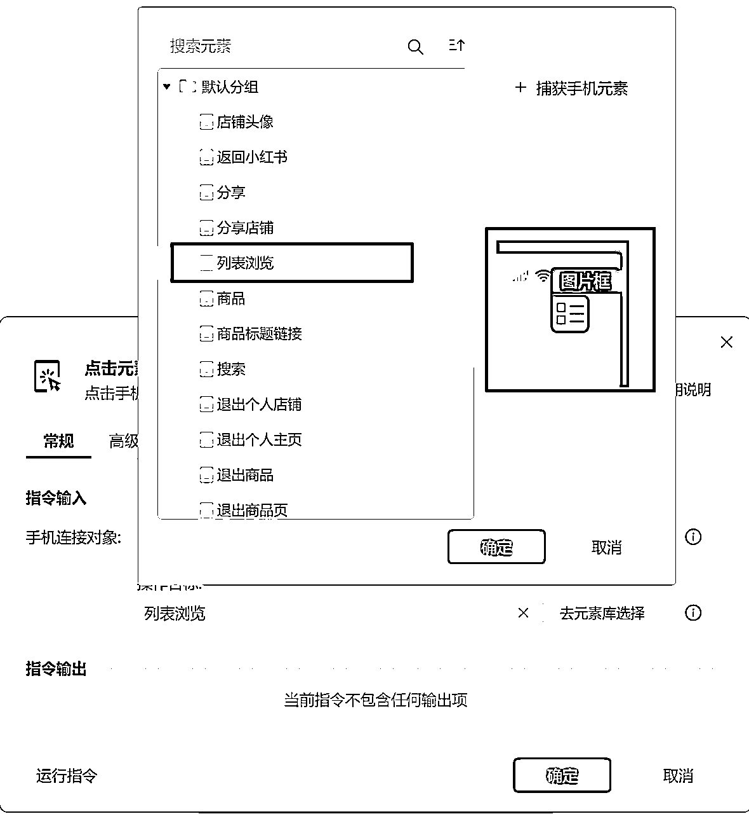
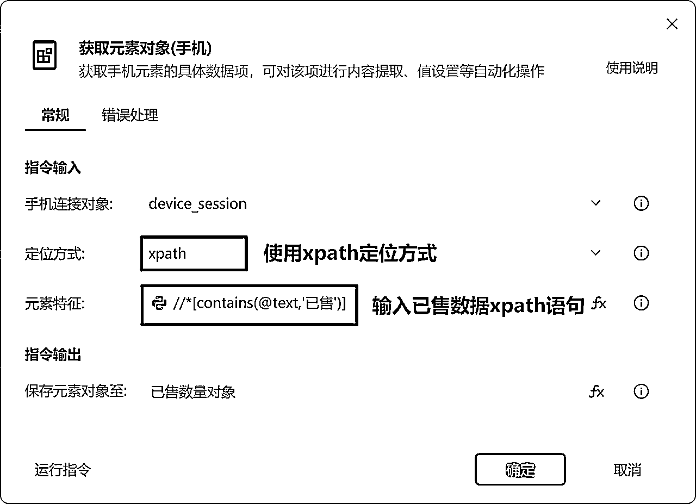

# 小红书影刀手机自动化爬取数据分享

> 来源：[https://ivbbfbvrsr5.feishu.cn/docx/Oatldduxkoo7rcxJqNUc9UDJn5M](https://ivbbfbvrsr5.feishu.cn/docx/Oatldduxkoo7rcxJqNUc9UDJn5M)

# 一、小红书项目梳理

# 一、搜索模块

## 1.1功能以及流程介绍

主要完成手机的连接、点击小红书APP、完成指定关键词的搜索功能

## 1.2模块流程

1、连接手机；2、打开手机APP(打开小红书APP)；3、点击元素（点击小红书的搜索放大镜）4、向搜索内输入自己要搜索的内容（例如：红包封面）5、点击元素（选择商品分类）6、点击元素（按照销量排序）7、点击元素（切换浏览商品模式）

## 1.3模块总览

## 1.4步骤拆解介绍

### 1.4.1连接手机和打开手机APP

这步主要是建立和手机的联系，其次打开我们需要操作的小红书APP，这里的【连接手机】命令直接点确认就好。然后将手机的小红书APP打开，然后再去点【打开手机APP的命令】，这里的APP包名配置可以直接点获取即可。

小红书的APP包名：com.xing.xhs

需要用到的指定：【连接手机】、【打开手机APP】

连接手机

打开手机APP

### 1.4.2搜索指定关键词

这步比较基础简单，主要是完成指定关键词的搜素输入，并同时按照商品、销量排序，这里需要特殊注意的是选择列表浏览模式浏览，这样选择的好处是每个商品链接的块状尺寸统一，方面我们后面程序的设计，避免BUG的出现。

需要用到的指定：【点击元素】、【输入文本】

【点击元素】

1.获取小红书

搜索放大镜

【输入文本】

2.输入自己需要

搜索的内容

【点击元素】

3.点击商品分类

【点击元素】

4.按照销量排序

【点击元素】

5.选择按照

列表浏览模式

## 1.5搜索模块流程参数

# 二、主流程模块

## 2.1功能以及流程介绍

这个模块主要是先调用搜索模块获取指定关键词的搜索，其次设置一个count变量，这个变量用来计算循环爬取了多少次。下面是【无线循环】和【循环相似元素(手机)】的嵌套使用。用来遍历获取每个商品链接，并对获取到的商品做处理。

## 2.2模块流程

## 2.3模块总览

## 2.4步骤拆解介绍

### 2.4.1调用搜索模块

这个模块主要是调用搜索模块，完成指定关键词的搜索。这个在搜索模块已经具体介绍，这里不再过多赘述。

需要用到的指定：【调用流程】

### 2.4.2获取当前页面商品标题链接

这个部分主要使用了【循环相似元素(手机)】的命令，首先获取商品的标题元素，然后再通过捕获相似元素获取当前页面包含的所有相似元素。将每次循环到的商品元素保存到单个笔记链接中。

需要用到的指定：【循环相似元素(手机)】、【if多条件】、【设置变量】、【调用流程】

#### 2.4.2.1避免点击'筛选年货节'

【if多条件判断】命令中，if多条件判断中有两个变量，第一个是mobile_element_index,这个变量是循环相似元素的一个循环变量，从0开始计数。count是我自己设置的一个变量，用来计算当前循环商品的次数。

因为在循环点击每个相似元素的时候，容易误点"筛选年货节"的按钮，这里加了一个判断，在第一次获取到相似元素的第一个商品正常点击。当获取到第二页的相似元素时，跳过当前页面的第一个商品，这里用的是继续下一次循环。

第10行用到的【设置变量】命令主要是实现count=count+1，完成累加计数。

### 2.4.3调用低粉爆款模块

用来获取符合低粉爆款的店铺

### 2.4.4滑动手机屏幕

滑动手机屏幕主要是获取到下一页的相似元素，完成继续循环。因为【循环相似元素】命令只能获取到当前页面的所有相似元素，没有办法获取到下一页，所以需要使用滑动手机屏幕重新获取新的一页数据。

需要用到的指定：【滑动手机屏幕】

这里的滑动坐标根据自己的手机不同型号去做合理的配置，另外在高级配置页面中，滑动时间设置3000毫秒，执行后延迟2秒，主要是为了防止滑动过快，导致略过很多符合条件的商品。

# 三、低粉爆款模块

## 3.1功能介绍

首先调用销售量模块获取商品的销售量，然后调用粉丝数量获取店铺的粉丝数量。如果销售量大于等于500，粉丝数量小于等于500时，则调用分享店铺 。

## 3.2流程如下

1、调用流程(销售量模块)；2、调用流程(粉丝数量)；3、判断销售量和粉丝量是否符合标准；4、退出个人店铺主页；5、退出商品页

## 3.3模块总览

## 3.4步骤拆解

### 3.4.1调用销售量模块、粉丝量模块

这个步骤主要是调用我们写好的模块程序来获取商品的销售量和该店铺的粉丝量，然后该流程以下的程序可以通过参数访问的方式得到这两个模块处理好的销量和粉丝量数据。

需要用到的指定：【调用流程】

### 3.4.2判断销售量和粉丝量

这个部分主要是判断该商品的销售量是否大于等于500，粉丝量是否小于等于600，如果满足条件则调用分享店铺模块，将该店铺分享到我们的微信群。如果不满足条件则打印输出说：当前商品不符合低粉爆款。

判断结束后需要退出店铺界面，退出商品界面回到筛选界面进行下一个商品的点击。

需要用到的指定：【if多条件】、【点击元素(手机)】

## 3.5低粉爆款模块流程参数

# 四、获取销售量模块

## 4.1功能以及流程介绍

这个部分主要是完成点击商品链接之后，采集本商品的已售数据。

## 4.2流程如下

## 4.3模块总览

## 4.4步骤拆解介绍

### 4.4.1进入到商品链接

使用【循环相似元素（手机）】的命令，获取到当前页面所有的相似元素，并循环取出，

使用【点击元素（手机）】命令点击单个商品，进入到商品页面

需要用到的指定：【点击元素（手机）】

### 4.4.2使用xpath获取商品已售数据

这里使用了【获取元素对象（手机）】的命令，其中的定位方式选择xpath定位，这种定位方式比较准确，具体学习可以参考【学习资料中的xpath学习资料】

已售数据xpath参考语法：//*[contains(@text,'已售')]

根据获取到的已售数量对象，使用【获取手机元素信息】去获取该对象的文本内容。根据以上两个命令就可以获取到该商品的已售数据。

需要用到的指定：【获取元素对象（手机）】、【获取手机元素信息】

获取已售数量对象

获取已售数量对象的元素文本内容

### 4.4.3对销量数据进行二次处理

对于小红书的商品销量分为两种类型，一种是销售量小于1w的，一种是销量大于1w的商品。商品销量高于1w时会出现万字样。例如：已售2.3万+。对于销量过万的商品，需要去除里面的万字同时乘以10000。

需要用到的指定：【从文本中提取内容】、【设置变量】、【打印日志】

销量过万：例如：'已售2.3w+'

从文本中提取内容：已售数量文本的内容为：'已售2.3万+'，我们要提取其中的2.3，就需要这个命令。注意，这里提取到的数字依然是文本格式，我们需要float函数进行格式转换。

设置变量：已售量=float(已售量)*10000，这里的float是浮点数，也就是小数。float(),是强制类型转化函数。

销量小于1万：直接使用【从文本提取内容】提取其中的销量数据即可。

如果获取商品的界面出现错误的时候，再尝试判断界面是否含有'已售'字样，如果依然没有就跳过这个商品，点击屏幕退出当前商品。

## 4.5销售量模块流程参数

# 五、获取粉丝模块

## 5.1功能以及流程介绍

首先点击手机的店铺头像，在店铺主页上面使用【获取元素对象(手机)】命令获取粉丝数量对象。获取的方式使用xpath方式。然后使用【获取手机元素信息】命令获取粉丝量的文本数据。

粉丝数据xpath参考语法：//*[contains(@content-desc,'粉丝')]

## 5.2模块流程

## 5.3模块总览

## 5.4步骤拆解

### 5.4.1获取粉丝量数据

首先点击屏幕右下角店铺的头像按钮，进入到个人主页，使用【获取元素对象(手机)】的命令获取粉丝量对象，然后使用【获取手机元素信息】命令获取该对象的属性'contentDescription',此时我们可以取到粉丝的数据了。

获取元素对象（粉丝量对象）

获取手机元素信息（粉丝量文本）

### 5.4.2粉丝量数据二次处理

因为粉丝量和销量类型都会出现包含万字的数据，这里就不过多赘述，具体可以参考销量模块已售量数据的处理方式：

## 5.5粉丝模块流程参数

# 六、分享店铺模块

## 6.1功能以及流程介绍

这个步骤主要是将筛选出来的低粉爆款的店铺分享到微信群，这个模块功能步骤比较简单主要使用到了【点击元素(手机)】【输入文本(手机)】的命令。

## 6.2模块流程

## 6.3模块总览

点击右上角三个点

点击选择微信分享

在微信搜索中输入

"小红书选品测试群"

点击'分享'按钮

点击'返回小红书'

## 6.4分享店铺模块流程参数

# 二、学习资料：

## 2.1本项目需要掌握知识点

### 2.1.1手机基本配置：

影刀中级教程-手机自动化（1节-4节）：1-认识手机自动化_哔哩哔哩_bilibili

### 2.1.2手机元素操作

影刀中级教程-手机自动化（6节）：6-手机元素操作_哔哩哔哩_bilibili

### 2.1.3xpath定位：

1.  影刀RPA高级课程（2023版）08：XPath - 定位元素的终极秘诀？_哔哩哔哩_bilibili

1.  影刀中级教程-手机自动化（7节）7-手机数据获取_哔哩哔哩_bilibili

### 2.1.4流程模块封装

流程的封装（73节-78节）：第73_第十课-前言_哔哩哔哩_bilibili

### 2.1.5各指令的使用

| 点击元素(手机) | 获取元素对象(手机) | 调用流程 | 无限循环 | 连接手机 | 打开手机APP |
| 获取手机元素信息 | 输入文本(手机) | 循环相似元素(手机) | 设置变量 | if多条件 | try和catch |

## 2.2飞书学习资料

飞书开放平台：https://open.feishu.cn/app?lang=zh-CN

审核自建应用：https://open.feishu.cn/document/best-practices/intro-to-custom-app-review

飞书开发文档：https://open.feishu.cn/document/home/index

## 2.3Uibot学习

UiBot初级开发指南：https://docs.uibot.com.cn/guide/d1/?0.7032214474897422

UiBot中级开发指南https://docs.uibot.com.cn/guide/d2/?0.1287339022662165

UiBot命令手册：https://documents.laiye.com/rpa-command-manual/docs/

UiBot教程汇总：https://forum.laiye.com/thread-50.htm?tdsourcetag=s_pcqq_aiomsg

## 2.4影刀学习资料

影刀IT速成课程（上）：编程入门到精通，全程详解：影刀IT速成课程（上）：编程入门到精通，全程详解。轻松掌握核心知识，助你飞跃成长，开启IT人生新篇章！_哔哩哔哩_bilibili

影刀帮助中心：https://www.yingdao.com/yddoc/language/zh-cn/?

### 2.4.1学习拓展

adb命名列表：https://yingdao.yuque.com/gikgtl/cco6gf/us9i3c2tkixdzklo#vvuP6

mac偏移：https://www.yuque.com/pengzhiqiang999/xiaokenai/fubpdho05yckgikf?singleDoc#

## 2.5Xpath学习资料

影刀xpathB站教程：影刀RPA高级课程（2023版）08：XPath - 定位元素的终极秘诀？_哔哩哔哩_bilibili

xml教程：https://www.w3school.com.cn/xml/index.asp

xpath基础知识教程：https://www.w3school.com.cn/xpath/index.asp