# 让图文矩阵号运营提高100倍效率的方法

> 来源：[https://xdvsj87g5w.feishu.cn/docx/SHPKd5sbToWZ3pxyM5NcGRL7nxX](https://xdvsj87g5w.feishu.cn/docx/SHPKd5sbToWZ3pxyM5NcGRL7nxX)

或许你是个自媒体老兵，

有内容和方向，甚至运营有多个矩阵号，但是总是解决不了生产大量内容的问题

或许你是个新手，

想玩小红书、抖音，跟着别人赶上最后一波自媒体风口🔥，但因为害羞不敢真人出镜📷......

想发笔记，但不知道怎么录视频📹，也不知道什么样的内容吸引用户能涨粉......

想靠小红书赚钱，但完全不知道怎么变现，只是幻想着先做粉丝，等粉丝涨上去了自然能通过接广告变现，结果发的内容只有几十个👀......

想跟着别人做小红书店铺运营，但是做了半天发现自己对选品👜、电商毫无感觉，更别提还需要做视频吸引用户购买🛒了，连素材都找不到......

又或者，已经有了方向，但压根没办法每天抽出足够的时间⏱️做内容，保证账号连续更新......

其实你遇到的这些问题曾经我都遇到过，你可以看看我给你的解决方案......

我是毫末，一个喜欢钻研小红书图文玩法的程序员。

图文笔记大家应该都很了解了。小红书是图文笔记的元老，后来抖音和公众号也开通了类似的功能，公众号的图文甚至被称为“小绿书”

图文内容，相比视频内容，视觉明显，而且用户可以几秒了解全部内容，清晰直观，所以尤其是在小红书，这类内容十分抢眼，十分吸流量

你以为现在是个视频流量的时代，如前几个月突然公众号流量主火了一样，其实图文们也正谋划着偷家呢。

随便展示一些内容。像这个心理学账号，一个笔记几千几万赞，全部是模板化的图文笔记，目前有13万粉丝，条条数据火爆 🔥

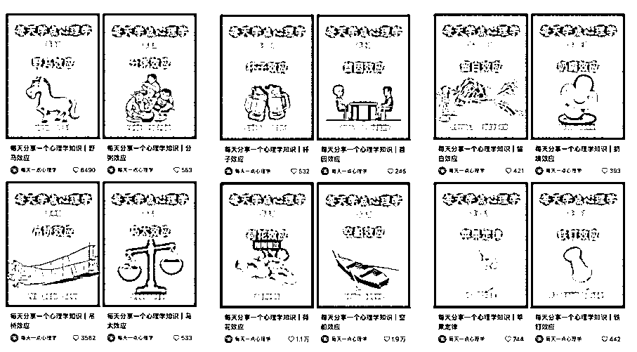

还有像下面的这个养生账号，这个笔记2.5万赞，全部是图文笔记，只发了14条，做了不到一个月涨粉近3000，已经开始接广告：

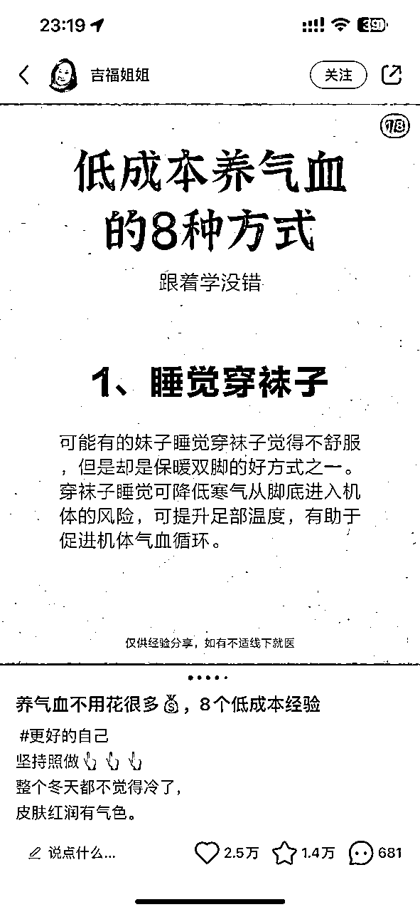

还有更离谱的，这个正念，每天的笔记都几千赞，3.4万粉丝，已经开始大量地接广告。

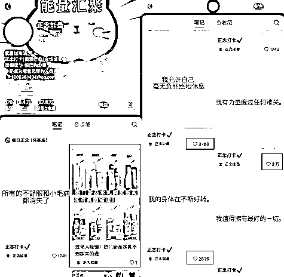

这个正念的账号，刚好踩中了现在经济环境差的风口。经济好谈赚钱，经济差谈疗愈，这个正念就是给大家心理疗愈。

这种“疗愈”内容，你上你也行呀！

除了小红书这个图文的鼻祖，抖音和公众号也早就有发图文的功能，并且图文内容的流量依旧强势。下图是养生、育儿、心理学几个领域中抖音图文的数据：

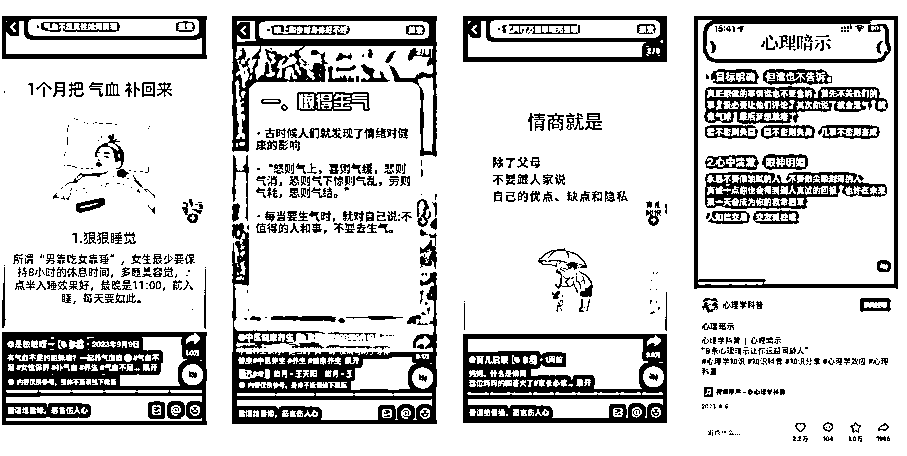

看到这，你是不是觉得，这样的图，得一个个去p图？？当然也可以，但如果真的这样做，可太费劲了！

至少，看到这篇帖子的人，完全不需要自己费劲去做图文

# 正文教程

下面直接上干货。

这次制作批量图文用到的核心工具是ChatGPT+Canva。ChatGPT负责生产内容，Canva负责生产图片，主打二者丝滑配合，提高效率。（注意，需要开通Canva的pro功能才能支持批量编辑）

假设我们现在要做一个男性成长的图文。

第一步，先用chatGPT生成内容。

这个是我用到的提示词，注意，这里一定要生成表格样式的内容！

chatGPT按照要求给到了我相应格式的内容，如下：

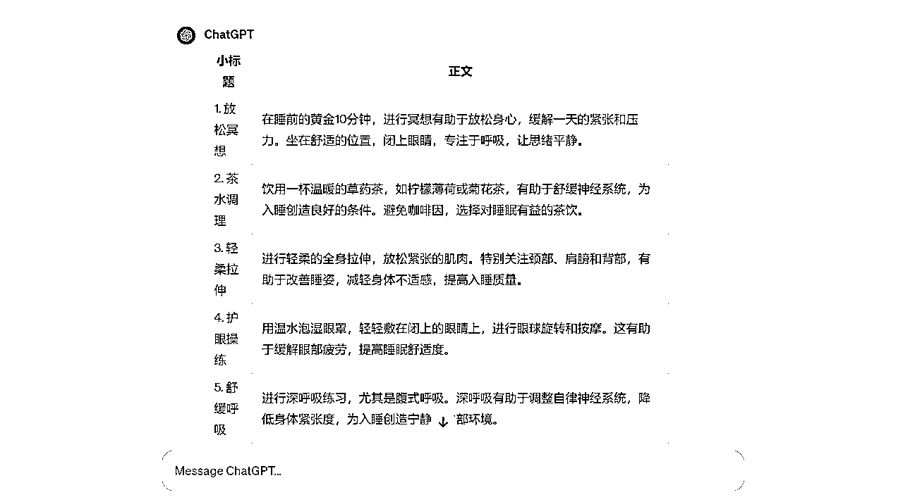

一定要选中内容复制，不要点内容最下面的那个复制按钮，要不然会让表格样式丢掉：

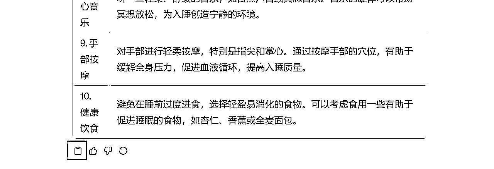

第二步，将内容制作成表格

复制好的内容如下，

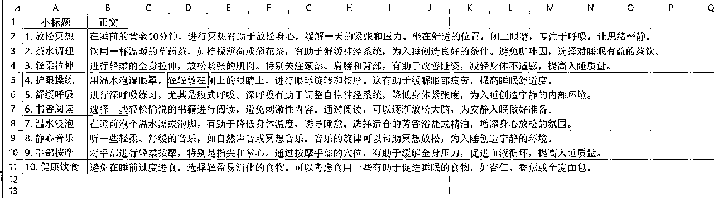

将内容复制到表格后，将表格另存为csv格式，CSV 文件基于纯文本格式，Canva必须要这种格式才可以导入。如果出现兼容性提醒，全部点是。

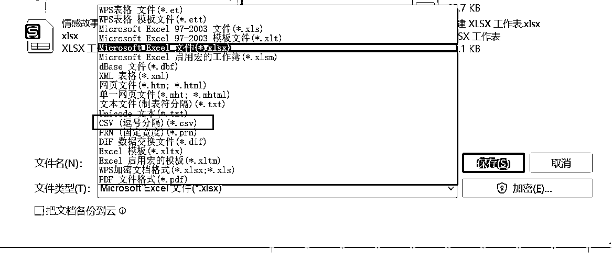

第三步，创建canva的模板，并将数据导入

先做好一个模板。

点击右上角的创建设计，自定义大小，选择单位为厘米，宽度设置为30、高度设置为40（因为小红书最常用的是3:4的比例），点击创建新设计。

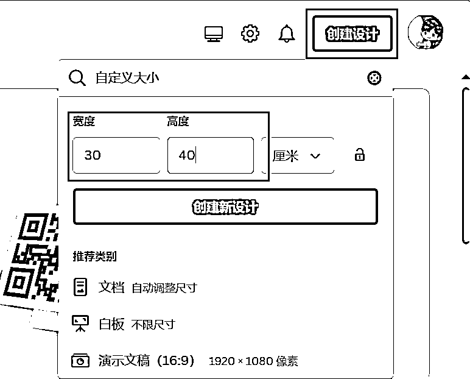

找一张好看的背景图，设置好标题和正文的内容。

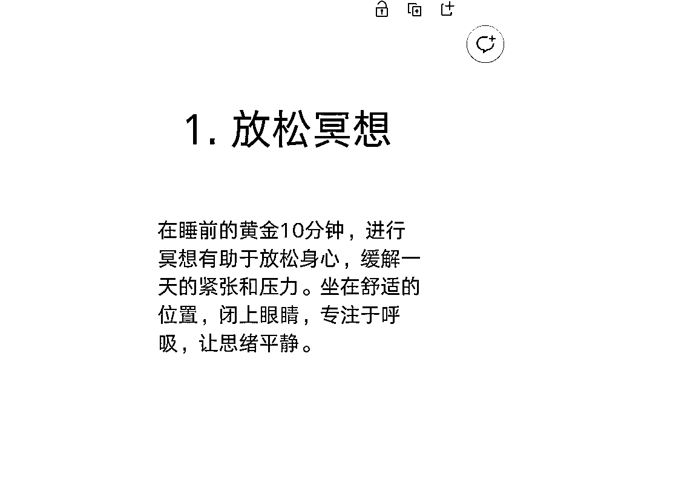

批量创建内容

点击左下角的应用，点批量创建。（这里需要开通会员才可以使用这个功能，30/月）

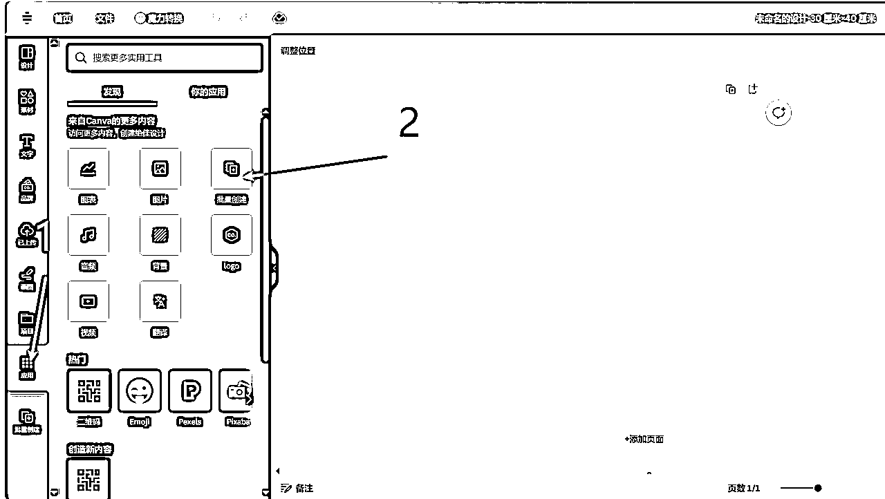

点击上传CSV，选择刚才做好的表格，会提醒你关联素材。

右键点击模板中的“小标题”，点关联数据，分别关联好模板中的数据。（如果这里出现了乱码，请点击这里 ，看处理乱码部分）

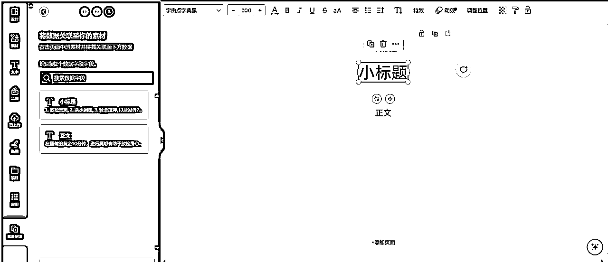

关联好后，点击继续，就会生成不同的设计：

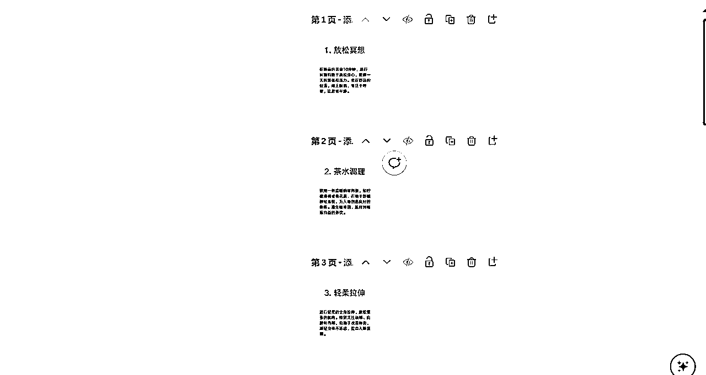

点击导出 - 下载，根据需要选择合适的格式，就搞定了！

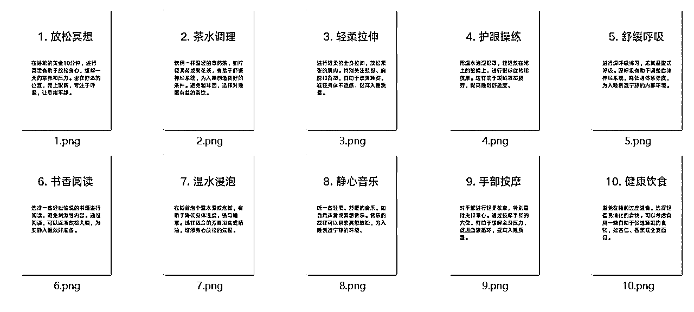

是不是非常效率？

注意：如果导入表格时出现了乱码，需要进行额外处理一下excel文件。

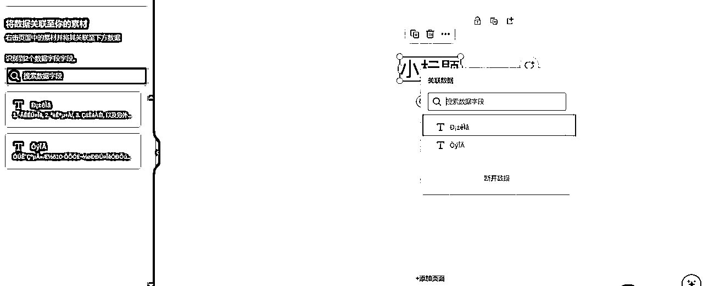

乱码的原因是另存为的时候没有将内容标记为UTF-8的编码格式（中文编码）。

解决这个问题，只要重新标记为UTF-8的编码格式即可，将保存的csv文件点击右键-打开方式-使用记事本打开，再次另存为，注意这里要选择使用UTF-8编码！

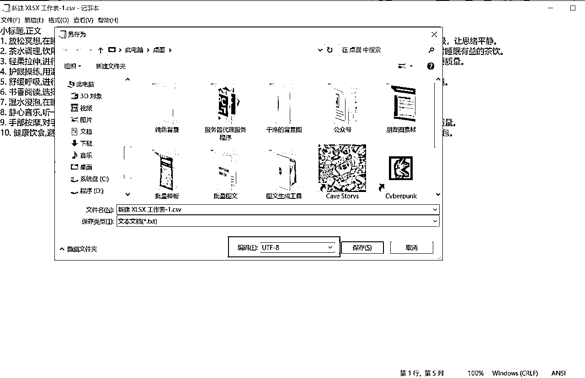

以后把表格直接复制到最新的这个csv文件中，格式就不会乱了。点这里返回刚才的位置：

对于纯图文内容，如果一次做几十张或者几百张图，这个方法可以提高不少效率，就是需要开canva的会员，30元/月。

哈哈哈，如果看到这里，感觉还不错，欢迎给点个赞。

# 给自己的小软件打个广告

后面是给自己的一个小工具打的广告，

最近开发了一个专注批量生成图文内容的工具，目前永久使用的价格比canva的年会员还便宜。

对购买软件的同学，还会免费分享一些小工具，比如批量去除背景、批量拼接图片等。

windows电脑可以本地使用，一键就可以处理图文，也不用导出csv这种格式，点两下选择好excel文件和模板就可以批量制作。

这里有个软件的功能演示：

除了做单文字的内容外，也可以批量制作带有不同图片的图文。

下面是软件生成图文的一些案例：

#### 类型①：一张图中，仅文字不同

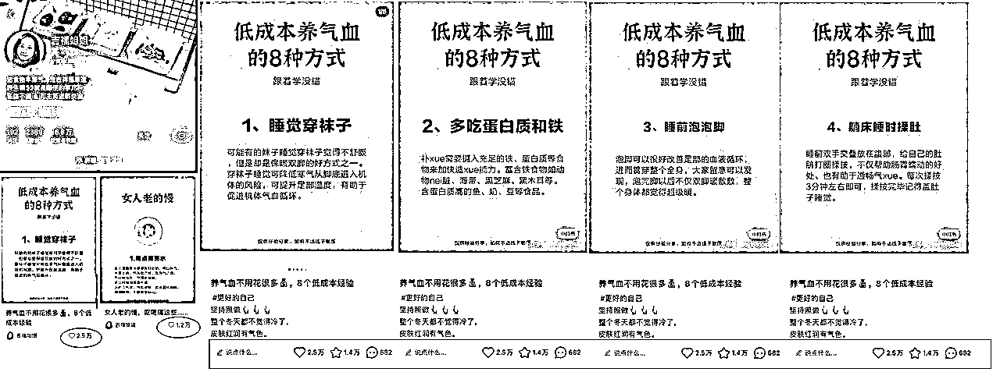

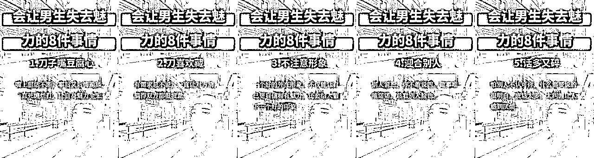

#### 类型②：一图中，有文字和不同的图片

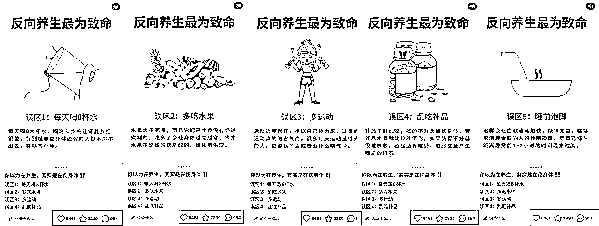

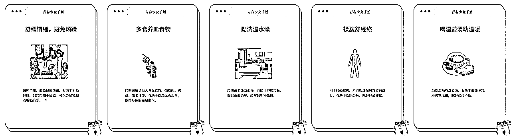

#### 类型③：一图中有文字和多张图片

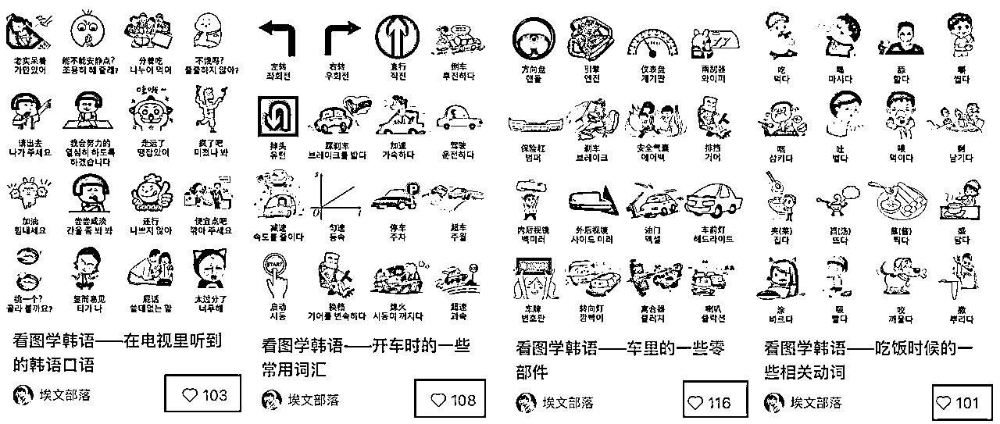

只要是模板化的笔记，只要你能想到的，它都可以做到。

如果有兴趣可以点我知识星球的头像链接我哦

那你说，如果我不知道做什么样的内容怎么办？没关系，我已经替你想好了。

从软件学习开始，跟教程走一遍，5分钟学会，做出的正念内容就可以直接拿去发笔记。

而且在社群中，从背景素材，到内容模板

从账号定位，到发什么内容，如何引流避坑

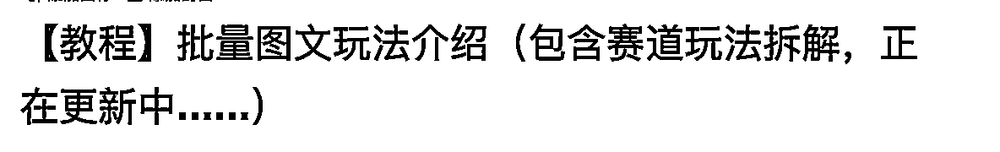

全部都提供给你，教程还在不断地更新。

同时，我也会不断更新各种赛道的批量图片玩法拆解，教辅、星座、培训、虚拟资料等等。最近在研究一些小红书的变现新玩法，等后面拆解赛道的玩法会继续更新起来。

如果有兴趣可以点我知识星球的头像链接我哦

# 写在后面的话

如果你已经做出大结果的人或者已经是一个老兵，可以充分利用这个工具，更快的产出高质量的内容。

如果你也是一个自媒体新手，可以简单看看，和各位聊一些坦诚的话。

无论是全职还是兼职，我也接触自媒体两年了，我曾无数次感受到过你的感受。

如果每天都费尽心思，花几个小时终于做出来一个视频，

但点赞一个没有，播放也只有了了的几十个，每天都重复如此，无论是谁都会无比地挫败。

我坚信做自媒体能让你坚持下去的不是所谓的造梦和鼓励，而是快速拿到反馈，

花费最少的精力，先看到小的结果，当有了收获和自信，才能让你坚信自己可以，再去投入更多的精力，有更大的突破。

我做这个工具和小社群的缘由，也是看到曾经蹉跎的自己，整整2年的时间，干过各种各样的互联网小项目。每天7点多起床，6点多下班，下班后就钻到书房，在电脑前一坐就是四五个小时，一直熬到12点多才睡觉。

花费了时间精力，但就是因为不懂、没经验、没做过，也没有属于自己的技能，在自媒体的漩涡中被挟裹着，没有头绪、没有结果、没有方向，各种尝试，但每次都毫无结果，没有一点点的正反馈。

但是如果你是一个想拥抱自媒体但被扎的浑身是伤的新手，希望这个小工具能帮你打开一个不同世界的门缝，走进来并切实地感受到它，让自媒体成为你的朋友，而不是给你带来痛苦的敌人。