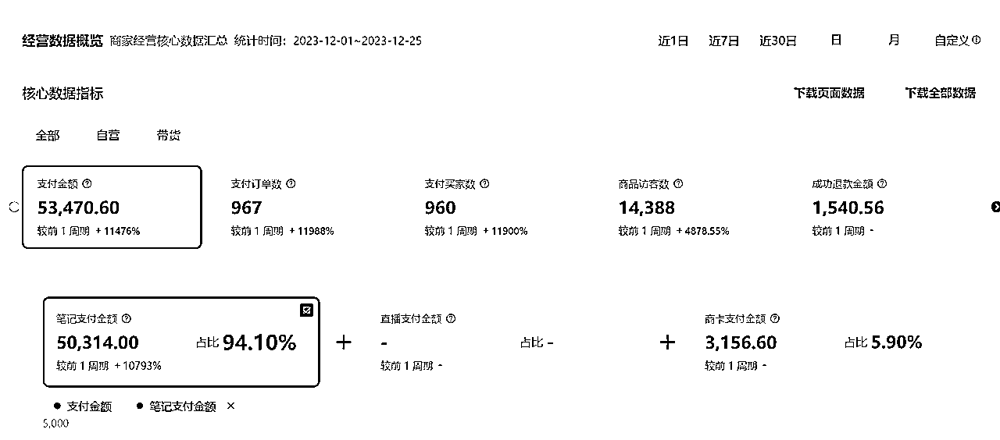
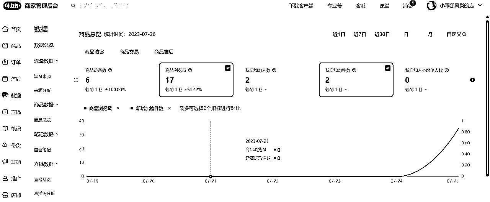
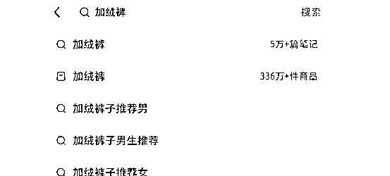
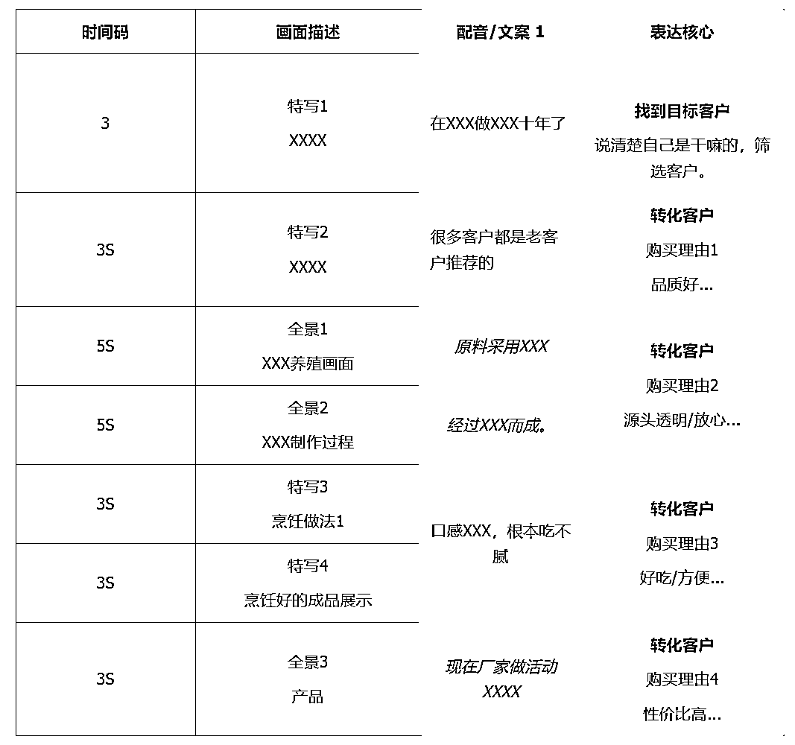
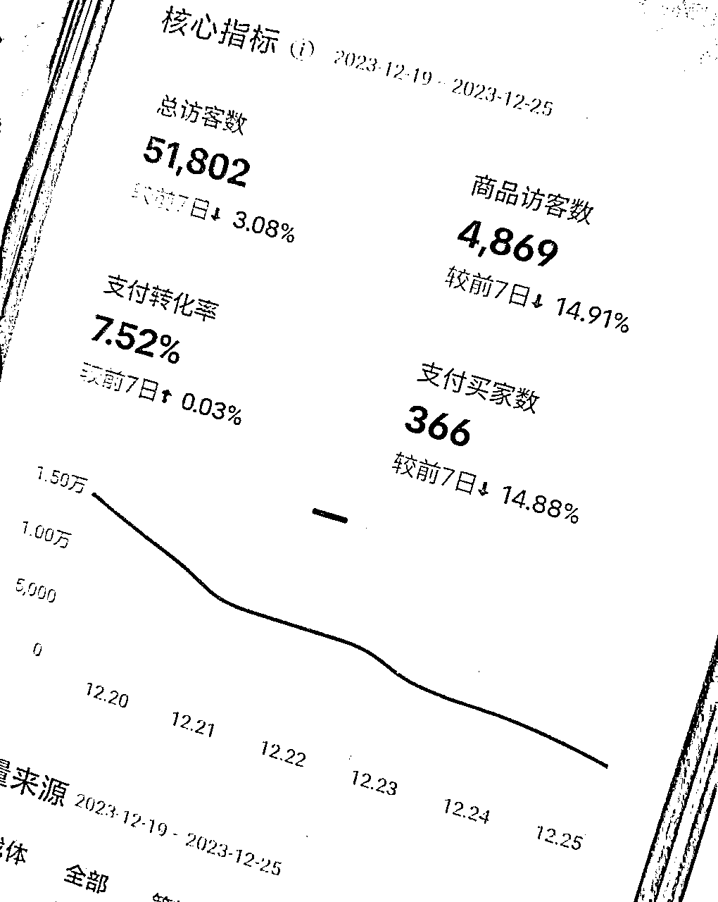

# 跌跌撞撞，12月小红书店铺GMV首破5W+

> 来源：[https://i7ps6a5omq.feishu.cn/docx/Q9Z8d6tUmo11ugxDe6Fc8OkPnsg](https://i7ps6a5omq.feishu.cn/docx/Q9Z8d6tUmo11ugxDe6Fc8OkPnsg)

历经两个月，发了120多篇笔记，终于在12月7号首次破千。时至昨日，12月GMV破5W了。目前单日GMV基本在2K+，最高4K+。

此间于星球经验贴受惠颇多，特来分享下，希望对刚做的小伙伴有些许启发。

# 一、项目历程

其实最早是从7月开小红书店铺，也是看了很多大佬分享，知道像女装首饰之类的产品爆发空间很大，也知道这些大热类目都是非常卷的。

但本着”水深鱼大“的想法，一开始选择了做女装，纯混剪，当时播放量基本在200左右，但访客量少的可怜。虽然也有加购，但就是没有成交。

后来发了几十篇，播放量持续没有起色，于是打算重新做号。

关店了又开店，还是做女装单品，又发了几十篇，不过结果还是差不多，甚至播放量更少了。

我寻思着，可能我一糙汉子真的不懂女装吧，可能小红书女装真的太卷了吧。现在回想起来，原因是多方面的。比如选品不行。比如视频没有成交能力。比如 可能是没交保证金。

历经两次惨淡，一度心灰意冷，小红书店铺抓抓放放。

后来，又在圈里看到很多人分享小红书的成果，颇有激励，感觉自己又行了。

嗐~可能我等俗人，就是间接性踌躇满志吧。

时间来到十月，23年快没了。大佬们盆满钵满，我总不能连个盆都没有吧。

那段时间看到史铁生的一句话“ 拖延最大的坏处还不是耽误，而是会使自己变得犹豫，甚至丧失信心。 不管什么事，决定了，就立刻去做，这本身就能使人生气勃勃，保持一种主动和快乐的心情。 ”

拖延很主要的原因，就是过分追求完美开始，或者说对结果预设过高，知道自己很难达到，继而陷入“不开始就不失败”的潜意识。

对小红书消极的那段时间，美其名曰”寻找新的机会，再准备准备“，实际就是没有继续做的心气了。

我觉得与其追求完美开始，不如尽快行动起来，没有完美的选择，结果再小那也是正反馈呀，也能激发信心。

于是，10月17号再次开店，这次不求大结果，只求拿到正反馈。

这次我重新思考了选品，重新思考自己究竟适合什么类目。女装这样大爆的类目，动辄几十万的营收，尽管很有吸引力，但对我新手来说，未必是最好的。

我首先需要的是在这件事上建立体感，建立信心。

# 二、关于选品

说到选品，不得不说下自己的主业，近两年我在做抖音电商服务商，主要是帮商家对接大主播。这期间合作了不少商家，其中有些，帮他们推了百万GMV以上，合作关系自认为相当可以，商家实力也尚可。

不过全都是食品类目，而且大多数不是即食零食，所以一开始没想在小红书卖这些。

在做直播选品的过程中，也积累了一些选品以及建联的方法：

1、找类目：通过灰豚数据等第三方平台，查询近期潜力爆品。

2、找店铺：抖音搜索产品，只选有旗舰店的品牌，并且店铺评分三项4.6+，单品存在好评率90%+的链接。这证明了品牌方在电商零售方面有一定实力和重视，并且产品品质还可以，售后不会太多。

3、找联系方式：咨询店铺客服，或者在精选联盟直接能找到合作方式。或者天眼查搜索店铺主体公司。

4、选人：通过聊天谈判，谈价格、谈佣金，同时判断品牌方的格局和配合度。

当然，以上是我做直播选品的路径，只能参考借鉴。

说回小红书，这次我的选品，不再看第三方数据，就是在已经合作过的商家里选。换句话说：选自己合适的、熟悉的、或者有优势的，而不选最热门的。

如果是电商小白，没有熟悉的也没有优势的类目，建议先选自己感兴趣的吧，感兴趣至少能钻研下。

再去小红书搜索下，看下商品数量，商品数量特别多的，比如女装随便哪个细分类目，都是上百万的商品数量，竞争就比较大了。

当然，小红书是笔记带货，去中心化的，归根结底还是靠笔记内容，不是先上架的就一定卖得好，后来的就一定卖不动。

根据以往经验和商家反馈，定位到一款产品，年底是小旺季。而且这个产品本身不算特别小众的产品。我去小红书搜了下，万+销量有好几个，证明了小红书能卖得出去。

而这次我的追求并不高啊，别人能卖的出去，就证明有需求，仅此而已。这次起步，拒绝搞复杂化。

以上说的就是腊肉这个类目，有兴趣可以去关注下。并且这个类目小红书可以开个人店哦！

目前我这个店铺只做了这一个单品。原因是几方面的：

第一，小红书是笔记带货，全靠笔记爆发带动单品。

第二，很多类目是受限制的，需要个体户以上和食品备案，起步时不想搞复杂。

第三，当然也可说是出于偷懒，把自己的选择缩窄以后，不用考虑太多，全力就把这一个品推到一定程度。缺点在于，单品衰落速度更快。

# 三、关于笔记

诚实地说，我的笔记目前都是工具批量混剪的，这一点不太光荣，有点拿来主义，也受到了很大限制，毕竟网上素材是有限的。所以现在新店铺已经着手实拍了。

混剪的逻辑：多个视频，各取一小段，重组、反转、裁剪、加特效，重新配音等等。

当然我的混剪不全是乱剪，尤其是在一条视频爆发后，就对照那个爆款结构，设计了不同的文案，重新配音（剪映就能免费配音）。爆过的视频，同结构视频大概率还会有流量。

文案非常重要，好的文案大大提升转化率。我的文案设计脚本模板供参考。

小红书笔记有其特点，它的首页是展示笔记封面，封面、标题决定了点击率。

视频再牛逼，没人看也是枉然。

甚至，视频画面可以不那么精致，但是有条件的话，最好在封面标题下点心思。

想象在一众精致干净的封面里，观众有什么理由点开你的笔记。比如看着就好吃、好玩、好奇...

另外，咱们新手发笔记，不要期待过高，单篇一两百播放的笔记，都属正常。我是发了五十多天，发了120篇才迎来第一次营收破千。

中途也是经历过各种心态的，不过始终保持更新，因为一开始我立下的心态就是不求大爆，先发个一百篇。

只有少数人是天选之人，发几篇就爆，有些人则会慢一点。咱先别求外在结果，先求己，主图 标题 文案，能做到什么程度，能发多少篇笔记。

# 四、关于开店

上架产品直接用工具一件搬运，小红书服务市场很多。如果不是知名品牌，也没有价格优势，尽可能隐去品牌名，避免买家搜索比价（不多）。如果是食品，一定要找正规的，包装标签信息完整、合规，避免被打假勒索。

我是上架产品后第二天就开单了，后来做过十来个销量，也做了两个好评。

在11月下旬缴纳保证金后，店铺流量12月上旬开始逐渐好起来的，所以我不确定保证金是否关键。

但如果条件允许，决心做了，可以在开了几单之后，尽快缴纳保证金。

发货方面，我直接开子账号给商家发货。

# 五、几点感触

以上所述，有些算是老生常谈的内容了，有些则是经历后的主观看法，仅供参考。

回顾整个项目历程，其实操作是比较粗放的。选品很粗放，视频也不高大上。

对我而言，这样的好处是，把战斗力平均在长线，避免某个环节用力过猛。

这样的缺点是，求其下，大概率也只能“得其下”咯。

小红书笔记好玩在，有长尾流量。你也不知道哪天就有之前的笔记爆发，并且能持续一段时间。坚信这一点，也是能坚持发的原因之一。

然而有爆发就必然有衰落，实不相瞒，这两天流量已经开始下滑了。不过做流量生意终将面临衰落。

心态上已经平稳了许多，因为真切体验了正反馈，对于小红书，心里算有一点底了。

还有一点，对于新手，尽可能降低起步的成本，避免差生文具多。起步成本越多，期待越高，越容易失望。

我视频都是花少量时间批量混剪而成，这大概也是我能坚持发一百多个的重要原因之一吧～（当然每个人情况不一样，理性客观看待。很多产品的实拍成本也并不高。）

随着更多人进入小红书电商，卷是肯定的。平台的政策也是日新月异。个人起步经历了粗放操作的阶段，也要开始着手实拍、新产品、多账号了。如果也有在路上的同路人，可以一起多多交流。