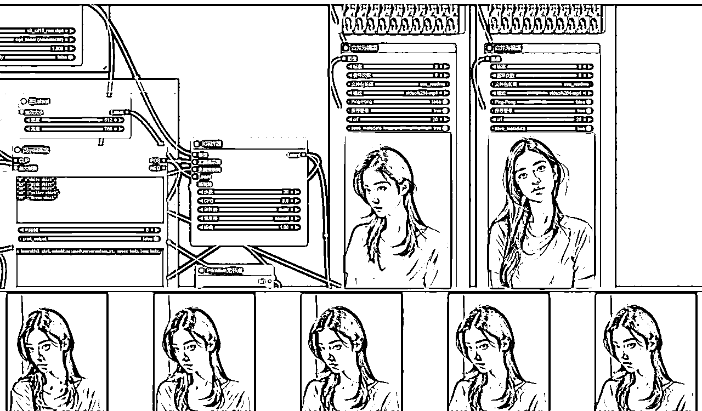
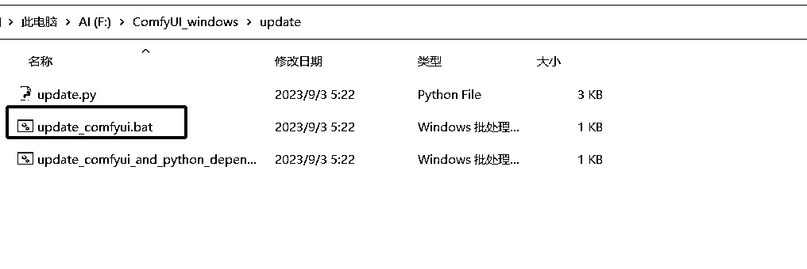
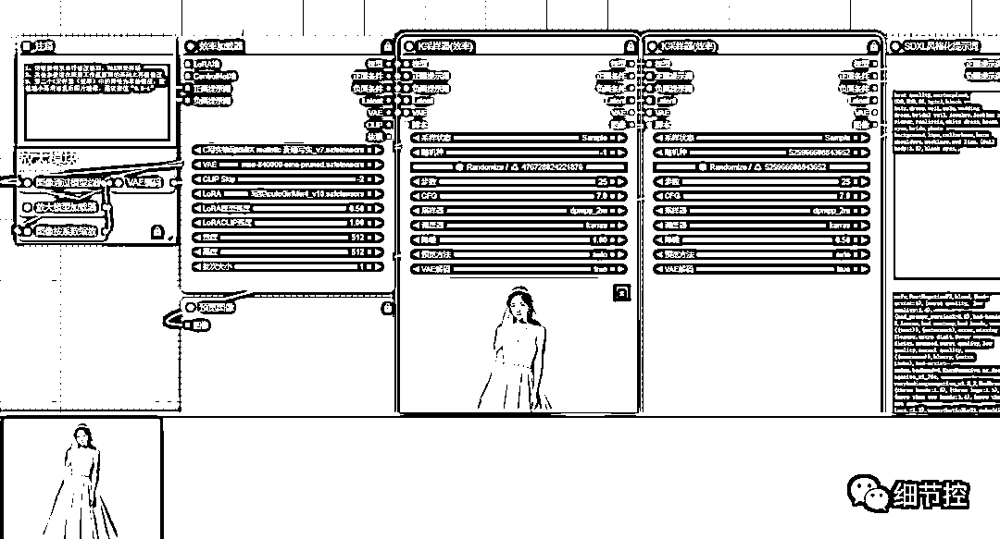

# ComfyUI 知识宝典-新手入门和使用教程完整版

> 来源：[https://jrnoijjrwm.feishu.cn/docx/QVeOdYtiHooLkRxmOzccLdb5nKc](https://jrnoijjrwm.feishu.cn/docx/QVeOdYtiHooLkRxmOzccLdb5nKc)

ComfyUI是AI绘画的新秀，其独特的工作流机制+显存占用优化，吸引了更多的开发者和个人使用者。使用ComfyUI+animatediff 可以生成丝滑的视频，比如抖音前段时间很火的一个女孩/一个男孩的一生 。再比如在AI摄影写真领域，现在很好用的真人照片一键换脸。

### 一、常见AI+应用场景

#### AI短视频

AI生成的视频，更容易吸引眼球，AI在加速视频内容的进化，AIGC给创作带来了想象的翅膀。（央视已经上AI短视频了）。OpenAI的Sora，也带来了短视频的革命性突破。

#### AI写真摄影

在AI摄影领域，ComfyUI的工作流模式，很好的带来了效率的提升。在comfyui中，选择一张要替换的人脸，再上传一张姿势的参考照片，输入提示词，即可生成一张以人脸为参考风格的图片。（相信老铁们猜得出是这张脸的原型是谁）

下面是我用SD生成的创意图片，帮朋友做的AI写真换脸效果，收获了好评：

#### AI美女号

另外，抖音上已经有很多的AI美女视频号，视频质量方面几乎可以以假乱真了，涨粉的速度也非常快。比如下面2个账号。

#### 老照片修复

#### 动漫转真人

当然，真人漫改也是一样的逻辑。

#### 热播影视剧 Q版人物

热播电视剧的Q版人物，一方面不缺流量，IP也能带来一波回忆杀。下面这组图是一只小鹿鸭的作品，在某音和某书都有很好的数据。

当然comfyui的应用不只是这些，现在老SD玩家都已经转型在玩comfyui了。

### 二、ComfyUI是什么

ComfyUI 是一个基于节点流程式的stable diffusion AI 绘图工具， 你可以把它想象成集成了stable diffusion功能的substance designer， 通过将stable diffusion的流程拆分成节点，实现了更加精准的工作流定制和完善的可复现性。（但节点式的工作流也提高了一部分使用门槛。）

### 三、使用ComfyUI有哪些好处？

ComfyUI为Stable Diffusion提供了一个强大的节点流程操作界面，带来了更多的自由度和可复现性，同时降低了显存要求。ComfyUI生成图片时的速度相较于WebUI有10%~25%的提升,对显存占用小，现在8G显存就可以在comfyui上使用XL工作流了。

除了显卡优化以外，ComfyUI是一款易于上手的工作流设计工具，基于工作流节点设计，可视化工作流搭建，快速切换工作流，除了支持文生图，图生图，高清修复，面部修复，局部重绘，LORA等工作流节点，还支持多种插件，如Reactor、Controlnet、IPAdapter和AnimateDIFF等。

对应企业内部的工作流，可以搭建好工作流后，一键运行。比如一键替换背景，抠图。或者摄影类，搭建摄影工作流。comfyui节点流的一个很大优点是，你也可以直接导入别人分享的工作流，加载即可用。

一键工作流:comfyui工作流的优点是DIY好工作流后，接下来的参数，模型设置都保存好了，使用的使用只有上传参考图和要换脸的图片（图生图），文生图是写提示词，即可一键出图。

（ipadapter_animatediff ，生成视频工作流）

### 四、如何下载和安装ComfyUI

comfyui的使用也有本地部署和云平台使用2种方式。本地N卡（NVIDIA），显存4G以上，即可选择本地部署的方案。（没错，comfyui对显卡的要求大幅降低，webUI要8G显卡才能玩得好）

下面是comfyui安装的几种方式：

#### 官网纯净版下载

GitHub地址：https://github.com/comfyanonymous/ComfyUI

1.  首先从官方的github连接上找到最新的release包，下载下来，解压即可使用：

1.  点击进入Releases，点击下面的"Download link with stable pythorch 2.1 cu121"以下载安装包。

https://github.com/comfyanonymous/ComfyUI/releases

1.  解压安装包到合适的位置，打开文件夹我们可以看到“run_nvidia_gpu”文件，双击就能启动 ComfyUI 。

1.  run_cpu.bat 点击启动程序是CPU模式，无显卡可使用，绘画速度慢，一些插件无法使用。

1.  runm_nvidia_gpu_bat 此文件启动程序则是gpu模式，根据显卡的配置，显卡越好，绘画的速度越快。

浏览器会自动打开打开访问地址，加载默认的文生图工作流。

#### 使用整合包

注意，官方纯净版初始安装中不包含模型和插件。为了方便使用，也可以下载comfyui整合包，比如秋葉aaaki大神、Blender无限圣杯、铁锅炖，整合了很多插件、模型、工作流。

新手用户，本地部署，首选B站 秋葉aaaki大神的整合包。【AI绘画】ComfyUI整合包发布！解压即用 一键启动 工作流版界面

使用教程：https://www.bilibili.com/video/BV1Ew411776J/?spm_id_from=333.999.0.0

网盘下载链接：https://pan.quark.cn/s/f3e377d6f394

当然，也可以使用我的个人整合包，只是更新日期是去年11月的，新的插件还没安装。（待后面有需求的话再重新打包一份）

#### 云平台使用

推荐云使用仙宫云，揽睿这2个云平台。 在使用comfyui工作流时经常遇到插件安装，模型下载的问题，为了方便大家使用和体验comfyui，我在仙宫上部署了一个云端comfyui镜像包（ AI写实摄影+视频镜像包），开放给大家使用。

##### AI写实摄影+视频镜像包镜像包介绍

名称：细节控ComfyUI AI写实摄影+视频工作流

镜像主页：https://www.xiangongyun.com/image/detail/98308b39-7d4c-5735-907c-a9b913819bc1

邀请链接：https://www.xiangongyun.com/register/1W8BDK

新用户点我的邀请链接，可获得仙宫云5元新用户奖励 ，体验2个小时的4090作图时长。

镜像包支持多语言，已安装并配置好了Animatediff，IP adapter，Face ID，InstantID,内置一些常用的lora。顺带分享了我觉得比较实用的一些工作流.

##### 部署方式

1.点击部署GPU计算容器（注册，登录后）

2.选择4090显卡，在镜像选择中在社区镜像中搜索细节控。

3.开机后（开机需要2-3分钟），在容器中点击运行。

4.进入主页，点击使用文档，内有使用说明。

##### 内置工作流

镜像包整内置了当前热门的IPAdapter FaceID，InstantID，AnimateLCM，Portrait Master肖像大师，Animatediff视频动画,sdxl_lightning,Stable Cascade等工作流.大家快去愉快玩耍吧。在左上角的Workspace插件中，即可打开内置工作流。当然也可以点击Import加载本地工作流。

### 五、配置模型、LORA

ComfyUI虽然自带了pytorch和stable diffusion环境，但是不包括模型，所以需要将模型放置到ComfyUI对应目录中：

1.  大模型应放入"ComfyUI_windows_portable\ComfyUI\models\checkpoints"，

1.  VAE模型放入"ComfyUI_windows_portable\ComfyUI\models/vae"，

1.  Lora模型放入"ComfyUI_windows_portable\ComfyUI\models/loras"。

如果你本地电脑中有使用过WebUI，那么你的模型文件通常是放在stable-diffusion-webui目录下的，复制过来就会很浪费空间，所以ComfyUI的作者提供了使ComfyUI和Web UI共享相同的模型，以避免重复拷贝大量模型文件，

修改方法：

1.在ComfyUI目录中找到这个叫做 extra_model_paths.yaml.example的文件，并将后缀名example去掉：

2.用记事本打开extra_model_paths.yaml文件，替换你本地webUI的路径地址：

把里面 base_path的路径改成你的 webui 的地址。比如我的是“F:\novelai-webui-aki-v3A”

3.controlnet地址需修改成WEBUI的 controlnet 模型安装目录，“extensions\sd-webui-controlnet\models”。

启动ComfyUI就可以在模型栏读取到本地模型了：

### 六、更新ComfyUI

如果后面需要更新ComfyUI，可以直接使用ComfyUI中的update脚本，不需要重新下载和配置：

1.  在"ComfyUI_windows_portable\update"文件夹中找到"update_comfyui"和"update_comfyui_and_python_dependencies"两个文件。

1.  使用"update_comfyui"来更新ComfyUI，等待出现"Done"表示更新成功。

1.  关于配置环境的更新，一般情况下不需要进行，除非有特殊需求。

1.  注意：comfyui新版本不要急着更新，否则容易出现更新后原先的工作流无法使用。(插件版本和comfyui不兼容，等插件适配后再升级好点）

1.  如果使用秋叶的comfyui整合包，在整合包的插件管理中进行更新。

主界面跟webUI一样。左侧是菜单，中间是文件目录（点击可直接打开），右下角的启动按钮。可在扩展界面中进行插件管理（更新，切换版本，卸载）

### 七、ComfyUI--基础工作流使用说明

#### 文生图（text2img）使用步骤

在构建text2img网络时，我们分为三个关键阶段：Clip阶段（黄色）、Unet阶段（红色）、以及Vae解码阶段（绿色）。

在这个过程中，节点的创建方式有两种：节点目录方式：通过鼠标右键呼出节点目录，你可以直接从目录中选择所需的节点。

1.  节点搜索窗口方式：双击鼠标呼出节点搜索窗口，如果你知道节点的名称，可以直接搜索，节省时间。

1.  一旦节点被创建并连接好，你可以点击面板右侧的工具栏中的 "Queue Prompt"，开始生成图片。这个选项位于工具栏的最上方。

1.  要创建连接线，只需使用鼠标点击并拖动节点上的输出输入点即可完成。

通常，节点网络包括以下几个阶段：

#### 大模型加载器：

首先，右键点击新建节点，选择加载器。你会看到许多加载器选项，它们的名称应该很熟悉。我们将使用的是“Checkpoint加载器（大模型加载器）”。在“Checkpoint名称”位置，选择我们需要的模型。

#### 文本输入节点（CLIP 文本编码器）：

1.  接下来，我们需要添加关键词输入节点。CLIP 文本编码器它没有正面和负面关键词的区分，它们都使用一个名为“CLIP 文本编码器”的节点。

1.  我们使用相同的方法，右键点击新建节点，然后选择条件，再选择CLIP文本编码器。我们需要添加两个CLIP文本编码器，一个用于输入正面关键词，另一个用于输入负面关键词。

1.  由于没有区分正面和负面关键词，我们可以自行修改名称和颜色，以区分它们。在节点上方，右键点击标题，输入名称后确定即可。同样，可以右键点击颜色来修改节点颜色。

1.  此时你可能会注意到“Checkpoint加载器”和“CLIP文本编码器”上都有一个黄色的连接点，它们都被命名为“CLIP”。我们将它们连接起来，只需将鼠标悬停在其中一个上面，会出现十字标识，然后按住鼠标左键并拖动到另一个节点的相应位置即可连接。

注意：我们的Checkpoint加载器只有一个CLIP连接点，而我们需要连接正面和负面提示词。这里需要理解，一个节点可以有多个输出连接点，但作为输入节点，它只能连接一个。

#### 采样器：

1.  右键点击采样，选择普通采样器。

1.  ksampler节点负责在潜空间生成图片。与Web界面中的生成参数基本相同。

a. 随机种子：每张图都有一个随机的编号。

b. 运行后操作：种子可以是固定、增加（在原来的种子值上+1）、减少、随机。通常我们使用固定和随机。

c. 步数：设置我们生成这张图需要去除噪音的次数。

d. CFG：提示词引导系数，值越大，生成的图像越符合提示词。通常在8左右就足够了。

e. 采样器：有多个选项可供选择。我们需要在使用Web UI时进行选择。我会在后面的时间里逐一介绍它们的区别。通常我会选择euler_ancestral（Web UI中的Eulera）、dpmpp_2m（DPM++ 2m）、dpmpp_2m_sde_gpu。

f. 调度器：每一次迭代步数中控制噪声量大小的因素。一般我们选择normal或karras。

g. 降噪：与步数有关，1表示我们完全按照上方输入的步数进行处理，0.1表示10%。在这里我们填写1。

此时，左侧会显示四个可连接点：“模型”、“正面提示词”、“负面提示词”和“Latent”。

分别将“模型”和“Checkpoint加载器的模型”连接，“正面提示词”和“正面提示词的条件”连接，“负面提示词”和“负面提示词的条件”连接。此时还剩下一个“Latent”连接点，我们将其用于连接控制生成图像宽高的节点。

#### 宽高（空Latent）：

1.  点击“Latent”并拖动到外部，然后选择“空Latent”以添加节点并进行连接。

#### VAE解码：

1.  在Vae解码阶段，生成的图片从潜空间转换成RGB色彩空间。解码节点可以链接不同的VAE以获得不同的解码结果。

1.  右键点击新建节点，选择Latent，然后选择VAE解码。你也可以直接拖动方式添加。

1.  将“VAE解码的Latent”连接到“采样器的Latent”上，此时左侧会剩下一个VAE。

1.  我们可能注意到，“Checkpoint加载器”还剩下一个“VAE”未连接，我们将它与另一个VAE连接起来。可以选择直接连接大部分大模型中包含的VAE模型。

#### 保存图像：

1.  右键点击新建节点，选择图像，然后选择保存图像（或者直接拖动添加）。

1.  这里有两种选择：“保存图像”和“预览图像”。

1.  预览节点用于预览图片，但不会保存它们。

1.  保存图像具有将生成的图像保存到“ComfyUI下的output”文件夹的功能。

#### 生成图片：

现在，我们已经连接了所有节点，接下来输入关键词，调整模型、LORA,VAE,步数、宽高等参数。然后，点击右侧设置面板中的“提示词队列”，或者使用快捷键“Ctrl+Enter”来生成图像。

在生成图像的过程中，你可以看到当前进行到哪一步，哪一个节点会被显示为绿色的框，这非常方便我们熟悉工作流程。

### 八、ComfyUI灵活工作流

ComfyUI除了支持文生图，图生图，高清修复，面部修复，局部重绘，LORA等工作流节点，还支持多种插件，如Reactor、Controlnet、IPAdapter和AnimateDIFF等。

#### 图生图工作流

和SD webUI的图生图一样，Comfyui也支持图片输入，即输入形式为图片，再结合图片反推WD14 tagger，可实现输入图片为参考自动转为提示词。

#### FaceDetailer 面部修复工作流

人脸修复神器ADetailer在comfyui中无法使用，在comfyui中比较常用的是FaceDetailer插件来进行人脸修复。

#### IPAdapter FACEID 真人换脸工作流

IP-adapter是腾讯Ai工作室发布的一个controlnet模型，功能类似于MJ的垫图功能，可以迁移图片的风格（最新的faceid模型的换脸效果很好），现在stable diffusion的webui和comfyui都可以使用。

使用ipadapter 换脸的模型（face和full face），我们只需要上传一张脸部的图片，输入我们想要的提示词就可以替换我们生成图片中人物的脸。

#### intantID 真人换脸工作流

InstantID，主要是使用 ControlNet 和 IP-Adapter 的组合来控制扩散过程中的面部特征。InstantID 同时支持 WebUI 和 ComfyUI，InstantID，单张图像的相似度极高。经本人多次测试，intantID的换脸是这些插件中换脸效果最好的。

InstantID支持官方提供的8种风格，还可与PhotoMaker Styler通用。

#### ipadapter 结合 ControlNet

结合 ipadapter 和 ControlNet 来实现两张图片的融合，比如使用candy实现构图，以及openpos控制人物姿势。

#### animatediff V3文生视频工作流

使用ComfyUI+animatediff 可以生成丝滑的视频， 比如抖音前段时间很火的一个女孩/一个男孩的一生.

#### 使用ipadapter+animatediff生成视频

#### SVD图生视频工作流

Stability AI （Stable Diffusion母公司），推出的AI 视频生成模型 Stable Video Diffusion,简称SVD。SVD的训练集很庞大，初始训练就用到了5亿7千万的视频片段，片段时长加起来有212年之久。

没有部署comfyui环境的可以到官网在线体验，官网上有很多玩家上传的视频。

#### LCM+绘图工作流

#### SDXL-Turbo实时渲染工作流

SDXL turbo模型是一个实时生成的模型，看官方的视频，基本上可以看到它的输入就可以实时渲染了。在A100上面，它的渲染速度200多毫秒就能渲染一张图，比前四五十秒跑一张图的速度快很多。

#### Krita+ComfyUI+LCM 实时AI绘画

### 九、其他工作流

#### 官方工作流

comfyui官方提供了很多工作流节点，打开comfyui的gihub地址，找到comfyui examples点进去。

网址：https://comfyanonymous.github.io/ComfyUI_examples/

官方做好了很多常用的工作流，只需要保存图片，拖入到ComfyUI界面里，就能自动识别到工作流。

#### OpenArt.ai

https://openart.ai/workflows/dev

OpenArt.ai是一个在线AI绘画艺术图片生成器工具，让你可以利用人工智能（AI）来创造和编辑图像。无论你是一个艺术家，设计师，作家，游戏开发者，还是市场营销人员，都可以在OpenArt上找到适合你的AI图像生成器，让你的想法变成现实。

这个网站有很多国外的工作流分享，比如前段时间很火的一个女孩的一生。

### 十、常用插件

ComfyUI还支持多种插件，它们可以增强用户的体验和功能。

辣椒酱的界面汉化： 该插件可以汉化ComfyUI的界面，使中文用户更容易理解和操作。

https://github.com/AIGODLIKE/AIGODLIKE-COMFYUI-TRANSLATION

提示词风格样式： 这个插件允许用户自定义提示词的风格和样式，增加了生成图像的创造性。

https://github.com/twri/sdxl_prompt_styler

提示词中文输入： 该插件为用户提供中文输入功能，使用户可以更便捷地进行中文文本生成。

你可以通过GitHub下载这些插件并按照说明进行安装。

安装方式：

进入上面需要的插件链接，点击“Code - Download ZIP”进行下载，下载后解压放入 ComfyUI 中的“ComfyUI_windows_portable\ComfyUI\custom_nodes”中。

你可以使用我网盘提供的整合包进行下载，整合包已经集成了常用的插件（比如汉化补丁，插件管理等），省去下载后还要安装插件麻烦事。

也可以在comfyui的插件管理中输入插件名称，搜索安装：

*   在 ComfyUI 管理器中搜索 「插件名称」，点击安装按钮。

### 十一、ComfyUI和SD WEBUI的优势和劣势对比

优势：

1.  低显存要求和快速启动： ComfyUI相对于Web UI对显存要求较低，启动速度快，生成图像速度也更快。

1.  更高的生成自由度： ComfyUI允许用户自定义工作流程，调整模块连接以获得更灵活的生成效果。

1.  与Web UI共享环境和模型： 用户可以同时使用ComfyUI和Web UI，并且可以共享模型和环境。

1.  可复现性： 用户可以构建自己的工作流程，导出流程并与他人分享，同时在出现错误时能够清晰地定位问题。

1.  图像还原功能： 生成的图片可以还原整个工作流程，模型选择也会被保存。

劣势：

1.  操作门槛高： 使用ComfyUI需要具备清晰的逻辑和操作理解，相较于Web UI，有一定的学习门槛。

1.  生态不如Web UI多： 相对于Web UI，ComfyUI的生态系统较小，虽然包含了常用的插件，但Web UI仍然拥有更多可用插件。

ComfyUI项目： https://github.com/comfyanonymous/ComfyUI#installing

Manager插件管理器： https://github.com/ltdrdata/ComfyUI-Manager.git

ComfyUI汉化插件： https://github.com/AIGODLIKE/AIGODLIKE-ComfyUI-Translation.git

ComfyUI为Stable Diffusion提供了一个强大的节点流程操作界面，带来了更多的自由度和可复现性，同时降低了显存要求。它是深度学习领域的一项重要工具，对于那些希望深入了解和利用Stable Diffusion技术的用户来说，是一个不可多得的选择。

1.  欢迎链接作者

最后再介绍一下我自己，我是行者。

欢迎链接我，一起探讨AI绘画，AI视频，ComfyUI工作流的玩法，变现方式