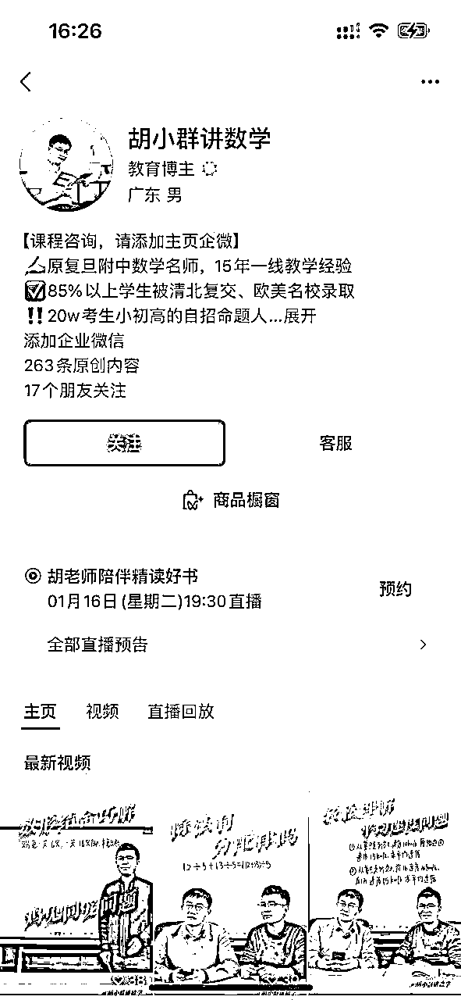
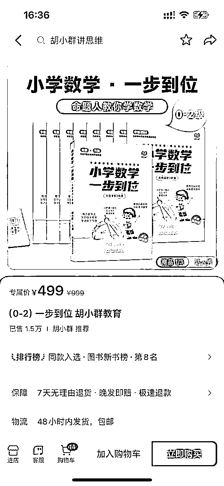
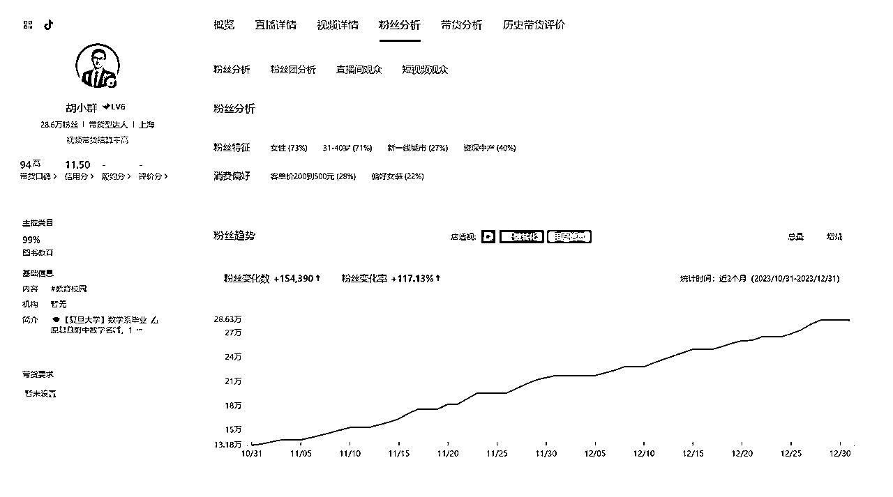
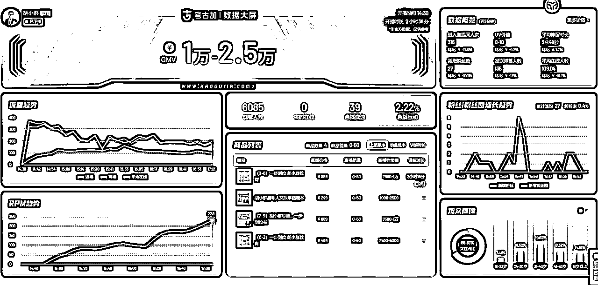

# 风向标拆解第2期--K12升学规划之【数学思维课】--北辰

> 来源：[https://p15jpqstgg.feishu.cn/docx/Qn8pdU6z3ovsOpxapOHcZdaFnkh](https://p15jpqstgg.feishu.cn/docx/Qn8pdU6z3ovsOpxapOHcZdaFnkh)

# K12升学规划分类

K12升学规划有很多，本地转学、本地解读、小升初、初升高、高考志愿、专项提升（数学、作文、英语）等等。

今天拆解的是其中一个非常细的领域，小初阶段的数学思维提升。

# 前言

这个账号是和北辰一位好朋友（学霸妈妈）沟通知道的。

她一直非常重视孩子教育，购买了不少思维课以及家长认知课程。

然后在视频号刷到（付费投流）这个账号内容，看了几场（勘误，10多分钟）直播后，被课程所吸引而购买，花费499￥购买了L0-2的课程。

# 拆解目标账号

胡小群讲数学【视频号ID】

胡小群【抖音ID】

## 拆解原因及理由

*   朋友观看 10分钟 直播即下单购买，并对课程赞不绝口

*   单场直播GMV 50W+

*   累计销售破 5000W+（后续详细计算有4000W+）

# 账号基本信息

## IP背景

## 主要目标人群

以一二线城市31~40岁的中产、精致妈妈为主要目标用户群

## GMV

月GMV：1000W~2500W

近三月GMV：2500W~5000W

单场直播GMV（均值）：50W（主要是早8点这场）

## 粉丝画像

性别：72%女性

年龄：70% 31~40岁

消费人群：40%中产 22%精致妈妈

地域分布：新一线、一二线城市为主

## 商品构成

主力产品：小学低年级、小学中高年级、初中的【数学思维】课程

客单价：中位数899￥

产品特点

自研

无试听课

不保证分数

录播课+企业微信答疑

# 项目拆解

## 流量运营

该账号以直播带货为主，销售占比94%+，故主要分析直播运营情况。

近三个月直播间付费投流比例约83%（数据来源：考古加）

视频号加热和抖音随心推的数据

视频号：每投入100￥预计带来100~300人

抖音：每投入100￥预计带来685~1714￥的销售额

近30天观看GPM：4600~4800（来源：抖查查）

结合考古加平台的数据，最近一个月投流占比90%+，能够看出，整体投流效果应该非常不错。

每天直播时间段：

*   8：00~10：30（有时候会直播到13：30）

*   14：30~16：30

*   19：30~21：00

直播达人：

*   早晨的直播——胡老师本人

*   下午的直播——机构老师

*   晚上的直播——机构老师

（通过最近几天观察早晨、下午、晚上三个不同时间段的直播发现，早晨可能是投流来的新流量、成交金额非常高，下午和晚上则是自然流，场观和销量都比较低。详情见资料收集-直播大屏数据）

直播内容：

*   针对不同年级的产品做讲解，着重讲【数学思维】

*   会与机构其它老师互动讲解，通过一些例题来讲解【数学思维】

*   会根据直播间观众互动反馈，调整讲解的产品内容

## 产品研发

主打产品：

自研的数学思维课（星际光年MCN）

L0~2：针对幼小、小学一二年级的数学思维课

L3~6：针对小学三到六年级的数学思维课

L7~9：针对初中的数学思维课

## 利润核算

【销售额】

截止时间2024.01.03 11：00

三个平台的销售额超4000W

【成本】

课程研发：录播课，一次录制，无限分发，后期的边际成本几乎为0

课程直播：目前主要有胡老师、47老师和董老师三位主播

运营设备成本：

运营人员成本：场控、投手、摄影、视频剪辑、助理、店铺运营等

助教人员成本：通过企业微信做教学服务

MCN分成：账号本身没有进行MCN认证，但课程挂靠在星际光年优选课，具体分成合作不详，有了解圈友的可以说说~

付费投流成本：上午一场直播15W~20W场观，90%来自付费投流。抖音随心推100￥预计带来900~2700人，随心推按ROI投放，ROI在6.8~17之间。计算下来，单场投放金额在5位数，考虑到还有视频号、百度视频等其他平台，金额会翻倍。

综上，设备及课程研发是初期的投入成本，人员成本是每月固定支出，MCN分成、讲师分成是运营固定比例支出，进入成熟运营阶段最大的是付费投流成本。

## 项目放大

项目放大可从5个方面着手，分别是：

*   丰富产品线

*   提高客单价

*   多平台分发

*   培养主播、提升承接、加大投流

*   私域推广更多产品

【丰富产品线】

目前有小初阶段的内容，后续可以增加高中数学部分的内容。

这部分内容，胡老师在直播中也有提及，因为确实有家长问。

现在售出几万单，随着学生的成长，后续产品可以跟上。

胡老师精通数学，相对应的，语文、英语也可以安排其他老师来讲。

【提高客单价】

目前主要是499￥和899￥的录播课为主。

后续可以推出类似小升初、初升高的集训课程，提高客单价。

【多平台分发】

由一个平台，到多个平台。

目前看到抖音、视频号和百度视频三个平台，未来可以分发到快手、B站、小红书、有道精品课等等。

（在我写到这里的时候，专门去各个平台看了下，是我自己草率了。人家运营团队已经入驻了。快手、小红书、B站都有同步直播，不过都属于起步阶段，快手几百单、小红书1000多单、B站几十单，还好不影响前面的数据。）

【培养主播、提升承接、加大投流】

目前观察下来早中晚三场直播，只有上午的进行了投流，下午和晚上的两场都是自然流。

上午一场是胡老师本人，下午和晚上是团队其它老师。

估计应该是承接问题。因为毕竟账号课程都是【胡老师】的IP，其它老师讲，胡老师本人未露面的话，成交估计不行。

能想到的是培养其它主播的承接能力，胡老师适当出镜，加大投流。

【私域推广更多产品】

有助教老师通过企业微信添加了学员微信。

后续可以通过企业微信私域，推广更多产品及课程，诸如学习机、写作课、英语课程、升学规划等等。

# 资料收集

## 直播大屏数据

抖音【胡小群】1月3日早中晚三场直播大屏数据

参考资料：

生财精华帖

项目拆解需求

## 其它参考账号

汉斯老师升学课堂

白老师西安升学规划

尧尧老师—升学同盟创始人

秦问老薛

朱韬讲数学

辉宇校长讲升学

尧尧老师讲学业规划

锐哥团队王老师

郑老师聊升学

冷叔说升学规划

爱豆讲升学规划

窦主任选科新思维

版权说明：北辰发布于生财有术，转载引用请备注“北辰@生财有术”。

PS：因个人能力有限，文中如有不足之处，请各位积极批评斧正。