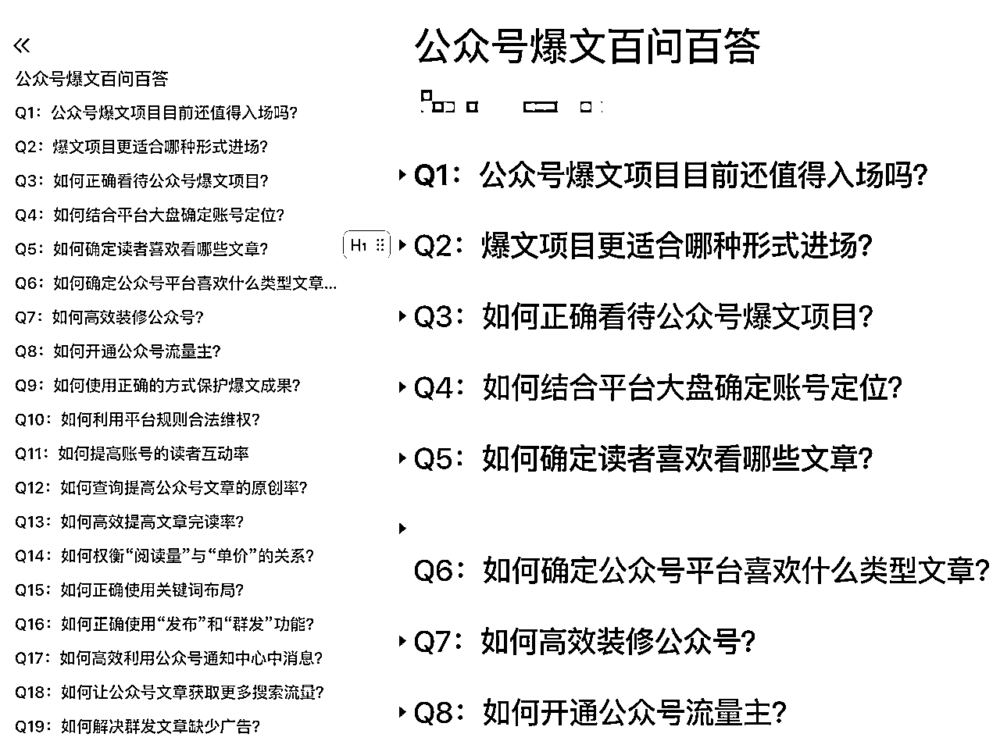

# 

> 来源：[https://txt6wm3b04b.feishu.cn/docx/QuYXdVHF1oFQbmxlDuNcyQran4M](https://txt6wm3b04b.feishu.cn/docx/QuYXdVHF1oFQbmxlDuNcyQran4M)

## 1、我是越越

这是我的收益情况之一：

## 2、我做爆文的心理历程

我的心态变化是：迷茫——崩溃——探索——开窍——创新

*   迷茫：我对项目一无所知。

我遇到过的卡点有很多，不知道大家有没有和我相似的经历：

1.  账号流量忽高忽低，就好比昨天起飞，今天就暴跌。

1.  账号因为流量大同行举报删文，还时刻担心收益被扣除。

1.  账号私信出现大量投诉、辱骂等信息，心态崩溃。

1.  对标账号选择不合适，质量不好。

。。。。。。

一开始遇到这些问题的时候我真得不知道该如何处理？

*   崩溃：事与愿违，心态崩溃。

负面情况整个人的心态濒临崩溃，试图否定自己所做的努力。

我反问自己：我真的适合做爆文项目吗？我为什么会经常担心这担心那？

我想过放弃，是因为这个项目没有及时给我带来所谓的“正反馈”吗？

为什么会崩溃？想想自己在这一段时间都干了什么！

我这段时间就干了两件事：

1.  找对标，抄对标。看到10W+就上，抄标题、抄素材！不加思考！

1.  纯用Ai创作，浪费时间。全依靠Ai创作，大多数时间都花在了指令调教上，效果并不理想。

这两件事相比大家也在经历或者已经经历过。花了时间，期望中的“一夜暴富”没能出现，最后身心崩溃，导致账号停更。这是十分难受的事，但是冷静下来想想看，基本逻辑没错，是我哪里做得不对吗？就有了接下的“探索”阶段。

*   探索：积极探索任何一个变化背后的原因。

事出有异必有因，怀着一查到底的心态，积极和教练沟通问题出现的原因。

1.  为什么会出现这种现象？

1.  这种现象是必然还是偶发？

1.  我如何避免这种现象又或者如何利用这种现象？

我坚信自己能够把项目做好，做好项目的前提是：降低预期、稳住心态、解决问题、整理经验。

针对以上三点问题我开始查找相关数据和案例，我发现大家在群里提出的问题同样也是我的问题，不要小瞧任何一个不起眼的问题，可能自己也会遇到。我觉得很重要，我就会把这些问题进行分类整理成文章 供自己学习。

总结出以下大家可以复制借鉴的经验：

1.  每天整理航海群里船员提出的问题，哪怕是自己已经解决的问题。

1.  针对这些问题对照自己的实际情况进行调整或者预防。

1.  结合平台规范进行进行延展学习。

我在某一天整理了10个相关的问题，其中有4个问题我自己没遇到过，那么我就会在笔记本上单独记录这4个问题的起因与发生症候以及可能产生的后果，总结大家的处理方法。当如果有一天出现了症候我就可以进行针对预防处理。

*   开窍：任何技术都不要与平台进行对抗，而是顺应平台。

我开始改变自己的胡思乱想的心理，认真理性分析问题出现的根本原因。

我发现：要想赚平台的收益，就必须遵守平台的规则，满足平台、读者、用户的实际需求。

了解平台的调性和规则，利用这些规则让我在爆文项目上有进一步提升，取得了第一桶金。

收益不稳定导致心态不稳定，最根本上的原因就是对平台的不了解、不熟悉。

为什么会出现这种情况？原因有以下几点：

1.  急于直接上手做项目。连基本的平台规则都不熟悉就直接做，动不动就违规。

1.  很多新手不重视平台规则。大多数人认为平台规则都是文邹邹的内容，没兴趣去阅读。

1.  人云亦云、盲目跟风。虽然说别人的经验可以参考，要学会甄别经验的优劣，少数被验证的经验不代表可靠。

1.  不明白自己做爆文的定位。自己做爆文适合做长期（精品）还是短期（批量）都不知道，摇摆不定！

我开始去钻研平台规则，甚至把Ai工具当作辅助工具，它不再是我创作文章的主力。

所以我的想法是：

1.  我的目标是长期（精品）路线

1.  我的定位是长期稳定可见收益

1.  我的资源是自己整理的经验合集+精品素材库+官方创作指引

1.  我的发力点是Ai+手搓（融入人的情绪）

1.  我的困难是如何打造与其他人形成差异化和护城河

1.  我的原则是不跟风、不盲目、保持自己的节奏

*   创新：学会“剑走偏锋”，与众不同。

爆文项目目前处于风口，有大量新手涌入，同时也有大量人退场。

赚快钱也好、布长线也罢，终究离不开爆文项目的基本逻辑指导，掌握项目的基本逻辑是最低要求。

先跑通基本环节，再复制放大，打造个人特色的爆文成绩。

很多人说先复制，再跑通，再创新。我很认可这句话，正因为有这句话的加持，才有了我当初的想法：

1.  别人写过的素材我不碰

1.  别人写过的标题我不抄

1.  别人用过的方法我不用

这三个原则统一指向“打造差异化，不跟大众抢流量！”。

形成这种观念的缘由是太多人一窝蜂涌向某个热点事件，人家吃肉我喝汤，拼得是手速！

收获正反馈后我的心态逐渐稳定，大多数问题都能够迎刃而解。我能预见问题产生的原因、可能造成的后果，在适当的时候介入控制后果影响范围。所以我告诉自己不必过于焦虑，因为我清楚能产生多大后果。

“抓住情绪”是我写爆文必须要考虑的点，同时也是充分利用人性进行思考的法宝。

1.  平台、读者、用户三个角色都有情绪。就像哄小媳妇一样，哄开心了，满足了他们的情绪，钱自然就有。

1.  人性不断变化，情绪可以被控制。结合指定人群，提前设置某一事件可能导致的情绪，并提前去布局。

1.  情绪通过文字、图片等内容被传递。文字图片等媒介可以传递情绪，读者有情绪里就会点击标题进行阅读。

所以接下来的文章我便会通过“情绪”来进一步阐述我自己的经验。

## 3、写这篇文章的意义

我从一无所知的小白到初有成就的入门者，同样经历了许多大大小小的坑。

平台机制变化，不得不让我整理自己在爆文项目中的避坑经验供大家学习参考。

最近在航海答疑群中船员问的最多的几个问题就是：

1.  如何选择对标账户（对标文章）？

1.  如何避免被举报违规？

1.  如何避免文章被对标（被洗稿｜被抄袭｜被搬运）？

我从航海教练的角度来看这几个问题很基础，但是却又十分典型，因为涉及的范围很广，无法用一言两语讲清楚。

但是其中有个共同点就是“不熟悉平台规范、不了解人性”，我之所以这样表述可能会伤害到一些人，但我不得不说。

*   不熟悉平台规范

1.  你清楚违规文章是有什么特征？

1.  你清楚哪些文章是平台喜欢推荐的文章？

1.  你清楚举报投诉的具体流程吗？

*   不了解人性

1.  你清楚读者、用户、平台都喜欢什么样的文章？

1.  你清楚为什么其他人会来洗稿、抄袭、搬运？

1.  你清楚为什么人家要来投诉举报你？

以上这些问题，我时常反问我自己！究其根本就是自己心态不稳，没有静下心研究背后的逻辑。

## 4、阅读本篇文章建议

*   静下心阅读

这篇文章篇幅比较长，因为里面包含部分爆文底层逻辑，思路是一环紧接着一环。

您可以选择安静得坐在电脑前观看这篇文章，做作笔记。

*   暂时抛弃以前的知识

这篇文章的读者定位为“从未参与爆文项目的新人”。

这篇文章是从“新人”的角度阐述我自己的实践经验。

所以希望有一定基础的同仁暂时抛弃已有的知识阅读这篇文章。

*   可以通过标签选择性阅读

如果对底层概念的论述不感兴趣，我更建议您通过标签跳跃的方式阅读，节省您宝贵的时间。

*   需要多实践经验

本篇文章是基于我自己实践经验总结之上，由于个体差异无法做到一比一复制，但是我相信只要多实践，总能够找到适合自己的方法论。

# 二、寻找合适的对标

本文中可能提及的部分名词特殊说明：

读者：公众号文章的阅读者（粉丝）

用户：公众号的运营管理（管理员、内容创作者）

平台：公众号平台（腾讯全平台）

定位：账号（文章）中大多数素材内容所涉及的领域。

## 1、对标定义

对标是指：比（文章比对）学（标杆学习）赶（寻找差距、追赶目标）帮（对标伙伴）抄（超越）

应用到爆文项目中的意思就是：选取优秀的模范账号（文章）进行对比寻找差距，从而根据差距进行学习超越。

对标账号：用于被用于对比学习的优秀公众号账户，这些账户通常是有符合规范、符合定位、符合平台发展的特点。

对标文章：指用于对比学习的优秀公众号文章，这些文章通常有互动数据高、标题出色、内容出彩的特点。

## 2、对标意义

对标可以理解为“师傅带徒弟”，由资深的师傅带领我们进行学习，徒弟在学习过程中融会贯通、创新实践，最后练就一技之长。

1.  “对标”帮助新手快速入门，降低测试成本。

*   借鉴该领域的账号装修

优质的账号装修对提升新号权重、粉丝粘度有正面、积极的作用，用户可以1：1模仿账号装修风格

*   借鉴该领域的发文规律

优质的对标账号发文时间、发文规律是经过市场筛选，用户认可，像素级模仿对照有助于新手掌握发文规律。

*   借鉴该领域的文章、标题特点

拆解对标文章风格、文章模板、标题风格，结合数据情况进行分析，可以直接将现有的模板应用于新号起号。

*   借鉴该领域的粉丝画像

通过第三方的数据平台展现对标账号对应的粉丝画像，新手可以根据对标的粉丝画像进行针对性创作。

*   借鉴该领域的互动设置

借鉴对标账户的互动数据（点赞量、转发量、在看量、划线量、在听量、关注量）可以预测该领域的互动数据，模仿对标的互动引导设置可以提高互动率，减少新手的测试成本。

1.  “对标”帮助新手解决基本问题

*   赞赏是否需要开通？

*   文字排版怎样设置？

*   广告插入位置如何设置？

。。。。。。

1.  “对标”提供新手创作素材

虽然“对标”对于新手意义很大，但是如果没有使用正确方式方法容易陷入“巨坑”之中。

## 3、我们需要思考的问题？

“对标”就是简单的抄袭、洗稿？

目前绝大数人的思想还是停留在单纯使用Ai工具对文章进行改写，一味降低文章的相似度，提高原创度。

但是事实上经常会被投诉为“滥用原创”的违规事项，严重点可能会被判定 为抄袭、洗稿。

“对标”的实际的作用是对比、拆解、模仿、超越。

需要在前人的基础上进行创新，而不是一股脑的模仿。

只得“型”而缺“神”。

“对标”就是找阅读量高的文章吗？

很多新手在寻找对标的时候总是第一时间在搜一搜中寻找该关键词搜索下阅读量最高的文章进行对标。

不选取阅读量高的文章进行对标有以下几点原因：

1.  阅读量高的文章可能是存在数据偶然误差，需要结合其他互动数据进行分析。

1.  阅读量高的文章基本会被他人对标。

1.  阅读量高的文章被投诉删文的风险也高。

“寻找对标”就是盲目跟风、举棋不定、自乱阵脚？

很多新手在寻找对标的时候狂追热点、举棋不定，看看人家什么素材火热就去追，放弃手头现有的账号。

1.  盲目跟风，导致账号半途而废。

1.  举棋不定，没有明确、固定、垂直的定位。

1.  自乱阵脚，一定周期内没有得到期望中的收益便随意更新。

## 4、确定对标需要考虑的3大因素

#### 1.清楚利益相关方需求

在爆文项目中作者、读者、平台三者组成了“互利共赢”的三角格局。

*   作者——通过选择分发文章，消化平台广告投放需求而获取收益。

*   读者——通过阅读文章而感知社会发展变化，满足情绪价值。

*   平台——通过展示文章中的广告，以消化广告商的广告投放，从而获取广告费用。

因此，爆文项目在前期入手之时就需要认清用户、读者、平台三者的实际需求点，才能做到效率、收益最大化。

##### 用户需求

用户通过展示文章中的广告贴片而获取收益，可知提升阅读量和广告单价是用户最重要的需求：

用户实际需求=广告收益+情绪满足=阅读量*广告单价

因此需要重点考虑提升以下几点数据：

1.  阅读量：读者点击文章进行阅读。

1.  广告单价：每千次广告曝光所得的价格。

1.  综合完读率：用户在文章100%位置中跳出的人数与总阅读人数的比例。

完读率越高，对应的广告单价越高。

而影响完读率的因素有很多。根据我的经验，以下几点措施可以提升完读率：

1.  增加文首、文末互动引导，指的是点赞、转发、在看等引导。

1.  增加标题与正文内容的相关性，而不是单纯使用震撼的标题忽悠读者点击阅读。

1.  增加文章的段落分割数。多用短句、口语化的语言，避免使用文邹邹的字词。

1.  突出文章重点，使用异色的字体标注段落重点。

以上4点措施都是从解决读者的情绪需求出发，只要满足了读者的情绪需求，就可以自然让读者顺利阅读。

##### 读者需求

读者阅读系统通过多渠道推荐的文章，而这些文章能够向读者传递外界信息。

读者实际需求=获取信息+满足情绪+传递情绪

我在写文章的时候我会思考读者凭什么阅读你这篇文章？他阅读这篇文章他能得到什么？

1.  获取信息：读者可以通过阅读这篇文章获取到一些新鲜、有趣、实用的信息。

1.  满足情绪：读者通过文章中的措辞感受到情绪的变化，比如产生情绪共鸣、满足好奇心等。

1.  传递情绪：读者通过点击互动组件（点赞、分享、在看、星标等）进行文章传递，读者认可这篇文章并愿意把这篇文章传递给他人阅读，从而产生满足感。

以上三点重点均是满足“读者情绪”，因此读者的真正的需求关键词就是“满足情绪”，我们需要思考：

1.  读者分别在什么时候需要什么样的情绪呢？

1.  读者什么情况下才会主动去传递他的情绪呢？

1.  读者需要获取什么样的信息呢？

解决了以上三个问题就差不多知道一篇读者爱看的文章是怎样的。

##### 平台需求

平台希望通过向读者展示广告贴片，消化广告商的广告投放，从而获取广告收入。

平台实际需求=读者阅读广告、点击广告、购买产品所产生的效益+合规运营+优质、原创文章

平台需要消化广告提供商的广告资源，需要对目标群体展现相应广告，因此以下几点对于平台而言最为需要。

1.  阅读广告：读者在阅读文章同时系统会随着阅读进度展现相应广告，一般底部广告收益比文中广告收益要高。

1.  点击广告：读者在阅读广告的同时点击广告贴片，产生“点击收益”。

1.  购买产品：读者在阅读广告后产生购买欲望，平台从而获取产品佣金。

因此，以上三点的核心关键词就是吸引读者进入文章持续阅读，而读者能够持续阅读的关键就是“满足读者情绪”。

所以我们在寻找对标的时候要特别注意用户、读者、平台三者的情绪价值满足。

一篇好的文章就应该能够兼顾三者的利益需求

满足平台运营规范尤为重要，也是最低底线。同样我们也可以将“合规经营”看成是平台最看重的一部分。

#### 2.清楚好文章的特点

##### 读者喜欢阅读的好文章具备的5个特点

###### 对立观点

人是有“反骨”和“趋同”观念的高级动物，被大多数人认可的东西往往会成为默认“答案”，突然有人跳出来反对这种“答案”，那么人们就会一起去抨击他。这就是激发读者的情绪！

“正面观点”看多了，偶尔看见“反面”观点也是一种增加阅读量的方法。

符合社会主义核心价值观的前提下：与绝大数人观点形成对立的观点往往会受读者关注。

就像 “大多数人”还在书写“许家印恶行”的时候，如果你独树一帜书写“许家印的好”。

那么就会激发读者的“愤怒”情绪！读者更愿意点击文章进行阅读。

所谓的“对立观点”不是指相互引战而获得情绪满足，而是基于“有理有据”的前提下合理表达自己的观点。

对立观点有以下2个特点，提供大家参考：

1.  符合社会主义核心价值观和平台规范。

1.  从大家普遍默认的观点对立面出发，激发读者“反抗情绪”。

我们为什么要设置“对立观点”？“对立观点”的好处有以下几点：

1.  提高读者的反抗情绪：读者通过点击文章发泄反抗情绪。

1.  提高文章的互动数据：读者有了反抗情绪后会进行留言或者私信，甚至转发等操作。

1.  提高文章在数据库中的差异化：大多数对立观点是同行人不敢写，因为数据飙升快、易被举报。

###### 情感共鸣

当读者在情感上遇到一些挫折时，如果你能和他们站在同一角度面对现实，那么用户更愿意关注你、阅读你的文章。

站在读者的角度看待问题，收获读者的同情心。

大多数读者是感性的人，他们往往会同情一些情况相似的同伴。

“情感共鸣”可以体现在文字、图片，甚至在互动引导中体现。具体看下面阐述的特点：

1.  情感共鸣多用“！、？”标点，也就是多用设问句、反问句。

1.  情感共鸣需要多站在读者的立场分析事件的始末。

1.  情感共鸣需要多使用“情绪表达”的词语，例如“你怎么想？你怎么看？我也觉得。。。。”

以上说的特点有点笼统，那我就拿最近比较火热的朱令事件进行情感共鸣分析。

###### 观点独特

从独特的视角去书写观点，可以破除用户的“阅读疲劳”和“信息茧房”，满足读者的信息传递、情绪需求。

以“异类”的观点描述某件事，可以激发读者的好奇心和探索欲

奇葩的观点能够满足读者对信息获取的欲望，“从未出现过的观点”能够吸引读者毫不犹豫点击文章阅读。

为什么要使用独特视角的观点进行构思文章？有以下几点原因：

1.  满足读者的信息传递需求：获取新知是读者最爱的东西，满足这点需求可以提高文章质量。

1.  满足读者的获取新知的“自豪”情绪：读者一旦获取到所谓的新知，多半会产生自豪感，触发文章互动机制。

1.  满足平台扩充差异化、优质、原创文章的需求：普遍来看差异化、优质、原创文章是平台目前最需要的。

举例说明：

“许家印喜欢屁股”——该热点事件讲述的是许家印与歌舞团的故事。

“许家印”+“屁股”这种独特的角度之前鲜有人书写，因此这个观点的文章阅读量破200w。

因为我们服务的对象是读者和平台，因此优先满足他两的情绪需求是重要的事，我们可以从以下几点看看一篇文章的观点构成：

1.  有些观点代表大众的普遍观点。

1.  有些观点表达个别学者的独特观点。

1.  有些观点属于从未出现过的观点

我个人的实践经验表明1、2、3点混合使用效果更佳，因为可以更好避免同行的对标抄袭，同时也会提升读者对文章的互动程度。

###### 素材新颖

读者抱着吃瓜的心态，更喜欢看新鲜、有趣、热议的话题素材，其实这是满足了读者的情绪价值。

除了当前及时的热点话题以外，还有当前热度较低但历史上热度较高的素材也受读者追捧。

比如可以使用N年前的爆文素材，当大多人的注意力集中在当前热点中时，N年前的素材在当下注定是新鲜的。

使用多年前的旧素材或者别人不敢写的素材，不要总是写别人洗烂的10w+文章！

把握好人性是提高文章阅读量的关键，因此我从人性的角度出发说说为什么素材最受读者欢迎？

1.  人是感性的动物，喜欢家长里短：“家长里短”反映了人生百态，最能满足读者情绪的素材。

1.  人是知憎恨的动物，喜欢匡扶正义：对一些不道德的人或者事件会进行谴责。

1.  人是会同情、会怜悯的动物：也就是对某些人或者事件产生怜悯之心。

1.  人是被好奇心驱使的动物：新鲜少见的新闻人们往往最感兴趣。

在以上人性的分析中，我们可以通过以下几个途径去发现符合条件的新颖素材：

1.  第一时间生产的新闻热点

1.  排名高的素材结合排名低的素材

1.  长时间以前的热点素材

1.  大V发布的热点素材

除了以上方法还有好多，可以和我继续商讨。

###### 排版美观

爆文，看上去不像爆文。

这句话是我对“排版美观”的要求，也是读者的偏好。

读者的胃口是挑剔的，读者更加喜欢阅读起来身心愉悦的文章。

美观的排版正是提高文章完读率、提升粉丝粘性的一把利器。

一目了然、突出重点、明确观点的文章，读者当然喜欢看！

善用短句、段落合理、重点明确、思路清晰以及结合适当的字体调整的文章更能满足读者的阅读舒适性。从读者角度出发设计模板，用心编写的文章更受读者青睐！

1.  善用短句：单句使用20字以内的表达更容易让读者减少阅读疲劳和理解难度。

1.  段落合理：每段的句数不超过6句，可以减少文章的段落数。

1.  重点明确：使用划线功能、字体加粗标注重点，简单明了。

1.  思路清晰：文章框架清晰，前因后果清晰罗列。

除了文字部分，美观还包括图片美观、插件美观等，重点说说图片美观的应该具备的特点：

1.  图片清晰：不建议采用分辨率较低的图片。

1.  图片无明显侵权特征：无明显明星人物、商品Logo等可能导致侵权的元素出现。

1.  图文相符：图片与文字部分要有对照，而不是毫无相关。

1.  图片带有深韵：图片中表达的内容最好能够引发读者深思和联想。

总之，我们需要站在读者的角度看文章。

##### 平台喜欢推荐的文章具备的4个特点

目前在爆文项目中大家都陷入一个大误区，那就是“通过各种手段”进行原创创作，从而变成自己的东西。

我不赞成、也不反对这类行为，因为大家都在赚平台的钱。

怎样更好的利用这类手段实现长期收益？结合平台规范，我谈谈我自己的经验：

1.  借鉴别人优秀文章的基础上融入自己的思考。

1.  从别人千字长文中提炼出百字核心内容。

1.  结合多篇文章的观点进行深度生产。

这一做法的好处就是“正反馈”来的及时，可以规避自身写作能力不足的劣势。

在别人基础上进行深入融合自己的思想能够创作出让平台、读者满意的文章。

###### 清新美观排版

爆文，看上去不像爆文。提供给用户好的阅读体验精美的设计和排版的内容。

平台明确规定了优秀的文章排版将会更加倾向推流，具体可见以上有关排版的要求。

举例说明：

（未完待续）

###### 优质内容

使读者在轻松阅读中收获知识或思考的具有启发性、教育性或者娱乐性质的内容。

通常是包含传递知识为目的、分享经验为目的、展示个人观点为目的内容创作。

1.  传递知识：符合规范下传递某些领域的专业知识，例医护养生、商业金融、读书认知等高价值、正能量的文章。

1.  分享经验：符合规范的前提下分享实操经验、避坑指南等真诚、利他的经验。

1.  展示个人观点：平台鼓励分享有见地、有深度的个人观点，从热点事件进行深入分析且是友好的交流。

举例说明（未完待续）

###### 真实有效

金融、教育、医疗卫生、司法等专业人士发布的权威真实信息和专业知识。

注意以上几个行业账号需要进行资质认证，没有资质的新人切勿长期触碰。

针对爆文项目需要避坑的几大细分领域如下：

1.  金融领域：证券、黄金、期货、P2P、贷款等。

1.  教育领域：K12、学科教育、未成年人教育等。

1.  医疗卫生领域：医疗器械、中药养生等。

1.  司法领域：社会影响力大的未结案案件分析、涉及敏感人物的案件分析等。

真实有效的热点素材对爆文项目及其有利，可以帮助我们快速起号，但同时也可能产生一些不良反应。

1.  对标文章中的热点素材与实际存在偏差。

1.  对标文章中的热点素材已经失去时效性。

1.  对标文章中的热点素材已经同质化严重。

在解决问题之前我们必须端正好自己进入爆文项目目的，做长线发展还是短线收益？

##### 用户编写的文章应该具备的6个特点

###### 简单易懂

在爆文项目中文章主打简单易懂、清新明了，而不是各种炫技表演。

明确爆文就是爆文，不需要融合过多其他元素。

避免IP文与爆文共用账号、避免出现额外的广告营销、避免出现引流信息。

###### 热门素材

使用素材库筛选合适的热门素材，特别需要注意以下两点：

1.  阅读量高的素材，不一定质量好

1.  阅读量不高的素材，不一定质量不好

因此我们选择素材的时候需要用读者的角度去选择，例如以下方法：

1.  看标题是否有点击的欲望，单纯的标题可以进行收藏，摒弃劣质的正文。

1.  看文章内容是否能够满足读者需求。如果能够激发读者情绪波动，则可作为素材备用。

1.  看文章的互动数据。优先考虑互动数据优秀的文章。如果单纯是阅读量高、互动数据差不推荐。

###### 真实可靠

新闻类观点文章务必做到事实可靠、数据真实。

虚拟故事类文章务必符合社会主义核心价值观要求，内容积极、向上、充满正能量。

专业性文章务必有依有据、有据可查。

以上要求是避免文章（账号）被同行投诉举报，可能涉及的违规点为：

*   违反国家法律法规禁止的内容

*   不实信息类内容

*   煽动、夸大、误导类内容

###### 标题劲爆

优质的标题能够促进读者点击阅读，因此我们需要知道优质标题的结构。

好标题是能够满足读者需求，因此衡量标题的好坏有以下判定规则：

1.  标题带有情绪。其实就是满足读者的情绪需求，根据目标粉丝的需求进行设置。

1.  标题带有神秘感。为了满足读者对信息摄取的需求，充满神秘感的信息是首选。

1.  标题符合平台规范。符合平台规范是首要前提，尤其是相关事实类文章。

1.  标题使用数字形成强烈对比。通过数字放大对比效果，形成强烈的落差感。

1.  标题包含情绪标点符号。“！、？”等标点是情绪标点，通过使用设问、反问、陈述等方式。

可参考以下标题（对应文章的阅读量均为10W+）：

1.  贪官，为什么越来越多？

特点：对象明确（贪官）+激发读者愤怒情绪（贪官多）+反问形式（?）

1.  同志，你相信共产主义吗？

特点：对象明确（同志）+带有神秘感（共产主义）+满足读者好奇情绪（相信）+设问形式（?）

1.  震惊！许家印交代被抓是因为犯了权贵大忌！卸磨杀驴这招玩得好

特点：拉升读者情绪（震惊！）+热点事件（许家印事件）+满足读者好奇情绪（因为......）+陈述形式（!）

通过实践可知，优秀的文章标题都带有“情绪成分”，多种形式相互转换效果更佳。

###### 合规性强

技术不要与平台对抗！因此我们在满足读者需求的同时也需要兼顾满足平台的需求。撰写符合规范的文章能够让我们避免不必要的被投诉举报，撰写合规性强的文章应该注意以下几点（详见后文中关于使用平台规则进行反对标相关内容）：

1.  多翻阅平台规范相关文章

1.  反复阅读文章剔除、调整某些关键词

1.  仔细核实事件真实性，尤其是相关数据

1.  慎重筛选文中图片

###### 同质化低

一篇文章如果在互联网上首次出现且符合规范要求，那么这篇文章即有可能会被平台大力推广。

避免同质化有如下几点：

1.  标题新颖。无法在互联网中搜索到两个或者多个相似标题。

1.  内容观点独特。既能激发用户情绪，又能维护素材唯一性。

1.  避免随意确定对标。确定对标就要分析该对标的前世今生。

1.  避免暴露文章（账号）。运营过程中需要保护好相关信息，避免被同行对标。