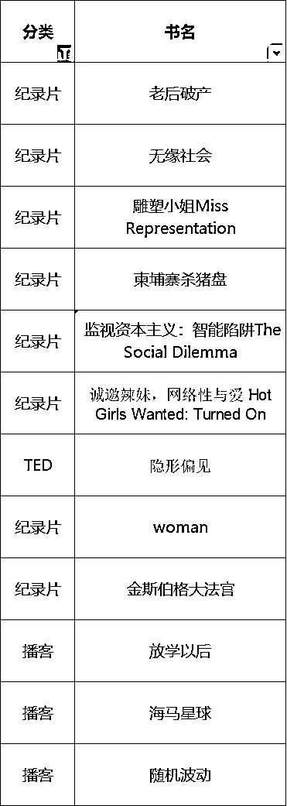
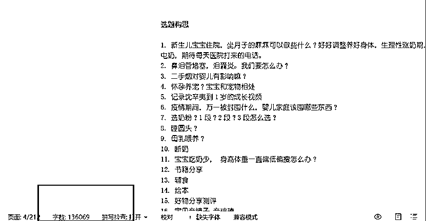
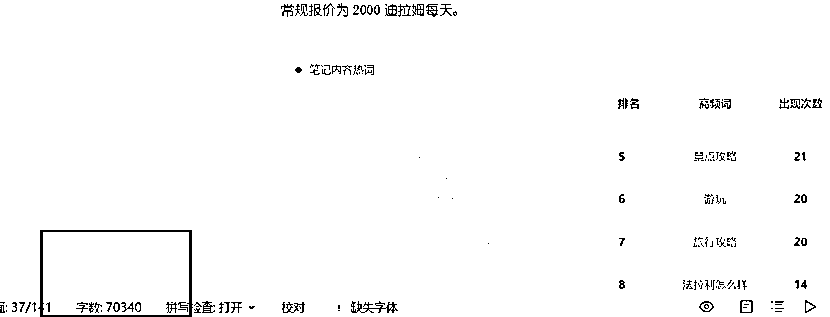
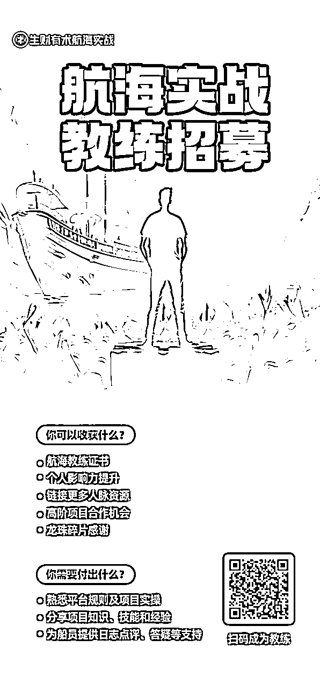

# 普通女生开窍后，3个月赚了10+个W

> 来源：[https://ovjdv8vh9g8.feishu.cn/docx/RkOYdqyA1oHSS1xoNtCcbumknwc](https://ovjdv8vh9g8.feishu.cn/docx/RkOYdqyA1oHSS1xoNtCcbumknwc)

2023，我对自己很满意，2024，我将继续努力

哈喽，大家好。我是擅长小红书运营的圈友better。

每年年底，我都会给自己写一份年终总结，没想到的是今年有机会发到生财上面。

很希望被正在焦虑，正在内耗，正在不相信自己，觉得自己是个普通人的女生看到。更希望我的经历，可以对你有所帮助，记住，你可以是任何人！

2023关键词：读书开窍 搞钱 小红书

# 读书，埋一颗种子等着发芽

我身体有点小毛病，不适合操劳。自从大学我知道这个毛病以后，说实话我基本就放弃了那种全力冲刺的人生了，我的很多同学都在上海杭州工作定居，我一开始就选择了安逸。工作了快10年，我只换了1份工作，现在还在我人生的第2家公司上班。普普通通的，啥都不突出！

看到同学们分享的各种大牌包包，我自嘲的觉得反正我也不需要。我只需要粗茶淡饭，当好普通人就好了，平时看看书，做做喜欢的事儿，带带娃也挺好的。今年我看了40多本书，每天早早的来到公司看2个小时书，那感觉真的真的无敌好。书主要是女性主义相关的，然后文学方面的比较多，具体见书目。

如果可以，我希望每个女生都可以读一读女性主义相关的书《厌女》，《父权制与资本主义》，《第二性》（虽然翻译的稀烂，但是可以解答很多女性整个人生中会遇到的各种问题：女人不是天生的，是被塑造的），如果一开始这些书你觉得的太难了，看不进去，我推荐从《那不勒斯》4部曲开始。

除了读书，我今年接触了少许纪录片还有播客。

播客如：《海马星球》、《after school 》、《燕外之意》、《随机波动》、《文化有限》等等，我最爱的是《海马星球》红姐的那一期《一个硬核的世界游荡者是如何养成的》天哪，那种自由洒脱的感觉要羡慕死谁，也第一次意识到，尽量少的使用各种包装袋。

纪录片如：《老后破产》、《无缘社会、《女性的贫苦》等等，这几个纪录片加上读的书《东京贫困女子图鉴》，简直就是一剂强心针打在我岁月静好的心尖尖上，现在想起来还会虎躯一震。

接着就是2024大多数人都面临的问题，裁员，失业！今年6月底左右，我们公司也开启了惨绝人寰的大裁员。一下子基本裁掉了1/2的人，而我沉迷看书，完全没有任何心理准备。已经6年了，连简历都没更新过。这个算是对我的当头棒喝，心慌呀！这这这被裁了，找不到工作可咋办？每个月房贷快1W呢？几重加压，哈哈哈哈哈，沉睡的我开窍了：我要搞钱！！！

# 搞钱：干就完了有得有失

上班快10年了，搞钱谈何容易呀？普通人，更是不知道从哪里开始？

## 瑞幸代下初尝试

我喜欢喝咖啡，每天基本1杯瑞幸。天天小程序买太贵了，那咋搞诶？

小红书搜到了瑞幸代下，原来还有这个词，偶然看到了咸鱼的页面。好家伙，原来咸鱼可以买瑞幸，一杯美式5元诶，太便宜了！！！实现了美式自由，我们公司又在互联网产业园区，应该会有不少喜欢喝咖啡的人？于是开始从公司同事开始，建群帮买咖啡。甚至连找打扫卫生的阿姨帮我发传单我都想好了，由于天天来公司很早，和阿姨们都挺熟了。我在咸鱼帮忙给同事或者进群爱喝咖啡的人下单，结果大家都太懒了，懒得自提（好，每单加1块，我喊阿姨帮忙送）。但是客单价太低，又很繁琐！不了了之啦~~

## 深耕小红书

这几年工作闲暇，我做了小红书宠物账号，后面又做了母婴账号，护肤账号。那时候就是发着玩，沉浸在收到点赞的数据里面，根本就没有什么接广告，卖货，引流意识。接到大件产品的置换就已经开心好几天了。

可能读书人都有点众人皆醉我独醒的清高，还不怎么看得上那些虚假的话：什么看完这60部纪录片，女生会脱胎换骨，只会觉得胡说八道！！！

哈哈哈哈哈，如果姐妹你要做新媒体，这感觉劝你趁早戒掉！！

（小红书笔记输出）

### 小红书小儿推拿运营顾问

我的5万粉母婴账号，无意中派上了用场。看到我女儿天天做推拿的社区医院正在拍视频说要发小红书，就关注了她们的账号，和老板微信上聊了聊。诶，他发现我账号粉丝还挺多，他们运营了几个月，还一筹莫展。被各种规范限制，内容持续违规！然后就约了喝咖啡，聊聊小红书的运营。从此，命运的齿轮开始转动，一而再再而三，

8月，我们终于正式开始合作。我的第一个正反馈，就这样开始了~~

说实话，在这个期间。我还是挺虚的，没有帮人做过账号呀！爆款内容也不能说有成熟的方法论，在7月份，机缘巧合下，我收到了生财的推送，于是加了鱼丸，然后就开始了生财有术之旅，在生财里，我看了小红书运营实战的所有航海手册，做了许多笔记，接着我看完了谢无敌老师的商家实战营课程，看了盗坤老师的小红书运营课程，还看了花爷的IP课。哈哈哈哈，边干边学真的绝绝子，之后就是参加8月的航海实战，10月的续航。越来越有底气，最终形成了自己的方法论。

小红书学习笔记

最后的效果还不错！！！小儿推拿做了6个矩阵账号，豹纹率高，引流效果也不错！对于小儿推拿赛道的豹纹怎么创作，有分享一遍压箱底的干货笔记，有兴趣可以看看：

小红书小儿推拿赛道 23篇笔记17篇爆文的经验分享

https://ovjdv8vh9g8.feishu.cn/docx/B8bdd4mIKo7mA5xDiEicyhVAnMd?from=from_copylink

### 深耕迪拜旅游

天天有关注生财风向标，在9月看到生财旅游阿渡老师的文章，结合生财风向标以及旅游类目的合集，开始了我对迪拜旅游的探索！

9月发布第一篇小红书笔记，第一天就收到私信并加了V，经过一个月的沉淀，敲定了2个定制用户，几个包车的用户。第一个月就拿到这里正反馈！！！然后第二个月，收入破2W ，第三个月收入破3W, 3个月下来，累计获得10个W 。

注意，不要觉得这很容易，啊啊啊啊啊，其实超级无敌累！！！做旅游的人，真的是个超级受气包！！！目前还是会继续深耕，已经在组建兼职团队，矩阵运营啦！

针对迪拜旅游的探索，我分享也分享了一篇实操性很强的干货笔记，有兴趣大家可以看看

小红书出境游赛道 3周从0到1销售额12万的保姆级经验

https://ovjdv8vh9g8.feishu.cn/docx/ULbAdXJWVosx2rxeiZ4c9MjNncd

加入生财的这几个月，我第一次分享了生财的笔记，还被亦仁加了精华，开心！链接了100多个生财圈友！

第一次和生财的圈友见面，和阿渡小姐姐面基了，她真的非常的优秀，哈哈哈什么都会，还长的漂亮。

还在生财重庆的聚会上，作为嘉宾分享了迪拜旅游的经验。哈哈哈哈，虽然分享状况百出，但是我已经不在是那个想要却不敢去争取等待着被发现的小妹妹了！！！

然后我参加了以前生财的教练比比的助教考试，哈哈哈哈，通过了2轮，第三轮积极争取后选择了放弃，因为当天作业时间是以牺牲陪伴孩子的代价，哈哈哈哈！

积极参加了生财航海出境游和小红书运营的教练的报名，目前结果还未知。不管是否可以入选，我都觉得我突破了！哈哈哈哈，敢于选择并追求自己想要的！！！我的内核已经不会被别人轻易动摇。

# 在搞钱的过程中，我付出了什么呢？

我的时间是这样安排的。周一到周五拼命搞钱，周六周日带娃体验生活。

基本上早上7:30到公司就开始干活，接着上班，然后下班开始搞副业。持续到晚上11点。

我同事说：XX，你没有家吗？

我领导问我：你怎么还没走？

我弟来重庆办事儿整整一周，我们连饭都没一起吃过一次。因为每天要做的事儿太多了，实在挪不开身，只是在晚上回家后，一起聊聊天。虽然内心愧疚，但来日方长。

我周一到周五和女儿明明住在一个房子里，却一周都见不到她。我回家的时候，她已经和婆婆爷爷睡着了，我走的时候，她还在睡觉。

我女儿问我：妈妈你赚完钱了么？今天要上班吗？以前她天天是跟我一起睡的，开始搞钱后，她开始和婆婆爷爷睡，现在已经不会主动和我一起睡觉了？哈哈哈哈，估计只有妈妈才会懂，以前你是女儿的唯一选择，现在变成了备选！是种什么样的体验？虽然理解她的选择，心理也难免失落啦。如果你是男生，如果你读到这里，你真的应该好好感谢你老婆，让你有这么多时间，可以安心搞事业。因为你们想要做一件事儿的时候，孩子估计从来都不会是你的选择。如果你是妈妈，希望你坚持你的选择。我们不是不爱她了，只是换了种方式爱宝宝。然后，我们不只是妈妈，我们也有想要做的事情。

所以我会在周末，抽出所有的时间，放下手机，带我们宝贝去各种体验，让她感受到她永远是妈妈的最爱，妈妈虽然上班很忙，但是妈妈很爱她。哈哈哈哈，忙碌的父母亲，记得也要分一点时间给宝贝哟！

这里最最最重要的是要谢谢我的公婆，感谢她们帮我无条件带娃，对于我如此的作息时间没有任何不满！！！谢谢！！！

以上就是我的2023，2023我对自己很满意！！！哈哈哈哈，当然跟生财的各位圈友比，不值得一提，但是我对标的是我自己呀！！！觉得自己很棒！！！

2024关键词：搞钱，读书 ，利他链接

搞钱：定个小目标，搞个50个W。深耕小红书！每月定目标，每月复盘。

读书：提升认知，享受沉浸式读书那种快乐的感觉。看12-20本书，每月1本。

旅游：带着娃去阿联酋，沙特玩1次，其他的国内游随时间安排！

利他链接：不可“闭关锁国”，自己造车把路越走越窄，要“改革开放”把路越走越宽。主动向有结果得人付费学习。

如果还可以贪心点，想好好练练口语，自己敢开车，有时间锻炼身体。

如果你看到这里，太感谢啦，我是擅长小红书起号，爆文，引流得better。欢迎链接，一起把路越走越宽呀~~