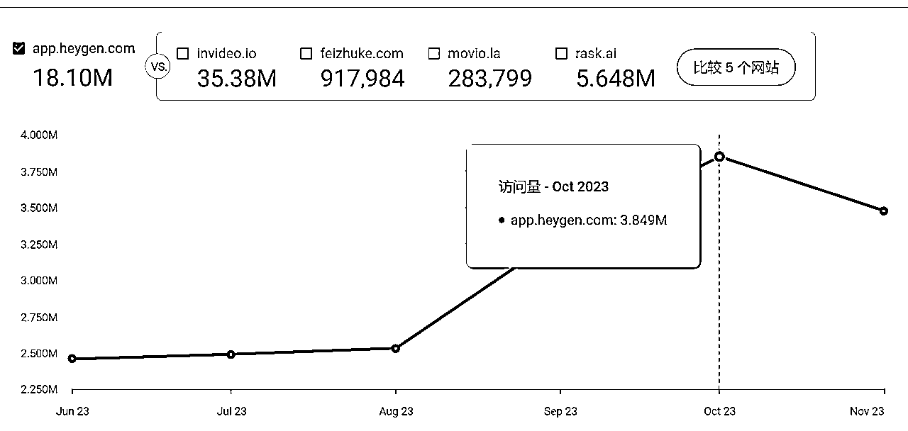
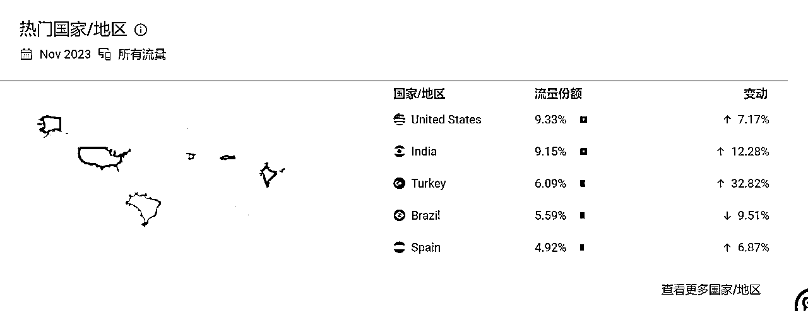

# 风向标拆解第 2 期--月入10万刀的AI工具做对了什么--小卢

> 来源：[https://el6alnvd1j.feishu.cn/docx/SOCld2l0solNJ8xICwYcJb9TnFf](https://el6alnvd1j.feishu.cn/docx/SOCld2l0solNJ8xICwYcJb9TnFf)

首先和不太了解工具站的朋友们介绍一下为什么要出海做AI工具站。

## 一、工具站介绍

#### 1）为什么要做工具站

1、做海外网站最快，比做其他形态的产品，要快出很多。国内网站需要域名备案，域名备案市场大约花1-3周，如果是在要求比较严格的城市还容易被打回。

2.国外的产品付费意识和广告收入较之国内均较好。工具站的谷歌广告收入并不是浏览量高收入就高，而是也要综合考虑不同国家单价的影响，有人曾经对比过一个工具站的每千次展示收入从高到低排序，发现每千次展示收入，德国、美国、法国、加拿大的 千次展示收入是较高的，而中国属于比较末端，这也就可以说明我们为什么要出海赚美元了。

3.上手简单，对于无代码基础的小白也能根据AI提示编写和修改代码写成合适的网站，先完成后完美，后续有流量了可以再优化网站,也可以选择和会代码的人进行合作、网站外包、寻求亲朋好友帮助等方式。

2）工具站类型

工具网站常见类型有工具站、内容站、电商站、社区站、教育站、娱乐站新闻站等。我们目前所研究的是工具站，常见的具体分类有邮件营销工具，如Mailchimp，项目管理工具，如Asana，网站分析工具，如google analytics，在线支付工具，paypal等，在线图片编辑工具，canva;在线文档协作工具，如office 365.在线客服工具，在线表单工具等等。

3）英文工具站变现方式

赚钱核心两个元素：流量和产品。

1.1卖流量

卖流量是通过提供免费工具的网站实现变现的模式，挂广告有广告曝光就能产生收益，通过有价值的免费工具获取流量，后续通过广告、导流其他产品等方式变现。

1.2卖产品

通过提供付费工具的网站实现变现的模式，比如chatgpt相关的付费工具站，通过免费试用后转为付费用户来变现。

1.3广告+付费订阅

1.4先免费后付费变现

做一个AI工具站并且赚到钱简单来说就是挖掘需求、根据需求建站、获取流量推广变现。

对于我们普通人来说，建站前挖掘细分需求最重要，建站后网站被动流量seo，其他需要我们去营销推广，和博主沟通商量进行测评。

## 二、工具站上手难点

1）前期没有细分产品思维，难以挖掘到更细分的需求；或者因为

2）后期获取流量困难，seo被动推广流量少，不知道如何优化seo；

主动推广在媒体平台上发文章，不知道什么样的内容能够吸引人；

如果要找网红推广工具站，不知道该以什么样的策略去推广。

3）如果要月入10万刀的话，后续怎么根据用户需求保持产品竞争优势。

## 三、案例

跟随当下最新元素AI进行需求挖掘，这个产品的功能是利用AI生成视频https://app.heygen.com/login?sid=no_sid，通过在youtobe分享视频以及在视频上增加水印的分享式传播使得产品顺利被好多人知道。

在AI产品愈来愈多的情况下，他依靠产品差异化+合适的增长策略使得产品突出重围。

从22年9月至23年4月7个月达到100万美元，平均每个月13.6万美元左右。首先是时机，早在chatgpt出现之前就专注于AI领域，对这个市场领域了解更深，在前面进行了产品的宣发随着gpt时间的推移，人们对AI产品需求更高。

### 1)流量

该网站近6个月1810万访问量，每个月平均3百万访问量。

访问用户地区：美国、土耳其、巴西、西班牙，大多数是有购买力的国家。

流量来源：大多数直接流量，次之是外链，同时在社交平台做广告和付费搜素占比差不多。

产品是较为知名度的，搜索品牌关键词的人较多，说明产品具有自发传播性，该视频生成有水印能让更多人了解到该产品和品牌。

外链来源。

流量来源结构

seo：直接搜索流量来源占比最多，

外链：外链链接流量次之

产品增长：免费增值+鼓励用户分享，后面实施允许用户邀请朋友获得推荐积分。再后面进行创新，在视频上增加水印，用户传播视频时能够给品牌增加新用户，形成“观看共享”网络效应，后续获得广泛关注。

后续和用户交流注重新用户的用户体验，帮助客户用户更快地获得“顿悟”时刻，成功把转化率提高一倍。

### 2)后续功能优化

1) 保持每周发布一个产品问题，跟随用户需求；

2）不过度修改产品，只在产品有问题时修复，节约时间成本；

3）不注重Ab测试，注重问题解决速度。

4）借助第三方工具快速启动项目。

四、项目如何放大？

多个网站不同领域进行布局，团队作战。