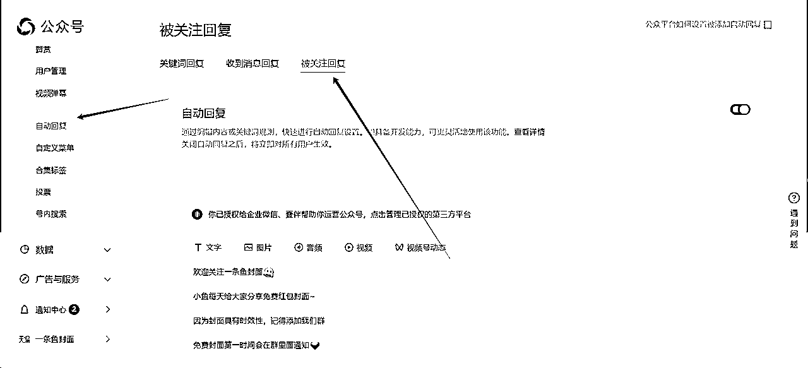
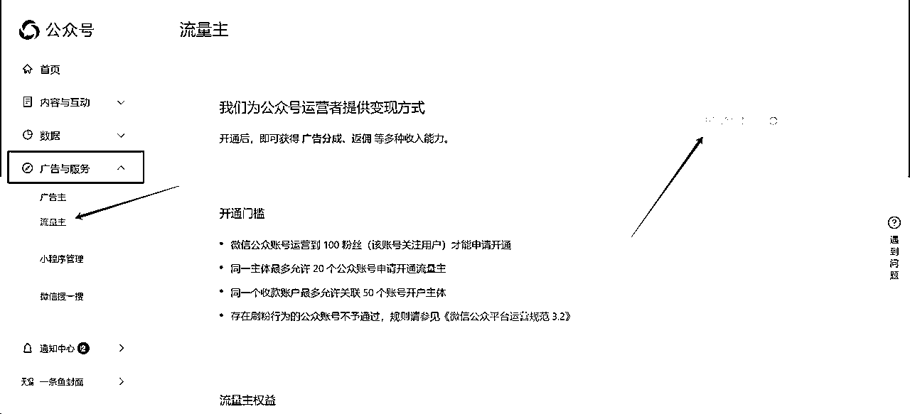
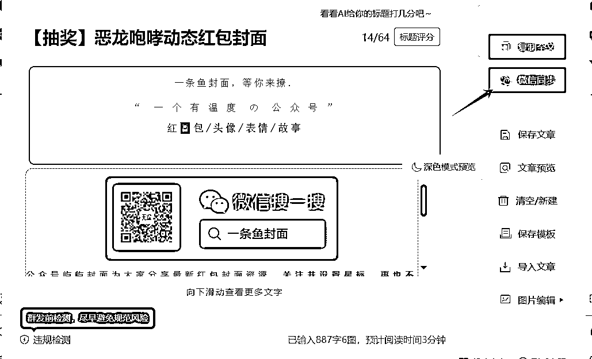
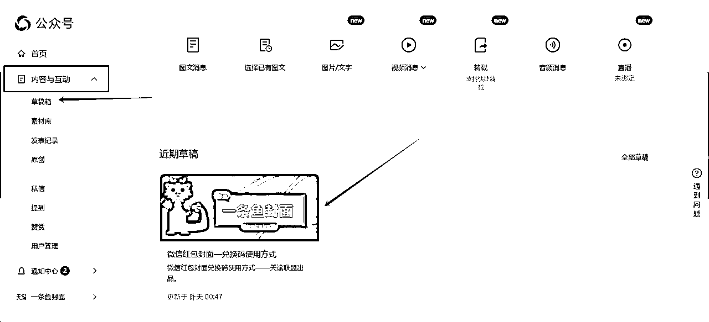
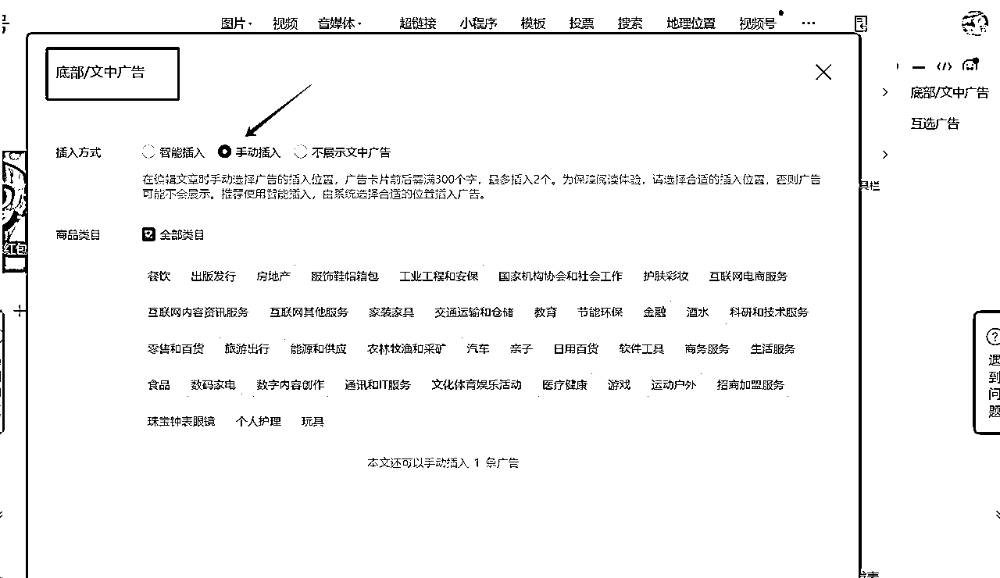

# 天谕-红包封面流量主多维玩法

> 来源：[https://tbhvciwc2p.feishu.cn/docx/StlDd6Vo6olu2DxtSfZcMl4EnEh](https://tbhvciwc2p.feishu.cn/docx/StlDd6Vo6olu2DxtSfZcMl4EnEh)

这是一个偏BUG的玩法，可能很快就会遭到官方打压，不过理解逻辑确实有点意思

# 第一步：注册个人订阅号

1.  打开微信公众平台选择注册订阅号https://mp.weixin.qq.com/

1.  设置配置自定义菜单和自动回复：自定义菜单自己按照自己的想法可以添加，图省事的直接照搬即可

1.  开通流量主：这个需要500粉丝才能开通，新号自己淘宝即可搜索解决。

# 第二步：复制同步同行文章

*   点击【服务市场】开通壹伴编辑器，选择免费试用7天

*   找到同行文章-复制他们的链接-用刚才开通的壹伴编辑器一键导入即可

*   导入了文章修改一下别人的ID昵称和图片，然后点击同步即可

*   同步了的文章去微信公众号后台-草稿箱即可添加广告发布

*   添加广告的时候选择手动插入

*   最后一步：审核文章，发布即可。

# 第三步：引流群运营

*   咱们的公众号菜单栏设置了进群，进群以后每天运营维护客户，引导客户点击浏览咱们的文章

*   群制作的时候记得使用活码，如果引流的群多，每天发不过来，直接使用微信转发软件即可，几十几百个群都可以同步发送，非常方便。

*   tips：因为咱们是订阅号，发的文章不会弹出来微信界面，所以群运营至关重要

# 第四步：抖音/快手/小红书引流

*   公域流量引流大家都是大佬，我就不露拙了。提供几个视频案例给大家参考

*   还有老公给老婆发5个大小金额不一的红包让老婆随便挑3个，这个也可以植入封面引流

# 第五步：流量多维转化

*   项目的生命周期其实很多，就是一个适合大众普通人的过年节点项目

*   所以群如果你引流的效果还不错，可以考虑加入教学收徒的模式变现