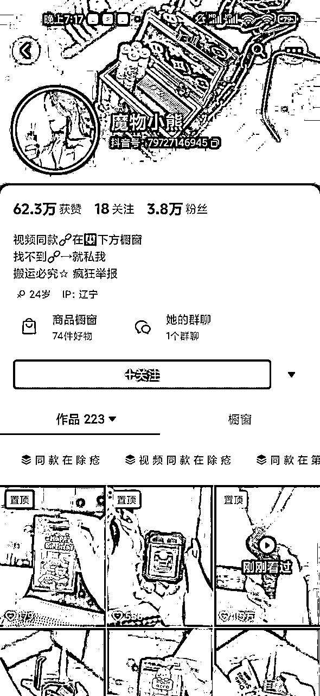
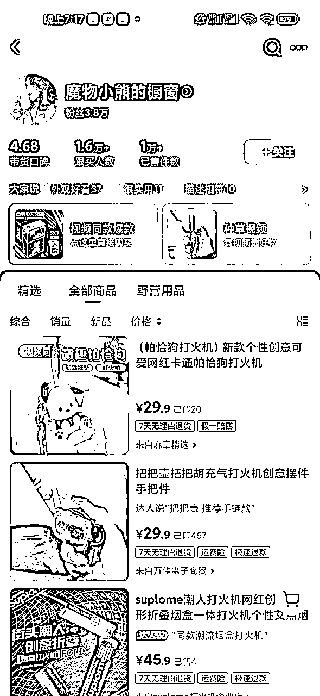
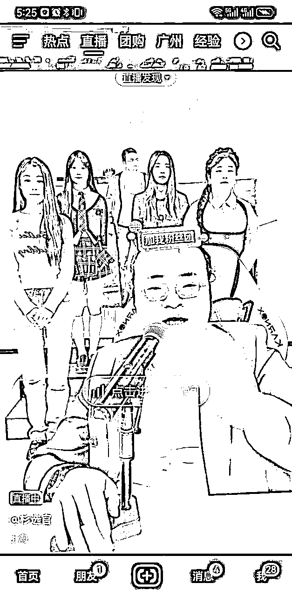

# 抖音蓝海选品方法

> 来源：[https://kib0lcw2xe.feishu.cn/docx/T744dgW9yoT00VxzZIXccdUlnCd](https://kib0lcw2xe.feishu.cn/docx/T744dgW9yoT00VxzZIXccdUlnCd)

生财的圈友们好，我是古辛，擅长选品，也是目前咱们选品航海的教练之一，今天跟兄弟们分享一下我们目前在用的抖音选品方法。

古辛之前是做淘宝蓝海的，后面逐渐转型做抖音，小红书我们也有做。我们做抖音快两年了，取得了一点不错的小成绩。我们刚开始做抖音的时候，觉得抖音和淘宝一样，都是选品，做久了之后，发现抖音和淘宝在选品方面的有不少差异。

# 抖音选品和淘宝选品的差异

## 1.竞争的维度不同

淘宝和拼多多一样，都属于搜索电商，搜索电商搞流量的核心就是抢排名，链接排第一的流量，天然就比链接排第二的流量高，所以大家都会为了排第一，争的头破血流，大家看一个产品的竞争程度如何，其实也就是看把链接做到第一的难度如何。

抖音短视频属于内容电商，流量主要靠推荐，或者说系统分发，搞流量的核心，就是内容差异化，无论这个品类目前有多少人在干，只要你的内容有差异化，能够获得观众喜欢（点赞，收藏，评论，转发，完播率等数据好），那么就能获得流量。

说得直白点，抖音就看谁的短视频更能整活，能整活就有流量。

## 2.对市场体量要求不同

搜索电商，对单一产品的市场体量要求不高，就算一个品一个月只能赚5、6千，也可以搞一条链接去卖；但抖音不同，抖音对于品类的市场体量有一定的要求，如果天花板很低，那么做起来就很累，没有去做这个品类的必要。

所以，抖音选品，对于品类的市场体量，是有要求的，如果这个品类市场体量太小，就不建议在抖音搞。

我们自己用的选品方法，是经过数次迭代的，刚开始是直接把淘宝的品放到抖音上套，因为我们做淘宝蓝海积累了产品库，后面发现有不少的局限性，于是就不断迭代，找出更适合抖音这个平台的选品方法。

## 3.对“品”的定义不同

对于淘宝来说，选品就是选一个个具体的产品；但对抖音来说，我们选的不是品，而是“对标账号”。

其实做淘宝蓝海，需要的也不是品，而是对标店铺，但对标店铺很难通过系统的方法来找，只能退而求其次，找产品，然后找到对标店铺，模范对标店铺，再通过我们的资金优势，或者运营优势，排在同行前面，从而赚钱。

抖音最核心的，就是找到适合我们的“对标账号”，通过拆解对标账号，模仿对标账号，内容差异化，来实现赚钱的目的。

所以，抖音选品，选到适合的“对标账号”是最重要的，选到“对标账号”之后，产品就很简单了，同行卖啥我卖啥。

# 抖音选品方法

以下几种方法，就是目前古辛在用的选品方法：

## 1.刷抖音短视频选品

因为我们选品，核心是要选到适合我们的对标账号，所以，通过刷抖音短视频来选品，是目前我们用到的所有选品方法中，最好的方法，同时也是效率最高的方法，没有之一，前提是能够控制得住自己。

人是没法赚到自己认知以外的钱的，选品也是，人是没有办法选到自己认知以外的产品的，传统的通过搜索去选品这种方法，最大的难点在于，你要知道去搜啥，就是你手里需要要有一个“词根”，不然你都不知道该拿啥去搜。

但抖音不一样，抖音短视频是推荐机制，不需要你有词根，只要你不断地去刷，就能不断突破你的认知，选到你此前从未了解过的产品。

比如这个抖音账号，全是围绕打火机来拍视频，223个视频吸粉吸粉3.8万。

橱窗变现一万多单。虽然打火机人人都知道，但又有多少人知道，打火机能这么玩儿呢？

通过刷抖音短视频来选品，看起来很简单，没有啥新意，但实操起来，是比较困难的，因为表面上你是在和抖音的推荐系统对抗，实际上你是在和自己的人性对抗。

古辛刚开始用这种方法去选品的时候，经常性地刷了半个小时抖音，一个品都没选到，因为刷着刷着陷入了抖音的推荐陷阱了，刷到的都是自己喜欢的，等关了抖音，才发现又浪费了半个小时。

后面经过刻意练习，强迫自己去选品，慢慢地，才能通过这种方法，选到一些品，目前我们产品库里超过我们认知的品，都是通过这种方法选出来的。

到现在，古辛都不敢说完全驾驭了这种选品方法，因为选品的时候，稍微一放松，可能就会被抖音的推荐机制攻陷，或者说被自己的人性攻陷。

如果大家刚开始做这行，建议可以从其他选品方法开始，等赚到了钱，可以通过其他选品方法，很难再选到自己认知以外的品的时候，再来尝试这种方法。

## 2.刷抖音直播选品

这种选品方法，仅次于刷抖音短视频，能够选到一些不错的对标账号，但有一定的局限性，因为有些账号可能你刷的时候没有直播，还有些账号不直播，靠橱窗卖货，或者引流到微信成交，所以这种选品方法，会漏掉一些账号。

抖音最顶部有个直播板块，在这里就能一直刷到抖音直播。

如果大家刚开始做，推荐这种选品方法。

## 3.第三方数据软件选品

我们刚开始做抖音的时候，也喜欢用第三方数据软件，比如考古加，但现在几乎不用这种选品方法了。因为用这种方法，去选对标账号，效率比较低，没有用抖音短视频来得直接。

但这种选品方法适合大家刚开始做的时候用，大家刚开始搞，用第三方数据软件来选品，还是不错的，虽然效率低了点，但多花点时间，还是会有收获的。

如果自控力不强，一来就用刷抖音短视频这种方法来选品，可能最后收获的只有情绪价值，刷短视频刷得很爽，但正事一个也没干，哈哈。

## 4.其他平台

我们偶尔也会用其他一些平台来选品，比如贴吧，因为我们也在做小众爱好这个品类，对于小众爱好这个品类来说，贴吧是最好的选品平台，因为国内机会所有小众爱好，你可能在其他平台找不到聚集者，但在贴吧，一定找得到，如果连贴吧都没有聚集者，这个品类就没有做的必要。

还有“美篇”，做老年人群的兄弟们，建议看看“美篇”，会给大家很多选品灵感，“美篇”这个平台的主要用户是体制内退休的老年人群，所以如果大家是做这个人群的，“美篇”值得一看。

以上就是目前我们做抖音，在用的几种选品方法，希望能对兄弟们在短视频领域的选品，有一点点启发。

我是古辛，擅长选品，欢迎兄弟们在选品方面和古辛交流。