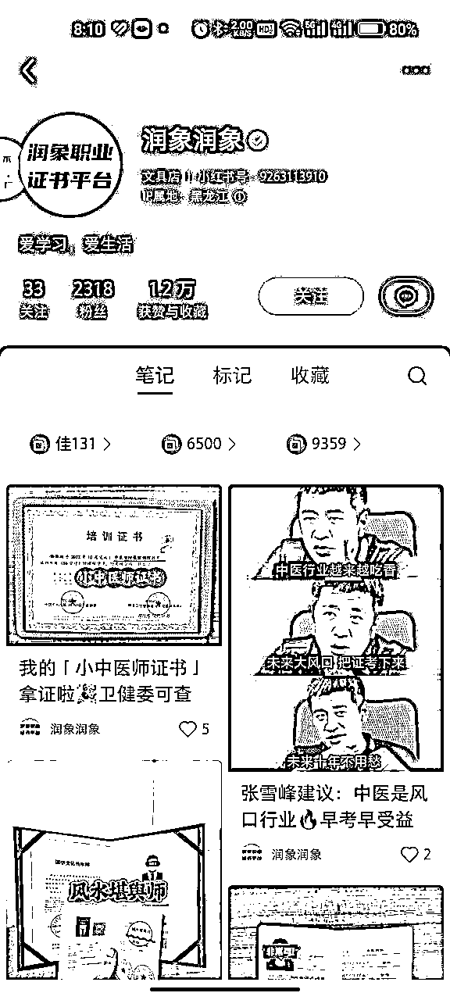
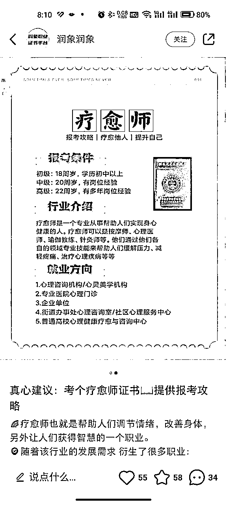
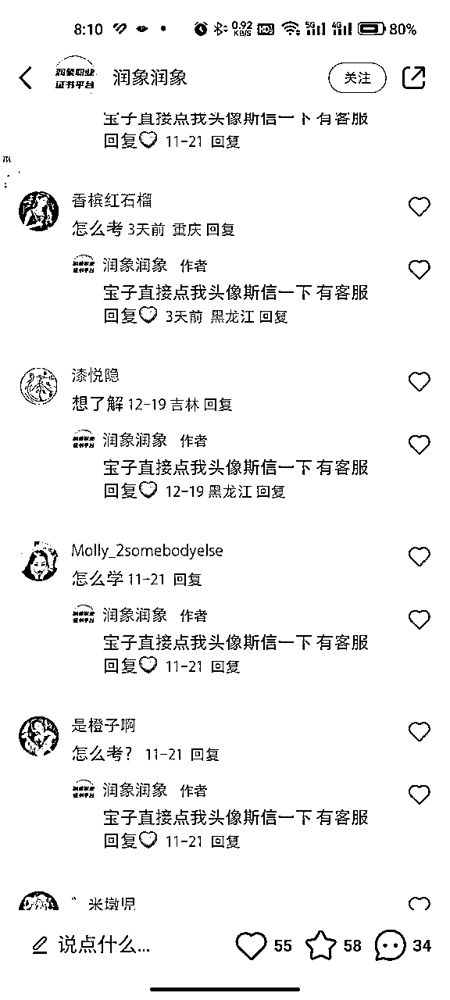
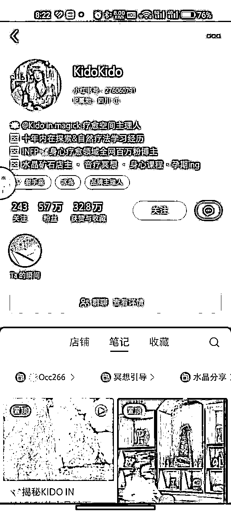
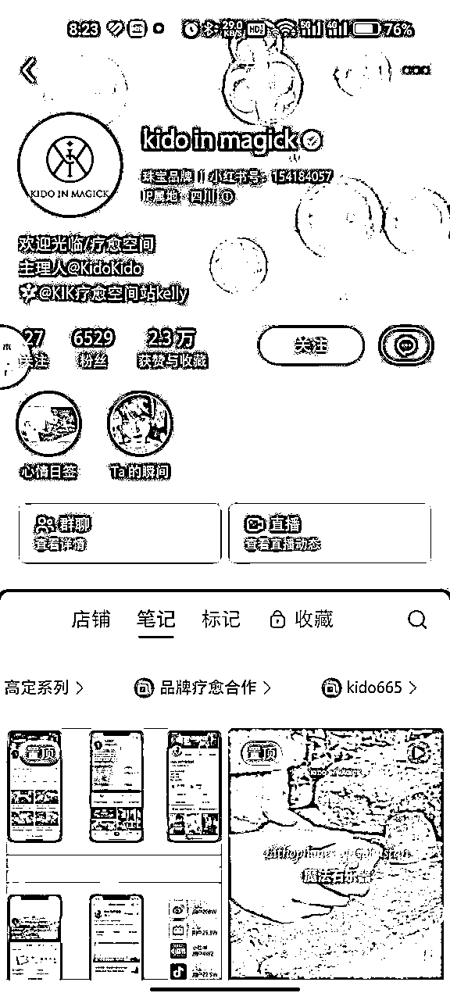
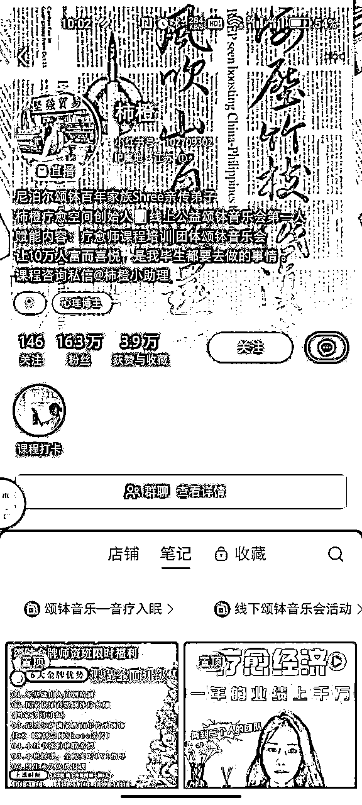
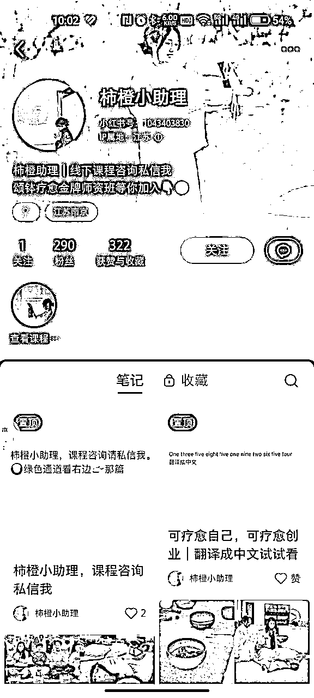
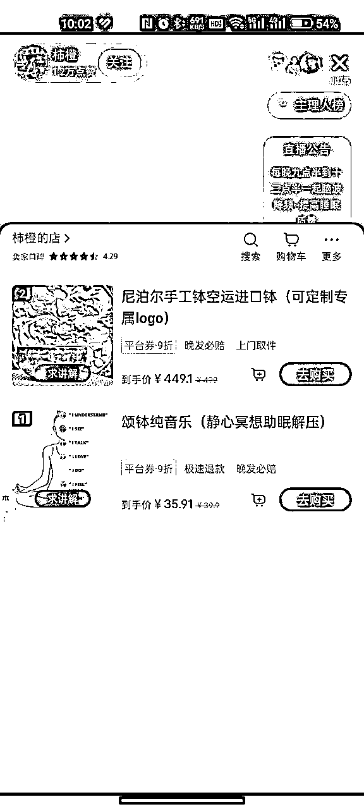

# 风向标拆解第 2 期--子凌-- 怎么在小红书做一个赚钱的身心灵账号

> 来源：[https://dp5aahs0ia.feishu.cn/docx/TB4BdvVobo3iARxOaAUcc31NnKc](https://dp5aahs0ia.feishu.cn/docx/TB4BdvVobo3iARxOaAUcc31NnKc)

# 一、项目背景

## 1.1身心灵行业背景

身心灵行业通常涉及心理学、心理辅导、心灵成长、冥想、瑜伽、能量疗法、灵气疗法等方面的知识和实践。这个行业的发展与人们对心灵成长、身心健康和内在平衡的需求密切相关。

所谓身心灵，即身体、心理与灵性的结合，是一种以全面和整体的方式看待健康的理念，追求身心合一的内外协调，能处理好与自我、他人及社会的多重关系。

在大众的通俗语境中，身心灵会更偏向于精神境界的提升和完善。

身心灵文化早已悄然渗透入大众的语境中，诸如冥想、打坐、正念等专有名词，正在成为都市人们的日常用语。

站在产业角度来看，身心灵在未来必然是大势所趋，具备庞大的市场潜力，值得一提的是，它还具备逆周期的特质，在当下的后疫情时代，更具备投资价值。

疫情作为最大的黑天鹅，逼迫所有人不得不直面世界的无序，在剧变的时代里，不确定性和波动性将人们从温情脉脉的旧梦中摇醒，如何重建自己内心和生活的秩序，成为无法回避的命题。

物质和精神构成了人类发展的双螺旋，经济越不稳定，人们的内心越需要安抚和疗愈。

根据《全球心理健康数字疗法价值趋势报告2016-2020》的数据，2020年全球数字心理健康领域发生了44起融资事件，累计融资9.07亿美元，同比增加52%。

## 1.2行业现状

### 1.2.1心理咨询行业

心理咨询行业是身心灵行业中最为广泛和成熟的一个领域。随着人们对心理健康重视程度的提升，心理咨询师的需求也越来越大。目前，心理咨询机构和心理咨询师已经在各大城市遍布，提供着个体咨询、婚姻家庭咨询、职业咨询等服务。同时，心理咨询也开始向线上转移，通过网络平台提供远程咨询服务，方便了更多需要帮助的人。

### 1.2.2瑜伽与冥想行业

瑜伽与冥想作为身心灵行业的重要组成部分，已经深入人们的生活。瑜伽通过身体的运动和呼吸来调整身心，提高身体的柔韧性和平衡性，同时增强内心的宁静和集中力。冥想则是通过集中注意力和深呼吸来达到心灵的宁静和放松。瑜伽和冥想不仅在健身房和瑜伽馆受到欢迎，也在企业和学校得到了应用。越来越多的人通过瑜伽与冥想来改善身心健康，减轻压力和焦虑。

### 1.2.3心灵成长与能量愈疗行业

心灵成长和能量愈疗是身心灵行业中的新兴领域。心灵成长是指通过自我认知、内省和成长来提升个体的心灵境界和智慧。能量愈疗是一种综合性的疗法，通过调整和平衡身体的能量场来促进身心健康。这两个领域的兴起得益于人们对心灵层面的关注和需求。不少人通过参加心灵成长课程和接受能量愈疗来寻找内心的平衡与自我提升。

### 1.2.4心灵导师与灵性教育行业

心灵导师和灵性教育是身心灵行业中的特殊领域。心灵导师是一种帮助人们探索内心、解决问题和实现目标的角色。灵性教育则是一种培养人们心灵智慧和灵性意识的教育形式。心灵导师和灵性教育的兴起得益于人们对内心世界的关注和追求。越来越多的人希望通过心灵导师和灵性教育来寻找生活的意义和方向。

身心灵行业在当今社会中扮演着重要的角色，为人们提供了丰富多样的服务。心理咨询、瑜伽与冥想、心灵成长与能量治疗、心灵导师与灵性教育等行业在满足人们身心健康需求的同时，也为人们提供了更多的选择和机会。然而，身心灵行业也面临着一些挑战，如行业准入门槛不高、行业监管不够严格等。未来，身心灵行业需要不断提升专业水平，加强行业自律，以更好地为人们的身心健康服务。

## 1.3行业市场

现代人的精神和心理问题具备复杂的成因，仅靠心理咨询不足以消化和解决，需要整个身心灵产业的支撑和供给。

这是一个庞大无比却又难以统计的市场，仅就睡眠障碍而言，根据相关数据统计，2020年中国睡眠产业的市场规模达到4000多亿元，2030年或将突破万亿元，这绝对不仅仅药物和床垫就能解决的问题。

而在身心灵产业发展上，国内显然还比较滞后，且不说引领赛道前进和创造标准的大型企业，连令人瞩目的独角兽公司也未曾出现。

2021年，IT桔子统计的心理健康赛道融资事件中，壹点灵、简单心理、好心情、昭阳医生4家公司均获得了上亿元的投资。就在3月份，泛心理生活方式品牌KnowYourself宣布获得数千万美元B轮融资。

从相关事件的投资方来看，不乏一线资本的身影，布局已悄然展开。

可以明显感觉到，在疫情催化下，身心灵产业在近两年融资陡增，这也是源于市场肉眼可见的快速增长。

# 二、项目难点

## 1.流量/人群获取

### 关于笔记形式：

笔记形式可以是图文和视频，笔记形式的选择根据对项目相关了解程度来决定，如果你有相关行业经验且在线下/线上有相关的产品建议视频形式（相对于图文爆率会更高），如果你不太了解且后端没有相关产品建议先从图文开始降低容错率增加完成项目闭环的概率同时也要去寻找后端变现的合作伙伴来确定你选择的赛道。

### 关于人群：

1.利用婵小红/灰豚等数据软件进行对标账号的分析

2.在相关对标账号评论区看大致的男女比例以及判断年龄层级

### 关于放大：

多账号发布，图文/视频双流量端口发布笔记。

#### 如何寻找对标账号：

搜索相关赛道关键词，查找热门笔记，并根据账号赞藏评进行分析。

## 2.后端交付/变现

### 未寻找到后端变现合作伙伴：

建议前期涨粉，然后开店，笔记/直播挂车，来进行公域的变现，缩短变现路径，交付以音频的形式来做。例如：颂铂音频、冥想音频等。

### 已寻找到后端变现合作伙伴：

笔记形式图文/视频可以混着发，哪个流量好些多发哪个，同样可以开店/直播挂车进行公域的变现，但可以增加思域的变现形式。

### 自己有相关的从事经验：

这样就比较容易了，从找对标开始到变现的整个闭环你都需要经历，基本同上。

# 三、落地执行

## 案例一：

账号：润象润象

账号类型：蓝V号

引流形式：笔记合集/私信

交付类型：证书培训

客单价：1K+

加到思域是一个公司，应该是矩阵化运营。

涉及到的证书很多，中yi、fengshui都有，都是最近很热门的。

## 案例二：

账号：KidoKido

账号类型：蓝V号+普通号

引流形式：笔记合集+私信+群聊

交付类型：水晶石+冥想，思域运势解读

客单价：1288+

双账号运营模式，个人号+蓝V号，是一个工作室。

依旧是笔记合集引流，不得不说这个方式真的是万金油，能看懂且感兴趣的人基本上就都加了。

后端运势解读客单价四位数，再加上水晶矿石定制，这条路径有稳定的回购和咨询。

## 案例三：

账号：柿橙

账号类型：个人号

引流形式：置顶笔记+直播小课

交付类型：线下颂钵培训

客单价：4000+

双个人号运营模式，工作室形式。

公域颂钵助眠直播+小课导流，颂铂线下培训课程交付，后期颂铂之类的仪器连带也可以卖。

导流形式很新颖，小助理号导流笔记巧妙的把微信号设置成英文，这样既可以过滤人群也可以加到非常精准的付费人群，一举多得。

# 四、结尾

身心灵赛道的增长还是蛮不错的，再加上铺天盖地的离火运宣传，给这个赛道带来了极大的机会。机会的同时也存在一定的风险，合理的规避风险是可以让这条赛道放大的前提，总之只要走通流程，形成一个闭环，身心灵赛道还是很值得切入一下的。