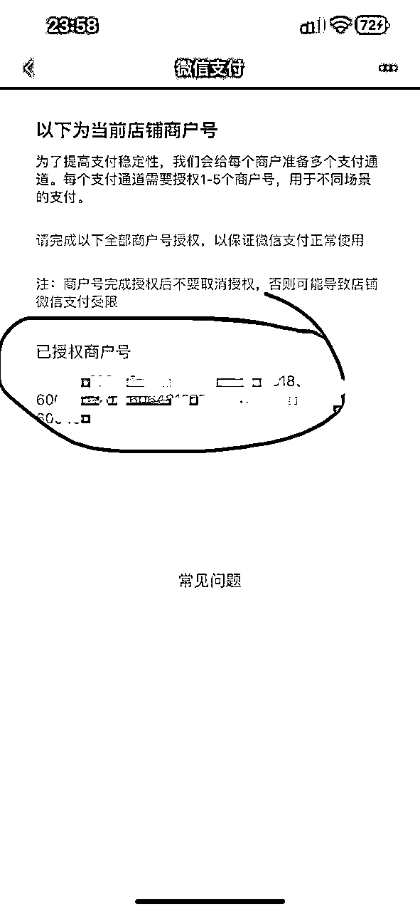
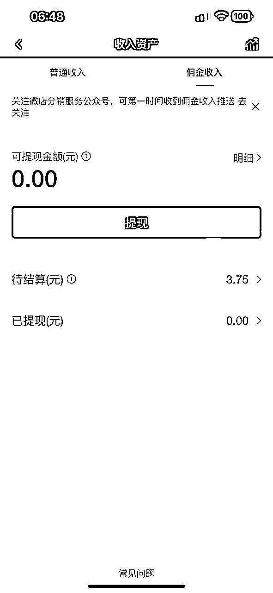
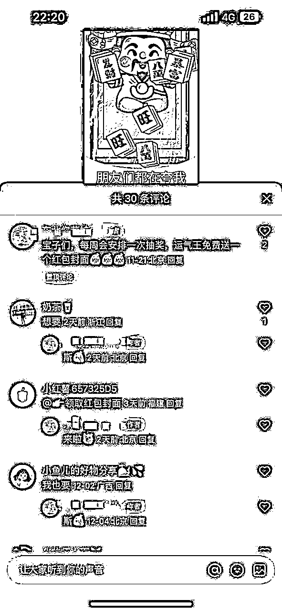
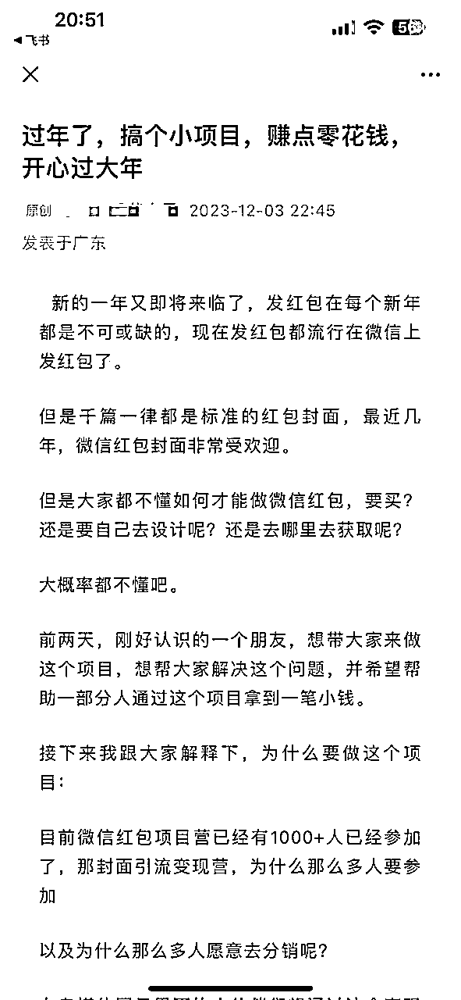

# 红包封面项目全解析——无岸总结

> 来源：[https://mw1ctv1p4w.feishu.cn/docx/Tdf9dMXH4oBzeLxKUoZcPODLnyk](https://mw1ctv1p4w.feishu.cn/docx/Tdf9dMXH4oBzeLxKUoZcPODLnyk)

大家好，我是无岸

首先来个自我介绍，方便大家认识我。

【微信昵称】无岸

【所在地区】宁波

【自我介绍】

阿猫觉醒合伙人/老徐合伙人/老马合伙人/封号斗罗

1⃣公众号单日涨粉1w人，变现五位数

2⃣新号从零开始，依靠红包封面涨粉3000，重回万粉博主

3⃣视频号单个作品播放量破900w，新晋万粉博主

4️⃣0基础运营知识星球3个月，成为知识星球官方推荐星主

5️⃣问一问半个月点赞3w+，涨粉6000+，日入四位数，累计答题曝光破200w

【我可以提供什么资源】

1⃣公域引流私域指导

2⃣问一问优秀创作者经验

3⃣个人ip打造，私域运营经验

# 一、零门槛，手把手教你开微店分销红包封面

## 前言

不知不觉，今年都进入最后一个月了，不知道大家的副业搞得怎么样。

其实最近两年，每到这个时候有个叫红包封面的项目悄悄启动，并在过年期间狠狠赚一笔！

我给大家看几张图

这是我在淘宝里搜的排名靠前的红包封面，可见需求十分旺盛。

我比较认同一句话：需求在哪里，商机就在哪里！

淘宝的门槛比较高，且运营繁琐，不适合我们做。

今天我就给大家介绍一个app，极度适合我们这样的新手小白，帮助你快速打造红包封面自动成交系统。

它就是微店，采用的是分销别人店铺里的红包封面的运营模式。不用制作红包封面，不用担心选品，只管宣传，努力实现睡后收入。

我今天要讲的内容都在这张图片里

下面我来给大家介绍微店分销红包封面的开店全流程

## 一、下载微店店长版app

因为红包封面在微店上架，所以要下载微店店长版app，通过实名认证，才能分销。

## 二、实名认证

安装好app后开始登陆，进行实名认证操作。因为分销红包封面必须要先实名认证，所以这一步必不可少！

这里的审核通过时间因人而异，白天通过的速度快，晚上就很慢。

这里注意一下：认证的时候除了身份证，也有可能会让你手持拍摄认证。跟着系统步骤走就可以了。

## 三、申请分销

实名认证用过后，便可以申请店铺分销，首先用微信描下方的分销邀请码

然后点击图片中的“申请全店分销”，点确定，自动通过审核

## 四、开通微信支付

微店是一个红包封面展示窗口，如果客户想在这里面下单，那么微店则必须开通微信支付。

开通以后记得测试一下，以免发生乌龙。

记得要把微店这边提供的二维码截图，然后去微信扫一扫，紧接着按步骤授权。

这里有个官方版本教程，大家可以看一下

店长app端：http://k.weidian.com/fARXQPJg

根据系统提示一步步操作就行。

## 五、微店推广

推荐分享店铺二维码，这样方便客户浏览红包封面，小程序由于被禁了不推荐使用。

注意此处一定是二维码，不是小程序码！

## 六、对微店进行改价

微店里我们是分销别人的红包封面，初始价格都是一样的，基本为5元。但是如果只用最开始的价格进行售卖，那么利润是很少的，必须统一对所有红包封面改价。

改价的另一个原因则是，人们往往会认为价格贵的一定是好的。越是到过年，用户对于价格越不敏感，但涨了价也方便大家售卖过程中议价。

这里有两种改价方式，都需要用到电脑

1、去电脑端进行手动操作，一次性最多可以批量改50个。

2、去电脑端自动操作

这里感谢程序员晨光提供的代码

大家可以通过链接去尝试一次，我试过了，很轻松。

因为链接存在引流问题，暂不展示。

这是现在我的店铺里的价格。

## 七、获取微店收益

当你微店里的红包封面成功交易后一笔订单后，便得到了一笔佣金，即你改价后的利润。

在微店店长版app里—收入资产—佣金收入

前几天，不知道谁从我的店铺里下单了

到这里，我们的微店就初步搭建成功了。

下节课再给大家说一说红包封面的五大变现方式。

# 二、新手必看，红包封面的五大变现方式

今天我们来讲讲红包封面的五大变现方式

首先我想告诉大家，做项目千万不要对不认识的东西产生畏惧，既然是成功案例，说明只要掌握流程，赚小钱会想呼吸一样简单。

说来说去红包封面项目到底该如何赚钱呢？

一、卖红包封面

二、招代理

三、卖批发权限

四、引流

五、超级赠品

下面我来一一介绍

## 一、卖红包封面

这是首当其冲的，因为绝大部分人都没有低价红包封面的渠道，只能被动接受价格，于是便有了很大的利润空间。

就像我上节课给大家展示的淘宝店里卖的红包封面，很受欢迎。

这是最直接，也是最容易上手的变现方式。

## 二、招代理

什么是代理呢？就是招人帮你分销

我所理解的代理有两种模式：

1、微店代理

即便是我的店铺，其实也是在帮别人分销红包封面。每当我卖出一个红包封面的时候，除了我能赚到的利润，我的上一级都会从我这里获得一小部分的提成。

前段时间分享了我的分销码，有人通过我的码开了微店，我就拿到了收益，我的下级代理每销售一单，我就能获得0.4到0.5元的提成。

就是这张图片

大家可以看一下我最近的分销邀请奖励金。

所以，理论上，只要扫你微店分销码的人越多，你躺赚的概率就越大！

微店分销码生成流程如下：

2、私域代理

什么是私域代理呢？我的下级代理通过付费的方式，在我这里获得了低价采购权。代理与顾客并不是在微店内成交，而是在私域。

怎么理解呢？

首先，顾客在我的下级代理的店铺里看中了合适的红包封面，但并不在店铺里下单。

接着，顾客把指定款告诉了我的下级代理，代理又把需求告诉了我。

然后，我通过拥有的批发权限在红包封面总店低价购买了该红包封面，把序列号发给代理。代理把钱给我，再将序列号发给顾客。

最后，顾客获得了序列号，把钱按照微店的价格转给代理。

如此，一个私域代理过程形成闭环。

私域代理的前提是你拥有批发权限。

## 三、卖批发权限

我们知道一个公式：利润=售价—成本

红包封面同样如此，封面的售价不可能无限上升，这种情况下，成本越低，利润越多。

批发权限应运而生。

所谓批发权限即通过付费的方式，从红包封面总店低价进货，无需再通过他人之手，这也有了很大的自由度。当然这个价格有点高，不建议新手小白玩。

如果大家在建立自己的商铺之后，确实需要开通批发权限，有需要可以私聊找我。

## 四、引流

1月份的时候，我的公众号被封了。从头开始并不容易，我很意外得知了红包封面可以给公众号涨粉，于是便开始了。

流程如下：

1、去淘宝购买一定数量的红包封面

2、去抽奖小程序设置抽奖内容，奖品就是淘宝购买的红包封面

3、做好自己的文案：写上公众号，奖项和奖品图片

4、找文案号号主引流文章或者上别人发出来的引流车队

5、将文案发给号主，预览无误后付款

是不是很简单？

没错，所以我上了末班车。这是我这两天的涨粉效果：

涨粉效果确实出乎我的意料，更有甚者短短几天破万。但也远没有像我之前抖音涨粉那么具有性价比！

这个红包封面引流还是有不尽如人意的地方：

1、成本高。红包封面淘宝买的，花了200。各种引流车花了500。

2、时间太晚。我只踩中了红包封面引流的尾巴，因为即将过年。

3、粉丝粘性差。这波涨粉其实大部分人都冲着免费而来，谁知道真开了奖，加微信来领奖者寥寥无几

4、浪费。因为事先准备了大量红包封面，比如我准备了20个，只发出去5个，其余全部浪费！

尽管如此，我年初就断言：年末，红包封面仍然大有可为！

有人看到这里很懂很好奇，涨粉怎么也算变现方法？因为引流是需要成本的，一个公众号粉丝的引流成本在几毛到几块不等。

可一旦有公众号粉丝买了你介绍的知识付费产品，那就和捡钱的道理差不多。

关于引流我会在第三讲和第四讲重点讲述。

## 五、超级赠品

在上个月的阿猫小报童分销活动中，我首创买一个小报童送一个红包封面的销售策略。

效果大大地出乎我的预料。毕竟一个小报童才10元，一个红包封面的价格也在10元左右，怎么看这个买一送一都超级划算。

于是我第一次在小报童的分销过程中取得了带货前十的佳绩！光是佣金收入加排行奖励就超过了600元，而我的成本呢，只有一百多块。

因此，可以把红包封面当作一个赠品来提升你的销售策略。做自媒体，要学会分钱。

# 三、布局公域，静待流量涌来

今天我们来讲讲红包封面的公域宣传。我选中了3个领域：视频号、小红书和闲鱼

## 一、选择理由

### 1、视频号

先给大家看一张图

这是“红包封面”一年内的微信指数。

在今年上半年，“红包封面”只出现在公众号，但从下半年开始，视频号里关于红包封面的内容越来越多，直接把公众号占比压制到20%以下。

所以，视频号会是未来腾讯内部主要的流量来源。我们一定要好好把握住。

公众号也很重要，关于如何使用公众号引流放到下节课再讲。

### 2、小红书

小红书有多火就更不用说了。就我个人而言，我一有问题直接搜索小红书，比其他任何搜索引擎都好用，还会各种形式展示问题的解决办法。

而且，小红书粉丝的精准引流一直都是我比较渴望的。因为我已经见识了太多小红书大佬如何从小红书起号，然后起飞！

### 3、闲鱼

很多人不知道闲鱼，或者只知道它是一个二手交易平台。但其实闲鱼还卖新品，甚至淘宝的商品链接直接在闲鱼出现。

根据官方公布，闲鱼于 2014 年上线，目前已有 5 亿用户，其中 95 后用户占比 43%。最新消息，1688 和闲鱼已经升级为淘天集团一级业务。

特别是今年越来越多的闲鱼大佬浮出水面，说明闲鱼的竞争非常激烈。有句话说得好：风浪越大鱼越贵！

2024年，看好闲鱼！

## 二、视频号推广

1、账号搭建

先给大家看一张图

账号包含“红包封面”，但不要完全写成“红包封面”。这是由于官方有个叫“微信红包封面”的账号，你取一样的名字，搞不好官方说你是山寨号，把你封了。

流量小没事，一旦遇上爆款，官方会对视频进行人工审核。

2、简介埋钩子

一般我们都会在简介里说明领取红包封面的话术，但这个博主显然还同时艾特了大号！这也是一种导流措施，将所有的流量都汇聚到大号。相比大号应该还有一个公众号作为承接。

最后果然如此。

3、视频制作

视频的制作一定要做好原创性，特别是在视频号中，如果是非原创性的视频误点了原创上传，可能会引发系统对你的警告。

视频制作都需要素材。经过我和红包封面作者沟通，他同意把现有的视频素材都公开。

还有另外一种方法也可以下载微店里的视频。就是把微店的链接用qq浏览器打开，在qq浏览器的界面里可以单独下载每一个红包封面的视频素材。

如果大家有能力自己做混剪，那最好不过了，但我更推荐大家使用录屏或者拿第二个手机拍摄的方式获得视频素材。因为这样可以申请原创，获得系统推荐的可能性更大。

比如这个

4、用好评论区

视频号的评论区相当友好，不仅可以直接提及让大家关注简介内容，还可以将自己的微信号加进去置顶！

除此之外，我还用话术引导大家去评论区评论。比如，我发布了一条奖励：在本视频的评论区抽一名小伙伴送视频中的红包封面！

这样直接让我的视频获得了第一波流量！

就在今晚，已经有人从视频号的评论区找我来了！

再次验证了我的想法，视频号大有可为！

## 三、小红书引流

小红书今年严打，对引流行为绝不姑息。我下面讲到的内容，仅作为参考，不对你的账号负责！

1、账号名称

账号名称是否带有红包封面，不是那么重要。背景图可以用红包封面替代，更加醒目。真正要上心的是简介。

比如下面这个

2、慎重写简介

还是因为小红书官方严打，现在小红书简介都没办法留邮箱了，但大家还是可以通过群聊引流。

就像这位博主在简介里写每周抽取一名运气王赠送红包封面，参与抽奖请进群。

3、群聊引流

首先将每个笔记与群聊关联，通过不停的发笔记曝光，获得源源不断的流量。

其次，在群聊中使用群公告，群置顶信息引流进私域。

最后，也别忘记在评论区中提及运气王抽奖。

4、用好评论区

小红书的系统推流是评论大于点赞、收藏，意味着高讨论度的笔记会被优先推荐。

在不发送违规词的情况下，大家可以请自己的粉丝、朋友充当水军，把评论区搞得热闹一点。

甚至还可以在评论区写上小红书群聊的链接。

值得注意的是，大家不要在小红书里面提及任何关于外部平台的语句，能用图片替代就用图片替代，或者用小号发言。

## 四、闲鱼推广

### 1、账号搭建

给大家看看我的账号

从上往下我依次说明

主页背景：我今天试了下，背景图片添加了我的个人微信直接违规。大家放一下红包封面好了。

头像：我这里用了个人头像。其实最好和你的昵称交相呼应。

昵称：朗朗上口，最好说明你是卖什么的。

简介：这一块比较重要，我直接拿别人专门卖红包封面的来改的。

给大家看一下

芝麻信用：闲鱼需要芝麻信用的授权，如果你的芝麻信用很高，顾客也更容易相信你。

其他都是个人信息，我就不讲了。

### 2、商品发布

我的建议是看同行怎么写的，你模仿就行。

来一张我的：

最上面是商品介绍和注意事项，这是整个发布区最重要的地方。

接下来是商品展示区，视频和图片都可以。

然后你会发现有个定位，优先选用一线城市。

再然后就是商品的属性信息

价格只要比成本价高就行，闲鱼卖不起价格，只能当引流使用。

发货方式选包邮

最后一个是圈子，类似微博的超话，进去之后可以看到很多一个类型的商品。

### 3、增加曝光小技巧

第一个，一键擦亮，增加曝光！

第二个，降价

第三个，下架再重新上架

第四个，选对合适的圈子。

这是我在同行那里找的几个圈子

今天，我已经收到闲鱼上顾客的问询了，可惜没有成功导流私域。

## 五、模仿同行

我之所以提这位小红书博主，是因为她完完全全一比一复制了我的视频号作品开头。

很好，我也终于遇到了。

这是我11.19号发布在小红书的内容

这是该博主11.20发布在小红书的内容

视频画面里的文案一字不差，我也蛮佩服的。说明大家在创作的时候，其实可以去看看平台里的同行，找找灵感，但不建议一比一文案复制。

因为公域流量来自于网友们的搜索，现在还没到节假日，目前我还没有观测到爆款作品，但请大家不要灰心。做好布局，等待爆发即可。

# 四、激活私域，助推快速成交

今天我们来讲一下红包封面的私域宣传和推广

那么什么是私域呢？简单来说，没有系统推流，直接与微信用户接触的地方就叫私域。比如公众号、朋友圈、社群、小报童和知识星球。

私域可以直接触达用户，因此转化是我们一切操作的核心目的。

## 一、公众号

### 1、账号搭建

首先我不建议大家为了去承接流量，去做一个新的公众号。其实没必要，还不如把这部分新的流量直接加到你原先的公众号上。

同时不要给公众号取一个带有“红包封面”的名字，因为官方就有一个公众号包含“红包封面”，千万不要对着干。

那么我们可以在哪些地方对现有的公众号进行调整呢？

第一、在自动回复中加入关于红包封面的关键词

第二、在关键词【红包封面】中加入微店二维码和个人二维码

第三、在菜单栏中加入微店二维码

第四、把带有红包封面的文章设置为精选，增加曝光量

第五、每天都在公众号的次条发布关于红包封面的内容

### 2、抽奖引流

1月份的时候，我带领小伙伴进行了红包封面引流公众号的活动，日涨粉上千，但成本也高。

上次讲到有几个缺点，

1、成本高。红包封面淘宝买的，花了200。各种引流车花了500。

2、时间太晚。我只踩中了红包封面引流的尾巴，因为即将过年。

3、粉丝粘性差。这波涨粉其实大部分人都冲着免费而来，谁知道真开了奖，加微信来领奖者寥寥无几

4、浪费。因为事先准备了大量红包封面，比如我准备了20个，只发出去只要掌握流程，赚小钱会想呼吸一样简单。

但现在不一样了，曾经的缺陷得到改善：

1、红包封面的成本大大下降，特别是对有批发权限的小伙伴。现在也未必要去找文案号推广，大家可以采取互推的方式，几乎就没有成本了，粉丝中奖概率大大增加！

2、现在离过年还很早，有大把时间可以布局

3、这一方面没办法改变，但想拿免费的，第五节课将会讲到

4、这次不会再浪费了，有人来领才买，防止购买浪费。

注意事项：抽奖小程序里面一定要设置成让中奖者联系你，这样才称完成引流的闭环

引流方式仅供参考，有风险！

### 3、发文推荐

现在公众号已经半公域化了，如果你的文章标题还不错，那么就很容易获得系统推荐。

下面便是一个案例

号主灵燕写了一篇文章，关于红包封面的。这个标题起的很好，一下子就让这篇文章获得了系统推荐，阅读量2.1w

与此同时，因为灵燕在文章底部留了一个红包封面的付费产品和个人微信二维码。将近150人通过这篇文章加了灵燕微信，有几十人成功付费，让灵燕实现了单日收入600+！

这也给了我一个思路，因为今年公众号在大力推进公域化，只要标题起的好，就有机会进入流量池。

大家也可以在介绍红包封面的文章中，插入个人微信二维码，或者提示网友在公众号后台输入“红包封面”以此引流个人微信或引导网友购买。

## 二、持续分享

### 1、红包开路

红包封面的使用效果不应该只存在于视频和图文，而是应该真真切切地使用出来，让用户看到具体效果。

比如在一个社群中，发一个红包，使用你最中意的红包封面，然后顺便问大家好看不好看。

如果是对你红包封面感兴趣的，说不定还会来加你好友。

### 2、分享副业

前一段时间，我在各个社群做分享，分享的内容就是我已经跑通了的红包封面项目。除了讲干货，我也发了好看的红包封面。

因为这个红包封面项目可以赚点小钱，原来没有我好友的人，如果对红包封面项目感兴趣就会来链接我。

## 三、私聊策略

### 1、私域好友

一般而言在我通讯录里的好友，或者是我好友推荐的好友，我并不是直接卖他们红包封面，反而是一种半卖半送的形式。

因为一个红包封面不过几块钱，如果对方能给我宣传一下，何乐而不为？不要斤斤计较几块钱。

但如果对方执意要购买红包封面，那我也顺水推舟。

### 2、引流网友

从最近视频号引流的情况来看，普遍付费意愿并不强，甚至有些人一听要付费购买，立马就把我删了。我也不介意，这样的人也不是我心目中的目标用户。

对于从公域来的网友，我的话术是这样的：

简单明了，我也不会废话。反正进了我的红包封面福利群，你就别想跑。

关于红包封面福利群，我会在最后一节课讲述。

## 四、朋友圈玩法

### 1、展示店铺

店铺的二维码不能放在相册里生灰，一定要每天出现在朋友圈一次。即便大家不会马上购买你的红包封面，但出于好奇，肯定会进去看看。

单纯的展示店铺可能效果并不好，文案利用红包封面福利群搭配，图片最好再加一些好看的红包封面。

### 2、点赞玩法

上节课讲过，我会在视频号里发视频引流，今天突然想到，我可以把相关的视频转发到朋友圈，让大家来点赞。

由于视频号的特殊性质，大家对我朋友圈的点赞会自动转化到视频号上面，也算是给我的作品又增加了一定的曝光度。

比如今天我这个：

直接把我的视频播放量从几百涨到了1000

间接又增加了我视频的曝光，来了好几位从视频号过来的网友。

### 3、分享干货

有人肯定很奇怪了，朋友圈分享干货和红包封面有什么关系？

是这样的，在微信的好友们，并不是每个人都和你在共同的微信群。如果只是在社群曝光，还有很多人看不到，于是朋友圈就能弥补一些社群无法触达的人群。

下面的内容我转发到了朋友圈

阅读量特别高！

## 五、总结

上节课讲了公域，这节课讲了私域玩法。

其实私域并不是孤立操作的，很多事情都可以连在一起做。

比如视频号转发朋友圈点赞可领红包封面，我在社群和知识星球也说了的，顺便还吸引了一位从知识星球来的小伙伴。

我的总体思路就是公域做爆款，私域做转化。不管是从公域过来的，还是别人介绍的，一定要把他们留下来。

留下来，朋友圈慢慢转化；

留下来，未来才有可能。

# 五、抓住本质，揭秘红包封面的终极玩法

红包封面的终极玩法——红包封面福利群

你是不是在困惑红包封面究竟该怎么变现？

私域没人，公域不会。

其实很简单，建一个红包封面福利群。

我来打个样

我来解读一下，参加红包封面福利群是有条件的：

1、加我微信

2、关注我的免费星球

大家肯定很奇怪，我不是有公众号吗？怎么没写公众号

因为我发现公众号推送，粉丝几乎看不到，或者没有点开的欲望。

规则：每天发红包，运气王免费得红包封面。

得不到的小伙伴怎么办呢？推荐三人对红包封面福利群感兴趣的小伙伴，加你微信，可自动获得红包封面一个！

一个低价红包2.5元，换三个好友位，管你是不是来白嫖的，来了你就别想走！

把思考留给自己，执行和排难的事情交给用户。

我不会主动去寻找新的陌生人，主要还是靠用户自发去推荐，我也节约了大量的时间。

但我今天还是踩坑了。

有人为了快速获得红包封面，未经他人允许，擅自推送名片给我，造成了乌龙，搞得我很不好意思。

是

说明，下次注意让别人加我，自己不要主动去加人！

红包封面项目的最终目的还是引流，扩充你的私域，至于赚点小钱，其实是顺手而为。

但红包封面福利群的前提是你开通了批发权限，这样可以极大地降低你的成本。

通过红包封面福利群，我实现了单日收入四位数。怎么回事呢？我从红包封面福利群里收了位合伙人。

所以，不要小看红包封面福利群！

欢迎大家来链接我，送你一份大礼，点我星球头像即可，祝大家都能在新的一年暴富！