# 视频号【出镜人身份验证】怎么处理？搬运混剪的同学必看

> 来源：[https://dls8hvx5jh.feishu.cn/docx/TlHXdlcKOo1gQwxkeqscB8GfnXe](https://dls8hvx5jh.feishu.cn/docx/TlHXdlcKOo1gQwxkeqscB8GfnXe)

大家好我是阿橘，今天我整理了自己的一套通过出镜人身份验证方法，分享给大家，亲测有效，我手上8个号都解除成功了，其他圈友也用过这个方法解封过不少账号。

最近很多小伙伴在做视频号，都遇到了【出镜人身份验证】的问题，有小伙伴早期发卖惨话术还是行得通的，但随着审核员对这类文案看多了之后免疫了，现在基本卖惨很难过审了。

我相信很多小伙伴搬运别人出镜的视频，大概率会收到这个私信：

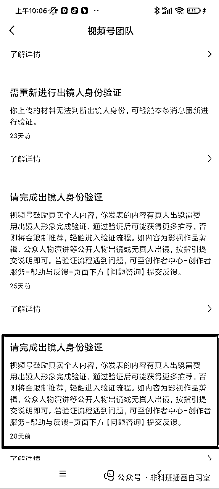

这个【出镜人身份验证】，没通过平台审核的话，是账号要被限流180天的。而且无法发送私信等，相当于号就废了。想要注销重新开号，但是等待时间长还浪费时间。

那么怎么通过这个审核呢？这里我说下各个情况的解决方法：

PS：以下方法适用于视频号身份已经验证的同学，请按照以下步骤确认下是否已经验证：

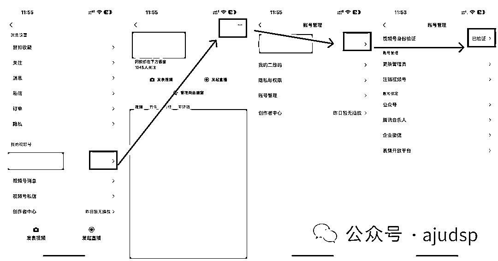

如果你属于没验证过，且橱窗保证金没交的同学，可以直接尝试注销看看能不能行；

如果你属于没验证过，但是橱窗保证金交了，这个就比较麻烦了，因为你没法马上注销账号。而且假如你这个号是搬运别人的人脸，视频号会要求你在身份验证这一步，输入出镜人的身份证号并扫脸，这对于搬运的同学几乎不可能实现的。这时候我们只能把微信的实名人给换掉，再来到这个页面去认证视频号看看（这个情况我还没碰到过，也是从群里收集材料得到的，待验证,后续完善文档）

以上未验证的情况属于少数，如果你属于已经验证过的同学，接着往下看：

### 第一种情况：如果视频里头出镜人是你自己或者就在你身边的本地的亲人朋友：

那就点击私信，进入验证流程，来到下面这个页面

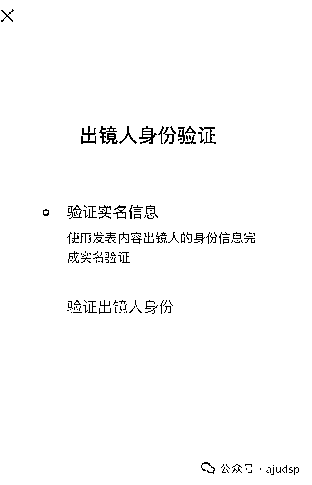

#### 这里先让微信视频号的实名人先扫脸。

扫脸完毕后，会进入

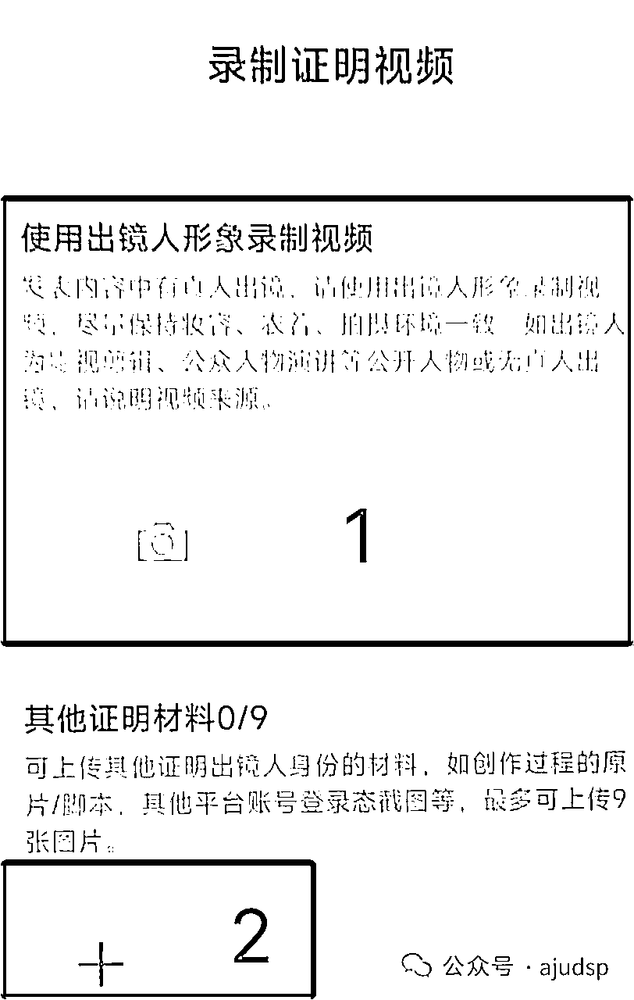

#### 点击1，让视频里的出镜人按照系统提供的文字念就好了。

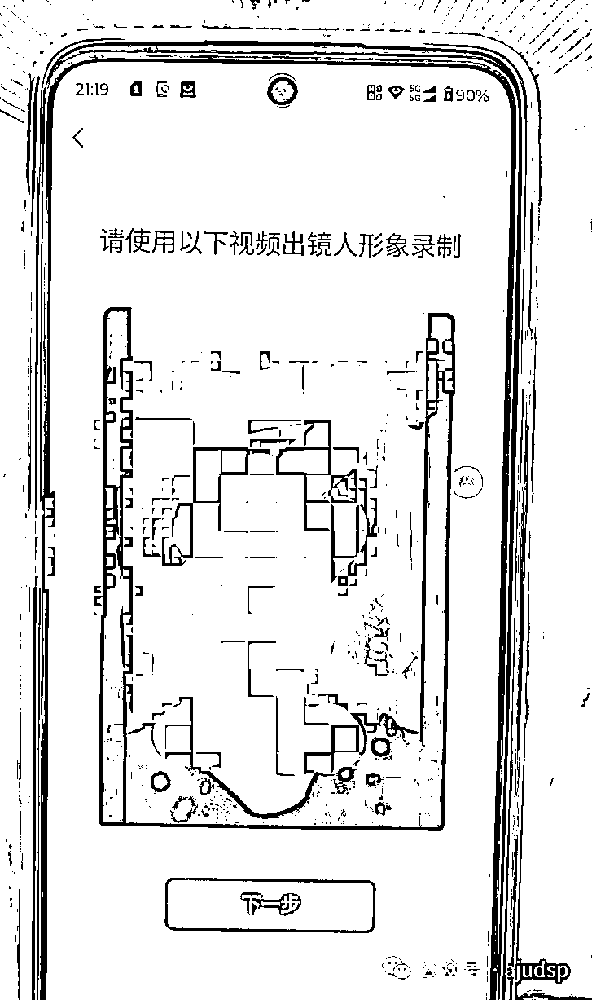

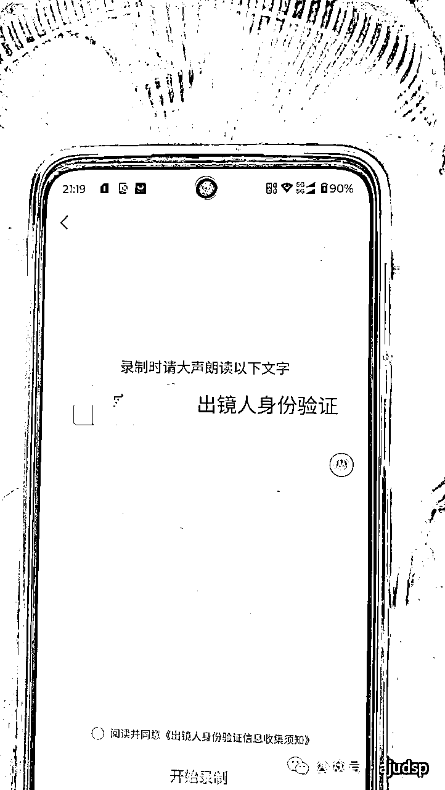

让出镜人当时穿和视频里一样的衣服，更容易过审。这样2可以不用提交资料了。服装不一致其实问题也不大，人脸一致就ok。资料都提交之后，等待系统给你发送这条通知，就表示账号已经恢复正常了。（这里提一下审核的速度，审核员晚上不上班，如果是晚上提交，一般是次日10点能收到通知。白天提交的资料，快的话半小时，慢的话几小时。耐心等待就好）

如果家属不在本地，你又不想让对方把微信登录过去扫脸，可以让对方按照系统提供的文字念，把视频录制好发给你。你把视频打开，再用手机对着录就行了，详情见视频：

### 第二种情况：搬运别人的视频，视频里的出镜人是不认识的人：

先把账号里侵权的视频删除掉。上百度或着小红书搜正能量语录或者老人言，语录可以随便选，或者你自己编一段祝福语也是OK的

打开手机摄像头，对着镜头录制1-2条口播视频，每条视频10-15秒就行。然后打开视频号，从相册选择发布我们刚才录制的口播视频。

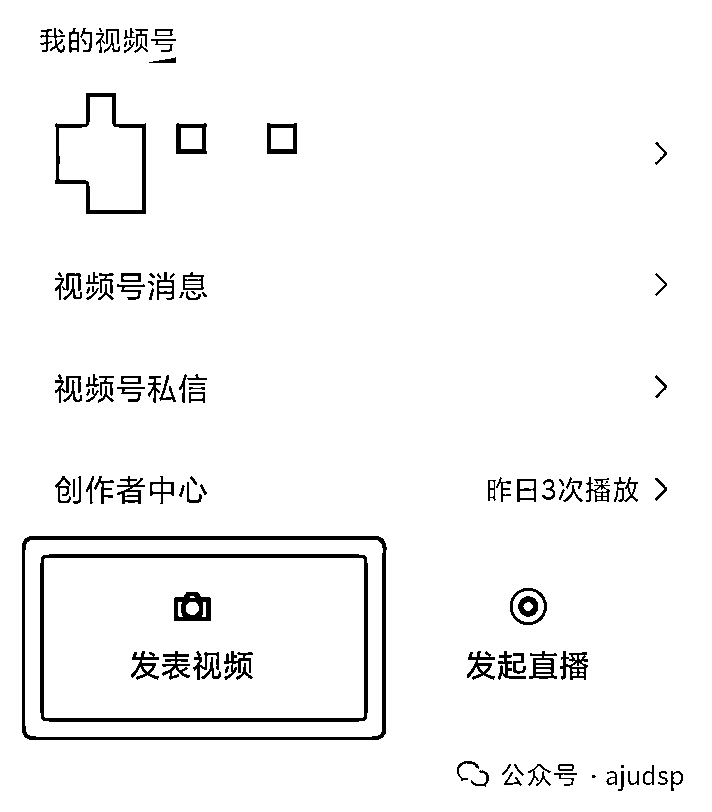

然后我们开始制作一批申诉材料：

#### ①对着电脑拍一张剪映的工程文件+侵权的出镜人发的视频的详情页

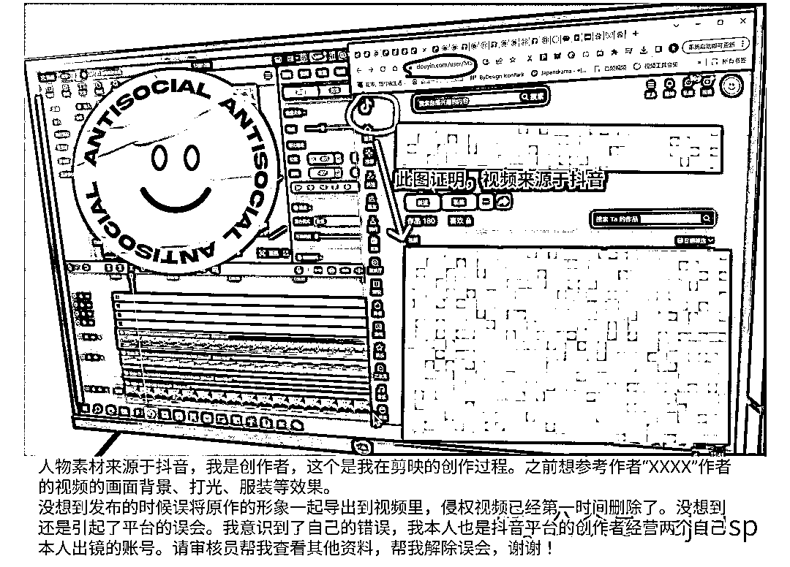

图片上的文案帮大家整理好了，大家可以结合自己的情况做下修改，毕竟审核员看一样的文案发多了，也会降低过审的概率：

人物素材来源于抖音，我是创作者，这个是我在剪映的创作过程。之前想参考作者“XXXX”作者的视频的画面背景、打光、服装等效果。

没想到发布的时候误将原作的形象一起导出到视频里，侵权视频已经第一时间删除了。没想到还是引起了平台的误会。我意识到了自己的错误，我本人也是抖音平台的创作者经营两个自己本人出镜的账号。请审核员帮我查看其他资料，帮我解除误会，谢谢！

以及一张单独的工程详情

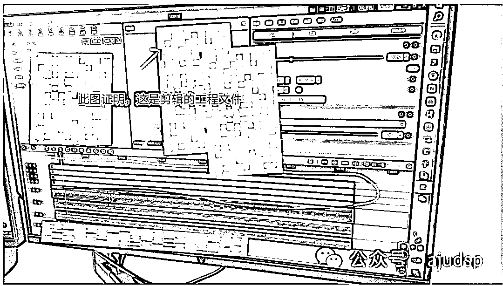

#### ②实拍自己在剪辑视频（服装和刚才发布正能量的视频里的要保持一致哦）

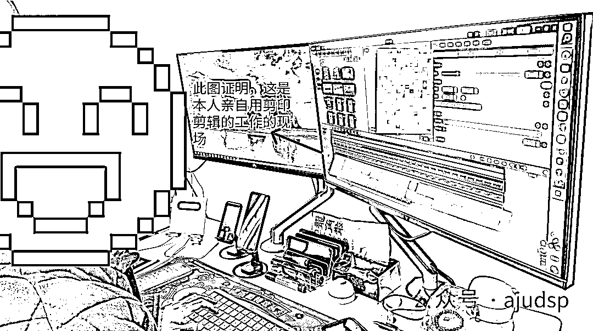

#### ③实拍自己手举着账号，拿着身份证的照片

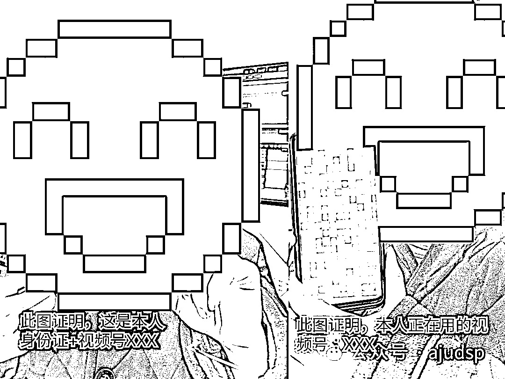

#### ④打开视频号账号你出镜的那条正能量视频，放桌面，身份证放上面，不放心的可以加个文字水印

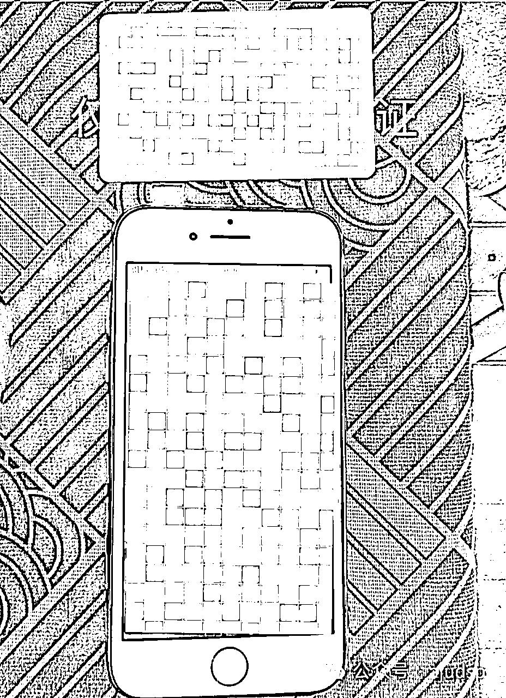

至此，我们的验证身份需要的图片材料都做好了。

然后找到私信，点击私信，进入验证流程，来到下面这个页面，这里先让微信视频号的实名人先扫脸。

然后来到这个页面，

#### 1这里就不要按照系统提供的文字去念了，

直接对着镜头读“出镜人视频是我从某某平台（视频号/抖音）下载的,请审核员查看下我提交的证据材料”

然后点击2，提交刚才咱们做的几张图片材料。然后上传等待系统通过即可。这个方法我已经通过了6个号了，大家出现这个情况都可以去试试。

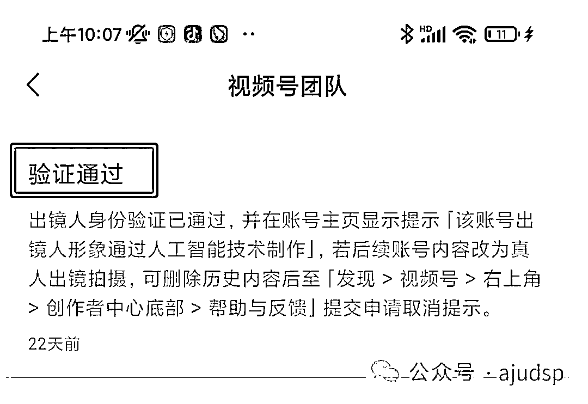

这里提示下，如果视频号判定你之前发的视频里，出现的人物是用了变老特效，那么他会在你的视频号主页里增加一个这样的提示：

这个提示对于咱们的带货转化其实没有什么影响。可以不用管。而且视频号也提供了取消的办法，其实就是坚持真人拍摄，后面想取消了再去申请即可，真诚才是视频号的必杀技

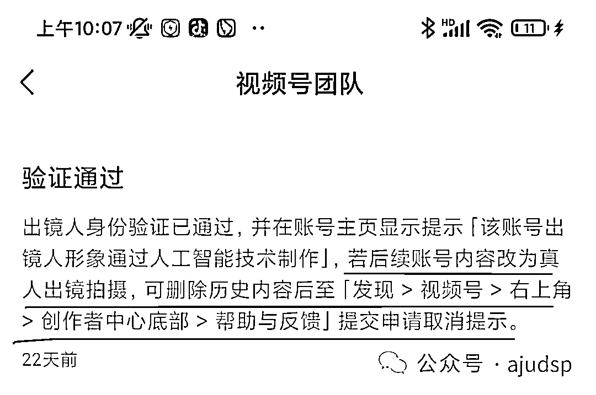

### 其他情况

如果按这个步骤申诉失败了，可以再检查下之前提交的资料是不是模糊。图片上的字是否看不清，重新梳理下文字。目前这个方法还是有效的。

#### 申诉入口没了

有同学说，之前没遇到我这个帖子，自己申诉过，但是失败了，导致入口点进去无法再二次申诉了。这时候我们可以再去录制一条正能量视频，不是发特效自拍哈，视频发布后，视频号又会给你发私信了，催你去处理真人验证。如果还是没有入口，只能试下创作者中心划到最下面-帮助与反馈划到最底部-问题咨询-账号、认证，在这里把我们做的截图和文案粘贴提交。或者给腾讯发邮件channels_consult@tencent.com

本文鸣谢：素材出镜人@mingyu

本文于2021年1月11日，在@生财有术星球发布。

我是阿橘，2024年持续耕耘视频号，最后祝大家账号都能爆单！