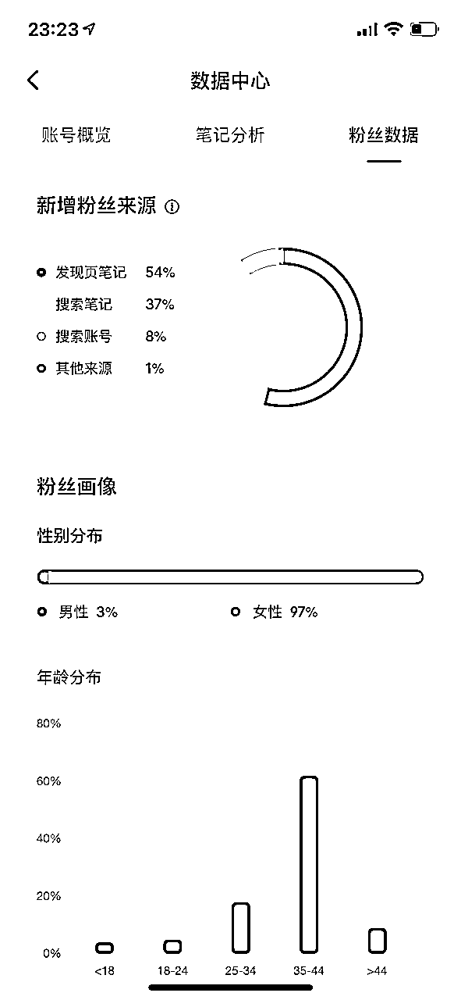
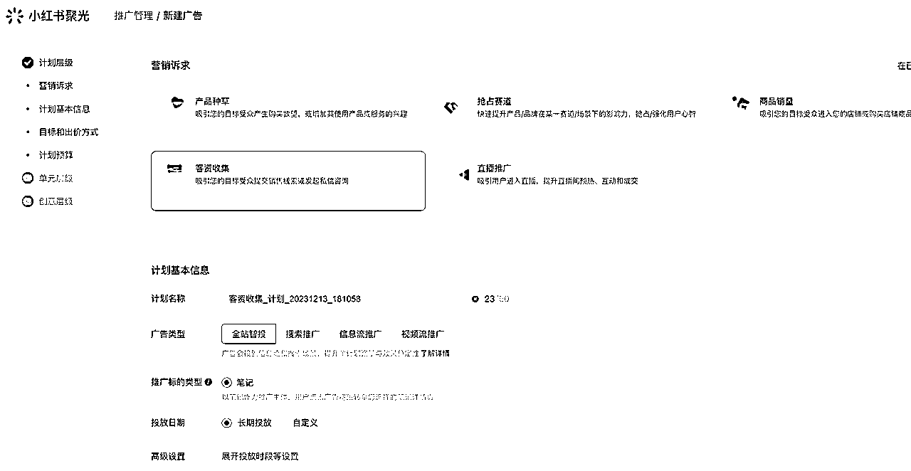
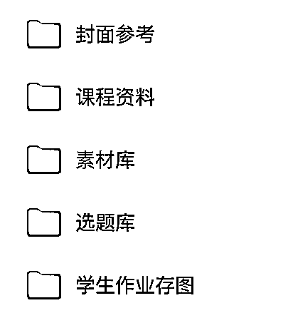

# 夫妻搭档做英语培训，通过小红书月入20w

> 来源：[https://bmy4tfqyf1.feishu.cn/docx/TyYJdA2FZox3nXxfhUDcG2UonPg](https://bmy4tfqyf1.feishu.cn/docx/TyYJdA2FZox3nXxfhUDcG2UonPg)

Hello，生财的圈友们好，我是郑韩，好久没发文章了，今天分享一个今年做的英语科目在小红书上的运营经验，希望对想要通过小红书获客引流的圈友们能有所启发。

年初的学员，深圳的小陈和老王，他们今年刚创业，根据一门国外教材开发了专门的课程，通过小红书引流想要学习英语的家长到微信成交卖课，客单价6K左右，到5月份左右，单月能成交30个以上的家长，小陈主要负责前端引流和转化，老王负责后端的课程开发和助教管理，真可谓夫妻搭配，干活不累。

到上个月，除了原有的课程之外，已经同步开发新教材的课程了，我们已经跑通了把一门新课程从开发，流量，转化，服务的全流程。同时，后端也已经有十几位相对稳定的助教在服务学员。

听上去似乎是个炫耀帖，但能做到现阶段的成绩，我们也踩了好几个坑，废了很多功夫才跳出这些泥坑，且听我为大家一一道来。

# 一、稳扎稳打，霸屏小红书搜索流量

年初开始做小红书之前，报名的基本上是深圳当地的家长，当时刚好是YQ比较严重，他们想从线下转型线上，服务全国各地的英语学员。

在找我服务前，小陈老王他们已经尝试做了几个月的小红书，但始终没有起色，每天也就是1-2个用户咨询，还不一定加微信，加了微信也不一定成交。

于是，我在了解了课程产品和他们的账号之后，给出了以下的调整建议。

1、我们小红书的起号方式是，通过话题类/热点类/密集干货类的笔记，尽快让笔记获得更多的互动数据（赞藏评），例如我们做韩语培训，会先发一些《盘点你听过的韩剧/韩语歌》，基本上前几条笔记就能获得过万的小眼睛。

2、调整封面：不必为了视觉统一，硬性地将所有的笔记封面都做成一致的，更重要的是用多种封面去测试，测出适合账号的爆款封面，再尝试固定下来，然后继续测新类型的封面。

3、调整选题：除了介绍课程之外，更多的是站在用户的角度思考，家长想了解的是，我们这个课程能起到什么效果，对孩子有哪些作用。选题的内容倾向也要调整，我们要调整为怎么学有效果（吸引家长），而不是怎么教，这种吸引来的都是老师同行。

4、前期先发图文，图文的制作难度低，制作成本低，等跑顺了再发视频类笔记。

很多人刚开始的想法就是我要发一篇特别优质的笔记，但实际上对于新手来说，「发的多」比「发的好」更重要。

多发笔记，可以增加笔记爆款的概率，测出爆款后，再复制自己的内容，例如发到自己的账号或新账号上，也可以把爆款内容拍成视频笔记进行分享，尽可能地把爆款笔记的流量薅完。

按照这几个策略调整了一段时间后，我们做到了这个类目的搜索霸屏，一搜这个关键词，基本上都是我们的笔记，通过搜索来的流量占比也多。

甚至于我们有段时间发现，大号小号的流量互相侵蚀，哪个号流量上去了，其他号的流量就掉下来了。后续我们通过扩充更多选题解决了这个问题。

在我们以为项目进展顺利的时候，我们的号被禁言了。

# 二、私信被禁，意外开启聚光投放之路

6月17日，小陈跟我说，流量最好的账号被禁言14天，那会几乎每天都有30-40人加他们，禁言后引流量瞬间断崖式下跌。研究了几天，我发现小红书开专业号+聚光投流，就能解决禁言的问题。

正常的账号花600元开通专业号之后，每天通过聚光投放小额费用，就能豁免账号私信被限制的问题，如果是禁言的账号要等禁言期结束后才可以认证专业号。

一开始我们只是奔着这个福利去开聚光的，结果投放了之后发现，聚光的获客成本真的太香了，学而思这些大厂的获客的成本是在几百元以上，而我们通过聚光投放，一个精准的想学英语的客户加到微信的成本不到10元，这简直就是在捡钱啊！

这让我一个一心只想要做“免费流量”的人，从此迷上了投放的流量，于是我们3个英语账号都把聚光投放开启了，从此自由自在地在小红书引流微信，再也不担心一觉醒来账号被禁言，被封禁。

聚光投放的操作不难，几分钟就能上手投放操作，难点在于如何做出好的笔记，如何衡量出价，如何圈定人群等等。

1、我们主要跑的都是「客资收集」，吸引目标客户直接私信我们。

2、用自然流量跑的好的笔记开测，这种成本是比较健康的。如果没有自然流量跑的好的笔记，那就直接一个计划里放10篇笔记去硬投，系统会自动跑出数据好的笔记出来，然后根据私信成本和开口成本，判断这篇笔记要不要追投或停投。

3、如果计划跑的不好的话，有几个策略可以用

①原封不动的复制新计划，让系统重新激活给量。

②如果新复制的计划不起量的话，尝试加价120%，让系统继续跑量。

③优秀的计划是可以通过不断复制让系统放量，但同时也要持续测跑新笔记，避免放量计划衰退导致流量减少。

想起了以前朋友公司挂着的横幅「素材决定命运，消耗改变人生」，投了几个月聚光之后才有感触，素材也就是我们的笔记，不管是做自然流量，还是投放流量，好的笔记都能拿到好的数据，而如果是自然流量跑的好的笔记，再叠加投放的话，能在更短时间拿到更多更好的流量。

除了调整素材外，还有一个比较重要的点，那就是要持续优化用户的开口。投放里有私信和私信开口2种定义，私信就是用户点击这条笔记进到私信，但没有说法，私信开口就是用户跟我们产生了交流。那如果我们辛苦花钱投来的客户不开口，那就相当于这个钱白投了。

1、及时响应，或用脚本自动回复。如果用户产生私信需求时，能够第一时间（30秒-5分钟内）回复他，那他加微信的概率会提升很多，如果延迟很久，可能他就不愿意加了。

2、及时回访，对于没有回复的用户，要尝试用其他话术回访，刺激开口，例如问他孩子的英语口语怎么样，想不想获得更好的提升呢？

3、多种钩子，设计几种不同的钩子，例如免费的试听课，赠送一份什么资料等等，让用户对我们的钩子产生兴趣，并加到我们的微信里。

4、用小助手号关注用户、在评论区@用户，多次触达用户。总之，各种方法都可以用，尽可能将每一个用户都引流到微信里。

# 三、招募兼职，批量化搭建账号矩阵

由于账号越做越多，小陈开始忙不过来，于是我教她怎么样通过兼职的方式去提升产能。

刚开始比较着急，我就帮小陈在朋友圈招募了十几个做兼职的小伙伴，但毕竟不能逮着我一个人薅嘛，于是我给她提供了2种找兼职的方式。

1、boss直聘，直接招英语新媒体的实习生。

2、小红书发兼职贴，吸引有兴趣做兼职的，懂英语的小伙伴。（这种帖子内容要委婉一点，因为我们另一个科目就是以招兼职的方式去引流，废号特别快）。

兼职招募后，我们通过搭建素材库的方式，解决了兼职初期的选题、封面、文案的问题。如果你想长久的运营多个账号，那sop库是一定要搭建起来的，以此才能保证每天有充足的内容来发布笔记。

有些兼职只做笔记，这种一般就是按照单篇笔记去结费（一篇10元-20元，根据制作难度来定），有些兼职愿意做账号，这种会给一定的底薪和提成，给底薪并且和兼职签署账号归属我们的协议，给提成让兼职能够更上心地做这件事，毕竟多劳多得嘛。

这个项目跑了一年，基本上跑的很顺，接下来我们的规划是，多科目，多账号，多渠道的发展方向，通过多科目的方式对抗单科目日益上涨的获客成本，通过多账号的方式，对抗单账号流量波动的情况，接下来还要布局多渠道，把内容铺到抖音、视频号，对抗单一平台容易遇到流量上限的瓶颈。

说句心里话，今年小红书的流量属实好做，如果有机会的话，一定也要加进来分一杯羹。好了，以上就是我们做英语类小红书账号的分享，希望能让你有所启发。

微信交流 zh474560985