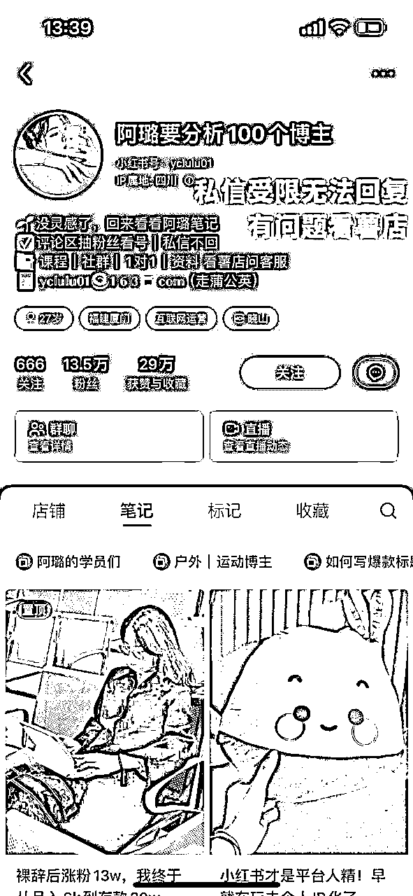

# 风向标拆解第 2 期--小红书教人赚钱的博主在玩些什么-高杰

> 来源：[https://geu1ykwep8.feishu.cn/docx/UMhadMEp8ow7uqxUDZPcL6YHnKg](https://geu1ykwep8.feishu.cn/docx/UMhadMEp8ow7uqxUDZPcL6YHnKg)

教别人赚钱是最好的赚钱方式

只要存在信息差和认知差，那教人赚钱的生意就永不会过时！特别是当我们身处一个不确定的时代，之前我刚毕业入职券商工作的那几年其实我特别不理解，那些提供投资服务，提供所谓内幕信息的人为啥他们会把赚钱的信息分享给其他人！但是自从了解到他们提供的服务以后，我恍然大悟，股民投资能不能赚钱还真不好说，但是哪些提供工具和投资服务的的比如指南针，东方财富，同花顺都上市并且市值都不低，还有创业者一大堆同时也养大了诸如I黑马，各种财经自媒体等等

那在小红书上教人赚钱的博主到底在玩些啥，我们一起来扒一扒

总的来说创业、商业类博主的变现方式包含以下几种方式

1、售卖项目

2、付费社群

3、售卖课程

4、咨询服务

接下来我会分别从以上几个方向拆解几个比较有代表性的小红书博主

## 一、售卖项目（账号：hi小王同同学）

#### 基本情况

账号：hi小王同同学

内容形式：短视频和图文还有直播，以短视频为主

变现方式：招收加盟商和学员

#### 1 、流量怎么运营?

1.1目标受众：

年轻女性，关注美容、医美领域的用户，同时在内容制作上包含了加盟商的合作信息，他的账号核心目的是通过内容去吸引那一批想创业找项目的人群

#### 1.2 内容定位：

针对医美创业的空姐，分享个人创业故事、项目案例和经验。该博主的定位是一个离职的空姐独立女性创业的人设

#### 1.3 内容策略

内容类型： 视频为主，配以生动的案例和经验分享

频率： 每周发布2-3篇内容，保持持续性更新

互动： 积极回复评论，与粉丝互动，促进用户参与,从评论区可以发现既有终端的用户的咨询，也有加盟商主动的询问项目信息的情况

#### 1.4 直播

*   首次开播时间：2023年12月21日

*   直播用标题：

| 12.21 | 空姐创业：如何用一个月赚到100万的经验分享 |
| 12.22 | 赚到人生中第一个1000万是什么感觉？ |
| 12.23 | 赚到1000万感悟：赚钱的本质就是会卖东西 |
|  |  |

*   直播场次：

*   开播时间：每天下午6点开播

*   直播时长：2-4小时

### 2、 产品怎么解决?

#### 2.1项目介绍

*   轻医美（植发）项目： 重点体现投入成本低，做的是植发类项目，利润空间足够大，回本周期快

*   特色： 个性化服务，项目效果可视化，效果前后对比特别明显

#### 2.2客户案例

*   案例分享： 利用真实案例演示项目效果，增加信任度。

*   用户参与： 鼓励客户分享使用经验，形成用户社区。

#### 2.3加盟商成绩

*   合作模式： 提供培训和支持，分享经验，共同发展。

*   成绩： 分享加盟商的成功案例，吸引更多加盟商。

### 3、利润怎么核算?

#### 3.1 成本分析

*   运营成本： 人员、设备、推广费用。

*   固定成本： 租金、工资。

（数据来源于网络仅供参考）

#### 定价与盈利模式

*   定价策略： 竞争性但有品质保障，根据不同项目制定不同价格。

*   盈利模式： 利用医美项目和加盟费用实现盈利。

#### 市场份额

*   竞争地位： 针对特定年龄和兴趣群体，占据该细分市场份额。

产品的客单价是万元以上，结合公开的数据显示植发类项目的毛利率能做到90%以上

### 4、项目如何做&如何放大

#### 4.1 拓展服务

*   新项目： 推出新的医美服务或相关产品。

*   多样性： 提供更多针对不同需求的医美项目。

#### 4.2 地域扩张

*   本地化运营： 在不同城市开设分支机构，满足更广泛的客户需求。

#### 4.3 品牌合作

*   与知名品牌合作： 提高品牌影响力。

*   跨界合作： 与时尚、美妆等领域品牌合作。

#### 4.4流量端项目如何放大

*   通过搭建矩阵账号进行放大（短视频+直播）

*   搭建达人分佣合作模式共享收益

### 5项目结论

目前打造个人创业ip成为各大品牌和项目的流量密码，特别是突出女性创业者这个标签，在小红书上很受用

## 二、售卖课程/付费社群（阿璐要分析100个博主）

#### 基本情况

账号：阿璐要分析100个博主

内容形式：账号拆解

变现方式：课程售卖/付费社群

## 三：咨询服务

付费咨询策划服务，这也是非常好的变现方式。

由于时间紧张暂时没办法把我罗列的小红书上教人赚钱的 创业博主的内容一一拆解完，但是后期我会持续更新这个内容和更多的案例

总体而言，作为一个在小红书专门教别人赚钱的创业博主，成功的关键在于深入了解受众需求，提供有价值的内容，并建立起对你品牌的信任感。同时，灵活适应市场变化和不断改进内容，将对你的生意长期健康发展起到关键作用。