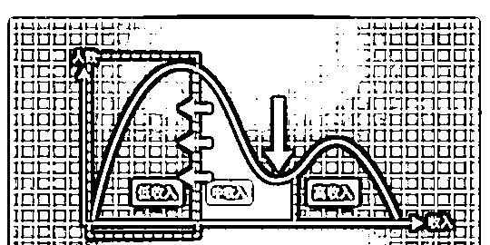
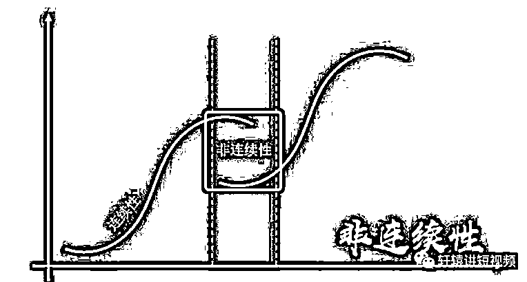
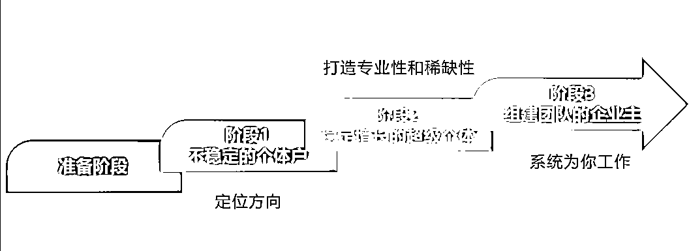
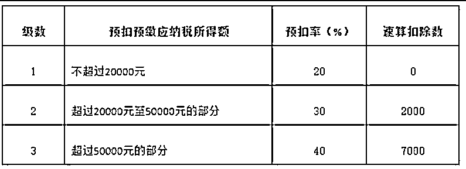

# 《自由职业者入门手册》

> 来源：[https://mkfwp3u79v.feishu.cn/docx/Uia8dIhUxoTznXxJ2Q5cMBsxnEe](https://mkfwp3u79v.feishu.cn/docx/Uia8dIhUxoTznXxJ2Q5cMBsxnEe)

# 自我介绍

我是七小，99年的深圳靓仔，知识管理专家。

精通搜索、采集、内容整理、关键词挖掘，擅长把碎片化信息整合成体系化的知识产品来变现。

江湖人称生财课代表，专业解决生财新人圈友的各种问题，致力于帮助圈友发挥好生财有术的价值。

微信：rickea150，添加请备注：生财圈友。欢迎交流。

公众号：七小的人生游戏攻略

# 一、手册使用指南（推荐电脑查看）

自由职业已成为时代趋势。

面对社会内卷和职场压力，越来越多的年轻人选择了从事自由职业，觉得自由职业赚钱多还自由，不少毕业生甚至将自由职业作为毕业后的第一选项。

但是你真的适合从事自由职业吗？

如果你从未了解过自由职业，或者听说过，有入门的想法，可以从【二、你适合从事自由职业吗? 】开始，对自由职业形成初步了解，明白自由职业的吸引力和门槛，判断自己是否适合成为自由职业者。

如果经过了解，你发现自己适合自由职业，那么以下章节可以帮助你解决这些问题：

【三、自由职业如何赚钱？】：自由职业者到底是怎么赚钱的？搞清楚逻辑，才能真正赚到钱、有稳定收入。

【四、自由职业的发展路径】：自由职业发展前景如何呢？

要成为一个自由职业者，需要做哪些准备、具备什么样的能力？

如果你是刚刚入门，可以先去考虑阶段1，根据兴趣做出一些尝试；

如果你想进一步提升，可以去学习如何进入阶段2成为超级个体，获得稳定的收入，并更进一步组建自己的团队，进入阶段3。

【五、自由职业者的财务和社保问题】：初入社会，或者是突然离开职场，不知如何解决财务和社保问题，这里提供了常见问题的解决方案。

【六、如何打造健康的生活系统】：在赚钱之外，自由职业者还会面临很多生活中的现实问题，这里帮你打包解决，让你没有后顾之忧，专心做好自由职业。

【七、在哪里寻找项目，开启自由职业之旅？】：最后，要开启自由职业、寻找自由职业的工作，可以有哪些资料和信息呢？这里整理出工具包和信息源，助力自由职业之路。

# 二、你适合从事自由职业吗？

## 1）重新认识自由职业

### ①自由职业到底是什么？

什么是自由职业者？

根据百度百科的定义：自由职业是社会化用工模式下的产物，特指摆脱了企业与公司的制辖，自己管理自己，以个体劳动为主的一种职业，譬如律师、自由撰稿人、独立的演员歌手等。

说白了就是，独立工作，不属于任何组织，不需要进公司打卡上班，自负盈亏的工作模式。自由职业在英语中叫做 “Self-employed”，也就是自己雇佣自己，香港人称之为“自雇人士”。

作者：未来工作研究院

原文：2022职业者白皮书

自由职业这个概念相当容易理解，简而言之就是个人雇佣自己。过去，自由职业并不常见，但近年来却愈发流行。自由职业为什么会兴起呢？我们需要深入探讨一下时代潮流对其的影响。

### ②时代趋势与职业动向

#### a.时代变化，中等收入阶层缩减

以前社会的收入是山丘型，中等收入人群最多，只要你有个文凭，然后各方面能力还凑合，进入到一个大企业，年入20-30W并不是难事，熬个5-10年，到一个小领导，年入百万也不是没有可能，因为以前企业都在蓬勃发展，有大量的机会，需要大量的人才。

而现在社会的收入分布即将会进入M型结构，就是中收入人群被无情压缩了，大部分转化成了低收入人群，有少部分人通过一些你曾经看不懂的方式成为高收入人群。

我们现在需要做的第一件事就是：意识到这个时代要开始变化了，承认并接受变化真的非常重要，只有拥抱这个时代，你才能抓住机会继续留在中收入区域，甚至可以越级到高收入人群。

而如果你的观念停留在过去，一心想着努力高考，然后靠着一份不错的学历，或者努力做一个忠诚的打工者就想继续保住自己的收入，已经越来越不可能了。

毕竟现在滴滴开车和送外卖这两个行业，已经被失业的中年人挤爆了。目前可能主要还体现在一二线城市，而如果一旦大城市这样，更多的曾经的精英和大学生都会流向三四线小城市，向下压缩，那么他们将会取代谁的饭碗？

所以如今还在职场的你，要做的第一件事就是接受这个时代随着发展的变化，而不要把一切都当成危言耸听，然后掩耳盗铃。

作者：老瞿Qu

原文：创业2年，给还在职场打工的你的一封信

#### b.第一曲线与第二曲线

连续性就是今天做的事情跟昨天差不多，明天要做的事情跟今天也差不多，几乎是由惯性推着进行前进。

我们先把这条曲线，叫做“第一曲线”。

但要知道，按正常的规律，任何曲线都有走下坡路的时候，尤其是现在的经济大环境下，第一曲线往往都是我们年幼无知时候选择的，长远来说大概率并不是一个好的选择。

是要一条路走到黑，被迫走到下坡时，再被迫转型？

还是要在斜率并不高的第一曲线，干到退休？

亦或，选择主动破之？

在第一曲线中间时，就主动构建第二曲线，让人生有更精彩的机会？

所谓不破不立，不一样的人生，就需要主动去创建这第二条曲线。

第一条曲线与第二条曲线之间重叠的那一小段时间，就叫“非连续性”。

因为当你主动出击，种下这颗种子时，才有可能会出来第二曲线。

开始了，就有可能，不开始，就永远没可能，很简单的道理，难道不是吗？

作者：轩辕

来源：如何使用生财完成自由职业转型

#### c.自由职业发展的条件

自由职业者生存的环境条件

1）首先是社会财富的充足。在一个贫瘠的社会里，自由职业者是无法生存的。

2）其次是社会的多样性和包容度。只有在允许不同形态的生活方式存在的社会里，自由职业者才能过得自由自在、如鱼得水。

3）再次就是社会的不确定性的增加。

未来的时代，很有可能是一个“不确定性”越来越高的时代，而与之相适应的自由职业者，也理当在未来的时代中越来越有优势和价值。

作者：未来工作研究院

原文：2022职业者白皮书

#### d.自由职业发展的趋势

在国内，官方通常将自由职业称为灵活就业。截至2021年底，中国灵活就业人数已达到2亿人，占比相当可观，自由职业市场呈现出更为明显的趋势，一方面，自由职业契合宏观环境发展，另一方面，相关岗位也呈现出一些显著特征，值得我们关注。

自由职业符合宏观环境

1）政策环境：政府加强灵活就业服务规范、新就业形态劳动者权益保障的趋势明显。

2）社会环境：灵活就业可作为人才蓄水池发挥作用，为稳就业不断注入新动力。

*   新一代就业群体涌现：灵活就业群体更年轻，就业观念更个性化，倾向于更为自由、灵活的新型就业方式。

*   企业用工成本逐年增加、新用工需求凸显：企业更注重优化用工管理结构，根据不同发展阶段、业务需求、项目周期进行人才匹配，以精细化进行用工成本管理。

3）技术环境：数字化技术的应用可实现灵活就业供需两端的即时调动和精准匹配。

作者：亿欧智库

原文：2022中国灵活就业新洞察报告

新型灵活就业职位特点

1）依托于数字经济发展

*   新型灵活就业招聘需求在华东地区的增长更快

*   与数字经济关联度越高的行业和职业，新型灵活就业职位渗透率越高

2）新型灵活就业职位的特征：

相较于传统职位，新型灵活就业职位

*   对求职者的学历和工作经验要求更低

*   可能提供的工资更高

*   提供的福利水平更低

作者：暨南大学经济与社会研究院-智联招聘

原文：2023中国新型灵活就业报告

总体而言，随着时代的不断变化，我们需要积极接受这种变化，主动打造人生的第二曲线。自由职业是一个可供选择的路径，它与我们对美好生活的追求相契合。

在重新认识自由职业的过程中，有人会担忧，自己年龄比较大，也没有什么技能，是否能够胜任自由职业呢？那么，自由职业究竟是否需要很高的门槛？

## 2）自由职业是否需要很高的门槛？

自由职业是否需要很高的门槛？

事实上，其实谁都可以做自由职业。初入自由职业的门槛并不高，你需要做的是要跨过自己心灵的门槛和具备突破更高门槛的意识。

1）年龄门槛不高

很多工作和岗位都存在年龄门槛，超过某一年龄企业就会避免录用。而自由职业没有任何年龄限制，只要你愿意，有一技之长，即使 35 岁甚至 50 岁，依然可以在自己定位的方向一直进行自由职业，没有外界对年龄的偏见和束缚。

2）身份门槛不高

在当今社会，弱势身份群体总是更容易遭受来自用人单位的打压，比如女性身份、母亲身份，低学历身份等或多或少遭受用人单位的歧视，这不仅提高了弱势群体开启职业生涯的门槛，也带来极大的压力。

而在自由职业，身份无足轻重，你可以是女性，可以是带着孩子的宝妈，也可以是才毕业没有实习经验的大学生，只要你有一门傍身的技能，都会受到客户的认可。

3）经验经历和相关背景门槛不高

做自由职业，很少一步登天，但是也不需要万事俱备，没有对经验经历和背景情况的硬性要求。

作品和技能是一点点修炼起来的，最开始可以从低门槛的简单文案入手，在积累一定的经验之后，你可以尝试接下更高难度的任务。每一次任务经验的叠加都会提高你的客单价，从而让作品和技能都逐步过渡到更高水平。

4）需要跨越最高门槛

但是并不意味着无论谁都可以在自由职业领域游刃有余，自由职业的大门没有门槛，欢迎任何人，但是随着自由职业的深入，我们需要迎接一个个挑战——跨越更高门槛。

自由职业本质上和传统职业一样，需要有立身的技能，辅佐自律，让成长的速度更快。同时注重渠道和人脉的开拓，一个稳定良好的接单渠道必不可少。对自己高标准的自由职业者们需要突破自己，跨越修炼自己，从而达到更高水平的门槛。

作者：未来工作研究院

原文：2022职业者白皮书

自由职业似乎是一项人人都能尝试的工作选择，但这是否意味着自由职业准入门槛低，任务多而杂，以至于大家都望而却步呢？与那些普通、可替代性强的工作不同，有很多人向往着自由职业的生活。

## 3）选择自由职业，能过得有多自由？

6个成为自由职业者的原因

1）重拾对生活的热爱

步入社会后，往往有这样一种感受：在快节奏的工作中，我们错失了太多生活中的美好。也许是黄昏后迷人的晚霞，而你还在写字楼里继续加班；也许是一顿营养丰富的早餐，但你因为要赶班车只能啃面包；也许是临时的一项任务安排，使你错失与亲人或恋人的节日团聚。

枯燥固定且不自由的工作让很多职场人感到疲倦，当初看重的那份踏实稳定，如今也成了感受生活的羁绊。与其在这样的状态中将自己对生活的热爱消失殆尽，还不如挣脱樊笼，飞往自由的原始森林。

2）自由支配时间

自由职业者的“自由”并不是绝对的，而是相对的。自由职业者的“自由”依附于“职业”存在，并与之相辅相成。在展开这个主题前，先敲醒一下想从事自由职业的人，自由可不是你想干嘛就干嘛，而是极度的自律加极度的享受。

如今选择自由职业的人群越来越多，不仅是因为看到自由职业好的发展前景，更是因为他们本身有着超强的认知能力，能够通过自律规划好自己的工作和生活。在保证超出业内水准的工作能力下和经济收入稳定的情况下，才能按照自己的意愿去享受理想中的生活。

3）陪伴家人

成为一名自由职业者意味着你不再受公司制度的约束，可以有更多的时间和空间去陪伴照顾家人，可以尽自己所能，不给家人和自己留下遗憾。

4）远离办公室政治

很多职场人都逃不开办公室政治，因为身在局中想要独善其身真的很难。

而自由职业者得益于工作性质，他们往往能独立完成工作任务，与之交涉的无非就是对接的客户。无需参与到过多人际关系交往中，不用进行低质量的社交，有更多的时间和精力维护自己的象牙塔。

5）减少内耗，更加专注

职场一向人多纷杂，诸如出差应酬、上级临时安排的任务、同事之间的闲言碎语等等，会打乱自己的节奏。如果把内卷比作人与人之间的战争，那内耗就是自己与自己的战争，用不着别人动手，自己就把自己拖垮了。

而，自由职业可以选择自己热爱的工作，利用自己的专业技能优势去完成任务。能自主安排时间，而且在完成任务的基础上不被他人打扰。而且成为自由职业者，你只需一台电脑和一部手机，就能随时随地“上班”，不需要看老板的脸色行事、不需要回那些无聊的邮件、也不需要完成那些“政治任务”和走那些内耗的流程。

6）自己做决策

各种决策贯穿我们的一生，而能做决策的人往往更能掌握自己的命运。

传统意义的职场里，虽然可以提出自己的想法和观点，却很难成为一名真正的决策者。

而这一点，自由职业者可以做到。因为自由职业者是独立的个体，从选择行业方向到与客户对接项目再到任务的完成，他们都可以自主完成，按照自己的想法行事就行，无须看无关人等的脸色。

作者：未来工作研究院

原文：2022职业者白皮书

自由职业的显著优势在于拥有丰富多彩的"自由"体验。然而，许多从事自由职业的人却感慨，自由职业并非真正自由。这究竟是出于何种原因呢？

## 4）自由职业真的自由吗？

自由职业的风险和压力

1）收入渠道不稳定。所有业务和收入都需要自己去争取去获得，有时候还需要自己交社保。

2）没有上下班的时间规定。其实无形中也就把工作时间蔓延到了全天，许多自由职业者其实是很忙碌的，越是成功的自由职业者，越是没有“自由”。

3）对于技能的高标准。技能是自由职业者的根基，自由职业者通过自己的技能和在行业领域上的积淀助力自己实现自由，可以说，自由职业者的技能需要对市场需求有灵敏的反应。

4）社交上的孤独与闭塞。由于自由职业者一般在家办公，所以缺失了职场社交这一环，缺少了所谓榜样，典型的激励，一定程度上会带来眼界的闭塞。

5）家人不理解。这样的不理解，往往让自由职业者无法对家人清楚地解释自己的工作内容与工作形式。对于本身已经脱离了固定的企业架构，游离在职场社交圈外的自由职业者来说，后期会带来阻碍和压力。

作者：未来工作研究院

原文：2022职业者白皮书

自由职业者的认知挑战

人的思维方式是顺序、串行的，不能同时做多件事。一个人工作，除了处理主要业务以外，还要面临很多决策和管理工作。这些额外的工作大部分涉及元认知，比普通工作更消耗认知资源。此外，工作种类、数量增加，上下文切换的资源消耗也会凸显出来。人的有限理性难以应付一个人工作的巨大负荷。

一个人生活或者做事，看起来很自由，但太多的自由是沉重的负担：你一个人要决定所有的行为、所有的进程、所有的效果。面对如此巨大的难题，你很可能行为瘫痪。行为瘫痪之后就会什么也不做，发呆、无聊、漫无目的地游荡。

有一个团队或者在公司里或者在家庭里，都会有节奏有流程有常规事务，看起来琐碎、消耗，但你有目标。人都需要一个目标感，不然就觉得自己在人世间游荡。这种漫无目的的游荡，是非常非常难受的。

作者：朵爸

原文：谈谈自由职业的一些风险: 自律，成长，社交人际关系

自由职业被赋予了“自由”的名号，但是否真的如此呢？或许，自由的同时也伴随着一些挑战和门槛。

其中，我们面临的最大的挑战就是赚钱。

# 三、自由职业如何赚钱？

## 1）对自由职业赚钱的认知

自由职业可以理解为一人公司，你是自己的老板。

从打工赚钱到自由职业，有几个区别。

一个重要区别是，你从间接面对客户，到直接对接客户。

以前是老板对接客户，客户把钱给到老板，然后老板把工资发给你，你的收入是老板给的。

而自由职业中，你直接对接客户，给钱的是客户。

你从原来的只解决项目某一个问题，为老板服务，变成了现在解决客户问题。

另一个重要的区别是，以前是公司需要你解决什么问题，你就去解决什么问题；现在是你评估自己有什么能力，能解决什么问题，然后你把自己的能力宣传出去，吸引到需要你的客户，你满足客户需要，然后你赚到钱。

那么，赚钱的步骤应该如何拆分呢？

## 2）自由职业赚钱的步骤

①寻找个人定位

首先评估自己的能力、兴趣等，找到自己的优势，定位自己最适合的位置，明白自己能解决什么样的问题。

②筛选符合自己的思路的客户

有客户找到你的时候，你需要清楚对方的需求是什么，希望解决什么样的问题，你能不能解决，你跟客户是否适合。

有时候，你有解决客户问题的能力，但是你跟客户的价值观不一样，就算你解决了客户也不一定认同，这样的单子接了也不一定能让对方满意。不如一开始就找到适合的客户，双方一拍即合，合作愉快。

③满足客户需求

接单后，你需要花费精力洞察客户的真实需求，不断搜索调用内容，提出解决思路，设计一整套解决方案，并制定好计划、实施计划，解决客户的问题。

④打造能让自己的能力持续满足客户需求的收入模型

自由职业最怕的就是收入不稳定。

要获得稳定收入，一方面要打造自己的品牌，获取更多客源，另一方面，要扩大自己的能力圈，更好地解决客户问题，满足客户需求。

## 3）财富四象限

罗伯特清崎在《富爸爸 穷爸爸》中，提出ESBI四象限，对应4种人生和赚钱方式。

E象限【Employee】受雇者

收入靠别人给你发工资，为别人工作。本质上是在出卖时间，换取比自己创造价值少得多的钱。

这样的人在人群中占比为60%左右，是数目最多的。

S象限【Self-employee】自雇者

主要指自由职业者，通过自己的劳动获取收入。

自雇者为自己工作，同样在出卖时间，创造的价值都进了自己口袋。

这样的人在人群中占30%左右。

B象限【Bueiness Owner】企业家

拥有一个人力资本运转系统来为自己工作，让别人为自己工作，用人力资本赚钱。

即使自己没有在干活，也能获得收益。

企业家在人群中约占5%。

I象限 【Investor】投资者

投资者拥有金钱，钱为你工作，用钱来赚钱。

由此，自由职业者的发展路径，也基本可以遵循E→S→B→I的路径：

克服对稳定的依赖，从打工族转型为自由职业者获得自主性；然后让渡一些自主性，做大规模，成为企业主；再进一步，找到合适的企业主，进行投资。由此从主动收入转为被动收入，获得更多的财富和时间。

以下对于自由职业的发展路径思路的阐述，也将基于四象限的转化，从普遍自由职业者（从尝试到建立品牌），到成立团队（这里的团队可以类比为公司）。

由于投资人性质比较特殊，本文将不会介绍投资人阶段。

# 四、自由职业的发展路径

## 准备阶段

### 1）从事自由职业要做好哪些准备？

从事自由职业要做的准备

1\. 笔记本电脑

笔记本电脑，最好要有一台续航还不错的轻薄本，5000-6000左右价位的完全够用，最好是14寸左右，便携。

轻薄笔记本，可以随时办公，有时候在家里面呆久了可以出去外面咖啡厅坐着，咖啡有提神作用，更容易专注做事。不建议去奶茶店，奶茶店吸烟的多，若是咖啡厅吸烟的多，那也不建议待。

2\. 电脑支架

笔记本电脑，外出携带可以考虑入手一个支架，方便收纳的就行，一般十几块钱就可以了，方便调整手的位置，有些咖啡厅还有奶茶店的桌子并不适合放电脑，可以利用这个工具，给自己调整合适的角度。

3\. 人体工学椅

长期久坐，椅子很重要，这里比较推荐入手一把人体工学椅，不算很贵，性价比还行，比普通椅子做的舒服得多！

4\. 硬件设备

我是有两台笔记本，没有入手主机，一台游戏本用来录制视频或者说要用到性能的时候会用到那一台笔记本。外接一个显示器，两个电脑可以随时切换，长期用小键盘打字是肯定没有大显示器大电脑看起来舒服的。

有钱的可以给显示器加一个机械臂支架，没钱的可以考虑入手一个小柜台（根据自己身高来就行了。）

键盘推荐双飞燕的，耐用。

5\. 一定要搞个网线，网线100M（兆）的就够用！

6\. 准备一笔资金，可以最少保证你过3-6个月，从而不出现经济危机，最好是3-6个月，多了也不行。

作者：侠狼

原文：一个人的创业要注意什么？

设备齐备、资金准备充分，心态调整到位，这时候，我们便可以迈出自由职业的第一步，正式开启这段新的职业生涯。

## 阶段1：不稳定的个体户

### 1）阶段特点：尝试定位，探索方向

①缺乏明确方向

许多人踏上自由职业的征途，最初可能源自于个人的副业。在发展副业的过程中，有些人发现副业的收益超过了主业，因此选择独立创业。然而，这个方向并不确定是否可持续发展；还有些人，由于对自身认知不足，对自由职业的了解也较有限，不清楚自己应该做什么。

在这个阶段，虽然相较于打工已经更为强大，但仍未走上正轨，个人偶尔也会感到迷茫，不知道未来的道路如何选择。

②缺乏稳定客源

此时，个人的能力有限，流量渠道也不够稳定，时有时无，可能某个月赚得多，而另外几个月却入不敷出。缺乏稳定的客源，导致面临着收入来源不可靠的问题。

因此，这一阶段是最适合探索自由职业方向的时期，试错成本相对较低。主要目标是探索各种项目，不断调整和挖掘，寻找个人的明确定位。

那么应该如何来定位呢？

定位的途径

1.基于意图来定位

明确你的需求，你要做什么，然后根据你的需求（比如赚钱），去找能够帮助你实现这一点的用户需求。通过解决用户需求，为用户创造价值，进而来满足自己的需求。

我们可以通过从“人群、场景、用途“这三个方面，去不断的细分用户需求，然后做组合排列的方式，在什么场景下，为什么人，解决什么问题，来找到你定位的切入点，然后用”需求是否真实、市场空间是否大、竞争小”这三个标准来协助你确定目标市场。

2.基于自我来定位

确定了目标市场后，我们还需要考虑它是否适合自己。

看看热爱，你是否足够热爱，能够让你一直勇往直前；

看看资源，是否得到了延伸，你做这件事情，有没有过往资源的支持；

看看价值，你做这件事情的机会成本是多少，值不值。

3.基于环境来定位

环境的变化在我们“成事”这件事情上也非常重要，这需要我们学会审时度势。

通过“差异化”策略，让自己在一片红海中，也能找到自己的价值高地，形成独特的点，让你和其他人不同。

通过“找蓝海”策略，让自己避开红海市场，去找一个没有那么卷，未被满足的竞争小的蓝海市场。

作者：小宝

原文：如何精准的找到自己的定位

已经了解了定位的基本原则，那么在具体操作上，我们可以利用一些工具来辅助定位。

### 2）借助工具：定位优势

盖洛普优势测试

做这个测试（最好还能找到靠谱的人解读）可以帮你清晰自己很多的行为规律，从自己习以为常的思维模式、行为模式，意识到这些模式里有哪些自己不曾发觉的优势，以及有哪些限制你的思维盲点。

1.排除不适合自己的工作内容或工作方式，减少试错成本和很多不必要的内耗

2.定位自己的内耗、行动力不足的原因是什么

3.定位亲密关系相处的障碍

4.定位团队管理上的内耗卡点

5.知道自己的动力来源，如何给自己充电，做什么事更容易坚持

6.找到适合自己建立影响力和获得流量的方式

7.定位团队中的成员优势，如何激励下属

作者：叶叶_优势教练

原文：盖洛普是什么? 一个生财有术全团队都在用的工具

得到职场优势测评

【适用场景举例】

1.职场新人，找工作应聘：测评能帮你找到优势、扬长避短，精准匹配到具体岗位要求。

2.遭遇职场不适或瓶颈，想发展得更好：测评能帮你精准定位问题，提出解决问题的正确思路。

3.职场管理者，想和别人更好地合作：这套测评能帮你定位领导潜力，通过开放自己打开工作界面，更好地发挥潜力。

作者：Violen/昱龙

原文：得到职场职场优势测评文字整理

利用工具了解个人定位和优势之后，接下来的关键是在实际项目中不断提升技能，同时灵活调整方向。然而，许多人通常在迈出第一步时感到困惑，不清楚如何找到一个合适的项目作为自由职业的起点。下面是一些挑选项目的方法。

### 3）做出尝试：如何从0-1寻找项目

只有你开始接触项目，选择好的项目，并用好项目，才能一步步接近理想的自由职业者状态。

从零开始到挣到大钱

从零开始到挣到大钱，可以分成三个典型阶段：可行性分析，小规模验证，大规模投入。

按照三个阶段做，是稳妥，可复制的节奏。试图跳过其中一步，都容易掉坑。

*   想跳过第一阶段，全靠实际行动来试错，这样显然太盲目，容易亏钱。

*   想跳过第二阶段，感觉可行就大量投入，这样容易遇到重大失败，浪费了很多时间和钱，从此一蹶不振。

*   如果想跳过第三阶段，那最多只能挣点小钱了。

第一阶段：产生想法，放下偏见，接触项目

第二阶段：掌握技能，克服困难，动手执行

第三阶段：渴望大钱，尊重小钱，保证投入，符合趋势

作者：朝花拾者

原文：赚大钱必过的十关，你倒在了哪一关？

项目选择的参考维度

1）扬长避短

任何项目、企业，本质上就是：你完成相同的价值生产，效率是否比其他人高。

越高意味着你的利润越大，反之则是勉强生存，甚至亏本。要注意，时间也是最大的一种成本，也是占比很重的效率计算因子。

从更小的自由职业来看，甚至，情绪，都是一种成本，很容易被忽视。在集体企业里个人情绪不容易产生结果影响，但自由职业产生的影响就会比较明显。

所以做擅长的事，你的成本就会更优于其他人，你就更容易赚到钱。

啥叫更擅长的事？

*   有天赋

你轻轻松松就能比别人干得好，学得比别人快的事情。

这样你有更大概率完成一步步的必要推进动作，更大概率建立正循环。

*   你热爱

你可以废寝忘食得干，没收入也乐意，别人干起来痛苦，你干起来快乐。

这样在开头难的阶段，你有更大概率坚持下去，因为做这事你体内比其他人会分泌更多的多巴胺，往往离变现，就差那么几次无收入时候的执行。

2）启动成本低

启动成本多少，决定了，你有多少次上场机会。

成本足够低，就意味着你有无数次上场机会！只要你不放弃，大概率就能有一次成功，就够支撑你未来所有梦想了。最坏结果，即使一个项目失败了，也不会有很大损失。

这就是正确的事重复做，最后就能出来的效果。

3）边际成本低

边际成本指的是每一单位新增生产的产品带来的总成本的增量。

需要越做越轻松，投入时间能越来越少，甚至后期把部分环节交给合适的人，自己时间投入能极少或为0。复制用不了多少成本，可以快速复制。随着赚钱增加，成本投入不会明显增加，多为一次性投入，收入趋势走的是曲线，不是线性。

要满足这些，只能挑边际成本低的项目，通俗说就是，你增加规模时，投入的成本低，才能做到。

4 规模化容易

规模化，就是你可以从1个变成2个，从2个变成20个，从20个变成100个……而单个收益变化不会很明显，最后获取总收益。

对个人或小团队项目来说，需要选规模化容易的。

就要以边际成本低为前提，规模化才会容易，实体店边际成本就高，每增加一家店，都需要不少成本。但反之线上电商，就容易了，前端叫矩阵，后端叫店群。最后都是完成客户引流，完成交易，完成交付。现在物流这么发达，收益不见得比实体店低。

都是完成商品交易，本质上变化的只是交易链路、结构。

任何生意，只要能规模化的，都不是小生意。

作者：轩辕

原文：项目选择维度推荐

普通人如何通过项目实战，成为自由职业者？

多试错

在这里有一个大前提，绝大多数人的「成长阶段」都中止在这里的大前提，

做任何项目，都是一个大浪淘沙的过程，二八定律永远存在，总有人能赚到钱，总有人赚不到钱，这些人差在哪？

你真的「用心」做了吗？

你真的「提问」了吗？

你真的「坚持」足够长的时间了吗？

「用心」是个什么概念

很多人真是把教程贴他脸上，他都能给你做出来一坨屎，很多讲过的东西，还得再讲一遍

又或者自己的想法太多，明明听话照做就可以拿到结果，非要用自己的思路去折腾，最后做不起来又摆烂不想干了，真的是「但行好事，莫问前程」，

二八定律里，一大堆八就在这了。

「提问」是个什么概念

不看教程之后，是不会提问，甚至是不好意思提问，花钱找人学习，遇到问题了，怕自己打扰到他，埋头在那里钻研了半天，而你这半天功夫，真的只是老司机一句话的事情，还有自己拿不到成绩，就不敢提问的，你想想你花这钱是干嘛的，就是花钱买时间、买经验的。

当然，问一些垃圾问题的，就是上面用心的事了。

「坚持」是个什么概念，

现在短平快的项目已经很少了，且这种项目一定不会太长久，没有哪个好项目是不需要时间沉淀的？

如果他一直能稳定几天内赚几万，他为什么还要告诉你？

除非他已经沉淀了人力规模、资金规模等门槛，根本不怕你抄，你抄不走。

说到底，还是坚持后沉淀的结果。很多人真的是一个月换一个项目，这个项目干一个月没赚钱，就开始找下一个，如此反复，今年结束了，这种人赚到钱了吗？大概率没有，因为他是来做慈善的。

当你真正「用心」、「提问」、「坚持」后，

你还是没做成，那这个项目可能真的不适合你，有时候还是得信命。

你赚不了这个钱，那就别赚了，下一个更乖。

如果你做成了，那恭喜你，你已经完成最难的原始资金的积累，你可以拥抱更多的可能性了，

在我们试错过程中，只要你认真干了，许多能力是会逐渐递增的，眼界、格局同样也会打开，

这个时候，你肯定会发现你在某方面，或者做某件事时非常的得心应手，不一定要有多牛逼，但就是比同行好一点，可能是文案能力，可能是社交能力，可能是网感等，

这时候，你就可以开始准备兑换自己的天赋了，放大你的优势，或者干你真正想干的事，干活变得不再痛苦，实战会变成顶级享受，

作者：张柯Ker

原文：普通人如何通过项目实战，成为自由职业？

确定方向绝非易事，也不可能一蹴而就。在这里，我为大家提供一些较为简单的判断标准，方便大家在选择方向时有所依据。

### 4）可能的方向

在不稳定阶段，结合自己可能的优势进行尝试。

可以尝试在”洞察客户需求““信息差”“与人打交道”“特殊技能”等方面，探索适合自己从事的领域。

#### ①洞察客户需求：销售

在自己没有产品，也不想费尽心思研究的时候，可以卖别人的产品，通过对客户需求的洞察，帮客户找到省钱又有需求的产品卖出去，自己赚中间差价。

这个方向适合对人的需求敏感的新手入门。

圈友案例：

小蚁：高成交率的销售，本质是能量传递

#### ②信息差赚钱：整理

要是自己没有产品，也找不到合适的产品去卖怎么办？那就把虚拟的信息作为产品，赚信息差的钱。

利用自己内容整理和搜集信息的能力，把资料整理好，卖给没有时间整理或者懒得整理，但是又对资料有需要的人群，帮助他们节省时间，获得信息差资讯，赚信息差的钱。

对喜欢整理、擅长搜索、乐于分享的人来说，这是个很不错的方向。

圈友案例：

三恒：资料整理日均引私域180+用户，最重要的是提供附加产品/解决问题的方案

派大星：普通人如何通过信息差月入上万

#### ③中介服务

如果你对学习相关的方向不感兴趣，但是性格外向，还有一定的资源，能把手里的资源盘活，做好对接，你可以试试中介方向。

做好客户和供应商之间的桥梁，找到合适的供应商和需求方，帮助两人做好沟通，让双方顺利达成交易，收取中介费。

#### ④技能服务

这个方向适合有一定技能，且愿意去技能精进的人去做。

把一个市场有需求的垂直领域做好，做到顶尖。就算你不擅长打交道，技能达到一定水平，也会有人来找。

### 5）圈友案例

Lissa Tam：我是如何度过亚马逊创业这一年（经历/营收/时间管理/日常）

## 阶段2：稳定增长的超级个体

在前期不断尝试探索，有了比较清晰的定位后，这一阶段，要注意打造自己的优势，打造自己的个人IP和影响力。在打造个人IP的前期，我们可能没有思绪，这时候可以通过对标行业达人，拜师学艺，等到学成归来后，我们需要注重差异化竞争，打造自己的稀缺性，占据生态位，获得参与利益分配的资格。

随着能力的增强和业务的扩展，我们需要运用杠杆效应来提高生产力。通过在公域持续输出内容，不断优化产品，实现一份时间出售多次，创造被动收入。同时，一些琐碎事务可以考虑外包或聘请助手来处理，以便将更多时间投入于高产出的事务。

### 1）阶段特点：积累实力，打造专业性和稀缺性

找到自己的定位后，这个阶段要在该领域投入更多精力，积累实力，业务聚焦，打造明确的产品体系，获得稳定的流量渠道。

营收=流量×客单价×转化率×转介绍/复购。

因此想要获得稳定收入，需要从流量增加、转化提高方面入手，增长点是清晰明确的。

然而，一旦我们在特定领域积累了一定的实力，就会迎来另一个问题：如何寻找个人定位，打造个人IP呢？

### 2）如何寻找个人定位，打造个人ip

#### ①如何对标复刻

怎样找到合适的对标？

从个人商业的角度，具体可以按照以下三步操作。

第一步，入行不久，对标自己的导师。

因为足够熟悉，你可以贴身观察导师，不懂就问。

第二步，小有积累，对标行业优秀前辈中与自己起点类似、能力相仿、拿到结果的人。

在跨界到自媒体学做视频号时，我对标的是“润宇创业笔记”的主理人王润宇。我们都有创业经验和讲师背景。在起步阶段一字一句地拆解他的短视频和直播脚本，省去了我大量的摸索时间。

第三步，找到方向，不管山高路远，对标人生目标的终局。

我选择的方向是研究驱动的商业顾问，需要兼顾商业和内容，高瓴资本的张磊、华与华的华杉，还有冯唐、刘润都是我的终极对标。他们各自做到了行业顶尖，学习他们的专业能力和自我经营理念对我有不少启发。

如何拆解对标？根据四个字——远近高低。

远，调查研究。搜索公开渠道的图书文章、演讲分享、媒体报道等内容。我经常能在对标人物的公众号早期内容里挖掘到有价值的信息。

近，深入体验。购买产品或服务并体验，加入社群，直接访谈。用户视角的感性体验和观察互动能带来完全不同的启发。

高，学会提问。提出好问题比找到答案更重要。一层一层不断提出问题，直至把握商业现象的本质。

低，勤于复盘。复盘是逆向拆解的第一步，复盘还原流程要素，有时候你苦思冥想的答案就在流程细节里。

作者：陈欢

原文：单干：成为超级个体的49个关键动作

#### ②如何打造自身稀缺性

怎样才能提升自己的稀缺性呢？

我给大家提供以下三个具体的优化方向。

第一，优化效果。理解知识不稀缺，效果才稀缺。用尽一切办法对效果负责。

我常常感觉知识付费就是个伪命题。知识是不需要付费的，效果才需要付费。千万不要直接出售知识，要始终瞄准效果。你不是在写一本书，而是通过文字让别人少走弯路。你不是在讲一堂课，而是用课程的形式提高学员的能力水平。以终为始，方得始终。

对普通人来说，比较合理的路线是先消化、吸收知识，再付诸实践，等拿到阶段性的成果后，回首来时路，给大家带路，出售指向效果的解决方案。这就是简单有效的知识变现路径。

第二，突破圈层。理解没有绝对的稀缺，只有相对的稀缺。

找到让自己能力相对稀缺的受众圈层。提升稀缺性是一个没有终点的旅程，不要幻想在过程中关起门来十年磨一剑，要向市场要答案。在能力攀升的路上，找到让自己稀缺的圈层。

突破圈层的两种具体方法。

一是定位自己的专业能力，寻找稀缺圈层。例如，在律师圈里你不稀缺，来到直播圈里，你是圈里人唯一认识的法律专业人士，他们想知道怎么签协议、付多少违约金，这些都要求助于你。

二是理解自己的圈层需求，寻找稀缺能力。还是以律师为例，你发现律师同行都有打造个人品牌的想法，而只有你率先勇敢地走出去学习和尝试，最终在抖音视频号积攒了几万名精准粉丝。这时，你再回到律师圈，教大家如何做好新媒体，会比专业的新媒体老师更受欢迎。

以上两种方法还可以综合使用，形成第三种方法：向外强化专业，向内彰显先进。

第三，保障确定性。

在高度不确定的环境中，确定性就是稀缺，设计确定性更高的机制。作为商业顾问，客户问我凭什么报价比别人贵，我说所有人里只有我有类似量级的大项目的成功经验，我的确定性比别人高，所以5000万元的项目，你愿意多花50万元，提高10%的成功概率吗？客户一般都表示愿意。

作者：陈欢

原文：单干：成为超级个体的49个关键动作

在探讨如何寻找个人定位，打造个人IP时，我们需要深入思考如何对标复刻和打造自身稀缺性。对标复刻不仅是模仿，更是学习他人成功之道。

然而，这只是第一步，更为关键的是借助杠杆，放大自身的价值。

### 3）如何借助杠杆，放大自身价值？

四种杠杆放大价值

建立多元收入的本质在于创造「多元价值」。多元价值，我们可以分为两个维度。往纵向发展就是创造「稀缺性」，大约对应传统分工当中的品牌。往横向发展就是创造「差异性」，大约对应传统分工当中的市场。

「稀缺性」决定你是否能成为佼佼者，而「差异性」决定你是否能活过这一轮。人事物间的差异性是与生俱来的，我们要做的就是去发现和培养它们。如果你觉得自己和别人相比，没有很突出的差异点。或许只是因为你目前的视角过于狭窄，比较的对象/场景选错了。

所有差异都有创造收益的潜力。把「差异」与「收益」连接起来的东西，就是「杠杆」。「杠杆」，就是有放大效应的「差异」。杠杆大致划分成 2 种。首先是分为：「外部杠杆」——因外部环境差异而产生的杠杆 和 「内部杠杆」——因内在特质差异而产生的杠杆。

外部杠杆可以基于：货币币值差异，购买力差异，城乡差异，文化习惯差异，市场特点，平台规则，政策，信息差，渠道关系资源，生活环境等等。

内部杠杆可以基于：年龄，性别，知识经验，自身技能，天生禀赋，价值观，性格倾向，身体素质，情绪控制力，伤痛复原力，心理稳定性等等。

先从内部杠杆里去找，然后结合外部杠杆来继续放大。即：价值放大率 = 内部杠杆 × 外部杠杆。

避开竞争激烈的地方，找到更适合自己的微环境，利用多维杠杆放大价值。

——这就是「错位竞争」

当我们已经顺利开展业务，赚到了第一桶金，光看到内外部杠杆就不太够了。之后要如何让业务更加稳健生长，最终建立持久的多元收入呢？

这就要提到杠杆的另外两种类型：「脆弱杠杆」和「反脆弱杠杆」

「脆弱杠杆」顾名思义就是，容易受到外部环境变化影响，有短时效性，状态不稳定，非本质的。

「反脆弱杠杆」就是长期不易变化，受影响后易复原，能自我增强，本质性，原理性的。

通过加强杠杆中各个要素的反脆弱性，就可以提高你整个系统的稳定性。

作者：华生｜在台北用错位思维做教育

原文：我如何从1到N构建多元收入，核心方法首次公开

三大杠杆放大价值

打工人，是出售一段时间的劳动，来换取报酬。

那么这样一来，就可以得到一个最基础的收入模型：收入=时间×单位产出。这是这个世界上大部分人的收入模型。

从这个基本模型可以看到，想要获得更多收入，只能从其中的两个参数入手：

一种是增加工作时间，也就是加班（多赚加班费）；

另一种是提升能力、增加单位时间的工作产出，在公司里则体现为晋升（多赚基本工资）。

但是如果把它当做人生唯一的收入模型，这两个参数很容易就会变成瓶颈。

因为首先，很显然一个人拥有的时间是有上限的。

其次，一个公司也好，整个行业也好，基本上是呈金字塔状的职级分布，绝大部分人晋升会越来越慢，直到停留在某个级别。

那要突破这些瓶颈，我们需要在原来的收入模型基础上，再加上一些杠杆。

1.时间杠杆

每个人的时间是有上限的我们要复制时间，或者说是用更长远的视角去理解时间的价值，而不是仅仅获取时间现在的价值。

2.管理杠杆

管理杠杆的本质，是用更低的价格去购买别人的时间。

所以购买各种提升自己效率的服务、软件、产品，来减少自己花费的时间，同样是一件有管理杠杆的事情。

相当于和其他人一起，雇佣了一个专业团队来帮助自己实现目标。

3、金融杠杆

前面提到的两种杠杆，还是从基本的收入模型入手，尝试突破一个人的时间瓶颈或能力瓶颈。金融杠杆则是跳出这个框架，在过往收入（时间×单位产出）的基础上，叠加的外部力量。其收入模型与杠杆率和收益率相关：

收入=（时间×单位产出）×金融杠杆率×收益率

使用金融杠杆，考验的是投资能力。

因为收益在被杠杆放大的同时，风险也被放大了。如果投资了差的标的，杠杆反而会带来更大的亏损。

而投资能力我觉得是每个人都要尽早学习和建立的能力，它并不只是那些有原始积累的人要关心的事情。

因为在一家公司做打工人，本质上也是用自己最宝贵的时间在投资这家公司。

而且和散户买这家公司股票还不一样，散户买股票可以调整仓位，打工人基本上就只能满仓了。

互联网这黄金二十年，造就了许多公司上市之后身价百万千万的普通打工人，有些人是看运气，有些人是真的眼光好。

所以投资能力带来的收入差异，或许早就在每一次Offer选择的那一刻就决定了。

作者：青十五

原文：分享一些最近的思考，聊一聊关于收入的模型

在谈论如何放大自身价值，打造个人IP时，我们不妨探讨一下可能的方向。

### 4）可能的方向

#### ①教育培训

如果你愿意研究事物原理，能研究得比较好，并且也希望把自己的价值传递出去，那么可以在教育类深挖，打造你的在这个领域的品牌

圈友案例：

鱼菇娘：从普通文员转型自由职业，3个月招募100个理财学员变现3万+

#### ②咨询顾问

如果你希望把事情思考地非常深入，成为某个领域的专家，帮助别人解决这个领域的关键问题，可以尝试咨询顾问，运用自己非常深入的知识，帮助别人解决问题。

圈友案例

苏姐 职场优势教练：优势教练做个人品牌，15个月变现120w+的经验分享

随着实力增强，业务扩大。在业务逐渐繁忙，难以应付的情况下，建立团队是一个明智之举。

## 阶段3：组建团队的企业主

### 1）阶段特点

有人说自由职业者的尽头是创业。

当你真的成为某个行业的专家，业务扩大，一个人根本忙不过来。一个人活成一个团队，其中是更多心酸。要学会把自己的活，找到合适的人帮你去做，把自己从具体的执行动作中解放出来。

组建自己的团队，你才能把精力留出做想做的事情，业务也能持续运转，品牌持续扩大。

此时要留出精力开辟多条业务线扩大营收，扩大规模，与人合作。

此时不光获得产品的收益，也从人力资本中获得一定的利润空间。

然而，随着业务的扩大，随之而来的是团队管理的挑战。

### ①自由职业者，如何从单打独斗，到与人合作/线上协作？

自由职业者前期习惯于一个人工作，组建团队时务必要转变自己的观念。

个人有限，团队力量无穷

1）一个人的力量是有限的，一个人的认知是片面的，不同的成长环境会带来不同的思考方式，不同的思考方式会得到不同的结果。

在跑通项目，筛选出同频的核心圈子人员后，组个主题局，尝试下头脑风暴，会收获到许多不同的思路。

脑暴的同时，把自身的项目经验，下放给这部分已经跑通项目的核心圈子人员后，小团队的雏形就已经出来了，后面可以及时互换一手信息差，保持项目头部的即时性玩法更新。

2）筛选大于培养，赋能真想学的人。

作者：张柯Ker

原文：普通人如何通过项目实战，成为自由职业？

组建团队的几点建议

1.如果想业务做大一点，那还是最好要有团队，未来赚钱门槛越来越高，双拳难敌四手，可以不一定立即组建团队，但要一个意识，逐步的把一些低价值的事情买别人的时间来干，你去做和思考更有价值的事情，你和你的业务价值才能越来越大。

2\. 作为创始人，要有一个预期，自己一个人要能去跑通项目的闭环，先赚到钱，积累一些收入，为未来组建团队做准备，比如提前积攒6个月要发放的工资。

3\. 通过对外分享，积累一些自己的影响力，让别人可以看到你的价值和潜力，可以为你未来组建团队打好基础，在生财里分享就是非常好的寻找创业伙伴的渠道。

4\. 早期多用线上兼职，虽然靠谱性差了一点，但至少能磕磕绊绊的让业务跑起来，在跑起来的过程中逐步优化团队和业务，到现在我也还在说，做业务，永远是一个一边开飞机一边修飞机的过程。

5\. 前期组建团队，不要对人有什么高要求，差不多就行。

6\. 如果自己有一些使命、愿景或者清晰的价值观，那一定要讲出来，能够吸引到很多同频的人，梦想还是要有的，让别人知道你的梦想，很多人都会来帮你。

7\. 开放的加入一些成熟公司的体系中，减少团队组建失败的风险。有一个圈友前几年来生财团队，作为独立项目孵化，今年业务爆发，年利润做到了八位数。他自己讲，感觉到生财对他最大的帮助就是早期什么都没有的情况下，直接融入到生财体系，不管是资金上、招聘上、工作环境上、心态上等，都会比自己单打独斗好非常多，特别是招聘上，候选人过来一看，哦，公司不小，办公环境也不错，还挺靠谱，这样顺利迈过了初创团队 10 人的槛，现在团队也已经扩充到四五十人。

作者：陈朝昌

原文：亦仁：一般的团队是怎么搭建起来的

组建初创团队要注意什么？

1）招到合适的人

制定明确的招聘标准，注重面试过程，不仅要看技能匹配，还要考察团队文化适应度。不凭直觉招聘，而是根据实际需求和能力进行评估。

2）明确职责，明晰分工

在团队建立初期制定清晰的工作职责和分工，建立规章制度，确保每个成员明确自己的责任范围。定期进行工作任务的梳理和分配，以避免混乱和责任推卸。

3）建立激励制度和薪酬制度

建立合理的激励和薪酬制度，根据个人表现和贡献进行奖励。明确工作目标和绩效评估标准，激发团队成员的积极性和工作动力。

4）建立明确的管理和纠错机制

为团队建立明确的管理和纠错机制，及时处理团队成员的问题。不因个人感情而迟疑裁员，保持公正公平，以维护整个团队的工作效率和氛围。

5）给团队成员更多的自主权

通过培养团队管理者，委托责任，让团队成员有更多的自主权和责任感。避免个人过度参与操作性的事务，而集中精力处理关键业务和战略规划。

6）注重培养有管理能力的人

在团队组建初期就培养出有管理能力的人，建立健全的管理体系。不应让管理事务成为创始人的负担，而是让专业的管理者负责，确保核心业务得到更多关注。

7）保持对人才的持续储备

始终保持对人才的持续储备，建立并保持稳定的招聘渠道。明确员工的发展路径，提供培训机会，使团队始终具备足够的人力储备，以适应团队变化和业务扩张。

作者：无戒 / 杜培培

原文：自由职业者生存手册

### ②如何把团队管理好？

管理良好的优秀团队是什么样的？团队规模如何扩大？如何利用绩效工具有效管理团队呢？

培养优秀团队的关键要点

1）建立统一的价值观：

公司的成功取决于扎实的价值观，创始人要身先士卒，强调公司的核心价值观，为团队树立榜样。

2）考虑团队成员需求点：

满足团队成员的生理、安全、社交、尊重以及自我实现的需求，关注员工的全面发展和工作满意度。

3）确定工作制度和薪酬制度：

制定清晰的工作和薪酬制度，明确团队目标、期望，建立规则，激发工作热情，创造更大的价值。

4）建立良好的工作沟通习惯：

坦率直言，建立高效、清晰的沟通机制，避免信息不透明，形成开诚布公的沟通风格。

5）做一个更有魅力的领导者：

虽然初始阶段薪酬可能不高，但通过展现个人魅力和吸引力，使团队成员看到未来发展的机会。

6） 学会包容错误：

不过分追求完美，包容员工的错误，以事论事，创造宽松的工作氛围，激发创新和团队成员的发言权。

作者：无戒 / 杜培培

原文：自由职业者生存手册

团队规模扩大需重点关注人才培训与业务流程标准化

团队 0-1，1-10 其实相对比较简单，模型 ok，流量需求也不算大，舍得花钱就可以。10-100 的时候基本上就要有一定的中后台搭建能力，需要在 2 个层面做流程机制。

第一个是人才培养标准化流程（SOP），第二个是业务模型的标准化流程。

人才培训 SOP，从入职，培训，到销售团队；需要的学习内容、接受训练内容、成长路径，不同阶段的内容跟进团队情况及时优化调整。这一段话看着简单，其实要付出很多努力，但是每一个团队放大的必经之路，看视投入大，实际回报更大。

业务模型的标准化流程，字面意思，将需要操作的内容，合理分工，专人负责，常态化进行，也就是中后台搭建。

以上 2 点，一点是人，一点是事，配合起来缺一不可，两者结合威力很大。

所谓的标准化，就是员工进来以后按照我们的基础要求去做，就能达到我们的保底的数据要求。

核心点：达不到就淘汰洗人。

公司需要设计好对应的流程和提前准备好工具。只需要培训员工如何去按照要求执行。并且结合实际情况及时复盘，优化调整标准化的内容。

根据资源的总量，做好分配，保护强者。

做好人均成本核算，人均产出，根据产出比优化资源分配机制，人才筛选。

最后团队继续上台阶，其实就是分蛋糕。独行快、众行远，做好利润分配才能更好团结优秀的人持续干。

利润分配永远都是为了给能持续提供价值的人，做好价值交换。

作者：郭威

原文：私域做团队管理如何从 1-100 把规模放大？

怎么能让考核尽可能发挥价值，避免弊端？

绩效管理其实是非常挑战管理团队的一个综合能力。因为话题会涉及到业务规划、公司愿景、公司价值观、员工岗位适配、培养发展、激励保留、员工性格驱动力分析、矛盾冲突分析解决等一系类问题。

绩效考核体系设置的再好，最后都需要管理者去落实，因而管理者的能力，也是绩效考核效果的关键。

需要对管理者提前进行赋能，包括但不限于：

1） 公司业务目标、发展愿景、阶段重点、企业价值观等，管理层需达成一致。

2） 不同部门/小组核心价值、关键重点、如何协同，管理层需要精诚合作。

3） 不同岗位的岗位价值、岗位职责、考核要求，相应管理者要清晰明确。

4） 针对性的绩效反馈辅导能力培训，如管理反馈时负面情绪、建设性反馈方法等，管理者要掌握到位，而且绩效反馈辅导不应该是只有针对考核结果，日常的工作行为也同样需要及时的反馈辅导。

5） 员工职业发展规划的技能，如优势定位、成长地图、培养发展等，管理者要充分擅长。

6） 其他：管理者自身领导魅力、管理层彼此之间的磨合、表率作用、对人性的洞见、对业务流程他提效管理等等。

绩效考核是一件路漫修远、任重道远的事情。团队小的时候，往哪里跑喊一嗓子可能就好了，即使方向错了再喊一嗓子可能就回来了。

但当团队大起来、业务负复杂起来，几十人数百人甚至上千人的冲锋陷阵，指挥棒便必须随之迭代升级，让方向目标、关键结果更加聚焦、系统可控。

对于绩效考核体系的搭建而言，不必第一次就追求完美，在执行的过程中不断复盘优化迭代是可能是更好的选择。在绩效考核这件事上，小碎步跑，也会很快。

作者：许范范

原文：创业团队走向规范化管理时，绩效考核怎么做，才能避免给团队埋雷

### ③如何培养替你管理公司的职业经理人？

招募和培养合适管理者的关键点

1）认同公司理念，认可创始人能力：

招募管理者要求其与创始人保持一致的理念，对创始人的能力表示认可，确保公司合作紧密且有共同目标。

2） 性格合拍，分工明确：

了解自身擅长和不擅长的领域，招募合适的管理者，确保分工明确，避免团队内部混乱，建立信任基础。

3\. 掌控情绪和稳定抗压：

强调管理者需情绪稳定、抗压能力强，以维护团队稳定氛围，避免情绪波动传导给整个团队。

4\. 善于思考和学习：

要求管理者具备独立思考、解决问题的能力，对公司发展有计划，强调学习和思考力是管理者水平的体现。

5\. 实习期和磨合：

强调实习期的重要性，包括认可度、独立思考、合拍性格、长期合作意愿等方面的考核，确保合适管理者的选择。

6\. 放权和给钱：

学会放权，让管理者发挥潜力，同时提供适当的薪酬结构，强调舍得投资公司和团队，认识到分出去的钱和权会带来更多的回报。

7\. 与管理者共同成长：

不仅提供钱和权，还要培养管理者的个人能力，确保团队的竞争力，强调公司的未来发展和创始人的不懈努力。

作者：无戒 / 杜培培

原文：自由职业者生存手册

### 2）圈友案例

七对：三年团队从0到160人的总结与反思

# 五、自由职业者的财务和社保问题

作为自由职业者，我们在脱离公司体系后，自然要思考一些实际问题，确保我们的生活能够继续有序进行。在这个过程中，我们可能需要面对并解决以下几个问题。

## 1）自由职业者怎样缴纳个人所得税、五险一金？

缴纳个人所得税

在我国，个人所得税应税所得项目包括9个：工资、薪金所得；劳务报酬所得；稿酬所得；特许权使用费所得；利息、股息、红利所得；财产租赁所得；财产转让所得；偶然所得。不同的经济业务对应不同的税目和税率。

自由职业者获得的主要是劳务报酬，由支付单位代扣代缴个人所得税，不足2万元部分适用税率为20%，2万～5万元部分适用税率为30%，超过5万元部分适用税率为40%。

劳务报酬所得是指个人从事设计、装潢、安装、制图、化验、测试、医疗、法律、会计、咨询、讲学、翻译、审稿、书画、雕刻、影视、录音、录像、演出、表演、广告、展览、技术服务、介绍服务、经纪服务、代办服务及其他劳务所得。

针对居民个人劳务报酬所得，国家也有一定的税收优惠政策。自由职业者适用的个人劳务报酬所得税扣缴标准如下图所示。个人所得税预扣率表二（居民个人劳务报酬所得预扣预缴适用）

个人所得税税率表三（非居民个人工资、薪金所得，劳务报酬所得，稿酬所得，特许权使用费所得适用）

劳务报酬是按20%～40%预缴，次年的3月1日到6月30日再按3%～45%进行汇算清缴，多退少补。不考虑6项扣除，一年收入在102万元以上，就要按45%的税负交税了，这个金额算比较高了，而且很多的个人收入并不是真正意义上的个体，以部分线上授课讲师为例，有很多的人看似单打独斗，但是在观众看不见的地方，还有直播助理、视频剪辑师、社群运营人员等。在这种情况下，如果没有做好税务筹划，就会面临高额的税负，这个时候就要考虑运营模式的转型。

那自由职业者的个人所得税有没有筹划空间呢？

第一种方法，如果自由职业者取得报酬较少（不超过500元每次/日），每月不超20000元，用工单位可以载明收款单位名称、个人姓名及身份证号、支出项目、收款金额等相关信息的收款凭证及会计原始凭证进行合法扣除。也就是说，如果每次的劳务报酬在500元以下，每月不超20000元，提供以上的证明材料就不需要缴纳任何税费了。

第二种方法，“六项扣除”也可以减少一定的个人所得税缴纳金额。六项扣除是什么意思？如何运用？

（1）子女教育：纳税人的子女接受全日制学历教育的相关支出，按照每个子女每月1000元的标准定额扣除。全日制学历教育支出包括满3岁至小学入学前的学前教育支出，以及小、初、高、中职、技工、专、本、硕、博的学历教育支出。

（2）继续教育：纳税人在中国境内接受学历（学位）继续教育的支出，在学历（学位）教育期间按照每月400元的标准定额扣除（最长不超过48个月）；接受技能人员职业资格继续教育、专业技术人员职业资格继续教育的支出，在取得相关证书的当年，按照3600元的标准定额扣除。

（3）大病医疗：在一个纳税年度内，纳税人发生的与基本医保相关的医药费用除去医保报销后发生的支出，即个人自付累计超过15000元的部分，由纳税人在办理年度汇算清缴时，在80000元限额内据实扣除。

（4）住房贷款利息： 纳税人本人或者配偶单独或者共同使用商业银行或者住房公积金个人住房贷款为本人或者其配偶购买中国境内住房，发生的首套住房贷款利息支出，在实际发生贷款利息的年度，按照每月1000元的标准定额扣除，扣除期限最长不超过240个月。纳税人只能享受一次首套住房贷款的利息扣除。

（5）住房租金： 纳税人在主要工作城市没有自有住房而发生的住房租金支出，定额扣除标准为：直辖市、省会（首府）城市、计划单列市及国务院确定的其他城市，扣除标准为每月1500元;市辖区户籍人口超过100万的城市，扣除标准为每月1100元;市辖区户籍人口不超过100万的城市，扣除标准为每月800元。纳税人的配偶在纳税人的主要工作城市有自有住房的，视同纳税人在主要工作城市有自有住房。

（6）上父母、子女均已去世的祖父母、外祖父母的支出，统一按照以下标准定额扣除：纳税人为独生子女的，按照每月2000元的标准定额扣除;纳税人为非独生子女的，由其与兄弟姐妹分摊每月2000元的扣除额度，每人分摊的额度不能超过每月1000元，可以由赡养人均摊或者约定分摊，也可以由被赡养人指定分摊。

第三种方法，以灵活用工的方式让企业和个人的劳动雇佣关系转变为合作关系，告别公对私结算佣金，由合作平台智能结算薪酬，并开具增值税专票。具体操作方法如下。

用工企业以业务外包/岗位外包的形式将拆分的短期、临时的工作任务外包给灵活用工平台，平台根据用工企业的要求选定合适的自由职业者进行二次转包，并由平台进行收款并为自由职业者结算服务报酬。需要注意的是，现在有很多的平台是“真用工，假灵活”，里面会有一些风险，所以在选择平台的时候选择一些大的平台，比如说一些上市公司的灵活用工平台会更靠谱。

第四种方法是成立个体户，自由职业者在对外开展业务的时候，以个体户的名义开展，很多地区的个体户的个税是可以核定的，所有的税加起来，不会超过3%，如果你有200万元的收入，正常要交45%的税，通过改变主体性质，只用交3%的税，这个节税比例是非常大的。需要注意的是，个体户在经营范围上有一定的限制，比如说经营范围为咨询类的就不能成立个体户。

第五种方法是成立有限公司，目前资产在5000万元以下，年收入在500万元以下，人数在300人以下的小微有限公司是国家减负的重点，很多的税收优惠政策都在向这种公司倾斜。比如年利润在100万元以下，按2.5%的标准交企业所得税；利润在100万～300万元，按5%的标准交企业所得税。这种方式更适合只有几个人的小团队，与个人直接从事业务相比，不仅税负低，而且风险也被隔离。你所从事的商事活动是以公司的形式开展的，如果遇到什么意外，比如公司破产等风险，可以以公司的资产为限进行赔偿，不会连累到个人的头上。

税务问题对于自由职业者来说，确实非常复杂，最简单的方法就是找一家财务公司帮忙处理税务问题，省时又省力。如果公司业务稳定，也可以聘请财务人员处理税务问题。

作者：无戒 / 杜培培

原文：自由职业者生存手册

缴纳五险一金

方法一：以城乡居民的身份去户籍所在地的社保局（部分地区为税务局）缴纳城乡居民基本医疗保险和城乡居民基本养老保险，享受本地居民的福利待遇。这种保险面向城镇居民户口或农村户口，没有固定工作并且收入较低的群体开放，保费来说相对较低，而且每年的缴费比较固定。

这时候，有人可能会提出一个疑问：不是还有“新农合”吗？多交一份是不是就能在看病的时候多报销？其实不是的，大家千万不要交重复了，而且这种居民社保报销的比例比新农合的高，所以不要浪费钱。

当然，交的钱少，意味着退休后的养老待遇和医疗报销待遇也比较低。还有很重要的一点是：领取养老金的年龄也不同。以女性为例，一般在单位工作的女性，退休年龄为50岁；而一名女性自由职业者，一般要到55岁才可以办理退休，以后如果延迟退休的政策正式落地，可能还要更晚。除此之外，不同于职工医保（缴纳满足一定年限后可以享受终身免费医疗)，这种居民医保的特点是参保一年就保障一年。

方法二：以灵活就业工作人员参保。

2021年灵活就业人员社保缴费档次可以在60%～80%自由选择，同时还允许灵活就业人员补缴社保。2022年养老金实现18连涨，相对应的缴费基数也上调，缴纳的费用也在增加，一般每一年交的费用都是呈增长的态势。

国家针对就业困难的灵活工作者增加了社保补贴这一项，各地标准不统一，读者要及时了解自己所在地的补贴政策，以当地人社部门的规定为准，尽可能不要让自己的社保断缴。

方法三：找社保机构代缴或挂靠亲友公司代缴。

这种选择存在一定的风险，要警惕对方公司是否合法，是否具有代理社保的资质，谨防被骗或缴纳无效。

如果经济条件允许，建议自由职业者交职工社保，缴费时选灵活就业人员医保、养老保险。虽然各地政策有差异，但通常来说，职工社保待遇会更好。

虽然职工社保或居民社保都会缴纳医保和养老的费用，但是缴费基数和退休待遇完全不同，后者相当于“低保”，缴费较低，退休每月的可领金额和医疗报销的比例也相对较低；前者则根据个人缴费年限和缴费基数的情况，多缴多得，长缴多得。

个人缴纳社保与企业统一缴纳有很大的不同。灵活就业人员的缴费档次在60%～300%，鉴于灵活就业人员工作和收入的不稳定性，如果选择过高的缴费档次，也是一项较大的负担。因此，在实际的社保缴费过程中，灵活就业人员缴费档次在60%～100%较为稳妥，注意保持相对较长的缴费年限，这样的话对于个人就比较有利。

用商业保险规划养老也是很多人的选择。我国的人力资源和社会保障部也反复提出商业保险（包含银行理财、商业养老保险、养老目标型基金）是未来养老的主力军。银行理财也好，商业养老保险也好，或是养老目标型基金也好，都属于第三支柱养老保险，它们都有一个特点，就是让钱在长时间的复利作用下高效增值，且确保稳定增值，不能冒太大风险。

自由职业者自己交社保是不错的选择，建议按照最低标准缴费，同时要买份定期寿险对冲风险，要过更有品质的生活，还可以补充商业养老保险。

作者：无戒 / 杜培培

原文：自由职业者生存手册

## 2）自由职业者怎样开发票？

1.  注册账号

访问所在省份电子税务局，注册个人账号，完成实名认证。

1.  收集开票信息

①企业名称

②纳税人识别号

1.  开具发票

登陆电子税务局，选择“我要办税”，选择其中的发票业务

在弹出的窗口中，选择普通发票代开中的“在线办理”

同意免责声明后，进入到申报表的页面。

在申报表中填写生产销售行为（一般为服务）、购买方信息（你的客户的信息）、销售方信息（你自己的信息），以及下方的商品条目信息。备注信息可以根据你的实际情况进行填写。

都填写完成后，点击提交，会弹出税务确认窗口，这个窗口会展示你当前已经缴纳的税费和应缴纳的税费。

点击确认，即可提交开票申请，在扣费页面，填写你的邮箱和手机号（用于发送电子发票）后，就会弹出支付界面，你需要进行税费的支付。

支付完税费以后，你就可以看到你的发票的下载地址，同时，发票也会发送到你自己的邮箱当中。

接下来，你要做的就是把发票的 PDF 交给你的客户，进行入账。

作者：白宦成

原文：自由职业者如何开具发票？

## 3）自由职业者怎么办理贷款？

贷款条件：

1.年满十八周岁，具有完全民事行为能力的自然人;

2.具有当地常住户口或长期居住证明，有固定的住所；

3.有正当职业和稳定的收入来源，具备按期偿还贷款本息的能力;

4.有良好的个人信用记录

自由职业者想要办理个人贷款，个人信用报告和银行流水记录需要达标，来证明自己具备还款能力。自由职业者，可以选择下面的三种贷款方式：

1\. 担保贷款： 寻找具有担保能力和担保资格的可靠担保人，让对方为你担保。有的银行不接受担保信贷，需要提前了解实际情况。

2\. 实物抵押贷款： 如果你有一些有价值的资产，比如国债、股票、房产等，可以拿来作为抵押，这样能够加贷款的成功几率。

3\. 第三方借款： 市面上的贷款良莠不齐，需要谨慎挑选，选择正规、资质较好的机构，避免上当受骗。

## 4）自由职业者怎么落户？

不同城市的落户政策有所不同，综合几所城市政策（成都、上海、北京等），去除特殊的落户方式（投靠落户、劳模落户，随军落户，留学生落户、特别人才引入等），落户的条件大致可以分为以下几类。具体城市最新的具体政策，可以自行去搜索了解。

①居转户（如积分落户）

主要看重学历、年龄、连续办理居住证年限、参加社会保险年限等。

这种方式比较通用，适合自由职业者。

②购房入户

购买一定面积的商品房，且社保缴纳达到一定年限。

③人才引入

主要看重学历，同时税务和社保缴纳需要达到一定年限。

有的落户需要入职重点企业（不过跟自由职业者关系不大）

另外，北京开通了自由职业者引进通道，对科技创新或文化创新贡献突出且依法纳税的自由职业者有专属通道。

总的来说，如果个人资质条件比较好（资金，自身条件等），落户的方法就比较多，条件差的只能用年限来凑。

## 5）自由职业者工作单位怎么填？

工作单位填（无），职业填（自由职业）。

## 6）职业者怎么为自己的服务报价？

为自己的服务报价的三个因素

1）清楚自己的工作成本

我们工作是为了挣钱，入不敷出不是目标和结果，所以计算服务报价时一定要把自己的生活成本算进去，另外还要把工作相关的费用加进去。

在刚开始时，很多自由职业者会用稍低的服务报价来吸引客户，争取到更多项目资源，获得一些成功案例和好评。

2）清楚竞争对手的报价

可以通过自由职业者收入调查报告或者竞争对手的官网、公众号等来获取更多的信息，然后结合不同家的报价和每年增长趋势来综合对比，把自己的服务报价定位在中等位置是比较稳妥的。

3）了解市场行情

要实时了解市场供需情况。提供相同服务的人越多，竞争就越激烈，价格就会逐渐走低；相反，市场需求比较大，但是提供服务的人少，那价格自然就会比较高。

所以，定价需要不断调整，和市场保持协调。

4）常见问题

Q：应该按小时收费还是按固定价格收费呢？

A：因人而异，也因工作性质不同。

有的人觉得按小时收费能提升自己的工作效率，有的人不喜欢时间的压迫感，选择固定收费能更从容安排自己的工作和生活；心理咨询、法律咨询一般都会按小时收费，这样有助于双方提高效率，而类似于设计师或者IT来说，按项目固定收费更为合理一些。

Q：低价合作后，可以要求提高报价吗？

A：当然可以，前提是你和客户的合作是愉快的，且客户对你的满意度较高。

不过也要讲究方法，比如先做一个 10% ~ 15% 的小幅度调整，后续再逐渐增高。在和客户沟通时，和客户说明情况，比如市场平均报价的调整或者项目内容比较复杂，你推辞了别的项目来花更多精力来投入他的项目中。

# 六、如何打造健康的生活系统

下面一些实用的建议和经验，帮助你打破生活困境，建设起一个健康而有序的生活系统。

## 1）生活问题

### ①自由职业后，作息混乱经常熬夜，如何调整？

作息混乱还是精力管理的问题，要进行有效的精力管理，需要饮食、运动、睡眠、主动休息多手抓。

怎样进行精力管理？

1）3种饮食方法

摆脱饭后犯困、以及没到饭点儿就饿的两大顽疾，能在更长时间聚焦工作的同时还能够顺便减肥。

1.放弃精米精面食品、选择粗粮、全麦、多吃蛋白质和优质脂肪、多吃蔬菜。

2.每餐先吃蔬菜、再吃肉，最后吃主食。

3.细嚼慢咽，延长吃饭时间，还要记得，如果两餐之间相隔时间很长，那么在中间（3小时）的时候可能还是要面临血糖下降，这时需要加个餐，一个香蕉、一杯酸奶都可以。

2）2种间歇

1.战术性间歇：

a.微间歇：每连续工作半小时，给自己安排一个3分钟的休息，放下手头的事情，到窗前眺望远方，再活动活动四肢和腰背，拉一拉筋，然后再回来工作，你会发现大脑就像完成了一次“内存清理”，工作状态轻松了不少。

b.午睡：午睡不光可以安排到中午，任何时候你感觉到累了困了都可以考虑小睡一会儿，但是你需要设定个15分钟的闹钟。因为这个长度的睡眠属于浅层睡眠，非常适合恢复警觉性和精力。PS：睡的时间千万千万别长了，15分钟以上、90分钟以下的睡眠，都需要很久才能恢复到工作状态。

c.周末：每周定一天休息日，这1天内任何工作都不要做，就是休闲、玩儿。

2.战略性间歇：战略性间歇对于大部分中国人来说着实有些奢侈，这个和欧美流行的“gap year”十分类似，就是做了一段时间工作之后，给自己放个长假，去旅行、去游学、或者学一门新的手艺。

作者：CC

原文：考下了精力管理双认证培训师&教练后，分享创业者和职业者怎么做精力管理

调整饮食，运动，睡眠

(1)饮食方面

①少吃生冷油腻的食物，多吃绿色蔬菜。如果平常吃蔬果太少，可以适当喝维C泡腾片，听医嘱。尽量吃季节性蔬果，少吃反季的。

②在固定时间吃三餐，早餐不能省。适当减少点外卖的次数，下载菜谱APP，自己学做饭。减少碳水的摄入，米面适量吃。可以把白米饭改为杂粮饭。增加蛋白质的摄入，每天吃一个鸡蛋，喝一杯牛奶。

③每天多喝水，晨起空腹喝一杯温开水。口味以清淡为主，少油少盐，少吃糕点、炸鸡等食物。少喝饮料，不喝奶茶，可以喝茶。如果要吃零食，就备点坚果在家里。

(2)运动方面

①用“Keep”等软件，免费在家健身。有条件的话，可以办张健身卡，怕浪费钱就得去锻炼。每天固定半小时运动，可以是跳操、瑜伽、八段锦、站桩等。

②做些最简单有效的形体运动，如每天贴墙站十分钟，防止久坐驼背。坐在椅子上，不跷二郎腿，把背挺直。

③能站着不坐着，能坐着不躺着。吃完饭别立刻坐，多站一会儿，有助于消化。长时间工作后，记得做肩颈拉伸运动。工作间隙做一些简单的护眼运动，放松眼睛。

④培养一个户外运动的爱好，每周出门运动一次，比如跑步、打球、游泳、骑车。有氧和无氧运动换着做。

(3)睡眠方面

①尽量在午夜前睡觉，如果可以，十点左右睡觉最好。熬夜之后，补觉也没用，所以别熬夜。保证每天最少8小时的睡眠时间，如果不够，中午小憩半小时。早上不要赖床，固定时间起床。

②养成冥想的习惯，定心安神。睡前可以听白噪音，如鸟语或河流、潮汐、森林的声音。

③睡前3小时别吃东西，尤其忌油腻生冷夜宵。睡前可以用热水泡泡脚，助眠且有益身心健康。睡前手机设置免打扰，或放在客厅，没有什么消息比睡觉更重要。

作者：无戒 / 杜培培

原文：自由职业者生存手册

### ②自由职业后，生活和工作的界限模糊，如何适应？

让自己拥有更好的生活环境的一些建议

1 明确表示自由职业不等于没事做

当你成为自由职业者之后，必须告诉你的家人和朋友：我在工作，尽量不要在我工作的时候来找我。为什么要这样做？因为在他们看来，在家就等于没事做，所以要反复强调我在工作，只是工作地点从写字楼变成了家而已。

除此之外，你可能还会遇见朋友和亲戚不定期“骚扰”。面对无理要求，你要明确告知他们：对不起，我现在正在忙工作，没有时间。他们可能不理解，但是你一定要这样做，才能杜绝后顾之忧。否则，你以后的全部时间都会被亲戚朋友占用。

2 了解自由职业不等于全天工作

如果你成为自由职业者，要记得给自己制定好时间规划表，在规定的时间内完成规定的事情。工作之余该休息时，就要主动休息，释放压力。

3 划定自己的工作区域

划定区域的目的在于，你把家还给了家人，把工作留给了工作区。除了书房，其他地方依旧是家。工作时，直接进入书房，反锁房门，避免有人打扰；出了书房，你就是家庭里的一个成员。这样一来，家人也很自在，他们可以做自己任何想做的事。不能因为你一个人工作，家人就要跟着委曲求全。

还有一点需要注意，若想提高效率，和家人定好规矩非常重要，告诉他们尽量不要在你工作的时候打扰你。

4 平衡好生活和工作

一般来说，自由职业者看似自由，其实为工作付出的时间精力比上班的时候还要多，并且有非常大的可能会照顾不好家庭，所以一定要记得和家人多沟通，相互扶持。

自由职业压力较大，在你坚持不下去的时候，家人就是你的啦啦队，能给你动力和能量；在你经济压力比较大时，也能给你经济上的支持。精神支持和经济支持，能够保证你撑过最难的日子。如果没有人支持，多半只能放弃，回去上班。

怎样平衡家庭和工作？就是找到那个让自己觉得更幸福的状态。关于这个状态，每个人的标准不一样，有人更喜欢工作，有人更喜欢生活；有人喜欢在生活里找到价值，有人喜欢在工作中找到价值。需求不同，选择就不同。

5 拒绝生活中的无理要求

公私分明非常重要，自由职业靠的是出卖时间赚钱，不要公私不分，否则长期下去会造成严重的内耗，导致自己身心疲惫。

自由职业者，一定要珍惜自己的劳动成果和时间。公私分明不光体现在生活中，更要体现在工作中。这是对你的尊重，也是对你职业的尊重，只有这样你的事业才能越做越大。

没有人是万能的，每个人做好自己能做好的事情，共同为美好的生活做出贡献，这就是平衡。只有真正理解了平衡，才能找到平衡工作和生活的方法。

作者：无戒 / 杜培培

原文：自由职业者生存手册

## 2）社交问题

### ①在陌生城市，如何从0-1建立社交圈？

1\. 制定社交任务和频率，如每周认识一个新朋友，每月与同行共进晚餐。制定生活路线图，明确日常活动地点和与生活相关的交往对象。就近社交，从身边的人和必须交往的人开始，例如与邻居打招呼、主动帮助，打破沉默。在附近的公共场所工作，以增加结识新朋友的机会。

2\. 刻意增加新活动，例如参加健身房或加入社群团购，以丰富生活、结交更多人。参加行业论坛、线下活动，组织定期聚会。考虑报名学习班提升技能，以及参加本地旅行团拓展社交圈子。参加当地校友组织活动，发展城市社交网络。

3\. 培养兴趣爱好，并加入相应的组织。

## 3）关系与心态问题

### ①亲友不支持自由职业，怎么办？

期望家人支持，须自我提升与调整预期

指望家里人支持你，没有一点怨言，本身我觉得这就是妄念，解药就是让自己变得更好，同时放低对别人的预期。

道理很简单，你创业你老婆或者老公上班，你们的经历是不一样的，你如何让别人同理你，而且一开始你还不挣钱，光花家里钱。

在家上班和不上班，在对方看来就没太大差距。如果你的创业给家里人带来了切实的好处，比如换了大房子，我相信，他们都会支持你，加油吧！

作者：冯巧杰(小冯妮儿)

原文：新手创业者 12 大心理障碍和自救指南

### ②感到孤独，与社会脱节怎么办？

想要消减孤独，可以尝试破圈，具体方法可参考《生财破圈链接方法论》

财富源于安静和内省的力量

赚钱越多越孤独，财富来源于孤独和实在。孤独的东西才有力量。安静的东西才有力量。

太喧闹的地方，很难产生出来什么有效益的好东西。

我从来没有见过一个赚钱的人是喜欢热闹的。大多数成功的创一代，都是社恐人员，都是内向性格，都是踏实做事情的人。至少在他们工作的时候，需要一个极其安静的场所。

内观自己，和自己的内心对话，只要你足够真诚，那么你的内心就会告诉你很多答案，包括你的困惑迷茫，包括你的事业方向，包括你的人生路径，包括你的各种生活上的焦虑痛苦。

王阳明说，此心光明，亦复何言？当你无法找到这份光明的时候，你就会像无头苍蝇一样，到处飞到处乱撞到处找答案，直到你被折腾得筋疲力尽了，你都很难找到出路。

所以，创业者必须接受孤独，必须享受孤独，必须利用孤独。只有孤独，才能够让你更加强大，才能够让你迸发出财富的欲望和灵感。

作者：苏治龙

原文：赚钱越多越孤独，财富来源于孤独和实在

### ③不敢联系大佬、不知道向谁请教问题怎么办？

如何有效与高手互动，用诚意和付出换取成果

到底是面子、玻璃心、自尊心重要，还是成事更重要？于我而言，我是极度渴望成事。为了我极度渴望、日思夜想的事，问个问题又怎么呢？最多别人不回答，也不至于骂你。所以，这事的解药是，你到底有多想要？

当然，链接高手，咱们得拿出点诚意，注意，诚意=成本，你诚意越大，对方就会越重视。错误的方法是一上来就噼里啪啦问一堆问题，别人凭啥要回答你呢？更好的做法是：

1.花时间研究高手写的内容，并针对性提一些有建设性的问题，并给对方发个红包。

2.自我介绍时询问对方有没有什么付费产品，在能力范围内买最贵的，这样方便你长期询问。

3.对方给你解答，且你实践取得成绩后，给对方发感谢和复盘反馈。

4.给对方干点杂活，顺带跟着学习。

简单来说，要么花钱，要么花时间。

作者：冯巧杰(小冯妮儿)

原文：新手创业者 12 大心理障碍和自救指南

### ④不敢卖产品，担心失败和他人评价怎么办？

敢于销售，展现价值

你不敢卖，别人连买的机会都没有，也许别人想链接你，你好歹也给个机会。你不敢卖，你怎么知道你做的事价值有多大？

不敢卖是内心戏太多，有时候价格是段位的体现，价格也是价值的体现，免费的东西没人会珍惜。还是那句话，你卖你的，那些说风凉话的人本身也不是你的用户，你又何必介意？你卖啥，也比我卖保险压力小吧，我卖了这么久保险，网上发保险都骗人的，评论区骂娘的人多了，又如何呢？感谢他们给我贡献了热门，鞭策我不断进步。

一开始没人买也是正常的，因为别人不知道你的价值。你可以多出点验货产品，比如你卖课，是不是可以先让别人听一节免费的公开课？是不是平时可以多点资料包？卖货是不是可以送个小样，总之，办法很多。

作者：冯巧杰(小冯妮儿)

原文：新手创业者 12 大心理障碍和自救指南

为什么要进行价值互换？

你不收钱办事，就是在浪费他人时间。

我们的经验，很值钱，如果两个人没办法产生价值互换，那就只能发生金钱关系，不然，我为什么要教你？哪怕教你，也是有所保留的教，而且在能力不对等的情况下，基本上无法产生价值互换，

更甚者，是尊重他人命运，放下助人情节。

我们的时间是消耗品，多留给重要的人。金钱关系，就是最纯洁的关系。

要是没有人收我学费，我该多走多少弯路。投资自己的可能性，永远没有错。

收钱的过程，也是累积信心的过程。

有的人说你多好多好，一分钱不花，就是陪伴，有的人一句话不说，就是打钱。把自己产品化，很重要，给别人一个支持你的去处。愿意给你花钱的粉丝，才是真正的粉丝，打钱，就是顶级认可。认可收获多了，就说明路是对的，同样，一往无前。

早期的收钱，不懂拒绝，不懂筛选，有的人，你收了他的钱，才是噩梦的开始，不要去成交你不喜欢，感到不舒服的人，这种人只会不断消耗你的情绪，最终和狗皮膏药一样恶心，赚钱，就是为了可以拒绝不想赚的钱。

然后，在这个过程中，一定会有一些朋友和你聊得很好，三观同频，可以互相提供价值，探讨问题，这就是我们最重要的核心圈子，一手信息差永远只会在私聊中流通。

钱都是大风刮来的，我只是恰好赶上了红利，一定有人比我早知道，但他们没有去发声，没有去收获表达者红利，我发出来了，钱就给我赚了，仅此而已，但不要忘记，在你没有跑通项目，没有发声，没有破圈，没有和核心圈子深入交流之前，你大概率接触不到这些顶级信息差，

资源互换的前提是能力对等，先干好一件事，比知道一百件事更重要

作者：张柯Ker

原文：普通人如何通过项目实战，成为自由职业？

### ⑤缺乏监督，很难自律，产能不足怎么办？

很难自律是很普遍的现象，不必苛责自己，学会巧借外力。

自由职业者的自律

要想成为自由职业者，一定要在初期就建立一套规律的生活习惯，并且按照上班族的时间，严格管理自己的工作和学习，不能有丝毫懈怠。当然周末可以适当放松。

自由不是放纵，我们需要强大的自律去保证高效工作。有了工作才有更自由的生活。

自由职业也是要适当娱乐的，但是娱乐永远是甜点，而不是正餐，否则无法称之为职业。一个人是否有良好的职业技能不在于你在哪里工作，在哪个公司就职，而在于你是否有严谨的工作态度和出色的工作成果。这些东西，是职业精神的内核，是永远不会改变的。

作者：无戒 / 杜培培

原文：自由职业者生存手册

借用外力

1.第一种方式最粗暴，增加你的生存难度。

可能是买台车、可能是买套房子。因为多了这些事情，你就得付房贷负车贷，这是一种透过外力增加生存，让你能更有动力。

当然，你也能选择生个孩子，假设已经有了，哪就再生一个。

2.第二种方式比较简单，找个环境。

这环境的人可能是大家都有副业、可能是大家天天都认真的逼自己做点不同的事情，

能透过环境渲染，让你跟上环境，就可以让『进入状态』这件事情拉长时间。

因为你的关键并不是不做，而是一堆外力，让你做的持续时间太短。

不用一次到位，只要随着日子的增加，让你做副业时间也一点一点增加就好。

3.第三种方式比较费钱，花钱找个教练逼着你往前走。

人是这样的，当你花的钱多，不干事情就觉得心理过不去，

再者，有个人一对一的在旁边叮着你，能增加你做事情的时长。

作者：心理諮詢師 - 根源

原文：成为自由职业者的20个必备特质

### ⑥怎样调整心态，消除焦虑，增强抗压能力？

破除焦虑的唯一办法就是去做，不断增加尝试的次数，增加成功概率，耐得住性子等待。

设定明确目标与期限，迁移经验

破解忧虑的做法就是给自己定一个可完成的结果，并给自己一个完成期限。

你要说心态是怎么练的？就是无数个夜晚里作死的项目，默默留下的眼泪，死一次难受，死三四次就麻木了。再说，失败才是常识，不要幸存者偏差。20 个视频里爆一个就很厉害了，非要各个爆这就是作了。

如果是该做的都做了，该问的都问了，咱也不能为爱发电，换条路走走。这里我想说，很多人觉得，以前是干这个，以后一定要干这个，以前是做小红书就不能做抖音，其实，大部分行业知识密度都没这么高，而且底层逻辑是相通的。比如：

同样是搞短视频，抖音和小红书差距大出天际了吗？一个平台不行咱换个平台行不行？

搞财经的发什么内容都处处受限制，那能不能把漏斗搞大一点？比如公开卖保险很多平台都不让，但发母婴内容小红书就很喜欢，背后的人群是一样的啊。粉泛一点，咱把量做上去行不行？

假如以前我是卖茶叶的，现在不卖茶叶了，那我做微商同样卖给这些高端客群的行不行？

没有走不出来的路，只有走不出的人。

脑子是个很奇怪的东西，如果你不把它塞满，它就会想乱七八糟的东西。始终牢记，你是做了对的事，顺带把钱赚了，而不是上来就是赚钱。

所以，对于做事，你该问自己，你做的事真的做到极致了吗？你所有的办法都想过了吗？其实，失败了也没啥啊，心态是可以慢慢成熟的。

不管赚不赚钱，只要一直在做事，就一定会成长，这些经验教训是可以跨平台使用的，再后面你会发现，所有的平台底层逻辑都是一样的，如果你生意跨度广，你会发现做生意底层逻辑也都是一样的，那还有什么好焦虑的呢？

每天就问自己一个问题：今天比昨天有没有进步一点点？进一步有一步的欢喜。

作者：冯巧杰(小冯妮儿)

原文：新手创业者 12 大心理障碍和自救指南

如何成为航海中的幸存者

每一期航海都总会有一部分有成绩的人，一部分没有成绩的人，或许是呈现一个金字塔分布的，而有成绩的人总会被宣传，总会被看见。我很清楚，这是被看见的幸存者，并不是大众。

但我思考一个问题：自己如何能成为那少部分的幸存者？

抖音带货的时候，我变现过20多元，我知道项目是可行的，但教的手工混剪视频，打乱顺序，确实很累。

所以2022年6月第一次视频号航海的时候，我就已经知道，要让自己成为少部分幸存者的关键，就是效率。我只需要发布的视频数，能等同于10个人的总视频数，只要10个人里面能有1个人成的概率，我必然就能成为那1个人。

少数的样本量随机性大，但在大量的数据之下，概率就会接近于真实概率，这是大数定律。而多次反复做，只需要1次成功的概率，是非常高的，这是概率统计。

作者：轩辕

原文：如何使用生财完成自由职业转型

# 七、在哪里寻找项目，开启自由职业之旅？（工具包、网站）

## 生财项目库

## 招聘网站

### 国内自由职业者招聘网站

1.甜薪工场：远程工作招聘平台

txgc.com

2.电鸭：远程工作招聘交流

https://eleduck.com/

3.由己：链接企业和技能人才的平台

https://www.7working.com/

4.云队友：远程工作平台

https://www.duiyou360.com/

5.圆领：个人技能服务平台

https://www.superthem.com/home

### 国外资源职业者招聘网站

1.toptal

https://www.toptal.com/

2.fiverr

https://www.fiverr.com/

3.guru

https://www.guru.com/

4.growtal

https://www.growtal.com/

5.upwork

https://www.upwork.com/

6.flexjobs

https://www.flexjobs.com/

7.freelancer

https://www.freelancer.com/freelancers

8.freelancingfemales

https://jobs.freelancingfemales.com/talent