# 风向标拆解第 2 期--许山山--一个月入10万刀的AI工具做对了什么

> 来源：[https://vo2ca68sdm.feishu.cn/docx/UiaZd7915oULlOx5G6FcmAZ6nTh](https://vo2ca68sdm.feishu.cn/docx/UiaZd7915oULlOx5G6FcmAZ6nTh)

# 案例拆解

### 基本情况

网址：https://clickup.com/

简介：ClickUp是一个全面的工作管理平台，旨在帮助团队统一工作流程，提高生产力。通过整合任务、文档、电子表格和其他工具，它允许团队在一个地方进行协作和沟通。ClickUp提供多样化的视图和模板，支持自定义和自动化，旨在提高工作效率，减少不必要的会议和更新。

事实：

*   ClickUp是一个多功能工作管理平台，提供任务、文档、白板、剪辑等工具。

*   它支持自定义视图、仪表板、报告和目标设置，以增强项目的可见性和跟踪。

*   ClickUp提供无代码自动化功能，简化业务流程，如员工入职、IT请求处理和费用报销。

*   该平台促进团队协作，提供集中的项目相关通讯和资源。

*   ClickUp服务超过200万团队，提供灵活的工作流程和深度集成，以适应不同团队的需求。

*   它通过AI助手和多种集成工具提供增强的生产力和搜索功能。

*   用户反馈显示，切换到ClickUp后，95%的用户提高了生产力。

预估收入 （来源：https://growjo.com/company/ClickUp）

Estimated Revenue & Valuation

*   ClickUp's estimated annual revenue is currently $223.4M per year.((i))

*   ClickUp's estimated revenue per employee is $200,200

*   ClickUp's total funding is $537.5M.

*   ClickUp's current valuation is $4B.

Employee Data

*   ClickUp has 1116 Employees.((i))

*   ClickUp grew their employee count by 0% last year.

选择该网站拆解的原因：

*   搜了很久独立开发者的网站，都达不到月入10w刀的要求

*   赶ddl碰运气找到一个网站收益数据的网站，按照榜单收益顺序点了一个看着顺眼的

*   网站的落地页看起来还不错，注册了一下简单体验了一下功能比较强大

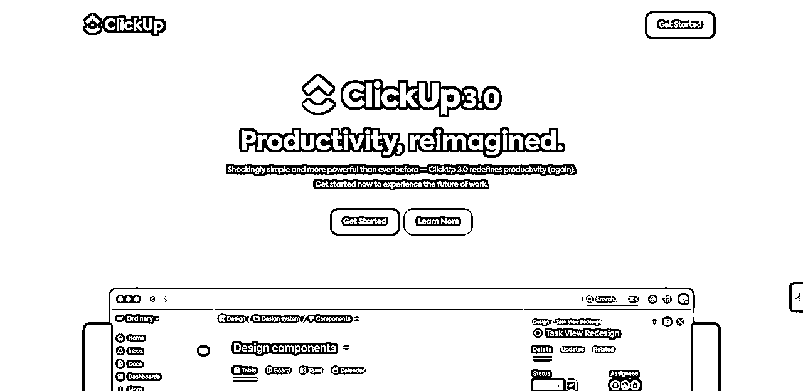

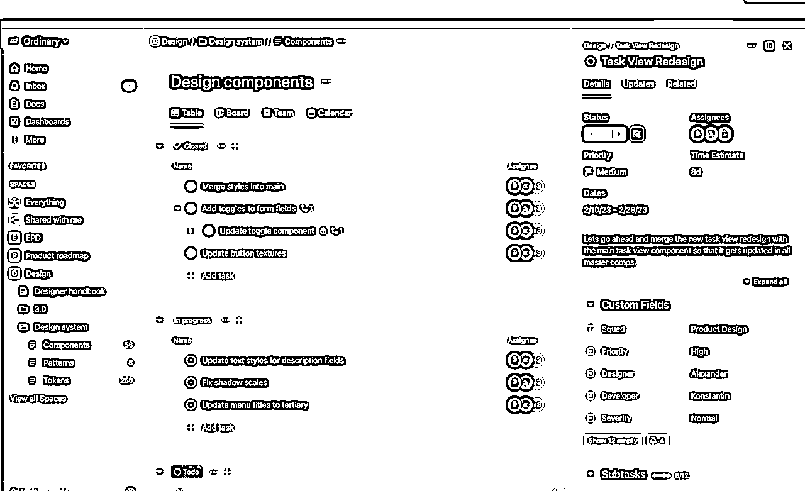

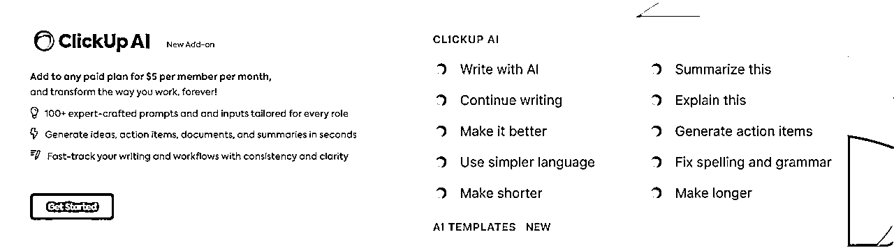

以上费用包含两部分，订阅费用和AI插件的费用，订阅费用按照团队支付，AI插件费用按照人头支付。AI功能可以试用，有点像Notion里的AI功能。

## 1 流量分析

第一步，搞清楚流量从哪里来。

一个网站流量通常分为免费流量与付费流量。

*   免费流量

*   通过运营官方twitter/youtube账号，举办活动裂变拿到更多流量。

*   付费流量

*   Affiliate

*   付费找达人做长/短视频推广

*   谷歌SEO和付费推广

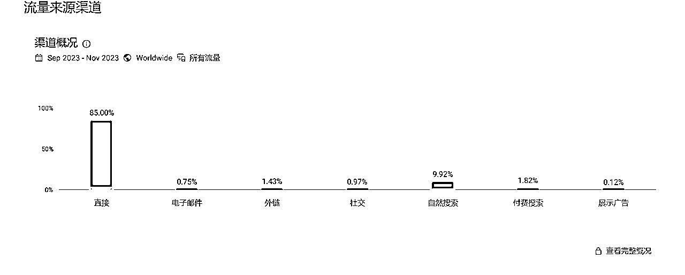

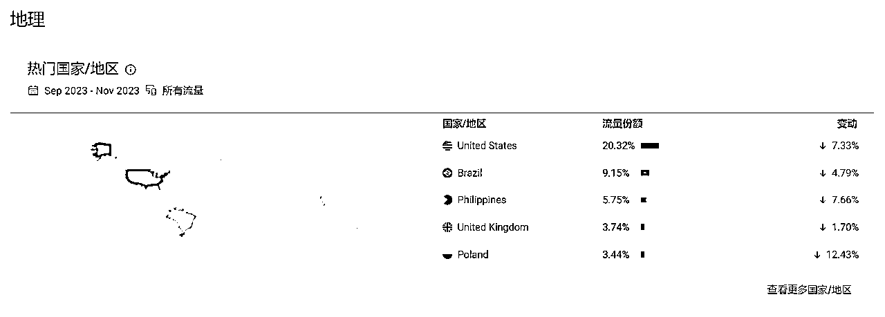

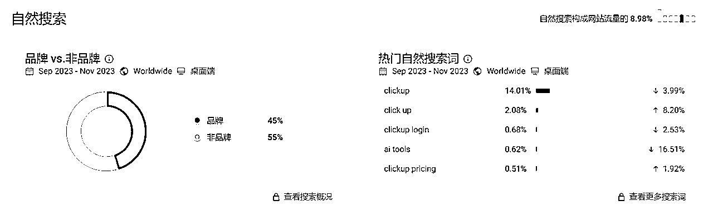

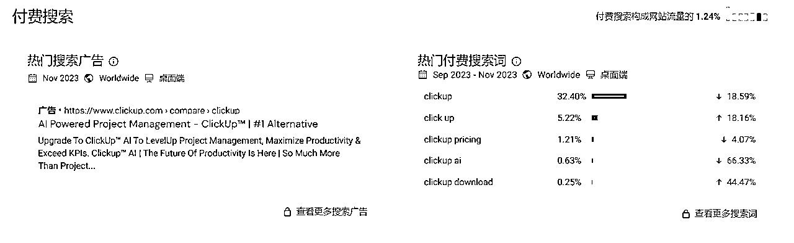

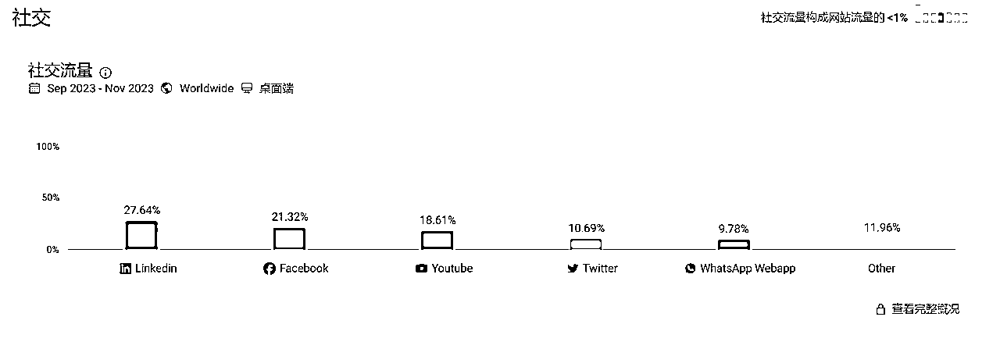

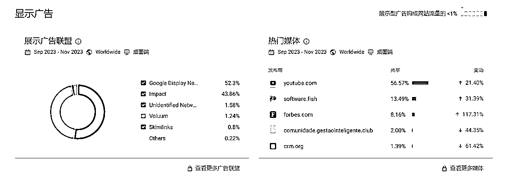

### Twitter

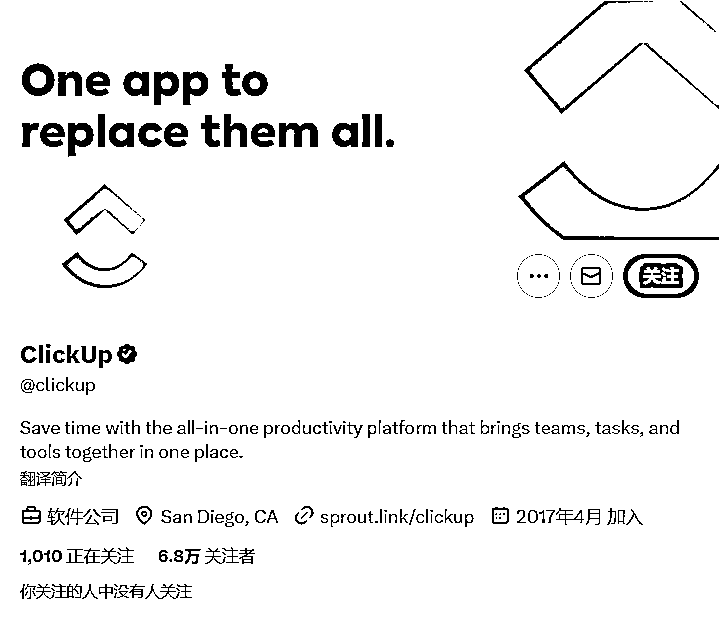

网站有官方推特运营账户，用于获取免费流量推广。

### Youtube

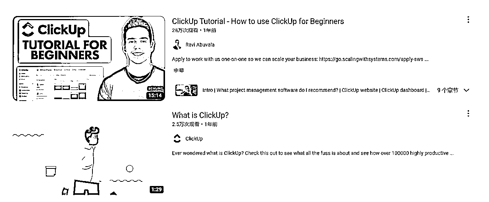

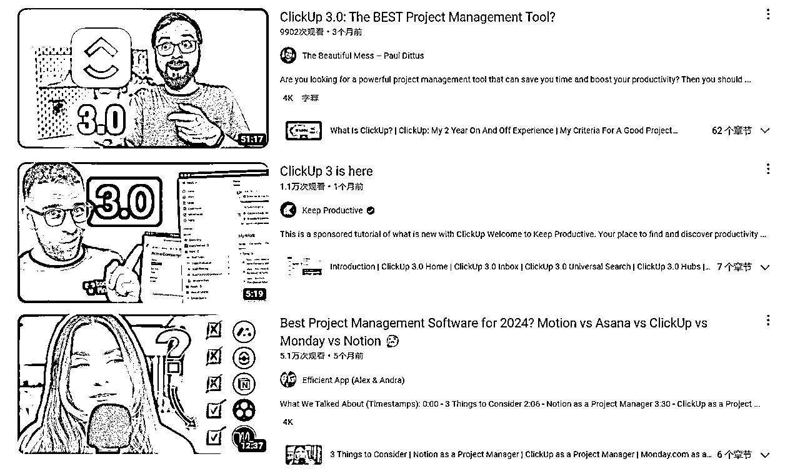

教程可能是用户自发制作，也可能是平台合作。

### Affiliate

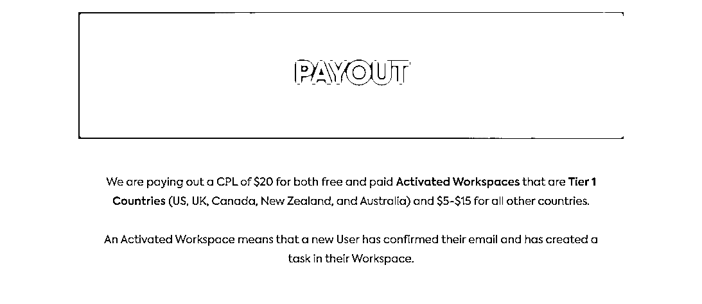

网站有推广伙伴计划，返佣为5—20刀不等。

### SEO

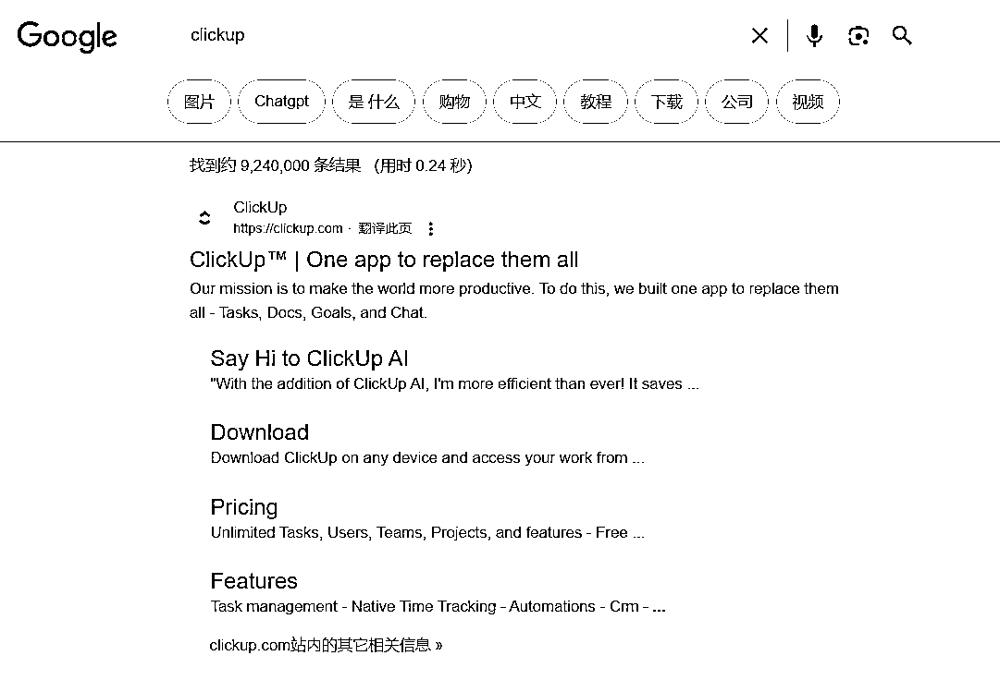

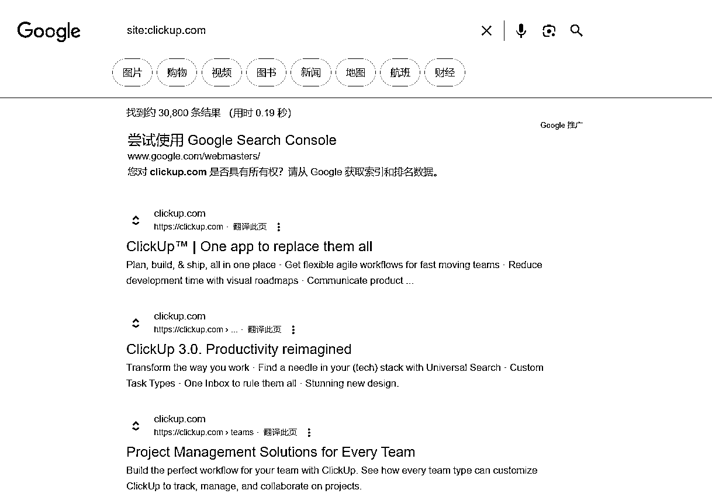

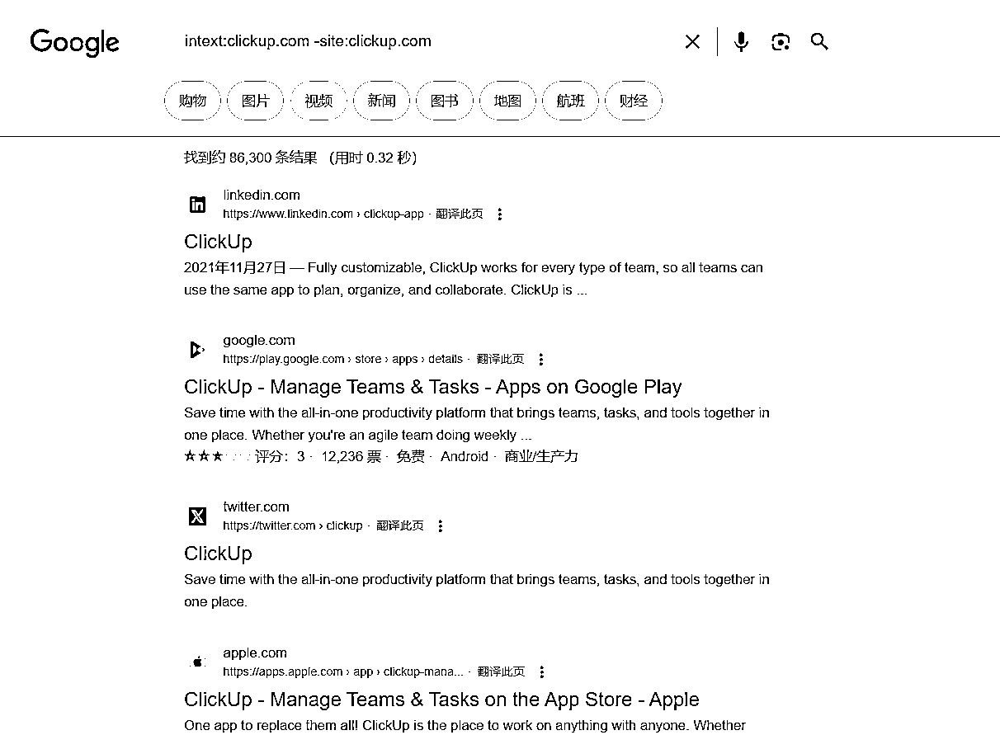

谷歌搜索核心搜索词优化到排名第一，收录页面30000+，外链86300+。

### 结论

*   Twitter：6w粉丝，有不少忠实用户。

*   Youtube：很多中长视频教程，带来不错的流量。

*   Affiliate：拥有不错的推广计划。

*   SEO：核心词Google排名第一。

## 2 产品分析

ClickUp是一个一体化的工作管理平台，旨在通过一个单一的应用程序管理任何类型的工作。该平台提供了任务、文档、目标、白板、仪表板、聊天等多种工具，以及各种整合、视图和自动化选项。ClickUp专为提高生产力、增强团队协作和提高工作可见性而设计。它通过强大的无代码自动化功能简化业务流程，适用于各种用例，包括项目管理、远程工作和客户关系管理。ClickUp广受超过两百万团队的青睐，并提供多种解决方案，适合企业、初创公司和非盈利组织等。

这个工具站本质上是一个TODO List，但是打通了多种办公应用，接入了AI功能，比较好的提升了个人和不同规模团队的生产力。

AI功能主要是用于写作。

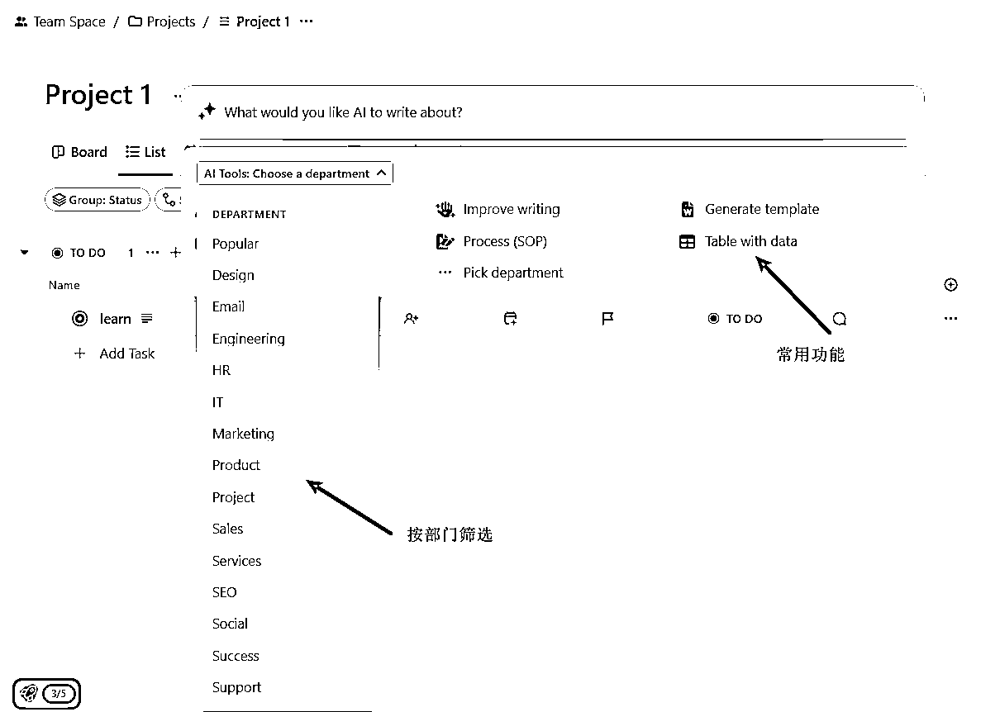

### 业务模型分析

#### 核心商业逻辑

*   ClickUp提供一个全面的工作管理解决方案，使团队能够在一个集中的平台上协作、规划和执行工作。

*   它的目标客户群体广泛，包括各种规模和行业的组织。

#### 产品与服务

*   提供一个多功能平台，包括任务管理、文档编写、目标设定、白板、仪表板和聊天等工具。

*   强大的自动化和整合功能，可以替代多个应用程序，减少应用混乱。

#### 定价策略

*   提供多层次的定价模型，以满足不同团队的需求，包括免费的基本服务和更高级的付费计划。

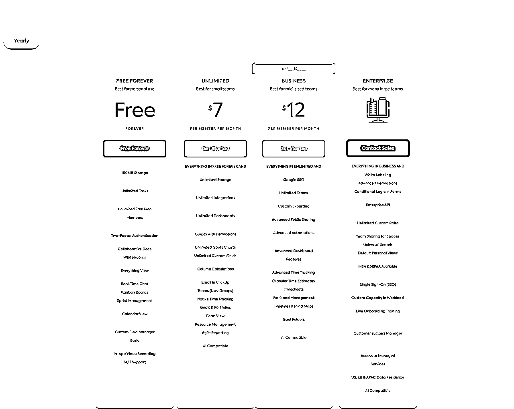

#### 盈利方式

*   主要收入来源包括付费订阅服务和专业服务。

### 市场分析

#### 竞品分析

*   竞争对手可能包括其他项目管理和协作工具，如Asana、Trello和Jira。

*   ClickUp的竞争优势在于其一体化的平台和高度灵活的定制选项。

#### 市场趋势

*   随着远程工作和团队协作需求的增加，对综合工作管理解决方案的需求也在增长。

*   ClickUp通过提供广泛的功能和灵活性，很好地适应了这些趋势。

## 3 利润估算

参考一些网站数据分析平台：

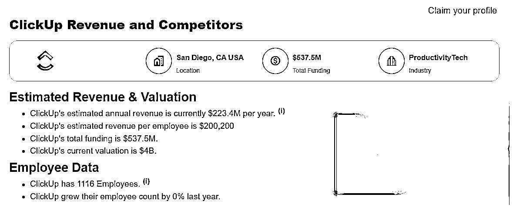

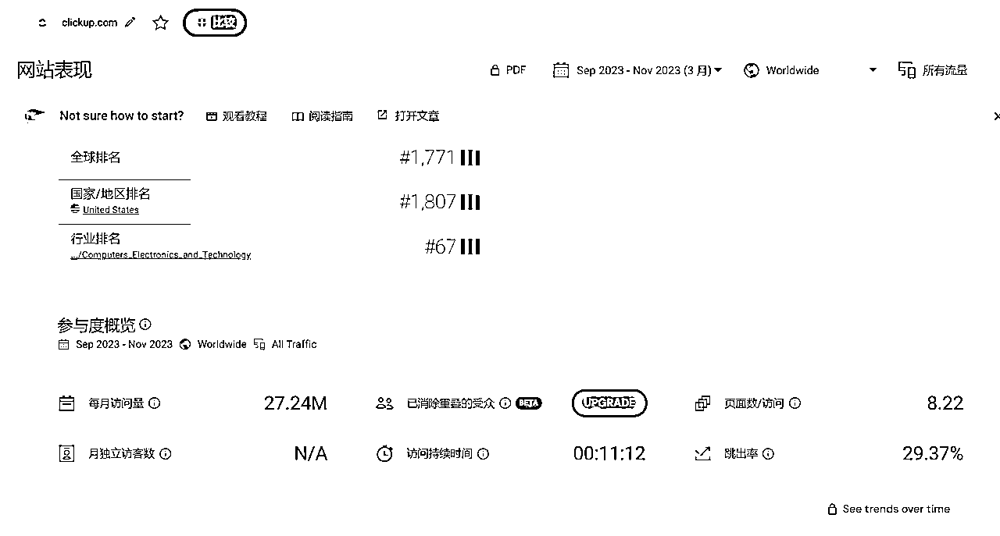

## 4 项目如何做&如何放大

### 用户视角

#### 用户体验

*   用户可以在一个地方管理所有工作，包括任务、文档、目标和沟通，从而提高效率和透明度。

*   ClickUp的多样化视图和个性化选项使团队能够根据自己的工作流程和偏好进行定制。

#### 盈利手段

*   用户通过使用ClickUp整合和简化其工作流程，从而节省时间并提高生产力。

*   提高项目管理效率和团队协作可能导致更好的业务成果和盈利能力。

### 创业视角

#### 最小可行产品 (MVP)

*   类似业务的MVP需要提供基本的任务管理、协作和定制功能。

*   关键功能可能包括灵活的任务管理、实时协作工具和简单的自动化选项。

#### 创新与优化建议

1.  引入更多先进的AI功能，以进一步提高自动化和智能推荐的能力。

1.  扩展到特定行业的解决方案，以满足更特定的需求。

1.  加强用户社区，促进用户之间的交流和最佳实践分享。

1.  提供更多本地化和定制服务，以适应全球市场。

1.  增强移动应用的功能和用户体验，以适应在途中工作的需求。

## 5 引用

### 数据分析

https://growjo.com/ 网站Growjo追踪和预测全球增长最快的公司和初创企业。该网站使用估算的年收入、竞争对手分析、员工增长率、资金新闻、销售与财务数据、估值增长以及其他增长触发因素来创建列表。2023年秋季的列表中包含了最快增长的前10,000家公司，这些公司的员工数在15到1,000人之间。Growjo还根据行业（例如金融科技或人工智能）和地区（例如硅谷）对列表进行了细分。今年，很多人工智能公司特别是生成式人工智能公司上榜，这并不令人意外，考虑到ChatGPT/OpenAI的成功。此外，由于风险投资和融资的性质，还会看到很多科技、清洁能源和生物技术公司。

https://similarweb.com 一个知名的网站分析工具。