# RPA十倍提升微信群服务效率

> 来源：[https://fv55ulg4mw.feishu.cn/docx/V98yd77tToJTdfxOmjBcxABTnTd](https://fv55ulg4mw.feishu.cn/docx/V98yd77tToJTdfxOmjBcxABTnTd)

# 项目简介

大家好，我是生财航海志愿者-David，也是服务生财同城聚会50+场的志愿者。

作为航海志愿者，一个重要工作就是航海微信群成员的服务工作。拓展开来，对于一个社群运营，如何低成本高效服务好微信群成员也是每个社群运营者需要考虑的问题。

本次航海我参加了RPA航海志愿者服务，通过RPA工具极大的提高了我服务效率。之前服务一个40人规模的微信群活动，我需要花1个小时完成加微信，建群，邀请进群这些动作；使用RPA提效工具后，我只需要花2分钟配置好参数和话术，让RPA机器人自动运行就可以。在RPA机器人执行完成后，我检查执行结果然后再做相应动作即可。另外，因为每个流程模块编写好后，我也不用担心自己手动操作会有遗漏。

# RPA提效工具介绍

*   使用RPA提效工具前需要安装uibot、chrome和WPS/Excel，点击查看：

*   请按照《12月航海 | RPA提效 | 实战手册》的【2.1 RPA相关工具准备】完成相关的准备工作。

# 航海志愿者工作流程RPA提效

## 梳理工作流程SOP

得益于生财有术对志愿者工作流程标准化的重视，这部分我主要参考《航海实战-志愿者手册》的工作流程SOP：

根据《航海实战-志愿者手册》的工作流程SOP，航海期间可以用RPA提效的部分包括

1.  登船

下图是航海志愿者邀请上船的步骤

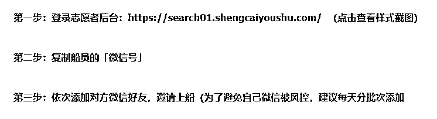

从以上步骤可以发现，①RPA可以实现在志愿者后台页面自动获取船员微信号，②添加船员微信的动作可以由RPA机器人来做

1.  沟通

志愿者每周需要与船员沟通航海进度，这个沟通过程的流程图如下：

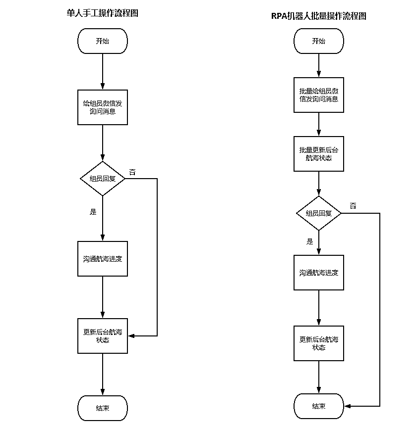

经过RPA机器人批量操作的优化，我会集中向所有船员发询问消息，并同步沟通进度到志愿者后台，以免遗漏。

## 登船流程RPA提效模块

参考《航海实战-志愿者手册》的【1.1 如何去邀请上船流程】，点击查看：

志愿者后台页面如下：

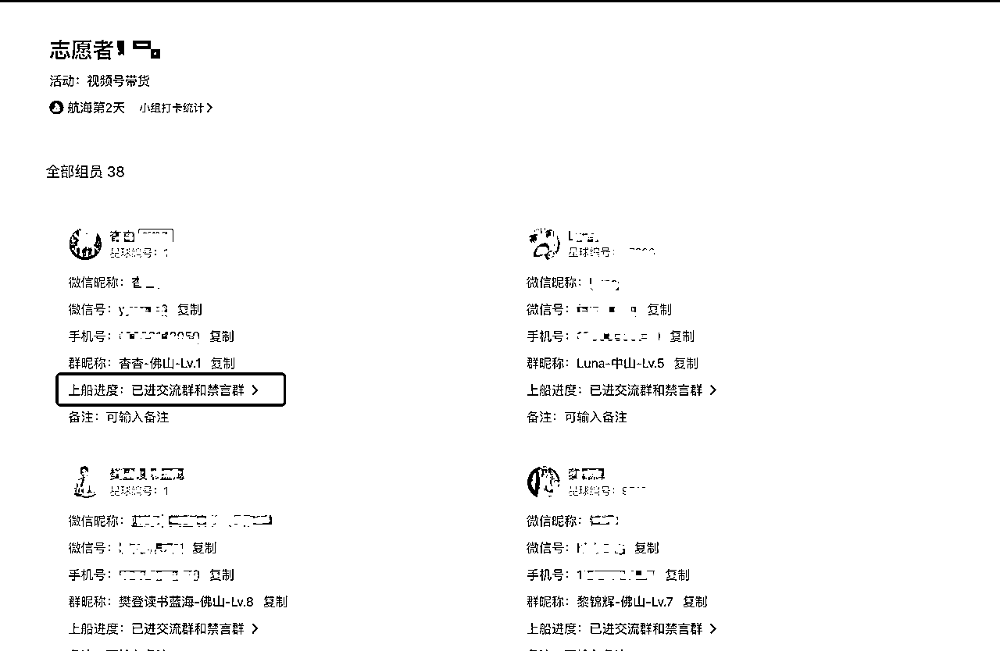

按照手工操作，我们需要一个一个把微信号复制下来，到我们的微信上逐个添加。

RPA改进后操作流程如下：

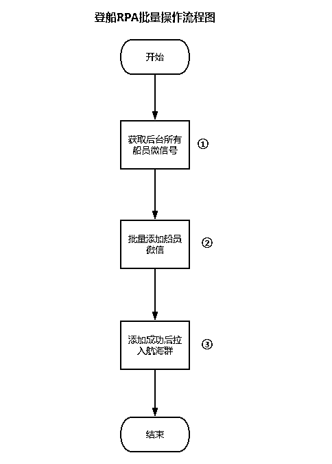

针对①获取后台所有船员微信号，我们进一步细化操作，得到RPA软件可实现的一个流程图版本

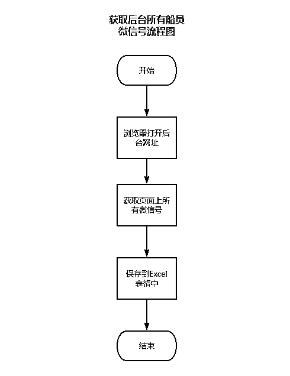

至此，一个细化的RPA流程模块就完成了，我们只需要在UiBot中把这个流程复刻出来，调试通过就可以让RPA机器人自动批量操作了。

完成的RPA流程模块如下图，整个过程可以看到，我们不需要特别的编程知识，只要我们把业务流程整理清楚，每一步都细化下来，做一个RPA机器人就是水到渠成的事情。

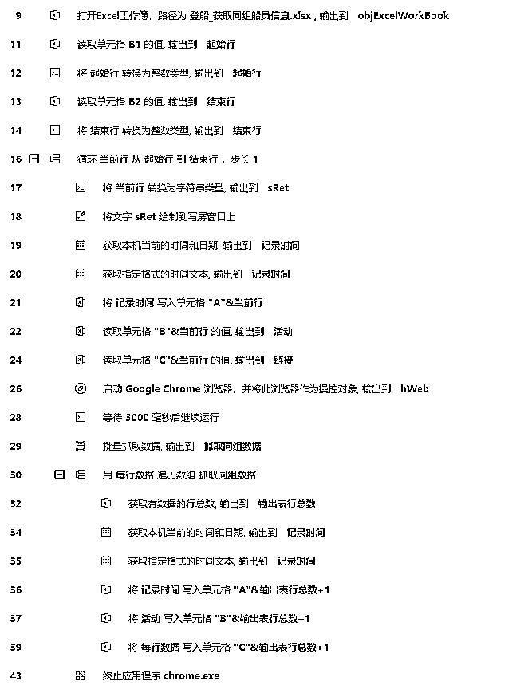

后续章节内容主要讲解每一个RPA流程模块的操作步骤和实现细节。

### 获取同组船员信息

使用的数据文件：登船_获取同组船员信息.xlsx

RPA业务流程：

#### 根据自己的航海项目修改【输入表】中的【活动】和【链接】栏内容

#### 清空输出表内容，只保留第一行标题信息

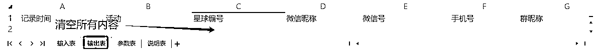

#### 退出chrome和WPS

#### 在uibot creator中运行【登船_第一步_获取同组名单】流程块

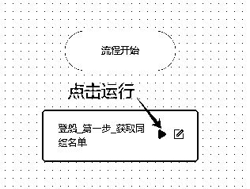

#### 运行结束后在【输出表】中将保存同组船员的信息

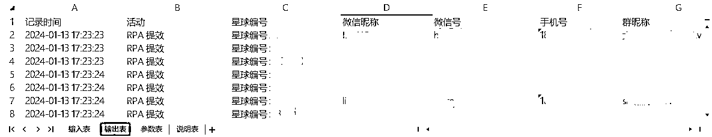

这里可以看到我们抓取到的数据有部分是重复/不完整的，因此需要做规整化操作

这里我没有使用编程过滤的方法来处理这些重复数据，是想让大家看到，使用RPA最核心的一点就是能快速实现目标得到需要的结果就好，不用纠结使用什么技术。一个技术小白，只要掌握了基本的RPA功能就可以用来提升自己的工作效率，不断在使用中提升自己的能力。

### 规整同组船员信息

输入的数据文件：登船_获取同组船员信息.xlsx

输出的数据文件：登船_规整同组船员信息.xlsx

RPA业务流程：

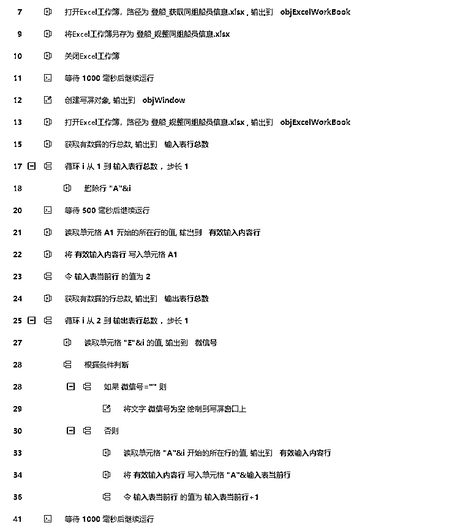

#### 在uibot creator中运行【登船_第二步_规整同组名单】流程块

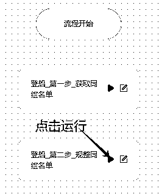

#### 运行结束后生成规整文件 res\登船_规整同组船员信息.xlsx

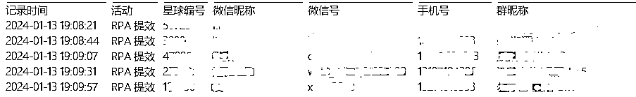

### 添加同组船员微信

使用的数据文件：登船_规整同组船员信息.xlsx

RPA业务流程：

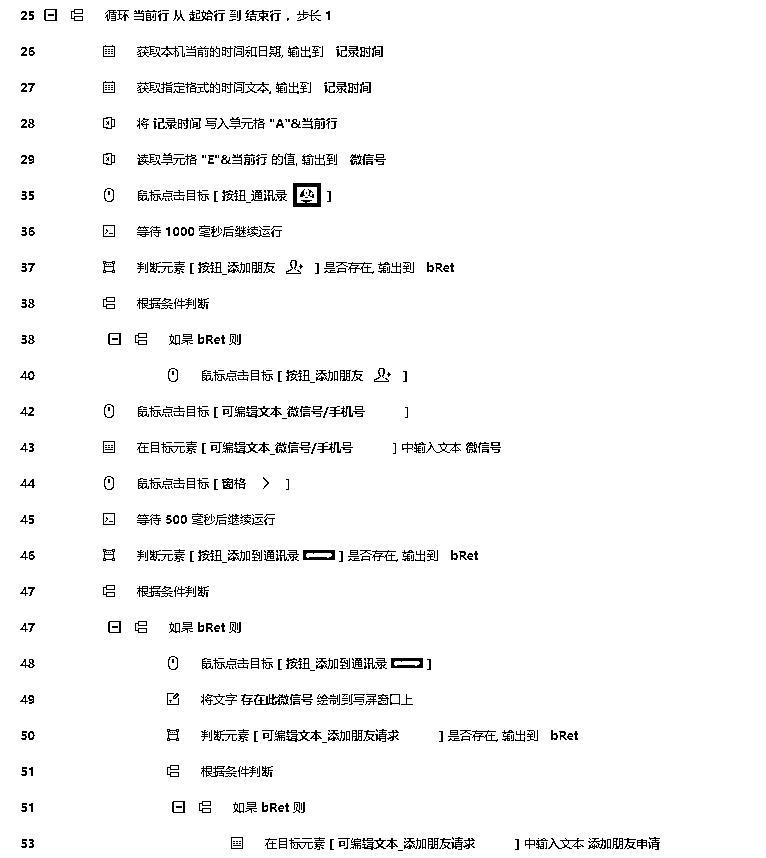

#### 登录工作微信

为了避免微信因为频繁添加好友被封禁，可以分时段分批添加，一次最多不要连续添加超过10个微信号。

可以通过调整【参数表】中的【起始行】和【结束行】来设定每次添加的微信数量。

同时，把【延时】项的数值调到100000以上，这里延时是按毫秒计算，因此100000表示需延时100000毫秒=100秒。

【添加朋友申请】项用来设定添加微信时使用的申请信息

【标签】项用来给添加的微信号设定标签，便于管理

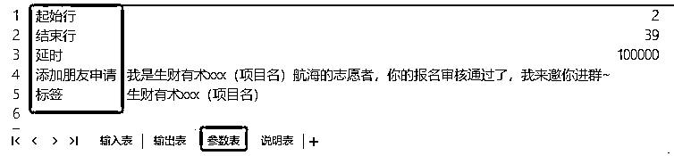

#### 在uibot creator中运行【登船_第三步_添加同组微信】流程块

运行结束后可以在【输入表】中查看添加结果。

如果【上船进度】列中显示【此微信号不存在】，则需要我们使用手机号手动再次添加。

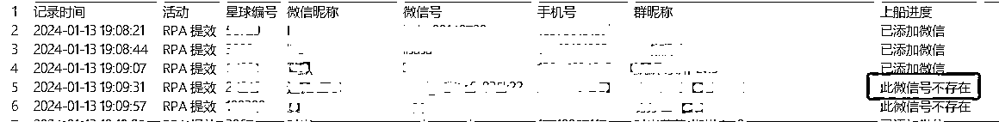

当手动添加也无法联系到船员，可以按照志愿者手册向领队反馈。

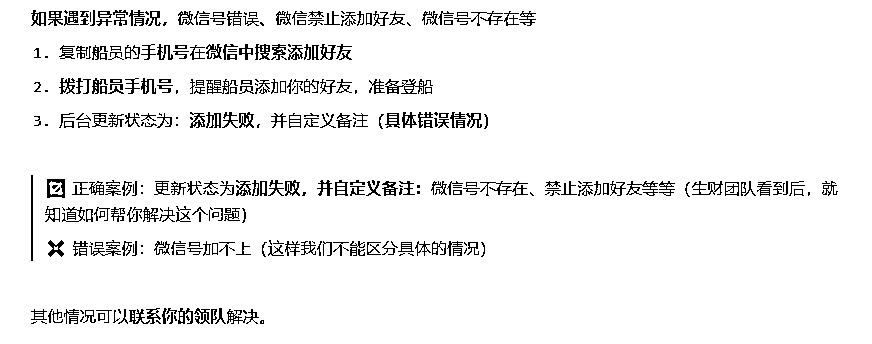

## 沟通流程RPA提效模块

在航海期间志愿者每周需要跟船员做一次沟通，跟进船员进度，提供航海支持。

这个沟通的开场部分可以使用RPA机器人来提效。

当船员有反馈，志愿者再根据反馈的内容1V1的做进一步交流。

### 获取同组船员信息

使用的数据文件：沟通_获取同组船员信息.xlsx

RPA业务流程：

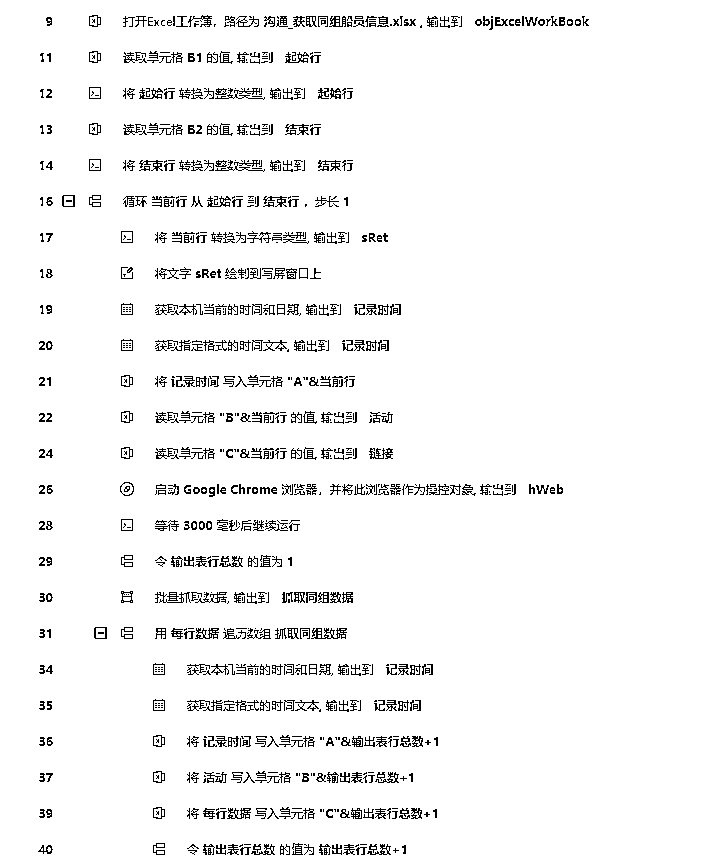

#### 根据自己的航海项目修改【输入表】中的【活动】和【链接】栏内容

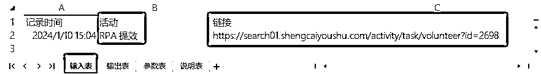

#### 清空输出表内容，只保留第一行标题信息

#### 退出chrome和WPS

#### 在uibot creator中运行【沟通_第一步_获取同组名单】流程块

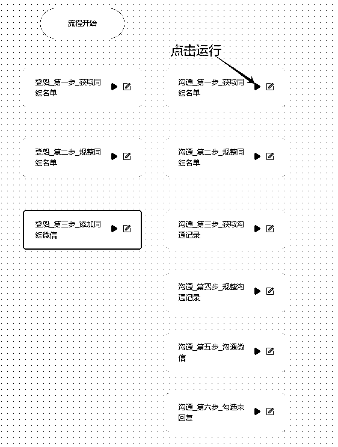

#### 运行结束后在【输出表】中将保存同组船员的信息

这里可以看到我们抓取到的数据有部分是重复/不完整的，因此需要做规整化操作

### 规整同组船员信息

输入的数据文件：沟通_获取同组船员信息.xlsx

输出的数据文件：沟通_规整同组船员信息.xlsx

RPA业务流程：

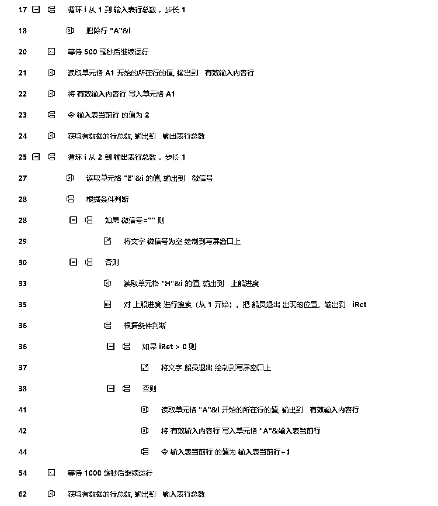

#### 在uibot creator中运行【沟通_第二步_规整同组名单】流程块

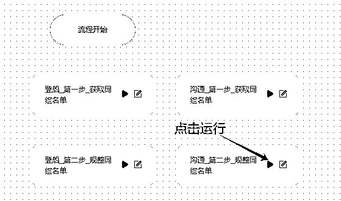

#### 运行结束后生成规整文件 res\沟通_规整同组船员信息.xlsx

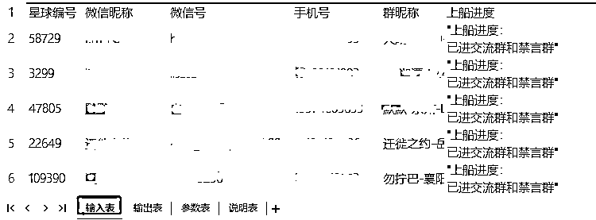

对【输入表】按照星球编号升序做一个排序

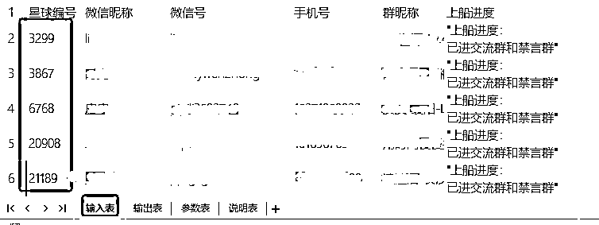

### 获取沟通记录

使用的数据文件：沟通_获取沟通信息.xlsx

RPA业务流程：

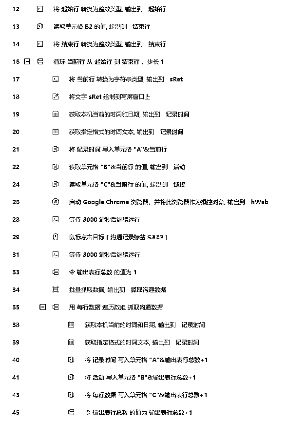

#### 根据自己的航海项目修改【输入表】中的【活动】和【链接】栏内容

#### 清空输出表内容，只保留第一行标题信息

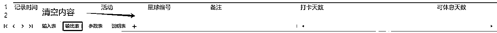

#### 退出chrome和WPS

#### 在uibot creator中运行【沟通_第三步_获取沟通记录】流程块

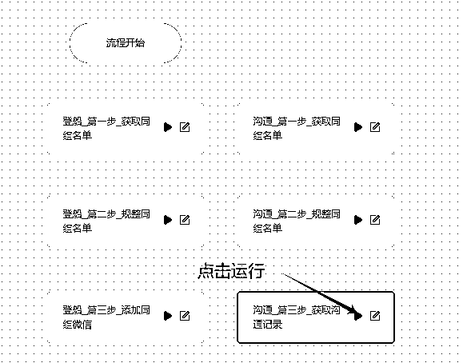

#### 运行结束后在【输出表】中将保存同组船员的沟通信息

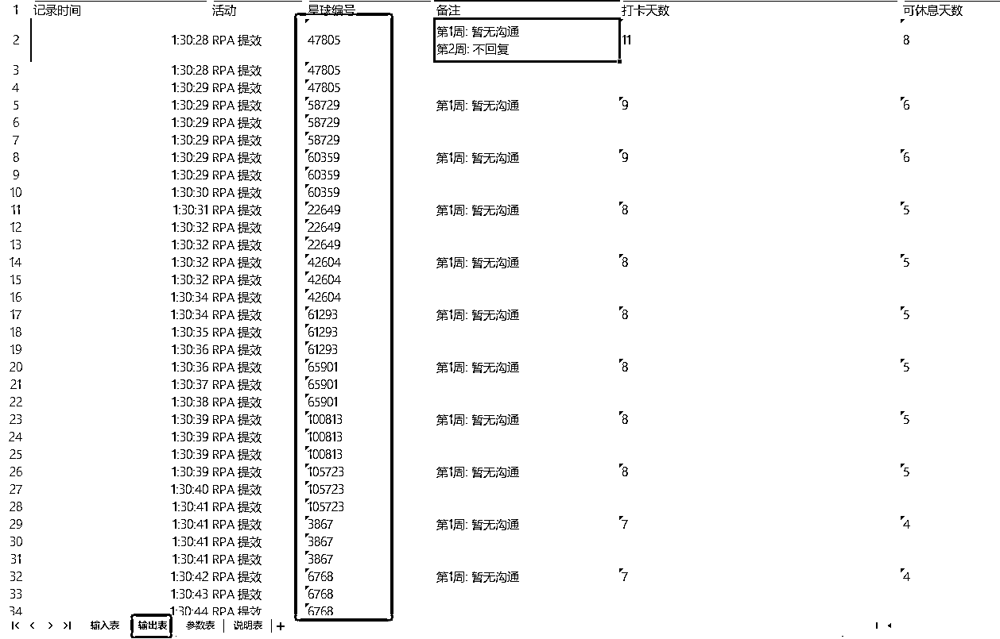

这里可以看到我们抓取到的数据有部分是重复/不完整的，因此需要做规整化操作

### 规整沟通记录

输入的数据文件：沟通_获取沟通信息.xlsx

输出的数据文件：沟通_规整沟通信息.xlsx

RPA业务流程：

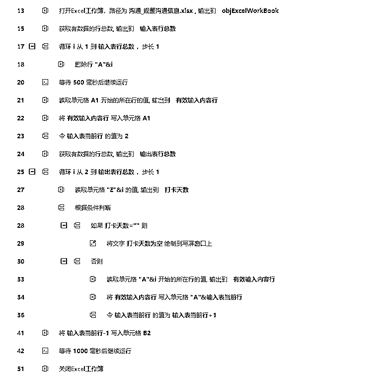

#### 在uibot creator中运行【沟通_第四步_规整沟通记录】流程块

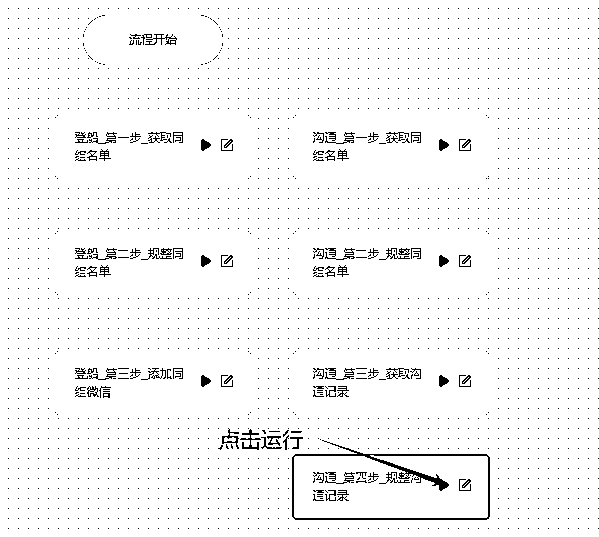

#### 运行结束后生成规整文件 res\沟通_规整同组船员信息.xlsx

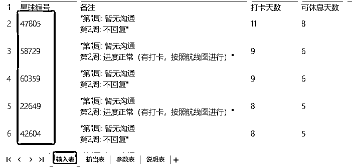

对【输入表】按照星球编号升序做一个排序

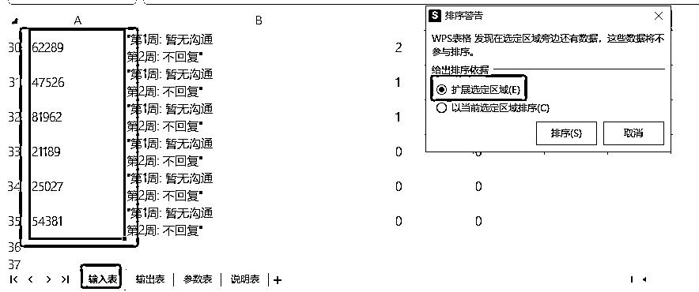

最后得到一个按星球编号升序排列的【输入表】

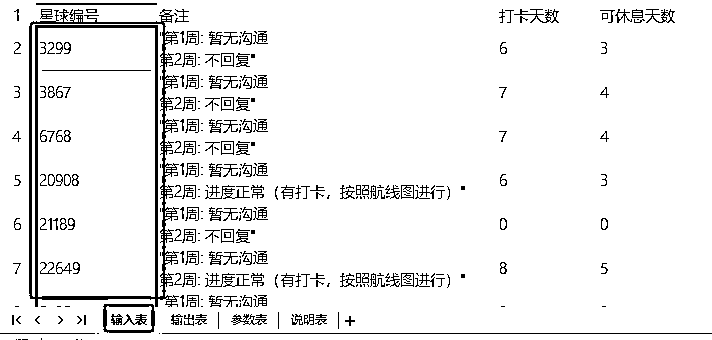

### 微信沟通

输入的数据文件：沟通_规整同组船员信息.xlsx

沟通_规整沟通信息.xlsx

输出的数据文件：沟通_排序自动沟通微信.xlsx

在开始RPA自动进行微信沟通前，我们需要合并船员的微信信息到沟通信息表中。

RPA业务流程：

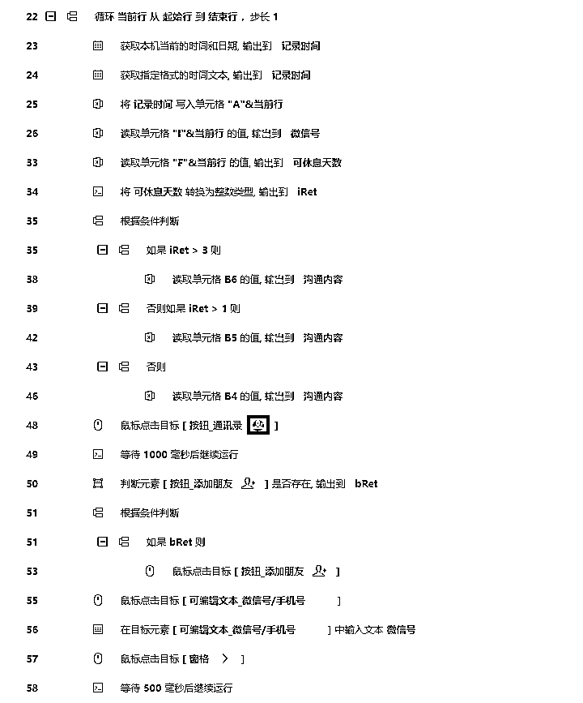

#### 复制 沟通_规整沟通信息.xlsx 到 沟通_排序自动沟通微信.xlsx

#### 将 沟通_规整同组船员信息.xlsx 中【输入表】的【星球编号】、【微信昵称】、【微信号】和【手机号】这四列复制到 沟通_排序自动沟通微信.xlsx 的【输入表】的【可休息天数】列后边

这一步完成后，需要比对一下沟通信息表的【星球编号】排序是否与船员信息表的【星球编号】一致

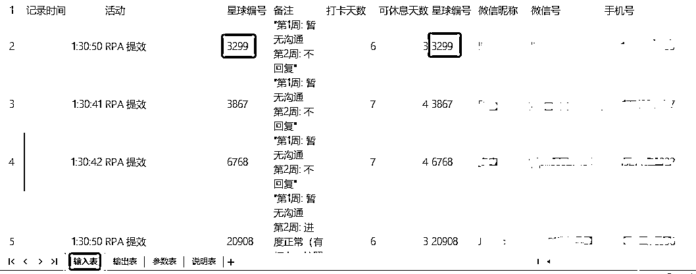

#### 在uibot creator中运行【沟通_第五步_沟通微信】流程块

使用的话术可在【参数表】中设定

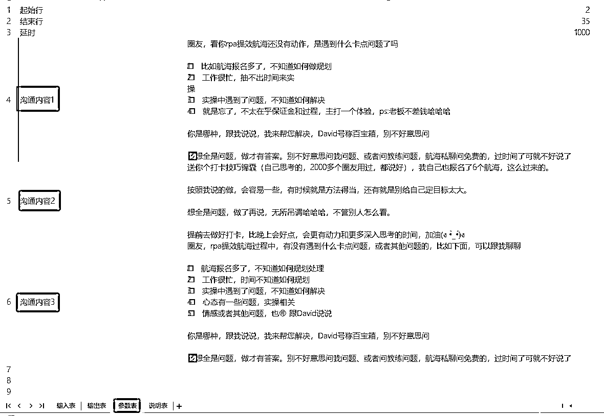

### 勾选未回复

RPA业务流程：

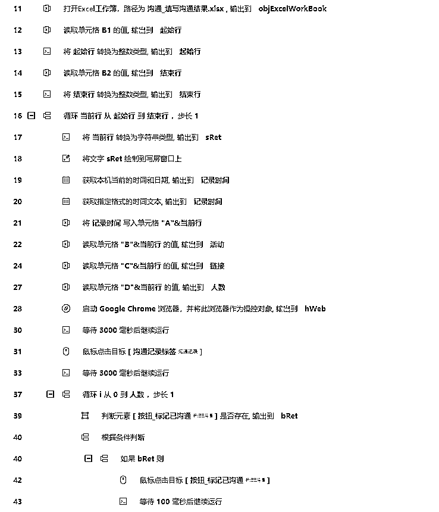

#### 在uibot creator中运行【沟通_第六步_勾选未回复】流程块

在发送完每周沟通消息后，我们同步到沟通记录页面，统一选择【不回复】

当同组船员回复消息，完成1V1的沟通后，我们再手工修改到相对于的沟通记录中。

### 问卷调查

航海进行到2/3时间时，我们需要做一次【高手领航】的回访，了解船员对航海的【高手领航】的反馈

使用的数据文件：沟通_排序自动问卷调查.xlsx

RPA业务流程：

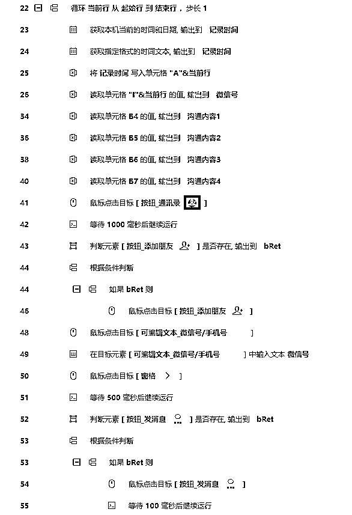

#### 在uibot creator中运行【沟通_第七步_问卷调查】流程块

使用的话术可在【参数表】中设定

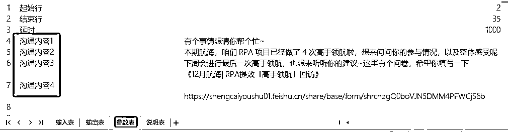

在发送完问卷调查消息后，我们可以在【输入表】中查看沟通结果

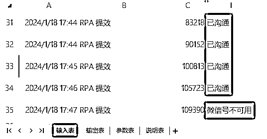

# 项目总结

## 业务流程SOP是前提

因为志愿者工作流程SOP已经很详细，所以我在实现RPA提效工具时可以只关注如何把SOP中的操作用RPA机器人自动完成。根据我的软件开发经验，业务人员对工作流程更清楚，但如果要把工作流程交给软件开发人员来实现时，软件开发人员常常不能准确理解业务流程逻辑，这样沟通成本很高，而且前期沟通不到位，后期再来改动时费时费力还可能导致项目失败。

业务人员如果自己能按照现有业务流程快速实现RPA机器人原型，完成手上工作，就会很配合实施业务流程SOP。

## RPA对非技术人员友好

整个项目实施过程中，没有涉及到编程语言的学习，所有操作都是图形化模块拖放完成的。其难度不超过航海手册的示例。而我们收获了一个功能强大的应用模块，包括：自动添加微信好友，微信消息自动发送，自动提醒，自动同步状态到网站。

## 能快速解决问题是关键

RPA能快速实现软件操作的自动化，只要你会用某个软件，就可以使用RPA工具来做这个软件的重复工作。

例如，对40个微信好友单独发送提醒消息，如果你是技术小白不会编程，你可能会找到像易歪歪这样的提效工具，但是还是需要一个个微信好友点开来发送。用RPA就比较直观了，按照平常我们给微信好友发消息的步骤配置好RPA机器人，然后让机器人自动运行就可以了。一次搭建，重复使用。

## 模块可复制可重用

在完成了生财航海微信群RPA机器人制作同时，我在生财线下同城聚会活动中也使用了这个工具，服务效率也同样十倍的提升，具体可以参考：

这得益于RPA模块的可复制可重用的特点，下一步我会把RPA机器人部署到更多的微信群业务中。

# 常见问题

## 我的电脑是Mac，能使用RPA提效工具吗

因为uibot只支持win系统，暂不支持Mac，如果您使用Mac电脑工作，需要借助云电脑来使用RPA工具。

关于MAC用户如何用RPA可以参考这份文档

## UiBot可以在哪里学习

建议使用《RPA提效-航海手册》实操入门

UiBot官方学习资料

UiBot初级开发指南：https://docs.uibot.com.cn/guide/d1/?0.7032214474897422

UiBot中级开发指南https://docs.uibot.com.cn/guide/d2/?0.1287339022662165

UiBot命令手册：https://documents.laiye.com/rpa-command-manual/docs/

UiBot教程汇总：https://forum.laiye.com/thread-50.htm?tdsourcetag=s_pcqq_aiomsg